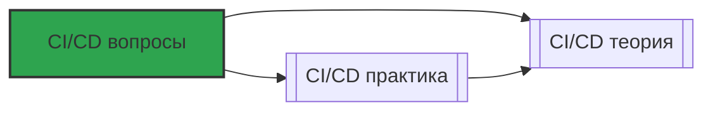

# 📄 Файл: `CI/CD вопросы.md`

tags: [cicd, github-actions, devops, interview, questions]
aliases: [cicd-questions, github-actions-qa]
created: 2026-05-07
---

# 📑 CI/CD с GitHub Actions: Вопросы для собеседования и самопроверки

> [!INFO] Структура
> Вопросы разделены по уровням: 🟢 Junior → 🟡 Middle → 🔴 Senior.  
> Каждый вопрос содержит: краткий ответ, подробное объяснение, DevOps-контекст и связанные команды.

📋 [[#🗂️ Оглавление для навигации|Оглавление]] | [[#🧪 Чек-лист подготовки|Чек-лист]] | [[#🔗 Связь с другими файлами|Связи]]

---

## 🗂️ Оглавление для навигации

### 🟢 Junior (базовое понимание)
- [[#1. Что такое CI и CD? В чём разница?|1. CI vs CD]]
- [[#2. Что такое пайплайн, джоба, шаг, экшен?|2. Компоненты пайплайна]]
- [[#3. Как запускается пайплайн в GitHub Actions?|3. Триггеры]]
- [[#4. Что такое runner и чем hosted отличается от self-hosted?|4. Runner]]
- [[#5. Как передать данные между шагами и джобами?|5. Артефакты и кэш]]
- [[#6. Что такое secrets и как их безопасно использовать?|6. Секреты]]
- [[#7. Как отменить или перезапустить пайплайн?|7. Управление запусками]]
- [[#8. Что такое environment и зачем он нужен?|8. Environments]]
- [[#9. Как посмотреть логи и отладить упавший пайплайн?|9. Отладка]]
- [[#10. Что такое workflow_dispatch и когда его использовать?|10. Ручной запуск]]

### 🟡 Middle (применение, нюансы)
- [[#11. ⭐ В чём разница между needs:, if: и concurrency?|11. Зависимости и условия ⭐]]
- [[#12. Как работает кэширование в GitHub Actions и как настроить инвалидацию?|12. Кэш]]
- [[#13. Что такое matrix strategy и когда её применять?|13. Матрицы]]
- [[#14. Как настроить деплой с manual approval в production?|14. Approval]]
- [[#15. В чём разница между upload-artifact и cache?|15. Артефакты vs кэш]]
- [[#16. Как использовать outputs для передачи данных между джобами?|16. Outputs]]
- [[#17. Что такое reusable workflow и чем он отличается от composite action?|17. Переиспользование]]
- [[#18. Как ограничить запуск пайплайна по изменению файлов (paths)?|18. Path-based triggers]]
- [[#19. Как настроить расписание запуска пайплайна (cron)?|19. Cron-триггеры]]
- [[#20. Что такое context и как использовать выражения ${{ }}?|20. Контексты]]

### 🔴 Senior (архитектура, trade-offs, troubleshooting)
- [[#21. ⭐ Как устроена безопасность пайплайнов: от токенов до OIDC?|21. Безопасность ⭐]]
- [[#22. Как оптимизировать время и стоимость выполнения пайплайна?|22. Оптимизация]]
- [[#23. Как спроектировать пайплайн для монорепозитория с 50+ сервисами?|23. Масштабирование]]
- [[#24. Что происходит "под капотом" при запуске GitHub Actions?|24. Архитектура раннеров]]
- [[#25. ⭐ Как реализовать безопасный promotion: staging → production?|25. Promotion-стратегия ⭐]]
- [[#26. Как отладить редкий флейковый тест в пайплайне?|26. Отладка флейков]]
- [[#27. Как интегрировать CI/CD с GitOps (ArgoCD/Flux)?|27. GitOps интеграция]]
- [[#28. Как обеспечить аудит и compliance в пайплайнах?|28. Аудит]]
- [[#29. Как спроектировать мульти-региональный деплой с откатом?|29. Мульти-регион]]
- [[#30. ⭐ Как выбрать между GitHub Actions, GitLab CI и Jenkins для предприятия?|30. Выбор инструмента ⭐]]

---

## 🟢 Junior (базовое понимание)

### 1. Что такое CI и CD? В чём разница?
**Кратко**: 
- **CI** (Continuous Integration) — частое слияние кода + автоматическая проверка (линтинг, тесты, сборка)
- **CD** (Continuous Delivery/Deployment) — автоматическая подготовка и/или деплой артефактов

**Подробно**:
| Практика | Суть | Результат |
|----------|------|-----------|
| CI | Разработчики мержат код в main несколько раз в день + автоматические тесты | Раннее обнаружение багов, всегда рабочий main |
| Continuous Delivery | Код всегда готов к деплою, но деплой — вручную по кнопке | Контроль над моментом релиза, безопасный rollout |
| Continuous Deployment | Каждый успешный коммит в main автоматически деплоится в prod | Максимальная скорость доставки, требует зрелости процессов |

**DevOps-контекст**: В современных командах часто используют гибрид: CI + Delivery для prod + Deployment для staging. Это даёт баланс скорости и контроля.

**Команды**: `workflow_dispatch` для ручного деплоя, `environment: production` для контроля доступа.

[[#🗂️ Оглавление для навигации|↑ К оглавлению]]

### 2. Что такое пайплайн, джоба, шаг, экшен?
**Кратко**: Иерархия абстракций в GitHub Actions: workflow → jobs → steps → actions.

**Подробно**:
```yaml
workflow (.github/workflows/ci.yml)  # Полный сценарий
│
├─ on: [push]                        # Триггеры
├─ jobs:
│   │
│   ├─ build:                        # Джоба = единица выполнения на одном раннере
│   │   ├─ runs-on: ubuntu-latest
│   │   ├─ steps:                    # Шаги выполняются последовательно
│   │   │   ├─ uses: actions/checkout@v4    # Action = переиспользуемый шаг
│   │   │   └─ run: npm test               # Прямая команда в shell
```

**DevOps-контекст**: Понимание иерархии помогает проектировать пайплайны: одна джоба = одна ответственность (build / test / deploy), что упрощает отладку и повторный запуск.

**Команды**: `needs:` для зависимостей между джобами, `if:` для условного выполнения.

[[#🗂️ Оглавление для навигации|↑ К оглавлению]]

### 3. Как запускается пайплайн в GitHub Actions?
**Кратко**: По событиям (триггерам), указанным в секции `on:` файла workflow.

**Подробно**: Основные триггеры:
```yaml
on:
  push:                    # При пуше в указанные ветки
    branches: [ main ]
  pull_request:           # При создании/обновлении PR
    branches: [ main ]
  schedule:               # По расписанию (cron)
    - cron: '0 2 * * *'
  workflow_dispatch:      # Ручной запуск из UI
  release:                # При публикации релиза
```

**DevOps-контекст**: В пайплайнах для prod часто используют комбинацию: `push` в main → CI-тесты → `workflow_dispatch` с approval → деплой.

**Команды**: `concurrency:` для предотвращения параллельных деплоев в одно окружение.

[[#🗂️ Оглавление для навигации|↑ К оглавлению]]

### 4. Что такое runner и чем hosted отличается от self-hosted?
**Кратко**: Runner — среда, где выполняется код пайплайна.

**Подробно**:
| Тип | Описание | Плюсы | Минусы |
|-----|----------|-------|--------|
| `ubuntu-latest` (GitHub-hosted) | Виртуальная машина от GitHub с предустановленными инструментами | Не нужно поддерживать, масштабируется автоматически | Ограничения по времени, нет доступа к внутренней сети |
| `self-hosted` | Ваш собственный сервер/контейнер/ВМ | Полный контроль, доступ к internal-ресурсам, кастомные инструменты | Требует управления: обновления, безопасность, масштабирование |

**DevOps-контекст**: Self-hosted раннеры критичны для: деплоя в приватный Kubernetes, работы с внутренними артефакт-репозиториями, соответствия compliance-требованиям.

**Команды**: `runs-on: [self-hosted, linux, x64]` для выбора конкретного раннера.

[[#🗂️ Оглавление для навигации|↑ К оглавлению]]

### 5. Как передать данные между шагами и джобами?
**Кратко**: 
- Между шагами: переменные окружения, файлы в рабочей папке
- Между джобами: артефакты (`upload-artifact` / `download-artifact`)

**Подробно**:
```yaml
# Передача между шагами (в одной джобе)
- name: Step 1
  run: echo "VERSION=1.2.3" >> $GITHUB_ENV

- name: Step 2
  run: echo "Building $VERSION"  # $VERSION доступно из $GITHUB_ENV

# Передача между джобами
jobs:
  build:
    steps:
      - uses: actions/upload-artifact@v4
        with:
          name: app-build
          path: dist/
  
  deploy:
    needs: build
    steps:
      - uses: actions/download-artifact@v4
        with:
          name: app-build
          path: dist/
```

**DevOps-контекст**: Артефакты — основа multi-stage пайплайнов: один раз собрали → протестировали → задеплоили тот же артефакт (immutable deployment).

**Команды**: `retention-days:` для управления сроком хранения артефактов.

[[#🗂️ Оглавление для навигации|↑ К оглавлению]]

### 6. Что такое secrets и как их безопасно использовать?
**Кратко**: Секреты — зашифрованные переменные для чувствительных данных (токены, пароли).

**Подробно**:
- Настраиваются в: `Settings → Secrets and variables → Actions`
- Доступны в пайплайне как `${{ secrets.NAME }}`
- **Никогда не логируются**: в логах отображаются как `***`

```yaml
# ✅ Правильно: через env, не логируется
- name: Deploy
  env:
    API_TOKEN: ${{ secrets.API_TOKEN }}
  run: curl -H "Authorization: Bearer $API_TOKEN" https://api.example.com

# ❌ Неправильно: может попасть в логи при ошибке
- run: echo "${{ secrets.API_TOKEN }}"  # ⚠️ Риск утечки!
```

**DevOps-контекст**: В продакшене используют `OIDC` (OpenID Connect) вместо long-lived secrets: GitHub аутентифицируется в облаке через временные токены без хранения ключей.

**Команды**: `environment:` secrets для изоляции секретов по окружениям.

[[#🗂️ Оглавление для навигации|↑ К оглавлению]]

### 7. Как отменить или перезапустить пайплайн?
**Кратко**: Через UI GitHub или API; перезапуск — кнопка "Re-run jobs".

**Подробно**:
- **Отмена**: кнопка "Cancel workflow" в UI → джобы в статусе `cancelled`
- **Перезапуск**: 
  - `Re-run all jobs` — с нуля
  - `Re-run failed jobs` — только упавшие
- **Программно**: `gh api repos/{owner}/{repo}/actions/runs/{id}/cancel`

**DevOps-контекст**: В пайплайнах с `concurrency: cancel-in-progress: true` новый пуш автоматически отменяет предыдущий запуск — экономит ресурсы и предотвращает конфликты деплоя.

**Команды**: `gh run watch <id>` для мониторинга статуса из CLI.

[[#🗂️ Оглавление для навигации|↑ К оглавлению]]

### 8. Что такое environment и зачем он нужен?
**Кратко**: Environment — механизм контроля доступа, approval и environment-specific конфигурации для деплоя.

**Подробно**:
```yaml
jobs:
  deploy-prod:
    environment: 
      name: production
      url: https://myapp.example.com  # Ссылка появится в UI после деплоя
    steps:
      - run: ./deploy.sh
```

**Возможности environment**:
- ✅ Required reviewers: деплой требует ручного подтверждения
- ✅ Wait timer: задержка перед деплоем (например, 30 минут)
- ✅ Environment-specific secrets/variables: изоляция конфигурации
- ✅ Protection rules: запрет деплоя из определённых веток

**DevOps-контекст**: Environments — основа безопасного promotion-пайплайна: staging (auto) → approval → production.

**Команды**: Настройка в `Settings → Environments` репозитория.

[[#🗂️ Оглавление для навигации|↑ К оглавлению]]

### 9. Как посмотреть логи и отладить упавший пайплайн?
**Кратко**: Вкладка "Actions" → нужный запуск → джоба → шаг → логи.

**Подробно**:
- **Логи шага**: кликнуть на шаг → развернуть лог → поиск по тексту
- **Диагностика**:
  ```yaml
  - name: Debug context
    run: echo "${{ toJSON(github) }}"  # Вывод всего контекста в JSON
  - name: Enable verbose output
    run: npm install --verbose  # Пример для Node.js
  ```
- **Локальная отладка**: инструмент [`act`](https://github.com/nektos/act) для запуска workflow локально в Docker

**DevOps-контекст**: В продакшене добавляют шаги с артефактами для отладки: логи тестов, скриншоты, метрики — даже если пайплайн упал.

**Команды**: `$GITHUB_STEP_SUMMARY` для добавления отчёта прямо в UI запуска.

[[#🗂️ Оглавление для навигации|↑ К оглавлению]]

### 10. Что такое workflow_dispatch и когда его использовать?
**Кратко**: Триггер для ручного запуска пайплайна из UI с опциональными входными параметрами.

**Подробно**:
```yaml
on:
  workflow_dispatch:
    inputs:
      environment:
        description: 'Target environment'
        required: true
        default: 'staging'
        type: choice
        options: [ staging, production ]
      version:
        description: 'Version to deploy'
        required: false
        type: string

jobs:
  deploy:
    steps:
      - run: echo "Deploying ${{ inputs.version }} to ${{ inputs.environment }}"
```

**DevOps-контекст**: Идеален для: hotfix-деплоев, ручного продвижения артефактов между окружениями, запусков миграций БД с подтверждением.

**Команды**: Запуск через UI: вкладка "Actions" → workflow → "Run workflow".

[[#🗂️ Оглавление для навигации|↑ К оглавлению]]

---

## 🟡 Middle (применение, нюансы)

### 11. ⭐ В чём разница между `needs:`, `if:` и `concurrency:`?
**Кратко**: 
- `needs:` — зависимости между джобами (что должно выполниться перед)
- `if:` — условие выполнения джобы/шага
- `concurrency:` — управление параллельными запусками

**Подробно**:
```yaml
jobs:
  test:
    runs-on: ubuntu-latest
  
  deploy:
    needs: test                    # ✅ Запускается только после успешного test
    if: github.ref == 'refs/heads/main'  # ✅ Только если пуш в main
    concurrency:                   # ✅ Отменяет предыдущие запуски этого окружения
      group: deploy-${{ github.ref }}
      cancel-in-progress: true
    steps:
      - run: ./deploy.sh
```

**DevOps-контекст**: Комбинация этих механизмов — основа надёжных пайплайнов: `needs` гарантирует порядок, `if` — целевой запуск, `concurrency` — предотвращение конфликтов деплоя.

**Команды**: `always()`, `success()`, `failure()` в выражениях `if:`.

[[#🗂️ Оглавление для навигации|↑ К оглавлению]]

### 12. Как работает кэширование в GitHub Actions и как настроить инвалидацию?
**Кратко**: `actions/cache@v4` сохраняет файлы по ключу; инвалидация — при изменении ключа.

**Подробно**:
```yaml
- name: Cache dependencies
  uses: actions/cache@v4
  with:
    path: ~/.npm
    key: ${{ runner.os }}-npm-${{ hashFiles('**/package-lock.json') }}
    restore-keys: |
      ${{ runner.os }}-npm-
```

**Как работает**:
1. При первом запуске: кэш не найден → выполняется шаг → сохраняется под `key`
2. При следующем: ищется точное совпадение `key` → если нет, ищется по `restore-keys`
3. `hashFiles()` гарантирует: изменился `package-lock.json` → новый ключ → свежий кэш

**DevOps-контекст**: Правильный кэш ускоряет пайплайны в 5-10 раз. Ошибка: кэш без `hashFiles()` → использование устаревших зависимостей → флакки-тесты.

**Команды**: `cache-hit` output действия для условной логики: "если кэш попал → пропустить установку".

[[#🗂️ Оглавление для навигации|↑ К оглавлению]]

### 13. Что такое matrix strategy и когда её применять?
**Кратко**: Автоматическое создание джоб для каждой комбинации параметров (ОС × версия языка × конфигурация).

**Подробно**:
```yaml
strategy:
  matrix:
    os: [ ubuntu-latest, windows-latest ]
    node-version: [ 16, 18, 20 ]
    exclude:
      - os: windows-latest
        node-version: 16  # Windows не поддерживаем на старом Node
  fail-fast: false  # Продолжать тестировать, даже если одна комбинация упала
```

**DevOps-контекст**: Матрицы критичны для: кросс-платформенных библиотек, приложений с разными рантаймами, тестирования на нескольких версиях зависимостей.

**Команды**: `${{ matrix.os }}`, `${{ matrix.node-version }}` для использования значений в шагах.

[[#🗂️ Оглавление для навигации|↑ К оглавлению]]

### 14. Как настроить деплой с manual approval в production?
**Кратко**: Через `environment: production` с required reviewers в настройках репозитория.

**Подробно**:
1. В `Settings → Environments` создать `production`
2. Включить "Required reviewers" → выбрать людей/команды
3. В пайплайне:
   ```yaml
   jobs:
     deploy-prod:
       environment: production
       steps:
         - run: ./deploy-prod.sh  # Запустится только после аппрува
   ```

**DevOps-контекст**: Approval — обязательный этап для соответствия стандартам (SOC2, ISO27001). В продвинутых сценариях: approval + автоматические проверки (canary, метрики) перед финальным подтверждением.

**Команды**: `environment: { name: prod, url: https://... }` для добавления кнопки "View deployment" в UI.

[[#🗂️ Оглавление для навигации|↑ К оглавлению]]

### 15. В чём разница между `upload-artifact` и `cache`?
**Кратко**: 
- `cache` — для ускорения повторных запусков (между разными запусками воркфлоу)
- `upload-artifact` — для передачи данных между джобами в одном запуске

**Подробно**:
| Характеристика | `actions/cache@v4` | `upload-artifact@v4` |
|---------------|-------------------|---------------------|
| Назначение | Ускорение установки зависимостей | Передача артефактов сборки |
| Срок хранения | Авто-удаление после 7 дней неиспользования | Настраивается (`retention-days`) |
| Доступность | Между разными запусками, репозиториями | Только внутри одного запуска воркфлоу |
| Лимит | 10 GB на репозиторий | 10 GB на репозиторий |
| Ключ | Должен быть детерминированным (`hashFiles`) | Имя артефакта (любая строка) |

**DevOps-контекст**: Типичный паттерн: `cache` для `node_modules`/`~/.m2` + `upload-artifact` для `dist/`/`*.tar` → `download-artifact` в джобе деплоя.

**Команды**: `if-no-files-found: error` в `upload-artifact` для fail-fast при ошибке сборки.

[[#🗂️ Оглавление для навигации|↑ К оглавлению]]

### 16. Как использовать `outputs` для передачи данных между джобами?
**Кратко**: Через `jobs.<job_id>.outputs` и `${{ needs.<job>.outputs.<name> }}`.

**Подробно**:
```yaml
jobs:
  build:
    runs-on: ubuntu-latest
    outputs:
      image-tag: ${{ steps.meta.outputs.tags }}  # Проброс выхода шага
    steps:
      - id: meta
        run: echo "tags=myapp:${{ github.sha }}" >> $GITHUB_OUTPUT
  
  deploy:
    needs: build
    runs-on: ubuntu-latest
    steps:
      - run: echo "Deploying ${{ needs.build.outputs.image-tag }}"
```

**DevOps-контекст**: Outputs — основа immutable deployment: один раз собрали образ с тегом → передали тег в джобы тестов и деплоя → гарантируем, что везде один и тот же артефакт.

**Команды**: `$GITHUB_OUTPUT` для записи, `${{ steps.<id>.outputs.<name> }}` для чтения в пределах джобы.

[[#🗂️ Оглавление для навигации|↑ К оглавлению]]

### 17. Что такое reusable workflow и чем он отличается от composite action?
**Кратко**: 
- `Reusable workflow` — целый воркфлоу, вызываемый из другого (как функция)
- `Composite action` — переиспользуемый шаг внутри одного воркфлоу

**Подробно**:
```yaml
# 🔹 Reusable workflow (.github/workflows/reusable-test.yml)
on:
  workflow_call:  # ← Ключевое отличие
    inputs:
      python-version: { type: string, required: true }
    secrets:
      CODECOV_TOKEN: { required: false }

# Вызов:
- uses: ./.github/workflows/reusable-test.yml
  with: { python-version: '3.11' }
  secrets: { CODECOV_TOKEN: ${{ secrets.CODECOV_TOKEN }} }

# 🔹 Composite action (.github/actions/setup-python/action.yml)
runs:
  using: composite  # ← Ключевое отличие
  steps:
    - uses: actions/setup-python@v5
      with: { python-version: ${{ inputs.python-version }} }
```

**DevOps-контекст**: Reusable workflows идеальны для: монорепозиториев (единая логика тестов для 10 сервисов), организаций с едиными стандартами. Composite actions — для DRY внутри одного пайплайна.

**Команды**: `secrets: inherit` для передачи всех секретов (менее безопасно, чем явное перечисление).

[[#🗂️ Оглавление для навигации|↑ К оглавлению]]

### 18. Как ограничить запуск пайплайна по изменению файлов (`paths`)?
**Кратко**: Через `on.push.paths` и `on.pull_request.paths` для запуска только при изменении релевантных файлов.

**Подробно**:
```yaml
on:
  push:
    paths:
      - 'src/**'
      - 'package.json'
      - '.github/workflows/ci.yml'  # Изменение самого пайплайна тоже триггерит
    paths-ignore:
      - '**.md'
      - 'docs/**'
      - 'tests/fixtures/**'
```

**DevOps-контекст**: Path-based triggers экономят compute-минуты: не запускать тяжёлые E2E-тесты при изменении документации. В монорепозиториях — основа эффективного параллелизма.

**Команды**: В GitLab CI аналог: `rules:changes`; в GitHub Actions — `paths` + `if:` для сложной логики.

[[#🗂️ Оглавление для навигации|↑ К оглавлению]]

### 19. Как настроить расписание запуска пайплайна (`cron`)?
**Кратко**: Через `on.schedule` с синтаксисом POSIX cron.

**Подробно**:
```yaml
on:
  schedule:
    - cron: '0 2 * * *'        # Каждый день в 02:00 UTC
    - cron: '0 0 * * 1'        # Каждый понедельник в 00:00
    - cron: '*/15 * * * *'     # Каждые 15 минут (осторожно с лимитами!)
```

**Важные нюансы**:
- Время — всегда UTC
- Запуск может задерживаться на несколько минут при высокой нагрузке GitHub
- Для тестов: используйте `workflow_dispatch` параллельно с `schedule`

**DevOps-контекст**: Cron-пайплайны используют для: ночных тестов на стабильность, регулярного сканирования уязвимостей, очистки временных ресурсов, синхронизации с внешними системами.

**Команды**: `gh workflow run <name>` для ручного тестирования cron-воркфлоу.

[[#🗂️ Оглавление для навигации|↑ К оглавлению]]

### 20. Что такое context и как использовать выражения `${{ }}`?
**Кратко**: Контексты — объекты с данными о запуске; выражения вычисляются до выполнения шага.

**Подробно**: Основные контексты:
```yaml
env:
  REPO: ${{ github.repository }}      # owner/repo
  SHA: ${{ github.sha }}              # хеш коммита
  ACTOR: ${{ github.actor }}          # кто запустил
  REF: ${{ github.ref_name }}         # имя ветки/тега

jobs:
  deploy:
    if: ${{ github.ref == 'refs/heads/main' && success() }}
    steps:
      - run: echo "Token: ${{ secrets.API_KEY }}"  # Секреты маскируются в логах
```

**Ограничения выражений**:
- Вычисляются **до** выполнения шага → нельзя использовать вывод шага в `if:` другого без `outputs`
- Не поддерживают произвольный JavaScript — только ограниченный набор функций

**DevOps-контекст**: Контексты — основа динамических пайплайнов: разные действия для PR/push/tag, условный деплой, генерация уникальных тегов.

**Команды**: `toJSON()`, `fromJson()`, `contains()`, `startsWith()` — встроенные функции выражений.

[[#🗂️ Оглавление для навигации|↑ К оглавлению]]

---

## 🔴 Senior (архитектура, trade-offs, troubleshooting)

### 21. ⭐ Как устроена безопасность пайплайнов: от токенов до OIDC?
**Кратко**: Многоуровневая модель: токены репозитория → environment secrets → OIDC для облаков.

**Подробно**:
```
Уровень 1: GITHUB_TOKEN (автоматический)
├─ Выдаётся каждому запуску, срок — длительность джобы
├─ Права настраиваются через `permissions:`
└─ Риск: если пайплайн скомпрометирован — злоумышленник получает доступ к репо

Уровень 2: Repository/Environment secrets
├─ Хранятся зашифрованными, маскируются в логах
├─ Environment secrets изолированы от других окружений
└─ Риск: long-lived keys → при утечке нужен ручной ротейшн

Уровень 3: OIDC (OpenID Connect) — best practice
├─ GitHub аутентифицируется в облаке (AWS/Azure/GCP) через временные токены
├─ Нет долгоживущих секретов в репо
└─ Требует настройки trust policy на стороне облака
```

**DevOps-контекст**: Для продакшена: минимальные `permissions:`, environment secrets для изоляции, OIDC для облачных деплоев, регулярный аудит через `audit log`.

**Команды**: `aws-actions/configure-aws-credentials@v4` с `role-to-assume` для OIDC в AWS.

[[#🗂️ Оглавление для навигации|↑ К оглавлению]]

### 22. Как оптимизировать время и стоимость выполнения пайплайна?
**Кратко**: Комбинация: shallow clone + кэш + параллелизация + условный запуск.

**Подробно**: Стратегии оптимизации:
| Метод | Экономия | Когда применять |
|-------|----------|----------------|
| `fetch-depth: 1` | 30с → 2с на клон | Если не нужна полная история |
| `actions/cache@v4` с `hashFiles()` | 5-10× ускорение зависимостей | Проекты с тяжёлыми dependency trees |
| `concurrency: cancel-in-progress` | Экономия минут на отменённых запусках | Частые пуши в одну ветку |
| `matrix` + `fail-fast: false` | Параллелизация без каскадных сбоев | Кросс-платформенное тестирование |
| `paths` triggers | Не запускать при изменении docs/ | Монорепозитории, крупные проекты |

**Пример оптимизированного клонирования**:
```yaml
- uses: actions/checkout@v4
  with:
    fetch-depth: 1
    filter: blob:none          # Partial clone: метаданные сразу
    sparse-checkout: |         # Загрузить только нужные папки
      src/
      package.json
```

**DevOps-контекст**: Оптимизация — итеративный процесс: сначала рабочий пайплайн, потом профилирование (`actions/cache` хиты, время шагов), потом точечные улучшения.

**Команды**: `gh run view <id> --log` для анализа времени выполнения шагов.

[[#🗂️ Оглавление для навигации|↑ К оглавлению]]

### 23. Как спроектировать пайплайн для монорепозитория с 50+ сервисами?
**Кратко**: Композиция: path-based triggers + reusable workflows + матричная параллелизация + кэширование.

**Подробно**: Архитектурные паттерны:
```
1. Детектирование изменений:
   on.push.paths: ['services/service-a/**', 'libs/shared/**']

2. Переиспользуемая логика:
   .github/workflows/reusable-test.yml (один файл для всех сервисов)

3. Параллелизация:
   strategy.matrix: сервисы, но с лимитом max-parallel: 10

4. Кэширование:
   - Общий кэш зависимостей (libs/shared)
   - Индивидуальный кэш для каждого сервиса

5. Артефакты:
   - Сборка → артефакт → тесты → деплой (immutable)
```

**DevOps-контекст**: В монорепозиториях критично: `--filter=blob:none` для клонирования, `sparse-checkout` для работы с подпапками, `bazel`/`nx` для инкрементальной сборки.

**Команды**: `git sparse-checkout set services/service-a` для работы с частью репо.

[[#🗂️ Оглавление для навигации|↑ К оглавлению]]

### 24. Что происходит "под капотом" при запуске GitHub Actions?
**Кратко**: Оркестрация: планирование → выделение раннера → клонирование → выполнение → артефакты → очистка.

**Подробно**: Жизненный цикл запуска:
```
1. Триггер события → GitHub создаёт "рун" в базе
2. Планировщик ищет доступный раннер (по `runs-on`)
3. Раннер:
   ├─ Клонирует репо (с учётом fetch-depth, sparse-checkout)
   ├─ Устанавливает зависимости (через actions/setup-*)
   ├─ Выполняет шаги последовательно (с остановкой при ошибке)
   ├─ Загружает артефакты в хранилище
   └─ Отправляет логи и статус обратно в GitHub
4. GitHub обновляет UI, отправляет уведомления, применяет retention-политики
```

**DevOps-контекст**: Понимание цикла помогает отлаживать: таймауты (лимит 6 часов на джобу), проблемы с сетью (раннер не видит internal-ресурсы), кэш-промахи (неверный ключ).

**Команды**: `ACTIONS_RUNNER_DEBUG=true` для включения отладочных логов раннера.

[[#🗂️ Оглавление для навигации|↑ К оглавлению]]

### 25. ⭐ Как реализовать безопасный promotion: staging → production?
**Кратко**: Комбинация: immutable артефакты + environment approval + автоматические чеки + откат.

**Подробно**: Паттерн promotion-пайплайна:
```yaml
# Этап 1: Сборка (один раз)
build:
  steps:
    - run: docker build -t myapp:${{ github.sha }} .
    - uses: actions/upload-artifact@v4  # Сохраняем образ

# Этап 2: Staging (автоматически)
deploy-staging:
  needs: build
  environment: staging
  steps:
    - uses: actions/download-artifact@v4  # Тот же образ!
    - run: ./deploy.sh staging
    - run: ./smoke-test.sh  # Автоматические проверки

# Этап 3: Production (с approval)
deploy-prod:
  needs: [build, deploy-staging]
  environment: 
    name: production
    url: https://myapp.example.com
  steps:
    - uses: actions/download-artifact@v4  # Опять тот же образ
    - run: ./deploy.sh production
    - run: ./canary-check.sh  # Пост-деплой валидация
```

**Ключевые принципы**:
- ✅ **Immutable**: один артефакт проходит все окружения
- ✅ **Approval**: ручное подтверждение + автоматические метрики
- ✅ **Rollback**: `git revert` + перезапуск пайплайна = мгновенный откат

**DevOps-контекст**: Для zero-downtime: blue-green или canary-деплой + мониторинг ошибок/латентности + автоматический откат при деградации.

**Команды**: `argocd app sync` для GitOps-синхронизации после деплоя манифестов.

[[#🗂️ Оглавление для навигации|↑ К оглавлению]]

### 26. Как отладить редкий флейковый тест в пайплайне?
**Кратко**: Стратегия: воспроизведение локально + изоляция фактора + ретраи + алертинг.

**Подробно**: Пошаговый подход:
```
1. Воспроизведение:
   - Запустить тест локально с теми же переменными окружения
   - Использовать `act` для запуска workflow локально в Docker

2. Изоляция:
   - Добавить логирование: `DEBUG=* npm test`
   - Зафиксировать окружение: версии ОС, рантайма, зависимостей
   - Проверить race conditions: запустить тест 100 раз подряд

3. Стабилизация:
   - Добавить ретраи: `if: failure()` + повторный запуск шага
   - Увеличить таймауты: `timeout-minutes: 10`
   - Использовать `exit 125` в `git bisect run` для пропуска флейков

4. Мониторинг:
   - Отслеживать flakiness rate в метриках
   - Алерт при превышении порога (например, >5% падений без изменений кода)
```

**DevOps-контекст**: Флейки подрывают доверие к пайплайну. Best practice: quarantined tests (отдельная джоба, не блокирующая деплой) + обязательный фикс перед мержем.

**Команды**: `--flakes=<N>` в pytest, `retry` action для повторных попыток.

[[#🗂️ Оглавление для навигации|↑ К оглавлению]]

### 27. Как интегрировать CI/CD с GitOps (ArgoCD/Flux)?
**Кратко**: Разделение ответственности: CI собирает артефакты и пушит манифесты в Git, GitOps-оператор синхронизирует кластер.

**Подробно**: Архитектура:
```
[Разработчик] → push кода → [CI: GitHub Actions]
                              │
                              ├─ Сборка: docker build → push в registry
                              ├─ Обновление манифестов: изменить image tag в k8s/
                              └─ Push манифестов в Git (в ту же или отдельную ветку)
                                      │
                                      ▼
                           [Git: репозиторий с манифестами]
                                      │
                                      ▼
                           [GitOps-оператор: ArgoCD/Flux]
                                      │
                                      ▼
                           [Kubernetes: apply изменений]
```

**DevOps-контекст**: Преимущества:
- ✅ **Аудит**: кто, что, когда изменил — вся история в Git
- ✅ **Откат**: `git revert` = мгновенный rollback без переписывания истории
- ✅ **Согласованность**: нет дрейфа — все окружения синхронизируются из одного источника

**Команды**: `argocd app sync web-prod --prune` для принудительной синхронизации.

[[#🗂️ Оглавление для навигации|↑ К оглавлению]]

### 28. Как обеспечить аудит и compliance в пайплайнах?
**Кратко**: Комбинация: логирование, подписанные коммиты, approval workflows, external audit.

**Подробно**: Меры compliance:
| Требование | Реализация в GitHub Actions |
|-----------|----------------------------|
| Кто что изменил | `github.actor`, `github.event`, audit log репозитория |
| Целостность кода | Подписанные коммиты (GPG/SSH), `commit.gpgsign=true` |
| Контроль деплоя | `environment` с required reviewers, approval policies |
| Защита секретов | OIDC вместо long-lived keys, environment-specific secrets |
| Аудит действий | Export audit log в SIEM, мониторинг `workflow_run` событий |
| Соответствие стандартам | Интеграция с OPA/Gatekeeper, `checkov` для IaC-сканирования |

**DevOps-контекст**: Для SOC2/ISO27001: документировать процессы, регулярно проводить аудит, автоматизировать проверки (pre-commit, CI), хранить логи минимум 1 год.

**Команды**: `gh api repos/{owner}/{repo}/audit-log` для экспорта логов.

[[#🗂️ Оглавление для навигации|↑ К оглавлению]]

### 29. Как спроектировать мульти-региональный деплой с откатом?
**Кратко**: Паттерн: параллельный деплой по регионам + health checks + автоматический откат при деградации.

**Подробно**: Архитектура:
```yaml
jobs:
  deploy-regions:
    strategy:
      matrix:
        region: [ us-east-1, eu-west-1, ap-southeast-1 ]
      max-parallel: 1  # Деплоить последовательно для контроля
    steps:
      - run: ./deploy.sh --region ${{ matrix.region }}
      
      - name: Health check
        run: |
          for i in {1..30}; do
            curl -f https://${{ matrix.region }}.example.com/health && break
            sleep 10
          done
      
      - name: Metrics validation
        run: |
          ERROR_RATE=$(query-prometheus 'rate(http_errors[5m])')
          if (( $(echo "$ERROR_RATE > 0.01" | bc -l) )); then
            echo "❌ High error rate in ${{ matrix.region }}"
            exit 1  # Триггерит откат
          fi

  rollback-on-failure:
    needs: deploy-regions
    if: failure()
    runs-on: ubuntu-latest
    steps:
      - run: ./rollback.sh --regions ${{ join(needs.deploy-regions.result.*.region, ',') }}
```

**DevOps-контекст**: Для zero-downtime: blue-green или canary по регионам + глобальный traffic manager (Route53, CloudFlare) + автоматический failover.

**Команды**: `aws route53 change-resource-record-sets` для переключения трафика при откате.

[[#🗂️ Оглавление для навигации|↑ К оглавлению]]

### 30. ⭐ Как выбрать между GitHub Actions, GitLab CI и Jenkins для предприятия?
**Кратко**: Зависит от: инфраструктуры, требований к безопасности, зрелости процессов, бюджета.

**Подробно**: Сравнительный анализ:
| Критерий | GitHub Actions | GitLab CI | Jenkins |
|----------|---------------|-----------|---------|
| **Модель развёртывания** | Cloud (SaaS), self-hosted runners | Cloud или self-hosted полностью | Только self-hosted |
| **Интеграция с репо** | Нативная для GitHub | Нативная для GitLab | Через плагины, любой хост |
| **Масштабируемость** | Автоматическая (GitHub), ручная для self-hosted | Auto-scaling runners, Kubernetes executor | Требует управления мастерами/агентами |
| **Безопасность** | OIDC, environments, secret scanning | CI/CD variables, protected branches, SAST | Plugin-based, требует hardening, аудит |
| **Стоимость** | Бесплатно для public, минуты для private | Бесплатно для public, минуты/раннеры для self | Бесплатно (но инфраструктура и поддержка — ваши) |
| **Экосистема** | Огромный маркетплейс actions | Встроенные инструменты (registry, security) | Тысячи плагинов, но качество варьируется |
| **Лучше всего для** | Проектов на GitHub, быстрая настройка, стартапы | Полного цикла: репо → CI → registry → deploy, mid-size | Сложных on-prem сценариев, легаси, high customization |

**DevOps-контекст**: Не "или/или", а "и": часто используют гибридные подходы:
- GitHub Actions для CI + ArgoCD для CD в K8s
- GitLab CI для внутренних проектов + GitHub Actions для open-source
- Jenkins для legacy-пайплайнов + Actions/GitLab CI для новых

**Рекомендация для старта**: Если репо уже на GitHub — начинайте с GitHub Actions (минимальная настройка, максимум интеграций). Мигрировать позже проще, чем строить с нуля на сложном инструменте.

[[#🗂️ Оглавление для навигации|↑ К оглавлению]]

---

## 🧪 Чек-лист подготовки к собеседованию

- [ ] Могу объяснить разницу между CI, Delivery и Deployment за 1 минуту
- [ ] Понимаю иерархию: workflow → job → step → action
- [ ] Могу настроить триггеры: push, PR, schedule, workflow_dispatch
- [ ] Знаю, как безопасно работать с секретами и когда использовать OIDC
- [ ] Понимаю разницу между кэшем и артефактами, могу настроить оба
- [ ] Могу реализовать promotion-пайплайн с approval и откатом
- [ ] Понимаю, как оптимизировать время и стоимость выполнения
- [ ] Знаю, как отлаживать флейковые тесты и редкие сбои
- [ ] Могу спроектировать пайплайн для монорепозитория с 50+ сервисами
- [ ] Понимаю, как интегрировать CI/CD с GitOps (ArgoCD/Flux)

> [!TIP] Практика
> Лучшая подготовка — создать тестовый репозиторий и реализовать:
> 1. Пайплайн с кэшем, артефактами, матрицей
> 2. Деплой с environment approval
> 3. Reusable workflow для переиспользования
> 4. Отладку через `$GITHUB_STEP_SUMMARY` и локальный `act`

---

## 🔗 Связь с другими файлами

> [!TIP] Следующие шаги
> После проработки вопросов:
> - [[CI/CD практика]] — отработка сценариев на практике
> - [[CI/CD теория]] — глубокое понимание архитектуры и механики
> - [[Docker практика]] — сборка и пуш образов из пайплайна
> - [[Kubernetes практика]] — деплой в K8s через GitHub Actions



[[#🗂️ Оглавление для навигации|↑ К оглавлению]]