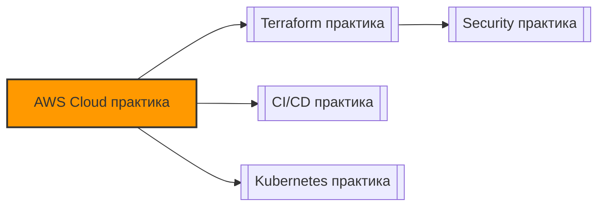

# 📄 Файл: `AWS Cloud практика.md`

tags: [aws, cloud, devops, practice, hands-on, iam, ec2, s3, vpc]
aliases: [aws-practice, cloud-fundamentals-practice]
created: 2026-05-07
---

# ☁️ AWS Cloud Fundamentals: Полноценная Практика (Hands-On)

> [!INFO] Формат
> Реальные сценарии из продакшена → пошаговое выполнение → DevOps-контекст → задания для самостоятельной отработки.
> 
> 💡 **Рекомендация**: Используй [AWS Free Tier](https://aws.amazon.com/free/). Все команды ниже используют `aws cli v2`. Обязательно удаляй ресурсы после практики (`terraform destroy` или ручное удаление), чтобы избежать списаний!

📋 [[#🗂️ Оглавление для навигации|Оглавление]] | [[#🧪 Чек-лист самостоятельной практики|Чек-лист]] | [[#🔗 Связь с другими файлами|Связи]]

---

## 🗂️ Оглавление для навигации

### 🔹 Базовые сценарии
- [[#📁 СЦЕНАРИЙ 1: Настройка IAM и безопасный доступ через CLI|1. IAM и CLI доступ]]
- [[#📁 СЦЕНАРИЙ 2: Сеть и безопасность: VPC + Security Groups|2. VPC и Security Groups]]
- [[#📁 СЦЕНАРИЙ 3: Деплой вычислительного инстанса (EC2)|3. EC2 деплой]]
- [[#📁 СЦЕНАРИЙ 4: Хранение данных: S3 бакеты и политики доступа|4. S3 бакеты]]
- [[#📁 СЦЕНАРИЙ 5: Автоматизация через AWS CLI и профили|5. CLI автоматизация]]

---

## 🔹 Базовые сценарии

### 📁 СЦЕНАРИЙ 1: Настройка IAM и безопасный доступ через CLI

### 🎯 Цель
Создать IAM-пользователя с минимальными правами, сгенерировать ключи доступа и настроить локальный AWS CLI без использования root-аккаунта.

### 📋 Пошаговое выполнение

```bash
# 1. Установи AWS CLI v2 и проверь версию
aws --version

# 2. Настрой профиль (не используй root!)
aws configure
# AWS Access Key ID: <вставь ключ из IAM>
# AWS Secret Access Key: <вставь секрет>
# Default region name: eu-central-1  # Или твой регион
# Default output format: json

# 3. Проверь, от кого ты работаешь
aws sts get-caller-identity

# 4. Создай IAM-пользователя через CLI (если есть права админа)
aws iam create-user --user-name devops-trainee
aws iam attach-user-policy \
  --user-name devops-trainee \
  --policy-arn arn:aws:iam::aws:policy/AmazonS3ReadOnlyAccess

# 5. Сгенерируй ключи доступа для нового пользователя
aws iam create-access-key --user-name devops-trainee > keys.json
cat keys.json
# ⚠️ Сохрани SecretAccessKey! Он показывается только один раз.
```

### 🔍 DevOps-контекст
- `root` аккаунт должен использоваться **только** для настройки биллинга и MFA. Все ежедневные операции — через IAM-пользователей или роли.
- В CI/CD программы используют `IAM Roles` (например, `GitHub OIDC` или `EC2 Instance Profiles`), а не long-lived access keys.
- `aws sts get-caller-identity` — первая команда для проверки контекста и прав в пайплайнах.

### ⚠️ Подводные камни
- Ключи доступа в `~/.aws/credentials` должны иметь права `600`. Никогда не коммить их в Git.
- `AmazonS3ReadOnlyAccess` — управляемая политика AWS. В продакшене пиши свои `inline policies` с точными действиями (`s3:GetObject`, `s3:ListBucket`).
- При потере `SecretAccessKey` его нельзя восстановить — нужно создавать новый и инвалидировать старый.

### 🧪 Задание для отработки
1. Создай кастомную IAM-политику JSON, разрешающую только `s3:PutObject` и `s3:GetObject` в бакет `my-training-bucket`.
2. Прикрепи её к новому пользователю через `aws iam put-user-policy`.
3. Настрой отдельный CLI-профиль: `aws configure --profile trainee`.
4. Попробуй выполнить `aws s3 ls` с этим профилем → должно отказать. Попробуй загрузить файл в свой бакет → должно сработать.

[[#🗂️ Оглавление для навигации|↑ К оглавлению]]

---

### 📁 СЦЕНАРИЙ 2: Сеть и безопасность: VPC + Security Groups

### 🎯 Цель
Понять базовую сетевую модель AWS: создать изолированную сеть, подсеть, таблицу маршрутизации и настроить правила доступа.

### 📋 Пошаговое выполнение

```bash
export REGION=eu-central-1

# 1. Создаём VPC с CIDR-блоком
aws ec2 create-vpc --cidr-block 10.0.0.0/16 --region $REGION \
  --tag-specifications 'ResourceType=vpc,Tags=[{Key=Name,Value=devops-practice-vpc}]' \
  --query 'Vpc.VpcId' --output text > vpc-id.txt
VPC_ID=$(cat vpc-id.txt)

# 2. Создаём публичную подсеть
aws ec2 create-subnet --vpc-id $VPC_ID --cidr-block 10.0.1.0/24 \
  --availability-zone ${REGION}a --region $REGION \
  --query 'Subnet.SubnetId' --output text > subnet-id.txt
SUBNET_ID=$(cat subnet-id.txt)

# 3. Создаём Security Group (разрешаем SSH и HTTP только с твоего IP)
MY_IP=$(curl -s ifconfig.me)/32
aws ec2 create-security-group --group-name practice-sg --description "DevOps practice" \
  --vpc-id $VPC_ID --region $REGION --query 'GroupId' --output text > sg-id.txt
SG_ID=$(cat sg-id.txt)

aws ec2 authorize-security-group-ingress --group-id $SG_ID \
  --protocol tcp --port 22 --cidr $MY_IP --region $REGION
aws ec2 authorize-security-group-ingress --group-id $SG_ID \
  --protocol tcp --port 80 --cidr $MY_IP --region $REGION

echo "✅ VPC: $VPC_ID | Subnet: $SUBNET_ID | SG: $SG_ID"
```

### 🔍 DevOps-контекст
- `VPC` = твой приватный дата-центр в облаке. Без него ресурсы не изолированы.
- `Security Groups` работают на уровне **инстанса** и являются stateful: если разрешил inbound, ответный outbound разрешён автоматически.
- `NACL` (Network ACL) работают на уровне подсети и stateless — используются реже, но критичны для compliance.

### ⚠️ Подводные камни
- По умолчанию у Security Group **запрещён весь inbound** и разрешён весь outbound.
- `0.0.0.0/0` в правилах открывает порт всему интернету — частая причина взломов и майнинга.
- В Free Tier можно создать только 5 VPC на регион. Не забывай удалять после практики.

### 🧪 Задание для отработки
1. Добавь правило, запрещающее весь inbound: `aws ec2 revoke-security-group-ingress --group-id $SG_ID --protocol all --port all --cidr 0.0.0.0/0`.
2. Попробуй подключиться по SSH к инстансу (запусти позже) → должно отказать.
3. Верни правило для SSH с конкретного IP и проверь доступ.
4. Изучи разницу: почему outbound разрешён по умолчанию, а inbound нет?

[[#🗂️ Оглавление для навигации|↑ К оглавлению]]

---

### 📁 СЦЕНАРИЙ 3: Деплой вычислительного инстанса (EC2)

### 🎯 Цель
Запустить виртуальную машину через CLI, подключиться по SSH, развернуть простое приложение и корректно завершить работу.

### 📋 Пошаговое выполнение

```bash
# 1. Найди AMI (Amazon Linux 2023 для eu-central-1)
AMI_ID=$(aws ec2 describe-images --owners amazon \
  --filters "Name=name,Values=al2023-ami-2023.*-x86_64" \
  --query 'sort_by(Images, &CreationDate)[-1].ImageId' --output text --region $REGION)

# 2. Создай ключевую пару
aws ec2 create-key-pair --key-name devops-practice-key \
  --query 'KeyMaterial' --output text > ~/.ssh/devops-practice.pem
chmod 400 ~/.ssh/devops-practice.pem

# 3. Запусти инстанс (t2.micro - free tier eligible)
aws ec2 run-instances --image-id $AMI_ID --count 1 --instance-type t2.micro \
  --key-name devops-practice-key --security-group-ids $SG_ID --subnet-id $SUBNET_ID \
  --tag-specifications 'ResourceType=instance,Tags=[{Key=Name,Value=practice-web}]' \
  --user-data '#!/bin/bash
yum update -y
amazon-linux-extras install nginx1 -y
systemctl start nginx
systemctl enable nginx
echo "<h1>DevOps Practice EC2 is running!</h1>" > /usr/share/nginx/html/index.html' \
  --region $REGION --query 'Instances[0].InstanceId' --output text > instance-id.txt
INSTANCE_ID=$(cat instance-id.txt)

# 4. Дождись запуска и получи публичный IP
aws ec2 wait instance-running --instance-ids $INSTANCE_ID --region $REGION
PUBLIC_IP=$(aws ec2 describe-instances --instance-ids $INSTANCE_ID \
  --query 'Reservations[0].Instances[0].PublicIpAddress' --output text --region $REGION)

echo "🌐 Доступно: http://$PUBLIC_IP"
curl -s http://$PUBLIC_IP
```

### 🔍 DevOps-контекст
- `user-data` выполняется **один раз** при первом запуске. Идеально для базовой инициализации, но не для сложного деплоя (для этого есть Ansible/Cloud-Init/Terraform).
- `instance-running` wait-команда критична в скриптах: без неё API вернёт IP до назначения.
- В продакшене EC2 редко используют напрямую — чаще через Auto Scaling Groups, ECS или EKS.

### ⚠️ Подводные камни
- Забыл `chmod 400` на `.pem` → SSH откажет с ошибкой `Permissions are too open`.
- `user-data` не перезапускается при ребуте. Для повторяющихся задач используй `cron` или `systemd`.
- Не останавливай, а **терминируй** инстанс после практики: остановка сохраняет EBS-диск и может стоить денег.

### 🧪 Задание для отработки
1. Подключись: `ssh -i ~/.ssh/devops-practice.pem ec2-user@$PUBLIC_IP`.
2. Внутри проверь: `curl localhost`, `systemctl status nginx`, `cat /var/log/cloud-init.log`.
3. Зайди в AWS Console → EC2 → Instances → найди свой инстанс → Actions → Instance state → **Terminate**.
4. Убедись, что статус сменился на `terminated` (а не `stopped`).

[[#🗂️ Оглавление для навигации|↑ К оглавлению]]

---

### 📁 СЦЕНАРИЙ 4: Хранение данных: S3 бакеты и политики доступа

### 🎯 Цель
Создать бакет, загрузить артефакты, настроить безопасный публичный доступ через presigned URLs и включить версионирование.

### 📋 Пошаговое выполнение

```bash
# 1. Создай бакет (имя должно быть глобально уникальным!)
BUCKET_NAME="devops-practice-$(date +%s)-$RANDOM"
aws s3api create-bucket --bucket $BUCKET_NAME --region $REGION \
  --create-bucket-configuration LocationConstraint=$REGION

# 2. Отключи BlockPublicAccess (только для практики!)
aws s3api put-public-access-block --bucket $BUCKET_NAME \
  --public-access-block-configuration "BlockPublicAcls=false,IgnorePublicAcls=false,BlockPublicPolicy=false,RestrictPublicBuckets=false"

# 3. Загрузи файл
echo "Hello from S3!" > hello.txt
aws s3 cp hello.txt s3://$BUCKET_NAME/hello.txt

# 4. Сделай файл публичным через политику бакета
aws s3api put-bucket-policy --bucket $BUCKET_NAME --policy '{
  "Version": "2012-10-17",
  "Statement": [{
    "Effect": "Allow",
    "Principal": "*",
    "Action": "s3:GetObject",
    "Resource": "arn:aws:s3:::'$BUCKET_NAME'/hello.txt"
  }]
}'

# 5. Проверь доступ
curl -s https://$BUCKET_NAME.s3.$REGION.amazonaws.com/hello.txt

# 6. Сгенерируй временную ссылку (presigned URL) для приватного файла
echo "Secret report" > report.pdf
aws s3 cp report.pdf s3://$BUCKET_NAME/report.pdf
aws s3 presign s3://$BUCKET_NAME/report.pdf --expires-in 3600
```

### 🔍 DevOps-контекст
- S3 — основной источник артефактов CI/CD, логов, бэкапов и state-файлов Terraform.
- `presigned URLs` — стандарт для безопасной выдачи доступа к приватным файлам без изменения политик бакета.
- `BlockPublicAccess` включён по умолчанию в новых аккаунтах — это лучшая практика. Отключай только осознанно.

### ⚠️ Подводные камни
- Имена бакетов глобально уникальны. `my-app` уже занят. Используй суффиксы или префиксы компании.
- `s3:GetObject` в политике ≠ `s3:ListBucket`. Чтобы перечислять файлы, нужен отдельный Statement.
- Не включай `s3:PutObject` для `Principal: "*"` — иначе кто угодно сможет залить вредоносные файлы.

### 🧪 Задание для отработки
1. Включи версионирование: `aws s3api put-bucket-versioning --bucket $BUCKET_NAME --versioning-configuration Status=Enabled`.
2. Перезапиши `hello.txt` новым содержимым. Загрузи снова.
3. Проверь: `aws s3api list-object-versions --bucket $BUCKET_NAME --prefix hello.txt` → должно быть 2 версии.
4. Удали бакет и всё содержимое: `aws s3 rb s3://$BUCKET_NAME --force`.

[[#🗂️ Оглавление для навигации|↑ К оглавлению]]

---

### 📁 СЦЕНАРИЙ 5: Автоматизация через AWS CLI и профили

### 🎯 Цель
Настроить мульти-профильное окружение, использовать переменные и написать bash-скрипт для безопасного управления ресурсами.

### 📋 Пошаговое выполнение

```bash
# 1. Настрой несколько профилей
aws configure --profile dev
aws configure --profile staging
cat ~/.aws/config
# [profile dev]
# region = eu-west-1
# [profile staging]
# region = eu-central-1

# 2. Переключение контекста
export AWS_PROFILE=dev
aws sts get-caller-identity  # Проверь, что аккаунт сменился

# 3. Скрипт для безопасного поиска и удаления инстансов по тегу
cat > cleanup-instances.sh << 'EOF'
#!/bin/bash
set -e

PROFILE=${1:-default}
TAG_KEY=${2:-env}
TAG_VALUE=${3:-practice}

echo "🔍 Ищем инстансы с тегом $TAG_KEY=$TAG_VALUE в профиле $PROFILE..."
INSTANCES=$(aws ec2 describe-instances \
  --filters "Name=tag:$TAG_KEY,Values=$TAG_VALUE" \
  "Name=instance-state-name,Values=running,pending,stopping,stopped" \
  --query 'Reservations[].Instances[].[InstanceId, Tags[?Key==`Name`].Value | [0], State.Name]' \
  --output table --profile $PROFILE)

if [ -z "$INSTANCES" ]; then
  echo "✅ Инстансов не найдено. Выход."
  exit 0
fi

echo "$INSTANCES"
read -p "⚠️ Удалить эти инстансы? (y/N): " confirm
if [[ $confirm =~ ^[Yy]$ ]]; then
  IDS=$(aws ec2 describe-instances \
    --filters "Name=tag:$TAG_KEY,Values=$TAG_VALUE" \
    --query 'Reservations[].Instances[].[InstanceId]' --output text --profile $PROFILE)
  
  aws ec2 terminate-instances --instance-ids $IDS --profile $PROFILE
  echo "🗑️ Инстансы отправлены на удаление."
else
  echo "❌ Отмена."
fi
EOF

chmod +x cleanup-instances.sh
./cleanup-instances.sh dev env practice
```

### 🔍 DevOps-контекст
- `AWS_PROFILE` и `~/.aws/config` — основа для работы с несколькими окружениями без хардкода ключей.
- В CI/CD вместо профилей используются `OIDC` или `IAM Roles for Service Accounts` (IRSA), но CLI-профили идеальны для локальной отладки.
- `--query` и `--output table/json` позволяют парсить вывод в bash без `jq` (хотя `jq` рекомендуется для сложных задач).

### ⚠️ Подводные камни
- `aws ec2 terminate-instances` работает асинхронно. Инстансы переходят в `shutting-down`, потом `terminated`.
- Теги не наследуются автоматически на вложенные ресурсы (EBS, ENI) — при удалении инстанса диски могут остаться `available` и стоить денег.
- В продакшене скрипты удаления должны проходить через `approval` в пайплайне, а не запускаться вручную.

### 🧪 Задание для отработки
1. Запусти 2 инстанса с тегами: `env=practice` и `env=prod` (виртуально, просто через CLI).
2. Запусти скрипт: `./cleanup-instances.sh default env practice`.
3. Убедись, что `env=prod` инстанс не попал в список.
4. Добавь в скрипт проверку: если инстанс создан менее 2 часов назад (`LaunchTime`), не удалять его.

[[#🗂️ Оглавление для навигации|↑ К оглавлению]]

---

## 🛠️ Полезные алиасы и утилиты

```bash
# === Глобальные переменные ===
export AWS_DEFAULT_REGION=eu-central-1
export AWS_PROFILE=dev

# === Алиасы для AWS CLI ===
alias aw='aws'
alias aws-who='aws sts get-caller-identity'
alias aws-ec2='aws ec2 describe-instances --query "Reservations[].Instances[].[InstanceId,State.Name,Tags[?Key==`Name`].Value|[0],PublicIpAddress]" --output table'
alias aws-s3-ls='aws s3 ls'
alias aws-cost='aws ce get-cost-and-usage --time-period Start=$(date -d "1 month ago" +%Y-%m-01),End=$(date +%Y-%m-01) --granularity MONTHLY --metrics BlendedCost --query "ResultsByTime[0].Total.BlendedCost.Amount" --output text'

# === Работа с JSON и фильтрация ===
# Установи jq: sudo apt install jq / brew install jq
aws ec2 describe-instances | jq '.Reservations[].Instances[] | select(.State.Name=="running") | .InstanceId'

# === Очистка мусора после практики ===
aws ec2 describe-key-pairs --query 'KeyPairs[].KeyName' --output text | xargs -n1 aws ec2 delete-key-pair --key-name
aws s3 ls | awk '{print $3}' | grep practice | xargs -I{} aws s3 rb s3://{} --force
```

---

## 🧪 Чек-лист самостоятельной практики

- [ ] Установил AWS CLI v2 и проверил `aws --version`
- [ ] Создал IAM-пользователя с MFA и кастомной политикой минимальных прав
- [ ] Настроил `~/.aws/credentials` и `~/.aws/config` с несколькими профилями
- [ ] Создал VPC, подсеть, Security Group и запустил EC2 через CLI
- [ ] Подключился по SSH, проверил `user-data`, корректно терминировал инстанс
- [ ] Создал S3-бакет, загрузил файл, сгенерировал presigned URL
- [ ] Включил версионирование на S3 и проверил историю объектов
- [ ] Написал bash-скрипт для поиска/удаления ресурсов по тегам с подтверждением
- [ ] Понимаю разницу: Region vs AZ vs Edge Location, Security Group vs NACL
- [ ] Проверил Billing Dashboard: все тестовые ресурсы удалены, баланс $0

---

## ⚠️ Топ-5 ошибок в продакшене и как их избежать

| Ошибка | Последствия | Решение |
|--------|-------------|---------|
| Использование root-аккаунта для daily tasks | Полная компрометация аккаунта при утечке ключей | Включи MFA на root, создай IAM-админа, используй его |
| Security Group с `0.0.0.0/0` на порту 22/3389 | Брутфорс, криптомайнеры, утечка данных | Разрешай только корпоративный IP или VPN CIDR |
| Забытые `stopped` EC2 или `unattached` EBS-диски | Скрытые списания $50-200/мес | Автоматизируй очистку через Lambda + EventBridge или Teardown-скрипты |
| Хардкод access keys в коде/скриптах | Утечка через Git, компрометация аккаунта | Используй IAM Roles, AWS SSO, OIDC или `aws-vault` |
| Игнорирование тегирования (`env`, `owner`, `cost-center`) | Невозможность аллокации затрат, хаос при удалении | Mandatory tagging policy через AWS Config или Terraform |

---

## 🔗 Связь с другими файлами

> [!TIP] Следующие шаги
> После отработки этих сценариев переходи к:
> - [[Terraform практика]] — инфраструктура как код (VPC, EC2, S3 через HCL)
> - [[CICD практика]] — деплой артефактов в S3, запуск EC2 из пайплайна
> - [[Docker практика]] — сборка образов и запуск на EC2
> - [[Kubernetes практика]] — миграция с EC2 в EKS



[[#🗂️ Оглавление для навигации|↑ К оглавлению]]