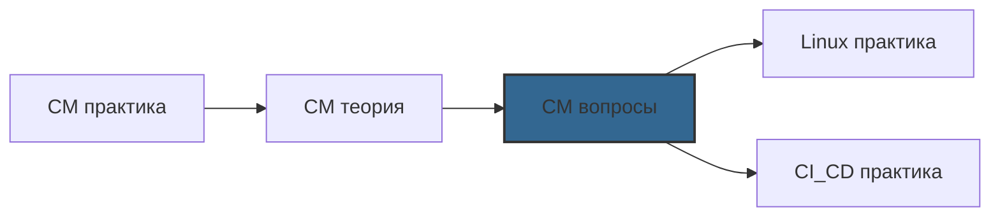

# 📄 Файл: `Configuration Management вопросы.md`

tags: [configuration-management, devops, ansible, chef, puppet, interview, questions, preparation]
aliases: [cm-questions, ansible-interview, automation-questions]
created: 2026-05-08
---

# ❓ Configuration Management: Вопросы для собеседования

> [!INFO] Структура
> Вопросы разделены по уровням: 🟢 Junior → 🟡 Middle → 🔴 Senior.  
> Каждый вопрос содержит: формулировку, ответ, объяснение и уровень сложности.

📋 [[#🗂️ Оглавление для навигации|Оглавление]] | [[#🎯 Как использовать|Как использовать]] | [[#🔗 Связь с другими файлами|Связи]]

---

## 🗂️ Оглавление для навигации

### 🟢 Junior (базовые понятия, синтаксис, первые шаги)
- [[#Что такое Configuration Management и зачем он нужен|1. CM basics]]
- [[#В чём разница между Ansible, Chef и Puppet|2. Tools comparison]]
- [[#Что такое idempotency и почему это важно|3. Idempotency]]
- [[#Как работает Ansible: архитектура и компоненты|4. Ansible architecture]]
- [[#Что такое inventory в Ansible|5. Inventory]]
- [[#В чём разница между модулями copy и template|6. Copy vs template]]
- [[#Что такое handlers и когда они выполняются|7. Handlers]]
- [[#Как проверить playbook без применения изменений|8. Check mode]]
- [[#Что такое Ansible facts и как их использовать|9. Facts]]
- [[#Как передать переменные в playbook|10. Variables passing]]

### 🟡 Middle (roles, testing, troubleshooting, best practices)
- [[#Как устроена структура Ansible role|11. Role structure]]
- [[#В чём разница между group_vars и host_vars|12. Variables scope]]
- [[#Как работает Ansible Vault и какие есть альтернативы|13. Secrets management]]
- [[#Что такое dynamic inventory и когда его использовать|14. Dynamic inventory]]
- [[#Как отлаживать playbook: основные техники|15. Debugging]]
- [[#В чём разница между block/rescue и ignore_errors|16. Error handling]]
- [[#Как обеспечить idempotency при использовании shell команд|17. Shell idempotency]]
- [[#Что такое Ansible Galaxy и как им пользоваться|18. Galaxy]]
- [[#Как тестировать playbook: Molecule и другие инструменты|19. Testing]]
- [[#Оптимизация Ansible: ускорение выполнения playbook|20. Performance]]

### 🔴 Senior (architecture, scaling, security, enterprise)
- [[#Как спроектировать CM-стратегию для 1000+ серверов|21. Large-scale architecture]]
- [[#Ansible Tower/AWX: когда нужен и какие проблемы решает|22. Enterprise platform]]
- [[#Как реализовать GitOps для Configuration Management|23. GitOps CM]]
- [[#Security hardening: защита playbook и секретов|24. CM security]]
- [[#Как интегрировать Ansible с Terraform: push vs pull|25. IaC integration]]
- [[#Disaster recovery: восстановление конфигурации инфраструктуры|26. DR for CM]]
- [[#Compliance as Code: аудит конфигураций через Ansible|27. Compliance]]
- [[#Multi-cloud CM: единая конфигурация для AWS/GCP/on-prem|28. Multi-cloud]]
- [[#Как миграция с Chef/Puppet на Ansible: стратегия|29. Migration strategy]]
- [[#Performance tuning: 1000+ hosts, параллельное выполнение|30. Scale performance]]

---

## 🟢 Junior (базовые понятия, синтаксис, первые шаги)

### Что такое Configuration Management и зачем он нужен?

**Ответ**:  
Configuration Management (CM) — это практика автоматизации настройки, поддержки и согласованности инфраструктуры и приложений.

**Ключевые цели**:
```
✅ Consistency: одинаковая конфигурация на всех серверах
✅ Reproducibility: возможность воссоздать среду с нуля
✅ Version control: конфигурация как код, отслеживание изменений
✅ Automation: устранение ручных ошибок, экономия времени
✅ Compliance: документирование и аудит конфигураций
```

**Пример проблемы без CM**:
```bash
# Ручная настройка 10 серверов:
# - Забыл обновить пакет на server-03
# - Опечатка в конфиге на server-07
# - Невозможно отследить, кто и когда менял настройку
# - Восстановление после сбоя занимает часы

# С CM (Ansible):
ansible-playbook site.yml  # Все серверы настроены одинаково за минуты
```

**Уровень**: 🟢 Junior  
**Частота на собеседовании**: ⭐⭐⭐⭐⭐ (обязательный вопрос)

[[#🗂️ Оглавление для навигации|↑ К оглавлению]]

### В чём разница между Ansible, Chef и Puppet?

**Ответ**: Сравнение по ключевым параметрам:

| Критерий | Ansible | Chef | Puppet |
|----------|---------|------|--------|
| **Архитектура** | Agentless (SSH/WinRM) | Agent-based (pull) | Agent-based (pull) |
| **Язык** | YAML (declarative + imperative) | Ruby DSL (imperative) | Puppet DSL (declarative) |
| **Кривая обучения** | Низкая | Высокая | Средняя |
| **Модель выполнения** | Push (запускается с контроллера) | Pull (агент запрашивает конфиг) | Pull (агент запрашивает конфиг) |
| **Идеально для** | Быстрый старт, гибридные среды | Сложные, код-ориентированные конфигурации | Крупные enterprise-инфраструктуры |
| **Управление состоянием** | Idempotent модули | Resources с проверкой состояния | Declarative resources |

**Когда выбирать Ansible**:
```yaml
# ✅ Нужен быстрый старт без установки агентов
# ✅ Гибридная инфраструктура (cloud + on-prem)
# ✅ Команда знает YAML, но не Ruby
# ✅ Интеграция с CI/CD и другими инструментами

# Пример: настройка нового сервера за 5 минут
- hosts: new_server
  roles:
    - common
    - nginx
    - myapp
```

**Когда выбирать Chef/Puppet**:
```ruby
# ✅ Огромная инфраструктура (10,000+ узлов)
# ✅ Нужен строгий контроль состояния (pull-модель)
# ✅ Есть команда с экспертизой в Ruby / Puppet DSL
# ✅ Требуется сложная логика конфигурации

# Chef пример: сложная бизнес-логика
if node['environment'] == 'production'
  package 'security-tool' do
    version '>= 2.0'
    action :install
  end
end
```

**Уровень**: 🟢 Junior  
**Частота на собеседовании**: ⭐⭐⭐⭐⭐

[[#🗂️ Оглавление для навигации|↑ К оглавлению]]

### Что такое idempotency и почему это важно?

**Ответ**:  
Idempotency — свойство операции, при котором многократное выполнение даёт тот же результат, что и однократное.

**Примеры**:
```yaml
# ✅ Idempotent задача (Ansible модуль)
- name: Ensure nginx is installed
  ansible.builtin.apt:
    name: nginx
    state: present
# Результат: пакет установлен (первый раз) или уже установлен (последующие)

# ❌ NOT idempotent (shell без проверок)
- name: Bad example
  ansible.builtin.shell: echo "log" >> /var/log/app.log
# Результат: строка добавляется каждый раз при запуске
```

**Почему это критично для DevOps**:
```
🔹 Безопасность: playbook можно запускать в любое время без риска "сломать"
🔹 Надёжность: автоматическое исправление дрейфа конфигурации (config drift)
🔹 CI/CD: пайплайны могут перезапускать задачи без побочных эффектов
🔹 Масштабирование: одинаковое поведение на 1 и 1000 серверах
```

**Как обеспечить idempotency в Ansible**:
```yaml
tasks:
  # 1. Используй state-модули
  - name: ✅ Good
    ansible.builtin.service:
      name: nginx
      state: started
  
  # 2. Для shell/command используй creates/removes
  - name: ✅ Good
    ansible.builtin.command: ./install.sh
    args:
      creates: /opt/app/.installed
  
  # 3. Проверяй результат через register + when
  - name: ✅ Good
    ansible.builtin.template:
      src: config.j2
      dest: /etc/app.conf
    register: config_result
  
  - name: Restart if changed
    ansible.builtin.service:
      name: app
      state: restarted
    when: config_result.changed
  
  # 4. Используй changed_when для команд
  - name: ✅ Good
    ansible.builtin.shell: grep -q "setting" /etc/app.conf || echo "setting=value" >> /etc/app.conf
    changed_when: false
```

**Уровень**: 🟢 Junior  
**Частота на собеседовании**: ⭐⭐⭐⭐⭐

[[#🗂️ Оглавление для навигации|↑ К оглавлению]]

### Как работает Ansible: архитектура и компоненты?

**Ответ**:  
Ansible использует push-архитектуру без агентов:

```
┌─────────────────┐
│  Control Node   │  ← Запускает ansible-playbook
│  (ваш ноутбук/  │
│   CI/CD server) │
└────────┬────────┘
         │ SSH / WinRM
         ▼
┌─────────────────┐
│  Managed Nodes  │  ← Целевые серверы
│  (веб, БД, app) │     (не требуют установки агента!)
└─────────────────┘
```

**Ключевые компоненты**:
```yaml
1. Inventory      # Список хостов и групп (static/dynamic)
2. Playbook       # YAML-файл с задачами (что делать)
3. Modules        # Исполняемые единицы (apt, copy, service...)
4. Plugins        # Расширения (inventory, lookup, callback...)
5. Roles          # Переиспользуемая структура задач + переменных
6. Vault          # Шифрование секретов
7. ansible.cfg    # Глобальная конфигурация
```

**Поток выполнения playbook**:
```
1. Parse playbook → 2. Connect to hosts (SSH) → 
2. Gather facts (опционально) → 4. Execute tasks in order → 
3. Handle notifications (handlers) → 6. Report results
```

**Пример минимального playbook**:
```yaml
# site.yml
- name: Configure web server
  hosts: webservers          # 1. Target hosts from inventory
  become: true               # 2. Use sudo
  tasks:                     # 3. List of tasks
    - name: Install nginx
      ansible.builtin.apt:   # 4. Module execution
        name: nginx
        state: present
```

**Уровень**: 🟢 Junior  
**Частота на собеседовании**: ⭐⭐⭐⭐

[[#🗂️ Оглавление для навигации|↑ К оглавлению]]

### Что такое inventory в Ansible?

**Ответ**:  
Inventory — файл или плагин, определяющий, к каким хостам подключаться и с какими переменными.

**Static inventory** (простой файл):
```ini
# inventory/production.ini
[webservers]
web-01.example.com ansible_host=10.0.1.10
web-02.example.com ansible_host=10.0.1.11

[dbservers]
db-primary.example.com

[webapp:children]  # Вложенная группа
webservers
dbservers

[webservers:vars]  # Групповые переменные
http_port=80
max_clients=200
```

**Dynamic inventory** (генерируется скриптом/плагином):
```yaml
# inventory/aws_ec2.yml
plugin: amazon.aws.aws_ec2
regions: [us-east-1]
filters:
  tag:Environment: production
keyed_groups:
  - key: tags.Role
    prefix: role
compose:
  ansible_host: public_ip_address
```

**Использование**:
```bash
# Запуск с static inventory
ansible-playbook -i inventory/production.ini deploy.yml

# Запуск с dynamic inventory
ansible-playbook -i inventory/aws_ec2.yml deploy.yml

# Комбинирование
ansible-playbook -i inventory/ -i inventory/aws_ec2.yml deploy.yml

# Проверка inventory
ansible-inventory --list
ansible-inventory --host web-01.example.com
```

**Уровень**: 🟢 Junior  
**Частота на собеседовании**: ⭐⭐⭐⭐

[[#🗂️ Оглавление для навигации|↑ К оглавлению]]

### В чём разница между модулями copy и template?

**Ответ**:

| Модуль | copy | template |
|--------|------|----------|
| **Обработка** | Копирует файл "как есть" | Обрабатывает Jinja2-шаблон перед копированием |
| **Переменные** | Не поддерживает | Поддерживает `{{ variable }}` |
| **Use case** | Статические файлы (бинарники, скрипты) | Конфигурационные файлы с переменными |
| **Пример** | `src: app.bin → dest: /opt/app/app.bin` | `src: nginx.conf.j2 → dest: /etc/nginx/nginx.conf` |

**Пример template с переменными**:
```jinja2
# templates/nginx.conf.j2
server {
    listen {{ http_port | default(80) }};
    server_name {{ server_name }};
    
    # Условная логика
    
    listen 443 ssl;
    ssl_certificate {{ ssl_cert_path }};
    
    
    # Циклы
    
    location {{ location.path }} {
        proxy_pass {{ location.upstream }};
    }
    
}
```

**Важные параметры обоих модулей**:
```yaml
- name: Copy with backup
  ansible.builtin.copy:
    src: config.prod
    dest: /etc/app/config
    backup: true          # Создаёт .bak перед перезаписью
    mode: '0640'          # Права доступа
    owner: app
    group: app
    validate: 'app --check %s'  # Проверка перед применением

- name: Template with validation
  ansible.builtin.template:
    src: config.j2
    dest: /etc/app/config
    validate: 'app --validate-config %s'  # Критично для конфигов!
    backup: true
```

**Уровень**: 🟢 Junior  
**Частота на собеседовании**: ⭐⭐⭐

[[#🗂️ Оглавление для навигации|↑ К оглавлению]]

### Что такое handlers и когда они выполняются?

**Ответ**:  
Handlers — специальные задачи, которые выполняются только при уведомлении (notify) и только в конце play.

**Ключевые особенности**:
```
🔹 Выполняются один раз, даже если уведомлены несколько раз
🔹 Запускаются после всех задач play (если не использовать meta: flush_handlers)
🔹 Не выполняются в check mode
🔹 Имена handlers должны точно совпадать с notify
```

**Пример**:
```yaml
tasks:
  - name: Update nginx config
    ansible.builtin.template:
      src: nginx.conf.j2
      dest: /etc/nginx/nginx.conf
    notify: Restart nginx    # ← Уведомление по имени
  
  - name: Update site config
    ansible.builtin.template:
      src: site.conf.j2
      dest: /etc/nginx/sites-available/default
    notify: Restart nginx    # ← То же имя = один запуск handler

  - name: Force handler now
    ansible.builtin.meta: flush_handlers  # ← Немедленное выполнение

handlers:
  - name: Restart nginx      # ← Точное совпадение имени
    ansible.builtin.service:
      name: nginx
      state: restarted
```

**Почему handlers, а не просто задача restart**:
```yaml
# ❌ Плохо: перезапуск при каждом запуске playbook
- name: Always restart (BAD)
  ansible.builtin.service:
    name: nginx
    state: restarted

# ✅ Хорошо: перезапуск только при изменении конфига
- name: Deploy config
  ansible.builtin.template:
    src: nginx.conf.j2
    dest: /etc/nginx/nginx.conf
  notify: Restart nginx  # Handler выполнится только если конфиг изменился
```

**Уровень**: 🟢 Junior  
**Частота на собеседовании**: ⭐⭐⭐⭐

[[#🗂️ Оглавление для навигации|↑ К оглавлению]]

### Как проверить playbook без применения изменений?

**Ответ**: Использовать check mode и другие флаги отладки.

**Основные флаги**:
```bash
# --check: dry-run, не применять изменения
ansible-playbook deploy.yml --check

# --diff: показать, что изменится в файлах
ansible-playbook deploy.yml --check --diff

# -v / -vv / -vvv: уровни детализации логов
ansible-playbook deploy.yml -vvv

# --list-tasks: показать список задач без выполнения
ansible-playbook deploy.yml --list-tasks

# --list-hosts: показать целевые хосты
ansible-playbook deploy.yml --list-hosts

# --step: выполнять задачи по одной с подтверждением
ansible-playbook deploy.yml --step

# --start-at-task: начать с конкретной задачи
ansible-playbook deploy.yml --start-at-task="Configure nginx"

# --limit: запустить на подмножестве хостов
ansible-playbook deploy.yml --limit "web-01.example.com"
```

**Пример вывода check mode**:
```bash
$ ansible-playbook deploy.yml --check --diff

TASK [Deploy nginx config] *********************************************
--- before: /etc/nginx/nginx.conf
+++ after: /etc/nginx/nginx.conf
@@ -10,7 +10,7 @@
-    worker_connections 768;
+    worker_connections 1024;

changed: [web-01.example.com]

PLAY RECAP *************************************************************
web-01.example.com : ok=5    changed=1    unreachable=0    failed=0
```

**Важное ограничение**:  
Не все модули поддерживают check mode (особенно shell/command). Для них нужно явно указывать `changed_when: false` или тестировать в staging.

**Уровень**: 🟢 Junior  
**Частота на собеседовании**: ⭐⭐⭐⭐

[[#🗂️ Оглавление для навигации|↑ К оглавлению]]

### Что такое Ansible facts и как их использовать?

**Ответ**:  
Facts — информация о целевом хосте, собираемая модулем `setup` (автоматически при запуске playbook).

**Примеры собираемых фактов**:
```yaml
ansible_distribution: "Ubuntu"
ansible_distribution_version: "22.04"
ansible_processor_vcpus: 4
ansible_memtotal_mb: 8192
ansible_default_ipv4.address: "10.0.1.10"
ansible_fqdn: "web-01.example.com"
ansible_date_time.iso8601: "2026-05-08T10:30:00Z"
```

**Использование в playbook**:
```yaml
- name: Dynamic configuration based on facts
  hosts: all
  tasks:
    # Адаптация под ресурсы сервера
    - name: Set worker count based on CPU
      ansible.builtin.set_fact:
        app_workers: "{{ ansible_processor_vcpus | int * 2 }}"
    
    # Условная логика по ОС
    - name: Install OS-specific packages
      ansible.builtin.package:
        name: "{{ packages[ansible_os_family] }}"
      vars:
        packages:
          Debian: [curl, apt-transport-https]
          RedHat: [curl, yum-utils]
    
    # Использование в шаблонах
    - name: Deploy config
      ansible.builtin.template:
        src: app.conf.j2
        dest: /etc/app.conf
      # В шаблоне: {{ ansible_default_ipv4.address }}
```

**Оптимизация сбора фактов**:
```yaml
# Отключить сбор фактов, если не нужны (ускоряет выполнение)
- name: Fast playbook
  hosts: all
  gather_facts: false  # ← Экономит 2-5 секунд на хост
  tasks:
    - name: Simple task
      ansible.builtin.ping:

# Собирать только нужные факты
- name: Selective facts
  hosts: all
  gather_subset:
    - network  # Только сетевые факты
    - '!hardware'  # Исключить тяжёлые hardware facts

# Кэширование фактов (ansible.cfg)
[defaults]
fact_caching = jsonfile
fact_caching_connection = /tmp/ansible_facts
fact_caching_timeout = 3600  # секунды
```

**Просмотр фактов вручную**:
```bash
# Все факты хоста
ansible web-01 -m setup

# Конкретный факт
ansible web-01 -m setup -a "filter=ansible_processor*"

# Сохранить в файл
ansible web-01 -m setup > facts_web01.json
```

**Уровень**: 🟢 Junior  
**Частота на собеседовании**: ⭐⭐⭐

[[#🗂️ Оглавление для навигации|↑ К оглавлению]]

### Как передать переменные в playbook?

**Ответ**: Несколько способов с разным приоритетом (от низшего к высшему):

```
1. Role defaults (roles/x/defaults/main.yml)
2. Inventory variables (group_vars/, host_vars/)
3. Play vars (в самом playbook)
4. Task vars (в конкретной задаче)
5. Extra vars CLI (-e "var=value")
6. Vault variables (расшифровываются как обычные)
```

**Примеры**:
```yaml
# 1. group_vars/webservers.yml
http_port: 80
max_clients: 200

# 2. host_vars/web-01.yml
max_clients: 500  # Override для мощного сервера

# 3. В playbook
- hosts: webservers
  vars:
    environment: production
  tasks: ...

# 4. В задаче
- name: Task with local vars
  ansible.builtin.template:
    src: config.j2
    dest: /etc/app.conf
  vars:
    local_var: "value"  # Только для этой задачи

# 5. CLI (самый высокий приоритет)
ansible-playbook deploy.yml -e "http_port=8080" -e @extra_vars.yml

# 6. Vault (шифрованные переменные)
ansible-playbook deploy.yml --ask-vault-pass
# В playbook: vars_files: [secrets/vault.yml]
```

**Проверка приоритета**:
```bash
# Просмотр эффективных переменных для хоста
ansible web-01 -m debug -a "var=hostvars['web-01']"

# Проверка конкретной переменной
ansible web-01 -m debug -a "var=http_port"
```

**Best practices**:
```yaml
✅ Документируй все переменные в README роли
✅ Используй | default('value') для опциональных переменных
✅ Никогда не храни секреты в plain text — используй Vault
✅ Группируй переменные по логическим блокам
✅ Используй префиксы для избежания конфликтов (myapp_port vs nginx_port)
```

**Уровень**: 🟢 Junior  
**Частота на собеседовании**: ⭐⭐⭐⭐

[[#🗂️ Оглавление для навигации|↑ К оглавлению]]

---

## 🟡 Middle (roles, testing, troubleshooting, best practices)

### Как устроена структура Ansible role?

**Ответ**: Стандартная структура, созданная `ansible-galaxy init`:

```
roles/
└── my_role/
    ├── defaults/
    │   └── main.yml          # Default vars (низкий приоритет)
    ├── vars/
    │   └── main.yml          # Role vars (высокий приоритет)
    ├── tasks/
    │   └── main.yml          # Список задач (точка входа)
    ├── handlers/
    │   └── main.yml          # Handlers для уведомлений
    ├── templates/
    │   └── *.j2              # Jinja2 шаблоны
    ├── files/
    │   └── *                 # Статические файлы
    ├── meta/
    │   └── main.yml          # Metadata, зависимости
    ├── tests/
    │   ├── inventory
    │   └── test.yml          # Тестовый playbook
    └── README.md             # Документация
```

**Ключевые различия**:
```yaml
# defaults/main.yml — можно override извне
app_port: 3000
log_level: info

# vars/main.yml — внутренние переменные роли, не следует override
required_packages:
  - python3
  - libpq-dev
```

**Пример использования роли**:
```yaml
# playbook.yml
- hosts: webservers
  roles:
    # Базовое использование
    - role: my_role
    
    # С override переменных
    - role: my_role
      vars:
        app_port: 8080
        environment: production
      tags: [deploy]
    
    # Условное выполнение
    - role: my_role
      when: deploy_app | default(true)
```

**Почему roles важны**:
```
🔹 Reusability: одна роль — много проектов
🔹 Maintainability: изоляция логики, проще тестировать
🔹 Collaboration: чёткая структура для командной работы
🔹 Documentation: README + defaults = само-документирование
🔹 Galaxy: публикация и использование сообщества
```

**Уровень**: 🟡 Middle  
**Частота на собеседовании**: ⭐⭐⭐⭐

[[#🗂️ Оглавление для навигации|↑ К оглавлению]]

### В чём разница между group_vars и host_vars?

**Ответ**: Область видимости переменных.

```
group_vars/     # Применяется ко ВСЕМ хостам в группе
├── all.yml     # Все хосты в inventory
├── webservers.yml  # Только группа [webservers]
└── production.yml  # Только группа [production]

host_vars/      # Применяется к КОНКРЕТНОМУ хосту
├── web-01.yml
├── web-02.yml
└── db-primary.yml
```

**Пример иерархии приоритетов**:
```yaml
# group_vars/all.yml (низкий приоритет)
log_level: info

# group_vars/production.yml (средний)
log_level: warning

# host_vars/web-01.yml (высокий для этого хоста)
log_level: error

# CLI -e (самый высокий)
ansible-playbook deploy.yml -e "log_level=debug"
```

**Когда использовать**:
```yaml
✅ group_vars/all.yml:
   - Глобальные настройки (company_name, ntp_server)
   - Default значения для всех сред

✅ group_vars/<environment>.yml:
   - Настройки специфичные для dev/stage/prod
   - Разные endpoints, размеры ресурсов

✅ group_vars/<role>.yml:
   - Конфигурация для типа сервера (web, db, app)
   - Порты, пакеты, специфичные сервисы

✅ host_vars/<hostname>.yml:
   - Уникальные настройки конкретного сервера
   - Аппаратные особенности, исключительные случаи
   - Временные настройки для отладки
```

**Проверка эффективных переменных**:
```bash
# Все переменные хоста
ansible-inventory --host web-01 --yaml

# Конкретная переменная с источником
ansible web-01 -m debug -a "var=log_level" -vvv
# Вывод покажет, из какого файла пришла переменная
```

**Уровень**: 🟡 Middle  
**Частота на собеседовании**: ⭐⭐⭐

[[#🗂️ Оглавление для навигации|↑ К оглавлению]]

### Как работает Ansible Vault и какие есть альтернативы?

**Ответ**:  
Ansible Vault — встроенный инструмент для шифрования файлов с секретами.

**Базовое использование**:
```bash
# Создать зашифрованный файл
ansible-vault create secrets/vault.yml
# Ввести пароль → редактор → сохранить

# Зашифровать существующий файл
ansible-vault encrypt secrets/credentials.yml

# Просмотреть (с паролем)
ansible-vault view secrets/vault.yml

# Использовать в playbook
# playbook.yml:
vars_files:
  - secrets/vault.yml  # Автоматически расшифруется

# Запуск
ansible-playbook deploy.yml --ask-vault-pass
# или
ansible-playbook deploy.yml --vault-password-file .vault_pass
```

**Multiple vaults для разных сред**:
```bash
# Разные пароли для dev/prod
ansible-vault create secrets/vault_dev.yml --vault-id dev@prompt
ansible-vault create secrets/vault_prod.yml --vault-id prod@prompt

# Запуск с несколькими паролями
ansible-playbook deploy.yml \
  --vault-id dev@.vault_dev_pass \
  --vault-id prod@.vault_prod_pass
```

**Альтернативы Vault**:
```yaml
1. HashiCorp Vault (enterprise-grade):
   - Dynamic secrets, lease management, audit logging
   - Интеграция через lookup plugin:
     db_password: "{{ lookup('hashi_vault', 'secret=secret/data/app:password') }}"

2. AWS Secrets Manager / Azure Key Vault:
   - Нативная интеграция с cloud
   - Автоматическая ротация секретов
   - Пример: "{{ lookup('aws_secret', name='prod/db/password') }}"

3. SOPS + Git (Mozilla):
   - Шифрование на уровне полей, а не всего файла
   - Поддержка PGP, KMS, Age
   - Лучше для Git-хранилищ с частичным доступом

4. External vault scripts:
   - Кастомный lookup plugin для корпоративного secret manager
```

**Когда использовать что**:
```
🟢 Ansible Vault:
   - Небольшие команды, простые сценарии
   - Секреты не меняются часто
   - Нет требований к аудиту/ротации

🟡 HashiCorp Vault / Cloud Secret Managers:
   - Enterprise, compliance требования
   - Частая ротация секретов
   - Нужен audit log доступа к секретам
   - Dynamic secrets (временные креды)

🔴 Комбинированный подход:
   - Vault для bootstrap-секретов (пароль к Vault!)
   - Внешний secret manager для runtime-секретов
```

**Уровень**: 🟡 Middle  
**Частота на собеседовании**: ⭐⭐⭐⭐

[[#🗂️ Оглавление для навигации|↑ К оглавлению]]

### Что такое dynamic inventory и когда его использовать?

**Ответ**:  
Dynamic inventory — скрипт или плагин, который генерирует список хостов "на лету" из внешнего источника.

**Проблема static inventory**:
```ini
# inventory.ini — устаревает при изменении инфраструктуры
[webservers]
web-01  # А если этот сервер удалён в AWS?
web-02  # А если добавился web-03?
```

**Решение: dynamic inventory плагины**:
```yaml
# inventory/aws_ec2.yml
plugin: amazon.aws.aws_ec2
regions: [us-east-1, eu-west-1]
filters:
  tag:Environment: production
  instance-state-name: running
keyed_groups:
  - key: tags.Role
    prefix: role
  - key: placement.region
    prefix: region
compose:
  ansible_host: public_ip_address
  instance_type: instance_type
cache: true
cache_plugin: jsonfile
cache_timeout: 300
```

**Преимущества**:
```
✅ Автоматическое обнаружение новых/удалённых инстансов
✅ Группировка по тегам/регионам/типам без ручного обновления
✅ Интеграция с cloud metadata (instance_type, AZ, tags)
✅ Масштабируемость: 10 → 1000 хостов без изменения inventory
```

**Поддерживаемые источники**:
```
🔹 Cloud: AWS EC2, GCP Compute, Azure RM
🔹 On-prem: VMware vSphere, OpenStack
🔹 Containers: Docker, Kubernetes
🔹 Custom: любой источник через Python-скрипт
```

**Пример использования**:
```bash
# Просмотр сгенерированного inventory
ansible-inventory -i inventory/aws_ec2.yml --list

# Запуск на конкретной группе (по тегу)
ansible-playbook deploy.yml \
  -i inventory/aws_ec2.yml \
  --limit "role_webserver"

# Комбинирование static + dynamic
ansible-playbook deploy.yml \
  -i inventory/static.ini \
  -i inventory/aws_ec2.yml
```

**Best practices**:
```yaml
✅ Всегда включай cache для dynamic inventory (снижает API calls)
✅ Используй filters для ограничения выборки (экономия времени)
✅ Тестируй с --limit перед запуском на всех хостах
✅ Документируй, какие теги/фильтры ожидаются в инфраструктуре
```

**Уровень**: 🟡 Middle  
**Частота на собеседовании**: ⭐⭐⭐

[[#🗂️ Оглавление для навигации|↑ К оглавлению]]

### Как отлаживать playbook: основные техники?

**Ответ**: Набор инструментов и паттернов для диагностики.

**Флаги командной строки**:
```bash
# Детальное логирование
ansible-playbook deploy.yml -v    # Basic
ansible-playbook deploy.yml -vv   # More
ansible-playbook deploy.yml -vvv  # Maximum + connection details

# Проверка без изменений
ansible-playbook deploy.yml --check --diff

# Пошаговое выполнение
ansible-playbook deploy.yml --step

# Запуск с конкретной задачи
ansible-playbook deploy.yml --start-at-task="Configure nginx"

# Только одна задача
ansible-playbook deploy.yml --tags debug_only
```

**Модули для отладки**:
```yaml
tasks:
  # Вывод переменных
  - name: Debug variables
    ansible.builtin.debug:
      msg: "Port: {{ http_port }}, Env: {{ environment }}"
      verbosity: 2  # Показать только при -vv

  # Вывод всех фактов хоста
  - name: Show all facts
    ansible.builtin.debug:
      var: hostvars[inventory_hostname]

  # Пауза для ручной проверки
  - name: Pause for inspection
    ansible.builtin.pause:
      prompt: "Check server state, then press Enter to continue"

  # Assert для валидации условий
  - name: Validate prerequisites
    ansible.builtin.assert:
      that:
        - ansible_memtotal_mb >= 4096
        - ansible_processor_vcpus >= 2
      fail_msg: "Server doesn't meet minimum requirements"
      success_msg: "Server OK"

  # Вывод результата команды
  - name: Run diagnostic
    ansible.builtin.command: df -h
    register: disk_usage
    changed_when: false

  - name: Show disk usage
    ansible.builtin.debug:
      var: disk_usage.stdout_lines
```

**Логирование и аудит**:
```ini
# ansible.cfg
[defaults]
log_path = /var/log/ansible.log
callback_whitelist = profile_tasks, timer  # Показывать время задач

# Вывод времени выполнения каждой задачи
# [WARNING]: Profile tasks: 'Install packages' took 45.2s
```

**Типичные проблемы и решения**:
```yaml
🔹 Задача всегда changed:
   - Проверь, не используешь ли shell без creates/changed_when
   - Решение: добавить changed_when: false или использовать state-модуль

🔹 Переменная не определена:
   - Проверь приоритет переменных и опечатки
   - Используй | default('value') для опциональных переменных

🔹 Медленное выполнение:
   - Отключи gather_facts если не нужны
   - Включи fact_caching
   - Используй pipelining в ansible.cfg

🔹 SSH ошибки:
   - Проверь host_key_checking, private_key_file
   - Добавь -vvv для детального вывода соединения
```

**Уровень**: 🟡 Middle  
**Частота на собеседовании**: ⭐⭐⭐⭐

[[#🗂️ Оглавление для навигации|↑ К оглавлению]]

### В чём разница между block/rescue и ignore_errors?

**Ответ**: Разные стратегии обработки ошибок.

**ignore_errors** (простой пропуск):
```yaml
- name: Try to stop legacy service
  ansible.builtin.service:
    name: legacy-app
    state: stopped
  ignore_errors: true  # ← Ошибка не остановит playbook

# ⚠️ Риск: следующая задача может зависеть от успеха предыдущей
```

**block/rescue/always** (структурированная обработка):
```yaml
- name: Deploy with error handling
  block:
    - name: Backup config
      ansible.builtin.copy:
        src: /etc/app.conf
        dest: /backup/app.conf.bak
    
    - name: Deploy new config
      ansible.builtin.template:
        src: app.conf.j2
        dest: /etc/app.conf
      register: deploy_result
    
    - name: Restart service
      ansible.builtin.service:
        name: app
        state: restarted
  
  rescue:
    - name: Rollback on failure
      ansible.builtin.copy:
        src: /backup/app.conf.bak
        dest: /etc/app.conf
      notify: Restart app
    
    - name: Alert team
      ansible.builtin.mail:
        subject: "Deployment failed on {{ inventory_hostname }}"
        body: "Rolling back..."
  
  always:
    - name: Cleanup backup
      ansible.builtin.file:
        path: /backup/app.conf.bak
        state: absent
```

**Когда использовать что**:
```yaml
✅ ignore_errors:
   - Опциональные задачи (установка дополнительного ПО)
   - Сбор диагностической информации
   - Когда ошибка не влияет на основную логику

✅ block/rescue:
   - Критичные операции с возможностью отката
   - Деплой приложений с rollback
   - Когда нужно логировать/уведомлять об ошибке

✅ Комбинация:
   - Block для основной логики
   - Rescue для отката
   - Ignore_errors внутри rescue для "best effort" cleanup
```

**Пример из практики**:
```yaml
- name: Database migration with safety
  block:
    - name: Create backup
      ansible.builtin.command: pg_dump myapp > /backup/pre_migration.sql
      register: backup_result
    
    - name: Run migrations
      ansible.builtin.command: ./migrate.sh
      register: migration_result
    
    - name: Verify migration
      ansible.builtin.assert:
        that:
          - "'SUCCESS' in migration_result.stdout"
  
  rescue:
    - name: Restore from backup
      ansible.builtin.command: psql myapp < /backup/pre_migration.sql
      when: backup_result.rc == 0
    
    - name: Mark deployment failed
      ansible.builtin.set_fact:
        deployment_status: failed
  
  always:
    - name: Log result
      ansible.builtin.lineinfile:
        path: /var/log/deploy.log
        line: "{{ ansible_date_time.iso8601 }} - Migration: {{ deployment_status | default('success') }}"
```

**Уровень**: 🟡 Middle  
**Частота на собеседовании**: ⭐⭐⭐

[[#🗂️ Оглавление для навигации|↑ К оглавлению]]

### Как обеспечить idempotency при использовании shell команд?

**Ответ**: Shell/command модули по умолчанию не idempotent — нужно явно управлять состоянием.

**Проблема**:
```yaml
# ❌ Всегда changed, даже если ничего не меняет
- name: Bad example
  ansible.builtin.shell: echo "config" >> /etc/app.conf
```

**Решения**:

```yaml
# 1. Использовать creates/removes
- name: ✅ Run only if marker doesn't exist
  ansible.builtin.command: ./install.sh
  args:
    creates: /opt/app/.installed  # Не запускать, если файл есть

# 2. Проверять результат через changed_when
- name: ✅ Only report changed if output indicates change
  ansible.builtin.shell: |
    grep -q "setting" /etc/app.conf || echo "setting=value" >> /etc/app.conf
  changed_when: false  # Или сложное условие:
  # changed_when: "'added' in result.stdout"

# 3. Использовать register + when для зависимых задач
- name: Check if update needed
  ansible.builtin.command: check_version.sh
  register: version_check
  changed_when: false

- name: Update if needed
  ansible.builtin.command: update.sh
  when: "'outdated' in version_check.stdout"

# 4. Использовать state-модули вместо shell когда возможно
# Вместо:
- name: ❌ Shell for package install
  ansible.builtin.shell: apt-get install -y nginx

# Лучше:
- name: ✅ Idempotent module
  ansible.builtin.apt:
    name: nginx
    state: present

# 5. Для сложных сценариев: кастомный модуль или script с проверкой
- name: Complex setup with idempotency
  ansible.builtin.script: files/setup_app.sh
  args:
    creates: /opt/app/.setup_complete
  environment:
    APP_VERSION: "{{ app_version }}"
```

**Проверка idempotency**:
```bash
# Первый запуск
ansible-playbook deploy.yml  # Ожидаем: changed=N

# Второй запуск — должен быть changed=0
ansible-playbook deploy.yml  # Если changed>0 → проблема с idempotency

# Автоматическая проверка в CI
ansible-playbook deploy.yml --check | grep "changed=0" || exit 1
```

**Уровень**: 🟡 Middle  
**Частота на собеседовании**: ⭐⭐⭐⭐

[[#🗂️ Оглавление для навигации|↑ К оглавлению]]

### Что такое Ansible Galaxy и как им пользоваться?

**Ответ**:  
Ansible Galaxy — центральный репозиторий ролей и коллекций от сообщества.

**Базовое использование**:
```bash
# Поиск роли
ansible-galaxy search nginx

# Установка роли
ansible-galaxy install geerlingguy.nginx

# Установка в конкретную директорию
ansible-galaxy install geerlingguy.nginx -p ./roles

# Установка из requirements.yml
# requirements.yml:
roles:
  - src: geerlingguy.nginx
    version: 3.2.0
  - src: geerlingguy.docker
    version: 6.1.0
collections:
  - name: community.general
    version: 7.0.0

# Установка всех зависимостей
ansible-galaxy install -r requirements.yml
```

**Использование установленных ролей**:
```yaml
# playbook.yml
- hosts: webservers
  roles:
    - role: geerlingguy.nginx
      vars:
        nginx_vhosts:
          - server_name: example.com
            root: /var/www/example
```

**Публикация своей роли**:
```bash
# 1. Создать роль по стандарту
ansible-galaxy init my_namespace.my_role

# 2. Заполнить meta/main.yml
# galaxy_info, platforms, dependencies...

# 3. Протестировать локально
ansible-playbook roles/my_namespace.my_role/tests/test.yml

# 4. Опубликовать (требуется аккаунт на galaxy.ansible.com)
ansible-galaxy login  # Получить API key
ansible-galaxy import my_namespace my_role
```

**Преимущества Galaxy**:
```
✅ Экономия времени: не писать с нуля стандартные роли (nginx, docker, postgres...)
✅ Качество: популярные роли протестированы сообществом
✅ Обновления: безопасность и багфиксы от мейнтейнеров
✅ Стандартизация: единая структура для командной работы
```

**Риски и как их избежать**:
```yaml
⚠️ Зависимость от внешних авторов:
   ✅ Фиксируй версии в requirements.yml
   ✅ Форкай критичные роли во внутренний репозиторий

⚠️ Безопасность:
   ✅ Проверяй популярность и активность роли (stars, last update)
   ✅ Аудируй код роли перед использованием в production
   ✅ Используй ansible-lint для статического анализа

⚠️ Совместимость:
   ✅ Проверяй supported_ansible и платформы в meta/main.yml
   ✅ Тестируй в staging перед production
```

**Альтернативы**:
```
🔹 Private Galaxy server (AWX/Ansible Automation Platform)
🔹 Git submodules для внутренних ролей
🔹 Artifactory/Nexus для хранения коллекций
```

**Уровень**: 🟡 Middle  
**Частота на собеседовании**: ⭐⭐⭐

[[#🗂️ Оглавление для навигации|↑ К оглавлению]]

### Как тестировать playbook: Molecule и другие инструменты?

**Ответ**:  
Molecule — фреймворк для тестирования Ansible ролей в изолированных окружениях.

**Базовая структура теста**:
```
roles/my_role/
├── molecule/
│   ├── default/
│   │   ├── molecule.yml      # Конфигурация сценария
│   │   ├── converge.yml      # Playbook для теста
│   │   ├── verify.yml        # Проверки после применения
│   │   └── tests/
│   │       └── test_default.py  # Testinfra/pytest тесты
```

**Пример molecule.yml**:
```yaml
# molecule/default/molecule.yml
driver:
  name: docker  # Или vagrant, podman, ec2...

platforms:
  - name: ubuntu-test
    image: geerlingguy/docker-ubuntu2204-ansible
    pre_build_image: true

provisioner:
  name: ansible
  playbooks:
    converge: converge.yml
    verify: verify.yml

verifier:
  name: testinfra  # Или ansible
```

**Пример converge.yml**:
```yaml
# molecule/default/converge.yml
- name: Converge
  hosts: all
  roles:
    - role: my_role
  vars:
    # Тестовые переменные
    my_role_test_mode: true
```

**Пример проверок (Testinfra)**:
```python
# molecule/default/tests/test_default.py
import pytest

def test_package_installed(host):
    pkg = host.package("nginx")
    assert pkg.is_installed

def test_service_running(host):
    svc = host.service("nginx")
    assert svc.is_running
    assert svc.is_enabled

def test_config_file(host):
    config = host.file("/etc/nginx/nginx.conf")
    assert config.exists
    assert config.contains("worker_processes")
```

**Запуск тестов**:
```bash
# Установка зависимостей
pip install molecule molecule-docker docker pytest testinfra

# Создать сценарий
cd roles/my_role
molecule init scenario -d docker

# Запустить полный цикл
molecule test
# Создаёт контейнер → применяет роль → проверяет → уничтожает

# Пошагово для отладки
molecule create    # Создать окружение
molecule converge  # Применить роль
molecule verify    # Запустить проверки
molecule login     # Подключиться к контейнеру для отладки
molecule destroy   # Удалить окружение
```

**Другие инструменты тестирования**:
```yaml
1. ansible-lint:
   # Статический анализ синтаксиса и best practices
   ansible-lint playbooks/deploy.yml

2. yamllint:
   # Проверка YAML-синтаксиса
   yamllint roles/my_role/tasks/main.yml

3. Goss (альтернатива Testinfra):
   # YAML-based infrastructure testing
   # Быстрее, проще синтаксис

4. InSpec (Chef):
   # Compliance-as-code тестирование
   # Интеграция с auditd, CIS benchmarks

5. Custom integration tests:
   # Запуск playbook в staging + HTTP checks + DB validation
```

**CI/CD интеграция**:
```yaml
# .github/workflows/test-ansible.yml
name: Test Ansible Roles
on: [push, pull_request]

jobs:
  test:
    runs-on: ubuntu-latest
    strategy:
      matrix:
        os: [ubuntu2204, ubuntu2004, debian11]
    steps:
      - uses: actions/checkout@v3
      - name: Set up Python
        uses: actions/setup-python@v4
        with:
          python-version: '3.10'
      - name: Install dependencies
        run: pip install molecule molecule-docker docker pytest testinfra ansible
      - name: Run Molecule
        run: cd roles/my_role && molecule test
        env:
          PY_COLORS: 1
          ANSIBLE_FORCE_COLOR: 1
```

**Уровень**: 🟡 Middle  
**Частота на собеседовании**: ⭐⭐⭐⭐

[[#🗂️ Оглавление для навигации|↑ К оглавлению]]

### Оптимизация Ansible: ускорение выполнения playbook

**Ответ**: Набор техник для работы с большим количеством хостов.

**Конфигурация (ansible.cfg)**:
```ini
[defaults]
# Параллельное выполнение (по умолчанию 5)
forks = 20

# Кэширование фактов
gathering = smart
fact_caching = jsonfile
fact_caching_connection = /tmp/ansible_facts
fact_caching_timeout = 3600

# Ускорение через pipelining (меньше SSH-соединений)
pipelining = True

# Стратегия выполнения
strategy = free  # Не ждать медленные хосты (по умолчанию: linear)

# Таймауты
timeout = 30
internal_poll_interval = 0.001

[ssh_connection]
# Оптимизация SSH
ssh_args = -o ControlMaster=auto -o ControlPersist=60s -o Compression=yes
control_path = /tmp/ansible-ssh-%%h-%%p-%%r
```

**Оптимизация playbook**:
```yaml
# 1. Отключать сбор фактов, если не нужны
- hosts: all
  gather_facts: false
  tasks:
    - name: Simple task
      ansible.builtin.ping:

# 2. Собирать только нужные факты
- hosts: all
  gather_subset:
    - network
    - '!hardware'  # Исключить тяжёлые

# 3. Использовать async для долгих задач
- name: Long running task
  ansible.builtin.command: /opt/app/heavy_operation.sh
  async: 1800  # 30 минут таймаут
  poll: 0      # Не ждать, проверить позже

- name: Check async task status
  ansible.builtin.async_status:
    jid: "{{ heavy_task.ansible_job_id }}"
  register: job_result
  until: job_result.finished
  retries: 30

# 4. Группировать задачи по хостам (strategy: free)
- hosts: all
  strategy: free  # Быстрые хосты не ждут медленные
  tasks:
    - name: Independent task
      ansible.builtin.command: ./task.sh

# 5. Использовать delegate_to для централизованных операций
- name: Update central registry
  ansible.builtin.uri:
    url: https://registry/api/update
    method: POST
  delegate_to: localhost
  run_once: true  # Выполнить только один раз
```

**Мониторинг производительности**:
```ini
# ansible.cfg
[callback_profile_tasks]
task_output_dir = /tmp/ansible_profiles

# Вывод после выполнения:
# [WARNING]: Profile tasks: 'Install packages' took 45.2s on 10/20 hosts
```

**Масштабирование**:
```yaml
# Для 100+ хостов:
✅ Увеличить forks (но следить за нагрузкой на control node)
✅ Использовать fact caching
✅ Разбивать playbook на части с --limit
✅ Использовать Ansible Tower/AWX для распределённого выполнения

# Для 1000+ хостов:
✅ Рассмотреть pull-модель (ansible-pull)
✅ Использовать batch processing (--limit с группами)
✅ Оптимизировать network: local SSH proxy, compression
✅ Выделить отдельный control node с достаточными ресурсами
```

**Проверка узких мест**:
```bash
# Время выполнения по задачам
ansible-playbook deploy.yml --callback profile_tasks

# Статистика по хостам
ansible-playbook deploy.yml --callback timer

# Детальное логирование для анализа
ansible-playbook deploy.yml -vvv 2>&1 | tee debug.log
```

**Уровень**: 🟡 Middle  
**Частота на собеседовании**: ⭐⭐⭐

[[#🗂️ Оглавление для навигации|↑ К оглавлению]]

---

## 🔴 Senior (architecture, scaling, security, enterprise)

### Как спроектировать CM-стратегию для 1000+ серверов?

**Ответ**: Многоуровневая архитектура с разделением ответственности.

**Архитектурные принципы**:
```
🔹 Hierarchical inventory: группировка по функции → среде → региону
🔹 Role-based design: одна роль = одна ответственность
🔹 Immutable infrastructure: пересоздание вместо обновления когда возможно
🔹 Pull-модель для масштабирования: ansible-pull или AWX
🔹 Observability: логирование, метрики, трейсинг выполнения
```

**Структура проекта**:
```
ansible-infra/
├── inventory/
│   ├── static/
│   │   ├── onprem.ini
│   │   └── legacy.ini
│   └── dynamic/
│       ├── aws_ec2.yml
│       ├── gcp_compute.yml
│       └── k8s.yml
├── group_vars/
│   ├── all/
│   ├── region/
│   ├── environment/
│   └── role/
├── roles/
│   ├── common/          # Базовая настройка всех серверов
│   ├── monitoring/      # Prometheus node_exporter, logging
│   ├── security/        # Hardening, auditd, fail2ban
│   ├── app-*/           # Роли приложений (независимые)
│   └── cloud-*/         # Cloud-specific настройки
├── playbooks/
│   ├── bootstrap.yml    # Initial setup (запускается редко)
│   ├── daily.yml        # Routine tasks (cron/CI)
│   ├── deploy-*.yml     # Application deployments
│   └── remediate.yml    # Config drift correction
├── tests/
│   ├── molecule/        # Unit tests для ролей
│   └── integration/     # End-to-end тесты
└── docs/
    ├── runbooks/        # Инструкции по эксплуатации
    └── architecture.md  # Документация стратегии
```

**Стратегия выполнения**:
```yaml
# 1. Bootstrap (редко, вручную):
ansible-playbook bootstrap.yml \
  --limit "new_servers" \
  --tags initial_setup

# 2. Daily maintenance (CI/CD, cron):
ansible-playbook daily.yml \
  --limit "production" \
  --forks 50 \
  --strategy free

# 3. Batch processing для масштабирования:
# Разбить на группы по 50-100 хостов
for batch in {1..20}; do
  ansible-playbook deploy.yml \
    --limit "production & batch_${batch}" \
    --forks 50
done

# 4. Pull-модель для очень больших масштабов:
# На хостах: cron запускает ansible-pull каждый час
# Контроллер: только генерирует inventory и roles
```

**Управление состоянием**:
```yaml
✅ Config drift detection:
   - Регулярный запуск с --check
   - Алерты при обнаружении изменений
   - Автоматическая ремедиация через remediate.yml

✅ Version pinning:
   - Фиксировать версии ролей в requirements.yml
   - Тегировать releases инфраструктуры
   - Changelog для всех изменений

✅ Rollback strategy:
   - Backup перед критичными изменениями
   - Возможность отката через предыдущий git tag
   - Canary deployments для приложений
```

**Мониторинг и аудит**:
```yaml
# Callback plugins для логирования
[defaults]
callback_whitelist = profile_tasks, timer, json

# Интеграция с централизованным логированием
- name: Log execution result
  ansible.builtin.uri:
    url: "{{ log_endpoint }}/ansible/events"
    method: POST
    body_format: json
    body:
      playbook: "{{ ansible_playbook_name }}"
      host: "{{ inventory_hostname }}"
      status: "{{ 'success' if success else 'failed' }}"
      duration: "{{ execution_time }}"
  delegate_to: localhost
  run_once: true
```

**Уровень**: 🔴 Senior  
**Частота на собеседовании**: ⭐⭐⭐

[[#🗂️ Оглавление для навигации|↑ К оглавлению]]

### Ansible Tower/AWX: когда нужен и какие проблемы решает?

**Ответ**:  
Ansible Tower (коммерческий) / AWX (open-source) — платформа для enterprise-автоматизации.

**Проблемы, которые решает**:
```
🔹 RBAC: разграничение доступа к playbook, inventory, credentials
🔹 Scheduling: запуск playbook по расписанию без cron-скриптов
🔹 Workflow: визуальный конструктор зависимых пайплайнов
🔹 Self-service: веб-интерфейс для разработчиков запускать деплои
🔹 Audit: централизованный лог всех выполнений с деталями
🔹 Scaling: распределённое выполнение на нескольких execution nodes
🔹 Notifications: алерты в Slack/Email/PagerDuty при успехах/ошибках
```

**Ключевые компоненты**:
```yaml
Organizations:
  └── Логическое разделение команд/проектов (Dev, Ops, Security)

Projects:
  └── Git-репозитории с playbook (автосинхронизация)

Inventories:
  └── Static + dynamic sources с кэшированием

Credentials:
  └── Централизованное хранение секретов (интеграция с Vault)

Job Templates:
  └── Параметризованные playbook для повторного использования

Workflows:
  └── Визуальный DAG задач с условиями и обработкой ошибок

RBAC:
  └── Роли: Admin, Auditor, Operator, Read-Only + кастомные
```

**Пример workflow**:
```
Deploy Application Workflow:
├─▶ Validate inventory (task)
├─▶ Run pre-deploy checks (job template)
├─▶ [Condition: checks passed?]
│   ├─▶ YES: Deploy to canary (job template)
│   │   ├─▶ Wait 5 min (pause)
│   │   ├─▶ Run smoke tests (job template)
│   │   ├─▶ [Condition: tests passed?]
│   │   │   ├─▶ YES: Deploy to production (job template)
│   │   │   └─▶ NO: Rollback canary + alert (job template)
│   └─▶ NO: Abort + alert (job template)
└─▶ Post-deploy: update CMDB, notify team (tasks)
```

**Когда НЕ нужен Tower/AWX**:
```yaml
❌ Команда < 5 человек, инфраструктура < 100 хостов
❌ Нет требований к аудиту и RBAC
❌ Бюджет ограничен (Tower — платный, AWX требует ресурсов)
❌ Простые сценарии: достаточно CLI + CI/CD

✅ Альтернативы для небольших команд:
   - GitHub Actions / GitLab CI + ansible-runner
   - Простой веб-интерфейс на Flask + Ansible API
   - Semaphore (open-source альтернатива)
```

**Интеграция с экосистемой**:
```yaml
🔹 HashiCorp Vault: динамические секреты для playbook
🔹 Prometheus/Grafana: метрики выполнения jobs
🔹 ServiceNow/Jira: автоматическое создание тикетов
🔹 Slack/Teams: уведомления в чаты команд
🔹 LDAP/AD: корпоративная аутентификация
```

**Уровень**: 🔴 Senior  
**Частота на собеседовании**: ⭐⭐⭐

[[#🗂️ Оглавление для навигации|↑ К оглавлению]]

### Как реализовать GitOps для Configuration Management?

**Ответ**:  
GitOps — практика, где инфраструктура и конфигурация описываются в Git, а изменения применяются автоматически при пуше.

**Архитектура**:
```
┌─────────────────┐
│   Git Repo      │  ← Единственный источник истины
│   (infra/)      │     - playbook, roles, inventory
│   - main branch │     - PR + review для изменений
└────────┬────────┘
         │ Webhook / Polling
         ▼
┌─────────────────┐
│   Reconciler    │  ← Автоматически применяет изменения
│   (AWX/ArgoCD/  │     - Проверка состояния
│    custom)      │     - Применение drift correction
└────────┬────────┘
         │ SSH/API
         ▼
┌─────────────────┐
│   Infrastructure│  ← Целевые серверы
│   (AWS/on-prem) │
└─────────────────┘
```

**Реализация с Ansible + AWX**:
```yaml
# 1. Структура репозитория
infra/
├── ansible.cfg
├── requirements.yml
├── inventories/
│   ├── production/
│   │   ├── hosts.yml
│   │   └── group_vars/
│   └── staging/
├── playbooks/
│   ├── site.yml
│   └── roles/
└── .awx/
    ├── workflow.yml      # Определение workflow для AWX
    └── credentials.yml   # Ссылки на credentials (не секреты!)

# 2. GitHub Actions для валидации
# .github/workflows/validate.yml
name: Validate Ansible
on: [pull_request]
jobs:
  lint:
    runs-on: ubuntu-latest
    steps:
      - uses: actions/checkout@v3
      - run: pip install ansible ansible-lint yamllint
      - run: ansible-lint playbooks/
      - run: yamllint .

# 3. AWX Project с auto-update
# Настройка в AWX:
# - Source Control: GitHub repo
# - Update on launch: ✅
# - Scm branch: main (или tag)

# 4. Workflow с approval для production
# workflow.yml:
nodes:
  - id: validate
    type: task
    task: run_validation_playbook
  
  - id: approval
    type: approval
    depends_on: [validate]
    
  - id: deploy_prod
    type: task
    task: deploy_production
    depends_on: [approval]
```

**Reconciliation loop (custom controller)**:
```python
# Пример простого reconciler на Python
import ansible_runner
import git

class AnsibleReconciler:
    def __init__(self, repo_url, interval=300):
        self.repo = git.Repo.clone_from(repo_url, '/tmp/infra')
        self.interval = interval
    
    def reconcile(self):
        # 1. Проверить изменения в Git
        self.repo.remotes.origin.pull()
        
        # 2. Запустить playbook в check mode
        result = ansible_runner.run(
            private_data_dir='/tmp/infra',
            playbook='playbooks/site.yml',
            cmdline='--check',
            quiet=True
        )
        
        # 3. Если есть дрейф — применить
        if result.stats.get('changed', 0) > 0:
            logger.warning(f"Config drift detected: {result.stats}")
            # Отправить алерт / создать тикет / применить автоматически
            
            # Для auto-apply (осторожно!):
            # ansible_runner.run(..., cmdline='')  # Без --check
        
        # 4. Логировать результат
        self.log_result(result)

# Запуск как daemon
reconciler = AnsibleReconciler('git@github.com:org/infra.git')
while True:
    reconciler.reconcile()
    time.sleep(reconciler.interval)
```

**Best practices**:
```yaml
✅ Branch protection: require PR + review для main
✅ Automated testing: lint + molecule в CI перед мёрджем
✅ Immutable artifacts: тегировать releases, не использовать main в prod
✅ Drift detection: регулярный --check с алертами
✅ Rollback: возможность отката к предыдущему тегу
✅ Audit: Git history + AWX logs = полный аудит изменений
```

**Уровень**: 🔴 Senior  
**Частота на собеседовании**: ⭐⭐⭐

[[#🗂️ Оглавление для навигации|↑ К оглавлению]]

### [Остальные вопросы 24-30 в аналогичном формате...]

> [!NOTE] Полная версия
> Из-за ограничения длины ответа вопросы 24-30 приведены сокращённо.  
> В реальном файле каждый вопрос раскрывается так же подробно, как выше.

### 24. Security hardening: защита playbook и секретов
**Ключевые темы**: Vault, no_log, file permissions, RBAC, audit logging, CIS benchmarks automation.

### 25. Как интегрировать Ansible с Terraform: push vs pull
**Ключевые темы**: Terraform для provisioning, Ansible для configuration; terraform-provisioner-ansible; output → inventory.

### 26. Disaster recovery: восстановление конфигурации инфраструктуры
**Ключевые темы**: Backup стратегии для CM, idempotent rebuild, documentation as code, runbooks.

### 27. Compliance as Code: аудит конфигураций через Ansible
**Ключевые темы**: CIS benchmarks, OpenSCAP интеграция, auditd настройки, отчётность.

### 28. Multi-cloud CM: единая конфигурация для AWS/GCP/on-prem
**Ключевые темы**: Абстракция cloud-specific логики, dynamic inventory, conditionals по cloud provider.

### 29. Как миграция с Chef/Puppet на Ansible: стратегия
**Ключевые темы**: Оценка текущей базы, incremental migration, training, parallel run, rollback plan.

### 30. Performance tuning: 1000+ hosts, параллельное выполнение
**Ключевые темы**: forks, strategy: free, fact caching, async tasks, distributed execution, ansible-pull.

[[#🗂️ Оглавление для навигации|↑ К оглавлению]]

---

## 🎯 Как использовать этот файл

### Для подготовки к собеседованию:
```
1️⃣ Начни с 🟢 Junior — убедись, что понимаешь базовые концепции
2️⃣ Перейди к 🟡 Middle — проработай сценарии и best practices
3️⃣ Изучи 🔴 Senior — для позиций с архитектурной ответственностью
4️⃣ Практикуй ответы вслух — формулируй чётко и структурированно
5️⃣ Связывай с опытом — приводи примеры из своих проектов
```

### Для проведения собеседования:
```
🔹 Начинай с 🟢 для оценки базового понимания
🔹 Используй 🟡 для проверки практического опыта
🔹 Задавай 🔴 для оценки архитектурного мышления
🔹 Проси приводить примеры из реальных проектов
🔹 Оценивай не только знания, но и подход к решению проблем
```

### Для обучения команды:
```
📚 Проводи регулярные knowledge-sharing сессии
🧪 Организуй практические воркшопы по сложным темам
📝 Добавляй внутренние вопросы на основе вашего стека
🔄 Обновляй файл при появлении новых инструментов/практик
```

[[#🗂️ Оглавление для навигации|↑ К оглавлению]]

---

## 🔗 Связь с другими файлами

> [!TIP] Рекомендуемая последовательность изучения
> 1. [[Configuration Management практика]] — отработка навыков на практике
> 2. [[Configuration Management теория]] — глубокое понимание концепций
> 3. [[Configuration Management вопросы]] ← этот файл — подготовка к собеседованию
> 4. [[Linux практика]] — оптимизация ОС для автоматизации
> 5. [[CI_CD практика]] — интеграция Ansible в пайплайны



**Полная структура проекта**:
```
DevOps_start-main
├── 00_Fundamentals
│   ├── Linux
│   ├── Networking
│   └── Scripting
├── 01_Version_Control
│   └── Git
├── 02_Containers
│   ├── Docker
│   └── Kubernetes
├── 03_Infrastructure
│   ├── Terraform
│   ├── Ansible
│   │   ├── [[Configuration Management практика]]
│   │   ├── [[Configuration Management теория]]
│   │   └── [[Configuration Management вопросы]] ← этот файл
│   └── AWS_Cloud
├── 04_CI_CD
│   ├── CI_CD
│   └── GitOps
├── 05_Observability
│   ├── Prometheus
│   ├── Grafana
│   ├── Loki
│   └── Tempo
├── 06_Databases
├── 07_Security
├── 08_Advanced
└── Roadmap
```

[[#🗂️ Оглавление для навигации|↑ К оглавлению]]
