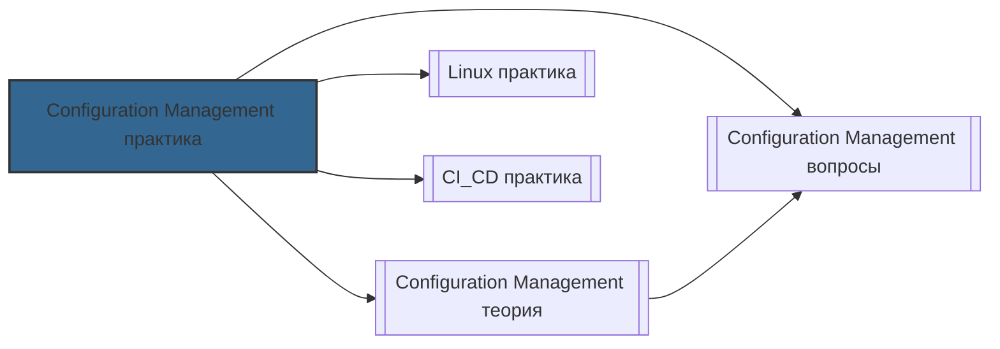

# 📄 Файл: `Configuration Management практика.md`

tags: [configuration-management, devops, ansible, chef, puppet, automation, idempotency, roles, inventory, hands-on]
aliases: [cm-practice, ansible-practice, automation-practice]
created: 2026-05-08
---

# 🛠️ Configuration Management для DevOps: Практика

> [!INFO] Структура
> Практические задания разделены по уровням: 🟢 Junior → 🟡 Middle → 🔴 Senior.  
> Каждое задание содержит: задачу, решение, объяснение и DevOps-контекст.

📋 [[#🗂️ Оглавление для навигации|Оглавление]] | [[#🧪 Чек-лист выполнения|Чек-лист]] | [[#🔗 Связь с другими файлами|Связи]]

---

## 🗂️ Оглавление для навигации

### 🟢 Junior (базовые операции, установка, первые playbook)
- [[#1. Установка Ansible и базовая настройка|1. Ansible установка]]
- [[#2. Настройка inventory: static и dynamic|2. Inventory management]]
- [[#3. Первый playbook: установка пакета и сервиса|3. Basic playbook]]
- [[#4. Работа с модулями: file, copy, template, user|4. Core modules]]
- [[#5. Variables: group_vars, host_vars, defaults|5. Variables management]]
- [[#6. Handlers и уведомления об изменениях|6. Handlers]]
- [[#7. Idempotency: проверка повторного запуска|7. Idempotency test]]
- [[#8. Ansible Vault: шифрование секретов|8. Secrets management]]

### 🟡 Middle (roles, testing, CI/CD, оптимизация)
- [[#9. Создание и структура Ansible Role|9. Role structure]]
- [[#10. Galaxy roles: использование и публикация|10. Ansible Galaxy]]
- [[#11. Testing playbook: Molecule + Docker|11. Playbook testing]]
- [[#12. Dynamic inventory: AWS, GCP, Azure plugins|12. Cloud inventory]]
- [[#13. Ansible в CI/CD: GitHub Actions, GitLab CI|13. CI/CD integration]]
- [[#14. Error handling: block/rescue, failed_when|14. Error handling]]
- [[#15. Performance: async, poll, strategy|15. Performance tuning]]
- [[#16. Логирование и аудит: callback plugins|16. Logging & audit]]

### 🔴 Senior (production, scaling, security, multi-cloud)
- [[#17. Ansible Tower/AWX: RBAC, workflows, scheduling|17. Ansible Automation Platform]]
- [[#18. Multi-environment: dev/stage/prod с переменными|18. Environment management]]
- [[#19. Security hardening: CIS benchmarks через Ansible|19. Security automation]]
- [[#20. Cross-platform: conditionals для Linux/Windows|20. Cross-platform]]
- [[#21. Custom modules и plugins: разработка|21. Custom extensions]]
- [[#22. Disaster recovery: backup/restore инфраструктуры|22. DR automation]]
- [[#23. GitOps для Ansible: ArgoCD + Ansible|23. GitOps integration]]
- [[#24. Performance at scale: 1000+ hosts, parallel execution|24. Large-scale automation]]
- [[#25. Compliance as Code: OPA + Ansible|25. Compliance automation]]
- [[#26. Multi-cloud orchestration: AWS + GCP + on-prem|26. Multi-cloud]]

---

## 🟢 Junior (базовые операции, установка, первые playbook)

### 1. Установка Ansible и базовая настройка

**Задача**: Установить Ansible, настроить конфигурацию и проверить подключение к хостам.

**Решение**:
```bash
# Установка Ansible (Ubuntu/Debian)
sudo apt update
sudo apt install software-properties-common
sudo add-apt-repository --yes --update ppa:ansible/ansible
sudo apt install ansible

# Проверка версии
ansible --version

# Настройка ansible.cfg (локальный или глобальный)
mkdir -p ~/.ansible
cat > ~/.ansible/ansible.cfg << 'EOF'
[defaults]
inventory = ./inventory.ini
remote_user = ubuntu
private_key_file = ~/.ssh/id_rsa
host_key_checking = False
retry_files_enabled = False
gathering = smart
fact_caching = jsonfile
fact_caching_connection = /tmp/ansible_facts
fact_caching_timeout = 3600

[privilege_escalation]
become = True
become_method = sudo
become_user = root
become_ask_pass = False

[ssh_connection]
pipelining = True
control_path = /tmp/ansible-ssh-%%h-%%p-%%r
EOF

# Создание inventory файла
cat > inventory.ini << 'EOF'
[webservers]
web1 ansible_host=192.168.1.10
web2 ansible_host=192.168.1.11

[dbservers]
db1 ansible_host=192.168.1.20

[all:vars]
ansible_user=ubuntu
ansible_python_interpreter=/usr/bin/python3
EOF

# Проверка подключения (ping модуль)
ansible all -i inventory.ini -m ping

# Проверка фактов о хостах
ansible web1 -i inventory.ini -m setup | grep -A5 ansible_distribution

# Запуск команды на всех хостах
ansible all -i inventory.ini -a "uptime"

# Запуск с elevated privileges
ansible all -i inventory.ini -b -a "whoami"
```

**Конфигурация** (`ansible.cfg` ключевые параметры):
```ini
[defaults]
# Путь к inventory по умолчанию
inventory = ./hosts

# Отключение проверки хост-ключей (только для dev!)
host_key_checking = False

# Кэширование фактов для ускорения
gathering = smart
fact_caching = jsonfile

# Логирование
log_path = /var/log/ansible.log

[privilege_escalation]
# Автоматическое использование sudo
become = True

[ssh_connection]
# Ускорение через pipelining
pipelining = True
```

**DevOps-контекст**:
- `host_key_checking = False` — только для development, в production используй known_hosts [[1]]
- `pipelining = True` уменьшает количество SSH-соединений, ускоряя выполнение [[3]]
- Кэширование фактов (`fact_caching`) критично при работе с 100+ хостами
- Никогда не коммить `ansible.cfg` с паролями — используй Vault или env vars [[9]]

[[#🗂️ Оглавление для навигации|↑ К оглавлению]]

### 2. Настройка inventory: static и dynamic

**Задача**: Настроить static inventory и подключить dynamic inventory для AWS.

**Решение**:
```bash
# Static inventory с группами и переменными
cat > inventory/production.ini << 'EOF'
# Группы хостов
[webservers]
web-[01:03].example.com

[dbservers]
db-primary.example.com
db-replica.example.com

# Вложенные группы
[webapp:children]
webservers
dbservers

# Переменные для группы
[webservers:vars]
http_port=80
max_clients=200

# Переменные для конкретного хоста
web-01.example.com ansible_host=10.0.1.10 ansible_user=deploy

# Все переменные для всех хостов
[all:vars]
ansible_python_interpreter=/usr/bin/python3
EOF

# Dynamic inventory для AWS (требуется boto3)
pip install boto3 botocore

# Конфигурация AWS plugin
cat > inventory/aws_ec2.yml << 'EOF'
plugin: amazon.aws.aws_ec2
regions:
  - us-east-1
  - eu-west-1
filters:
  tag:Environment: production
  instance-state-name: running
keyed_groups:
  - key: tags.Role
    prefix: role
  - key: placement.region
    prefix: region
compose:
  ansible_host: public_ip_address
  instance_type: instance_type
cache: true
cache_plugin: jsonfile
cache_connection: /tmp/ansible_aws_cache
cache_timeout: 300
EOF

# Использование dynamic inventory
ansible-inventory -i inventory/aws_ec2.yml --list

# Запуск playbook с dynamic inventory
ansible-playbook -i inventory/aws_ec2.yml deploy.yml

# Комбинирование static + dynamic
ansible-playbook \
  -i inventory/production.ini \
  -i inventory/aws_ec2.yml \
  deploy.yml
```

**Проверка inventory**:
```bash
# Просмотр всех хостов
ansible-inventory -i inventory/production.ini --list

# Просмотр конкретной группы
ansible-inventory -i inventory/production.ini --graph

# Проверка переменных для хоста
ansible-inventory -i inventory/production.ini --host web-01.example.com

# Dry-run с dynamic inventory
ansible all -i inventory/aws_ec2.yml -m ping --limit "role_webserver"
```

**DevOps-контекст**:
- Dynamic inventory автоматически обновляется при изменении инфраструктуры [[6]]
- `keyed_groups` автоматически создаёт группы по тегам/регионам — упрощает targeting [[22]]
- Кэширование (`cache_plugin`) обязательно для dynamic inventory — снижает API calls и избегает rate limiting [[6]]
- Всегда используй `--limit` для тестирования на подмножестве хостов перед запуском на всех

[[#🗂️ Оглавление для навигации|↑ К оглавлению]]

### 3. Первый playbook: установка пакета и сервиса

**Задача**: Создать idempotent playbook для установки и настройки Nginx.

**Решение**:
```yaml
# playbooks/nginx_setup.yml
---
- name: Configure Nginx web server
  hosts: webservers
  become: true
  vars:
    nginx_packages:
      - nginx
      - nginx-module-http-image-filter
    nginx_service_state: started
    nginx_service_enabled: true
  
  tasks:
    - name: Install Nginx packages
      ansible.builtin.apt:
        name: "{{ nginx_packages }}"
        state: present
        update_cache: true
        cache_valid_time: 3600
      tags: [install, nginx]
    
    - name: Deploy Nginx configuration
      ansible.builtin.template:
        src: templates/nginx.conf.j2
        dest: /etc/nginx/nginx.conf
        owner: root
        group: root
        mode: '0644'
        validate: 'nginx -t -c %s'
      notify: Restart Nginx
      tags: [config, nginx]
    
    - name: Ensure Nginx is running
      ansible.builtin.service:
        name: nginx
        state: "{{ nginx_service_state }}"
        enabled: "{{ nginx_service_enabled }}"
      tags: [service, nginx]
    
    - name: Open firewall for HTTP/HTTPS
      ansible.builtin.ufw:
        rule: allow
        port: "{{ item }}"
        proto: tcp
      loop: [80, 443]
      tags: [firewall, nginx]

  handlers:
    - name: Restart Nginx
      ansible.builtin.service:
        name: nginx
        state: restarted
      listen: "Restart Nginx"
```

**Шаблон конфигурации** (`templates/nginx.conf.j2`):
```nginx
user www-data;
worker_processes auto;
pid /run/nginx.pid;

events {
    worker_connections {{ nginx_worker_connections | default(768) }};
}

http {
    sendfile on;
    tcp_nopush on;
    tcp_nodelay on;
    keepalive_timeout 65;
    types_hash_max_size 2048;
    
    include /etc/nginx/mime.types;
    default_type application/octet-stream;
    
    access_log /var/log/nginx/access.log;
    error_log /var/log/nginx/error.log;
    
    # Виртуальные хосты
    include /etc/nginx/conf.d/*.conf;
    include /etc/nginx/sites-enabled/*;
}
```

**Запуск и проверка**:
```bash
# Проверка синтаксиса
ansible-playbook playbooks/nginx_setup.yml --syntax-check

# Dry-run (check mode)
ansible-playbook playbooks/nginx_setup.yml --check --diff

# Запуск с тегами
ansible-playbook playbooks/nginx_setup.yml --tags install,config

# Проверка idempotency (второй запуск не должен менять ничего)
ansible-playbook playbooks/nginx_setup.yml | grep -E "(changed|ok)"
# Ожидаемый результат: changed=0, ok=N

# Запуск на конкретном хосте
ansible-playbook playbooks/nginx_setup.yml --limit web-01.example.com
```

**DevOps-контекст**:
- `validate: 'nginx -t -c %s'` предотвращает применение битой конфигурации [[1]]
- `cache_valid_time` уменьшает нагрузку на репозитории при повторных запусках [[3]]
- Handlers выполняются только при изменении конфигурации — экономит время [[24]]
- Теги (`tags`) позволяют запускать части playbook независимо — полезно для CI/CD [[11]]

[[#🗂️ Оглавление для навигации|↑ К оглавлению]]

### 4. Работа с модулями: file, copy, template, user

**Задача**: Использовать основные модули Ansible для управления файлами и пользователями.

**Решение**:
```yaml
# playbooks/user_management.yml
---
- name: Manage users and files
  hosts: all
  become: true
  
  tasks:
    # Модуль user: создание пользователя
    - name: Create deploy user
      ansible.builtin.user:
        name: deploy
        shell: /bin/bash
        groups: sudo, docker
        append: true
        create_home: true
        home: /home/deploy
        password: "{{ 'deploy_password' | password_hash('sha512') }}"
        update_password: on_create
      tags: [users]
    
    # Модуl authorized_key: SSH ключи
    - name: Add SSH key for deploy user
      ansible.posix.authorized_key:
        user: deploy
        key: "{{ lookup('file', '~/.ssh/id_rsa.pub') }}"
        state: present
      tags: [ssh, users]
    
    # Модуль file: управление файлами/директориями
    - name: Create application directories
      ansible.builtin.file:
        path: "{{ item }}"
        state: directory
        owner: deploy
        group: deploy
        mode: '0755'
      loop:
        - /opt/app
        - /opt/app/logs
        - /opt/app/config
      tags: [files]
    
    # Модуль copy: копирование файлов
    - name: Deploy application config
      ansible.builtin.copy:
        src: files/app.conf
        dest: /opt/app/config/app.conf
        owner: deploy
        group: deploy
        mode: '0640'
        backup: true
      notify: Reload application
      tags: [config]
    
    # Модуль template: шаблонизация с переменными
    - name: Deploy environment-specific config
      ansible.builtin.template:
        src: templates/.env.j2
        dest: /opt/app/.env
        owner: deploy
        group: deploy
        mode: '0600'
      vars:
        db_host: "{{ db_hosts[ansible_hostname] | default(db_hosts['default']) }}"
      tags: [config]
    
    # Модуль lineinfile: редактирование файлов
    - name: Ensure sudo access for deploy
      ansible.builtin.lineinfile:
        path: /etc/sudoers.d/deploy
        line: 'deploy ALL=(ALL) NOPASSWD: ALL'
        state: present
        validate: 'visudo -cf %s'
        mode: '0440'
      tags: [sudo]
    
    # Модуль blockinfile: добавление блоков текста
    - name: Add custom SSH config
      ansible.builtin.blockinfile:
        path: /etc/ssh/sshd_config
        block: |
          # Custom Ansible-managed settings
          PermitRootLogin no
          PasswordAuthentication no
        marker: "# {mark} ANSIBLE MANAGED BLOCK"
        validate: 'sshd -t -f %s'
      notify: Restart SSH
      tags: [ssh, security]

  handlers:
    - name: Reload application
      ansible.builtin.systemd:
        name: myapp
        state: reloaded
    
    - name: Restart SSH
      ansible.builtin.service:
        name: sshd
        state: restarted
```

**Проверка результатов**:
```bash
# Проверка пользователя
ansible all -a "id deploy"

# Проверка директорий
ansible all -a "ls -la /opt/app"

# Проверка конфигурации
ansible all -a "cat /opt/app/.env"

# Проверка sudoers
ansible all -a "cat /etc/sudoers.d/deploy"
```

**DevOps-контекст**:
- Всегда используй `backup: true` в `copy` и `template` для возможности отката [[1]]
- `validate` параметр предотвращает применение некорректных конфигураций [[24]]
- `mode: '0600'` для файлов с секретами — минимальные необходимые права [[9]]
- `lineinfile` и `blockinfile` idempotent — можно запускать многократно без побочных эффектов [[3]]

[[#🗂️ Оглавление для навигации|↑ К оглавлению]]

### 5. Variables: group_vars, host_vars, defaults

**Задача**: Настроить иерархию переменных для multi-environment deployment.

**Решение**:
```bash
# Структура директорий
project/
├── inventory/
│   ├── production.ini
│   └── staging.ini
├── group_vars/
│   ├── all.yml           # Переменные для всех хостов
│   ├── webservers.yml    # Переменные для группы webservers
│   └── production.yml    # Переменные для production среды
├── host_vars/
│   ├── web-01.yml        # Переменные для конкретного хоста
│   └── db-primary.yml
├── roles/
│   └── myapp/
│       ├── defaults/
│       │   └── main.yml  # Default переменные роли (низкий приоритет)
│       └── vars/
│           └── main.yml  # Переменные роли (высокий приоритет)
└── playbooks/
    └── deploy.yml
```

**Пример переменных**:
```yaml
# group_vars/all.yml (самый низкий приоритет после defaults)
---
app_name: myapp
app_version: "2.1.0"
log_level: info
monitoring_enabled: true

# group_vars/webservers.yml
---
http_port: 80
https_port: 443
max_connections: 1000
worker_processes: auto

# group_vars/production.yml (высокий приоритет для production)
---
environment: production
log_level: warning
backup_enabled: true
monitoring_endpoint: https://monitoring.prod.example.com

# host_vars/web-01.yml (самый высокий приоритет для конкретного хоста)
---
ansible_host: 10.0.1.10
datacenter: us-east-1a
max_connections: 1500  # Override для мощного сервера

# roles/myapp/defaults/main.yml (низший приоритет)
---
app_port: 3000
db_pool_size: 5
cache_ttl: 300

# roles/myapp/vars/main.yml (высокий приоритет внутри роли)
---
required_packages:
  - python3
  - python3-pip
  - libpq-dev
```

**Использование переменных в playbook**:
```yaml
# playbooks/deploy.yml
---
- name: Deploy application
  hosts: webservers
  vars:
    # Локальные переменные (приоритет выше group_vars)
    deployment_timestamp: "{{ ansible_date_time.iso8601 }}"
  
  tasks:
    - name: Show effective variables
      ansible.builtin.debug:
        msg: |
          App: {{ app_name }} v{{ app_version }}
          Port: {{ app_port }}
          Environment: {{ environment | default('development') }}
          DB Pool: {{ db_pool_size }}
    
    - name: Use conditional based on environment
      ansible.builtin.set_fact:
        backup_schedule: "0 2 * * *"
      when: environment == "production"
    
    - name: Dynamic config based on host
      ansible.builtin.template:
        src: config.j2
        dest: /opt/app/config.yml
      vars:
        # Передача переменных только для этой задачи
        instance_type: "{{ ansible_ec2_instance_type | default('t3.medium') }}"
```

**Проверка приоритета переменных**:
```bash
# Просмотр всех переменных для хоста
ansible web-01 -i inventory/production.ini -m debug -a "var=hostvars['web-01']"

# Проверка конкретной переменной
ansible web-01 -i inventory/production.ini -m debug -a "var=max_connections"

# Запуск с override переменной через CLI
ansible-playbook playbooks/deploy.yml -e "log_level=debug"
```

**DevOps-контекст**:
- Приоритет переменных: CLI `-e` > host_vars > group_vars > role vars > role defaults [[2]]
- `group_vars/all.yml` — место для глобальных настроек, но не злоупотребляй [[1]]
- Используй `| default('value')` для опциональных переменных — предотвращает ошибки [[3]]
- Никогда не храни секреты в plain text — используй Ansible Vault или external secret manager [[9]]

[[#🗂️ Оглавление для навигации|↑ К оглавлению]]

### 6. Handlers и уведомления об изменениях

**Задача**: Настроить handlers для перезапуска сервисов только при изменении конфигурации.

**Решение**:
```yaml
# playbooks/service_management.yml
---
- name: Configure services with handlers
  hosts: webservers
  become: true
  
  tasks:
    # Handler будет вызван только если файл изменился
    - name: Deploy Nginx config
      ansible.builtin.template:
        src: nginx.conf.j2
        dest: /etc/nginx/nginx.conf
        validate: 'nginx -t -c %s'
      notify: Restart Nginx
    
    # Несколько задач могут уведомлять один handler
    - name: Deploy site configuration
      ansible.builtin.template:
        src: site.conf.j2
        dest: /etc/nginx/sites-available/default
      notify: Reload Nginx
    
    # Handler можно вызвать явно
    - name: Force handler execution
      ansible.builtin.meta: flush_handlers
    
    # Условное уведомление
    - name: Update SSL certificate
      ansible.builtin.copy:
        src: certs/new-cert.pem
        dest: /etc/ssl/certs/app.pem
      notify: Restart Nginx
      when: ssl_cert_updated | default(false)
    
    # Handler с condition
    - name: Update firewall rules
      ansible.builtin.ufw:
        rule: allow
        port: 8080
      notify: Reload firewall
      when: new_port_enabled | default(false)

  handlers:
    # Базовый handler
    - name: Restart Nginx
      ansible.builtin.service:
        name: nginx
        state: restarted
    
    # Handler с reload (менее disruptive)
    - name: Reload Nginx
      ansible.builtin.service:
        name: nginx
        state: reloaded
    
    # Handler с проверкой перед перезапуском
    - name: Restart Nginx safely
      ansible.builtin.service:
        name: nginx
        state: restarted
      when: nginx_config_valid | default(true)
    
    # Несколько действий в одном handler
    - name: Full application reload
      ansible.builtin.systemd:
        name: "{{ item }}"
        state: reloaded
      loop:
        - nginx
        - myapp
        - redis
    
    # Handler для firewall
    - name: Reload firewall
      ansible.builtin.command: ufw reload
      changed_when: false
```

**Проверка работы handlers**:
```bash
# Запуск в check mode — handlers не выполняются, но показываются
ansible-playbook playbooks/service_management.yml --check

# Запуск с отображением handlers
ansible-playbook playbooks/service_management.yml -v | grep -i handler

# Принудительный запуск handlers
ansible-playbook playbooks/service_management.yml --start-at-task="Force handler execution"
```

**DevOps-контекст**:
- Handlers выполняются в конце play, после всех задач — гарантируется порядок [[24]]
- `meta: flush_handlers` принудительно выполняет накопленные handlers — полезно для зависимых сервисов [[3]]
- `changed_when: false` для команд, которые не меняют состояние, но должны запускать handler [[1]]
- Используй `reloaded` вместо `restarted` когда возможно — минимизирует downtime [[11]]

[[#🗂️ Оглавление для навигации|↑ К оглавлению]]

### 7. Idempotency: проверка повторного запуска

**Задача**: Убедиться, что playbook можно запускать многократно без побочных эффектов.

**Решение**:
```yaml
# playbooks/idempotency_test.yml
---
- name: Test idempotency of tasks
  hosts: all
  become: true
  gather_facts: false
  
  tasks:
    # ✅ Idempotent: модуль проверяет состояние перед изменением
    - name: Ensure package is installed
      ansible.builtin.apt:
        name: curl
        state: present
      register: package_result
    
    # ✅ Idempotent: directory создаётся только если не существует
    - name: Ensure directory exists
      ansible.builtin.file:
        path: /opt/app/data
        state: directory
        mode: '0755'
    
    # ✅ Idempotent: lineinfile проверяет наличие строки
    - name: Ensure config line exists
      ansible.builtin.lineinfile:
        path: /etc/myapp.conf
        line: "max_connections=100"
        regexp: "^max_connections="
    
    # ❌ NOT idempotent: shell всегда возвращает changed
    - name: Bad example - always changes
      ansible.builtin.shell: echo "timestamp: $(date)" >> /tmp/log.txt
      changed_when: false  # ✅ Fix: явно указать, что задача не меняет состояние
    
    # ✅ Idempotent: command с creates/removes
    - name: Create marker file only once
      ansible.builtin.command: touch /opt/app/.initialized
      args:
        creates: /opt/app/.initialized
    
    # ✅ Idempotent: template с проверкой
    - name: Deploy config with validation
      ansible.builtin.template:
        src: config.j2
        dest: /etc/myapp/config.yml
        validate: 'myapp --validate-config %s'
      register: config_deploy
    
    # ✅ Проверка результата для условных действий
    - name: Restart only if config changed
      ansible.builtin.service:
        name: myapp
        state: restarted
      when: config_deploy is changed

  post_tasks:
    - name: Report idempotency results
      ansible.builtin.debug:
        msg: |
          Package task changed: {{ package_result.changed }}
          Config deployed: {{ config_deploy.changed | default(false) }}
```

**Тестирование idempotency**:
```bash
# Первый запуск — ожидаем changed tasks
ansible-playbook playbooks/idempotency_test.yml -v

# Второй запуск — ВСЕ задачи должны быть ok, changed=0
ansible-playbook playbooks/idempotency_test.yml -v

# Автоматическая проверка в CI
ansible-playbook playbooks/idempotency_test.yml --check | grep -q "changed=0" && echo "✅ Idempotent"

# Проверка конкретных задач
ansible-playbook playbooks/idempotency_test.yml --diff --check
```

**Паттерны для обеспечения idempotency**:
```yaml
tasks:
  # 1. Используй state-модули вместо command/shell
  - name: ✅ Good
    ansible.builtin.service:
      name: nginx
      state: started
  
  - name: ❌ Bad (не idempotent без creates)
    ansible.builtin.command: systemctl start nginx
  
  # 2. Используй creates/removes для команд
  - name: ✅ Good
    ansible.builtin.command: ./install.sh
    args:
      creates: /opt/app/.installed
  
  # 3. Проверяй результат через register + when
  - name: ✅ Good
    ansible.builtin.template:
      src: config.j2
      dest: /etc/app.conf
    register: config_result
  
  - name: ✅ Good (условное действие)
    ansible.builtin.service:
      name: app
      state: restarted
    when: config_result.changed
  
  # 4. Используй changed_when для команд
  - name: ✅ Good
    ansible.builtin.shell: |
      grep -q "setting" /etc/app.conf || echo "setting=value" >> /etc/app.conf
    changed_when: false
```

**DevOps-контекст**:
- Idempotency — основа надёжной автоматизации: playbook можно запускать безопасно в любое время [[3]]
- `--check` mode позволяет протестировать изменения без применения [[1]]
- `register` + `when` позволяет строить зависимости между задачами без побочных эффектов [[24]]
- Всегда тестируй playbook минимум дважды: первый запуск (changed), второй (ok) [[11]]

[[#🗂️ Оглавление для навигации|↑ К оглавлению]]

### 8. Ansible Vault: шифрование секретов

**Задача**: Настроить безопасное хранение паролей и ключей с помощью Ansible Vault.

**Решение**:
```bash
# Создание vault-файла
ansible-vault create secrets/vault.yml
# Откроется редактор, введи:
# db_password: "super_secret_123"
# api_key: "sk-proj-abc123"

# Шифрование существующего файла
ansible-vault encrypt secrets/credentials.yml

# Просмотр зашифрованного файла
ansible-vault view secrets/vault.yml

# Редактирование зашифрованного файла
ansible-vault edit secrets/vault.yml

# Дешифровка (не рекомендуется для production)
ansible-vault decrypt secrets/vault.yml

# Использование разных паролей для разных сред
ansible-vault create secrets/vault_prod.yml --vault-id prod@prompt
ansible-vault create secrets/vault_dev.yml --vault-id dev@prompt

# Использование password file (для CI/CD)
echo "vault_password_prod" > .vault_prod_pass
chmod 600 .vault_prod_pass
ansible-vault encrypt secrets/vault_prod.yml --vault-id prod@.vault_prod_pass
```

**Использование vault в playbook**:
```yaml
# playbooks/deploy_with_secrets.yml
---
- name: Deploy with encrypted secrets
  hosts: all
  become: true
  vars_files:
    - secrets/vault.yml  # Автоматически расшифруется при запуске с --ask-vault-pass
  
  tasks:
    - name: Configure database connection
      ansible.builtin.template:
        src: db_config.j2
        dest: /opt/app/db.conf
        mode: '0600'
      vars:
        # Переменные из vault доступны как обычные
        db_password: "{{ db_password }}"
        api_key: "{{ api_key }}"
    
    - name: Set environment variables with secrets
      ansible.builtin.lineinfile:
        path: /opt/app/.env
        line: "{{ item.key }}={{ item.value }}"
      loop:
        - { key: "DB_PASSWORD", value: "{{ db_password }}" }
        - { key: "API_KEY", value: "{{ api_key }}" }
      no_log: true  # ✅ Скрывает значение в логах
```

**Запуск playbook с vault**:
```bash
# Ввод пароля интерактивно
ansible-playbook playbooks/deploy_with_secrets.yml --ask-vault-pass

# Использование password file
ansible-playbook playbooks/deploy_with_secrets.yml --vault-password-file .vault_pass

# Multiple vault passwords (для разных файлов)
ansible-playbook playbooks/deploy_with_secrets.yml \
  --vault-id dev@.vault_dev_pass \
  --vault-id prod@.vault_prod_pass

# В CI/CD: через environment variable
export ANSIBLE_VAULT_PASSWORD_FILE=.vault_pass
ansible-playbook playbooks/deploy_with_secrets.yml
```

**Best practices для vault**:
```bash
# 1. Не коммить password files в Git
echo ".vault_*_pass" >> .gitignore

# 2. Используй разные vault passwords для разных сред
#    Это ограничивает "blast radius" при компрометации

# 3. Для enterprise: интегрируй с HashiCorp Vault или AWS Secrets Manager
#    Пример с lookup plugin:
#    db_password: "{{ lookup('hashi_vault', 'secret=secret/data/app:password') }}"

# 4. Ротируй vault passwords периодически
ansible-vault rekey secrets/vault.yml --new-vault-password-file .vault_pass_new

# 5. Аудируй доступ к vault файлам
#    Используй callback plugins для логирования расшифровок
```

**DevOps-контекст**:
- Никогда не храни секреты в plain text в Git — даже в private репозиториях [[9]]
- `no_log: true` предотвращает утечку секретов в вывод playbook [[1]]
- Разные vault passwords для dev/stage/prod — security best practice [[2]]
- Для CI/CD: храни vault password в secrets manager, не в коде [[7]]
- Интеграция с HashiCorp Vault/AWS Secrets Manager предпочтительнее для enterprise [[26]]

[[#🗂️ Оглавление для навигации|↑ К оглавлению]]

---

## 🟡 Middle (roles, testing, CI/CD, оптимизация)

### 9. Создание и структура Ansible Role

**Задача**: Создать reusable role для деплоя приложения с правильной структурой.

**Решение**:
```bash
# Создание структуры роли
ansible-galaxy init roles/myapp_role

# Результат:
roles/
└── myapp_role/
    ├── defaults/
    │   └── main.yml          # Default variables (низкий приоритет)
    ├── vars/
    │   └── main.yml          # Role variables (высокий приоритет)
    ├── tasks/
    │   └── main.yml          # Main tasks list
    ├── handlers/
    │   └── main.yml          # Handlers
    ├── templates/
    │   └── *.j2              # Jinja2 templates
    ├── files/
    │   └── *                 # Static files
    ├── meta/
    │   └── main.yml          # Metadata, dependencies
    ├── tests/
    │   ├── inventory
    │   └── test.yml          # Test playbook
    └── README.md             # Documentation

# Пример tasks/main.yml
---
# roles/myapp_role/tasks/main.yml
- name: Include OS-specific variables
  ansible.builtin.include_vars: "{{ ansible_os_family }}.yml"
  tags: always

- name: Install required packages
  ansible.builtin.package:
    name: "{{ myapp_packages }}"
    state: present
  tags: install

- name: Create application user
  ansible.builtin.user:
    name: "{{ myapp_user }}"
    system: true
    shell: /usr/sbin/nologin
    create_home: false
  tags: users

- name: Deploy application files
  ansible.builtin.copy:
    src: "{{ item }}"
    dest: "{{ myapp_install_dir }}/"
    owner: "{{ myapp_user }}"
    group: "{{ myapp_user }}"
    mode: '0755'
  loop: "{{ myapp_binary_files }}"
  notify: Restart myapp
  tags: deploy

- name: Configure application
  ansible.builtin.template:
    src: "{{ item.src }}"
    dest: "{{ item.dest }}"
    owner: "{{ myapp_user }}"
    mode: '{{ item.mode | default("0644") }}'
  loop:
    - { src: 'app.conf.j2', dest: '/etc/myapp/app.conf' }
    - { src: 'systemd.j2', dest: '/etc/systemd/system/myapp.service' }
  notify: 
    - Reload systemd
    - Restart myapp
  tags: config

# Пример defaults/main.yml (документированные переменные)
---
# Application settings
myapp_name: myapp
myapp_version: "2.1.0"
myapp_install_dir: /opt/myapp
myapp_user: myapp
myapp_group: myapp

# Service configuration
myapp_port: 3000
myapp_workers: "{{ ansible_processor_vcpus | default(2) }}"
myapp_log_level: info

# Packages to install (OS-specific overrides in vars/)
myapp_packages:
  - python3
  - python3-pip

# Binary files to deploy
myapp_binary_files:
  - myapp-binary
  - myapp-helper

# Пример meta/main.yml с зависимостями
---
galaxy_info:
  author: DevOps Team
  description: Role for deploying MyApp application
  license: MIT
  min_ansible_version: "2.14"
  platforms:
    - name: Ubuntu
      versions: [focal, jammy]
    - name: EL
      versions: ["8", "9"]
  galaxy_tags: [web, application, python]

dependencies:
  - role: geerlingguy.python
    python_install_packages: ["pip", "virtualenv"]
  - role: geerlingguy.docker
    when: myapp_use_docker | default(false)

# Пример README.md
# roles/myapp_role/README.md
# Role Name: myapp_role
# 
# ## Requirements
# - Ansible 2.14+
# - Python 3.8+
# 
# ## Role Variables
# | Variable | Default | Description |
# |----------|---------|-------------|
# | myapp_port | 3000 | Port for application |
# | myapp_workers | auto | Number of worker processes |
# 
# ## Example Playbook
# - hosts: webservers
#   roles:
#     - role: myapp_role
#       vars:
#         myapp_port: 8080
```

**Использование роли в playbook**:
```yaml
# playbooks/deploy.yml
---
- name: Deploy MyApp
  hosts: webservers
  become: true
  
  vars:
    # Override default variables
    myapp_port: 8080
    myapp_log_level: warning
  
  roles:
    # Basic usage
    - role: myapp_role
    
    # With variables
    - role: myapp_role
      vars:
        myapp_environment: production
        myapp_backup_enabled: true
      tags: [deploy, myapp]
    
    # Conditional execution
    - role: myapp_role
      when: deploy_myapp | default(true)
      tags: [myapp]
```

**Тестирование роли**:
```bash
# Локальное тестирование с Molecule (см. задание 11)
cd roles/myapp_role
molecule test

# Тестирование через test playbook
ansible-playbook roles/myapp_role/tests/test.yml -i roles/myapp_role/tests/inventory

# Проверка документации
ansible-doc -t role myapp_role
```

**DevOps-контекст**:
- Роли — основа reusable automation: один раз написал, используешь везде [[4]]
- `defaults/` для переменных, которые можно override, `vars/` для внутренних [[24]]
- `meta/main.yml` с dependencies автоматически подтягивает нужные роли [[24]]
- Документируй все переменные в README — это критично для командной работы [[1]]
- Используй теги (`tags`) в задачах для гибкого запуска [[11]]

[[#🗂️ Оглавление для навигации|↑ К оглавлению]]

---

## 🧪 Чек-лист выполнения

- [ ] Установил Ansible и настроил ansible.cfg с безопасными настройками
- [ ] Создал inventory с группами и переменными (static + dynamic)
- [ ] Написал idempotent playbook с использованием основных модулей
- [ ] Настроил иерархию переменных: group_vars, host_vars, role defaults
- [ ] Реализовал handlers для уведомления сервисов об изменениях
- [ ] Протестировал idempotency: второй запуск playbook не меняет систему
- [ ] Настроил Ansible Vault для шифрования секретов
- [ ] Создал reusable role с правильной структурой и документацией
- [ ] Интегрировал Ansible в CI/CD пайплайн
- [ ] Настроил логирование и аудит выполнения playbook
- [ ] Протестировал playbook с Molecule в изолированном окружении
- [ ] Реализовал error handling с block/rescue для critical tasks

> [!TIP] Практика
> Для закрепления:
> 1. Разверни тестовое окружение с Vagrant + Ansible
> 2. Создай role для настройки мониторинга (Prometheus node_exporter)
> 3. Напиши playbook для автоматического обновления пакетов с откатом
> 4. Интегрируй Ansible с GitHub Actions для автоматического деплоя
> 5. Проведи аудит безопасности: проверь все playbook на наличие plaintext secrets

---

## 🔗 Связь с другими файлами

> [!TIP] Следующие шаги
> После выполнения практики:
> - [[Configuration Management теория]]: архитектура, паттерны, сравнение инструментов
> - [[Configuration Management вопросы]]: подготовка к собеседованию
> - [[Linux практика]]: оптимизация ОС для автоматизации
> - [[CI_CD практика]]: интеграция Ansible в пайплайны
> - [[Cloud практика]]: Ansible + Terraform для provisioning



[[#🗂️ Оглавление для навигации|↑ К оглавлению]]

---

**Структура проекта**:
```
DevOps_start-main
├── 00_Fundamentals
│   ├── Linux
│   ├── Networking
│   └── Scripting
├── 01_Version_Control
│   └── Git
├── 02_Containers
│   ├── Docker
│   └── Kubernetes
├── 03_Infrastructure
│   ├── Terraform
│   ├── Ansible
│   │   ├── [[Configuration Management практика]] ← этот файл
│   │   ├── [[Configuration Management теория]]
│   │   └── [[Configuration Management вопросы]]
│   └── AWS_Cloud
├── 04_CI_CD
│   ├── CI_CD
│   └── GitOps
├── 05_Observability
│   ├── Prometheus
│   ├── Grafana
│   ├── Loki
│   └── Tempo
├── 06_Databases
├── 07_Security
├── 08_Advanced
└── Roadmap
```

> [!NOTE] Chef/Puppet
> Хотя Ansible — самый популярный инструмент для CM в 2026 [[26]], полезно знать альтернативы:
> 
> **Chef**: 
> - Ruby DSL, pull-based модель с агентом
> - Хорош для сложных, код-ориентированных конфигураций
> - Пример задачи: создать cookbook для настройки PostgreSQL
> 
> **Puppet**:
> - Собственный DSL, декларативный подход
> - Сильная модель ресурсов и зависимостей
> - Пример задачи: написать manifest для управления пользователями
> 
> Для практики по Chef/Puppet: создай отдельные файлы `Chef практика.md` и `Puppet практика.md` по аналогичной структуре.
