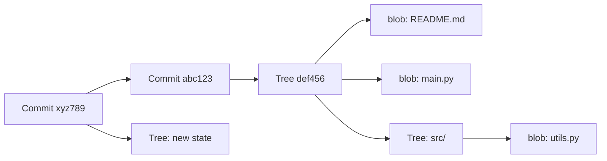
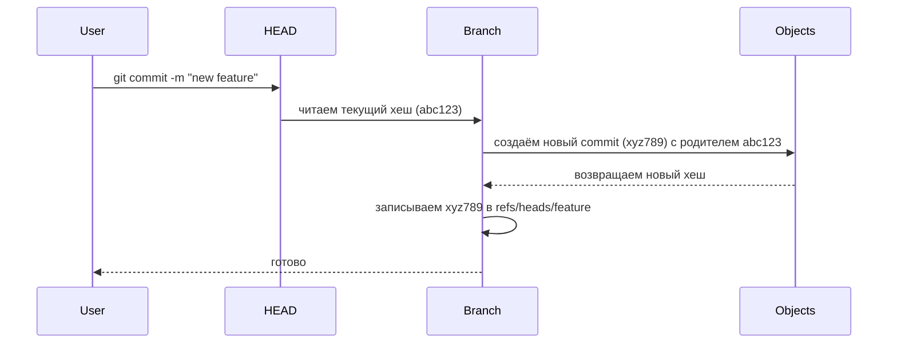

# 🎯 Git для DevOps: Глубокое изучение теории

**Тема подтверждена:** `Git — архитектура, внутренние механизмы, принципы работы`  
**Уровень:** подготовка к собеседованию в топ-компанию  
**Фокус:** теория + контекст DevOps

---

## 📋 План раскрытия темы

```
1. Фундамент: что такое Git и почему он распределённый 
2. Архитектура: объекты, хеши, структура .git
3. Три состояния: Working Directory → Staging → Repository
4. Ветвление: как работают ветки, HEAD, detach state
5. Интеграция: merge vs rebase, fast-forward, конфликты
6. Удалённые репозитории: remote, fetch/push/pull механика
7. Продвинутое: reflog, пакеры, хуки, субмодули
8. DevOps-контекст: CI/CD, GitOps, безопасность, масштабирование
```

---
# Оглавление

1. [[#1️⃣ БЛОК ТЕОРИИ (максимально подробно)]]
2. [[#2️⃣ БЛОК ПРАКТИКИ (команды, конфиги, код)]]
3. [[#3 ДОПОЛНИТЕЛЬНО]]

---

# 1️⃣ БЛОК ТЕОРИИ (максимально подробно)

## 🔹 Что такое Git? Простыми словами

> **Git** — это распределённая система контроля версий (DVCS), которая сохраняет **полную историю изменений** файлов в виде цепочки снимков (snapshots), а не разниц (diffs).

### Ключевое отличие от централизованных систем (SVN, CVS):

```
Централизованная (SVN):          Распределённая (Git):
[Developer] → [Central Server]   [Dev A] ↔ [Local Repo]
                                  [Dev B] ↔ [Local Repo]
                                          ↕ sync via remote
```

- ✅ Каждый разработчик имеет **полную копию** истории и метаданных
- ✅ Работа офлайн: коммиты, ветвление, просмотр истории — локально
- ✅ Нет единой точки отказа: любой клон может стать источником истины

---

## 🔹 Архитектура Git: из чего состоит репозиторий

### 📁 Структура `.git/` (упрощённо)

```
.git/
├── objects/          # База данных: все данные в виде объектов
│   ├── [0-9a-f]{2}/  # Папки по первым 2 символам хеша
│   └── [0-9a-f]{38}  # Файлы-объекты (сжаты zlib)
├── refs/             # Указатели на коммиты
│   ├── heads/        # Локальные ветки: main → commit_sha
│   ├── tags/         # Теги: v1.0 → commit_sha
│   └── remotes/      # Кэш удалённых веток
├── HEAD              # Указатель на текущую ветку/коммит
├── index             # Staging area (бинарный файл)
├── config            # Настройки репо и remote-ов
├── logs/             # История изменений ссылок (для reflog)
└── packed-refs       # Оптимизированное хранение ссылок
```

### 🔑 Четыре типа объектов Git

| Тип | Что хранит | Хеш считается от | Пример использования |
|:---|:---|:---|:---|
| **`blob`** | Содержимое файла (без имени и прав) | Содержимое файла | `README.md`, `app.py` |
| **`tree`** | Структура директории: имена файлов, режимы доступа, хеши blob/tree | Список записей (имя + режим + sha) | Папка `src/` с файлами |
| **`commit`** | Метаданные: автор, дата, сообщение, родитель(и), хеш корневого tree | Все поля + подпись | Снимок состояния проекта |
| **`tag`** | Ссылка на коммит + метаданные (для аннотированных) | Целевой объект + данные тега | `v1.2.3`, `release-2024` |

### 🔄 Как объекты связаны между собой (упрощённая схема)



> ⚠️ **Важно:** объекты **неизменяемы**. Любое изменение файла создаёт новый `blob`, новое дерево — новый `tree`, новый снимок — новый `commit`.

---

## 🔹 Три состояния файлов в Git

```
┌─────────────────┐     git add      ┌─────────────────┐
│ Working Directory│ ─────────────► │ Staging Area    │
│ (рабочая папка)  │ ◄───────────── │ (индекс)        │
└─────────────────┘     git restore  └─────────────────┘
                                │
                                │ git commit
                                ▼
                     ┌─────────────────┐
                     │ Repository      │
                     │ (.git/objects)  │
                     └─────────────────┘
```

| Состояние | Описание | Как попасть | Как выйти |
|:---|:---|:---|:---|
| **Untracked** | Файл не отслеживается Git | Создан в рабочей папке | `git add` → tracked |
| **Tracked + Unmodified** | Файл в репо, без изменений | После `clone`/`checkout`/`commit` | `git edit` → modified |
| **Tracked + Modified** | Файл изменён, но не в индексе | Редактирование | `git add` → staged |
| **Tracked + Staged** | Файл готов к коммиту | `git add` | `git commit` → repository |

---

## 🔹 Ветвление: как работают ветки на низком уровне

### 🎯 Ветка — это просто файл с хешем коммита

```
.git/refs/heads/main содержит:  a1b2c3d4e5f6...

HEAD указывает на: ref: refs/heads/main
```

### 🔄 Что происходит при `git commit` в ветке `feature`:



### 🧠 Detached HEAD: когда HEAD указывает на коммит, а не на ветку

```bash
git checkout abc123  # HEAD теперь = abc123, а не ref: refs/heads/main
```

- ⚠️ Новые коммиты в этом состоянии **не привязаны к ветке**
- ⚠️ При переключении на другую ветку они могут быть потеряны (если не создать ветку)
- ✅ Используется для: просмотра истории, билдов по тегу, временных экспериментов

---

## 🔹 Интеграция изменений: merge vs rebase

### 🔀 Merge: создание нового коммита слияния

```bash
git merge feature
```

```
До:
main:    A─B─C
              \
feature:       D─E

После merge (no-ff):
main:    A─B─C─F─M
              \ /
               E
```

- ✅ Сохраняет полную историю ветвления
- ✅ Прозрачно: видно, что было слияние
- ⚠️ Может создавать "шум" в истории при частых мержах

### 🔁 Rebase: переписывание истории, "перенос" коммитов

```bash
git rebase main  # в ветке feature
```

```
До:
main:    A─B─C
              \
feature:       D─E

После rebase:
main:    A─B─C
              \
feature:       D'─E'  (новые хеши!)
```

- ✅ Линейная, чистая история
- ✅ Упрощает `git bisect`, `git blame`
- ⚠️ **Переписывает историю**: нельзя использовать на публичных ветках
- ⚠️ Требует `--force-with-lease` при пуше

### ⚡ Fast-Forward merge: особый случай

Если целевая ветка не уходила вперёд, Git просто передвигает указатель:

```bash
git merge feature  # если main не менялся после ответвления
```

```
До:
main:    A─B─C
              \
feature:       D─E

После (ff):
main:    A─B─C─D─E  (указатель передвинут, новый коммит не создан)
```

- ✅ Экономит коммиты слияния
- ⚠️ Теряется информация о том, что это была отдельная ветка
- 💡 Отключается флагом `--no-ff` для сохранения истории

---

## 🔹 Удалённые репозитории: механика sync

### 🌐 Что такое remote?

```bash
git remote -v
# origin  https://github.com/user/repo.git (fetch)
# origin  https://github.com/user/repo.git (push)
```

- `origin` — просто **алиас** на URL, можно переименовать
- У одного репо может быть несколько remote: `origin`, `upstream`, `fork`

### 🔁 Механика `fetch` / `pull` / `push`

| Команда | Что делает на низком уровне | Что меняется локально |
|:---|:---|:---|
| `git fetch origin` | Скачивает объекты + обновляет `refs/remotes/origin/*` | Только кэш удалённых веток |
| `git pull` | `fetch` + `merge` (или `rebase`) | Рабочая копия + текущая ветка |
| `git push origin main` | Загружает недостающие объекты + обновляет `refs/heads/main` на remote | Ничего (только сервер) |

### 🧠 Как работает `git push` (упрощённо):

```
1. Git сравнивает локальный main (sha_local) и remote/main (sha_remote)
2. Если sha_remote — предок sha_local → можно пушить (fast-forward)
3. Если ветки разошлись → пуш отклоняется (нужен pull/force)
4. Git отправляет только недостающие объекты (дельта-компрессия)
5. Сервер обновляет ссылку и запускает хуки (pre-receive, post-receive)
```

---

## 🔹 Продвинутые механизмы

### 🕰️ Reflog: журнал всех изменений HEAD и веток

```bash
git reflog
# a1b2c3d HEAD@{0}: commit: new feature
# e4f5g6h HEAD@{1}: checkout: moving from main to feature
# i7j8k9l HEAD@{2}: reset: moving to HEAD~1
```

- ✅ Позволяет восстановить "потерянные" коммиты
- ✅ Хранится локально, не пушится
- ✅ Срок хранения: 90 дней для недостижимых объектов (настраивается)

### 📦 Пакинг объектов: оптимизация хранилища

```bash
git gc              # автоматическая сборка мусора + пакинг
git repack -a -d    # создать один pack-файл, удалить старые
```

- Объекты хранятся в `.git/objects/pack/pack-*.pack`
- Используется дельта-компрессия: похожие файлы хранятся как разницы
- Критично для производительности больших репо

### 🪝 Git hooks: точки расширения

| Хук | Срабатывает | Пример DevOps-использования |
|:---|:---|:---|
| `pre-commit` | Перед созданием коммита | Линтинг, проверка секретов |
| `commit-msg` | После ввода сообщения | Валидация формата (Conventional Commits) |
| `pre-push` | Перед отправкой | Запуск тестов, проверка сборки |
| `post-receive` (server) | После получения пуша | Триггер деплоя, уведомление в Slack |

> 💡 Хуки не коммитятся в репо. Для распространения используют: `husky`, `pre-commit framework`, или CI-валидацию.

---

## 🔹 Связь с другими инструментами и экосистемой

```
[Разработчик]
     │
     ▼
[Git local repo] ←→ [pre-commit hooks: lint, secrets scan]
     │
     ▼
[git push] → [GitHub/GitLab] → [Webhook] → [CI/CD: Jenkins/GitLab CI/Actions]
                                      │
                                      ▼
                           [Build → Test → Scan → Deploy]
                                      │
                                      ▼
                           [GitOps: ArgoCD/Flux sync]
                                      │
                                      ▼
                           [Kubernetes / Cloud]
```

- **CI/CD**: Git — источник триггеров (push, PR, tag) и кода
- **GitOps**: Git — единственный источник истины (SSOT) для инфраструктуры
- **Security**: сканирование истории на секреты, подписанные коммиты (GPG/SSH)
- **Collaboration**: PR/MR, code review, protected branches — надстройки над примитивами Git

---

## 🔑 Ключевые моменты (запомнить!)

1. **Git хранит снимки, а не дельты** — каждый коммит — полное дерево файлов (с дедупликацией через хеши).
2. **Объекты неизменяемы** — любое изменение создаёт новые объекты с новыми хешами.
3. **Ветка — это текстовый файл с хешом** — переключение ветки = перезапись `HEAD` и checkout нужного `tree`.
4. **`fetch` ≠ `pull`** — `fetch` безопасен для анализа, `pull` меняет рабочую копию.
5. **`rebase` переписывает историю** — никогда не используй на публичных ветках.
6. **Reflog — твой спасательный круг** — позволяет откатить почти любое действие локально.
7. **`.git` — это база данных** — понимая её структуру, ты можешь чинить, оптимизировать и аудировать репо.

---

## ⚠️ Частые ошибки и антипаттерны

| Ошибка | Почему плохо | Как правильно |
|:---|:---|:---|
| `git add .` без `git status` | Можно случайно закоммитить секреты, логи, `.env` | Всегда проверяй `git status` и используй `.gitignore` |
| `git push --force` на `main` | Перезаписывает историю коллег, ломает их репо | Используй `--force-with-lease` и только на feature-ветках |
| Коммитить бинарники в Git | Раздувает репо, замедляет клонирование | Используй Git LFS, Artifactory, S3 для артефактов |
| Игнорировать `git reflog` | Невозможно восстановить после ошибочного `reset` | Запомни: `git reflog show` → `git reset --hard HEAD@{n}` |
| Долгоживущие ветки без мержа | Конфликты при интеграции, "merge hell" | Мержи в `main` часто (раз в 1-2 дня), используй feature flags |
| Хранить секреты в репо | Утечка даже после удаления из истории | Используй Vault, env vars, `.gitignore`, `gitleaks` в CI |

---

# 2️⃣ БЛОК ПРАКТИКИ (команды, конфиги, код)

## 🔹 Базовые операции с комментариями

```bash
# === Инициализация и клонирование ===
git init --initial-branch=main          # Создать новый репо с главной веткой 'main'
git clone <url>                         # Полное клонирование (вся история)
git clone --depth=1 <url>               # Shallow clone: только последний коммит (для CI)
git clone --filter=blob:none <url>      # Partial clone: метаданные сразу, файлы по запросу

# === Проверка состояния ===
git status                              # Какие файлы изменены/добавлены/удалены
git status --short                      # Краткий формат: ?? новый, M изменён, D удалён
git diff                                # Изменения в рабочей папке (не в индексе)
git diff --staged                       # Изменения в индексе (подготовленные к коммиту)
git diff main..feature                  # Разница между ветками

# === Добавление и коммит ===
git add file.txt                        # Добавить конкретный файл в индекс
git add -p                              # Интерактивно: выбрать части файла для коммита
git commit -m "feat: добавить авторизацию"  # Создать коммит с сообщением
git commit --amend                      # Переписать последний коммит (если ещё не пушил)

# === Ветвление ===
git branch                              # Список локальных веток
git branch -a                           # Все ветки (локальные + удалённые)
git checkout -b feature/login           # Создать и переключиться на новую ветку
git switch feature/login                # Современная альтернатива checkout для переключения
git branch -d feature/login             # Удалить ветку (безопасно, только если смержена)
git branch -D feature/login             # Принудительное удаление (даже если не смержена)

# === Интеграция ===
git merge feature/login                 # Влить ветку в текущую (создаст merge-commit при необходимости)
git merge --no-ff feature/login         # Всегда создавать merge-commit, даже при fast-forward
git rebase main                         # Перебазировать текущую ветку на актуальный main
git rebase -i HEAD~3                    # Интерактивный rebase: редактировать, объединять, удалять коммиты

# === Удалённые репозитории ===
git remote -v                           # Показать настроенные remote-ы
git remote add upstream <url>           # Добавить ещё один remote (например, апстрим-форк)
git fetch origin                        # Скачать метаданные, не меняя рабочую копию
git fetch --prune                       # + удалить локальные кэши удалённых веток, которых больше нет на сервере
git pull --rebase origin main           # Скачать и перебазировать (вместо слияния)
git push -u origin main                 # Отправить и привязать локальную ветку к удалённой

# === Отмена и восстановление ===
git restore file.txt                    # Отменить изменения в рабочей папке (аналог: git checkout -- file)
git restore --staged file.txt           # Убрать файл из индекса, оставить изменения в рабочей папке
git reset --soft HEAD~1                 # Отменить коммит, оставить изменения в индексе
git reset --mixed HEAD~1                # Отменить коммит и индекс, оставить изменения в рабочей папке (по умолчанию)
git reset --hard HEAD~1                 # ⚠️ Полностью отменить коммит и все изменения (безвозвратно!)
git reflog                              # Показать историю перемещений HEAD
git reset --hard HEAD@{2}               # Восстановить состояние из reflog

# === Работа с историей ===
git log --oneline --graph --all         # Визуализировать историю всех веток
git log -p                              # Показать изменения в каждом коммите (patch)
git log --since="2 weeks ago" -- author="Alice"  # Фильтрация по времени и автору
git blame file.txt                      # Кто и когда менял каждую строку файла
git bisect start                        # Начать бинарный поиск баг-коммита
git bisect bad HEAD                     # Пометить текущий как "плохой"
git bisect good v1.0                    # Пометить тег как "хороший" → Git предложит следующий коммит для проверки
```

## 🔹 Конфигурация и лучшие практики

```bash
# === Глобальная настройка пользователя ===
git config --global user.name "Ivan Ivanov"
git config --global user.email "ivan@example.com"
git config --global init.defaultBranch main  # Современный стандарт вместо 'master'

# === Улучшения для удобства ===
git config --global color.ui auto            # Подсветка в терминале
git config --global pull.rebase true         # По умолчанию pull через rebase, а не merge
git config --global push.default simple      # Пушить только в ветку с тем же именем
git config --global rerere.enabled true      # Автоматически запоминать разрешения конфликтов

# === Безопасность ===
git config --global gpg.format ssh           # Использовать SSH-ключи для подписи коммитов
git config --global user.signingkey ~/.ssh/id_ed25519.pub
git config --global commit.gpgsign true      # Подписывать все коммиты

# === Оптимизация для больших репо ===
git config --global core.preloadindex true   # Параллельная загрузка индекса
git config --global fetch.parallel 10        # Параллельная загрузка объектов с remote
```

## 🔹 Пример `.gitignore` для DevOps-проекта

```gitignore
# === Секреты и конфиги окружения ===
*.env
*.pem
*.key
credentials.json
secrets/

# === Зависимости и артефакты сборки ===
node_modules/
vendor/
*.pyc
__pycache__/
*.o
*.so
dist/
build/

# === IDE и ОС ===
.idea/
.vscode/
*.swp
.DS_Store
Thumbs.db

# === Логи и временные файлы ===
*.log
tmp/
temp/
*.tmp

# === Terraform / IaC ===
.terraform/
*.tfstate
*.tfstate.backup
*.tfvars

# === Docker / Kubernetes ===
*.dockerenv
kubeconfig
*.kube/config
```

## 🔹 CI/CD: оптимизация Git-операций в пайплайне

```yaml
# Пример для GitLab CI (.gitlab-ci.yml)
stages:
  - prepare
  - test
  - deploy

prepare:
  stage: prepare
  script:
    # Shallow clone для скорости + загрузка тегов для версионирования
    - git fetch --tags --prune --depth=1
    # Если нужен доступ к истории для changelog — увеличиваем глубину
    - git fetch --depth=50 origin "$CI_COMMIT_REF_NAME"
    # Кэширование зависимостей
    - cache restore node_modules
  artifacts:
    paths:
      - node_modules/
    expire_in: 1 day
```

---


---

# 3 ДОПОЛНИТЕЛЬНО

## 📚 Ресурсы для углубления

| Ресурс | Тип | Почему стоит |
|:---|:---|:---|
| [Pro Git (книга)](https://git-scm.com/book/ru/v2) | Книга | Официальная, бесплатная, с примерами и внутренним устройством |
| [Git Internals — Pluralsight](https://www.pluralsight.com/courses/git-internals) | Курс | Глубокое погружение в объекты, пакеты, протокол |
| [Learn Git Branching (интерактив)](https://learngitbranching.js.org/) | Игра | Визуально учит ветвлению, rebase, reset |
| [GitLab CI/CD docs](https://docs.gitlab.com/ee/ci/) | Документация | Как интегрировать Git с пайплайнами на практике |
| [GitHub Actions docs](https://docs.github.com/en/actions) | Документация | Триггеры, контексты, оптимизация клонирования |
| [GitOps Handbook by Weaveworks](https://www.weave.works/technologies/gitops/) | Статья | Принципы и паттерны использования Git как источника истины |

## 🧪 Идеи для пет-проекта

1. **"Git под капотом"**: Напиши минимальную реализацию `git init`/`add`/`commit` на Python, используя только хеши и файлы — чтобы понять объекты на практике.
2. **CI-пайплайн с оптимизацией**: Создай репо с 1000+ файлов, настрой `--filter=blob:none` + `sparse-checkout`, замерь время клонирования до/после.
3. **Security audit**: Добавь в репо тестовый секрет, затем удали его через `filter-repo`, проверь, что он действительно недоступен через `git cat-file`.
4. **GitOps demo**: Разверни локально Kind + ArgoCD, настрой синхронизацию из ветки `infra/`, сделай деплой через PR.

## 🔗 Связь с другими темами (что изучить дальше)

```
Git (теория)
│
├─▶ Docker: как собирать образы по коммитам/тегам
├─▶ CI/CD: как триггерить пайплайны по событиям Git
├─▶ Terraform: как управлять state через Git (backend, lock)
├─▶ Kubernetes: как деплоить через GitOps (ArgoCD/Flux)
├─▶ Security: как сканировать историю на секреты (gitleaks, trufflehog)
└─▶ Networking: как работает Git over SSH/HTTP, proxy, firewall правила
```
