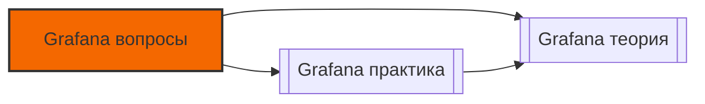

# 📄 Файл: `Grafana вопросы.md`

tags: [grafana, monitoring, observability, devops, interview, questions, dashboards]
aliases: [grafana-questions, grafana-qa, grafana-interview]
created: 2026-05-07
---

# 📊 Grafana для DevOps: Вопросы для собеседования и самопроверки

> [!INFO] Структура
> Вопросы разделены по уровням: 🟢 Junior → 🟡 Middle → 🔴 Senior.  
> Каждый вопрос содержит: краткий ответ, подробное объяснение, DevOps-контекст и связанные команды.

📋 [[#🗂️ Оглавление для навигации|Оглавление]] | [[#🧪 Чек-лист подготовки|Чек-лист]] | [[#🔗 Связь с другими файлами|Связи]]

---

## 🗂️ Оглавление для навигации

### 🟢 Junior (базовое понимание)
- [[#1. Что такое Grafana и зачем она нужна в стеке мониторинга?|1. Что такое Grafana]]
- [[#2. Какие типы визуализаций существуют и когда их применять?|2. Типы визуализаций]]
- [[#3. Что такое Data Source и как его подключить?|3. Data Source]]
- [[#4. Как работают переменные (template variables) и зачем они нужны?|4. Template variables]]
- [[#5. В чём разница между Grafana-managed и Prometheus alerts?|5. Grafana vs Prometheus alerts]]
- [[#6. Как экспортировать и импортировать дашборд?|6. Export/Import]]
- [[#7. Что такое аннотации и как их использовать?|7. Аннотации]]
- [[#8. Как настроить автообновление дашборда?|8. Auto-refresh]]
- [[#9. Что такое provisioning в Grafana?|9. Provisioning]]
- [[#10. Как проверить работоспособность data source?|10. Health check]]

### 🟡 Middle (применение, нюансы, оптимизация)
- [[#11. ⭐ Как оптимизировать дашборд с большим количеством запросов?|11. Оптимизация дашборда ⭐]]
- [[#12. Что такое transformations и зачем они нужны?|12. Transformations]]
- [[#13. Как работает система ролей и разрешений (RBAC)?|13. RBAC]]
- [[#14. ⭐ В чём разница между Organization, Folder и Dashboard permissions?|14. Permissions levels ⭐]]
- [[#15. Как настроить корреляцию метрик и логов (Prometheus + Loki)?|15. Correlation]]
- [[#16. Что такое Library Panels и как их использовать?|16. Library Panels]]
- [[#17. Как отладить медленный дашборд?|17. Debug slow dashboard]]
- [[#18. Как настроить кэширование запросов в Grafana?|18. Caching]]
- [[#19. Что такое Explore mode и когда его использовать?|19. Explore mode]]
- [[#20. Как версионировать дашборды через Git (Dashboard as Code)?|20. Dashboard as Code]]

### 🔴 Senior (архитектура, масштабирование, enterprise)
- [[#21. ⭐ Как спроектировать HA-архитектуру Grafana?|21. HA архитектура ⭐]]
- [[#22. Как работает backend Grafana: обработка запросов, планировщик, кэш?|22. Backend internals]]
- [[#23. В чём trade-offs между SQLite, PostgreSQL и MySQL для Grafana?|23. Database backends]]
- [[#24. ⭐ Как реализовать multi-tenancy для 100+ команд?|24. Multi-tenancy ⭐]]
- [[#25. Как мониторить саму Grafana (self-monitoring)?|25. Self-monitoring]]
- [[#26. Как работает плагин-экосистема: архитектура, безопасность, lifecycle?|26. Plugin ecosystem]]
- [[#27. Как настроить сложную маршрутизацию алертов с эскалацией?|27. Alert routing & escalation]]
- [[#28. Как масштабировать Grafana при тысячах concurrent пользователей?|28. Scaling strategies]]
- [[#29. Как интегрировать SSO (OIDC/SAML) с тонкой настройкой RBAC?|29. SSO + RBAC]]
- [[#30. ⭐ Как спроектировать enterprise observability platform на базе Grafana?|30. Enterprise platform ⭐]]

---

## 🟢 Junior (базовое понимание)

### 1. Что такое Grafana и зачем она нужна в стеке мониторинга?
**Кратко**: Open-source платформа визуализации, аналитики и алертинга для временных рядов, логов и трассировок.

**Подробно**: Grafana не хранит данные, а подключается к внешним источникам (Prometheus, Loki, MySQL, CloudWatch и др.), строит запросы, визуализирует результаты и генерирует уведомления. Поддерживает дашборды, переменные, аннотации и алертинг из коробки.

**DevOps-контекст**: Де-факто стандарт визуализации в cloud-native стеке. Позволяет объединить метрики, логи и трейсы в единый UX, ускоряя расследование инцидентов.

**Команды**: `docker run -p 3000:3000 grafana/grafana`, `curl http://localhost:3000/api/health`.

[[#🗂️ Оглавление для навигации|↑ К оглавлению]]

### 2. Какие типы визуализаций существуют и когда их применять?
**Кратко**: Time series (тренды), Stat (текущее значение), Table (детализация), Bar gauge (прогресс), Heatmap (распределение), Logs/Trace (текст/трассировка).

**Подробно**: 
- `Time series`: для метрик, меняющихся во времени (CPU, RPS)
- `Stat`: для KPI и SLO (error rate, версия)
- `Table`: для сравнения инстансов или топ-N запросов
- `Bar gauge`: для прогресса или квот
- `Logs/Trace`: для текстовых логов (Loki) и трейсов (Tempo)

**DevOps-контекст**: Неправильный выбор панели скрывает инсайты. Для on-call дашбордов: минимум текста, максимум контрастных порогов, крупные цифры.

**Команды**: В панели → панель справа → Visualization → выбрать тип.

[[#🗂️ Оглавление для навигации|↑ К оглавлению]]

### 3. Что такое Data Source и как его подключить?
**Кратко**: Коннектор к внешнему хранилищу данных; Grafana проксирует запросы через него.

**Подробно**: Data source хранит URL, credentials и настройки подключения. При запросе Grafana backend выступает прокси: браузер → Grafana → Data source plugin → внешний API. Поддерживает Prometheus, Loki, Tempo, SQL, NoSQL, облачные метрики.

**DevOps-контекст**: Прокси-архитектура скрывает credentials от браузера, что критично для безопасности. Но добавляет задержку — учитывать при tuning.

**Команды**: Configuration → Data sources → Add data source → Test & Save. API: `POST /api/datasources`.

[[#🗂️ Оглавление для навигации|↑ К оглавлению]]

### 4. Как работают переменные (template variables) и зачем они нужны?
**Кратко**: Динамические плейсхолдеры (`$service`, `$env`) для фильтрации запросов и переиспользования дашбордов.

**Подробно**: Типы: `Query` (из data source), `Custom` (статический список), `Constant`, `Interval`. При изменении переменной Grafana пересчитывает зависимые переменные и обновляет все панели. Поддерживает мульти-выбор и regex-фильтрацию.

**DevOps-контекст**: Позволяют иметь один дашборд на все окружения/сервисы. Снижают поддержку и обеспечивают консистентность.

**Команды**: Dashboard settings → Variables → New → Query/Custom → Save.

[[#🗂️ Оглавление для навигации|↑ К оглавлению]]

### 5. В чём разница между Grafana-managed и Prometheus alerts?
**Кратко**: Grafana-managed хранят правила в БД Grafana, работают для любых data sources; Prometheus-managed хранятся в Prometheus, оцениваются им же.

**Подробно**: 
- `Grafana-managed`: удобный UI, единый движок для Prometheus/Loki/SQL, работают даже если Prometheus down
- `Prometheus-managed`: надёжнее для критичной инфраструктуры, независимы от Grafana, используют Alertmanager

**DevOps-контекст**: Используйте Prometheus alerts для infrastructure/SRE-критичных метрик. Grafana alerts — для бизнес-метрик, логов или быстрых прототипов.

**Команды**: В Grafana: Alerting → Alert rules → Create. В Prometheus: `rules.yml` + `promtool check rules`.

[[#🗂️ Оглавление для навигации|↑ К оглавлению]]

### 6. Как экспортировать и импортировать дашборд?
**Кратко**: Экспорт в JSON через UI или API; импорт через Upload JSON или provisioning.

**Подробно**: При экспорте очищайте поля `id`, `version`, `meta` для Git-версионирования. `uid` оставляйте — это стабильный идентификатор для provisioning и ссылок.

**DevOps-контекст**: Экспорт/импорт — основа миграции и multi-env деплоя. Но для production используйте provisioning (файлы → авто-деплой).

**Команды**: Dashboard → Share → Export → Save to file. API: `GET /api/dashboards/uid/{uid}`, `POST /api/dashboards/import`.

[[#🗂️ Оглавление для навигации|↑ К оглавлению]]

### 7. Что такое аннотации и как их использовать?
**Кратко**: События, отображаемые на графиках вертикальными линиями (деплои, инциденты, релизы).

**Подробно**: Источник: Prometheus query, Loki, API, или ручной ввод. Поддерживают теги, тексты с шаблонизацией (`{{ $labels.version }}`). При наведении показывают контекст события.

**DevOps-контекст**: Критичны для correlation: "метрика упала через 2 минуты после деплоя v1.2.3". Интегрируйте с CI/CD для автоматического создания аннотаций.

**Команды**: Dashboard settings → Annotations → New → Query/Webhook → Enable на панели.

[[#🗂️ Оглавление для навигации|↑ К оглавлению]]

### 8. Как настроить автообновление дашборда?
**Кратко**: Через time picker: выбрать интервал (5s, 30s, 1m, 5m) или отключить.

**Подробно**: Частый refresh увеличивает нагрузку на data sources. `Min interval` в настройках панели ограничивает минимальный шаг запроса. Для long-range анализа refresh лучше отключать.

**DevOps-контекст**: On-call дашборды: 15-30s. Аналитические/менеджерские: 5m или off. Балансируйте актуальность vs нагрузка.

**Команды**: Вверху дашборда → часы → Refresh → выбрать интервал.

[[#🗂️ Оглавление для навигации|↑ К оглавлению]]

### 9. Что такое provisioning в Grafana?
**Кратко**: Механизм загрузки конфигурации (дашборды, data sources, алерты) из файлов при старте.

**Подробно**: YAML-конфиги в `/etc/grafana/provisioning/` указывают пути к JSON-дашбордам. Grafana сравнивает файлы с БД по `uid` и создаёт/обновляет/удаляет ресурсы. Поддерживает `updateIntervalSeconds` для авто-синка.

**DevOps-контекст**: Основа GitOps для Grafana: дашборды в Git, деплой через CI/CD, аудит через git history, откат одной командой.

**Команды**: `dashboards/prod.yaml` → `options.path: /var/lib/grafana/dashboards/prod`. API: `GET /api/provisioning/dashboards`.

[[#🗂️ Оглавление для навигации|↑ К оглавлению]]

### 10. Как проверить работоспособность data source?
**Кратко**: Кнопка "Save & Test" в UI или API-эндпоинт `/api/datasources/proxy/{id}/health`.

**Подробно**: Проверяет доступность, авторизацию и базовый query. Если fails — проверьте сеть, credentials, firewall, совместимость версий.

**DevOps-контекст**: В CI/CD пайплайнах деплоя Grafana добавляйте health-check step перед маркировкой pod как ready.

**Команды**: UI: Data sources → Test. API: `GET /api/datasources/uid/{uid}/health`.

[[#🗂️ Оглавление для навигации|↑ К оглавлению]]

---

## 🟡 Middle (применение, нюансы, оптимизация)

### 11. ⭐ Как оптимизировать дашборд с большим количеством запросов?
**Кратко**: Фильтровать лейблы ДО агрегации, использовать `max data points`, `min interval`, recording rules и кэш.

**Подробно**: 
- Замените `sum(rate(metric[5m])){service="x"}` на `sum(rate(metric{service="x"}[5m]))` → использует индексы
- Установите `Max data points: 100` → не рисовать лишние пиксели
- Включите `cacheTimeout` в data source → кэш повторяющихся запросов
- Вынесите тяжёлые запросы в Prometheus recording rules

**DevOps-контекст**: Один неоптимизированный дашборд с 100+ пользователями может "уронить" Prometheus для всех.

**Команды**: Panel → Query options → Max data points / Min interval. Prometheus: `promtool check rules`.

[[#🗂️ Оглавление для навигации|↑ К оглавлению]]

### 12. Что такое transformations и зачем они нужны?
**Кратко**: Пост-обработка данных между получением от data source и рендерингом.

**Подробно**: Типы: `Reduce` (агрегация), `Join by field` (объединение запросов), `Organize fields` (переименование/скрытие), `Calculate field` (вычисления), `Filter`. Выполняются последовательно на стороне Grafana, не нагружают backend.

**DevOps-контекст**: Позволяют упростить PromQL, вынеся логику в UI. Но для масштаба лучше использовать recording rules в Prometheus.

**Команды**: В панели → вкладка Transform → добавить шаг → применить.

[[#🗂️ Оглавление для навигации|↑ К оглавлению]]

### 13. Как работает система ролей и разрешений (RBAC)?
**Кратко**: Организация → Папка → Дашборд → Data source с наследованием и переопределением прав.

**Подробно**: Роли: `Viewer` (чтение), `Editor` (+ правка), `Admin` (+ управление). Права наследуются от папки, но можно переопределить на уровне дашборда или data source. Enterprise: fine-grained permissions, team sync, scopes.

**DevOps-контекст**: Правильный RBAC предотвращает инциденты: разработчики не меняют prod-дашборды, external contractors видят только свои метрики.

**Команды**: Dashboard → Permissions → Add role/user. API: `POST /api/dashboards/id/{id}/permissions`.

[[#🗂️ Оглавление для навигации|↑ К оглавлению]]

### 14. ⭐ В чём разница между Organization, Folder и Dashboard permissions?
**Кратко**: Org — полная изоляция (multi-tenancy), Folder — логическая группировка внутри org, Dashboard — индивидуальные права на конкретный ресурс.

**Подробно**: 
- `Organization`: отдельные пользователи, data sources, дашборды. Переключение через UI/API.
- `Folder`: наследование прав, удобно для командных границ внутри одного org.
- `Dashboard`: override прав папки, публичный доступ (anonymous), link sharing.

**DevOps-контекст**: Используйте Org для клиентов/изолированных отделов. Folders для команд внутри платформы. Dashboard permissions для специфичных случаев (runbook-only view).

[[#🗂️ Оглавление для навигации|↑ К оглавлению]]

### 15. Как настроить корреляцию метрик и логов (Prometheus + Loki)?
**Кратко**: Общие переменные (`$service`, `$env`), ссылки между панелями, автоматический переход из Explore в Loki/Tempo.

**Подробно**: 
- Настройте одинаковые лейблы в Prometheus и Loki
- В панели метрик: Panel links → ссылка в Loki с `{$service="$service"} | level="error" | $__timeFilter()`
- В логах: парсите `trace_id` → ссылка в Tempo
- Используйте Grafana Explore для ad-hoc расследований

**DevOps-контекст**: Unified observability ускоряет MTTR: не переключаться между 3 инструментами, а исследовать инцидент в одном месте.

[[#🗂️ Оглавление для навигации|↑ К оглавлению]]

### 16. Что такое Library Panels и как их использовать?
**Кратко**: Переиспользуемые панели, которые можно вставлять в несколько дашбордов. Изменения применяются везде.

**Подробно**: Создаются через `Add to library`. Поддерживают переменные дашборда. Версионируются отдельно. Полезно для стандартизации KPI-панелей (error rate, latency, SLO).

**DevOps-контекст**: Снижает дублирование, обеспечивает консистентность визуализации критичных метрик across teams.

**Команды**: Панель → ⋮ → Add to library → выбрать/создать. В другом дашборде: Add panel → Library panels.

[[#🗂️ Оглавление для навигации|↑ К оглавлению]]

### 17. Как отладить медленный дашборд?
**Кратко**: Query inspector → проверить latency, количество серий, transformations → оптимизировать запросы или включить кэш.

**Подробно**: 
1. Откройте Query inspector → Execute → смотрите `Time to run`, `Data points`
2. Проверьте: не запрашиваете ли вы 1M точек для 800px экрана?
3. Убедитесь, что фильтрация по лейблам идёт ДО агрегации
4. Проверьте transformations: не фильтруют ли они всё в пустоту?
5. Включите кэш в data source или Grafana

**DevOps-контекст**: Умение быстро отлаживать дашборды критично для поддержки observability-платформы.

[[#🗂️ Оглавление для навигации|↑ К оглавлению]]

### 18. Как настроить кэширование запросов в Grafana?
**Кратко**: Включить `cacheTimeout` в data source, настроить `[caching]` в `grafana.ini`, использовать Redis для HA.

**Подробно**: 
```ini
[caching]
enabled = true
[cache.redis]
enabled = true
network = tcp
addr = redis:6379
```
Ключ кэша: хеш от запроса + time range + variables. Инвалидация: по TTL, изменению дашборда или manual refresh.

**DevOps-контекст**: Критично при 100+ пользователях: один запрос → кэш → 100 ответов. Но неправильный TTL → устаревшие данные.

[[#🗂️ Оглавление для навигации|↑ К оглавлению]]

### 19. Что такое Explore mode и когда его использовать?
**Кратко**: Режим ad-hoc исследования без привязки к дашборду; поддерживает multi-query, split view, log/metric/traces correlation.

**Подробно**: Позволяет строить запросы "на лету", переключаться между data sources, видеть raw данные, экспортировать в CSV. Идеально для отладки инцидентов, проверки новых метрик, написания сложных PromQL/LogQL.

**DevOps-контекст**: Не заменяет дашборды для регулярного мониторинга, но незаменим для deep-dive анализа.

**Команды**: Левая панель навигации → Explore (компас).

[[#🗂️ Оглавление для навигации|↑ К оглавлению]]

### 20. Как версионировать дашборды через Git (Dashboard as Code)?
**Кратко**: Экспортировать JSON → очистить `id`/`version`/`meta` → положить в репозиторий → деплой через provisioning.

**Подробно**: 
- Храните `uid` для стабильных ссылок
- Структура: `dashboards/prod/service-A.json`, `dashboards/staging/...`
- CI: `jsonnet`/`cue` для генерации, `grafana-cli` для валидации, PR → review → merge → auto-deploy
- `allowUiUpdates: false` в provisioning запрещает ручные правки

**DevOps-контекст**: GitOps для дашбордов: code review, audit trail, reproducibility, rollback. Стандарт для mature DevOps/SRE команд.

[[#🗂️ Оглавление для навигации|↑ К оглавлению]]

---

## 🔴 Senior (архитектура, масштабирование, enterprise)

### 21. ⭐ Как спроектировать HA-архитектуру Grafana?
**Кратко**: Stateless реплики за LB + shared PostgreSQL HA + Redis cache + session sync.

**Подробно**: 
- Grafana backend stateless: всё состояние в БД
- `readinessProbe: /api/health`, `maxUnavailable: 0` для zero-downtime
- PostgreSQL с синхронной репликацией для критичных данных
- Redis для шаринга кэша и сессий между репликами
- Alerting: лидер-элекция через БД для избежания дублирования оценки

**DevOps-контекст**: HA критично для observability: если мониторинг упал — вы слепы при инциденте. Но сложность растёт: нужно мониторить саму инфраструктуру мониторинга.

**Команды**: Kubernetes: `Deployment replicas: 3`, `Service`, `Ingress`. `grafana.ini`: `database.type=postgres`, `cache.redis.enabled=true`.

[[#🗂️ Оглавление для навигации|↑ К оглавлению]]

### 22. Как работает backend Grafana: обработка запросов, планировщик, кэш?
**Кратко**: Go HTTP server → middleware (auth, logging) → router → business logic → plugin proxy → response processing → cache → JSON.

**Подробно**: 
- `HTTP Server`: REST API, WebSocket для live-обновлений
- `Scheduler/Alerting engine`: cron-like evaluation, goroutine isolation, state machine (Normal → Pending → Firing)
- `Caching`: TTL-based, key = hash(request+range+vars), Redis для HA
- `Plugin management`: gRPC sandbox, signed plugins, auto-update

**DevOps-контекст**: Понимание backend помогает тюнить производительность: увеличить pool соединений к БД, настроить кэш, ограничить concurrency.

[[#🗂️ Оглавление для навигации|↑ К оглавлению]]

### 23. В чём trade-offs между SQLite, PostgreSQL и MySQL для Grafana?
**Кратко**: SQLite → dev/single-node; PostgreSQL → production/recommended; MySQL → если уже есть инфраструктура.

**Подробно**: 
- `SQLite`: файловая блокировка, риск corruption, не для prod
- `PostgreSQL`: WAL, point-in-time recovery, высокая конкурентность, рекомендация Grafana Labs
- `MySQL`: binlog, репликация, требует тщательного тюнинга (`innodb`, query cache)

**DevOps-контекст**: Выбор БД — стратегическое решение. Миграция с SQLite на PostgreSQL возможна, но требует downtime. Планировать заранее.

**Команды**: `grafana.ini`: `[database] type=postgres, host=..., ssl_mode=require`.

[[#🗂️ Оглавление для навигации|↑ К оглавлению]]

### 24. ⭐ Как реализовать multi-tenancy для 100+ команд?
**Кратко**: Organizations для сильной изоляции + Folders/RBAC для средней + Data source scoping для слабой.

**Подробно**: 
- `Organizations`: полные silos, разные пользователи/источники
- `Folder permissions`: одна org, разные папки с RBAC
- `Auto-filtering`: `${__org.name}` в запросах или Prometheus relabel по `X-Scope-OrgID`
- Enterprise: team sync, fine-grained scopes, audit logs

**DevOps-контекст**: Баланс между изоляцией и операционной сложностью. Орги дают сильную изоляцию, но усложняют кросс-командный мониторинг.

[[#🗂️ Оглавление для навигации|↑ К оглавлению]]

### 25. Как мониторить саму Grafana (self-monitoring)?
**Кратко**: Включить встроенные метрики `/metrics`, мониторить HTTP latency, DB connections, alerting queue, ресурсы.

**Подробно**: 
```ini
[metrics] enabled = true, address = 0.0.0.0:2112
```
Ключевые метрики: `grafana_http_request_duration_seconds`, `grafana_datasource_request_errors`, `grafana_alerting_active_alerts`, `process_resident_memory_bytes`. Настроить алерты на 5xx, high latency, down replicas.

**DevOps-контекст**: "Who monitors the monitor?" — критичный вопрос. Падение Grafana не должно оставаться незамеченным.

[[#🗂️ Оглавление для навигации|↑ К оглавлению]]

### 26. Как работает плагин-экосистема: архитектура, безопасность, lifecycle?
**Кратко**: Frontend (React/TS) + Backend (Go/gRPC) → сборка → подпись → установка → sandbox execution.

**Подробно**: 
- `@grafana/data/ui/runtime` пакеты
- Backend плагины в изолированном процессе (gRPC)
- Подпись: `grafana-cli plugins sign` или Grafana Cloud auto-sign
- Security: least privilege, network restrictions, no raw FS access, encrypted secrets

**DevOps-контекст**: Кастомные плагины расширяют функциональность, но увеличивают surface area для безопасности. Требуют code review, signing, тестирования на разных версиях.

[[#🗂️ Оглавление для навигации|↑ К оглавлению]]

### 27. Как настроить сложную маршрутизацию алертов с эскалацией?
**Кратко**: Notification policies с `group_by`, `continue`, `mute timings`, интеграция с PagerDuty/OpsGenie для ротации.

**Подробно**: 
- Базовая политика → Slack
- Nested: `severity=critical` → PagerDuty, `continue=true`
- `mute_time_intervals`: не слать warning ночью
- `repeat_interval`: 4h для suppression
- On-call: синхронизация с OpsGenie/PagerDuty schedules

**DevOps-контекст**: Правильная эскалация снижает alert fatigue: не будить всех по каждому warning, но гарантировать реакцию на critical.

[[#🗂️ Оглавление для навигации|↑ К оглавлению]]

### 28. Как масштабировать Grafana при тысячах concurrent пользователей?
**Кратко**: Read replicas для БД + Redis cache + CDN для static assets + query sharding + async rendering.

**Подробно**: 
- Разделение чтения/записи: primary для writes, replicas для dashboard loads
- CDN: CloudFront/Cloudflare для JS/CSS
- Query sharding: разные data sources для разных метрик, объединение в панелях
- Async rendering: message queue для отчетов/скриншотов

**DevOps-контекст**: Масштабирование — не только инфраструктура, но и оптимизация запросов, кэширование, архитектурные решения.

[[#🗂️ Оглавление для навигации|↑ К оглавлению]]

### 29. Как интегрировать SSO (OIDC/SAML) с тонкой настройкой RBAC?
**Кратко**: OIDC/SAML provider → claim mapping → role assignment → team sync → fine-grained scopes.

**Подробно**: 
```ini
[auth.generic_oauth]
enabled = true
client_id = ...
role_attribute_path = contains(roles[*], 'admin') && 'Admin' || 'Viewer'
groups_attribute_path = groups
```
- `Just-in-time provisioning`: авто-создание пользователей
- `Team sync`: синхронизация групп из IdP
- Enterprise: scopes, delegated admin, audit

**DevOps-контекст**: SSO + RBAC критичны для compliance: аудит кто что делал, быстрый offboarding, least privilege.

[[#🗂️ Оглавление для навигации|↑ К оглавлению]]

### 30. ⭐ Как спроектировать enterprise observability platform на базе Grafana?
**Кратко**: HA Grafana + shared storage + multi-tenant RBAC + Prometheus/Loki/Tempo integration + GitOps provisioning + self-monitoring + SSO/audit.

**Подробно**: 
- Архитектура: LB → 3× Grafana → PostgreSQL HA + Redis → Data Sources (Prometheus, Loki, Tempo)
- Provisioning: все дашборды/alerts в Git, CI/CD деплой, `allowUiUpdates: false`
- Security: OIDC/SAML, fine-grained RBAC, audit logs, secrets in KMS, CSP/CORS
- Self-monitoring: метрики Grafana → отдельный Prometheus, алерты на health, latency, errors
- UX: personas (SRE, dev, manager), correlated dashboards, library panels, drill-down links
- Compliance: GDPR/SOC2 alignment, data retention policies, access reviews

**DevOps-контекст**: Enterprise платформа — это не только дашборды, а процесс, безопасность, аудит, UX и reliability. Требует cross-functional alignment (SRE, Security, Platform, Dev).

**Чек-лист перед production**:
- [ ] HA архитектура с zero-downtime деплоем
- [ ] GitOps provisioning для всех ресурсов
- [ ] SSO + RBAC + audit logging включены
- [ ] Self-monitoring и алерты на здоровье платформы
- [ ] Runbooks для incident response и disaster recovery

[[#🗂️ Оглавление для навигации|↑ К оглавлению]]

---

## 🧪 Чек-лист подготовки к собеседованию

- [ ] Могу объяснить разницу между Grafana и Prometheus за 1 минуту
- [ ] Понимаю, как работают variables, transformations и library panels
- [ ] Знаю разницу между Grafana-managed и Prometheus alerts
- [ ] Умею оптимизировать дашборд: max data points, min interval, кэш, recording rules
- [ ] Понимаю модель разрешений: org → folder → dashboard → data source
- [ ] Могу настроить provisioning и объяснить Dashboard as Code
- [ ] Знаю, как отладить медленный дашборд через Query inspector
- [ ] Понимаю HA-архитектуру: stateless backend, shared DB, cache, LB
- [ ] Могу спроектировать multi-tenancy и SSO + RBAC интеграцию
- [ ] Понимаю принципы self-monitoring и enterprise observability platform

> [!TIP] Практика
> Лучшая подготовка — создать локальный стенд:
> 1. `docker-compose up` с Grafana + Prometheus + Loki
> 2. Настроить provisioning: дашборды из Git → авто-деплой
> 3. Создать цепочку переменных: `$env` → `$service` → `$instance`
> 4. Настроить алерт → проверить уведомление в Slack webhook
> 5. Включить встроенные метрики Grafana → создать дашборд self-monitoring
> 6. Попробовать Explore: метрика → клик → логи → трейс

---

## 🔗 Связь с другими файлами

> [!TIP] Следующие шаги
> После проработки вопросов:
> - [[Grafana практика]] — отработка сценариев на практике
> - [[Grafana теория]] — глубокое понимание архитектуры и механики
> - [[Prometheus практика]] — углублённая работа с запросами
> - [[Alertmanager практика]] — настройка алертинга и уведомлений
> - [[Kubernetes практика]] — kube-prometheus-stack, service discovery



[[#🗂️ Оглавление для навигации|↑ К оглавлению
Observability (теория & вопросы)
│
├─▶ [[Prometheus теория]]: архитектура, TSDB, remote storage
├─▶ [[Prometheus практика]]: запросы, алерты, отладка
├─▶ [[Prometheus вопросы]]: собеседование, самопроверка
├─▶ [[Grafana теория]]: архитектура, backend, плагины
├─▶ [[Grafana практика]]: дашборды, variables, annotations
├─▶ [[Grafana вопросы]]: собеседование, самопроверка ← этот файл
├─▶ [[Alertmanager теория]]: routing, inhibit, clustering
├─▶ [[Alertmanager практика]]: настройка уведомлений
├─▶ [[Loki практика]]: логирование, LogQL, парсинг
├─▶ [[Tempo практика]]: трассировка, TraceQL, корреляция
├─▶ [[Kubernetes практика]]: kube-prometheus, service discovery
├─▶ [[CICD практика]]: деплой как код
├─▶ [[Terraform практика]]: инфраструктура для observability
├─▶ [[Security практика]]: метрики безопасности, audit
└─▶ [[Networking практика]]: blackbox, сетевые метрики