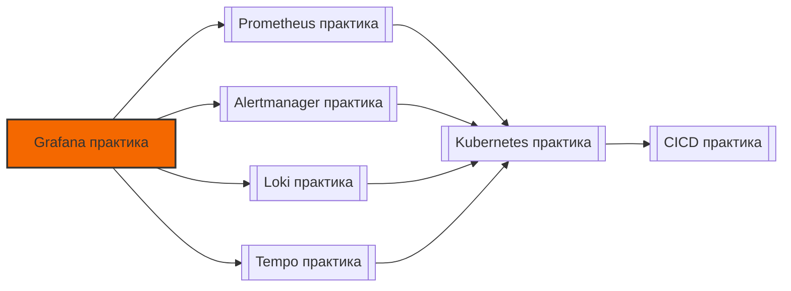

# 📄 Файл: `Grafana практика.md`

tags: [grafana, monitoring, observability, devops, dashboards, promql, practice]
aliases: [grafana-practice, grafana-labs, dashboard-exercises]
created: 2026-05-07
---

# 📊 Grafana для DevOps: Практические сценарии и упражнения

> [!INFO] Структура
> Сценарии разделены по уровням: 🟢 Junior → 🟡 Middle → 🔴 Senior.  
> Каждый сценарий содержит: задачу, решение, разбор и DevOps-контекст.

📋 [[#🗂️ Оглавление для навигации|Оглавление]] | [[#🧪 Чек-лист навыков|Чек-лист]] | [[#🔗 Связь с другими файлами|Связи]]

---

## 🗂️ Оглавление для навигации

### 🟢 Junior (базовые дашборды и визуализация)
- [[#1. Создать базовый дашборд с 3 панелями: RPS, latency, errors|1. Базовый дашборд]]
- [[#2. Подключить Prometheus как data source и проверить соединение|2. Prometheus data source]]
- [[#3. Использовать переменные для фильтрации по сервису и окружению|3. Variables: $service, $env]]
- [[#4. Настроить пороги (thresholds) и цветовую индикацию статусов|4. Thresholds и цвета]]
- [[#5. Добавить аннотации для отображения деплоев на графиках|5. Аннотации: деплои]]
- [[#6. Экспортировать и импортировать дашборд как JSON|6. Export/Import JSON]]
- [[#7. Настроить простой алерт из панели (Grafana-managed)|7. Базовый алерт в Grafana]]
- [[#8. Использовать разные типы панелей: Time series, Stat, Table|8. Типы панелей]]
- [[#9. Настроить авто-обновление и временной диапазон дашборда|9. Refresh и time range]]
- [[#10. Создать ссылку между панелями для детализации (drill-down)|10. Panel links]]

### 🟡 Middle (продвинутая визуализация, трансформации, алертинг)
- [[#11. ⭐ Использовать PromQL-переменные в запросах панелей|11. PromQL + variables ⭐]]
- [[#12. Применить трансформации: reduce, join, organize fields|12. Transformations]]
- [[#13. Версионировать дашборды через JSON и Git (Dashboard as Code)|13. Dashboard as Code]]
- [[#14. Создать Library Panel для переиспользования компонентов|14. Library Panels]]
- [[#15. Использовать смешанные data sources в одном дашборде|15. Mixed data sources]]
- [[#16. Настроить кастомные переменные: query, regex, constant|16. Custom variables]]
- [[#17. Оптимизировать дашборд: уменьшить нагрузку на Prometheus|17. Query optimization]]
- [[#18. Настроить notification policies в Alertmanager из Grafana|18. Notification policies]]
- [[#19. Использовать provisioning для деплоя дашбордов через GitOps|19. Provisioning + GitOps]]
- [[#20. Отладить почему панель грузится медленно или показывает нет данных|20. Debug panels]]

### 🔴 Senior (архитектура, масштабирование, enterprise-паттерны)
- [[#21. ⭐ Спроектировать multi-tenant Grafana для 100+ команд|21. Multi-tenant архитектура ⭐]]
- [[#22. Настроить кэширование запросов и оптимизировать backend|22. Caching и backend tuning]]
- [[#23. Разработать кастомный плагин для специфичной визуализации|23. Custom plugins]]
- [[#24. ⭐ Реализовать HA-развёртывание Grafana с балансировкой|24. HA deployment ⭐]]
- [[#25. Настроить сложную маршрутизацию алертов: эскалация, on-call|25. Advanced alerting]]
- [[#26. Мониторить саму Grafana: метрики, логи, трассировка|26. Self-monitoring Grafana]]
- [[#27. Интегрировать SSO: OIDC, SAML, LDAP с RBAC|27. SSO и авторизация]]
- [[#28. Использовать jsonnet/Tanka/CUE для генерации дашбордов|28. Dashboard as Code: jsonnet]]
- [[#29. Спроектировать навигацию и UX для разных персон: SRE, dev, manager|29. Observability UX]]
- [[#30. ⭐ Создать единую observability-платформу: Grafana + Loki + Tempo + Prometheus|30. Full observability stack ⭐]]

---

## 🟢 Junior (базовые дашборды и визуализация)

### 1. Создать базовый дашборд с 3 панелями: RPS, latency, errors
**Задача**: Дашборд "здоровья" сервиса с тремя ключевыми метриками.

**Решение**:
1. New Dashboard → Add new panel
2. Panel 1 (RPS):
   - Query: `sum(rate(http_requests_total{service="$service", env="$env"}[5m]))`
   - Visualization: Time series
   - Title: "Requests per second"
3. Panel 2 (p95 latency):
   - Query: `histogram_quantile(0.95, sum(rate(http_request_duration_seconds_bucket{service="$service"}[5m])) by (le))`
   - Visualization: Time series, unit: seconds
4. Panel 3 (Error rate):
   - Query: `sum(rate(http_requests_total{status=~"5..", service="$service"}[5m])) / sum(rate(http_requests_total{service="$service"}[5m])) * 100`
   - Visualization: Stat, thresholds: 1% (warning), 5% (critical)

**Разбор**: 
- Golden Signals: traffic, latency, errors — база для любого сервиса [[40]]
- Использование переменных `$service` позволяет переиспользовать дашборд

**DevOps-контекст**: Такой дашборд должен отвечать на вопрос "сервис здоров?" за 5 секунд. Добавлять в on-call runbooks.

**Проверка**: Переключить `$service` переменную — все панели должны обновиться.

[[#🗂️ Оглавление для навигации|↑ К оглавлению]]

### 2. Подключить Prometheus как data source и проверить соединение
**Задача**: Настроить подключение к Prometheus в Grafana.

**Решение**:
1. Configuration → Data sources → Add data source → Prometheus
2. Настройки:
   ```
   Name: Prometheus-prod
   URL: http://prometheus.prod.svc:9090
   Scrape interval: 30s (должен совпадать с настройками Prometheus)
   HTTP Method: POST (лучше для длинных запросов)
   ```
3. Auth: если требуется, настроить Basic auth или JWT
4. Save & Test → должно показать "Data source is working"

**Разбор**:
- `Scrape interval` влияет на минимальный шаг в запросах
- `HTTP Method: POST` позволяет отправлять длинные PromQL-запросы без обрезки
- Для HA Prometheus: указать несколько URL или использовать LB

**DevOps-контекст**: Неправильный `scrape_interval` в Grafana → неточные графики. Всегда синхронизировать с настройками Prometheus.

**Проверка**: В панели Query inspector → Execute → увидеть сырой ответ от Prometheus.

[[#🗂️ Оглавление для навигации|↑ К оглавлению]]

### 3. Использовать переменные для фильтрации по сервису и окружению
**Задача**: Сделать дашборд универсальным через variables.

**Решение**:
1. Dashboard settings → Variables → New
2. Variable `$env`:
   ```
   Name: env
   Type: Query
   Data source: Prometheus-prod
   Query: label_values(http_requests_total, env)
   Refresh: On dashboard load
   Multi-value: ☐
   Include All option: ☑
   ```
3. Variable `$service`:
   ```
   Name: service
   Type: Query
   Query: label_values(http_requests_total{env="$env"}, service)
   Refresh: On change (зависит от $env)
   ```

**Разбор**:
- `label_values(metric, label)` — получить уникальные значения лейбла
- `Refresh: On change` — обновлять зависимые переменные при смене родителя
- Использовать `regex` для фильтрации: `/prod-.*/`

**DevOps-контекст**: Variables позволяют иметь один дашборд на все окружения/сервисы — меньше поддержки, консистентный UX.

**Промежуточная проверка**: В Query панели использовать `$service` и `$env` — запрос должен подставляться корректно.

[[#🗂️ Оглавление для навигации|↑ К оглавлению]]

### 4. Настроить пороги (thresholds) и цветовую индикацию статусов
**Задача**: Визуально выделить проблемные значения.

**Решение** (для панели типа Stat):
1. Right panel → Thresholds
2. Добавить пороги:
   ```
   Mode: Absolute
   Steps:
     - Value: 0, Color: green
     - Value: 1, Color: yellow   # 1% ошибок
     - Value: 5, Color: red      # 5% ошибок
   ```
3. В поле "Show threshold markers/labels" включить отображение

**Разбор**:
- `Absolute`: пороги по абсолютному значению метрики
- `Percentage`: пороги в % от максимума (для прогресс-баров)
- Цвета должны соответствовать общему стандарту команды (зелёный/жёлтый/красный)

**DevOps-контекст**: Цветовая индикация ускоряет реакцию: на дашборде из 20 панелей сразу видно, где проблемы.

**Проверка**: Сымитировать рост ошибок → панель должна сменить цвет.

[[#🗂️ Оглавление для навигации|↑ К оглавлению]]

### 5. Добавить аннотации для отображения деплоев на графиках
**Задача**: Видеть на графиках, когда происходили деплои.

**Решение**:
1. Dashboard settings → Annotations → New
2. Настройка:
   ```
   Name: Deployments
   Data source: Prometheus-prod
   Query: changes(deployment_count{service="$service"}[1m]) > 0
   Text: Deployment {{ $labels.version }}
   Tags: deployment, release
   ```
3. В панели: Annotations → включить "Deployments"

**Альтернатива через Loki** (если логи деплоев там):
```
{app="deploy-bot", level="info"} | json | version != ""
```

**Разбор**:
- Аннотации помогают коррелировать изменения метрик с событиями
- `Text` поддерживает шаблонизацию через `{{ $labels.xxx }}`

**DevOps-контекст**: При инциденте сразу видно: "ага, метрика упала через 2 минуты после деплоя версии 1.2.3".

**Проверка**: Сделать тестовый деплой → на графиках должна появиться вертикальная линия с подписью.

[[#🗂️ Оглавление для навигации|↑ К оглавлению]]

### 6. Экспортировать и импортировать дашборд как JSON
**Задача**: Сохранить дашборд для версионирования или переноса.

**Решение**:
1. Экспорт: Dashboard → Share → Export → Save to file (JSON)
2. Импорт: Dashboard → Import → Upload JSON file или вставить содержимое
3. При импорте: выбрать data source mapping (если имена отличаются)

**Разбор**:
- JSON содержит: панели, переменные, аннотации, настройки времени
- Поле `uid` — уникальный идентификатор дашборда (важно для provisioning)
- `version` — инкрементируется при каждом сохранении

**DevOps-контекст**: Экспорт в JSON — первый шаг к Dashboard as Code. Но лучше использовать provisioning (см. вопрос 19).

**Проверка**: Экспортировать → удалить дашборд → импортировать обратно → всё должно работать.

[[#🗂️ Оглавление для навигации|↑ К оглавлению]]

### 7. Настроить простой алерт из панели (Grafana-managed)
**Задача**: Создать алерт прямо из панели без Prometheus rules.

**Решение**:
1. В панели: Alert tab → Create alert rule from this panel
2. Настройка:
   ```
   Rule name: HighErrorRate-{{ $labels.service }}
   Condition: WHEN last() OF query(A, 5m, now) IS ABOVE 5
   Evaluation: Every 1m, For 2m
   Labels: severity=warning, team={{ $labels.team }}
   Annotations:
     summary: "Error rate > 5% for {{ $labels.service }}"
     runbook_url: "https://wiki/runbooks/high-errors"
   ```
3. Contact point: выбрать Slack/PagerDuty

**Разбор**:
- Grafana-managed alerts хранятся в базе Grafana, не в Prometheus
- Удобно для быстрых алертов без деплоя Prometheus rules
- Минус: не работают при недоступности Grafana

**DevOps-контекст**: Использовать для non-critical алертов или когда нет доступа к Prometheus config. Критичные алерты лучше в Prometheus.

**Проверка**: Сымитировать условие → проверить уведомление в Slack.

[[#🗂️ Оглавление для навигации|↑ К оглавлению]]

### 8. Использовать разные типы панелей: Time series, Stat, Table
**Задача**: Подобрать визуализацию под тип данных.

**Решение**:
| Тип данных | Лучшая панель | Пример использования |
|-----------|--------------|---------------------|
| Временной ряд | Time series | RPS, latency, CPU |
| Текущее значение | Stat | Error rate %, version |
| Таблица с деталями | Table | Список инстансов с метриками |
| Распределение | Histogram | Latency distribution |
| Геоданные | Geomap | Запросы по регионам |
| Логи | Logs | Поиск по строкам (через Loki) |

**Пример Table панели**:
```
Query: 
  topk(10, sum(rate(http_requests_total[5m])) by (instance))

Transformations:
  - Organize fields: скрыть __name__, переименовать Value → RPS
  - Sort: by RPS, descending
```

**DevOps-контекст**: Правильный выбор панели ускоряет понимание данных. Не перегружать дашборд: 5-9 панелей на экран — оптимально.

**Проверка**: Переключить визуализацию у одной панели → увидеть, как меняется восприятие данных.

[[#🗂️ Оглавление для навигации|↑ К оглавлению]]

### 9. Настроить авто-обновление и временной диапазон дашборда
**Задача**: Оптимизировать refresh для баланса между актуальностью и нагрузкой.

**Решение**:
1. Вверху дашборда:
   ```
   Time range: Last 1 hour (для оперативного мониторинга)
   Auto-refresh: Every 30s (для NOC), Every 5m (для разработчиков)
   ```
2. Для отдельных панелей: Panel options → Query → Min interval = 30s

**Разбор**:
- Частый refresh → больше запросов к Prometheus → нагрузка
- `Min interval` в запросе предотвращает слишком частые вызовы
- Для long-term анализа: ставить диапазон 7d, refresh отключить

**DevOps-контекст**: В on-call дашбордах нужен быстрый refresh (15-30s). В аналитических — можно реже, чтобы не грузить backend.

**Проверка**: Включить Query inspector → увидеть частоту реальных запросов к Prometheus.

[[#🗂️ Оглавление для навигации|↑ К оглавлению]]

### 10. Создать ссылку между панелями для детализации (drill-down)
**Задача**: Позволить "провалиться" из общей статистики в детали.

**Решение** (Panel links):
1. В панели "Service overview" → Panel options → Links → Add link
2. Настройка:
   ```
   Title: View details for ${__field.labels.instance}
   URL: /d/service-details?var-instance=${__field.labels.instance}&${__url_time_range}
   Dashboard: Service details (по UID или названию)
   ```
3. Переменные в ссылке:
   - `${__field.labels.instance}` — значение лейбла из текущей строки
   - `${__url_time_range}` — сохранить выбранный временной диапазон

**Разбор**:
- Drill-down улучшает UX: от общего к частному
- `${__url_time_range}` сохраняет контекст времени при переходе

**DevOps-контекст**: Позволяет создавать иерархические дашборды: Company → Team → Service → Instance.

**Проверка**: Кликнуть по строке в Table → должен открыться детальный дашборд с тем же временем.

[[#🗂️ Оглавление для навигации|↑ К оглавлению]]

---

## 🟡 Middle (продвинутая визуализация, трансформации, алертинг)

### 11. ⭐ Использовать PromQL-переменные в запросах панелей
**Задача**: Динамически подставлять значения переменных в PromQL.

**Решение**:
```promql
# Базовый запрос с переменными
sum(rate(http_requests_total{service="$service", env="$env", instance=~"$instance"}[5m])) by (instance)

# Если переменная мульти-значная (Multi-value: ☑):
# Grafana автоматически преобразует $instance в regex: (inst1|inst2|inst3)
# В запросе использовать: instance=~"$instance" (с =~ для regex)

# Для переменной с "All":
# Добавить условие: ${instance:pipe} для преобразования в pipe-список
instance=~"${instance:pipe}"
```

**Разбор**:
- `$var` — простая подстановка строки
- `=~"$var"` — regex match (нужно для мульти-значных переменных)
- `${var:regex}`, `${var:pipe}`, `${var:csv}` — форматы подстановки

**DevOps-контекст**: Позволяет создавать гибкие дашборды без дублирования панелей. Критично для multi-service мониторинга.

**Проверка**: В Query inspector → увидеть финальный запрос после подстановки переменных.

[[#🗂️ Оглавление для навигации|↑ К оглавлению]]

### 12. Применить трансформации: reduce, join, organize fields
**Задача**: Обработать данные после получения из источника.

**Решение** (Transform tab):
1. Reduce: агрегировать временной ряд в одно значение
   ```
   Mode: Last / Mean / Min / Max
   Calculations: Last → для Stat панели
   ```
2. Join by field: объединить данные из нескольких запросов
   ```
   Query A: cpu_usage{instance="x"}
   Query B: memory_usage{instance="x"}
   Join by: instance → одна таблица с двумя метриками
   ```
3. Organize fields: переименовать, скрыть, переупорядочить колонки
   ```
   Hide: Time, __name__
   Rename: Value → CPU %
   ```

**Разбор**:
- Трансформации выполняются на стороне Grafana, не нагружают Prometheus
- Порядок трансформаций важен: выполняются сверху вниз

**DevOps-контекст**: Позволяют создавать сложные представления без усложнения PromQL-запросов.

**Проверка**: Добавить трансформацию → увидеть изменённые данные в таблице.

[[#🗂️ Оглавление для навигации|↑ К оглавлению]]

### 13. Версионировать дашборды через JSON и Git (Dashboard as Code)
**Задача**: Хранить дашборды в репозитории для аудита и совместной работы.

**Решение**:
1. Экспортировать дашборд в JSON
2. Очистить метаданные для версионирования:
   ```json
   {
     "uid": "service-overview",  // оставить для provisioning
     "version": 1,                // сбросить
     "id": null,                  // удалить
     "meta": {}                   // удалить
   }
   ```
3. Положить в репозиторий: `dashboards/prod/service-overview.json`
4. Добавить в `.gitignore` временные файлы, но не сами дашборды

**Разбор**:
- `uid` — стабильный идентификатор, нужен для provisioning
- Хранить в папках по окружениям: `dashboards/prod/`, `dashboards/staging/`

**DevOps-контекст**: Позволяет code review изменений дашбордов, откат к предыдущим версиям, согласованность между окружениями.

**Проверка**: Изменить дашборд в UI → экспортировать → `git diff` должен показать изменения.

[[#🗂️ Оглавление для навигации|↑ К оглавлению]]

### 14. Создать Library Panel для переиспользования компонентов
**Задача**: Переиспользовать панель в нескольких дашбордах.

**Решение**:
1. Создать панель → три точки → Add to library
2. Настройка:
   ```
   Name: Error rate indicator
   UID: error-rate-lib
   Description: Stat panel with thresholds for error rate
   Folder: Shared components
   ```
3. Использовать в другом дашборде: Add panel → Library panels → выбрать "Error rate indicator"

**Разбор**:
- Изменения в library panel применяются во всех дашбордах, где она используется
- Переменные дашборда (`$service`) работают внутри library panel

**DevOps-контекст**: Снижает дублирование, обеспечивает консистентность визуализации критичных метрик.

**Проверка**: Изменить порог в library panel → проверить, что он обновился во всех дашбордах.

[[#🗂️ Оглавление для навигации|↑ К оглавлению]]

### 15. Использовать смешанные data sources в одном дашборде
**Задача**: Показать метрики из Prometheus и логи из Loki на одном дашборде.

**Решение**:
1. Добавить панели с разными data sources:
   - Panel 1: Prometheus → `rate(http_requests_total[5m])`
   - Panel 2: Loki → `{service="$service"} | json | level="error"`
2. Синхронизировать переменные:
   ```
   В Loki-запросе использовать те же $service, $env
   ```
3. Настроить общий time picker для всех панелей

**Разбор**:
- Каждый запрос использует свой data source, но переменные дашборда общие
- Можно добавить корреляцию: клик по точке на графике → показать логи за тот же период

**DevOps-контекст**: Unified observability: метрики + логи + трассировка в одном месте ускоряют расследование инцидентов.

**Проверка**: Переключить `$service` → должны обновиться и метрики, и логи.

[[#🗂️ Оглавление для навигации|↑ К оглавлению]]

### 16. Настроить кастомные переменные: query, regex, constant
**Задача**: Создать гибкие переменные для фильтрации.

**Решение**:
1. Variable типа `Query`:
   ```
   Query: label_values(http_requests_total, region)
   Regex: /prod-(.*)/  # оставить только часть после prod-
   Sort: Alphabetical
   ```
2. Variable типа `Custom`:
   ```
   Values: dev,staging,prod
   Multi-value: ☑
   ```
3. Variable типа `Constant`:
   ```
   Name: default_step
   Value: 30s
   Использовать в запросе: rate(metric[${default_step}])
   ```

**Разбор**:
- `Regex` позволяет трансформировать значения перед подстановкой
- `Constant` удобен для параметров, которые редко меняются

**DevOps-контекст**: Позволяют адаптировать дашборд под разные сценарии без изменения запросов.

**Проверка**: В панели использовать новую переменную → увидеть подставленное значение в Query inspector.

[[#🗂️ Оглавление для навигации|↑ К оглавлению]]

### 17. Оптимизировать дашборд: уменьшить нагрузку на Prometheus
**Задача**: Ускорить загрузку дашборда и снизить нагрузку на backend.

**Решение**:
1. В запросах панелей:
   ```promql
   # Добавить фильтрацию по лейблам ДО агрегации
   sum(rate(http_requests_total{service="$service"}[5m]))  # ✅
   # Вместо: sum(rate(http_requests_total[5m])){service="$service"}  # ❌
   ```
2. Настройки панели:
   - Min interval: 30s (не запрашивать чаще, чем скрейпится)
   - Max data points: 100 (ограничить количество точек на график)
3. Использовать recording rules для тяжёлых запросов:
   ```yaml
   # В Prometheus rules.yml
   - record: service:http_requests:rate5m
     expr: sum(rate(http_requests_total[5m])) by (service)
   ```
   В Grafana: `service:http_requests:rate5m{service="$service"}`

**Разбор**:
- Фильтрация до агрегации позволяет использовать индексы Prometheus
- `Max data points` предотвращает отрисовку тысяч пикселей на экране

**DevOps-контекст**: Один неоптимизированный дашборд с 100+ пользователями может "уронить" Prometheus для всех.

**Проверка**: В Prometheus: `prometheus_http_request_duration_seconds_bucket{handler="/api/v1/query_range"}` — увидеть latency запросов от Grafana.

[[#🗂️ Оглавление для навигации|↑ К оглавлению]]

### 18. Настроить notification policies в Alertmanager из Grafana
**Задача**: Маршрутизировать алерты в разные каналы.

**Решение** (в Grafana: Alerting → Notification policies):
```yaml
Default policy:
  Receiver: slack-general
  Group by: alertname, service
  Group wait: 30s
  Group interval: 5m
  Repeat interval: 4h

Nested policies:
- Match: severity=critical
  Receiver: pagerduty-oncall
  Continue: false  # не передавать дальше

- Match: team=backend
  Receiver: slack-backend
  Continue: true   # после backend ещё отправить в general
```

**Разбор**:
- `Continue: true` позволяет отправлять алерт в несколько каналов
- Группировка снижает "шторм" уведомлений при инциденте

**DevOps-контекст**: Правильная маршрутизация критична: критичные алерты → page, предупреждения → Slack, инфо → лог.

**Проверка**: Создать тестовый алерт с разными лейблами → проверить маршрутизацию.

[[#🗂️ Оглавление для навигации|↑ К оглавлению]]

### 19. Использовать provisioning для деплоя дашбордов через GitOps
**Задача**: Автоматически деплоить дашборды при изменении в Git.

**Решение** (grafana.ini или env vars):
```ini
[auth.anonymous]
enabled = false

[paths]
provisioning = /etc/grafana/provisioning
```

Файл `provisioning/dashboards/prod.yaml`:
```yaml
apiVersion: 1
providers:
  - name: 'prod-dashboards'
    orgId: 1
    folder: 'Production'
    type: file
    disableDeletion: false
    updateIntervalSeconds: 30
    options:
      path: /var/lib/grafana/dashboards/prod
      foldersFromFilesStructure: true
```

Структура папок:
```
dashboards/prod/
├── service-overview.json
├── infrastructure.json
└── folders.yaml  # опционально: структура папок
```

**Разбор**:
- `updateIntervalSeconds` — как часто проверять изменения на диске
- `disableDeletion: false` — позволяет удалять дашборды при удалении файла
- `foldersFromFilesStructure` — создавать папки по подпапкам

**DevOps-контекст**: GitOps для дашбордов: изменения через PR, автоматический деплой, аудит через git history.

**Проверка**: Изменить JSON в репозитории → дождаться обновления → проверить в UI.

[[#🗂️ Оглавление для навигации|↑ К оглавлению]]

### 20. Отладить почему панель грузится медленно или показывает нет данных
**Задача**: Диагностика проблем с панелями.

**Чек-лист**:
1. Проверить Query inspector:
   - Есть ли ошибки в ответе от data source?
   - Сколько времени занял запрос?
   - Сколько серий вернулось?
2. Проверить переменные:
   - Подставляются ли корректно?
   - Не пустой ли результат после подстановки?
3. Проверить временной диапазон:
   - Есть ли данные в Prometheus за выбранный период?
   - Не слишком ли большой диапазон для тяжёлого запроса?
4. Проверить трансформации:
   - Не фильтруют ли они все данные?
   - Правильный ли порядок применения?
5. Проверить права доступа:
   - Есть ли у пользователя доступ к data source?
   - Не блокирует ли RBAC запрос?

**Полезные метрики для отладки**:
```promql
# Запросы от Grafana к Prometheus
rate(grafana_alerting_notification_sent_total[5m])
rate(grafana_datasource_request_duration_seconds_sum[5m])

# Медленные запросы в Prometheus
topk(5, sum by (query) (rate(prometheus_http_request_duration_seconds_sum{handler="/api/v1/query_range"}[5m])))
```

**DevOps-контекст**: Умение быстро отлаживать дашборды критично для поддержки observability-платформы.

**Проверка**: Включить "Query inspector" → Execute → увидеть детали запроса и ответа.

[[#🗂️ Оглавление для навигации|↑ К оглавлению]]

---

## 🔴 Senior (архитектура, масштабирование, enterprise-паттерны)

### 21. ⭐ Спроектировать multi-tenant Grafana для 100+ команд
**Задача**: Изолировать дашборды и данные команд, но дать возможность шеринга.

**Архитектура**:
```
┌─────────────────┐
│  Grafana (HA)   │
│  ┌───────────┐  │
│  │ Org: team-a│  │  ← изоляция на уровне организаций
│  │ - Dashboards│ │
│  │ - Data sources││
│  └───────────┘  │
│  ┌───────────┐  │
│  │ Org: team-b│  │
│  └───────────┘  │
└────────┬────────┘
         │
         ▼
┌─────────────────┐
│  Prometheus     │
│  с лейблом org=│  ← фильтрация на уровне запросов
└─────────────────┘
```

**Решение**:
1. Использовать Organizations в Grafana:
   - Каждая команда — отдельная org
   - Пользователи могут быть в нескольких org (с разными ролями)
2. Data source permissions:
   - Ограничить доступ к data sources на уровне org
   - Использовать переменные `${__org.name}` в запросах для авто-фильтрации
3. Folder permissions:
   - Создать папки "Shared", "Team-private"
   - Настроить RBAC: кто может видеть/редактировать

**Пример запроса с авто-фильтрацией**:
```promql
http_requests_total{org="${__org.name}", service="$service"}
```

**Разбор**:
- Organizations — тяжёлая изоляция (отдельные дашборды, пользователи)
- Folder permissions — лёгкая изоляция в рамках одной org
- Переменная `${__org.name}` доступна во всех запросах

**DevOps-контекст**: Баланс между изоляцией команд и возможностью кросс-командного мониторинга.

**Инструменты**: Grafana Enterprise (advanced RBAC), или open-source с ручной настройкой.

[[#🗂️ Оглавление для навигации|↑ К оглавлению]]

### 22. Настроить кэширование запросов и оптимизировать backend
**Задача**: Уменьшить нагрузку на Prometheus и ускорить отрисовку дашбордов.

**Решение** (grafana.ini):
```ini
[caching]
enabled = true
# Кэш для запросов к data sources
[unified_alerting]
evaluation_timeout = 30s

[dataproxy]
# Кэш ответов от data sources
timeout = 60
dial_timeout = 10
keep_alive_seconds = 30

# Для Prometheus specifically
[feature_toggles]
prometheusCache = true

# Redis как backend для кэша (опционально)
[cache.redis]
enabled = true
network = tcp
addr = redis:6379
password = 
db = 0
```

**Разбор**:
- `dataproxy` кэширует ответы от data sources на уровне Grafana
- `prometheusCache` (feature toggle) использует встроенный кэш Prometheus-плагина
- Redis позволяет шарить кэш между репликами Grafana

**DevOps-контекст**: Кэширование критично при 100+ одновременных пользователях: один запрос → кэш → 100 ответов.

**Мониторинг кэша**:
```promql
# Метрики самого Grafana
grafana_cache_hit_total
grafana_cache_miss_total
rate(grafana_proxy_request_duration_seconds_sum[5m])
```

[[#🗂️ Оглавление для навигации|↑ К оглавлению]]

### 23. Разработать кастомный плагин для специфичной визуализации
**Задача**: Создать визуализацию, которой нет в стандартном наборе.

**Решение** (базовая структура плагина):
```
my-custom-panel/
├── plugin.json          # метаданные плагина
├── README.md
├── src/
│   ├── module.ts        # entry point
│   ├── panel/
│   │   ├── Panel.tsx    # React-компонент
│   │   └── plugin.json  # настройки панели
│   └── img/             # иконки
├── docker-compose.yaml  # для локальной разработки
└── Magefile.go          # сборка через Mage
```

**Пример Panel.tsx**:
```tsx
export const Panel = (props: PanelProps<MyOptions>) => {
  const { data, options, width, height } = props;
  
  // data.series содержит данные из запроса
  // Отрисовка через React + D3 или другие библиотеки
  return (
    <div style={{ width, height }}>
      {data.series.map(series => (
        <div key={series.refId}>{series.name}: {series.fields[0].values.last()}</div>
      ))}
    </div>
  );
};
```

**Разбор**:
- Плагины пишутся на TypeScript + React
- `@grafana/data`, `@grafana/ui` — основные пакеты
- Сборка: `yarn build` → создаёт `.tar.gz` для деплоя

**DevOps-контекст**: Кастомные панели позволяют визуализировать доменно-специфичные метрики (например, бизнес-метрики, карты зависимостей).

**Деплой**:
```bash
# Локально для разработки
grafana-cli --pluginUrl ./dist/my-custom-panel.zip plugins install my-custom-panel

# В production: положить в /var/lib/grafana/plugins/
```

[[#🗂️ Оглавление для навигации|↑ К оглавлению]]

### 24. ⭐ Реализовать HA-развёртывание Grafana с балансировкой
**Задача**: Обеспечить отказоустойчивость Grafana при нагрузке.

**Архитектура**:
```
┌─────────────────┐
│  Load Balancer  │
│  (nginx/ALB)    │
└────────┬────────┘
         │
    ┌────┴─────┐
    ▼          ▼
┌───────┐ ┌───────┐
│Grafana│ │Grafana│  ← stateless реплики
│  -1   │ │  -2   │
└───┬───┘ └───┬───┘
    │         │
    ▼         ▼
┌─────────────────┐
│  Shared storage │
│  • Database: PostgreSQL HA │
│  • Files: NFS/S3 для плагинов│
│  • Кэш: Redis cluster      │
└─────────────────┘
```

**Решение** (Kubernetes Deployment):
```yaml
apiVersion: apps/v1
kind: Deployment
metadata:
  name: grafana
spec:
  replicas: 3
  strategy:
    type: RollingUpdate
    rollingUpdate:
      maxSurge: 1
      maxUnavailable: 0  # zero-downtime деплой
  template:
    spec:
      containers:
        - name: grafana
          image: grafana/grafana:10.0.0
          env:
            - name: GF_SERVER_ROOT_URL
              value: https://grafana.example.com  # URL через LB
            - name: GF_DATABASE_TYPE
              value: postgres
            - name: GF_DATABASE_HOST
              value: postgres-ha:5432
          readinessProbe:
            httpGet:
              path: /api/health
              port: 3000
            initialDelaySeconds: 30
            periodSeconds: 10
```

**Разбор**:
- Grafana stateless: состояние в БД, не в локальных файлах
- `readinessProbe` предотвращает трафик на ещё не готовый под
- `maxUnavailable: 0` — ни один под не должен быть недоступен при деплое

**DevOps-контекст**: HA критично для observability-платформы: если мониторинг упал — вы слепы при инциденте.

**Мониторинг самого Grafana**:
```promql
# Доступность реплик
up{job="grafana"} == 0  # алерт на падение

# Latency ответов
histogram_quantile(0.95, rate(grafana_http_request_duration_seconds_bucket[5m]))

# Ошибки в бэкенде
rate(grafana_api_response_status_total{code=~"5.."}[5m])
```

[[#🗂️ Оглавление для навигации|↑ К оглавлению]]

### 25. Настроить сложную маршрутизацию алертов: эскалация, on-call
**Задача**: Реализовать multi-level эскалацию алертов.

**Решение** (Alerting → Notification policies):
```yaml
# Базовая политика
Default:
  Receiver: slack-team-channel
  Group by: alertname, service
  Group wait: 30s
  Repeat interval: 4h

# Эскалация по времени
- Match: severity=warning
  Receiver: slack-team-channel
  # Если не признали за 15 минут → эскалация
  Continue: true
  Nested:
    - Match: status=firing
      # Использовать mute timing: "business-hours"
      # И отправить в pagerduty после 15м без ack
      Wait: 15m
      Receiver: pagerduty-oncall

# On-call ротация через интеграцию с OpsGenie
- Match: severity=critical
  Receiver: opsgenie-rotation
  # OpsGenie сам рулит эскалацией по расписанию

# Мьютинг в нерабочее время для warning
mute_time_intervals:
  - name: business-hours
    time_intervals:
      - times:
          - start_time: '09:00'
            end_time: '18:00'
        weekdays: ['monday:friday']
```

**Разбор**:
- `Continue: true` позволяет цепочку уведомлений
- `mute_time_intervals` — не слать warning ночью
- Интеграция с OpsGenie/PagerDuty для автоматической ротации on-call

**DevOps-контекст**: Правильная эскалация снижает alert fatigue: не будить всех по каждому warning, но гарантировать реакцию на critical.

**Проверка**: Создать тестовые алерты с разными severity → проверить цепочку уведомлений.

[[#🗂️ Оглавление для навигации|↑ К оглавлению]]

### 26. Мониторить саму Grafana: метрики, логи, трассировка
**Задача**: Наблюдать за здоровье observability-платформы.

**Решение**:
1. Включить встроенные метрики Grafana:
   ```ini
   [metrics]
   enabled = true
   address = 0.0.0.0:2112
   ```
2. Добавить data source "Grafana" (self-monitoring):
   - Запрос: `grafana_api_response_status_total`
   - Панель: ошибки 5xx по эндпоинтам
3. Логирование:
   ```ini
   [log]
   mode = console file
   level = info
   [log.file]
   log_rotate = true
   max_lines = 1000000
   ```
   Отправлять в Loki через promtail
4. Трассировка (опционально):
   ```ini
   [tracing.opentelemetry]
   address = tempo:4317
   ```

**Ключевые метрики для мониторинга**:
```promql
# Доступность
up{job="grafana"} == 0

# Производительность
histogram_quantile(0.99, rate(grafana_http_request_duration_seconds_bucket[5m]))

# Ошибки
rate(grafana_api_response_status_total{code=~"5.."}[5m])

# Использование ресурсов
process_resident_memory_bytes{job="grafana"}
rate(process_cpu_seconds_total{job="grafana"}[5m])

# Алертинг
rate(grafana_alerting_notification_sent_total[5m])
grafana_alerting_active_alerts
```

**DevOps-контекст**: "Who monitors the monitor?" — критичный вопрос. Падение Grafana не должно оставаться незамеченным.

**Алерты на здоровье Grafana**:
```yaml
- alert: GrafanaHighErrorRate
  expr: rate(grafana_api_response_status_total{code=~"5.."}[5m]) > 0.1
  for: 2m
  severity: critical

- alert: GrafanaHighLatency
  expr: histogram_quantile(0.99, rate(grafana_http_request_duration_seconds_bucket[5m])) > 2
  for: 5m
  severity: warning
```

[[#🗂️ Оглавление для навигации|↑ К оглавлению]]

### 27. Интегрировать SSO: OIDC, SAML, LDAP с RBAC
**Задача**: Централизованная аутентификация и авторизация.

**Решение** (OIDC пример с Keycloak):
```ini
[auth.generic_oauth]
enabled = true
name = Keycloak
allow_sign_up = true
client_id = grafana-prod
client_secret = ${GF_OAUTH_CLIENT_SECRET}
scopes = openid profile email groups
auth_url = https://keycloak.example.com/realms/platform/protocol/openid-connect/auth
token_url = https://keycloak.example.com/realms/platform/protocol/openid-connect/token
api_url = https://keycloak.example.com/realms/platform/protocol/openid-connect/userinfo
role_attribute_path = contains(roles[*], 'grafana-admin') && 'Admin' || contains(roles[*], 'grafana-editor') && 'Editor' || 'Viewer'
groups_attribute_path = groups
```

**RBAC настройка**:
1. Создать роли:
   - `Viewer`: только просмотр дашбордов
   - `Editor`: создание/редактирование дашбордов
   - `Admin`: управление data sources, пользователями
2. Привязать роли к группам из SSO:
   ```
   Group: platform-viewers → Role: Viewer
   Group: platform-sres → Role: Editor
   Group: platform-admins → Role: Admin
   ```

**Разбор**:
- `role_attribute_path` — маппинг claims из токена в роли Grafana
- `allow_sign_up = true` — авто-создание пользователя при первом входе
- Группы из SSO синхронизируются при каждом логине

**DevOps-контекст**: SSO + RBAC критичны для безопасности и комплаенса: аудит кто что делал, быстрый offboarding.

**Проверка**: Войти под тестовым пользователем из SSO → проверить доступные функции.

[[#🗂️ Оглавление для навигации|↑ К оглавлению]]

### 28. Использовать jsonnet/Tanka/CUE для генерации дашбордов
**Задача**: Программно генерировать дашборды для множества сервисов.

**Решение** (jsonnet пример):
```jsonnet
// lib/dashboard.libsonnet
{
  new(service, env):: {
    dashboard: {
      title: '%s - %s' % [service, env],
      tags: [service, env, 'auto-generated'],
      timezone: 'browser',
      panels: [
        {
          title: 'RPS',
          type: 'timeseries',
          targets: [{
            expr: 'sum(rate(http_requests_total{service="%s", env="%s"}[5m]))' % [service, env],
          }],
        },
        // ... другие панели
      ],
    },
  },
}

// dashboards/prod/api-server.jsonnet
local dashboard = import 'lib/dashboard.libsonnet';

dashboard.new('api-server', 'prod')
```

**Сборка и деплой**:
```bash
# Установить зависимости
jb install

# Скомпилировать в JSON
jsonnet -J vendor dashboards/prod/api-server.jsonnet > dashboards/prod/api-server.json

# Деплой через provisioning (см. вопрос 19)
```

**Альтернатива: Tanka** (для управления всей инфраструктурой):
```bash
# tanka env set environments/prod grafana_dashboards.api-server.enabled=true
# tanka apply environments/prod
```

**Разбор**:
- Jsonnet — шаблонизатор с наследованием и функциями
- Позволяет иметь один источник истины для 100+ похожих дашбордов
- Изменения в шаблоне → пересборка всех дашбордов

**DevOps-контекст**: Dashboard as Code на стероидах: масштабируется на сотни сервисов, обеспечивает консистентность.

**Проверка**: Изменить шаблон → пересобрать → `git diff` покажет изменения во всех сгенерированных дашбордах.

[[#🗂️ Оглавление для навигации|↑ К оглавлению]]

### 29. Спроектировать навигацию и UX для разных персон: SRE, dev, manager
**Задача**: Один дашборд не подходит всем — нужен персонализированный опыт.

**Решение** (персоны и их дашборды):
```
1. SRE / On-call engineer:
   • Фокус: incident response, быстрый триаж
   • Панели: golden signals, алерты, недавние деплои, зависимости
   • UX: крупный текст, красные пороги, минималистично
   • Пример: "Service health — on-call view"

2. Developer:
   • Фокус: отладка, понимание поведения кода
   • Панели: детальные метрики приложения, логи, трассировка, feature flags
   • UX: интерактивные фильтры, drill-down, сравнение версий
   • Пример: "Service deep dive — dev view"

3. Engineering manager:
   • Фокус: тренды, SLA/SLO compliance, capacity planning
   • Панели: weekly error budget burn, latency trends, cost metrics
   • UX: агрегированные графики, экспорт в PDF, аннотации релизов
   • Пример: "Service health — management view"

Реализация:
• Использовать variables: $persona = [sre, dev, manager]
• Conditional panels: показывать/скрывать панели по значению переменной
• Или отдельные дашборды с кросс-ссылками: "Switch to dev view"
```

**Пример conditional panel** (через переменную):
```
В настройках панели: 
  Title: ${persona:sprintf("Developer view: %s", service)}
  
В Query:
  # Показывать только если persona != "manager"
  ${persona:regex} != "manager" && sum(rate(detailed_metric[5m]))
```

**DevOps-контекст**: Правильный UX ускоряет принятие решений: SRE видит проблему за 3 секунды, dev находит корень за 2 минуты.

**Проверка**: Переключить $persona → увидеть, как меняется набор панелей и детализация.

[[#🗂️ Оглавление для навигации|↑ К оглавлению]]

### 30. ⭐ Создать единую observability-платформу: Grafana + Loki + Tempo + Prometheus
**Задача**: Интегрировать метрики, логи и трассировку в единый UX.

**Архитектура**:
```
┌─────────────────────────────────┐
│         Grafana (единый UI)      │
│  ┌─────┐ ┌─────┐ ┌─────┐        │
│  │Prom-│ │ Loki│ │Tempo│        │
│  │etheus│ │logs │ │traces│       │
│  └──┬──┘ └──┬──┘ └──┬──┘        │
│     │        │       │           │
│     ▼        ▼       ▼           │
│  Correlation: клик по метрике →  │
│  • Показать логи за период      │
│  • Показать трейсы с ошибками   │
│  • Добавить аннотацию деплоя    │
└─────────────────────────────────┘
```

**Решение** (настройка корреляции):
1. Добавить все data sources в Grafana:
   - Prometheus: метрики
   - Loki: логи
   - Tempo: трассировка
2. Настроить Explore → Query fusion:
   ```
   В Prometheus-панели:
   - Добавить кнопку "View logs"
   - Ссылка: /explore?left=["Loki","{service=\"$service\"} |~ \"$error_pattern\"","$__auto"]
   ```
3. Использовать общие переменные:
   ```
   $service, $env, $instance — одинаковые имена во всех data sources
   ```
4. Включить tracing в логах:
   ```
   В приложении: логировать trace_id
   В Loki: парсить trace_id из лога
   В панели: клик по trace_id → открыть трейс в Tempo
   ```

**Пример корреляции в панели**:
```
Панель: Error rate (Prometheus)
→ Клик по пику ошибок
→ Автоматически открыть Loki с фильтром:
   {service="$service"} | level="error" | $__timeFilter()
→ В логах: кликнуть по trace_id=abc123
→ Открыть трейс в Tempo с корнями ошибок
```

**Разбор**:
- Общие переменные — ключ к бесшовной навигации
- `Explore` — мощный инструмент для ад-хок расследований
- Trace ID в логах — мостик между logging и tracing

**DevOps-контекст**: Единая платформа ускоряет MTTR: не переключаться между 3 инструментами, а исследовать инцидент в одном месте.

**Чек-лист интеграции**:
- [ ] Все data sources используют одинаковые лейблы ($service, $env)
- [ ] Логи содержат trace_id, метрики имеют ссылку на трейсы
- [ ] Дашборды имеют кросс-ссылки между панелями разных типов
- [ ] On-call runbooks содержат прямые ссылки в Grafana

[[#🗂️ Оглавление для навигации|↑ К оглавлению]]

---

## 🧪 Чек-лист навыков

- [ ] Могу создать дашборд с переменными и аннотациями за 10 минут
- [ ] Понимаю разницу между Grafana-managed и Prometheus alerts
- [ ] Умею оптимизировать PromQL-запросы в панелях для снижения нагрузки
- [ ] Могу настроить provisioning для деплоя дашбордов через GitOps
- [ ] Понимаю, как использовать transformations для пост-обработки данных
- [ ] Умею отлаживать медленные или пустые панели
- [ ] Могу спроектировать multi-tenant архитектуру с изоляцией команд
- [ ] Понимаю принципы корреляции метрик, логов и трассировки
- [ ] Умею настраивать SSO + RBAC для enterprise-безопасности
- [ ] Могу использовать jsonnet для генерации дашбордов на масштабе

> [!TIP] Практика
> Лучшая подготовка — создать локальный стенд:
> 1. `docker-compose up` с Grafana + Prometheus + Loki + Tempo
> 2. Импортировать дашборд из [[Prometheus практика]]
> 3. Добавить переменные $service, $env и проверить фильтрацию
> 4. Настроить алерт → проверить уведомление в Slack webhook
> 5. Поэкспериментировать с Explore: метрика → логи → трейс
> 6. Попробовать provisioning: изменить JSON → увидеть авто-обновление

---

## 🔗 Связь с другими файлами

> [!TIP] Следующие шаги
> После проработки практики:
> - [[Prometheus практика]]: углублённая работа с PromQL, recording rules
> - [[Alertmanager практика]]: routing, inhibit, silences
> - [[Loki практика]]: логирование, logql, парсинг
> - [[Tempo практика]]: трассировка, traceQL, корреляция
> - [[Kubernetes практика]]: kube-prometheus-stack, service discovery
> - [[CICD практика]]: деплой Grafana и дашбордов как код



[[#🗂️ Оглавление для навигации|↑ К оглавлению]]
Observability (практика)
│
├─▶ [[Prometheus практика]]: запросы, алерты, отладка
├─▶ [[Prometheus теория]]: архитектура, TSDB, remote storage
├─▶ [[Prometheus вопросы]]: собеседование, самопроверка
├─▶ [[Grafana практика]]: дашборды, variables, annotations ← этот файл
├─▶ [[Alertmanager практика]]: routing, inhibit, silences
├─▶ [[Loki практика]]: логирование, LogQL, парсинг
├─▶ [[Tempo практика]]: трассировка, TraceQL, корреляция
├─▶ [[Kubernetes практика]]: kube-prometheus, service discovery
├─▶ [[CICD практика]]: деплой мониторинга как код
├─▶ [[Terraform практика]]: инфраструктура для observability
├─▶ [[Security практика]]: метрики безопасности, audit
└─▶ [[Networking практика]]: blackbox, сетевые метрики