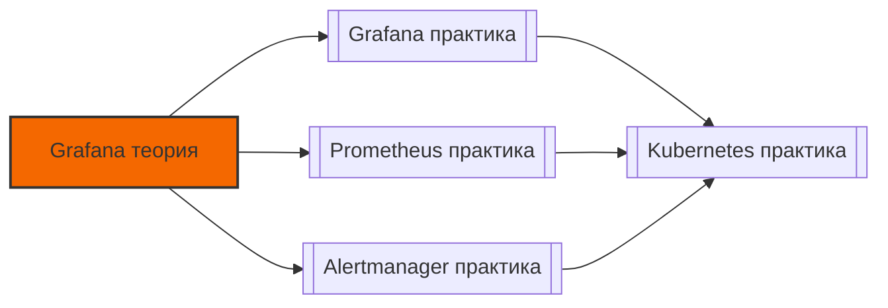

# 📄 Файл: `Grafana теория.md`

tags: [grafana, monitoring, observability, theory, architecture, dashboards]
aliases: [grafana-theory, grafana-internals, visualization-concepts]
created: 2026-05-07
---

# 🧠 Grafana для DevOps: Теория и архитектура

> [!INFO] Структура
> Концепции разделены по уровням: 🟢 Junior → 🟡 Middle → 🔴 Senior.  
> Каждая тема содержит: суть, техническое объяснение, DevOps-контекст и связанные инструменты.

📋 [[#🗂️ Оглавление для навигации|Оглавление]] | [[#🧪 Чек-лист понимания|Чек-лист]] | [[#🔗 Связь с другими файлами|Связи]]

---

## 🗂️ Оглавление для навигации

### 🟢 Junior (базовые концепции)
- [[#1. Что такое Grafana и чем он отличается от Prometheus?|1. Grafana vs Prometheus]]
- [[#2. Как устроена архитектура Grafana: frontend, backend, data sources?|2. Архитектура Grafana]]
- [[#3. Модель данных Grafana: дашборды, панели, переменные, аннотации|3. Модель данных]]
- [[#4. Типы визуализаций в Grafana и когда их использовать|4. Типы визуализаций]]
- [[#5. Как работает Query Editor и прокси к data sources?|5. Query Editor и прокси]]
- [[#6. Система плагинов: панели, data sources, apps|6. Плагины]]
- [[#7. Алертинг в Grafana: правила, условия, контакты|7. Алертинг]]
- [[#8. Пользователи, роли, организации, папки: модель доступа|8. Модель доступа]]
- [[#9. Что такое provisioning и как Grafana загружает конфиги?|9. Provisioning]]
- [[#10. Временные ряды в Grafana: интервалы, агрегация, downsampling|10. Временные ряды]]

### 🟡 Middle (архитектура, обработка данных, безопасность)
- [[#11. ⭐ Как работает backend Grafana: HTTP server, scheduler, cache?|11. Backend internals ⭐]]
- [[#12. Архитектура алертинга: eval, notification, state management|12. Alerting architecture]]
- [[#13. Data source plugins: архитектура, протокол, кэширование|13. Data source plugins]]
- [[#14. Transformations pipeline: как данные обрабатываются после запроса|14. Transformations]]
- [[#15. Variables система: resolution order, chaining, caching|15. Variables internals]]
- [[#16. Dashboard JSON schema: ключевые поля и их назначение|16. JSON schema]]
- [[#17. RBAC модель: permissions, inheritance, scopes|17. RBAC модель]]
- [[#18. Кэширование в Grafana: уровни, стратегии, инвалидация|18. Кэширование]]
- [[#19. Международная поддержка: i18n, timezones, locales|19. i18n и timezones]]
- [[#20. Экспорт/импорт дашбордов: форматы, миграция, версионирование|20. Export/Import]]

### 🔴 Senior (масштабирование, enterprise, internals)
- [[#21. ⭐ Архитектура HA Grafana: stateless design, shared storage, LB|21. HA архитектура ⭐]]
- [[#22. Database backend: PostgreSQL vs MySQL vs SQLite trade-offs|22. Database backends]]
- [[#23. Performance tuning: query concurrency, timeout, resource limits|23. Performance tuning]]
- [[#24. Plugin development: SDK, lifecycle, security model|24. Plugin development]]
- [[#25. ⭐ Multi-tenancy стратегии: orgs, folders, data source isolation|25. Multi-tenancy ⭐]]
- [[#26. Security model: auth providers, token management, CSP, CORS|26. Security model]]
- [[#27. Observability самой Grafana: само-мониторинг, метрики, трассировка|27. Self-monitoring]]
- [[#28. Scaling стратегии: read replicas, caching layers, CDN|28. Scaling strategies]]
- [[#29. Enterprise features: audit logs, SAML/OIDC advanced, reporting|29. Enterprise features]]
- [[#30. ⭐ Принципы дизайна Grafana: extensibility, backward compatibility, API versioning|30. Design principles ⭐]]

---

## 🟢 Junior (базовые концепции)

### 1. Что такое Grafana и чем он отличается от Prometheus?
**Суть**: Grafana — платформа визуализации и аналитики; Prometheus — система сбора и хранения метрик.

**Подробно**:
| Характеристика | Grafana | Prometheus |
|---------------|---------|------------|
| **Основная задача** | Визуализация, дашборды, алертинг | Сбор, хранение, запрос метрик |
| **Хранение данных** | Не хранит данные (кроме конфигов) | Специализированная TSDB |
| **Язык запросов** | Поддерживает PromQL, LogQL, SQL, etc. | Только PromQL |
| **Источники данных** | 50+ плагинов: Prometheus, Loki, MySQL, etc. | Только собственные метрики + remote read |
| **Алертинг** | Встроенный + интеграция с Alertmanager | Через Alertmanager (отдельный сервис) |
| **Архитектура** | Stateless backend + React frontend | Stateful TSDB + query engine |

**DevOps-контекст**: Grafana и Prometheus — комплементарные инструменты. Prometheus собирает и хранит метрики, Grafana делает их понятными для человека. В production используются вместе.

**Связанные инструменты**: `grafana-server`, `grafana-cli`, плагины, provisioning.

[[#🗂️ Оглавление для навигации|↑ К оглавлению]]

### 2. Как устроена архитектура Grafana: frontend, backend, data sources?
**Суть**: Трёхуровневая архитектура: браузер → Grafana backend → внешние data sources.

**Подробно**:
```
┌─────────────────┐
│   Frontend      │
│   • React/TypeScript │
│   • Redux для state    │
│   • Панели как компоненты │
└────────┬────────┘
         │ HTTP/HTTPS
         ▼
┌─────────────────┐
│   Backend       │
│   • Go HTTP server   │
│   • Authentication   │
│   • Authorization    │
│   • Query proxy      │
│   • Alerting engine  │
│   • Database (SQLite/PostgreSQL/MySQL) │
└────────┬────────┘
         │ Plugin protocol
         ▼
┌─────────────────┐
│   Data Sources  │
│   • Prometheus  │
│   • Loki        │
│   • Tempo       │
│   • MySQL/PostgreSQL │
│   • Cloud providers │
└─────────────────┘
```

**Ключевые компоненты backend**:
- `HTTP Server`: обработка REST API, WebSocket для live-обновлений
- `Auth Middleware`: JWT/session валидация, OAuth провайдеры
- `Datasource Proxy`: безопасный прокси к внешним источникам (скрывает credentials)
- `Alerting Service`: evaluation правил, отправка уведомлений
- `Provisioning Loader`: загрузка конфигов из файлов при старте

**DevOps-контекст**: Понимание архитектуры помогает отлаживать проблемы: медленный дашборд → проверить backend logs → query proxy → data source latency.

**Команды**: `grafana server --config=/etc/grafana/grafana.ini`, `curl http://localhost:3000/api/health`.

[[#🗂️ Оглавление для навигации|↑ К оглавлению]]

### 3. Модель данных Grafana: дашборды, панели, переменные, аннотации
**Суть**: Иерархическая модель: организация → папка → дашборд → панели → запросы.

**Подробно**:
```
Organization (org)
├── Folder (логическая группировка дашбордов)
│   └── Dashboard (JSON-документ)
│       ├── Title, UID, tags, timezone
│       ├── Variables (template variables)
│       ├── Annotations (события на временной шкале)
│       ├── Panels (массив визуализаций)
│       │   ├── Type: timeseries, stat, table, etc.
│       │   ├── Targets: массив запросов к data source
│       │   ├── Transformations: пост-обработка данных
│       │   └── Options: thresholds, colors, legends
│       └── Time settings: from, to, refresh
```

**Ключевые сущности**:
- `UID`: стабильный идентификатор дашборда (для provisioning и API)
- `Variables`: шаблонные переменные для динамической фильтрации (`$service`, `$env`)
- `Annotations`: события, отображаемые на графиках (деплои, инциденты)
- `Library Panels`: переиспользуемые компоненты между дашбордами

**DevOps-контекст**: Понимание модели критично для Dashboard as Code: версионирование, автоматический деплой, консистентность между окружениями.

**Пример JSON-фрагмента**:
```json
{
  "uid": "service-health",
  "title": "Service Health",
  "templating": {
    "list": [
      {"name": "service", "type": "query", "query": "label_values(http_requests_total, service)"}
    ]
  },
  "panels": [
    {"type": "timeseries", "targets": [{"expr": "rate(http_requests_total{service=\"$service\"}[5m])"}]}
  ]
}
```

[[#🗂️ Оглавление для навигации|↑ К оглавлению]]

### 4. Типы визуализаций в Grafana и когда их использовать
**Суть**: Разные типы панелей оптимизированы под разные типы данных и задачи.

**Подробно**:
| Тип панели | Лучшее применение | Пример метрики |
|-----------|------------------|----------------|
| **Time series** | Временные ряды, тренды | `rate(http_requests_total[5m])` |
| **Stat** | Текущее значение, KPI | `error_rate{service="api"}` |
| **Table** | Детализированные данные, сравнение | `topk(10, cpu_usage)` |
| **Bar gauge** | Прогресс, сравнение величин | `disk_usage_percent` |
| **Pie chart** | Доли, распределение (осторожно!) | `requests_by_status` |
| **Heatmap** | Распределение по двум осям | `latency_histogram` |
| **Logs** | Текстовые логи (через Loki) | `{service="api"} \| level="error"` |
| **Trace** | Distributed tracing (через Tempo) | `trace_id="abc123"` |
| **Geomap** | Гео-данные, региональная статистика | `requests_by_region` |
| **Node graph** | Зависимости, топология сервисов | сервис-меш |

**Принципы выбора**:
- Временная зависимость → Time series
- Одно значение → Stat или Gauge
- Множество строк для анализа → Table
- Распределение → Histogram или Heatmap
- Текстовый поиск → Logs

**DevOps-контекст**: Неправильный выбор визуализации скрывает инсайты: pie chart для временных рядов бесполезен, table без сортировки затрудняет анализ.

**Проверка**: В Grafana Explore → переключать визуализации для одного запроса → увидеть разницу в восприятии.

[[#🗂️ Оглавление для навигации|↑ К оглавлению]]

### 5. Как работает Query Editor и прокси к data sources?
**Суть**: Query Editor — UI для построения запросов; прокси — безопасный посредник между браузером и внешними источниками.

**Подробно**:
```
Поток запроса:
1. Пользователь вводит PromQL в Query Editor (React-компонент)
2. Frontend отправляет запрос на backend: POST /api/ds/query
3. Backend:
   • Валидирует аутентификацию/авторизацию
   • Загружает конфигурацию data source (URL, credentials из encrypted storage)
   • Вызывает плагин data source через gRPC/HTTP
4. Плагин:
   • Формирует запрос к внешнему API (Prometheus HTTP API)
   • Отправляет запрос, обрабатывает ответ
   • Преобразует в стандартный формат Grafana DataFrames
5. Backend возвращает данные frontend, применяет transformations
6. Frontend рендерит панель

Безопасность прокси:
• Credentials хранятся зашифрованными в БД
• Браузер не имеет прямого доступа к data source URL
• CORS и CSP политики ограничивают исходящие запросы
```

**DevOps-контекст**: Прокси-архитектура критична для безопасности: не раскрывать credentials БД/мониторинга в браузере. Но добавляет latency — учитывать при tuning.

**Отладка**: Включить `debug` логирование в `grafana.ini`:
```ini
[log]
level = debug
filters = data-proxy:debug
```

[[#🗂️ Оглавление для навигации|↑ К оглавлению]]

### 6. Система плагинов: панели, data sources, apps
**Суть**: Плагин-архитектура позволяет расширять функциональность без изменения ядра.

**Подробно**:
```
Типы плагинов:
1. Panel plugins:
   • Кастомные визуализации
   • Пример: pie-chart-v2, barchart, candlestick
   • API: React-компонент + metadata (plugin.json)

2. Data source plugins:
   • Подключение к новым источникам данных
   • Пример: prometheus, loki, mysql, cloudwatch
   • API: Query editor + ответ в формате DataFrames

3. App plugins:
   • Целые приложения внутри Grafana
   • Пример: grafana-piechart-app, grafana-worldmap-panel
   • Могут включать панели, data sources, страницы

Архитектура плагина:
```
my-plugin/
├── plugin.json          # метаданные: id, name, type, version
├── README.md
├── src/
│   ├── module.ts        # entry point
│   ├── components/      # React-компоненты
│   └── datasource/      # логика data source (если применимо)
├── pkg/                 # backend часть на Go (опционально)
└── dist/                # скомпилированный код
```

**DevOps-контекст**: Плагины позволяют адаптировать Grafana под специфичные нужды, но требуют управления версиями и безопасности (code review, signing).

**Управление плагинами**:
```bash
# Установка
grafana-cli plugins install grafana-piechart-panel

# Список установленных
grafana-cli plugins ls

# Обновление
grafana-cli plugins update grafana-piechart-panel

# В Docker: смонтировать папку /var/lib/grafana/plugins
```

[[#🗂️ Оглавление для навигации|↑ К оглавлению]]

### 7. Алертинг в Grafana: правила, условия, контакты
**Суть**: Встроенный алертинг позволяет создавать правила на основе запросов и отправлять уведомления.

**Подробно**:
```
Компоненты алертинга:
1. Alert rule:
   • Query: PromQL/LogQL/SQL запрос
   • Condition: пороговое условие (WHEN last() OF query(A) IS ABOVE 5)
   • Evaluation: интервал вычисления (Every 1m), задержка срабатывания (For 2m)
   • Labels: метаданные для группировки (severity=warning, team=backend)
   • Annotations: человекочитаемое описание (поддерживает шаблонизацию)

2. Contact point:
   • Канал уведомления: Slack, email, PagerDuty, webhook
   • Настройки формата и параметров отправки

3. Notification policy:
   • Маршрутизация: какие алерты → в какие contact points
   • Группировка: group_by, group_wait, group_interval
   • Mute timing: временные окна для подавления (ночное время)

4. State management:
   • Pending: условие выполнено, но не прошло 'for'
   • Firing: алерт активен, уведомления отправлены
   • Resolved: условие больше не выполняется

Типы алертов:
• Grafana-managed: хранятся в БД Grafana, работают даже если Prometheus down
• Prometheus-managed: правила в Prometheus, Grafana только отображает
```

**DevOps-контекст**: Grafana-managed алерты удобны для быстрых сценариев, но Prometheus-managed надёжнее для критичной инфраструктуры (независимость от Grafana).

**Пример alert rule JSON**:
```json
{
  "title": "HighErrorRate",
  "condition": "C",
  "data": [
    {"refId": "A", "datasource": {"uid": "prometheus"}, "model": {"expr": "rate(errors[5m])"}}
  ],
  "noDataState": "NoData",
  "execErrState": "Error",
  "for": "2m",
  "labels": {"severity": "warning"},
  "annotations": {"summary": "Error rate high on {{ $labels.instance }}"}
}
```

[[#🗂️ Оглавление для навигации|↑ К оглавлению]]

### 8. Пользователи, роли, организации, папки: модель доступа
**Суть**: Многоуровневая модель авторизации для контроля доступа к ресурсам.

**Подробно**:
```
Иерархия доступа:
1. Organization (орг):
   • Верхнеуровневая изоляция (multi-tenancy)
   • Пользователь может быть в нескольких оргах с разными ролями
   • Роль в орге: Viewer, Editor, Admin

2. Folder:
   • Логическая группировка дашбордов внутри орга
   • Отдельные permissions на чтение/редактирование
   • Наследование: дашборды наследуют права папки (по умолчанию)

3. Dashboard:
   • Индивидуальные permissions (переопределяют папку)
   • Публичные дашборды (анонимный доступ)

4. Data source:
   • Доступ на уровне орга или папки
   • Ограничение: кто может использовать источник в запросах

Роли и разрешения:
┌─────────────┬────────────────────────────────┐
│ Роль        │ Права                          │
├─────────────┼────────────────────────────────┤
│ Viewer      │ Просмотр дашбордов, экспорт    │
│ Editor      │ + Создание/редактирование      │
│ Admin       │ + Управление пользователями,   │
│             │   data sources, настройками    │
└─────────────┴────────────────────────────────┘

Enterprise-расширения (Grafana Enterprise):
• Fine-grained RBAC: разрешения на уровне отдельных панелей
• Team sync: автоматическая синхронизация групп из LDAP/OIDC
• Audit logs: журнал действий пользователей
```

**DevOps-контекст**: Правильная настройка доступа критична для безопасности: разработчики не должны видеть продакшен-данные, on-call — иметь доступ к алертингу.

**Проверка прав**:
```bash
# API: проверить доступ пользователя к дашборду
curl -H "Authorization: Bearer $TOKEN" \
  http://grafana:3000/api/access-control/user/permissions
```

[[#🗂️ Оглавление для навигации|↑ К оглавлению]]

### 9. Что такое provisioning и как Grafana загружает конфиги?
**Суть**: Provisioning — механизм загрузки конфигурации (dashboards, data sources, alerts) из файлов при старте.

**Подробно**:
```
Структура provisioning:
```
/etc/grafana/provisioning/
├── dashboards/
│   └── prod.yaml          # список провайдеров дашбордов
├── datasources/
│   └── prometheus.yaml    # конфигурация data sources
├── alerting/
│   ├── contact_points.yaml
│   └── notification_policies.yaml
└── plugins/
    └── plugins.yaml       # список плагинов для установки
```

Пример `dashboards/prod.yaml`:
```yaml
apiVersion: 1
providers:
  - name: 'prod-dashboards'
    orgId: 1
    folder: 'Production'
    folderUid: ''  # создать папку, если не существует
    type: file
    disableDeletion: false  # разрешить удаление при удалении файла
    updateIntervalSeconds: 30  # проверять изменения каждые 30с
    allowUiUpdates: true  # разрешить ручные правки в UI (создаст дубликат)
    options:
      path: /var/lib/grafana/dashboards/prod
      foldersFromFilesStructure: true  # создавать папки по подпапкам
```

**Жизненный цикл**:
1. При старте Grafana сканирует папку provisioning
2. Загружает YAML-конфиги, валидирует схему
3. Для каждого провайдера:
   • Читает JSON-файлы дашбордов из указанной папки
   • Сравнивает с существующими в БД по `uid`
   • Создаёт/обновляет/удаляет согласно настройкам
4. Периодически (по `updateIntervalSeconds`) повторяет проверку

**DevOps-контекст**: Provisioning — основа GitOps для Grafana: дашборды как код, версионирование в Git, деплой через CI/CD, аудит через git history.

**Важные флаги**:
- `disableDeletion: true` — защищает от случайного удаления при очистке папки
- `allowUiUpdates: false` — запрещает ручные правки, только через Git
- `foldersFromFilesStructure: true` — удобная организация файлов

[[#🗂️ Оглавление для навигации|↑ К оглавлению]]

### 10. Временные ряды в Grafana: интервалы, агрегация, downsampling
**Суть**: Обработка временных данных: от raw семплов до визуализации на экране.

**Подробно**:
```
Ключевые параметры:
1. Time range:
   • Absolute: фиксированные from/to (Last 1h, Last 7d)
   • Relative: динамические (now-1h to now)
   • Quick ranges: предустановленные кнопки

2. Resolution / Min interval:
   • Определяет минимальный шаг между точками на графике
   • Формула: max(scrape_interval, (to-from)/maxDataPoints)
   • Пример: диапазон 1h, maxDataPoints=1000 → шаг ~3.6с
   • Если scrape_interval=30s → реальный шаг будет 30s

3. Aggregation:
   • При разрешении ниже частоты скрейпа: усреднение, min, max, last
   • Настройка в панели: "Min interval" или "Resolution"
   • Важно для снижения нагрузки на data source

4. Downsampling:
   • Для long-range запросов: автоматическое укрупнение интервала
   • Пример: запрос за 30d → шаг 15м вместо 30с
   • Реализуется на уровне data source (Prometheus) или в transformations

5. Time zone:
   • Browser: использует часовой пояс пользователя
   • UTC: единое время для команды
   • Custom: фиксированный таймзона

Влияние на производительность:
• Меньший интервал → больше точек → медленнее рендер, больше трафик
• Больший диапазон → больше данных для агрегации → нагрузка на backend
```

**DevOps-контекст**: Неправильная настройка интервалов → либо "шумный" график (слишком детально), либо потеря инсайтов (слишком агрегировано). Балансировать под задачу.

**Проверка в Query inspector**:
- В панели → три точки → Query inspector → Execute
- Увидеть: actual query, time range, step, количество точек

[[#🗂️ Оглавление для навигации|↑ К оглавлению]]

---

## 🟡 Middle (архитектура, обработка данных, безопасность)

### 11. ⭐ Как работает backend Grafana: HTTP server, scheduler, cache?
**Суть**: Backend на Go обрабатывает запросы, управляет состоянием и координирует плагины.

**Подробно**:
```
Основные компоненты backend:

1. HTTP Server (net/http):
   • REST API: /api/dashboards, /api/datasources, /api/alerts
   • Static files: раздача frontend-бандла
   • WebSocket: для live-обновлений панелей
   • Middleware chain: logging, auth, CORS, rate limiting

2. Scheduler / Alerting engine:
   • Планировщик вычисления alert rules (cron-like)
   • Оценка условий в изолированных goroutines
   • Управление состоянием алертов (Pending → Firing → Resolved)
   • Отправка уведомлений через notification channels

3. Caching layers:
   • Datasource proxy cache: кэш ответов от внешних источников
   • Query result cache: кэш результатов запросов (TTL-based)
   • Redis backend: для шаринга кэша между репликами
   • Инвалидация: по времени, по изменению дашборда, вручную

4. Database access:
   • XORM ORM для абстракции над БД
   • Поддерживаемые бэкенды: SQLite (dev), PostgreSQL/MySQL (prod)
   • Миграции схемы: автоматические при обновлении версии

5. Plugin management:
   • Загрузка плагинов из filesystem или CDN
   • Sandbox для backend-плагинов (gRPC isolation)
   • Подпись плагинов: проверка integrity и авторства

6. Configuration loader:
   • Чтение grafana.ini, env vars, CLI flags
   • Приоритет: CLI > env > ini > defaults
   • Hot reload для некоторых настроек (SIGHUP)

Поток обработки запроса:
```
1. HTTP request → middleware (auth, logging)
2. Router → handler (dashboard, datasource, alerting)
3. Business logic: валидация, авторизация, подготовка запроса
4. Plugin call: gRPC к data source plugin
5. Response processing: transformations, caching
6. Serialization → JSON → HTTP response
```

**DevOps-контекст**: Понимание backend помогает тюнить производительность: увеличить pool соединений к БД, настроить кэш, ограничить concurrency запросов.

**Мониторинг самого Grafana**:
```promql
# Метрики, экспортируемые Grafana (если включены)
grafana_http_request_duration_seconds_bucket
grafana_datasource_request_duration_seconds_sum
grafana_active_viewers
```

[[#🗂️ Оглавление для навигации|↑ К оглавлению]]

### 12. Архитектура алертинга: eval, notification, state management
**Суть**: Unified Alerting — новая архитектура алертинга в Grafana 8+, с единым движком для всех data sources.

**Подробно**:
```
Компоненты Unified Alerting:

1. Alert Rule:
   • Определение: query + condition + evaluation settings
   • Хранение: в БД Grafana (не в external system)
   • Версионирование: история изменений правил

2. Evaluation engine:
   • Scheduler: запускает оценку по расписанию (Every X)
   • Executor: выполняет запрос к data source, применяет condition
   • Isolation: каждое правило в отдельной goroutine с timeout
   • Результат: нормализованный AlertInstance с состоянием

3. State manager:
   • Отслеживает состояние каждого алерта: Normal → Pending → Firing → Resolved
   • Учитывает 'for' duration: условие должно держаться заданное время
   • Deduplication: одинаковые алерты от разных eval не дублируются

4. Notification engine:
   • Routing: matching rules → contact points
   • Grouping: объединение алертов по лейблам
   • Throttling: repeat_interval, mute timings
   • Delivery: async отправка через queue (предотвращает блокировку eval)

5. Image rendering (опционально):
   • Генерация скриншота дашборда для уведомления
   • Через headless browser (Grafana Image Renderer plugin)
   • Интеграция с Slack, email для наглядности

Жизненный цикл алерта:
```
1. Rule scheduled → query executed → condition evaluated
2. If true → instance enters Pending state, timer starts
3. If still true after 'for' duration → state → Firing
4. Notification sent to matched contact points
5. If condition becomes false → state → Resolved, notification sent
6. History logged for audit and analysis
```

**DevOps-контекст**: Unified Alerting позволяет централизовать алертинг для всех источников данных, но требует понимания trade-offs vs Prometheus-native alerting.

**Миграция с legacy alerting**:
- Legacy: хранится в дашбордах, ограниченный функционал
- Unified: отдельный раздел Alerting, расширенные возможности
- Совместимы, но не рекомендуется использовать оба одновременно

[[#🗂️ Оглавление для навигации|↑ К оглавлению]]

### 13. Data source plugins: архитектура, протокол, кэширование
**Суть**: Плагины data sources — адаптеры между Grafana и внешними системами данных.

**Подробно**:
```
Архитектура плагина data source:

1. Frontend part (TypeScript/React):
   • Config editor: UI для настройки подключения (URL, auth)
   • Query editor: UI для построения запросов (PromQL builder, SQL editor)
   • Variable editor: поддержка template variables

2. Backend part (Go, опционально):
   • Query handler: выполнение запроса к внешнему API
   • Response parser: преобразование в стандартный формат DataFrames
   • Health check: проверка доступности источника
   • Authentication: обработка credentials, token refresh

3. Протокол общения:
   • Frontend ↔ Backend plugin: gRPC (изолированный процесс)
   • Backend plugin ↔ External API: HTTP/SQL/gRPC/etc.
   • Стандартизированный формат: DataFrames (rows × columns с метаданными)

4. Кэширование:
   • На уровне плагина: TTL-based кэш ответов
   • На уровне Grafana: datasource proxy cache
   • Настройка: cacheTimeout в конфигурации data source

Пример потока запроса (Prometheus plugin):
```
1. Пользователь вводит: rate(http_requests_total[5m])
2. Frontend отправляет на backend: {expr, timeRange, maxDataPoints}
3. Backend plugin:
   • Формирует HTTP запрос к Prometheus: /api/v1/query_range
   • Добавляет auth headers из encrypted config
   • Отправляет запрос, обрабатывает ответ (JSON)
4. Парсинг: Prometheus response → Grafana DataFrames
5. Применение transformations (если настроены)
6. Возврат frontend для рендеринга
```

**DevOps-контекст**: Кастомные data source plugins позволяют интегрировать legacy-системы или специфичные форматы данных в единый observability-стек.

**Разработка плагина**:
```bash
# Scaffold нового плагина
npx @grafana/create-plugin

# Запуск в dev-режиме
yarn dev  # frontend
go run main.go  # backend (если есть)

# Сборка для production
yarn build
# Результат: .tar.gz для grafana-cli или папка в plugins/
```

[[#🗂️ Оглавление для навигации|↑ К оглавлению]]

### 14. Transformations pipeline: как данные обрабатываются после запроса
**Суть**: Transformations — этап пост-обработки данных между получением от data source и рендерингом.

**Подробно**:
```
Pipeline обработки:
```
[Data Source] → [Raw DataFrames] → [Transformations] → [Render-ready Data] → [Panel]
```

Типы трансформаций:
1. Reduce:
   • Агрегация временного ряда в одно значение (last, mean, min, max)
   • Use case: Stat панель с текущим значением

2. Join by field:
   • Объединение нескольких запросов по общему ключу (инстанс, время)
   • Use case: таблица с CPU и memory для одних и тех же инстансов

3. Filter by name / Filter by value:
   • Исключение серий по имени метрики или значению
   • Use case: скрыть метрики с нулевыми значениями

4. Organize fields:
   • Переименование, сокрытие, переупорядочивание колонок
   • Use case: human-readable названия в Table панели

5. Calculate field:
   • Добавление вычисляемого поля (арифметика, строковые операции)
   • Use case: error_rate = errors / total * 100

6. Sort by:
   • Сортировка строк по значению поля
   • Use case: top-N инстансов по нагрузке

7. Grouping / Aggregation:
   • Группировка по лейблу с агрегацией (sum, avg)
   • Use case: агрегация по команде вместо инстанса

8. Time series specific:
   • Align frames: синхронизация временных меток
   • Add field from calculation: производные метрики

Особенности:
• Порядок важен: трансформации выполняются последовательно сверху вниз
• Производительность: сложные трансформации на больших данных могут тормозить рендер
• Отладка: вкладка "Transform" показывает данные после каждого шага

**DevOps-контекст**: Transformations позволяют упростить PromQL-запросы, вынеся логику обработки в UI. Но для масштаба лучше использовать recording rules в Prometheus.

**Пример цепочки**:
```
Запрос: topk(10, cpu_usage)  # 10 инстансов с высоким CPU
→ Transform: Join with memory_usage by instance
→ Transform: Calculate field: cpu_plus_mem = cpu + mem
→ Transform: Sort by cpu_plus_mem descending
→ Render: Table панель с 3 колонками
```

[[#🗂️ Оглавление для навигации|↑ К оглавлению]]

### 15. Variables система: resolution order, chaining, caching
**Суть**: Template variables — механизм динамической подстановки значений в запросы и настройки.

**Подробно**:
```
Типы переменных:
1. Query:
   • Значения из запроса к data source
   • Пример: label_values(http_requests_total, service)
   • Поддерживает: зависимость от других переменных, regex-фильтрацию

2. Custom:
   • Жёстко заданный список значений
   • Пример: dev,staging,prod
   • Use case: фиксированные окружения, не зависящие от данных

3. Constant:
   • Одно значение, не меняется
   • Пример: default_step = 30s
   • Use case: параметры, используемые в нескольких запросах

4. Interval:
   • Специальный тип для временных интервалов
   • Пример: $__auto, 30s, 1m, 5m
   • Use case: динамический шаг агрегации

5. Datasource:
   • Список доступных data sources
   • Use case: переключение между источниками в одном дашборде

6. Ad hoc filters:
   • Динамические фильтры, добавляемые пользователем
   • Use case: ad-hoc анализ без изменения дашборда

Порядок разрешения (resolution order):
1. Зависимые переменные вычисляются в топологическом порядке
2. При изменении переменной:
   • Пересчитываются зависимые переменные (Refresh: On change)
   • Обновляются все панели, использующие эти переменные
3. Кэширование:
   • Значения query-переменных кэшируются на время сессии
   • Инвалидация: при изменении time range или ручном обновлении

Форматы подстановки:
• $var или ${var} — простая строковая подстановка
• ${var:regex} — экранирование для regex-контекста
• ${var:pipe} — формат для pipe-списка: (val1|val2)
• ${var:csv} — CSV-список: val1,val2
• ${var:glob} — glob-паттерн: {val1,val2}

**DevOps-контекст**: Variables — ключ к переиспользованию дашбордов. Но сложные цепочки зависимостей могут замедлять загрузку — мониторить и оптимизировать.

**Отладка**: В панели → Query inspector → увидеть финальный запрос после подстановки всех переменных.

[[#🗂️ Оглавление для навигации|↑ К оглавлению]]

### 16. Dashboard JSON schema: ключевые поля и их назначение
**Суть**: Дашборды хранятся как JSON-документы с чёткой схемой.

**Подробно**:
```
Ключевые поля dashboard JSON:
```json
{
  "uid": "unique-identifier",        // стабильный ID для API/provisioning
  "title": "Human readable title",   // отображаемое название
  "tags": ["prod", "api"],           // для поиска и фильтрации
  "timezone": "browser",             // browser/utc/custom
  "refresh": "30s",                  // авто-обновление
  "time": {                          // диапазон по умолчанию
    "from": "now-1h",
    "to": "now"
  },
  
  "templating": {                    // переменные
    "list": [
      {"name": "service", "type": "query", "query": "...", "refresh": 1}
    ]
  },
  
  "annotations": {                   // аннотации
    "list": [
      {"datasource": "Prometheus", "expr": "changes(deployments[1m]) > 0"}
    ]
  },
  
  "panels": [                        // массив панелей
    {
      "id": 1,
      "type": "timeseries",
      "title": "RPS",
      "targets": [{"expr": "rate(http[5m])", "datasource": {"uid": "prom"}}],
      "fieldConfig": {"defaults": {"unit": "reqps"}},
      "gridPos": {"h": 8, "w": 12, "x": 0, "y": 0}  // позиция в сетке
    }
  ],
  
  "schemaVersion": 38,               // версия схемы для миграций
  "version": 5                       // инкрементируется при сохранении
}
```

Важные нюансы:
• `uid` vs `id`: `uid` — стабильный строковый идентификатор, `id` — авто-инкрементный числовой (не использовать для ссылок)
• `gridPos`: система сетки 24 колонки, координаты (x, y) и размеры (h, w)
• `fieldConfig`: настройки визуализации (единицы, пороги, цвета)
• `links`: кросс-ссылки между дашбордами

**DevOps-контекст**: Понимание схемы критично для Dashboard as Code: генерация через jsonnet, валидация в CI, миграции между версиями.

**Валидация**:
```bash
# Проверить корректность JSON
jq . dashboard.json > /dev/null

# Проверить на соответствие схеме (через grafana-cli или API)
curl -X POST http://grafana:3000/api/dashboards/validate \
  -H "Content-Type: application/json" \
  -d @dashboard.json
```

[[#🗂️ Оглавление для навигации|↑ К оглавлению]]

### 17. RBAC модель: permissions, inheritance, scopes
**Суть**: Role-Based Access Control — гибкая система контроля доступа к ресурсам.

**Подробно**:
```
Уровни RBAC:

1. Organization roles (базовые):
   • Viewer: read-only доступ к дашбордам
   • Editor: + создание/редактирование дашбордов
   • Admin: + управление пользователями, настройками

2. Folder-level permissions:
   • Наследование: дашборды наследуют права папки
   • Переопределение: можно задать индивидуальные права дашборду
   • Типы прав: View, Edit, Admin

3. Data source permissions:
   • Ограничение: кто может использовать источник в запросах
   • Scope: org-wide или folder-specific

4. Team-based permissions (Enterprise):
   • Группировка пользователей в команды
   • Назначение прав командам вместо отдельных пользователей
   • Синхронизация с внешними провайдерами (LDAP/AD/OIDC)

5. Fine-grained RBAC (Enterprise):
   • Permissions на уровне отдельных панелей, переменных
   • Scopes: ограничение доступа по лейблам (env=prod)
   • Audit: журнал кто что изменил

Модель наследования:
```
Org Admin
├── Folder: Production (Admin: team-sre)
│   ├── Dashboard: API Health (inherits folder permissions)
│   └── Dashboard: DB Metrics (custom: only team-dba can edit)
└── Folder: Development (Editor: all developers)
    └── Dashboard: Dev Testing (public: anonymous view)
```

**DevOps-контекст**: Правильная настройка RBAC предотвращает инциденты: разработчики не могут случайно изменить продакшен-дашборд, external contractors видят только нужные метрики.

**Проверка прав через API**:
```bash
# Получить разрешения пользователя
curl -H "Authorization: Bearer $TOKEN" \
  http://grafana:3000/api/access-control/user/permissions

# Проверить доступ к конкретному ресурсу
curl -H "Authorization: Bearer $TOKEN" \
  "http://grafana:3000/api/access-control/evaluate?resource=dashboards&permission=read"
```

[[#🗂️ Оглавление для навигации|↑ К оглавлению]]

### 18. Кэширование в Grafana: уровни, стратегии, инвалидация
**Суть**: Многоуровневое кэширование для снижения нагрузки на data sources и ускорения отрисовки.

**Подробно**:
```
Уровни кэширования:

1. Browser cache (frontend):
   • Static assets: JS/CSS бандлы (HTTP cache headers)
   • Dashboard JSON: кэш ответа API (short TTL)
   • Инвалидация: по версии дашборда, manual refresh

2. Grafana backend cache:
   • Datasource proxy cache:
     - Кэш ответов от внешних источников
     - TTL настраивается в data source config (cacheTimeout)
     - Ключ: хеш от запроса + time range + variables
   • Query result cache:
     - Кэш результатов после transformations
     - Используется при повторных одинаковых запросах

3. External cache (Redis/Memcached):
   • Для HA-развёртываний: шаринг кэша между репликами
   • Настройка в grafana.ini:
     ```ini
     [cache.redis]
     enabled = true
     network = tcp
     addr = redis:6379
     db = 0
     ```

Стратегии инвалидации:
• Time-based: TTL, после которого кэш считается устаревшим
• Event-based: при изменении дашборда/переменной → инвалидация связанных запросов
• Manual: кнопка "Refresh" в UI, API-эндпоинт для программной инвалидации

Оптимизации:
• Pre-warming: предзагрузка популярных дашбордов в кэш
• Adaptive TTL: динамический срок жизни на основе частоты изменений данных
• Compression: сжатие кэшированных данных (snappy, gzip)

**DevOps-контекст**: Кэширование критично при 100+ пользователях: один запрос → кэш → 100 ответов. Но неправильный TTL → устаревшие данные → ложные инсайты.

**Мониторинг кэша**:
```promql
# Если включены метрики Grafana
grafana_cache_hit_total
grafana_cache_miss_total
rate(grafana_cache_evictions_total[5m])

# Косвенно: задержки запросов к data sources
rate(grafana_datasource_request_duration_seconds_sum[5m])
```

[[#🗂️ Оглавление для навигации|↑ К оглавлению]]

### 19. Международная поддержка: i18n, timezones, locales
**Суть**: Поддержка разных языков, часовых поясов и форматов для глобальных команд.

**Подробно**:
```
Компоненты интернационализации:

1. i18n (internationalization):
   • Перевод UI: меню, кнопки, сообщения об ошибках
   • Файлы локализации: public/locales/{en,ru,de,es}/grafana.json
   • Механизм: react-i18next для динамической подгрузки
   • Переключение: в профиле пользователя или ?lang=ru в URL

2. Timezones:
   • Browser: использует часовой пояс браузера пользователя
   • UTC: единое время для распределённых команд
   • Custom: фиксированный пояс (например, для отчётов)
   • Отображение: конвертация меток времени на лету

3. Locales (форматирование):
   • Числа: разделители тысяч/десятичных (1,000.5 vs 1.000,5)
   • Даты: порядок компонентов (DD/MM/YYYY vs MM/DD/YYYY)
   • Валюты: символы, позиционирование (€100 vs 100€)
   • Автоматическое определение по browser locale

4. RTL support:
   • Поддержка языков с письмом справа-налево (арабский, иврит)
   • Автоматическое зеркалирование интерфейса

Особенности для мониторинга:
• Временные метки в метриках всегда в UTC
• Конвертация в UI происходит на клиенте
• При экспорте (PDF, CSV) указывается использованный timezone
• Алерты и уведомления используют timezone получателя

**DevOps-контекст**: Для глобальных команд критично: инцидент в 3 AM UTC — это вечер в Азии, утро в Европе. Правильная настройка timezone предотвращает путаницу.

**Настройка по умолчанию** (grafana.ini):
```ini
[users]
default_language = ru
default_timezone = Europe/Moscow

[internationalization]
enabled = true
```

[[#🗂️ Оглавление для навигации|↑ К оглавлению]]

### 20. Экспорт/импорт дашбордов: форматы, миграция, версионирование
**Суть**: Механизмы переноса дашбордов между окружениями и системами.

**Подробно**:
```
Форматы экспорта:

1. JSON (основной):
   • Полный экспорт дашборда со всеми настройками
   • Команда: Dashboard → Share → Export → Save to file
   • API: GET /api/dashboards/uid/{uid}
   • Особенности:
     - Удалять поля `id`, `version`, `meta` для чистого импорта
     - Сохранять `uid` для консистентности при provisioning

2. JSON с переменными (template):
   • Экспорт с подстановкой переменных окружения
   • Use case: один шаблон для dev/staging/prod
   • Инструменты: envsubst, jsonnet, kustomize

3. PNG/PDF (визуальный экспорт):
   • Скриншот панели или всего дашборда
   • Требует Grafana Image Renderer plugin
   • Use case: отчёты, документация, алерты с картинкой

4. CSV/Excel (данные):
   • Экспорт сырых данных из Table панели
   • Use case: дальнейший анализ в Excel, отчёты для менеджмента

Миграция между версиями:
• Обратная совместимость: новые версии читают старые схемы
• Миграции схемы: автоматическое обновление при импорте
• Проверка: `schemaVersion` в JSON, миграционные скрипты в коде

Версионирование:
• `version` поле: инкрементируется при каждом сохранении в БД
• Для Git: использовать `uid` как стабильный идентификатор
• История изменений: через git commit history, не через Grafana version

Best practices:
• Хранить "чистые" JSON (без id/version/meta) в репозитории
• Использовать `uid` для ссылок между дашбордами
• Документировать зависимости: какие переменные/источники нужны
• Тестировать импорт в staging перед production

**DevOps-контекст**: Экспорт/импорт — основа миграции, disaster recovery, multi-env деплоя. Автоматизировать через provisioning и CI/CD.

**Проверка целостности**:
```bash
# Сравнить два экспорта (игнорируя version и meta)
jq 'del(.version, .meta)' dashboard1.json > d1.json
jq 'del(.version, .meta)' dashboard2.json > d2.json
diff d1.json d2.json
```

[[#🗂️ Оглавление для навигации|↑ К оглавлению]]

---

## 🔴 Senior (масштабирование, enterprise, internals)

### 21. ⭐ Архитектура HA Grafana: stateless design, shared storage, LB
**Суть**: Горизонтальное масштабирование через stateless backend и общее хранилище состояния.

**Подробно**:
```
Принципы HA-архитектуры:

1. Stateless backend:
   • Все состояние хранится в внешней БД, не в памяти процесса
   • Любая реплика может обработать любой запрос
   • Сессии: через cookies с шифрованием или external session store

2. Shared storage layers:
   • Database: PostgreSQL/MySQL с репликацией (синхронной для критичных данных)
   • File storage: NFS/S3 для плагинов, изображений, кэша
   • Cache: Redis cluster для шаринга кэша между репликами
   • Session store: Redis для user sessions (если не cookies)

3. Load balancing:
   • L4 (TCP) или L7 (HTTP) балансировщик перед репликами
   • Health checks: /api/health эндпоинт
   • Sticky sessions: не требуются (stateless), но могут помочь для кэша браузера

4. Alerting в HA:
   • Unified Alerting: лидер-элекция через БД для избежания дублирования оценок
   • Notification delivery: идемпотентность, deduplication на стороне получателя

Референсная архитектура (Kubernetes):
```yaml
# Deployment: stateless реплики
apiVersion: apps/v1
kind: Deployment
meta
  name: grafana
spec:
  replicas: 3
  strategy:
    type: RollingUpdate
    rollingUpdate: {maxSurge: 1, maxUnavailable: 0}
  template:
    spec:
      containers:
        - name: grafana
          env:
            - name: GF_DATABASE_TYPE
              value: postgres
            - name: GF_DATABASE_HOST
              value: postgres-ha:5432
            - name: GF_CACHE_ENABLED
              value: "true"
            - name: GF_CACHE_REDIS_ADDR
              value: redis-ha:6379
          readinessProbe:
            httpGet: {path: /api/health, port: 3000}
---
# Service: ClusterIP для внутреннего доступа
apiVersion: v1
kind: Service
meta
  name: grafana
spec:
  selector: {app: grafana}
  ports: [{port: 3000, targetPort: 3000}]
---
# Ingress: внешний доступ с TLS
apiVersion: networking.k8s.io/v1
kind: Ingress
meta
  name: grafana
spec:
  tls: [{hosts: [grafana.example.com], secretName: grafana-tls}]
  rules:
    - host: grafana.example.com
      http: {paths: [{path: /, backend: {service: {name: grafana, port: {number: 3000}}}}]}
```

**DevOps-контекст**: HA критично для observability-платформы: если мониторинг упал — вы слепы при инциденте. Но сложность растёт: нужно мониторить саму инфраструктуру мониторинга.

**Мониторинг HA-кластера**:
```promql
# Доступность реплик
up{job="grafana"} == 0  # алерт на падение

# Балансировка нагрузки
rate(nginx_http_requests_total{upstream="grafana"}[5m]) by (upstream_addr)

# Задержки БД (общее узкое место)
histogram_quantile(0.99, rate(postgres_query_duration_seconds_bucket[5m]))
```

[[#🗂️ Оглавление для навигации|↑ К оглавлению]]

### 22. Database backend: PostgreSQL vs MySQL vs SQLite trade-offs
**Суть**: Выбор СУБД для хранения состояния Grafana влияет на производительность, надёжность и операционные затраты.

**Подробно**:
```
Сравнение бэкендов:

| Критерий          | SQLite              | PostgreSQL        | MySQL             |
|------------------|---------------------|-------------------|-------------------|
| **Use case**     | Dev, single-node    | Production, HA    | Production, HA    |
| **Масштабируемость** | Вертикальная, ограничено | Горизонтальная (репликация) | Горизонтальная (репликация) |
| **Производительность** | Низкая при конкурентной записи | Высокая, оптимизирована для записи | Высокая, но требует тюнинга |
| **Надёжность**   | Файл на диске, риск corruption | WAL, point-in-time recovery | Binlog, репликация |
| **Операционные затраты** | Минимальные | Средние (требует администрирования) | Средние |
| **Поддержка в Grafana** | Встроена, без настройки | Полная, рекомендация для prod | Полная |
| **Миграции**     | Не требуется | Автоматические при обновлении | Автоматические при обновлении |

Рекомендации по выбору:

1. SQLite:
   • ✅ Локальная разработка, демо, тестовые окружения
   • ✅ Однопользовательский доступ, низкая нагрузка
   • ❌ Не для production: файловая блокировка, риск corruption

2. PostgreSQL (рекомендуется):
   • ✅ Производство с несколькими пользователями
   • ✅ Требуется HA, бэкапы, аудит
   • ✅ Сложные запросы, расширенные типы данных
   • Настройка: connection pool (pgbouncer), репликация, monitoring

3. MySQL:
   • ✅ Если уже есть инфраструктура MySQL в организации
   • ✅ Команда имеет экспертизу по MySQL
   • ⚠️ Требует тщательного тюнинга (innodb, query cache)

Конфигурация для production (PostgreSQL):
```ini
[database]
type = postgres
host = postgres-ha:5432
name = grafana
user = grafana
password = ${GF_DATABASE_PASSWORD}
ssl_mode = require
max_idle_conn = 10
max_open_conn = 100
conn_max_lifetime = 14400  # 4 часа

[session]
provider = postgres  # или redis для HA
```

**DevOps-контекст**: Выбор БД — стратегическое решение. Миграция с SQLite на PostgreSQL возможна, но требует downtime. Планировать заранее.

**Мониторинг БД**:
```promql
# Пул соединений
grafana_database_connection_pool_size
grafana_database_connection_pool_in_use

# Запросы к БД
rate(grafana_database_query_duration_seconds_sum[5m])
histogram_quantile(0.99, rate(grafana_database_query_duration_seconds_bucket[5m]))

# Ошибки
rate(grafana_database_query_errors_total[5m])
```

[[#🗂️ Оглавление для навигации|↑ К оглавлению]]

### 23. Performance tuning: query concurrency, timeout, resource limits
**Суть**: Оптимизация Grafana для высокой нагрузки без деградации пользовательского опыта.

**Подробно**:
```
Ключевые параметры тюнинга:

1. Query concurrency:
   • Ограничение параллельных запросов к data sources
   • Настройка: `dataproxy` секция в grafana.ini
   ```ini
   [dataproxy]
   concurrent_query_limit = 20  # максимум параллельных запросов
   timeout = 60                 # таймаут запроса к источнику
   dial_timeout = 10            # таймаут установки соединения
   keep_alive_seconds = 30      # keep-alive для соединений
   ```

2. Alerting evaluation:
   • Ограничение параллельной оценки правил
   ```ini
   [unified_alerting]
   evaluation_timeout = 30s          # таймаут на одно вычисление
   max_attempts = 3                  # повторные попытки при ошибке
   min_interval = 10s                # минимальный интервал оценки
   ```

3. Resource limits (Kubernetes):
   • CPU/Memory requests и limits для предсказуемости
   ```yaml
   resources:
     requests: {memory: "2Gi", cpu: "1"}
     limits: {memory: "4Gi", cpu: "2"}
   ```

4. Caching strategy:
   • Включение кэша для снижения нагрузки на data sources
   ```ini
   [caching]
   enabled = true
   [cache.redis]
   enabled = true
   addr = redis:6379
   ```

5. Database tuning:
   • Пул соединений, таймауты, индексы
   ```ini
   [database]
   max_idle_conn = 10
   max_open_conn = 100
   conn_max_lifetime = 14400
   ```

6. Frontend optimization:
   • Включение gzip, HTTP/2, CDN для static assets
   ```ini
   [server]
   enable_gzip = true
   protocol = https
   ```

Мониторинг производительности:
```promql
# Задержки запросов к data sources
histogram_quantile(0.95, rate(grafana_datasource_request_duration_seconds_bucket[5m]))

# Ошибки в прокси
rate(grafana_proxy_request_errors_total[5m])

# Использование ресурсов
process_resident_memory_bytes{job="grafana"}
rate(process_cpu_seconds_total{job="grafana"}[5m])

# Очередь алертов
grafana_alerting_evaluation_queue_length
```

**DevOps-контекст**: Тюнинг — итеративный процесс: мониторить → выявлять узкие места → настраивать → проверять. Не оптимизировать "на глаз".

**Чек-лист перед production**:
- [ ] Настроены таймауты запросов (предотвращает "зависание" панелей)
- [ ] Включён кэш для часто запрашиваемых данных
- [ ] Ограничена конкурентность запросов (защита от thundering herd)
- [ ] Настроены resource limits в orchestration-системе
- [ ] Включён мониторинг самой Grafana

[[#🗂️ Оглавление для навигации|↑ К оглавлению]]

### 24. Plugin development: SDK, lifecycle, security model
**Суть**: Создание кастомных плагинов для расширения функциональности Grafana.

**Подробно**:
```
Жизненный цикл плагина:

1. Разработка:
   • Scaffold: `npx @grafana/create-plugin`
   • Frontend: React + TypeScript, @grafana/data/ui/runtime пакеты
   • Backend (опционально): Go, gRPC интерфейс к Grafana
   • Testing: Jest для frontend, Go test для backend

2. Сборка:
   • Frontend: webpack → bundle.js + CSS
   • Backend: CGO, cross-compilation для разных OS/arch
   • Packaging: .tar.gz с plugin.json, README, signature

3. Подпись (signing):
   • Grafana Cloud: автоматическая подпись при публикации
   • Self-hosted: ручная подпись через `grafana-cli plugins sign`
   • Policy: Grafana может блокировать неподписанные плагины

4. Установка:
   • grafana-cli: `grafana-cli plugins install my-plugin`
   • Docker: смонтировать папку /var/lib/grafana/plugins
   • Provisioning: список плагинов в YAML

5. Обновление:
   • Versioning: semver в plugin.json
   • Compatibility: указание поддерживаемых версий Grafana
   • Migration: скрипты для обновления конфигов при мажорных версиях

Security model:
• Sandbox: backend-плагины запускаются в изолированном процессе
• Permissions: плагины не имеют доступа к файловой системе по умолчанию
• Network: исходящие запросы только к разрешённым доменам (CORS)
• Secrets: credentials передаются зашифрованными, не логируются

SDK ключевые пакеты:
```typescript
// @grafana/data — типы данных, утилиты
import { DataFrame, Field, FieldType } from '@grafana/data';

// @grafana/ui — React-компоненты для UI
import { PanelProps, SelectableValue } from '@grafana/ui';

// @grafana/runtime — доступ к API Grafana
import { getBackendSrv, getDataSourceSrv } from '@grafana/runtime';
```

**DevOps-контекст**: Кастомные плагины позволяют адаптировать Grafana под специфичные нужды, но увеличивают surface area для безопасности и поддержки.

**Best practices**:
- [ ] Минимальные привилегии для backend-плагинов
- [ ] Валидация всех входных данных (XSS, injection)
- [ ] Логирование без чувствительных данных
- [ ] Тестирование на разных версиях Grafana
- [ ] Документация для пользователей плагина

[[#🗂️ Оглавление для навигации|↑ К оглавлению]]

### 25. ⭐ Multi-tenancy стратегии: orgs, folders, data source isolation
**Суть**: Изоляция данных и доступа для разных команд/клиентов в одной инсталляции Grafana.

**Подробно**:
```
Уровни изоляции:

1. Organizations (сильная изоляция):
   • Полное разделение: дашборды, пользователи, data sources
   • Пользователь может быть в нескольких оргах с разными ролями
   • Переключение: через UI или API header `X-Grafana-Org-Id`
   • Use case: разные клиенты, полностью независимые команды

2. Folders + RBAC (средняя изоляция):
   • Один орг, но папки с разными правами доступа
   • Наследование: дашборды наследуют права папки
   • Fine-grained: разрешения на уровне отдельных панелей (Enterprise)
   • Use case: команды внутри одной организации

3. Data source scoping (слабая изоляция):
   • Ограничение доступа к конкретным источникам данных
   • Фильтрация на уровне запросов: автоматическая подстановка лейблов
   • Пример: все запросы получают фильтр `{team="$__user.team"}`
   • Use case: shared infrastructure с логической изоляцией

Референсная архитектура для 100+ команд:
```
┌─────────────────┐
│  Grafana (HA)   │
│                 │
│  Org: platform  │  ← админы, общие дашборды
│  Org: team-a    │  ← изолированные данные команды
│  Org: team-b    │
│  ...            │
│                 │
│  Shared DS:     │  ← Prometheus с лейблом org=
│  - URL: prometheus:9090 │
│  - JSONData: {orgHeader: "X-Scope-OrgID"} │
└────────┬────────┘
         │
         ▼
┌─────────────────┐
│  Prometheus     │
│  с лейблом org= │  ← фильтрация на уровне сбора
└─────────────────┘
```

Реализация авто-фильтрации:
```promql
# В запросе панели использовать переменную ${__org.name}
http_requests_total{org="${__org.name}", service="$service"}

# Или через relabel в Prometheus:
# Добавлять org лейбл на основе X-Scope-OrgID заголовка
```

**DevOps-контекст**: Multi-tenancy — баланс между изоляцией и операционной сложностью. Орги дают сильную изоляцию, но усложняют кросс-командный мониторинг.

**Мониторинг multi-tenant setup**:
```promql
# Использование по оргам
sum by (org) (grafana_active_viewers)

# Запросы к data sources по оргам
sum by (org, datasource) (rate(grafana_datasource_request_total[5m]))

# Ошибки доступа
rate(grafana_api_response_status_total{code="403"}[5m])
```

[[#🗂️ Оглавление для навигации|↑ К оглавлению]]

### 26. Security model: auth providers, token management, CSP, CORS
**Суть**: Многоуровневая система безопасности для защиты данных и доступа.

**Подробно**:
```
Компоненты безопасности:

1. Authentication:
   • Built-in: username/password в БД
   • OAuth: GitHub, GitLab, Google, Generic OAuth
   • LDAP/AD: синхронизация пользователей и групп
   • SAML: enterprise SSO с расширенными атрибутами
   • JWT: для service-to-service аутентификации

2. Authorization:
   • RBAC: роли и разрешения на уровне орг/папки/дашборда
   • API keys: для программатического доступа с ограниченным скоупом
   • Service accounts: для автоматизации (CI/CD, provisioning)

3. Token management:
   • Session cookies: шифрование, HttpOnly, Secure флаги
   • API tokens: ротация, expiration, audit logging
   • OAuth tokens: refresh flow, secure storage

4. Content Security Policy (CSP):
   • Ограничение источников скриптов, стилей, изображений
   • Защита от XSS: запрет inline scripts, nonce-based
   • Настройка: `content_security_policy` в grafana.ini

5. CORS (Cross-Origin Resource Sharing):
   • Контроль доменов, которые могут делать запросы к API
   • Настройка: `allow_embedding`, `cookie_samesite`
   • Use case: встраивание дашбордов в другие приложения

6. Secrets management:
   • Data source credentials: шифрование в БД (AES-GCM)
   • Ключи шифрования: внешние (KMS) или локальные
   • Ротация: поддержка смены ключей без downtime

7. Audit logging (Enterprise):
   • Журнал действий: кто, когда, что изменил
   • Интеграция с SIEM: отправка логов в external system
   • Compliance: GDPR, SOC2, ISO27001 требования

Конфигурация безопасности (grafana.ini):
```ini
[security]
admin_user = ${GF_SECURITY_ADMIN_USER}
admin_password = ${GF_SECURITY_ADMIN_PASSWORD}
secret_key = ${GF_SECURITY_SECRET_KEY}  # для шифрования
disable_gravatar = true
cookie_samesite = strict
allow_embedding = false
content_security_policy = true
content_security_policy_template = "script-src 'self' 'unsafe-eval'; ..."

[auth]
disable_login_form = false  # для SSO: отключить форму логина
oauth_auto_login = true

[auth.generic_oauth]
enabled = true
client_id = ${GF_OAUTH_CLIENT_ID}
client_secret = ${GF_OAUTH_CLIENT_SECRET}
```

**DevOps-контекст**: Безопасность — не опция, а необходимость. Регулярный аудит конфигов, ротация секретов, мониторинг подозрительной активности.

**Чек-лист безопасности**:
- [ ] Все секреты через env vars или external secrets manager
- [ ] Включён HTTPS с валидным сертификатом
- [ ] Настроены CSP и CORS политики
- [ ] Регулярное обновление Grafana и плагинов
- [ ] Включён audit logging для критичных действий
- [ ] Ограничен доступ к админ-панели (network policies)

[[#🗂️ Оглавление для навигации|↑ К оглавлению]]

### 27. Observability самой Grafana: само-мониторинг, метрики, трассировка
**Суть**: Мониторинг observability-платформы для предотвращения "слепых зон".

**Подробно**:
```
Что мониторить в Grafana:

1. Availability:
   • HTTP health endpoint: /api/health
   • Database connectivity: проверка пула соединений
   • Plugin status: загружены ли все необходимые плагины

2. Performance:
   • Request latency: p95/p99 по эндпоинтам
   • Query duration: задержки к data sources
   • Rendering time: время отрисовки панелей

3. Errors:
   • HTTP 5xx responses
   • Data source query errors
   • Alerting evaluation failures

4. Resource usage:
   • Memory: resident set size, heap usage
   • CPU: user/system time
   • Disk: если используется SQLite или кэш на диске

5. Business metrics:
   • Active users: уникальные пользователи за период
   • Dashboard views: популярность дашбордов
   • Alert notifications: количество отправленных уведомлений

Встроенные метрики (если включены):
```ini
[metrics]
enabled = true
address = 0.0.0.0:2112
```

Ключевые метрики:
```promql
# HTTP requests
rate(grafana_http_request_duration_seconds_sum[5m])
histogram_quantile(0.99, rate(grafana_http_request_duration_seconds_bucket[5m]))

# Data source proxy
rate(grafana_datasource_request_duration_seconds_sum[5m])
rate(grafana_proxy_request_errors_total[5m])

# Alerting
grafana_alerting_active_alerts
rate(grafana_alerting_notification_sent_total[5m])

# Resources
process_resident_memory_bytes{job="grafana"}
rate(process_cpu_seconds_total{job="grafana"}[5m])
```

Логирование:
```ini
[log]
mode = console file
level = info  # debug для отладки
[log.file]
log_rotate = true
max_lines = 1000000
max_size_shift = 28  # ~256MB
```

Трассировка (OpenTelemetry):
```ini
[tracing.opentelemetry]
address = tempo:4317
sampling_propagation = true
```

**DevOps-контекст**: "Who monitors the monitor?" — критичный вопрос. Падение Grafana не должно оставаться незамеченным. Настроить алерты на здоровье самой Grafana.

**Алерты на здоровье Grafana**:
```yaml
- alert: GrafanaDown
  expr: up{job="grafana"} == 0
  for: 1m
  severity: critical

- alert: GrafanaHighErrorRate
  expr: rate(grafana_api_response_status_total{code=~"5.."}[5m]) > 0.1
  for: 2m
  severity: warning

- alert: GrafanaHighLatency
  expr: histogram_quantile(0.99, rate(grafana_http_request_duration_seconds_bucket[5m])) > 2
  for: 5m
  severity: warning
```

[[#🗂️ Оглавление для навигации|↑ К оглавлению]]

### 28. Scaling стратегии: read replicas, caching layers, CDN
**Суть**: Горизонтальное масштабирование для поддержки тысяч пользователей и запросов.

**Подробно**:
```
Стратегии масштабирования:

1. Read replicas для БД:
   • Разделение чтения/записи: записи → primary, чтения → replicas
   • Настройка в Grafana: подключение к read-only endpoint для query-запросов
   • Trade-off: eventual consistency для недавно изменённых дашбордов

2. Caching layers:
   • Backend cache: Redis/Memcached для кэша запросов
   • CDN: CloudFront/Cloudflare для static assets (JS/CSS/images)
   • Browser cache: HTTP headers для долгого кэширования бандлов

3. Query sharding:
   • Распределение запросов по разным data source инстансам
   • Пример: Prometheus federation или Thanos Query для шардинга метрик
   • Grafana: разные data sources для разных шейдов, объединение в панели

4. Frontend optimization:
   • Code splitting: загрузка только нужных панелей/плагинов
   • Lazy loading: отложенная загрузка панелей вне viewport
   • Virtualization: рендер только видимых строк в Table панелях

5. Async rendering:
   • Генерация скриншотов/отчётов в background queue
   • Интеграция с message broker (RabbitMQ, Kafka)
   • Use case: массовая отчётность, алерты с картинками

Архитектура масштабирования:
```
┌─────────────────┐
│     CDN         │  ← static assets, edge caching
└────────┬────────┘
         │
┌─────────────────┐
│  Load Balancer  │
└────────┬────────┘
         │
    ┌────┴─────┐
    ▼          ▼
┌───────┐ ┌───────┐
│Grafana│ │Grafana│  ← stateless реплики
│  -1   │ │  -2   │
└───┬───┘ └───┬───┘
    │         │
    ▼         ▼
┌─────────────────┐
│  Shared layers  │
│  • PostgreSQL HA (primary + replicas) │
│  • Redis cluster (cache, sessions)    │
│  • Object storage (plugins, images)   │
└─────────────────┘
```

**DevOps-контекст**: Масштабирование — не только инфраструктура, но и оптимизация запросов, кэширование, архитектурные решения. Начинать с мониторинга, затем тюнить узкие места.

**Мониторинг масштабирования**:
```promql
# Балансировка нагрузки
rate(nginx_http_requests_total{upstream="grafana"}[5m]) by (upstream_addr)

# Кэш эффективность
rate(redis_keyspace_hits_total[5m]) / (rate(redis_keyspace_hits_total[5m]) + rate(redis_keyspace_misses_total[5m]))

# Задержки БД по типу операции
histogram_quantile(0.99, rate(postgres_query_duration_seconds_bucket{operation="read"}[5m]))
```

[[#🗂️ Оглавление для навигации|↑ К оглавлению]]

### 29. Enterprise features: audit logs, SAML/OIDC advanced, reporting
**Суть**: Расширенные возможности Grafana Enterprise для compliance и управления.

**Подробно**:
```
Ключевые enterprise-фичи:

1. Audit logging:
   • Детальный журнал: кто, когда, что изменил (дашборды, алерты, пользователи)
   • Фильтрация: по пользователю, действию, ресурсу, времени
   • Экспорт: в SIEM (Splunk, ELK) через webhook или file output
   • Compliance: поддержка требований GDPR, SOC2, ISO27001

2. Advanced SSO (SAML/OIDC):
   • Attribute mapping: маппинг claims из токена в роли/группы Grafana
   • Just-in-time provisioning: авто-создание пользователей при первом входе
   • Team sync: автоматическая синхронизация групп из IdP
   • MFA enforcement: требование двухфакторной аутентификации

3. Reporting:
   • Scheduled reports: автоматическая генерация PDF/PNG по расписанию
   • Custom templates: брендинг, логотипы, форматирование
   • Distribution: email, S3, webhook получатели
   • Use case: weekly health reports для менеджмента

4. Advanced RBAC:
   • Fine-grained permissions: на уровне панелей, переменных, кнопок
   • Scopes: ограничение доступа по лейблам (env=prod, team=backend)
   • Delegated administration: allow admins to manage only their scope

5. Support и SLA:
   • Priority support: прямой доступ к инженерам Grafana Labs
   • SLA: guaranteed response times для critical issues
   • Early access: бета-фичи перед публичным релизом

Конфигурация audit logging:
```ini
[audit]
enabled = true
output = file  # или webhook для SIEM
file_path = /var/log/grafana/audit.log
include_body = false  # не логировать тела запросов (чувствительные данные)

[auth.saml]
enabled = true
single_logout = true
allow_idp_initiated = false
attribute:
  name: email
  friendly_name: Email
  required: true
role_attribute_path: contains(roles[*], 'admin') && 'Admin' || 'Viewer'
```

**DevOps-контекст**: Enterprise-фичи критичны для регулируемых индустрий (финансы, здравоохранение) и крупных организаций с сложной структурой доступа.

**Миграция с OSS на Enterprise**:
• Лицензия: activation token в grafana.ini
• Совместимость: все OSS-функции работают, enterprise-фичи добавляются
• Тестирование: staging окружение с enterprise-лицензией перед production

[[#🗂️ Оглавление для навигации|↑ К оглавлению]]

### 30. ⭐ Принципы дизайна Grafana: extensibility, backward compatibility, API versioning
**Суть**: Философия разработки, обеспечивающая долгосрочную эволюцию платформы.

**Подробно**:
```
Ключевые принципы:

1. Extensibility first:
   • Plugin architecture: ядро минимально, функциональность через плагины
   • Public APIs: стабильные интерфейсы для интеграций
   • Extension points: хуки, события, middleware для кастомизации
   • Пример: любой data source можно добавить без изменения ядра

2. Backward compatibility:
   • API versioning: /api/v1, /api/v2 с депрекейшен-периодами
   • Dashboard schema: миграции при обновлении, чтение старых версий
   • Deprecation policy: предупреждение за 2 минорных версии перед удалением
   • Breaking changes: только в мажорных версиях с чёткой документацией

3. API versioning strategy:
   • URL versioning: /api/v1/dashboards, /api/v2/dashboards
   • Header versioning: Accept: application/vnd.grafana.v1+json
   • Query params: ?version=1 (менее предпочтительно)
   • Deprecation headers: в ответах предупреждение о скором удалении

4. Configuration management:
   • Priority order: CLI flags > env vars > ini file > defaults
   • Hot reload: некоторые настройки без рестарта (SIGHUP)
   • Validation: схема конфига, понятные ошибки при неправильных значениях

5. Observability by design:
   • Встроенные метрики: /metrics эндпоинт в Prometheus-формате
   • Structured logging: JSON-логи для парсинга в Loki/ELK
   • Distributed tracing: OpenTelemetry integration out of the box

6. Security by default:
   • Least privilege: минимальные права по умолчанию
   • Secure defaults: HTTPS, CSP, cookie flags включены по умолчанию
   • Secrets management: шифрование, внешние провайдеры

Эволюция API (пример):
```
v1: Простой, но ограниченный
  GET /api/dashboards/db/{slug}

v2: Улучшенный, с лучшими практиками
  GET /api/v2/dashboards/uid/{uid}
  • UID вместо slug (стабильный идентификатор)
  • Pagination, filtering, sorting
  • OpenAPI spec для авто-генерации клиентов

v3: (планируется)
  • GraphQL endpoint для гибких запросов
  • Subscription API для real-time обновлений
  • Improved RBAC scoping
```

**DevOps-контекст**: Понимание принципов дизайна помогает предсказывать изменения, планировать миграции, эффективно использовать платформу на долгосрочной основе.

**Мониторинг API usage**:
```promql
# Использование версий API
rate(grafana_http_request_duration_seconds_count{handler=~"/api/v.*"}[5m]) by (handler)

# Deprecation warnings
rate(grafana_api_deprecation_warnings_total[5m])

# Custom plugin usage
grafana_plugin_installed{type="datasource"}
```

[[#🗂️ Оглавление для навигации|↑ К оглавлению]]

---

## 🧪 Чек-лист понимания

- [ ] Понимаю разницу между Grafana и Prometheus и их комплементарность
- [ ] Могу объяснить архитектуру: frontend → backend → data sources
- [ ] Понимаю модель данных: дашборды, панели, переменные, аннотации
- [ ] Знаю, когда использовать разные типы визуализаций
- [ ] Понимаю, как работает provisioning и Dashboard as Code
- [ ] Могу объяснить архитектуру Unified Alerting
- [ ] Понимаю принципы RBAC и multi-tenancy
- [ ] Знаю стратегии кэширования и производительности
- [ ] Понимаю, как мониторить саму Grafana
- [ ] Могу спроектировать HA-архитектуру для production

> [!TIP] Практика
> Лучшее понимание теории — через практику:
> 1. Разверните Grafana локально через docker-compose
> 2. Настройте provisioning: создайте дашборд в JSON → загрузите через файловый провайдер
> 3. Поэкспериментируйте с переменными: создайте цепочку зависимых переменных
> 4. Включите встроенные метрики → подключите как data source → создайте дашборд мониторинга Grafana
> 5. Попробуйте создать простой плагин через @grafana/create-plugin

---

## 🔗 Связь с другими файлами

> [!TIP] Следующие шаги
> После проработки теории:
> - [[Grafana практика]] — отработка сценариев на практике
> - [[Prometheus практика]] — углублённая работа с запросами
> - [[Alertmanager практика]] — настройка алертинга
> - [[Loki практика]] — логирование и LogQL
> - [[Kubernetes практика]] — деплой стека в K8s



[[#🗂️ Оглавление для навигации|↑ К оглавлению
Observability (теория)
│
├─▶ [[Prometheus теория]]: архитектура, TSDB, remote storage
├─▶ [[Prometheus практика]]: запросы, алерты, отладка
├─▶ [[Prometheus вопросы]]: собеседование, самопроверка
├─▶ [[Grafana теория]]: архитектура, backend, плагины ← этот файл
├─▶ [[Grafana практика]]: дашборды, variables, annotations
├─▶ [[Grafana вопросы]]: собеседование, самопроверка
├─▶ [[Alertmanager теория]]: routing, inhibit, clustering
├─▶ [[Alertmanager практика]]: настройка уведомлений
├─▶ [[Loki теория]]: логирование, индексация, LogQL
├─▶ [[Tempo теория]]: трассировка, TraceQL, корреляция
├─▶ [[Kubernetes практика]]: kube-prometheus, service discovery
├─▶ [[CICD практика]]: деплой как код
├─▶ [[Terraform практика]]: инфраструктура для observability
├─▶ [[Security практика]]: метрики безопасности, audit
└─▶ [[Networking практика]]: blackbox, сетевые метрики