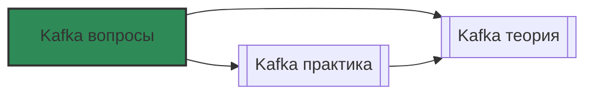

# 📄 Файл: `Kafka вопросы.md`

tags: [kafka, devops, sre, streaming, messaging, interview, questions, self-assessment]
aliases: [kafka-questions, kafka-sre-interview, kafka-operations-questions]
created: 2026-05-10
---

# ❓ Apache Kafka: Вопросы и самопроверка

> [!INFO] Структура
> Вопросы разделены по уровням: 🟢 Junior → 🟡 Middle → 🔴 Senior.  
> Каждый вопрос содержит: формулировку, развёрнутый ответ и пояснение, почему это важно для DevOps/SRE.

📋 [[#🗂️ Оглавление для навигации|Оглавление]] | [[#🧪 Чек-лист готовности|Чек-лист]] | [[#🔗 Связь с другими файлами|Связи]]

---

## 🗂️ Оглавление для навигации

### 🟢 Junior (базовые концепции, архитектура, CLI)
- [[#1. Чем Kafka отличается от традиционных очередей (RabbitMQ, ActiveMQ)?|1. Kafka vs MQ]]
- [[#2. Из каких компонентов состоит кластер Kafka?|2. Kafka architecture]]
- [[#3. Что такое Partition и зачем нужна репликация?|3. Partitions & Replication]]
- [[#4. Что такое Offset и как его управляют консьюмеры?|4. Offsets]]
- [[#5. Как создать Topic и отправить/прочитать сообщение через CLI?|5. Basic CLI]]
- [[#6. Что такое Consumer Group и как работает балансировка?|6. Consumer Groups]]
- [[#7. В чём разница между Key и Value в сообщении?|7. Key vs Value]]
- [[#8. Как работает ZooKeeper в Kafka и почему от него отказываются?|8. ZooKeeper vs KRaft]]
- [[#9. Что такое Replication Factor и как его выбирать?|9. Replication Factor]]
- [[#10. Как посмотреть состояние кластера и топиков?|10. Cluster status]]

### 🟡 Middle (операции, безопасность, мониторинг, troubleshooting)
- [[#11. ⭐ Как работает ISR (In-Sync Replicas) и что происходит при выпадении реплики?|11. ISR internals ⭐]]
- [[#12. Что такое Leader Election и как минимизировать downtime?|12. Leader Election]]
- [[#13. Как работает Kafka Connect и разница между Source/Sink?|13. Kafka Connect]]
- [[#14. Retention vs Log Compaction: когда что использовать?|14. Retention & Compaction]]
- [[#15. Как настроить аутентификацию и авторизацию (SASL/SSL, ACLs)?|15. Kafka Security]]
- [[#16. Какие метрики критичны для мониторинга Kafka?|16. Kafka Metrics]]
- [[#17. Что такое Under-Replicated Partitions и как их лечить?|17. UR Partitions]]
- [[#18. Как диагностировать и уменьшить Consumer Lag?|18. Consumer Lag]]
- [[#19. Что такое Exactly-Once Semantics (EOS) и как его настроить?|19. EOS]]
- [[#20. Как работает Schema Registry и зачем он нужен?|20. Schema Registry]]

### 🔴 Senior (масштабирование, DR, performance, production)
- [[#21. ⭐ Как спроектировать отказоустойчивый кластер (KRaft mode)?|21. KRaft HA ]]
- [[#22. Как работает MirrorMaker 2 для кросс-кластерной репликации?|22. MM2 & DR]]
- [[#23. Как тюнить производительность (batch, linger, JVM, OS)?|23. Performance Tuning]]
- [[#24. Capacity Planning: как рассчитать ресурсы и масштабировать?|24. Capacity Planning]]
- [[#25. Как обеспечить Disaster Recovery и соблюсти RPO/RTO?|25. DR Strategy]]
- [[#26. Подводные камни запуска Kafka в Kubernetes|26. Kafka on K8s]]
- [[#27. Tiered Storage: как экономить на дисках без потери доступности?|27. Tiered Storage]]
- [[#28. Как управлять rebalancing и избегать "stop-the-world"?|28. Rebalancing]]
- [[#29. Совместимость схем: BACKWARD, FORWARD, FULL — что выбрать?|29. Schema Compatibility]]
- [[#30. ⭐ Best practices по мониторингу и алертингу в production|30. Observability ⭐]]

---

##  Junior (базовые концепции, архитектура, CLI)

### 1. Чем Kafka отличается от традиционных очередей (RabbitMQ, ActiveMQ)?

**Ответ**:
```
Kafka — распределённый лог коммитов (distributed commit log), а не классическая очередь.
• Хранение: сообщения сохраняются на диске и живут по retention policy, а не удаляются после чтения
• Потребление: несколько консьюмеров могут читать одни и те же данные независимо (через разные Consumer Groups)
• Пропускная способность: оптимизирована под sequential I/O, легко держит миллионы msg/sec
• Экосистема: Connect (интеграции), Streams (обработка), Schema Registry, ksqlDB
• RabbitMQ: smart broker/dumb consumer, сообщения удаляются после ack, сложнее масштабировать горизонтально
```

**DevOps-контекст**: Kafka выбирают для event streaming, аналитики, микросервисной синхронизации. RabbitMQ — для task queues, RPC, сложной маршрутизации. Не заменяй одно другим без анализа паттерна использования.

[[#🗂️ Оглавление для навигации|↑ К оглавлению]]

### 2. Из каких компонентов состоит кластер Kafka?

**Ответ**:
```
• Broker: инстанс Kafka-сервера (хранит партиции, обслуживает клиентов)
• Topic: логическая категория сообщений
• Partition: упорядоченная, неизменяемая последовательность записей внутри топика (единица параллелизма)
• Replica: копия партиции на другом брокере (1 лидер + N фолловеров)
• Controller: брокер-координатор (управляет лидерством, метаданными)
• ZooKeeper / KRaft: хранение метаданных кластера, выбор контроллера
• Producer / Consumer: клиенты, пишущие/читающие данные
• Kafka Connect: фреймворк для интеграции с внешними системами
```

**DevOps-контекст**: Понимание компонентов критично для настройки, мониторинга и troubleshooting. Broker = JVM-процесс, Controller = роль, а не отдельный процесс.

[[#🗂️ Оглавление для навигации|↑ К оглавлению]]

### 3. Что такое Partition и зачем нужна репликация?

**Ответ**:
```
Partition — горизонтальный шард топика. Сообщения распределяются по партициям (по ключу или round-robin).
• Порядок гарантируется только внутри одной партиции
• Параллелизм: 1 консьюмер = 1 партиция (в рамках группы)

Репликация:
• Каждая партиция имеет Replication Factor (RF)
• 1 лидер (принимает запись/чтение) + N-1 фолловеров (копируют лидера)
• Гарантирует доступность при падении брокера
```

**DevOps-контекст**: RF=3 — стандарт для production. Количество партиций определяет максимальный параллелизм консьюмеров. Увеличить партиции можно, уменьшить — нет (без пересоздания топика).

[[#🗂️ Оглавление для навигации|↑ К оглавлению]]

### 4. Что такое Offset и как его управляют консьюмеры?

**Ответ**:
```
Offset — уникальный числовой идентификатор сообщения внутри партиции.
• Монотонно растёт: 0, 1, 2, 3...
• Консьюмер запоминает последний обработанный offset
• Автокоммит (enable.auto.commit=true) или ручной (commitSync/commitAsync)

Где хранится:
• Внутренний топик __consumer_offsets (по умолчанию)
• Позволяет консьюмерам независимо двигаться вперёд/назад
```

**DevOps-контекст**: Потеря offset = дублирование или пропуск сообщений. В production чаще используют ручной коммит после успешной обработки. Мониторь лаг: lag = last_produced_offset - last_committed_offset.

[[#🗂️ Оглавление для навигации|↑ К оглавлению]]

### 5. Как создать Topic и отправить/прочитать сообщение через CLI?

**Ответ**:
```bash
# Создание топика (3 партиции, RF=2)
kafka-topics.sh --bootstrap-server localhost:9092 \
  --create --topic my-topic --partitions 3 --replication-factor 2

# Отправка сообщений (producer)
kafka-console-producer.sh --bootstrap-server localhost:9092 --topic my-topic
> hello kafka
> {"event": "user_signup", "user_id": 123}

# Чтение сообщений (consumer)
kafka-console-consumer.sh --bootstrap-server localhost:9092 \
  --topic my-topic --from-beginning

# Просмотр топиков
kafka-topics.sh --bootstrap-server localhost:9092 --list
kafka-topics.sh --bootstrap-server localhost:9092 --describe --topic my-topic
```

**DevOps-контекст**: CLI полезен для быстрой отладки и smoke-тестов. В production используй IaC (Terraform, Ansible) или CI/CD для управления топиками. Никогда не создавай топики вручную в проде.

[[#🗂️ Оглавление для навигации|↑ К оглавлению]]

### 6. Что такое Consumer Group и как работает балансировка?

**Ответ**:
```
Consumer Group — логическая группа консьюмеров, совместно читающих топик.
• Каждое сообщение доставляется только одному консьюмеру в группе
• Балансировка (Rebalance): при добавлении/удалении консьюмеров партиции перераспределяются
• Стратегии: Range, RoundRobin, Sticky (минимизирует перемещения), CooperativeSticky

Координатор: один из брокеров выступает Group Coordinator, хранит метаданные группы в __consumer_offsets
```

**DevOps-контекст**: Rebalance может вызывать "stop-the-world" (паузу обработки). Используй `partition.assignment.strategy=org.apache.kafka.clients.consumer.CooperativeStickyAssignor` и настраивай `session.timeout.ms` / `heartbeat.interval.ms` аккуратно.

[[#🗂️ Оглавлению|↑ К оглавлению]]

### 7. В чём разница между Key и Value в сообщении?

**Ответ**:
```
• Key: определяет партицию (hash(key) % num_partitions). Гарантирует порядок для одинаковых ключей. Может быть null (тогда round-robin).
• Value: полезная нагрузка (payload). Может быть любым форматом (JSON, Avro, Protobuf, binary).

Пример:
Key: user_id=123 → всегда попадает в партицию 2 → порядок событий пользователя сохраняется
Value: {"action": "login", "timestamp": "..."}
```

**DevOps-контекст**: Неправильный выбор ключа = перекос данных (data skew) и перегрузка отдельных партиций. Для аналитики часто используют null-ключ (равномерное распределение), для транзакций — business key.

[[#🗂️ Оглавлению|↑ К оглавлению]]

### 8. Как работает ZooKeeper в Kafka и почему от него отказываются?

**Ответ**:
```
ZooKeeper (ZK):
• Хранит метаданные кластера, брокеров, топиков, контроллеров
• Выбирает Controller через ephemeral znodes
• Проблемы: отдельный кластер для поддержки, bottleneck, сложность операций, лимиты на количество топиков/партиций

KRaft (Kafka Raft):
• Встроенный консенсус-протокол (на основе Raft)
• Метаданные хранятся внутри Kafka (внутренний топик __cluster_metadata)
• Нет отдельного ZK-кластера, проще деплой, лучше масштабируемость, поддержка миллионов партиций

Статус: KRaft production-ready с Kafka 3.3+, ZK deprecated.
```

**DevOps-контекст**: Мигрируй на KRaft при обновлении кластера. Убирает зависимость от ZK, упрощает Kubernetes-деплой и мониторинг.

[[#🗂️ Оглавлению|↑ К оглавлению]]

### 9. Что такое Replication Factor и как его выбирать?

**Ответ**:
```
Replication Factor (RF) — количество копий каждой партиции.
• RF=1: нет отказоустойчивости (падение брокера = потеря данных)
• RF=2: переживает падение 1 брокера
• RF=3: стандарт для production (переживает падение 2 брокеров или 1 при обслуживании)

Формула минимальных брокеров: N >= RF
Для RF=3 нужно минимум 3 брокера.
```

**DevOps-контекст**: RF>3 редко нужен и увеличивает overhead на сеть/диск. Настраивай `min.insync.replicas` вместе с RF для гарантий записи.

[[#🗂️ Оглавлению|↑ К оглавлению]]

### 10. Как посмотреть состояние кластера и топиков?

**Ответ**:
```bash
# Список брокеров
kafka-broker-api-versions.sh --bootstrap-server localhost:9092

# Описание топика (лидеры, реплики, ISR)
kafka-topics.sh --bootstrap-server localhost:9092 --describe --topic my-topic

# Проверка Under-Replicated Partitions
kafka-topics.sh --bootstrap-server localhost:9092 --describe --under-replicated-partitions

# Проверка Unavailable Partitions
kafka-topics.sh --bootstrap-server localhost:9092 --describe --unavailable-partitions

# Просмотр Consumer Groups и лага
kafka-consumer-groups.sh --bootstrap-server localhost:9092 --list
kafka-consumer-groups.sh --bootstrap-server localhost:9092 --describe --group my-group
```

**DevOps-контекст**: Эти команды — база для ежедневного health-check. Автоматизируй их через скрипты или интеграцию с Prometheus (JMX Exporter).

[[#️ Оглавлению|↑ К оглавлению]]

---

## 🟡 Middle (операции, безопасность, мониторинг, troubleshooting)

### 11. ⭐ Как работает ISR (In-Sync Replicas) и что происходит при выпадении реплики?

**Ответ**:
```
ISR — набор реплик, которые полностью синхронизированы с лидером.
• Лидер всегда в ISR
• Фолловер попадает в ISR, если догоняет лидера в течение `replica.lag.time.max.ms` (по умолчанию 30с)
• Только реплики из ISR могут стать новым лидером

При выпадении реплики:
1. Фолловер отстаёт → исключается из ISR
2. Если `min.insync.replicas` не соблюдён → producer получает ошибку NOT_ENOUGH_REPLICAS (при acks=all)
3. Данные не теряются, но запись может быть заблокирована до восстановления ISR
```

**DevOps-контекст**: Мониторь `kafka_server_replicamanager_isrexpands` и `isrshrinks`. Частые колебания ISR = проблемы с сетью, дисками или перегрузкой брокеров. Настраивай `replica.lag.time.max.ms` под свою инфраструктуру.

[[#🗂️ Оглавлению|↑ К оглавлению]]

### 12. Что такое Leader Election и как минимизировать downtime?

**Ответ**:
```
Leader Election — процесс выбора нового лидера партиции при падении старого.
• Unclean Leader Election: лидер выбирается даже из не-ISR реплик (риск потери данных, но доступность выше)
• Controlled Leader Election: только из ISR (гарантия консистентности, возможна пауза)

Параметры:
• `unclean.leader.election.enable=false` (рекомендуется для production)
• `num.replica.fetchers` — ускоряет копирование при восстановлении
• `leader.imbalance.check.interval.seconds` — фоновое выравнивание лидеров

Как минимизировать downtime:
• Держи RF=3 и `min.insync.replicas=2`
• Используй Rack Awareness для распределения реплик
• Настрой graceful shutdown брокеров
```

**DevOps-контекст**: Unclean election = потеря данных. В финансовых/критичных системах всегда `false`. Планируй maintenance окна и используй rolling restart с достаточным ISR.

[[#️ Оглавлению|↑ К оглавлению]]

### 13. Как работает Kafka Connect и разница между Source/Sink?

**Ответ**:
```
Kafka Connect — фреймворк для потоковой передачи данных между Kafka и внешними системами (DB, S3, Elasticsearch, HTTP).
• Source Connector: читает из внешней системы → пишет в Kafka
• Sink Connector: читает из Kafka → пишет во внешнюю систему
• Worker Modes: Standalone (1 процесс) или Distributed (кластер, отказоустойчивый)
• Хранит конфигурации и оффсеты во внутренних топиках (__connect_configs, __connect_offsets, __connect_statuses)

Примеры коннекторов: Debezium (CDC), S3 Sink, JDBC Source, Elasticsearch Sink, MQTT.
```

**DevOps-контекст**: Не пиши кастомные интеграции, если есть готовый коннектор. Разворачивай Connect в Distributed mode. Мониторь task failures и restart policies.

[[#🗂️ Оглавлению|↑ К оглавлению]]

### 14. Retention vs Log Compaction: когда что использовать?

**Ответ**:
```
Retention (по времени/размеру):
• Сообщения удаляются через `retention.ms` или `retention.bytes`
• Use case: event streaming, логи, временные данные
• Порядок сохраняется, старые данные стираются

Log Compaction:
• Сохраняется только последнее сообщение для каждого ключа
• Фондовый процесс (Log Cleaner) удаляет старые версии ключей
• Use case: changelog, состояние сущностей (users, products), Kafka Streams state stores
• Требует ненулевой ключ, `cleanup.policy=compact`

Комбинация: `cleanup.policy=compact,delete` — компакция + удаление по времени.
```

**DevOps-контекст**: Compaction увеличивает нагрузку на диски (фоновое слияние сегментов). Мониторь `kafka_log_logcleanermanager_max_clean_time_segs` и место на диске. Не используй compact для high-churn данных.

[[#🗂️ Оглавлению|↑ К оглавлению]]

### 15. Как настроить аутентификацию и авторизацию (SASL/SSL, ACLs)?

**Ответ**:
```
Аутентификация (кто ты):
• SSL/TLS: сертификаты клиентов/брокеров
• SASL/PLAIN: логин/пароль (просто, но пароли в plaintext)
• SASL/SCRAM: хешированные пароли, безопаснее
• SASL/OAUTHBEARER: JWT/OIDC интеграция

Авторизация (что можешь делать):
• ACLs (Access Control Lists): разрешение/запрет на Read/Write/Create/Delete для пользователей и групп
• Команды: `kafka-acls.sh --add --allow-principal User:app1 --operation Read --topic my-topic`
• Хранятся в ZooKeeper/KRaft metadata

Шифрование:
• Encryption in transit: `security.inter.broker.protocol=SSL`, `ssl.enabled.protocols=TLSv1.2,TLSv1.3`
• Encryption at rest: disk encryption (LUKS, cloud KMS), Kafka не шифрует данные на диске "из коробки"
```

**DevOps-контекст**: В production всегда включай TLS + SASL. ACLs обязательны для multi-tenant кластеров. Ротируй сертификаты/пароли через автоматизацию (HashiCorp Vault, cert-manager).

[[#🗂️ Оглавлению|↑ К оглавлению]]

### 16. Какие метрики критичны для мониторинга Kafka?

**Ответ**:
```
Кластер/Брокер:
• `kafka_server_replicamanager_underreplicatedpartitions` > 0 → проблема репликации
• `kafka_server_replicamanager_isrshrinks` / `isrexpands` → нестабильность сети/дисков
• `kafka_network_requestmetrics_requestqueuetimems` → перегрузка сети/потоков
• `kafka_log_logflushstats_logflushrateandtimems` → медленные диски

Топики/Партиции:
• `kafka_server_brokertopicmetrics_bytesinpersec` / `bytesoutpersec` → нагрузка
• `kafka_cluster_partition_count` → рост метаданных

Консьюмеры:
• Lag (разница между produced и committed offset) → задержка обработки
• `kafka_consumer_records_lag_max` → пиковый лаг

Инфраструктура:
• CPU, Memory, Disk I/O, Disk Usage, Network I/O, JVM GC pauses
```

**DevOps-контекст**: Используй `jmx_exporter` + Prometheus + Grafana. Алерти на UR partitions, высокий лаг, рост очереди запросов и место на диске (>80%).

[[#🗂️ Оглавлению|↑ К оглавлению]]

### 17. Что такое Under-Replicated Partitions и как их лечить?

**Ответ**:
```
UR Partitions — партиции, у которых количество реплик в ISR < Replication Factor.
Причины:
• Падение/перезагрузка брокера
• Медленные диски (реплика не успевает копировать)
• Сетевые задержки/разрывы
• Перегрузка CPU/RAM брокера

Лечение:
1. Проверь статус брокеров: `kafka-broker-api-versions.sh`
2. Посмотри логи брокера (ошибки диска, сети, OOM)
3. Проверь нагрузку: iostat, top, network metrics
4. Ускорь репликацию: увеличь `num.replica.fetchers`, проверь диски
5. Если брокер мёртв — замени/восстанови ноду, Kafka автоматически перераспределит реплики
```

**DevOps-контекст**: UR partitions = снижение отказоустойчивости. Если UR > 0 длительное время — риск потери данных при падении лидера. Алерти немедленно.

[[#🗂️ Оглавлению|↑ К оглавлению]]

### 18. Как диагностировать и уменьшить Consumer Lag?

**Ответ**:
```
Lag = Last Produced Offset - Last Committed Offset
Диагностика:
• `kafka-consumer-groups.sh --describe --group <group>`
• Prometheus: `kafka_consumer_records_lag_max`

Причины роста лага:
• Консьюмер медленный (тяжёлая обработка, блокирующие вызовы)
• Нехватка партиций (консьюмеров больше, чем партиций — лишние простаивают)
• Rebalance storm (частые переподключения)
• Сетевые задержки или throttling

Решения:
• Оптимизируй код обработки (batching, async, pooling)
• Увеличь `max.poll.records` / `fetch.max.bytes`
• Добавь партиции (если архитектура позволяет)
• Настрой `session.timeout.ms` и `heartbeat.interval.ms` для стабильности
• Используй CooperativeStickyAssignor для плавных ребалансов
```

**DevOps-контекст**: Лаг — ключевая SRE-метрика. Алерти на рост лага > порога в течение N минут. Не увеличивай партиции бездумно — это влияет на порядок и хранилище.

[[#🗂️ Оглавлению|↑ К оглавлению]]

### 19. Что такое Exactly-Once Semantics (EOS) и как его настроить?

**Ответ**:
```
EOS гарантирует, что сообщение будет обработано и записано ровно один раз, даже при сбоях.
Реализация:
• Idempotent Producer: `enable.idempotence=true` (дефолт с Kafka 3.0+). Prevents duplicates on retry.
• Transactions: `isolation.level=read_committed`. Producer оборачивает запись в транзакцию, консьюмер читает только закоммиченные данные.
• EOS 2.0: упрощённая настройка, меньше overhead.

Настройка:
Producer: `enable.idempotence=true`, `acks=all`, `retries=INT_MAX`
Consumer: `isolation.level=read_committed`
Processing: используй транзакции в Kafka Streams или ручное commit внутри транзакции
```

**DevOps-контекст**: EOS добавляет overhead (дополнительные round-trips, хранение транзакционных логов). Включай только для финансовых/критичных данных. Для аналитики чаще достаточно At-Least-Once + дедупликация на стороне потребителя.

[[#🗂️ Оглавлению|↑ К оглавлению]]

### 20. Как работает Schema Registry и зачем он нужен?

**Ответ**:
```
Schema Registry — отдельный сервис (обычно Confluent или Apicurio) для управления схемами данных (Avro, Protobuf, JSON Schema).
Зачем:
• Валидация данных на входе/выходе
• Гарантия совместимости при изменении схем
• Сериализация/десериализация без хардкода форматов в клиентах
• Хранение версий схем и политик совместимости

Уровни совместимости:
• BACKWARD: новые консьюмеры читают старые данные (дефолт, безопасно)
• FORWARD: старые консьюмеры читают новые данные
• FULL: оба направления
• NONE: без проверок (опасно в production)
```

**DevOps-контекст**: Без Registry схемы "расползаются" по коду, ломая консьюмеров при деплое. Деплой Schema Registry как отдельного HA-сервиса. Алерти на compatibility check failures.

[[#🗂️ Оглавлению|↑ К оглавлению]]

---

## 🔴 Senior (масштабирование, DR, performance, production)

### 21. ⭐ Как спроектировать отказоустойчивый кластер (KRaft mode)?

**Ответ**:
```
KRaft-кластер без ZooKeeper:
• Controller Quorum: 3 или 5 нод (нечётное число для консенсуса)
• Metadata Topic: __cluster_metadata хранит состояние кластера
• Broker Roles: controller, broker, или both (в small clusters)

Архитектура production:
• 3 dedicated controller nodes (легкие, без данных, только метаданные)
• 3+ broker nodes (хранят партиции, обслуживают клиентов)
• Rack awareness: распределяй реплики по AZ/rack
• Storage: NVMe/SSD, XFS/ext4, noatime, adequate IOPS
• JVM: G1GC, heap ~6-8GB (не больше, Kafka использует page cache)

Отказоустойчивость:
• Выживание при потере (N-1)/2 контроллеров
• Автоматический выбор лидера партиций
• Graceful shutdown с передачей лидерства
```

**DevOps-контекст**: KRaft упрощает деплой и мониторинг. Не смешивай controller и broker roles в large clusters. Тестируй failover контроллеров в staging.

[[#🗂️ Оглавлению|↑ К оглавлению]]

### 22. Как работает MirrorMaker 2 для кросс-кластерной репликации?

**Ответ**:
```
MirrorMaker 2 (MM2) — встроенный инструмент репликации между кластерами.
• Source → Target: копирует топики, конфиги, оффсеты, consumer groups
• Heartbeat topic: отслеживает задержку репликации
• Checkpoint topic: синхронизирует оффсеты консьюмеров между кластерами

Использование:
• Active-Passive DR: репликация в standby-регион
• Active-Active: двусторонняя репликация (требует careful conflict resolution)
• Migration: перенос данных между кластерами без downtime

Ограничения:
• Реплицирует данные, но не ACLs, квоты, configs (нужна отдельная синхронизация)
• Задержка зависит от сети и нагрузки
• Не заменяет распределённые транзакции
```

**DevOps-контекст**: MM2 — стандарт для DR в Kafka. Тестируй failover сценарии. Мониторь replication lag через heartbeat topic. Для Active-Active рассмотри Confluent Replicator или Tiered Storage с remote reads.

[[#🗂️ Оглавлению|↑ К оглавлению]]

### 23. Как тюнить производительность (batch, linger, JVM, OS)?

**Ответ**:
```
Producer:
• `batch.size`: 16KB-1MB (увеличивай для high-throughput)
• `linger.ms`: 5-100ms (ждёт заполнения батча, снижает запросы)
• `buffer.memory`: 32MB+
• `compression.type`: lz4/snappy/zstd

Consumer:
• `fetch.min.bytes` / `fetch.max.wait.ms`: баланс latency/throughput
• `max.poll.records`: 500-1000 (не ставь слишком много, если обработка медленная)

Broker/OS:
• `log.segment.bytes`: 1GB (дефолт), уменьшай если много мелких топиков
• `num.io.threads` / `num.network.threads`: под ядра CPU
• JVM: `-Xms6g -Xmx6g -XX:+UseG1GC -XX:MaxGCPauseMillis=20`
• OS: `vm.swappiness=1`, `net.core.somaxconn=1024`, `fs.file-max`, `nofile=100000`
• Disk: SSD/NVMe, XFS, `noatime`, RAID 0/10, отдельный диск для логов и OS
```

**DevOps-контекст**: Тюнь под нагрузку, а не копипасть конфиги. Измеряй до/после. G1GC критичен для low-latency. Следить за GC pauses > 100ms.

[[#🗂️ Оглавлению|↑ К оглавлению]]

### 24. Capacity Planning: как рассчитать ресурсы и масштабировать?

**Ответ**:
```
Формулы оценки:
• Disk: (msg/sec × avg_size × retention_sec) / replication_factor × safety_margin(1.5)
• Network: throughput_in + throughput_out (out ≈ in × RF)
• CPU: 2-4 cores per broker for moderate load, scale linearly
• Partitions: 100-1000 per broker (больше → overhead на metadata/memory)

Масштабирование:
• Горизонтальное: добавление брокеров → автоматическое перераспределение лидерства
• Ручное rebalance: `kafka-reassign-partitions.sh` (для равномерного распределения)
• Увеличение партиций: только вперёд, влияет на порядок и консьюмеров
• Вертикальное: SSD, больше RAM, быстрее сеть

Мониторинг capacity:
• Disk usage trend, network saturation, CPU steal, partition count per broker
```

**DevOps-контекст**: Планируй с запасом 30-50%. Автоматизируй rebalance через инструменты (Cruise Control). Не добавляй партиции без тестов консьюмеров.

[[#️ Оглавлению|↑ К оглавлению]]

### 25. Как обеспечить Disaster Recovery и соблюсти RPO/RTO?

**Ответ**:
```
RPO (потеря данных): зависит от `min.insync.replicas`, `acks`, репликации между регионами
RTO (время восстановления): зависит от MM2 lag, автоматизации failover, readiness консьюмеров

Стратегии:
1. Active-Passive: MM2 реплицирует в standby-регион. При сбое → переключаем консьюмеров, промотируем топики
2. Active-Active: двусторонняя репликация, сложная консистентность, требует conflict resolution
3. Backup/Restore: `kafka-console-consumer --dump` + S3, или snapshot дисков (не рекомендуется для production)

Чеклист DR:
• Регулярные учения failover
• Документированные runbooks
• Автоматическое переключение DNS/load balancer
• Валидация данных после восстановления
• Мониторинг replication lag между регионами
```

**DevOps-контекст**: Kafka не заменяет backup. Для compliance используй S3 Sink + объектное хранилище. Тестируй DR минимум раз в квартал. RPO=0 требует синхронной кросс-регион репликации (дорого и медленно).

[[#🗂️ Оглавлению|↑ К оглавлению]]

### 26. Подводные камни запуска Kafka в Kubernetes

**Ответ**:
```
Проблемы:
• StatefulSet + PVC: медленное provisioning, rebalance при пересоздании подов
• Network policies: broker-to-broker и client-to-broker связи должны быть открыты
• Resource limits: OOMKill при пиках, throttling CPU влияет на GC и сеть
• Rebalance storms: частые рестарты подов → массовые переподключения консьюмеров
• Storage: local PV vs network storage (latency matters!)

Best Practices:
• Использовать операторы (Strimzi, Confluent Operator) вместо голого StatefulSet
• PodDisruptionBudget для контролируемых обновлений
• Anti-affinity: распределять поды по нодам/AZ
• Dedicated nodes/pools для Kafka (isolated resources)
• Graceful shutdown hooks, preStop для передачи лидерства
• Monitoring sidecars (JMX exporter, config-reloader)
```

**DevOps-контекст**: Kafka в K8s возможен, но требует зрелой платформы. Strimzi — де-факто стандарт. Избегай network storage с высокой задержкой. Тестируй node drain и pod eviction сценарии.

[[#🗂️ Оглавлению|↑ К оглавлению]]

### 27. Tiered Storage: как экономить на дисках без потери доступности?

**Ответ**:
```
Tiered Storage (KIP-405) — выгрузка старых сегментов в объектное хранилище (S3, GCS).
• Local disks: хранят только recent data (hot tier)
• Remote storage: исторические данные (cold tier)
• Клиенты читают прозрачно (локально или с remote fetch)
• Экономия до 70% на дорогих SSD

Настройка:
• `remote.log.storage.system.enable=true`
• Настройка S3 credentials, bucket, retention
• `log.retention.bytes` / `remote.log.retention.ms`

Ограничения:
• Доступность зависит от cloud provider
• Задержка чтения remote сегментов выше
• Требует Kafka 3.6+
```

**DevOps-контекст**: Идеально для compliance-хранения и аналитики. Не используй для low-latency streaming. Тестируй remote fetch latency. Мониторь S3 costs и egress traffic.

[[#🗂️ Оглавлению|↑ К оглавлению]]

### 28. Как управлять rebalancing и избегать "stop-the-world"?

**Ответ**:
```
Проблема: при rebalance консьюмеры останавливают обработку, коммитят оффсеты, переподключаются.
Решения:
• `partition.assignment.strategy=CooperativeStickyAssignor`: incremental rebalancing, партиции освобождаются постепенно
• Увеличь `session.timeout.ms` (10-30s) и `heartbeat.interval.ms` (3-10s)
• Настрой `max.poll.interval.ms` под время обработки батча
• Избегай долгих GC pauses и blocking I/O в консьюмере
• Используй static group membership (`group.instance.id`) для stateful приложений (Kafka Streams, Connect)

Мониторинг:
• `kafka_consumer_coordinator_rebalance_latency_avg`
• Частота rebalance events в логах консьюмеров
```

**DevOps-контекст**: Rebalance storms — частая причина инцидентов. Настрой cooperative assignor и статичные ID для критичных воркеров. Алерти на частые ребалансы.

[[#🗂️ Оглавлению|↑ К оглавлению]]

### 29. Совместимость схем: BACKWARD, FORWARD, FULL — что выбрать?

**Ответ**:
```
BACKWARD (дефолт):
• Новые консьюмеры могут читать старые данные
• Безопасно для rolling deploys
• Добавление полей с default, удаление опциональных полей

FORWARD:
• Старые консьюмеры читают новые данные
• Редко используется, требует осторожности

FULL:
• Оба направления совместимы
• Строго, но ограничивает эволюцию схем

NONE:
• Без проверок → риск поломки консьюмеров

Правила эволюции Avro/Protobuf:
• ✅ Добавлять поля с default/nullable
• ✅ Удалять опциональные поля
• ❌ Менять типы, удалять обязательные поля, переименовывать без aliases
```

**DevOps-контекст**: В CI/CD добавляй проверку совместимости схем. Используй BACKWARD для большинства сценариев. Тестируй consumption старых данных после деплоя новой версии.

[[#🗂️ Оглавлению|↑ К оглавлению]]

### 30. ⭐ Best practices по мониторингу и алертингу в production

**Ответ**:
```
Метрики (Prometheus + JMX Exporter):
• Cluster: under_replicated_partitions, offline_partitions, active_controller_count
• Broker: request_queue_time, io_wait_time, gc_pause, disk_usage, network_bytes
• Topics: bytes_in/out, failed_produce/fetch_requests
• Consumers: records_lag_max, rebalance_rate, commit_latency

Алерты:
• Critical: offline_partitions > 0, under_replicated > 0 for 5m, disk > 85%, controller failover
• Warning: consumer lag > threshold for 10m, rebalance rate spike, GC > 200ms, request queue growing
• Info: partition count growth, topic creation, schema compatibility failures

Дашборды:
• Cluster health, broker resources, topic throughput, consumer lag, GC/memory, network/disk I/O
• SLO: availability, lag SLA, produce/consume latency p99

Runbooks:
• Автоматизированные действия: restart failed tasks, rebalance partitions, scale consumers
• Документация: troubleshooting flow, contact owners, escalation policy
```

**DevOps-контекст**: Мониторинг без алертов = декорация. Алерты без runbooks = паника. Интегрируй с PagerDuty/Slack. Проводи game days для проверки alerting pipeline. Используй `kafka_exporter` или `jmx_exporter` с готовыми Grafana дашбордами.

[[#🗂️ Оглавлению|↑ К оглавлению]]

---

## 🧪 Чек-лист готовности

- [ ] Могу объяснить разницу между Kafka и RabbitMQ и обосновать выбор
- [ ] Понимаю архитектуру кластера: брокеры, партиции, реплики, контроллеры
- [ ] Знаю, как работает ISR и почему min.insync.replicas критичен
- [ ] Могу диагностировать consumer lag и предложить решения
- [ ] Понимаю разницу между retention и compaction
- [ ] Знаю, как настроить безопасность (TLS, SASL, ACLs)
- [ ] Могу объяснить Exactly-Once Semantics и его overhead
- [ ] Понимаю роль Schema Registry и политики совместимости
- [ ] Знаю, как спроектировать DR с MM2 и соблюсти RPO/RTO
- [ ] Могу настроить мониторинг и алертинг для production-кластера

> [!TIP] Практика
> Для закрепления:
> 1. Разверни Kafka-кластер (KRaft) через Docker Compose или Strimzi в minikube
> 2. Настрой producer/consumer, протестируй rebalance и lag
> 3. Настрой Schema Registry и протестируй compatibility check
> 4. Симулируй падение брокера и проверь leader election
> 5. Настрой Prometheus + Grafana дашборд для Kafka

---

## 🔗 Связь с другими файлами

> [!TIP] Следующие шаги
> После самопроверки:
> - [[Kafka практика]]: развертывание, CLI, Connect, troubleshooting
> - [[Kafka теория]]: глубокая архитектура, протоколы, internals
> - [[Monitoring практика]]: Prometheus, JMX Exporter, Grafana
> - [[Kubernetes практика]]: Strimzi, StatefulSet, PVC, operators
> - [[Cloud практика]]: MSK, Confluent Cloud, S3 Tiered Storage



[[#🗂️ Оглавление для навигации|↑ К оглавлению]]

---

**Структура проекта**:
```
DevOps_start-main
├── 00_Fundamentals
│   ├── Linux
│   ├── Networking
│   └── Scripting
├── 01_Version_Control
│   ── Git
├── 02_Containers
│   ├── Docker
│   └── Kubernetes
├── 03_Infrastructure
│   ├── Terraform
│   ├── Ansible
│   └── AWS_Cloud
├── 04_CI_CD
│   ├── CI_CD
│   └── GitOps
├── 05_Observability
│   ├── Prometheus
│   ├── Grafana
│   ├── Logging
│   ── Tempo
├── 06_Databases
├── 07_Messaging
│   ├── Kafka
│   │   ├── [[Kafka практика]]
│   │   ├── [[Kafka теория]]
│   │   └── [[Kafka вопросы]] ← этот файл
│   └── RabbitMQ
├── 08_Security
├── 09_Advanced
└── Roadmap
```