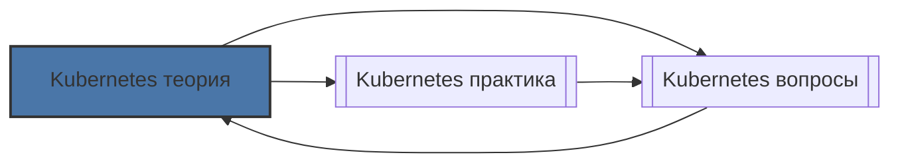

# 📄 Файл: `Kubernetes теория.md`

tags: [kubernetes, devops, theory, architecture]
aliases: [k8s-theory, kube-architecture]
created: 2026-05-07
---

# 🎯 Kubernetes для DevOps: Глубокое изучение теории

> [!INFO] Тема подтверждена  
> `Kubernetes — архитектура, внутренние механизмы, принципы работы`  
> **Уровень**: подготовка к собеседованию в топ-компанию  
> **Фокус**: теория + контекст DevOps + связь с экосистемой

📋 [[#🗂️ Оглавление для навигации|Оглавление]] | [[#🔑 Ключевые моменты|Итоги]] | [[#🔗 Связь с другими файлами|Связи]]

---

## 🗂️ Оглавление для навигации

### 🔹 Фундамент
- [[#🔹 Что такое Kubernetes? Простыми словами|Что такое Kubernetes]]
- [[#🔹 Почему именно оркестрация? Эволюция инфраструктуры|Эволюция инфраструктуры]]

### 🔹 Архитектура
- [[#🔹 Архитектура: из чего состоит кластер|Архитектура кластера]]
- [[#🔹 Control Plane: компоненты и ответственность|Control Plane]]
- [[#🔹 Worker Node: что запускает приложения|Worker Node]]
- [[#🔹 Etcd: сердце состояния кластера|Etcd]]

### 🔹 Объекты и контроллеры
- [[#🔹 Декларативная модель: желаемое → текущее|Декларативная модель]]
- [[#🔹 Иерархия объектов: Pod → Deployment → Service|Иерархия объектов]]
- [[#🔹 Контроллеры и петля управления|Петля управления]]

### 🔹 Сетевая модель
- [[#🔹 Требования CNI и плоская сеть|Требования CNI]]
- [[#🔹 Типы Service и балансировка трафика|Типы Service]]
- [[#🔹 Service discovery: DNS в Kubernetes|DNS и Service discovery]]
- [[#🔹 Ingress: L7-маршрутизация извне|Ingress]]

### 🔹 Хранение данных
- [[#🔹 Эволюция storage: от hostPath до CSI|Эволюция storage]]
- [[#🔹 Модель PV / PVC / StorageClass|Модель PV/PVC]]
- [[#🔹 Access Modes и Reclaim Policies|Доступ и политики]]

### 🔹 Безопасность
- [[#🔹 Аутентификация и авторизация: RBAC|Аутентификация и RBAC]]
- [[#🔹 Pod Security Standards|Pod Security]]
- [[#🔹 NetworkPolicy: файрвол на уровне подов|NetworkPolicy]]
- [[#🔹 Аудит и compliance|Аудит]]

### 🔹 Расширяемость
- [[#🔹 CRD: свои объекты в API|Custom Resource Definitions]]
- [[#🔹 Operators: автоматизация сложных приложений|Operators]]
- [[#🔹 Admission Webhooks: валидация и мутация|Admission Webhooks]]

### 🔹 DevOps-контекст
- [[#🔹 GitOps: Git как источник истины|GitOps]]
- [[#🔹 Интеграция с пайплайнами|CI/CD интеграция]]
- [[#🔹 Observability: три столпа|Observability]]
- [[#🔹 Управление затратами|Cost optimization]]

---

## 🔹 Фундамент

### 🔹 Что такое Kubernetes? Простыми словами

**Kubernetes (K8s)** — это open-source платформа для оркестрации контейнеризированных приложений, которая автоматизирует:

✅ Деплой и обновление приложений  
✅ Масштабирование под нагрузкой  
✅ Самовосстановление при сбоях  
✅ Сетевое взаимодействие и балансировку  
✅ Управление конфигурацией и секретами  

> [!NOTE] Ключевая идея
> Вы описываете **что** хотите (манифест), а Kubernetes **как** это сделать — решает сам через контроллеры.

[[#🗂️ Оглавление для навигации|↑ К оглавлению]]

### 🔹 Почему именно оркестрация? Эволюция инфраструктуры

```
Физические серверы (2000-е)
  ↓
Виртуализация: VMware, KVM (2005-2010)
  ↓
Контейнеры: Docker, LXC (2013-2014)
  ↓
Оркестрация: Kubernetes, Nomad, Swarm (2014–настоящее время)
```

| Аспект | Виртуализация | Контейнеры | Оркестрация |
|--------|--------------|------------|-------------|
| Изоляция | Полная (ОС + ядро) | Процессная (namespace/cgroups) | Логическая (через манифесты) |
| Запуск | Минуты | Секунды | Мгновенно (если образ есть) |
| Плотность | 10-20 ВМ на хост | 100-1000 контейнеров | Зависит от ресурсов |
| Переносимость | Образ ВМ (тяжёлый) | Образ контейнера (лёгкий) | Манифесты + образы |
| Управление | Вручную / скрипты | Docker Compose | Декларативно, авто-восстановление |

**DevOps-контекст**: Оркестрация — это не "просто запуск контейнеров", а платформа для:
- 🔄 Непрерывной доставки (ArgoCD, Flux)
- 🔐 Безопасности (OPA, Kyverno, Falco)
- 📊 Observability (Prometheus, Loki, Jaeger)
- 💰 Управления затратами (OpenCost, Kubecost)

[[#🗂️ Оглавление для навигации|↑ К оглавлению]]

---

## 🔹 Архитектура

### 🔹 Архитектура: из чего состоит кластер

```
┌─────────────────────────────────┐
│         Control Plane           │
│  (управляет состоянием кластера)│
├─────────────────────────────────┤
│ • kube-apiserver  ← единая точка входа
│ • etcd            ← хранилище состояния
│ • kube-scheduler  ← размещение подов
│ • controller-manager ← контроллеры
│ • cloud-controller (опц.) ← интеграция с облаком
└─────────────────────────────────┘
                   │
                   │ (gRPC/HTTPS)
                   ▼
┌─────────────────────────────────┐
│          Worker Nodes           │
│   (запускают ваши приложения)   │
├─────────────────────────────────┤
│ • kubelet       ← агент на ноде
│ • kube-proxy    ← сетевые правила
│ • container runtime ← containerd/CRI-O
│ • CNI-плагин    ← сеть (Calico, Cilium)
│ • CSI-плагин    ← хранилище
└─────────────────────────────────┘
```

[[#🗂️ Оглавление для навигации|↑ К оглавлению]]

### 🔹 Control Plane: компоненты и ответственность

#### 🌐 kube-apiserver
- **Единая точка входа** для всех операций (включая `kubectl`)
- **Аутентификация**: сертификаты, токены, OIDC, webhook
- **Авторизация**: RBAC, ABAC, webhook
- **Валидация и мутация**: admission controllers
- **Stateless**: можно масштабировать горизонтально за load balancer

#### 🗓️ kube-scheduler
- **Двухфазный алгоритм**:
  1. **Filter**: отсеивает ноды, не удовлетворяющие требованиям
  2. **Score**: ранжирует подходящие ноды по скорингу
- Учитывает: `resources.requests`, `nodeSelector`, `affinity`, `taints`, `topology`

#### 🎮 controller-manager
- Набор контроллеров, реализующих **control loop**:
  ```
  while true:
    desired = read_from_etcd()      # Желаемое состояние
    current = observe_cluster()     # Текущее состояние
    if desired != current:
      take_action()                 # Привести к желаемому
  ```
- **Ключевые контроллеры**:
  | Контроллер | Отвечает за |
  |------------|-------------|
  | `ReplicaSet` | Поддержание нужного количества подов |
  | `Deployment` | Обновления, откаты, стратегия развёртывания |
  | `Node` | Мониторинг здоровья нод, eviction |
  | `Endpoint` | Обновление списков подов для сервисов |
  | `Job/CronJob` | Запуск задач по расписанию или одноразово |

#### ☁️ cloud-controller-manager (опционально)
- Интеграция с облачными провайдерами (AWS, GCP, Azure)
- Управляет: балансировщиками, дисками, нодами через облачные API

[[#🗂️ Оглавление для навигации|↑ К оглавлению]]

### 🔹 Worker Node: что запускает приложения

#### 👷 kubelet
- Агент на каждой ноде, общается с apiserver
- **Отвечает за**:
  - Запуск/остановку контейнеров через CRI (Container Runtime Interface)
  - Отчёт о ресурсах и здоровье ноды
  - Выполнение `liveness`/`readiness`/`startup` проб
- **Важно**: Не управляет контейнерами, созданными не через K8s

#### 🌍 kube-proxy
- Поддерживает сетевые правила для `Service`
- **Режимы работы**:
  | Режим | Механизм | Когда использовать |
  |-------|----------|-------------------|
  | `iptables` (default) | Правила NAT в ядре | До ~1000 сервисов |
  | `ipvs` | Балансировщик на уровне ядра | >1000 сервисов, нужна производительность |
  | `userspace` | Proxy-процесс в user-space | Устарел, не рекомендуется |

#### 🐳 Container Runtime
- **CRI-совместимые**: `containerd` (рекомендуется), `CRI-O`
- **Docker**: устарел как runtime для K8s (требует shim `dockershim`, удалён в 1.24+)

#### 🔌 CNI и CSI плагины
- **CNI** (Container Network Interface): Calico, Cilium, Flannel — настраивают сеть
- **CSI** (Container Storage Interface): ebs.csi.aws.com, pd.csi.gke.io — управляют хранилищем

[[#🗂️ Оглавление для навигации|↑ К оглавлению]]

### 🔹 Etcd: сердце состояния кластера

> [!WARNING] Критичный компонент
> Потеря etcd = потеря состояния кластера. Регулярные бэкапы обязательны.

**Что такое etcd**:
- Распределённое key-value хранилище на основе консенсус-алгоритма **Raft**
- Хранит **всё** состояние кластера в `/registry/<group>/<resource>/<name>`
- Обеспечивает **линейную консистентность** (strong consistency)

**Требования к инфраструктуре**:
```
• Нечётное количество нод: 3, 5, 7 (для кворума)
• Низкая задержка диска: <10ms fsync (SSD/NVMe обязательно)
• Низкая задержка сети между нодами etcd: <10ms RTT
• Регулярные снапшоты: etcdctl snapshot save
```

**DevOps-контекст**:
- Мониторинг метрик: `etcd_server_has_leader`, `etcd_disk_wal_fsync_duration_seconds`
- DR-план: тестировать восстановление из снапшота минимум раз в квартал
- В managed-сервисах (EKS, GKE) etcd управляется провайдером — но бэкапы всё равно ваша ответственность

[[#🗂️ Оглавление для навигации|↑ К оглавлению]]

---

## 🔹 Объекты и контроллеры

### 🔹 Декларативная модель: желаемое → текущее

**Принцип**: Вы описываете **что** хотите, а не **как** это сделать.

```yaml
# Вы пишете:
apiVersion: apps/v1
kind: Deployment
metadata:
  name: web-app
spec:
  replicas: 3
  selector:
    matchLabels:
      app: web
  template:
    metadata:
      labels:
        app: web
    spec:
      containers:
      - name: nginx
        image: nginx:1.25

# Kubernetes делает:
# 1. Создаёт ReplicaSet с 3 репликами
# 2. Scheduler назначает поды на ноды (по ресурсам, affinity, taints)
# 3. Kubelet на нодах запускает контейнеры
# 4. Контроллер постоянно сверяет: если под упал → создаёт новый
```

[[#🗂️ Оглавление для навигации|↑ К оглавлению]]

### 🔹 Иерархия объектов: Pod → Deployment → Service

```
[Пользователь] 
    │
    ▼ (kubectl apply -f manifest.yaml)
[API Server] → валидация → запись в etcd
    │
    ▼ (watch за изменениями)
[Controller Manager]
    │
    ▼ (реакция: создание/обновление/удаление)
[Контроллер] → создаёт управляемые объекты
    │
    ▼
[Worker Node: kubelet] → запускает контейнеры через CRI
```

**Основные объекты**:

| Объект | Назначение | Ключевые поля | Пример |
|--------|-----------|--------------|---------|
| `Pod` | Минимальная единица развёртывания | `containers[]`, `volumes[]`, `affinity` | Один или несколько контейнеров |
| `Deployment` | Управление стателес-приложениями | `replicas`, `strategy`, `selector` | Web-приложение, API |
| `StatefulSet` | Stateful-приложения | `serviceName`, `volumeClaimTemplates` | БД, Kafka, Redis |
| `DaemonSet` | Один под на каждую ноду | `selector`, `updateStrategy` | Агенты мониторинга, логи |
| `Service` | Стабильный сетевой эндпоинт | `selector`, `ports`, `type` | Внутренний доступ к подам |
| `ConfigMap`/`Secret` | Конфигурация и секреты | `data`, `stringData` | Переменные окружения, пароли |
| `PersistentVolumeClaim` | Запрос на хранилище | `accessModes`, `resources.requests.storage` | Диск для БД |
| `Ingress` | L7-маршрутизация извне | `rules`, `tls`, `ingressClassName` | Доступ по домену с HTTPS |

[[#🗂️ Оглавление для навигации|↑ К оглавлению]]

### 🔹 Контроллеры и петля управления

**Control Loop** — фундаментальный паттерн Kubernetes:

```
┌─────────────────────────────┐
│  1. Наблюдение (Observe)    │
│     - Читать desired state  │
│       из etcd               │
└──────────┬──────────────────┘
           │
           ▼
┌─────────────────────────────┐
│  2. Сравнение (Compare)     │
│     - desired vs current    │
│     - Вычислить diff        │
└──────────┬──────────────────┘
           │
           ▼
┌─────────────────────────────┐
│  3. Действие (Act)          │
│     - Создать/удалить/      │
│       обновить объекты      │
└──────────┬──────────────────┘
           │
           └─────▶ (повтор)
```

**DevOps-контекст**: 
- Петля управления обеспечивает **самовосстановление**: удалили под → контроллер создал новый
- В пайплайнах: `kubectl rollout status` ждёт, пока контроллер приведёт кластер к желаемому состоянию
- Для кастомной логики: пишите свои контроллеры через Operator SDK / Kubebuilder

[[#🗂️ Оглавление для навигации|↑ К оглавлению]]

---

## 🔹 Сетевая модель

### 🔹 Требования CNI и плоская сеть

**Три требования CNI** (Container Network Interface):

1. ✅ Каждый под получает **уникальный IP** в общей плоскости
2. ✅ Любой под может общаться с любым другим **без NAT**
3. ✅ Под видит свой IP таким же, как его видят другие

**Почему это важно**:
- Упрощает service discovery: не нужно маппинг портов
- Позволяет использовать стандартные приложения без модификаций
- Облегчает отладку: `curl <pod-ip>` работает из любого места

[[#🗂️ Оглавление для навигации|↑ К оглавлению]]

### 🔹 Типы Service и балансировка трафика

| Тип | Доступ | Использование | Пример |
|-----|--------|---------------|---------|
| `ClusterIP` (default) | Только внутри кластера | Внутреннее общение сервисов | API → Database |
| `NodePort` | `<NodeIP>:<Port>` на каждой ноде | Тесты, доступ без LoadBalancer | Демонстрация, dev-среда |
| `LoadBalancer` | Внешний IP от облачного провайдера | Продакшен в облаке | Публичный веб-сервис |
| `ExternalName` | CNAME-запись DNS | Интеграция с внешними сервисами | Проксирование на RDS |

**Как работает kube-proxy**:
```
Запрос к Service ClusterIP:10.96.0.1:80
       │
       ▼
kube-proxy (iptables mode):
  - Правило DNAT: 10.96.0.1:80 → 10.244.1.5:8080
       │
       ▼
Пакет перенаправляется на один из подов (случайно или round-robin)
```

[[#🗂️ Оглавление для навигации|↑ К оглавлению]]

### 🔹 Service discovery: DNS в Kubernetes

**Формат DNS-имени**:
```
<service>.<namespace>.svc.cluster.local
```

**Пример**:
```bash
# Из пода в namespace "frontend"
curl http://api-backend.prod.svc.cluster.local:8080
```

**Как работает**:
1. `CoreDNS` разворачивается как Deployment в `kube-system`
2. Каждая нода настроена использовать `kube-dns` как resolver (`/etc/resolv.conf`)
3. Запрос → CoreDNS → lookup в etcd → возврат ClusterIP

**DevOps-контекст**:
- В пайплайнах: `kubectl run test --rm -it --image=curlimages/curl -- nslookup my-svc` для проверки связности
- Для кросс-кластерного доступа: `ClusterIP` + `ExternalName` или service mesh (Istio, Linkerd)

[[#🗂️ Оглавление для навигации|↑ К оглавлению]]

### 🔹 Ingress: L7-маршрутизация извне

```yaml
# Ingress ≠ Service
# Service: L4 (IP:Port), Ingress: L7 (host/path → backend)

apiVersion: networking.k8s.io/v1
kind: Ingress
metadata:
  name: web-app-ingress
spec:
  ingressClassName: nginx
  tls:
  - hosts:
    - app.example.com
    secretName: app-tls-secret
  rules:
  - host: app.example.com
    http:
      paths:
      - path: /api
        pathType: Prefix
        backend:
          service:
            name: api-svc
            port:
              number: 8080
      - path: /
        backend:
          service:
            name: frontend-svc
            port:
              number: 80
```

**Ingress Controller** (nginx, traefik, envoy) — это Deployment, который:
- Слушает порты 80/443 на нодах
- Читает Ingress-объекты из etcd через watch
- Генерирует конфигурацию для прокси
- Обрабатывает TLS-терминацию и редиректы

[[#🗂️ Оглавление для навигации|↑ К оглавлению]]

---

## 🔹 Хранение данных

### 🔹 Эволюция storage: от hostPath до CSI

```
Вручную: hostPath (не портативно, привязано к ноде)
  ↓
In-tree plugins: awsElasticBlockStore, gcePersistentDisk (зависимость от кода K8s)
  ↓
CSI (Container Storage Interface, 2019) — стандартный API для драйверов
```

**Преимущества CSI**:
- ✅ Провайдеры развивают драйверы независимо от релизов K8s
- ✅ Единый интерфейс для всех облаков и on-prem решений
- ✅ Поддержка продвинутых фич: снапшоты, клонирование, расширение томов

[[#🗂️ Оглавление для навигации|↑ К оглавлению]]

### 🔹 Модель PV / PVC / StorageClass

```
[StorageClass] ← шаблон для динамического выделения
       │
       ▼ (PVC запрашивает)
[PersistentVolumeClaim] ← запрос: "мне нужно 10Gi, RWO"
       │
       ▼ (Provisioner создаёт)
[PersistentVolume] ← реальный ресурс: "EBS vol-xxx, 10Gi, RWO"
       │
       ▼ (Pod монтирует)
[Pod] ← volumeMounts: /data → PVC
```

**Динамическое выделение** (рекомендуется):
```yaml
# StorageClass для AWS EBS
apiVersion: storage.k8s.io/v1
kind: StorageClass
metadata:
  name: fast-ssd
provisioner: ebs.csi.aws.com
parameters:
  type: gp3
  fsType: ext4
allowVolumeExpansion: true
reclaimPolicy: Retain  # Важно для продакшена!
```

[[#🗂️ Оглавление для навигации|↑ К оглавлению]]

### 🔹 Access Modes и Reclaim Policies

**Access Modes**:

| Режим | Описание | Пример использования |
|-------|----------|---------------------|
| `ReadWriteOnce` (RWO) | Чтение/запись одной нодой | БД (PostgreSQL, MySQL) |
| `ReadOnlyMany` (ROX) | Чтение многими нодами | Статический контент, конфиги |
| `ReadWriteMany` (RWX) | Чтение/запись многими нодами | NFS-шара, общие файлы |

> ⚠️ Облачные блочные диски (EBS, GCE PD) обычно только `RWO`. Для `RWX` нужен NFS/ceph/EFS.

**Reclaim Policies**:

| Политика | Поведение при удалении PVC | Когда использовать |
|----------|---------------------------|-------------------|
| `Retain` | PV остаётся, данные сохраняются (ручная очистка) | ✅ Продакшен, критичные данные |
| `Delete` | PV и данные удаляются автоматически | 🧪 Dev/Test, временные данные |
| `Recycle` | Устарело, не рекомендуется | ❌ Не использовать |

**DevOps-контекст**: В продакшене всегда используйте `Retain` для stateful-приложений, чтобы избежать случайной потери данных при удалении PVC.

[[#🗂️ Оглавление для навигации|↑ К оглавлению]]

---

## 🔹 Безопасность

### 🔹 Аутентификация и авторизация: RBAC

```
Запрос к API → Аутентификация → Авторизация → Admission Control → Выполнение
```

**Аутентификация** (кто вы?):
- Client certificates (`--client-certificate`)
- ServiceAccount tokens (для подов)
- OIDC (Keycloak, Google, Azure AD)
- Webhook (кастомная логика)

**Авторизация** (что вам разрешено?):
```yaml
# Role: права в одном namespace
apiVersion: rbac.authorization.k8s.io/v1
kind: Role
metadata:
  namespace: prod
  name: pod-reader
rules:
- apiGroups: [""]
  resources: ["pods"]
  verbs: ["get", "list", "watch"]

# RoleBinding: привязка к пользователю/группе/ServiceAccount
kind: RoleBinding
metadata:
  name: read-pods
  namespace: prod
subjects:
- kind: ServiceAccount
  name: ci-runner
  namespace: ci
roleRef:
  kind: Role
  name: pod-reader
  apiGroup: rbac.authorization.k8s.io
```

[[#🗂️ Оглавление для навигации|↑ К оглавлению]]

### 🔹 Pod Security Standards

Три уровня (с K8s 1.25+ через `PodSecurity` admission controller):

| Уровень | Ограничения | Пример |
|---------|-------------|---------|
| `Privileged` | Нет ограничений | Системные поды (`kube-system`) |
| `Baseline` | Минимальные: запрет `privileged`, `hostPID`, `hostNetwork` | Большинство приложений |
| `Restricted` | Строгие: no root, read-only root FS, drop capabilities, seccomp | Multi-tenant, high-security |

**Пример enforcement через namespace labels**:
```yaml
apiVersion: v1
kind: Namespace
metadata:
  name: prod
  labels:
    pod-security.kubernetes.io/enforce: restricted
    pod-security.kubernetes.io/audit: restricted
    pod-security.kubernetes.io/warn: baseline
```

[[#🗂️ Оглавление для навигации|↑ К оглавлению]]

### 🔹 NetworkPolicy: файрвол на уровне подов

```yaml
# Default-deny весь входящий трафик в namespace
apiVersion: networking.k8s.io/v1
kind: NetworkPolicy
metadata:
  name: default-deny-ingress
  namespace: prod
spec:
  podSelector: {}  # все поды
  policyTypes:
  - Ingress
  # нет правил ingress → всё запрещено
---
# Разрешить трафик только от frontend к backend
apiVersion: networking.k8s.io/v1
kind: NetworkPolicy
metadata:
  name: allow-frontend-to-backend
  namespace: prod
spec:
  podSelector:
    matchLabels:
      app: backend
  policyTypes:
  - Ingress
  ingress:
  - from:
    - podSelector:
        matchLabels:
          app: frontend
    ports:
    - protocol: TCP
      port: 8080
```

> [!WARNING] Требует CNI с поддержкой
> `NetworkPolicy` работает только с плагинами: Calico, Cilium, Weave Net. Flannel по умолчанию не поддерживает.

[[#🗂️ Оглавление для навигации|↑ К оглавлению]]

### 🔹 Аудит и compliance

**kube-apiserver audit logging**:
```yaml
# В конфигурации apiserver
--audit-log-path=/var/log/kubernetes/audit.log
--audit-policy-file=/etc/kubernetes/audit-policy.yaml
```

**Пример политики аудита**:
```yaml
apiVersion: audit.k8s.io/v1
kind: Policy
rules:
# Логируем все изменения в секретах
- level: RequestResponse
  resources:
  - group: ""
    resources: ["secrets"]
  verbs: ["create", "update", "patch", "delete"]
# Остальные запросы — только метаданные
- level: Metadata
```

**Инструменты для compliance**:
- `kube-bench`: проверка на соответствие CIS Kubernetes Benchmark
- `kube-hunter`: пентест кластера на уязвимости
- `Falco`: runtime security, детекция аномального поведения

[[#🗂️ Оглавление для навигации|↑ К оглавлению]]

---

## 🔹 Расширяемость

### 🔹 CRD: свои объекты в API

**Custom Resource Definitions** позволяют добавить свои объекты в API K8s:

```yaml
apiVersion: apiextensions.k8s.io/v1
kind: CustomResourceDefinition
metadata:
  name: myapps.example.com
spec:
  group: example.com
  versions:
  - name: v1
    served: true
    storage: true
    schema:
      openAPIV3Schema:
        type: object
        properties:
          spec:
            type: object
            properties:
              replicas:
                type: integer
                minimum: 1
  names:
    plural: myapps
    singular: myapp
    kind: MyApp
    shortNames:
    - ma
```

**После применения**:
```bash
kubectl apply -f crd.yaml
kubectl get myapps          # Работает как встроенный объект!
kubectl explain myapp.spec  # Документация из схемы
```

[[#🗂️ Оглавление для навигации|↑ К оглавлению]]

### 🔹 Operators: автоматизация сложных приложений

**Паттерн**:
```
CRD (описание состояния) + Controller (логика управления) = Operator
```

**Примеры**:
| Operator | Что автоматизирует |
|----------|-------------------|
| `Prometheus Operator` | Управление мониторингом через CRD `Prometheus`, `ServiceMonitor` |
| `Postgres Operator` | Бэкапы, репликация, апгрейды БД |
| `ArgoCD Operator` | Управление самим ArgoCD через K8s-манифесты |
| `Cert-Manager` | Выпуск и обновление TLS-сертификатов |

**Когда писать свой Operator**:
- ✅ Приложение имеет сложное состояние (БД, очереди)
- ✅ Требуются ручные операции при обновлениях (миграции, бэкапы)
- ✅ Нужна автоматизация recovery-сценариев

[[#🗂️ Оглавление для навигации|↑ К оглавлению]]

### 🔹 Admission Webhooks: валидация и мутация

**Два типа**:

| Тип | Когда срабатывает | Пример использования |
|-----|------------------|---------------------|
| `ValidatingWebhook` | После аутентификации, перед сохранением в etcd | Отклонить деплой с образом `:latest` |
| `MutatingWebhook` | Перед валидацией, может изменить объект | Добавить sidecar-контейнер, inject env vars |

**Пример: запрет образов без тега**:
```yaml
apiVersion: admissionregistration.k8s.io/v1
kind: ValidatingWebhookConfiguration
metadata:
  name: deny-latest-tag
webhooks:
- name: validate.example.com
  rules:
  - apiGroups: [""]
    apiVersions: ["v1"]
    operations: ["CREATE", "UPDATE"]
    resources: ["pods"]
  clientConfig:
    service:
      name: webhook-validator
      namespace: admission
      path: "/validate"
```

**DevOps-контекст**: Используйте для enforcement политик в пайплайнах:
- "Все деплои должны иметь `resources.limits`"
- "Запретить образы из `docker.io` без скачивания через внутренний registry"

[[#🗂️ Оглавление для навигации|↑ К оглавлению]]

---

## 🔹 DevOps-контекст

### 🔹 GitOps: Git как источник истины

```
[Разработчик] → пушит код → [CI: build & test] → пушит образ в registry
                                              ↓
[Разработчик/Авто] → пушит манифесты → [Git-репозиторий]
                                              ↓
                                   [ArgoCD/Flux: watch Git]
                                              ↓
                                   [K8s API: apply изменения]
                                              ↓
                                   [Кластер: контроллеры приводят к состоянию]
```

**Преимущества**:
- ✅ **Аудит**: вся история изменений в Git (кто, что, когда)
- ✅ **Откат**: `git revert` = мгновенный rollback без переписывания истории
- ✅ **Согласованность**: нет дрейфа конфигурации между окружениями
- ✅ **Безопасность**: нет прямого write-доступа к API кластера у людей/CI

[[#🗂️ Оглавление для навигации|↑ К оглавлению]]

### 🔹 Интеграция с пайплайнами

**Пример этапа деплоя в GitLab CI**:
```yaml
deploy:
  stage: deploy
  image: bitnami/kubectl:latest
  environment:
    name: production
    url: https://app.example.com
  script:
    - kubectl config use-context $K8S_CONTEXT
    # Применить манифесты с prune (удалить ресурсы, которых нет в репо)
    - kubectl apply -f k8s/ --prune -l app=$CI_PROJECT_NAME
    # Дождаться готовности
    - kubectl rollout status deployment/$CI_PROJECT_NAME --timeout=300s
    # Smoke test
    - kubectl run smoke-test --rm -it --image=curlimages/curl -- 
        curl -f https://$CI_PROJECT_NAME/health
  rules:
    - if: $CI_COMMIT_BRANCH == "main"
      when: always
    - when: never
```

**Ключевые практики**:
- Используйте `--prune` для удаления "осиротевших" ресурсов
- Добавляйте `rollout status` для синхронизации этапов
- Всегда делайте smoke test после деплоя

[[#🗂️ Оглавление для навигации|↑ К оглавлению]]

### 🔹 Observability: три столпа

| Столп | Инструменты в K8s-экосистеме | Что мониторить |
|-------|-----------------------------|----------------|
| **Метрики** | Prometheus (scrape), metrics-server, custom metrics API | CPU, memory, RPS, latency, error rate |
| **Логи** | Fluentd/Fluent Bit → Elasticsearch/Loki, `kubectl logs` | Application logs, audit logs, system logs |
| **Трейсы** | Jaeger, OpenTelemetry, Cilium Hubble | Распределённая трассировка запросов, сетевые вызовы |

**Пример Prometheus scrape-конфига**:
```yaml
# Через ServiceMonitor (Prometheus Operator)
apiVersion: monitoring.coreos.com/v1
kind: ServiceMonitor
metadata:
  name: web-app-monitor
spec:
  selector:
    matchLabels:
      app: web-app
  endpoints:
  - port: metrics
    path: /metrics
    interval: 30s
```

[[#🗂️ Оглавление для навигации|↑ К оглавлению]]

### 🔹 Управление затратами

**Стратегии оптимизации**:

| Уровень | Инструменты | Что делать |
|---------|-------------|------------|
| **Ноды** | Cluster Autoscaler, Karpenter | Автоматическое добавление/удаление нод под нагрузку |
| **Поды** | VPA (Vertical Pod Autoscaler), Goldilocks | Рекомендации по `requests/limits` на основе фактического потребления |
| **Хранилище** | `StorageClass` с `volumeBindingMode: WaitForFirstConsumer` | Не выделять диск, пока под не запланирован |
| **Аналитика** | OpenCost, Kubecost | Аллокация затрат по командам/проектам/окружениям |

**DevOps-контекст**:
- Настройте алерты при превышении бюджета: `kube_cost_allocation > threshold`
- В пайплайнах: проверяйте, что новый деплой не превысит лимиты ресурсов
- Регулярно аудитируйте "зомби-ресурсы": `kubectl get pvc --all-namespaces | grep Released`

[[#🗂️ Оглавление для навигации|↑ К оглавлению]]

---

## 🔑 Ключевые моменты (запомнить!)

✅ **K8s — декларативный**: вы описываете желаемое состояние, система приводит к нему через контроллеры.  
✅ **Всё — объект**: даже контроллеры, политики и конфиги хранятся в etcd как объекты с метаданными.  
✅ **Петля управления**: `observe → compare → act` — основа самовосстановления и автоматизации.  
✅ **Сеть — плоская**: любой под может достучаться до любого без NAT (требует CNI).  
✅ **Безопасность — слоями**: нет "серебряной пули", нужна защита на всех уровнях (сеть, RBAC, runtime).  
✅ **Расширяемость — сила**: через CRD/Operators можно автоматизировать любую бизнес-логику.  
✅ **K8s — не серебряная пуля**: сложность оправдана только при масштабе, динамике и требованиях к отказоустойчивости.

[[#🗂️ Оглавление для навигации|↑ К оглавлению]]

---

## ⚠️ Частые ошибки и антипаттерны

| Ошибка | Почему плохо | Как правильно |
|--------|--------------|---------------|
| Использовать `latest` тег в продакшене | Невозможно откатиться, непредсказуемость | Фиксировать образы по хешу: `nginx@sha256:abc...` |
| Задавать только `limits`, без `requests` | Scheduler не может планировать, возможны OOM | Всегда указывать оба: `requests ≤ limits` |
| Игнорировать `readinessProbe` | Трафик идёт на неготовые поды → ошибки 5xx | Добавлять `readinessProbe` для всех веб-сервисов |
| Хранить секреты в открытом виде в Git | Утечка даже после удаления из истории | Использовать `sealed-secrets`, `external-secrets`, Vault |
| Один namespace для всего | Сложность управления квотами, правами, сетевыми политиками | Разделять по окружениям/командам: `prod`, `dev-team-a` |
| Не настраивать `PodDisruptionBudget` | При `kubectl drain` могут упасть все реплики | Указывать `minAvailable` или `maxUnavailable` |
| Использовать `hostPath` для stateful-приложений | Данные привязаны к ноде, нет отказоустойчивости | Использовать `PVC` + `StorageClass` с репликацией |

[[#🗂️ Оглавление для навигации|↑ К оглавлению]]

---

## 🔗 Связь с другими файлами

> [!TIP] Следующие шаги
> После изучения теории:
> 1. Пройдите сценарии из [[Kubernetes практика]] — закрепите знания руками
> 2. Ответьте на вопросы из [[Kubernetes вопросы]] без подглядывания в документацию
> 3. Разверните локальный стенд (`kind`/`minikube`) и документируйте процесс в README
> 4. Добавьте проект в портфолио: `GitHub: yourname/k8s-learning`



> [!NOTE] Связь с другими темами
> ```
> Kubernetes (теория)
> │
> ├─▶ [[Docker теория]]: как собирать оптимальные образы для K8s
> ├─▶ [[Helm практика]]: управление релизами и шаблонами
> ├─▶ [[ArgoCD практика]]: реализация GitOps
> ├─▶ [[Prometheus практика]]: мониторинг кластера и приложений
> ├─▶ [[Terraform практика]]: создание кластеров как код (EKS, GKE)
> ├─▶ [[Network теория]]: глубже в CNI, service mesh, eBPF
> └─▶ [[Security практика]]: сканирование, политики, runtime защита
> ```

[[#🗂️ Оглавление для навигации|↑ К оглавлению]]