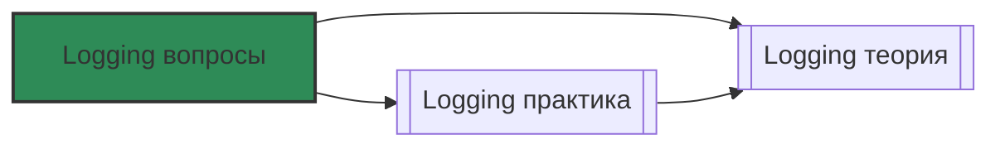

# 📄 Файл: `Logging вопросы.md`

tags: [logging, devops, elk, elasticsearch, logstash, kibana, loki, grafana, fluentd, fluent-bit, interview, questions, self-assessment]
aliases: [logging-questions, log-management-questions]
created: 2026-05-09
---

# ❓ Logging Stack: Вопросы и самопроверка

> [!INFO] Структура
> Вопросы разделены по уровням: 🟢 Junior → 🟡 Middle → 🔴 Senior.  
> Каждый вопрос содержит: формулировку, развёрнутый ответ и пояснение, почему это важно для DevOps.

📋 [[#🗂️ Оглавление для навигации|Оглавление]] | [[#🧪 Чек-лист готовности|Чек-лист]] | [[#🔗 Связь с другими файлами|Связи]]

---

## 🗂️ Оглавление для навигации

### 🟢 Junior (базовые концепции, стандарты, архитектура стеков)
- [[#1. В чём разница между ELK и Loki? Когда что выбирать?|1. ELK vs Loki]]
- [[#2. Что такое структурированные логи и почему они важны?|2. Structured logging]]
- [[#3. Как работает 12-Factor App в контексте логирования?|3. 12-Factor logs]]
- [[#4. Какие уровни логирования существуют и когда их использовать?|4. Log levels]]
- [[#5. Что такое Log Rotation и зачем он нужен?|5. Log rotation]]
- [[#6. Как Docker/Kubernetes управляют логами контейнеров?|6. Container logging]]
- [[#7. Что делают агенты сбора логов (Fluent Bit, Filebeat)?|7. Log shippers]]
- [[#8. В чём разница между Logstash и Fluent Bit?|8. Agent comparison]]
- [[#9. Что такое Cardinality и почему это проблема в Loki?|9. Cardinality]]
- [[#10. Как настроить базовый поиск в Kibana и Grafana?|10. Basic search]]

### 🟡 Middle (обработка, парсинг, запросы, оптимизация)
- [[#11. ⭐ Как работает архитектура Loki (Index + Chunks)?|11. Loki internals ⭐]]
- [[#12. Что такое Grok и как парсить неструктурированные логи?|12. Grok parsing]]
- [[#13. Как написать запрос LogQL для агрегации ошибок?|13. LogQL aggregation]]
- [[#14. Что такое ILM в Elasticsearch и как настроить Hot/Warm/Cold?|14. ES ILM]]
- [[#15. Как реализовать алертинг по логам без ложных срабатываний?|15. Log alerting]]
- [[#16. Что такое Disk Buffer в агентах и зачем он нужен?|16. Disk buffering]]
- [[#17. Как обогащать логи метаданными (Enrichment)?|17. Log enrichment]]
- [[#18. Как фильтровать логи на стороне агента (Drop/Allow)?|18. Agent filtering]]
- [[#19. В чём разница между KQL и Lucene синтаксисом?|19. KQL vs Lucene]]
- [[#20. Как связать логи с трейсами (TraceID)?|20. Logs-Traces correlation]]

### 🔴 Senior (масштабирование, безопасность, экономика)
- [[#21. ⭐ Как спроектировать HA архитектуру для Loki Distributed?|21. Loki HA ⭐]]
- [[#22. Как работает шардирование и репликация в Elasticsearch?|22. ES clustering]]
- [[#23. Как реализовать Multi-tenancy в стеке логирования?|23. Multi-tenancy]]
- [[#24. Что такое Sampling логов и когда его применять?|24. Log sampling]]
- [[#25. Как маскировать PII данные в логах на лету?|25. PII masking]]
- [[#26. Как работает Backpressure и что делать при перегрузке?|26. Backpressure]]
- [[#27. Как оптимизировать стоимость хранения (Tiered Storage)?|27. Cost optimization]]
- [[#28. Как OpenTelemetry меняет подход к сбору логов?|28. OTel logging]]
- [[#29. Как расследовать инцидент, если логи "молчат"?|29. Silent incident]]
- [[#30. ⭐ Как спроектировать логирование для High-Load (>1TB/день)?|30. High-load architecture ⭐]]

---

## 🟢 Junior (базовые концепции, стандарты, архитектура стеков)

### 1. В чём разница между ELK и Loki? Когда что выбирать?

**Ответ**:
```
ELK (Elasticsearch, Logstash, Kibana):
• Индексирует всё содержимое лога (полнотекстовый поиск)
• Тяжёлый, требует много RAM/CPU/диска
• Мощная аналитика, SIEM, сложные агрегации
• Выбирай, когда: нужен глубокий анализ текста, аудит, безопасность, есть ресурсы

Loki (Grafana):
• Индексирует только метки (Labels), текст хранится в сжатых чанках (S3)
• Лёгкий, дёшевый, масштабируется горизонтально
• Поиск через grep по чанкам (медленнее, но достаточно для отладки)
• Выбирай, когда: нужно хранить много логов экономно, фокус на K8s/метриках, бюджет ограничен
```

**DevOps-контекст**: Loki стал стандартом в K8s-экосистеме из-за цены и простоты. ELK остаётся королём enterprise-аналитики и compliance.

[[#🗂️ Оглавление для навигации|↑ К оглавлению]]

### 2. Что такое структурированные логи и почему они важны?

**Ответ**:
```
Структурированные логи — это логи в машиночитаемом формате (обычно JSON), где каждое поле выделено отдельно.

Пример:
 Текст: "User 123 failed login from 10.0.0.5 at 10:00"
✅ JSON: {"timestamp":"2024-05-09T10:00:00Z","level":"ERROR","user_id":123,"ip":"10.0.0.5","message":"Login failed"}

Преимущества:
• Автоматический парсинг без Regex
• Быстрая фильтрация по полям (user_id=123)
• Лёгкая агрегация и построение метрик
• Совместимость с современными стеками (Loki, OTel)
```

**DevOps-контекст**: Текст требует Grok/Regex, что ломается при изменении формата сообщения. JSON стабилен и экономит CPU на парсинге.

[[#🗂️ Оглавление для навигации|↑ К оглавлению]]

### 3. Как работает 12-Factor App в контексте логирования?

**Ответ**:
```
Правило 11 из методологии 12-Factor: "Логи — это поток событий".
• Приложение НЕ должно управлять файлами логов, ротацией или хранилищем.
• Приложение пишет логи только в stdout/stderr.
• Оркестратор (Docker/K8s) перехватывает потоки и направляет их в централизованный сборщик.

Почему так:
• Чистота кода: нет зависимостей от ФС
• Надежность: логи не теряются при пересоздании пода
• Единообразие: один механизм сбора для всех сервисов
```

**DevOps-контекст**: Если приложение пишет логи в файл внутри контейнера, они исчезнут при рестарте. Всегда используйте stdout + DaemonSet/агент.

[[#🗂️ Оглавление для навигации|↑ К оглавлению]]

### 4. Какие уровни логирования существуют и когда их использовать?

**Ответ**:
```
• DEBUG: Детали для разработчиков. Выключен в проде.
• INFO: Нормальная работа (старт, запросы, завершения). Для аудита и общей картины.
• WARN: Предупреждения (замедление, ретраи, nearing limits). Требует внимания.
• ERROR: Ошибки операций (500, исключения, сбои интеграций). Требует расследования.
• FATAL/CRITICAL: Невосстановимые сбои (OOM, missing config). Обычно останавливает процесс.

Правило: В production ставь INFO или WARN. DEBUG оставляй для staging/dev.
```

**DevOps-контекст**: Неправильный уровень = либо шум в алертах, либо слепота при инциденте. Настраивай через ENV-переменные.

[[#🗂️ Оглавление для навигации|↑ К оглавлению]]

### 5. Что такое Log Rotation и зачем он нужен?

**Ответ**:
```
Механизм автоматического разделения лог-файла на части и удаления старых.
• Когда файл достигает лимита (напр. 100MB) → переименовывается → сжимается → создаётся новый.
• Старые файлы удаляются по TTL или количеству.

Инструменты:
• Linux: logrotate
• Docker: log-opts (max-size, max-file)
• K8s: kubelet управляет ротацией на ноде

Зачем: Без ротации один файл забьёт диск → падение ноды/контейнера.
```

**DevOps-контекст**: В K8s ротация настраивается на уровне Container Runtime. Если приложение пишет в файл, оно должно обрабатывать сигнал HUP для переоткрытия файла.

[[#🗂️ Оглавление для навигации|↑ К оглавлению]]

### 6. Как Docker/Kubernetes управляют логами контейнеров?

**Ответ**:
```
Docker:
• По умолчанию: json-file driver → /var/lib/docker/containers/<id>/<id>-json.log
• Можно сменить драйвер: journald, syslog, fluentd, awslogs
• Ротация настраивается в daemon.json

Kubernetes:
• CRI (Containerd/cri-o) пишет логи в /var/log/pods/<namespace>_<pod>_<uid>/<container>/<run>.log
• kubelet ротирует логи (по умолчанию 10MB × 5 файлов)
• Для сбора нужен DaemonSet (Fluent Bit/Promtail), монтирующий /var/log/pods
```

**DevOps-контекст**: Логи живут на ноде. Если нода упала или под удалён — логи пропадут без централизованного сбора. Всегда настраивай агент.

[[#🗂️ Оглавление для навигации|↑ К оглавлению]]

### 7. Что делают агенты сбора логов (Fluent Bit, Filebeat)?

**Ответ**:
```
Агенты (Shippers) работают на каждом хосте/ноде:
1. Читают логи из источников (файлы, stdout, journald, TCP)
2. Парсят и обогащают (добавляют hostname, namespace, парсят JSON)
3. Фильтруют (дропают DEBUG, маскируют PII)
4. Буферизуют (память/диск)
5. Отправляют в хранилище (Loki, ES, Kafka, S3)

Разница:
• Fluent Bit: C, лёгкий (<5MB RAM), идеален для K8s DaemonSet
• Filebeat: Go, тяжелее, тесная интеграция с Elastic
```

**DevOps-контекст**: Агент — первый рубеж защиты. Неправильная настройка = потеря логов или перегрузка хранилища.

[[#🗂️ Оглавление для навигации|↑ К оглавлению]]

### 8. В чём разница между Logstash и Fluent Bit?

**Ответ**:
```
Logstash:
• Написан на Java, тяжелый (500MB+ RAM)
• Мощный парсинг (Grok, Ruby фильтры)
• Обычно развёртывается как отдельный сервис (не на каждой ноде)
• Часть классического ELK пайплайна

Fluent Bit:
• Написан на C, лёгкий (1-5MB RAM)
• Быстрый, низкое потребление CPU
• Разворачивается как DaemonSet на КАЖДОЙ ноде
• Современный стандарт для K8s + Loki

Правило: Fluent Bit на нодах → собирает и шлёт в Loki/ES. Logstash → только если нужна сложная трансформация перед ES.
```

**DevOps-контекст**: Не ставь Logstash на каждую ноду K8s — это сожрёт ресурсы. Используй Fluent Bit для сбора, Logstash для enrichment в централизованном виде.

[[#🗂️ Оглавление для навигации|↑ К оглавлению]]

### 9. Что такое Cardinality и почему это проблема в Loki?

**Ответ**:
```
Cardinality (кардинальность) — количество уникальных комбинаций меток (Labels).
В Loki каждая уникальная комбинация создаёт отдельную серию в индексе.

 Высокая кардинальность (ОПАСНО):
{user_id="123", request_id="abc", pod_ip="10.0.0.5"}
→ 1 млн пользователей = 1 млн серий → индекс разрастается → OOM → падение Loki

✅ Низкая кардинальность (ПРАВИЛЬНО):
{app="api", level="error", method="POST"}
→ Десятки комбинаций. Уникальные ID оставляем в ТЕЛЕ лога, не в метках.
```

**DevOps-контекст**: Это правило №1 при работе с Loki. Никогда не используй уникальные идентификаторы в Labels. Используй их для фильтрации внутри запроса (`|= "user_id=123"`).

[[#🗂️ Оглавление для навигации|↑ К оглавлению]]

### 10. Как настроить базовый поиск в Kibana и Grafana?

**Ответ**:
```
Kibana (KQL):
• status:500 AND service:auth
• message:"timeout"
• response_time:[500 TO 1000]
• request:/api/*

Grafana (LogQL):
• {app="nginx", level="error"}
• {job="api"} |= "exception"
• {namespace="prod"} | json | status >= 500

Общее:
• Используй временные диапазоны (Last 1h, 24h)
• Сохраняй частые запросы (Saved Queries)
• Включай "Show log details" для JSON
```

**DevOps-контекст**: Умение быстро писать запросы критично при инцидентах. Тренируйся на тестовых данных.

[[#🗂️ Оглавление для навигации|↑ К оглавлению]]

---

##  Middle (обработка, парсинг, запросы, оптимизация)

### 11. ⭐ Как работает архитектура Loki (Index + Chunks)?

**Ответ**:
```
Loki не индексирует текст. Он индексирует только метки (Labels).

Компоненты:
1. Index (Cassandra/Boltdb/DynamoDB):
   • Хранит маппинг: Labels → список Chunks
   • Пример: {app="api", level="error"} → [chunk_A, chunk_B]

2. Chunks (S3/MinIO/GCS):
   • Сжатые блоки (gzip/snappy) с самими логами
   • Содержат текст, временные метки, поля

Процесс запроса:
1. Querier ищет нужные чанки в Index по Labels
2. Скачивает чанки из Object Storage
3. Распаковывает и применяет grep-фильтр к тексту
4. Возвращает результат

Почему это дёшево: Object Storage дешевле дисков, индекс маленький, сжатие высокое.
```

**DevOps-контекст**: Понимание архитектуры помогает оптимизировать запросы: сначала фильтруй по Labels (быстро), потом по тексту (медленнее).

[[#🗂️ Оглавление для навигации|↑ К оглавлению]]

### 12. Что такое Grok и как парсить неструктурированные логи?

**Ответ**:
```
Grok — механизм парсинга текста через Regex-шаблоны (используется в Logstash/Fluent Bit).

Синтаксис: %{PATTERN:field_name}
Пример лога: 10.0.0.1 - - [10/May/2024:12:00:00 +0000] "GET /api HTTP/1.1" 200 1234

Grok-паттерн:
%{IP:client_ip} %{USER:ident} %{USER:auth} \[%{HTTPDATE:timestamp}\] "%{WORD:method} %{URIPATH:request} %{NUMBER:http_version}" %{NUMBER:status} %{NUMBER:bytes}

Результат → JSON с полями client_ip, method, status, bytes.

Оптимизация:
• Используй готовые паттерны (grok-patterns)
• Избегай вложенных regex
• Тестируй в Grok Debugger (Kibana)
```

**DevOps-контекст**: Парсинг на лету грузит CPU. Если возможно, переведи приложение на JSON логи — это сэкономит ресурсы агентов.

[[#🗂️ Оглавление для навигации|↑ К оглавлению]]

### 13. Как написать запрос LogQL для агрегации ошибок?

**Ответ**:
```
Задача: Посчитать количество 500 ошибок за 5 минут.

LogQL:
sum(count_over_time({job="api", level="error"} |= "500" [5m]))

Разбор:
• {job="api", level="error"} → выбираем поток по меткам
• |= "500" → фильтруем текст (grep)
• count_over_time(... [5m]) → считаем количество строк за окно
• sum() → суммируем по всем инстансам

Для графика в Grafana:
rate({job="api"} |= "error" [1m]) → показывает скорость появления ошибок в секунду
```

**DevOps-контекст**: LogQL позволяет строить метрики из логов (Log-to-Metric). Используй это, если нет нативных метрик от приложения.

[[#🗂️ Оглавление для навигации|↑ К оглавлению]]

### 14. Что такое ILM в Elasticsearch и как настроить Hot/Warm/Cold?

**Ответ**:
```
ILM (Index Lifecycle Management) — автоматическое управление жизненным циклом индексов.

Фазы:
1. Hot (SSD): 0-2 дня. Активная запись, быстрый поиск.
2. Warm (HDD): 2-14 дней. Read-only, сжатие (force_merge), шарды объединяются.
3. Cold (Archive): 14-90 дней. Заморожены, медленный поиск, дешевое хранилище.
4. Delete: >90 дней. Удаление.

Настройка (JSON Policy):
PUT _ilm/policy/logs_policy { "policy": { "phases": { "hot": { "actions": { "rollover": { "max_size": "50GB" } } }, "warm": { "min_age": "2d", "actions": { "shrink": { "number_of_shards": 1 } } }, "delete": { "min_age": "90d", "actions": { "delete": {} } } } } }

Применяется через Index Template.
```

**DevOps-контекст**: Без ILM Elasticsearch быстро съест дорогие SSD. Настрой политику под бюджет и compliance-требования.

[[#🗂️ Оглавление для навигации|↑ К оглавлению]]

### 15. Как реализовать алертинг по логам без ложных срабатываний?

**Ответ**:
```
Проблема: Алерт на каждую ошибку = Alert Fatigue.

Решения:
1. Порог + время: sum(count_over_time({level="error"}[5m])) > 10 for 5m
2. Рост (Spike): rate({level="error"}[5m]) > rate({level="error"}[5m] offset 1h) * 2
3. Исключение шума: != "healthcheck" AND != "timeout_retry"
4. Группировка: alert по service/namespace, не по pod_id

Правило: Алерть на аномалии или критические паттерны (PANIC, OOM), а не на отдельные события.
```

**DevOps-контекст**: Логи — источник truth для алертов, когда метрик нет. Но настраивай carefully, иначе будешь получать уведомления каждую ночь.

[[#🗂️ Оглавление для навигации|↑ К оглавлению]]

### 16. Что такое Disk Buffer в агентах и зачем он нужен?

**Ответ**:
```
Disk Buffer — временное хранение логов на диске агента при недоступности хранилища.

Fluent Bit настройка:
[SERVICE]
    storage.path              /var/log/flb-storage/
    storage.sync              normal
    storage.backlog.mem_limit 50M

Зачем:
• Сеть упала / Loki перезагружается → агент не теряет логи
• Пишет на диск, при восстановлении отправляет
• Гарантирует доставку (At-least-once)

Без буфера: логи в памяти теряются при рестарте агента или обрыве сети.
```

**DevOps-контекст**: В K8s это критично. Всегда включай storage.path и следи за местом на диске ноды.

[[#🗂️ Оглавление для навигации|↑ К оглавлению]]

### 17. Как обогащать логи метаданными (Enrichment)?

**Ответ**:
```
Enrichment — добавление контекста к логам для упрощения поиска.

Что добавлять:
• hostname, node_name, region, environment
• k8s_namespace, pod_name, container_name
• service_version, commit_hash

Как:
• Fluent Bit Filter kubernetes: автоматически подтягивает метки пода
• Fluent Bit record_modifier: добавляет статичные поля
• Приложение: пишет env vars в JSON при старте

Пример:
"Error: DB failed" → бесполезно
"Error: DB failed [ns=prod, pod=api-abc, host=node-05, ver=2.1.0]" → сразу понятно где и что
```

**DevOps-контекст**: Логи без контекста = гадание на кофейной гуще. Enrichment должен быть стандартом в пайплайне.

[[#🗂️ Оглавление для навигации|↑ К оглавлению]]

### 18. Как фильтровать логи на стороне агента (Drop/Allow)?

**Ответ**:
```
Фильтрация на агенте экономит сеть, CPU и место в хранилище.

Fluent Bit (grep):
[FILTER]
    Name   grep
    Match  *
    Exclude level debug      # Исключить DEBUG
    Exclude message healthcheck # Исключить health-чеки

Fluent Bit (Lua для сложной логики):
function drop_old(tag, timestamp, record)
    if record["level"] == "DEBUG" or record["age"] > 86400 then
        return -1, 0, nil  # -1 = drop
    end
    return 1, timestamp, record
end

Правило: Дропай DEBUG в проде. Дропай шумные повторяющиеся логи. Никогда не дропай ERROR/FATAL.
```

**DevOps-контекст**: Дешевле отфильтровать на ноде, чем хранить в S3. Но будь осторожен: дропнутые логи не восстановить.

[[#️ Оглавление для навигации|↑ К оглавлению]]

### 19. В чём разница между KQL и Lucene синтаксисом?

**Ответ**:
```
Lucene (старый):
• status:500 AND service:auth
• message:error*
• response_time:[500 TO 1000]
• Требует экранирования спецсимволов, строгий синтаксис

KQL (новый, дефолт в Kibana):
• status: 500 and service.name: "auth"
• message: "error"
• Более человеко-читаемый, автодополнение, быстрее парсится
• Поддерживает вложенные поля: kubernetes.namespace: "prod"

Рекомендация: Используй KQL. Lucene оставлен для обратной совместимости.
```

**DevOps-контекст**: KQL упрощает жизнь SRE. Знай оба, но пиши на KQL.

[[#🗂️ Оглавление для навигации|↑ К оглавлению]]

### 20. Как связать логи с трейсами (TraceID)?

**Ответ**:
```
Корреляция Logs ↔ Traces ускоряет расследование в 10 раз.

Шаги:
1. Приложение генерирует TraceID (OpenTelemetry SDK)
2. TraceID пишется в каждый лог: {"trace_id": "abc-123", "message": "..."}
3. В Grafana/Loki настраивается Derived Field:
   "matcherRegex": "trace_id=(\\w+)",
   "url": "${__value.raw}",
   "datasourceUid": "tempo"
4. В логе появляется кликабельная ссылка → открывает трейс в Tempo/Jaeger

Результат: Видишь ошибку в логе → кликаешь → видишь весь путь запроса через микросервисы.
```

**DevOps-контекст**: Без TraceID в микросервисах ты слеп. Внедряй OTel и Derived Fields сразу.

[[#🗂️ Оглавление для навигации|↑ К оглавлению]]

---

## 🔴 Senior (масштабирование, безопасность, экономика)

### 21. ⭐ Как спроектировать HA архитектуру для Loki Distributed?

**Ответ**:
```
Single-binary Loki не подходит для продакшена >100 нод.

Distributed Mode (K8s Helm):
• Distributor (Deployment): Принимает логи, валидирует, rate-limit. Stateless.
• Ingester (StatefulSet): Буферизует, пишет WAL, сжимает в чанки. Репликация WAL между инстансами.
• Querier (Deployment): Читает из хранилища и Ingester. Stateless.
• Compactor (StatefulSet, 1 реплика): Сливает чанки, удаляет старые, управляет retention.
• Index Gateway: Ускоряет запросы по индексу.

Отказоустойчивость:
• Данные в S3 (независимо от нод)
• WAL реплицируется между Ingester
• При падении Ingester другой поднимает WAL и продолжает
```

**DevOps-контекст**: Используй `deploymentMode: SimpleScalable` для средних нагрузок, `Distributed` для enterprise. Мониторь WAL replication lag.

[[#🗂️ Оглавление для навигации|↑ К оглавлению]]

### 22. Как работает шардирование и репликация в Elasticsearch?

**Ответ**:
```
Shards:
• Индекс разбивается на Primary Shards (количество задаётся при создании, нельзя менять)
• Позволяет параллельную запись/чтение
• Правило: 1 shard ≈ 20-50GB данных. Слишком много мелких = overhead.

Replicas:
• Копии Primary Shards на других нодах
• Обеспечивают HA и ускоряют чтение
• Можно менять динамически

Node Roles:
• Master: управление кластером (3 ноды для кворума)
• Data: хранение шардов (масштабируется горизонтально)
• Ingest/Coordinating: обработка запросов

Восстановление: При падении ноды кластер перераспределяет реплики → новые primary.
```

**DevOps-контекст**: Планируй шарды заранее. Избегай "too many small shards". Настрой shard allocation awareness (zone/rack) для HA.

[[#🗂️ Оглавление для навигации|↑ К оглавлению]]

### 23. Как реализовать Multi-tenancy в стеке логирования?

**Ответ**:
```
Изоляция данных команд/клиентов в одном кластере.

Loki:
• Заголовок X-Scope-OrgID при пуше логов
• Команда A шлёт OrgID=team-a, видит только свои логи
• Админ видит всё через all-tenants query

Elasticsearch:
• Разные индексы: logs-team-a-*, logs-team-b-*
• Kibana Spaces + RBAC роли
• Document/Field-level security (ограничение по полям)

Безопасность:
• TLS между агентом и хранилищем
• Аутентификация через OAuth2/OIDC или API Keys
```

**DevOps-контекст**: Критично для SaaS и крупных компаний. Предотвращает утечки между департаментами и упрощает биллинг.

[[#🗂️ Оглавление для навигации|↑ К оглавлению]]

### 24. Что такое Sampling логов и когда его применять?

**Ответ**:
```
Sampling — сохранение не всех логов, а только части или определённых типов.

Стратегии:
1. Level-based: Дроп DEBUG в проде, хранить только INFO+
2. Probabilistic: 100% ошибок, 1% успешных запросов
3. Dynamic: Если ошибок нет → 1%, если рост ошибок → 100% (для расследования)
4. Trace-aware: Не сэмплировать логи, если есть активный трейс (чтобы не ломать цепочки)

Инструменты:
• Fluent Bit Lua filter
• OTel Processor (probabilistic sampler)
• Loki per-stream retention

Экономия: До 90% места и стоимости.
```

**DevOps-контекст**: Sampling должен быть детерминированным для трейсов. Для обычных логов — рандомный сэмплинг безопасен. Никогда не сэмплируй ERROR/FATAL.

[[#🗂️ Оглавление для навигации|↑ К оглавлению]]

### 25. Как маскировать PII данные в логах на лету?

**Ответ**:
```
PII (Personal Identifiable Information): пароли, карты, email, телефоны.

Уровни защиты:
1. Приложение: Не писать чувствительные поля в логи (лучший вариант)
2. Агент (Fluent Bit Lua):
   function mask_pii(tag, timestamp, record)
       if record["message"] then
           record["message"] = string.gsub(record["message"], "%d%d%d%d%-?%d%d%d%d%-?%d%d%d%d%-?%d%d%d%d", "****-****-****-****")
       end
       return 1, timestamp, record
   end
3. Logstash mutate: gsub для regex-замены
4. Хранилище: Field-level encryption (ES), S3 SSE-KMS

Compliance: GDPR, PCI DSS требуют маскирования или удаления PII.
```

**DevOps-контекст**: Утечка логов = утечка данных. Маскирование на агенте — последний рубеж. Аудит логов на PII должен быть регулярным.

[[#🗂️ Оглавление для навигации|↑ К оглавлению]]

### 26. Как работает Backpressure и что делать при перегрузке?

**Ответ**:
```
Backpressure — механизм защиты, когда хранилище не успевает принимать логи.

Сценарий: Очередь агента переполнена.

Стратегии:
1. Drop Oldest: Удалять старые логи из буфера (потеря данных, но система жива)
2. Drop Newest: Блокировать приём новых логов (риск для приложения)
3. Slow Down: Сообщать источнику "подожди" (TCP backpressure)
4. Spill to Disk: Писать буфер на диск (медленно, но надежно)

Мониторинг:
• Fluent Bit: metrics flb_output_retries_failed, flb_storage_backlog_size
• Алерт при росте backlog > порога
```

**DevOps-контекст**: Лучше потерять DEBUG логи, чем уронить приложение или забить диск. Настрой drop policy и мониторинг очереди.

[[#🗂️ Оглавление для навигации|↑ К оглавлению]]

### 27. Как оптимизировать стоимость хранения (Tiered Storage)?

**Ответ**:
```
80% запросов к логам идут за последние 24 часа. Нет смысла хранить всё на SSD.

Tiered Architecture:
• Hot (NVMe SSD): 0-3 дня. Быстрый доступ, активная запись.
• Warm (HDD/Object): 3-14 дней. Read-only, сжатие, медленнее.
• Cold (S3 Glacier/Deep Archive): 14+ дней. Дешево, восстановление часы. Для аудита.

Реализация:
• ES: ILM policy + Warm/Cold nodes
• Loki: retention_period + Compactor + Object Storage классы
• Автоматическое перемещение по TTL

Экономия: До 70% на инфраструктуре хранения.
```

**DevOps-контекст**: Согласуй retention с бизнесом и compliance. Автоматизируй переход между тирами. Тестируй восстановление из Cold.

[[#🗂️ Оглавление для навигации|↑ К оглавлению]]

### 28. Как OpenTelemetry меняет подход к сбору логов?

**Ответ**:
```
OTel — единый стандарт телеметрии от CNCF.

OTel Collector:
• Принимает логи в любом формате (Fluent Bit, Filebeat, app SDK)
• Обрабатывает: фильтрация, маскирование, enrichment, сэмплинг
• Отправляет в любой бэкенд (Loki, ES, CloudWatch, Datadog)

Преимущества:
• Vendor lock-in reduction: легко сменить бэкенд без переписывания агентов
• Единый агент для Logs, Metrics, Traces
• Богатая экосистема процессоров (transform, filter, batch)

Будущее: Индустрия движется к OTel. Fluent Bit и другие агенты экспортируют в OTLP формат.
```

**DevOps-контекст**: Внедряй OTel Collector как централизованный шлюз. Это упростит миграцию и стандартизирует пайплайн.

[[#🗂️ Оглавление для навигации|↑ К оглавлению]]

### 29. Как расследовать инцидент, если логи "молчат"?

**Ответ**:
```
Ситуация: Алерт сработал, но в логах нет ошибок.

Шаги:
1. Проверь метрики: CPU, Memory, Network, Disk I/O (возможно, ресурсное истощение)
2. Проверь трейсы: Где задержка? Возможно, тихий таймаут или deadlock
3. Проверь системные логи: dmesg, journald, kubelet (OOM Killer, node pressure)
4. Проверь конфигурацию: Неправильный уровень логирования? Фильтр дропает всё?
5. Проверь сеть/DNS: Разрыв связи между сервисами без генерации логов
6. Восстанови предыдущую версию: Если деплой сломал логи, откати и смотри diff

Правило: Логи — не единственный источник truth. Используй Metrics + Traces + System logs.
```

**DevOps-контекст**: "Тихие" сбои самые опасные. Настрой алерты на аномалии метрик, а не только на текст логов.

[[#🗂️ Оглавление для навигации|↑ К оглавлению]]

### 30. ⭐ Как спроектировать логирование для High-Load (>1TB/день)?

**Ответ**:
```
Архитектура для Enterprise/High-Load:

1. Агенты (Fluent Bit) на нодах:
   • Сбор, парсинг, дроп шума, маскирование PII
   • Локальный Disk Buffer

2. Буферный слой (Kafka/Redpanda):
   • Агенты шлют в Kafka (топики по сервисам)
   • Kafka сглаживает пики, обеспечивает replay
   • Отвязывает агенты от доступности хранилища

3. Обработка (OTel Collector / Logstash):
   • Читают из Kafka
   • Обогащение, трансформация, сэмплинг
   • Пишут в хранилище

4. Хранилище (Loki Distributed / ES Cluster):
   • Чанки в S3 (дешево, бесконечно масштабируется)
   • Индекс в Cassandra/DynamoDB
   • ILM / Retention policy

5. Мониторинг пайплайна:
   • Lag Kafka consumer
   • Fluent Bit buffer size
   • Loki ingester memory/WAL
   • Алерты на задержку доставки > 5 мин

Преимущества: Надежность, масштабируемость, replay, изоляция сбоев.
```

**DevOps-контекст**: Kafka — стандарт для high-load логирования. Без буферного слоя при падении хранилища ты потеряешь терабайты данных. Проектируй с запасом.

[[#🗂️ Оглавление для навигации|↑ К оглавлению]]

---

## 🧪 Чек-лист готовности

- [ ] Могу объяснить разницу между ELK и Loki и обосновать выбор под задачу
- [ ] Понимаю, почему Cardinality критична для Loki и как её контролировать
- [ ] Знаю, как настроить сбор логов в K8s через DaemonSet
- [ ] Могу написать LogQL/KQL запрос для поиска и агрегации
- [ ] Понимаю роль Disk Buffer и Backpressure в пайплайне
- [ ] Знаю, как связать логи с трейсами через TraceID
- [ ] Могу настроить ILM/Retention для оптимизации стоимости
- [ ] Понимаю принципы безопасности (PII masking, Multi-tenancy)
- [ ] Знаю архитектуру OTel Collector и его преимущества
- [ ] Могу спроектировать отказоустойчивый пайплайн для High-Load

> [!TIP] Практика
> Для закрепления:
> 1. Ответь на 10 случайных вопросов без подглядывания
> 2. Объясни коллеге концепцию Cardinality и почему это "убийца" Loki
> 3. Проведи mock-интервью: задавайте вопросы друг другу
> 4. Напиши свои вопросы по реальному опыту и добавь в файл
> 5. Вернись к вопросам через неделю — проверь, что запомнилось

---

## 🔗 Связь с другими файлами

> [!TIP] Следующие шаги
> После самопроверки:
> - [[Logging практика]]: отработка сценариев на практике
> - [[Logging теория]]: глубокое понимание архитектуры стеков
> - [[Monitoring практика]]: Prometheus, Alertmanager, Grafana
> - [[Kubernetes практика]]: DaemonSet, Sidecar, CRI
> - [[Cloud практика]]: CloudWatch Logs, S3 Lifecycle, OpenSearch



[[#🗂️ Оглавление для навигации|↑ К оглавлению]]

---

**Структура проекта**:
```
DevOps_start-main
├── 00_Fundamentals
│   ├── Linux
│   ├── Networking
│   └── Scripting
├── 01_Version_Control
│   └── Git
── 02_Containers
│   ├── Docker
│   └── Kubernetes
├── 03_Infrastructure
│   ├── Terraform
│   ├── Ansible
│   └── AWS_Cloud
├── 04_CI_CD
│   ├── CI_CD
│   └── GitOps
├── 05_Observability
│   ├── Prometheus
│   ├── Grafana
│   ├── Logging
│   │   ├── [[Logging практика]]
│   │   ├── [[Logging теория]]
│   │   └── [[Logging вопросы]] ← этот файл
│   ├── Loki
│   └── Tempo
├── 06_Databases
├── 07_Security
├── 08_Advanced
└── Roadmap
```