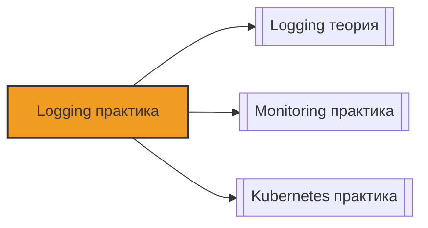

# 📄 Файл: `Logging практика.md`

tags: [logging, devops, elk, elasticsearch, logstash, kibana, loki, grafana, fluentd, fluent-bit, practice, hands-on]
aliases: [logging-practice, log-management-practice]
created: 2026-05-09
---

# 🛠️ Logging Stack: Практика

> [!INFO] Структура
> Практические задания разделены по уровням: 🟢 Junior → 🟡 Middle → 🔴 Senior.  
> Каждое задание содержит: задачу, конфигурацию/код, объяснение и DevOps-контекст.

📋 [[#🗂️ Оглавление для навигации|Оглавление]] | [[#🧪 Чек-лист выполнения|Чек-лист]] | [[#🔗 Связь с другими файлами|Связи]]

---

## 🗂️ Оглавление для навигации

### 🟢 Junior (Установка, базовый сбор, простые запросы)
- [[#1. Развертывание ELK Stack через Docker Compose|1. ELK Docker Compose]]
- [[#2. Базовый поиск и фильтрация в Kibana|2. Kibana Discovery]]
- [[#3. Развертывание Loki + Promtail через Docker|3. Loki Setup]]
- [[#4. Базовые запросы LogQL (аналог grep/SQL)|4. Basic LogQL]]
- [[#5. Установка и настройка Fluent Bit (сбор логов с файла)|5. Fluent Bit Basics]]
- [[#6. Отправка логов из приложения в stdout (Docker logging driver)|6. Docker Logging]]
- [[#7. Просмотр логов подов в Kubernetes (kubectl logs)|7. K8s Basic Logs]]
- [[#8. Structured Logging: зачем и как писать JSON логи|8. JSON Logging]]

###  Middle (Парсинг, обогащение, алертинг, интеграция)
- [[#9. Настройка Logstash Pipeline: ввод, фильтр (Grok), вывод|9. Logstash Grok]]
- [[#10. Парсинг логов в Fluent Bit (Regex и Parser)|10. Fluent Bit Parsing]]
- [[#11. Отправка логов из Fluent Bit в Loki|11. Fluent Bit to Loki]]
- [[#12. Labels в Loki: Cardinality и лучшие практики|12. Loki Labels]]
- [[#13. Визуализация логов в Grafana (Loki datasource)|13. Grafana Loki Viz]]
- [[#14. Настройка алертинга по логам в Grafana/Loki|14. Log Alerting]]
- [[#15. enrich логов: добавление metadata (hostname, namespace)|15. Log Enrichment]]
- [[#16. Log rotation и управление дисковым пространством|16. Log Rotation]]

### 🔴 Senior (Архитектура, оптимизация, масштабирование)
- [[#17. Index Lifecycle Management (ILM) в Elasticsearch|17. ELK ILM]]
- [[#18. Сложные запросы LogQL: aggregations, rate, unwrap|18. Advanced LogQL]]
- [[#19. High Availability архитектура Loki (Distributed mode)|19. Loki HA]]
- [[#20. Оптимизация производительности Fluent Bit (Buffers, Memory)|20. Fluent Bit Tuning]]
- [[#21. Sampling логов: снижение затрат на хранение|21. Log Sampling]]
- [[#22. Multi-tenancy в стеке логирования|22. Multi-tenancy]]
- [[#23. Tracing + Logging + Metrics: корреляция данных|23. Observability Trio]]
- [[#24. Security: маскирование чувствительных данных (PII)|24. PII Masking]]
- [[#25. Migration: перенос логов из S3/Glacier в hot storage|25. Log Archival]]
- [[#26. Debugging: анализ логов при инциденте (Post-mortem)|26. Incident Debugging]]

---

## 🟢 Junior (Установка, базовый сбор, простые запросы)

### 1. Развертывание ELK Stack через Docker Compose

**Задача**: Запустить Elasticsearch, Logstash и Kibana локально для тестов.

**Решение**:
Создай файл `docker-compose.yml`:
```yaml
version: '3.8'
services:
  elasticsearch:
    image: docker.elastic.co/elasticsearch/elasticsearch:8.11.0
    environment:
      - discovery.type=single-node
      - xpack.security.enabled=false  # Для тестов отключаем безопасность
      - "ES_JAVA_OPTS=-Xms512m -Xmx512m"
    ports:
      - "9200:9200"
    volumes:
      - es_data:/usr/share/elasticsearch/data

  logstash:
    image: docker.elastic.co/logstash/logstash:8.11.0
    volumes:
      - ./logstash.conf:/usr/share/logstash/pipeline/logstash.conf
    depends_on:
      - elasticsearch

  kibana:
    image: docker.elastic.co/kibana/kibana:8.11.0
    ports:
      - "5601:5601"
    depends_on:
      - elasticsearch

volumes:
  es_
```

Создай `logstash.conf`:
```conf
input {
  tcp {
    port => 5000
    codec => json
  }
}

output {
  elasticsearch {
    hosts => ["http://elasticsearch:9200"]
    index => "app-logs-%{+YYYY.MM.dd}"
  }
}
```

**Запуск**:
```bash
docker-compose up -d
# Проверка
curl http://localhost:9200
# Отправка тестового лога
echo '{"message": "Hello ELK", "level": "info"}' | nc localhost 5000
```

**DevOps-контекст**:
- Kibana доступна на `http://localhost:5601`.
- В production безопасность (`xpack.security.enabled`) всегда включена.
- Logstash тяжелый, для простых задач часто хватает Fluent Bit.

[[#🗂️ Оглавление для навигации|↑ К оглавлению]]

### 2. Базовый поиск и фильтрация в Kibana

**Задача**: Найти логи приложения за последний час с определенным уровнем.

**Решение**:
1. Открой Kibana → **Discover**.
2. Создай Data View (ранее Index Pattern): `app-logs-*`.
3. Выбери временной диапазон: `Last 1 hour`.
4. Используй KQL (Kibana Query Language):
   - Найти все ошибки: `level: "error"`
   - Найти логи от конкретного сервиса: `service.name: "api-gateway"`
   - Комбинация: `level: "error" AND service.name: "payment-service"`
   - Поиск по тексту (wildcard): `message: *timeout*`

**DevOps-контекст**:
- KQL быстрее и удобнее старого Lucene синтаксиса.
- Используй `AND`, `OR`, `NOT`.
- Сохраняй часто используемые запросы (Saved Queries).

[[#️ Оглавление для навигации|↑ К оглавлению]]

### 3. Развертывание Loki + Promtail через Docker

**Задача**: Поднять легкий стек логирования (Loki) и агент сбора (Promtail).

**Решение**:
`docker-compose.yml`:
```yaml
version: '3.8'
services:
  loki:
    image: grafana/loki:2.9.0
    ports:
      - "3100:3100"
    command: -config.file=/etc/loki/local-config.yaml
    volumes:
      - loki_data:/loki

  promtail:
    image: grafana/promtail:2.9.0
    volumes:
      - /var/log:/var/log  # Монтируем логи хоста
      - ./promtail-config.yml:/etc/promtail/config.yml
    command: -config.file=/etc/promtail/config.yml

volumes:
  loki_
```

`promtail-config.yml`:
```yaml
server:
  http_listen_port: 9080

clients:
  - url: http://loki:3100/loki/api/v1/push

positions:
  filename: /tmp/positions.yaml

scrape_configs:
  - job_name: system
    static_configs:
      - targets:
          - localhost
        labels:
          job: varlogs
          __path__: /var/log/*.log
```

**DevOps-контекст**:
- Loki не индексирует содержимое логов, только метки (labels), поэтому он дешевле и легче Elasticsearch.
- Promtail аналогичен Filebeat, но заточен под Loki.

[[#🗂️ Оглавлению|↑ К оглавлению]]

### 4. Базовые запросы LogQL (аналог grep/SQL)

**Задача**: Написать запросы для поиска и фильтрации логов в Grafana Explore.

**Решение**:
1. Открой Grafana → Explore → Выбери Datasource: Loki.
2. Базовый синтаксис: `{label="value"}`.

Примеры:
- **Выбрать все логи с лейблом job=varlogs**:
  ```logql
  {job="varlogs"}
  ```
- **Поиск текста (grep)**:
  ```logql
  {job="varlogs"} |= "error"
  ```
- **Исключение текста (grep -v)**:
  ```logql
  {job="varlogs"} != "debug"
  ```
- **Регулярные выражения**:
  ```logql
  {job="varlogs"} |~ "ERROR|WARN"
  ```
- **Парсинг и фильтрация**:
  ```logql
  {job="varlogs"} | json | level="error"
  ```

**DevOps-контекст**:
- LogQL мощнее простого grep, так как позволяет парсить JSON на лету.
- Избегай запросов без фильтрации по labels (например, `{}`), это нагрузит Loki.

[[#🗂️ Оглавлению|↑ К оглавлению]]

### 5. Установка и настройка Fluent Bit (сбор логов с файла)

**Задача**: Настроить Fluent Bit для чтения лога и вывода в stdout (для отладки).

**Решение**:
Создай `fluent-bit.conf`:
```ini
[SERVICE]
    Flush        1
    Log_Level    info
    Daemon       off

[INPUT]
    Name         tail
    Path         /var/log/myapp.log
    Read_from_Head  true
    Tag          myapp.*

[FILTER]
    Name         parser
    Match        myapp.*
    Key_Name     log
    Parser       json

[OUTPUT]
    Name         stdout
    Match        *
```

Создай `parsers.conf`:
```ini
[PARSER]
    Name   json
    Format json
    Time_Key time
    Time_Format %Y-%m-%dT%H:%M:%S.%L
```

**Запуск**:
```bash
fluent-bit -c fluent-bit.conf
```

**DevOps-контекст**:
- Fluent Bit написан на C, потребляет минимум памяти (в отличие от Logstash на Java).
- Идеален для edge-устройств, sidecar-контейнеров и Kubernetes DaemonSet.

[[#🗂️ Оглавлению|↑ К оглавлению]]

### 6. Отправка логов из приложения в stdout (Docker logging driver)

**Задача**: Настроить Docker так, чтобы логи контейнера попадали в централизованный сборщик.

**Решение**:
По умолчанию Docker пишет логи в JSON файл на хосте. Fluent Bit/Promtail могут читать эти файлы.
Но можно настроить драйвер:

В `docker-compose.yml`:
```yaml
services:
  myapp:
    image: nginx
    logging:
      driver: "fluentd"
      options:
        fluentd-address: localhost:24224
        tag: docker.myapp
```

Или использовать `journald` (если хост systemd):
```yaml
    logging:
      driver: "journald"
```

**DevOps-контекст**:
- Лучшая практика для контейнеров: приложение пишет в `stdout/stderr`, а Docker/Orchestrator занимается доставкой.
- Не пиши логи в файлы внутри контейнера (они пропадут при пересоздании пода).

[[#🗂️ Оглавлению|↑ К оглавлению]]

### 7. Просмотр логов подов в Kubernetes (kubectl logs)

**Задача**: Быстро найти логи проблемного пода в K8s.

**Решение**:
```bash
# Логи пода
kubectl logs <pod-name>

# Логи предыдущей инкарнации (если под упал и перезапустился)
kubectl logs <pod-name> --previous

# Следить за логами в реальном времени
kubectl logs -f <pod-name>

# Логи конкретного контейнера (если их несколько в поде)
kubectl logs <pod-name> -c <container-name>

# Поиск по лейблам (все поды приложения)
kubectl logs -l app=my-api --tail=100
```

**DevOps-контекст**:
- `--previous` спасает, когда приложение крашится при старте (CrashLoopBackOff).
- В продакшене `kubectl logs` слишком медленный для анализа, используй централизованный стек (Loki/ELK).

[[#️ Оглавлению|↑ К оглавлению]]

### 8. Structured Logging: зачем и как писать JSON логи

**Задача**: Понять, почему текстовые логи плохи, и настроить вывод JSON.

**Решение**:
Плохо (текст):
```text
[2024-05-09 10:00:00] ERROR: User 123 failed to login from IP 1.2.3.4
```
Хорошо (JSON):
```json
{
  "time": "2024-05-09T10:00:00Z",
  "level": "ERROR",
  "message": "Login failed",
  "user_id": 123,
  "ip": "1.2.3.4",
  "service": "auth-service"
}
```

Пример на Python (using `logging` + `python-json-logger`):
```python
import logging
from pythonjsonlogger import jsonlogger

logger = logging.getLogger()
logHandler = logging.StreamHandler()
formatter = jsonlogger.JsonFormatter('%(time)s %(levelname)s %(message)s %(user_id)s')
logHandler.setFormatter(formatter)
logger.addHandler(logHandler)

logger.error("Login failed", extra={"user_id": 123, "ip": "1.2.3.4"})
```

**DevOps-контекст**:
- JSON логи позволяют делать агрегации (посчитать кол-во ошибок по `user_id`).
- Текстовые логи приходится парсить через Regex (Grok), что сложно поддерживать.
- Приучай разработчиков писать structured logs.

[[#🗂️ Оглавлению|↑ К оглавлению]]

---

## 🟡 Middle (Парсинг, обогащение, алертинг, интеграция)

### 9. Настройка Logstash Pipeline: ввод, фильтр (Grok), вывод

**Задача**: Распарсить стандартный лог Nginx в Elasticsearch.

**Решение**:
Файл `nginx.conf` для Logstash:
```conf
input {
  file {
    path => "/var/log/nginx/access.log"
    start_position => "beginning"
  }
}

filter {
  grok {
    match => { "message" => '%{IPORHOST:client_ip} %{USER:ident} %{USER:auth} \[%{HTTPDATE:timestamp}\] "%{WORD:verb} %{URIPATHPARAM:request} HTTP/%{NUMBER:http_version}" %{NUMBER:response_code} %{NUMBER:bytes} "%{GREEDYDATA:referrer}" "%{GREEDYDATA:agent}"' }
  }
  
  date {
    match => [ "timestamp", "dd/MMM/yyyy:HH:mm:ss Z" ]
    target => "@timestamp"
  }
  
  geoip {
    source => "client_ip"
  }
}

output {
  elasticsearch {
    hosts => ["http://elasticsearch:9200"]
    index => "nginx-access-%{+YYYY.MM.dd}"
  }
}
```

**DevOps-контекст**:
- Grok — самая частая причина высокой нагрузки на Logstash.
- Используй Grok Debugger в Kibana для отладки паттернов.
- Стандартные паттерны лежат в `grok-patterns`.

[[#🗂️ Оглавлению|↑ К оглавлению]]

### 10. Парсинг логов в Fluent Bit (Regex и Parser)

**Задача**: Распарсить кастомный лог без JSON.

**Решение**:
Лог: `10.0.0.1 - - [09/May/2024:12:00:00 +0000] "GET /index.html" 200`

`parsers.conf`:
```ini
[PARSER]
    Name   nginx_custom
    Format regex
    Regex  ^(?<remote_addr>\S+) \S+ \S+ \[(?<time>[^\]]+)\] "(?<method>\S+) (?<path>\S+) \S+" (?<status>\d+)
    Time_Key time
    Time_Format %d/%b/%Y:%H:%M:%S %z
```

`fluent-bit.conf`:
```ini
[FILTER]
    Name   parser
    Match  *
    Key_Name log
    Parser nginx_custom
    Reserve_Data True
```

**DevOps-контекст**:
- Regex в Fluent Bit работает быстро, но сложный regex может замедлить сбор.
- `Reserve_Data True` сохраняет исходное поле, если нужно.

[[#️ Оглавлению|↑ К оглавлению]]

### 11. Отправка логов из Fluent Bit в Loki

**Задача**: Настроить пайплайн Fluent Bit → Loki.

**Решение**:
`fluent-bit.conf`:
```ini
[OUTPUT]
    Name          loki
    Match         *
    Host          loki
    Port          3100
    Labels        job=fluent-bit, host=${HOSTNAME}
    Label_Keys    level, service
    Auto_Kubernetes_Labels true
    Line_Format   json
```

**DevOps-контекст**:
- `Label_Keys`: какие поля из JSON лога станут лейблами в Loki.
- `Auto_Kubernetes_Labels`: автоматически добавляет `namespace`, `pod`, `container_name` (если работает в K8s).
- Это самая популярная связка в современном K8s.

[[#🗂️ Оглавлению|↑ К оглавлению]]

### 12. Labels в Loki: Cardinality и лучшие практики

**Задача**: Понять, почему Loki может упасть из-за неправильных лейблов.

**Решение**:
Проблема High Cardinality (высокая уникальность значений):
❌ **Плохо**:
```logql
{user_id="12345"}  // Если у тебя 1 млн пользователей, это 1 млн серий!
{trace_id="abc-123"} 
{request_id="..."}
```
Loki создаст отдельную серию для каждого уникального набора лейблов. Это сожрет память (Index) и диск.

✅ **Хорошо**:
```logql
{job="api", level="error", status="500"}
```
Используй лейблы только для группировки: `job`, `namespace`, `level`, `status`, `method`.
Уникальные идентификаторы (`user_id`, `order_id`) оставляй внутри тела лога (content), а не в лейблах.

**DevOps-контекст**:
- Это правило №1 при работе с Loki.
- Ошибка: `series limit exceeded`.
- Проверяй cardinality через API Loki: `/loki/api/v1/series`.

[[#🗂️ Оглавлению|↑ К оглавлению]]

### 13. Визуализация логов в Grafana (Loki datasource)

**Задача**: Создать дашборд с логами и графиками.

**Решение**:
1. Добавь Loki как Datasource в Grafana (`http://loki:3100`).
2. Панель **Logs**:
   - Query: `{job="varlogs"} |= "error"`
   - Включи `Show log details` для просмотра JSON.
3. Панель **Time Series** (График ошибок):
   - Query:
     ```logql
     sum(count_over_time({job="varlogs"} |= "error" [1m]))
     ```
   - Legend: `Errors per minute`

**DevOps-контекст**:
- Grafana позволяет коррелировать метрики и логи на одном экране.
- Используй `extract` в LogQL, чтобы вытаскивать числа из текста лога для графиков.

[[#🗂️ Оглавлению|↑ К оглавлению]]

### 14. Настройка алертинга по логам в Grafana/Loki

**Задача**: Получить уведомление в Slack, если появилось слово "PANIC".

**Решение**:
В Grafana создай Alert Rule:
1. **Query**:
   ```logql
   sum(count_over_time({job="myapp"} |= "PANIC" [5m]))
   ```
   Если результат > 0.
2. **Evaluation**: Every 1m, for 1m.
3. **Notification**: Подключи Contact Point (Slack/Telegram).

**DevOps-контекст**:
- Не алерть на каждую ошибку (шум). Алерть на паттерны или рост ошибок.
- Пример: `rate({job="api"} |= "500" [5m]) > 0.1` (более 10% запросов с 500).

[[#🗂️ Оглавлению|↑ К оглавлению]]

### 15. Enrich логов: добавление metadata

**Задача**: Добавить к логам информацию об окружении, чтобы не гадать, откуда лог.

**Решение**:
**Fluent Bit (Kubernetes)**:
```ini
[FILTER]
    Name   kubernetes
    Match  kube.*
    Merge_Log On
    Keep_Log Off
    K8S-Logging.Parser On
```
Это добавит лейблы: `k8s_namespace`, `k8s_pod_name`, `k8s_container_name`.

**Fluent Bit (Host)**:
```ini
[FILTER]
    Name   record_modifier
    Match  *
    Record hostname ${HOSTNAME}
    Record environment production
    Record region eu-west-1
```

**DevOps-контекст**:
- Без мета-данных лог `Error: DB connection failed` бесполезен (на каком хосте? в каком проде?).
- `record_modifier` позволяет добавлять статичные данные ко всем логам.

[[#🗂️ Оглавлению|↑ К оглавлению]]

### 16. Log rotation и управление дисковым пространством

**Задача**: Не дать логам заполнить диск сервера.

**Решение**:
**Linux (logrotate)**:
`/etc/logrotate.d/myapp`:
```text
/var/log/myapp/*.log {
    daily
    rotate 7
    compress
    delaycompress
    missingok
    notifempty
    copytruncate
}
```

**Docker**:
`/etc/docker/daemon.json`:
```json
{
  "log-driver": "json-file",
  "log-opts": {
    "max-size": "10m",
    "max-file": "3"
  }
}
```

**Elasticsearch (ILM)**:
См. раздел Senior #17.

**DevOps-контекст**:
- Заполненный диск (/var/log) — причина падения ноды.
- `copytruncate` нужен, если приложение не умеет переоткрывать файл по сигналу.
- В K8s ротация обычно настраивается через Limits/Requests и политику кластера.

[[#🗂️ Оглавлению|↑ К оглавлению]]

---

## 🔴 Senior (Архитектура, оптимизация, масштабирование)

### 17. Index Lifecycle Management (ILM) в Elasticsearch

**Задача**: Автоматически удалять старые логи и переносить старые на дешевые диски.

**Решение**:
1. Создать политику (через Dev Tools в Kibana):
```json
PUT _ilm/policy/logs_policy
{
  "policy": {
    "phases": {
      "hot": {
        "actions": {
          "rollover": {
            "max_size": "50GB",
            "max_age": "1d"
          }
        }
      },
      "warm": {
        "min_age": "7d",
        "actions": {
          "shrink": { "number_of_shards": 1 },
          "force_merge": { "max_num_segments": 1 }
        }
      },
      "cold": {
        "min_age": "30d",
        "actions": {
          "freeze": {}
        }
      },
      "delete": {
        "min_age": "90d",
        "actions": {
          "delete": {}
        }
      }
    }
  }
}
```
2. Применить к индексу (через Index Template).

**DevOps-контекст**:
- Hot/Warm/Cold архитектура экономит деньги (SSD для новых логов, HDD для старых).
- `force_merge` снижает нагрузку на CPU при поиске, но ресурсоемкая операция.
- Обязательно настраивай в проде, иначе Elasticsearch съест весь диск.

[[#🗂️ Оглавлению|↑ К оглавлению]]

### 18. Сложные запросы LogQL: aggregations, rate, unwrap

**Задача**: Посчитать 95-й перцентиль времени ответа из логов.

**Решение**:
Лог: `{"time": 123, "duration_ms": 450, "method": "POST"}`

Запрос:
```logql
histogram_quantile(0.95, 
  sum by (le) (
    rate({job="api"} | json | duration_ms > 0 | unwrap duration_ms [5m])
  )
)
```
Разбор:
1. `| json`: парсим JSON.
2. `| unwrap duration_ms`: превращаем поле в float для метрик.
3. `rate(...) [5m]`: считаем скорость появления значений.
4. `sum by (le)`: группируем для гистограммы.
5. `histogram_quantile(0.95)`: считаем перцентиль.

**DevOps-контекст**:
- Позволяет строить графики SLI/SLO на основе логов, если нет метрик.
- `unwrap` — мощная фича Loki, превращающая логи в метрики (Log-to-Metric).

[[#🗂️ Оглавлению|↑ К оглавлению]]

### 19. High Availability архитектура Loki (Distributed mode)

**Задача**: Сделать Loki отказоустойчивым для продакшена.

**Решение**:
Вместо одного бинарника запускаем микросервисы:
- **Ingester**: принимает логи, буферизует, пишет в хранилище. (StatefulSet)
- **Distributor**: проверяет лимиты, валидирует, отправляет в Ingester. (Deployment)
- **Querier**: читает из хранилища и Ingester'ов. (Deployment)
- **Compactor**: компактит чанки в хранилище (S3/GCS). (StatefulSet, 1 реплика)
- **Index Gateway**: ускоряет запросы по индексу.

Хранилище: S3 / GCS / MinIO (для чанков и индексов).
Consul / Memberlist для обнаружения компонентов.

**DevOps-контекст**:
- Single binary подходит до ~10-20 ГБ логов в день.
- Distributed mode нужен для кластера K8s с сотнями нод.
- Используй Helm Chart `grafana/loki` с режимом `deploymentMode: SimpleScalable` или `Distributed`.

[[#🗂️ Оглавлению|↑ К оглавлению]]

### 20. Оптимизация производительности Fluent Bit

**Задача**: Fluent Bit не справляется с потоком логов, теряет данные.

**Решение**:
Настройка `fluent-bit.conf`:
```ini
[SERVICE]
    Flush           1
    # Увеличиваем буфер на ядро (Core)
    storage.path              /var/log/flb-storage/
    storage.sync              normal
    storage.checksum          off
    storage.backlog.mem_limit 50M

[INPUT]
    Name         tail
    Path         /var/log/*.log
    # Буфер на вход
    Mem_Buf_Limit 50MB
    Skip_Long_Lines On
```
Настройка Output:
```ini
[OUTPUT]
    Name loki
    # Retry logic
    Retry_Limit 5
    net.keepalive On
```

**DevOps-контекст**:
- `storage.path`: включает Disk Buffer. Если Loki упал, Fluent Bit сохранит логи на диск и отправит потом. Без этого логи теряются при перезапуске агента.
- `Mem_Buf_Limit`: защита от OOM Killer. Если буфер переполнен, Fluent Bit начнет дропать логи (или блокировать ввод, в зависимости от настройки).

[[#🗂️ Оглавлению|↑ К оглавлению]]

### 21. Sampling логов: снижение затрат на хранение

**Задача**: Логов слишком много, хранить все дорого. Оставлять все ошибки, но только 10% инфо-логов.

**Решение**:
**Fluent Bit (Filter Lua или Rewrite Tag)**:
Простой вариант через `grep` (исключить DEBUG):
```ini
[FILTER]
    Name   grep
    Match  *
    Exclude level debug
```

Вариант с Sampling (через Lua скрипт):
```lua
function sample(tag, timestamp, record)
    level = record["level"]
    if level == "ERROR" or level == "WARN" then
        return 1, timestamp, record -- Оставить
    else
        math.randomseed(os.time())
        if math.random(1, 100) <= 10 then -- 10% шанс
            return 1, timestamp, record
        else
            return -1, timestamp, record -- Дропнуть
        end
    end
end
```

**DevOps-контекст**:
- Sampling должен быть детерминированным для трейсов (чтобы не потерять часть спанов).
- Для логов приложений можно использовать рандомный сэмплинг для INFO/DEBUG.
- ERROR/CRITICAL никогда не сэмплируй!

[[#🗂️ Оглавлению|↑ К оглавлению]]

### 22. Multi-tenancy в стеке логирования

**Задача**: Разделить логи разных команд, чтобы команда А не видела логи команды Б.

**Решение**:
**Loki**:
Использовать заголовок `X-Scope-OrgID` при отправке логов.
В конфиге Loki включить `auth_enabled: true`.

Fluent Bit настройка:
```ini
[OUTPUT]
    Name   loki
    Host   loki
    Headers X-Scope-OrgID team-a
```

Теперь команда А делает запрос `{job="app"}`, но Loki подставит `X-Scope-OrgID: team-a` и вернет только их логи.

**DevOps-контекст**:
- Критично для SaaS-платформ или крупных компаний.
- В Elasticsearch это решается через Tenant / Spaces в Kibana и RBAC роли.

[[#️ Оглавлению|↑ К оглавлению]]

### 23. Tracing + Logging + Metrics: корреляция данных

**Задача**: Найти лог по TraceID.

**Решение**:
1. Приложение должно прокидывать `trace_id` в лог.
   Python (OpenTelemetry):
   ```python
   logging.info("Processing request", extra={"trace_id": get_current_trace_id()})
   ```
2. В Grafana (Loki):
   Настроить Derived Fields в datasource Loki.
   ```json
   "derivedFields": [
     {
       "name": "TraceID",
       "matcherRegex": "trace_id=(\\w+)",
       "url": "${__value.raw}",
       "datasourceUid": "jaeger" 
     }
   ]
   ```
   Теперь в логе появится ссылка на трейс в Jaeger/Tempo.

**DevOps-контекст**:
- Без TraceID искать причину ошибки в микросервисах — ад.
- Связка: Grafana (UI) → Loki (Logs) → Tempo/Jaeger (Traces) → Prometheus (Metrics).

[[#🗂️ Оглавлению|↑ К оглавлению]]

### 24. Security: маскирование чувствительных данных (PII)

**Задача**: Не писать пароли и номера карт в логи.

**Решение**:
**Fluent Bit (Filter Lua)**:
```lua
function mask_pii(tag, timestamp, record)
    -- Маскируем email
    if record["email"] then
        record["email"] = "xxx@xxx.com"
    end
    -- Маскируем credit_card
    if record["message"] then
        record["message"] = string.gsub(record["message"], "%d%d%d%d%-?%d%d%d%d%-?%d%d%d%d%-?%d%d%d%d", "****-****-****-****")
    end
    return 1, timestamp, record
end
```

**Logstash (Filter)**:
```conf
filter {
  mutate {
    gsub => ["message", "[0-9]{4}-[0-9]{4}-[0-9]{4}-[0-9]{4}", "****-****-****-****"]
  }
}
```

**DevOps-контекст**:
- GDPR/PCI DSS требуют защиты PII.
- Лучше не логировать чувствительные данные на уровне приложения.
- Фильтрация на уровне агента — последний рубеж обороны.

[[#🗂️ Оглавлению|↑ К оглавлению]]

### 25. Migration: перенос логов из S3/Glacier в hot storage

**Задача**: Нужно расследовать инцидент полугодовой давности. Логи в архиве.

**Решение**:
1. **Elasticsearch**:
   - Использовать Snapshot/Restore из S3.
   - Restore только нужных индексов во временный кластер.
   
2. **Loki + S3**:
   - Loki хранит чанки в S3.
   - Просто сделай запрос за старый период. Loki сам подтянет чанки из S3 (медленнее, но прозрачно).
   - Для ускорения можно поднять отдельный `querier` с кэшем.

**DevOps-контекст**:
- Архивные логи должны быть доступны, но не обязательно "горячие".
- S3 Standard-IA или Glacier Deep Archive для экономии.
- Тестируй процедуру восстановления архива раз в квартал.

[[#🗂️ Оглавлению|↑ К оглавлению]]

### 26. Debugging: анализ логов при инциденте (Post-mortem)

**Задача**: Произошел инцидент. Нужно найти корневую причину.

**Решение**:
Алгоритм действий:
1. **Время**: Определи точное время начала (по алерту или графику метрик).
2. **Scope**: Какие сервисы затронуты? (K8s Namespace, Job name).
3. **Поиск**:
   - В Loki/Kibana: `{namespace="payment"} |= "error"`.
   - Отмотай время на 5 минут ДО начала.
4. **Корреляция**:
   - Ищи паттерны: "перед ошибкой Х было предупреждение Y".
   - Смотри трейсы (TraceID), чтобы пройти путь запроса через сервисы.
5. **Пример запроса**:
   ```logql
   sum by (service) (count_over_time({namespace="prod"} |= "timeout" [1m]))
   ```
   Показывает, какой сервис начал таймаутить первым.

**DevOps-контекст**:
- Логи — это "черный ящик" системы.
- Умение быстро писать запросы (LogQL/KQL) критично для SRE.
- После инцидента добавь алерт, чтобы это не повторилось unnoticed.

[[#🗂️ Оглавлению|↑ К оглавлению]]

---

##  Чек-лист выполнения

- [ ] Развернул ELK stack через Docker Compose
- [ ] Настроил сбор логов через Fluent Bit в Loki
- [ ] Написал 5 разных запросов LogQL (поиск, фильтрация, агрегация)
- [ ] Настроил парсинг JSON и Regex логов
- [ ] Создал дашборд в Grafana с логами и графиками
- [ ] Понял разницу между Labels и Content в Loki (Cardinality)
- [ ] Настроил алерт на появление ошибок в логах
- [ ] Настроил Disk Buffer во Fluent Bit для надежности
- [ ] Знаю, как настроить ILM в Elasticsearch
- [ ] Умею маскировать PII данные в логах

> [!TIP] Практика
> 1. Установи стек Loki+Grafana на свою локальную машину.
> 2. Напиши скрипт, который генерирует логи (Nginx style) и отправляет их в Loki.
> 3. Построй график "Requests per second" на основе логов (без метрик!).
> 4. Настрой Fluent Bit так, чтобы он дропал DEBUG логи, но сохранял ERROR.
> 5. Симулируй падение Loki и проверь, сохраняются ли логи в буфере Fluent Bit.

---

## 🔗 Связь с другими файлами

> [!TIP] Следующие шаги
> - [[Logging теория]]: Архитектура, форматы, сравнение стеков
> - [[Logging вопросы]]: Собеседование
> - [[Monitoring практика]]: Prometheus, Alertmanager
> - [[Kubernetes практика]]: Sidecar patterns, DaemonSets
> - [[Cloud практика]]: CloudWatch, Azure Monitor, GCP Logging



[[#🗂️ Оглавлению|↑ К оглавлению]]

---

**Структура проекта**:
```
DevOps_start-main
── ...
├── 05_Observability
│   ├── Prometheus
│   ├── Grafana
│   ├── Logging
│   │   ├── [[Logging практика]] ← этот файл
│   │   ├── [[Logging теория]]
│   │   └── [[Logging вопросы]]
│   ├── Loki
│   └── Tempo
├── ...
```