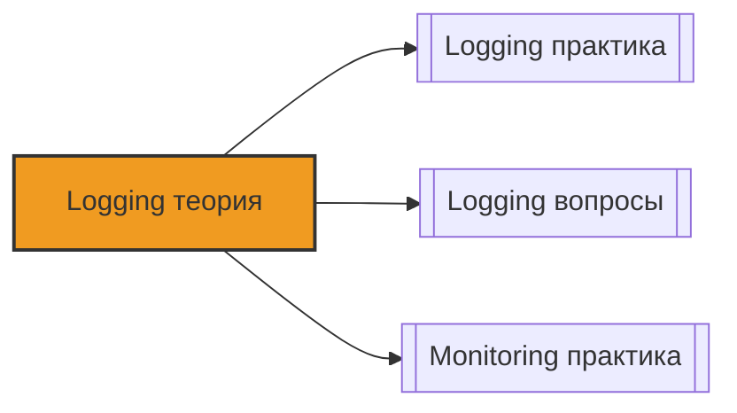

# 📄 Файл: `Logging теория.md`

tags: [logging, devops, elk, elasticsearch, logstash, kibana, loki, grafana, fluentd, fluent-bit, theory, architecture]
aliases: [logging-theory, log-management-theory]
created: 2026-05-09
---

# 🧠 Logging Stack: Теория и архитектура

> [!INFO] Структура
> Концепции разделены по уровням:  Junior → 🟡 Middle → 🔴 Senior.  
> Каждая тема содержит: суть, техническое объяснение, DevOps-контекст и связанные инструменты.

📋 [[#🗂️ Оглавление для навигации|Оглавление]] | [[#🧪 Чек-лист понимания|Чек-лист]] | [[#🔗 Связь с другими файлами|Связи]]

---

## 🗂️ Оглавление для навигации

### 🟢 Junior (базовые концепции, стандарты, архитектура стеков)
- [[#1. Что такое логирование и зачем оно нужно в DevOps?|1. Logging basics]]
- [[#2. Уровни логирования: DEBUG, INFO, WARN, ERROR, FATAL|2. Log levels]]
- [[#3. 12-Factor App: Логи как поток событий|3. 12-Factor logs]]
- [[#4. Структурированные логи (JSON) vs Текст|4. Structured logging]]
- [[#5. Архитектура ELK Stack (Elasticsearch, Logstash, Kibana)|5. ELK architecture]]
- [[#6. Архитектура Loki: Индексы и Чанки|6. Loki architecture]]
- [[#7. Разница между Elasticsearch и Loki|7. ELK vs Loki]]
- [[#8. Агенты сбора логов: Fluent Bit, Filebeat, Vector|8. Log shippers]]
- [[#9. Как контейнеры (Docker/K8s) управляют логами?|9. Container logging]]
- [[#10. Что такое Log Rotation и зачем он нужен?|10. Log rotation]]

### 🟡 Middle (обработка, парсинг, запросы, оптимизация)
- [[#11. Парсинг логов: Grok паттерны и Regex|11. Log parsing]]
- [[#12. Обогащение логов (Enrichment): метаданные|12. Log enrichment]]
- [[#13. LogQL: язык запросов Loki|13. LogQL theory]]
- [[#14. KQL (Kibana Query Language): синтаксис поиска|14. KQL theory]]
- [[#15. Cardinality (Кардинальность): проблема уникальных меток|15. Cardinality issue]]
- [[#16. Retention Policy: управление временем хранения|16. Retention]]
- [[#17. Фильтрация на стороне агента (Drop/Allow)|17. Agent filtering]]
- [[#18. Буферизация логов: Disk Buffer и память|18. Buffering]]
- [[#19. Сжатие данных: Snappy, Zstd, Gzip|19. Compression]]
- [[#20. Алертинг по логам: паттерны и аномалии|20. Log alerting]]

### 🔴 Senior (масштабирование, безопасность, экономика)
- [[#21. Высокая доступность (HA) в Loki Distributed|21. Loki HA]]
- [[#22. Кластер Elasticsearch: Shards, Replicas, Nodes|22. ES Clustering]]
- [[#23. Multi-tenancy: изоляция данных команд|23. Multi-tenancy]]
- [[#24. Sampling логов: снижение затрат|24. Log sampling]]
- [[#25. PII и Security: маскирование чувствительных данных|25. PII masking]]
- [[#26. Observability: связь Logs, Metrics, Traces|26. Correlation]]
- [[#27. Cost Optimization: Tiered Storage (Hot/Warm/Cold)|27. Cost optimization]]
- [[#28. OpenTelemetry Logging: стандарт будущего|28. OTel logging]]
- [[#29. Backpressure: что делать, когда хранилище не справляется|29. Backpressure]]
- [[#30. Архитектура логирования для High-Load систем|30. High-load architecture]]

---

## 🟢 Junior (базовые концепции, стандарты, архитектура стеков)

### 1. Что такое логирование и зачем оно нужно в DevOps?
**Суть**: Логирование — это фиксация событий, происходящих в системе, для последующего анализа.

**Подробно**:
```
Типы использования логов:
1. Debugging: Поиск причины ошибки ("Почему упал сервис?")
2. Monitoring: Отслеживание состояния ("Сколько ошибок в минуту?")
3. Audit/Compliance: История действий ("Кто удалил пользователя?")
4. Analytics: Понимание поведения пользователей

Свойства хороших логов:
• Машиночитаемость (JSON)
• Временные метки (Timestamp) с часовым поясом
• Уникальные идентификаторы (Trace ID, Request ID)
• Контекст (hostname, namespace, user_id)
```

**DevOps-контекст**:
- Логи — это "черный ящик" системы. Без них вы слепы при инцидентах.
- Логи не должны замедлять приложение.

[[#🗂️ Оглавление для навигации|↑ К оглавлению]]

### 2. Уровни логирования: DEBUG, INFO, WARN, ERROR, FATAL
**Суть**: Классификация событий по важности.

**Подробно**:
```
DEBUG: Детальная информация для разработчиков.
• Пример: "SQL query executed in 5ms", "Variable x=10"
• В продакшене обычно отключен (шум).

INFO: Обычная работа системы.
• Пример: "Server started", "Request processed", "User logged in"
• Используется для аудита и общей статистики.

WARN: Предупреждение, система работает, но есть проблема.
• Пример: "Disk usage > 80%", "API response slow (>2s)", "Retry attempt 1"
• Требует внимания, но не аварийной ситуации.

ERROR: Ошибка выполнения операции.
• Пример: "Database connection failed", "NullPointerException", "HTTP 500"
• Требует расследования.

FATAL/CRITICAL: Критическая ошибка, система не может работать.
• Пример: "Out of memory", "Config file missing", "Port already in use"
• Обычно приводит к остановке процесса.
```

**DevOps-контекст**:
- Настройте уровни через переменные окружения (`LOG_LEVEL=info`).
- Не логируйте пароли и токены даже на уровне DEBUG.

[[#🗂️ Оглавление для навигации|↑ К оглавлению]]

### 3. 12-Factor App: Логи как поток событий
**Суть**: Согласно методологии 12-Factor, приложение не должно управлять файлами логов.

**Подробно**:
```
Правило:
Приложение пишет логи в stdout/stderr (стандартные потоки вывода).
Оно не знает, куда попадут логи.

Роль Оркестратора (Docker/K8s):
1. Перехватывает stdout/stderr контейнера.
2. Сохраняет их во временное хранилище или сразу пересылает агенту.
3. Агент (Fluent Bit/Promtail) забирает логи и отправляет в стек (Loki/ELK).

Почему это важно:
• Приложение остается чистым (нет кода для ротации файлов).
• Логи не теряются при пересоздании контейнера.
• Единый формат сбора для всех сервисов.
```

**DevOps-контекст**:
- Никогда не монтируйте том для логов внутрь контейнера приложения.
- Используйте Docker logging drivers или sidecar-контейнеры.

[[#🗂️ Оглавление для навигации|↑ К оглавлению]]

### 4. Структурированные логи (JSON) vs Текст
**Суть**: JSON логи позволяют машине легко извлекать поля, текст требует сложного парсинга.

**Подробно**:
```
Текстовый лог (Плохо):
[2024-05-09 10:00:00] ERROR: User 123 failed login from 192.168.1.1
• Чтобы найти IP, нужен Regex.
• Чтобы посчитать ошибки по пользователям, нужно парсить каждую строку.

JSON лог (Хорошо):
{
  "timestamp": "2024-05-09T10:00:00Z",
  "level": "ERROR",
  "message": "Login failed",
  "user_id": 123,
  "ip": "192.168.1.1",
  "service": "auth"
}
• Поля извлекаются автоматически.
• Можно делать запросы: user_id=123 AND level=ERROR.
• Легко агрегировать и строить графики.
```

**DevOps-контекст**:
- Приучайте разработчиков писать JSON логи.
- Если приложение пишет текст, используйте Logstash/Grok или Fluent Bit Parser для преобразования в JSON на лету.

[[#🗂️ Оглавление для навигации|↑ К оглавлению]]

### 5. Архитектура ELK Stack (Elasticsearch, Logstash, Kibana)
**Суть**: Полнофункциональный стек для поиска и анализа логов.

**Подробно**:
```
Компоненты:
1. Elasticsearch (База данных):
   • Хранит логи в инвертированном индексе (как поисковик).
   • Индексирует ВСЁ содержимое лога.
   • Мощный полнотекстовый поиск.

2. Logstash (Обработчик):
   • Принимает логи, парсит (Grok), обогащает, фильтрует.
   • Отправляет в Elasticsearch.
   • Тяжелый (Java), потребляет много памяти.

3. Kibana (Интерфейс):
   • Визуализация, дашборды, управление индексами.

4. Beats/Filebeat (Агент):
   • Легкий агент на хосте, собирает логи и шлет в Logstash или ES.
```

**DevOps-контекст**:
- ELK — это "тяжелая артиллерия". Требует много ресурсов (RAM, CPU, Disk).
- Подходит, если нужен глубокий анализ текста и полнотекстовый поиск.
- Сложнее в поддержке, чем Loki.

[[#🗂️ Оглавлению|↑ К оглавлению]]

### 6. Архитектура Loki: Индексы и Чанки
**Суть**: Loki оптимизирован для хранения логов, а не для полнотекстового поиска.

**Подробно**:
```
Принцип: "grep для логов".
Loki не индексирует содержимое логов (текст).
Он индексирует только метки (Labels), как Prometheus.

Структура данных:
1. Index (Хранится в Cassandra/DynamoDB/Boltdb):
   • Связывает Labels → Чанки.
   • Пример: {app="nginx", level="error"} -> [Chunk_1, Chunk_2]

2. Chunks (Хранятся в S3/GCS/MinIO):
   • Сжатые блоки с самими логами (gzip/snappy).
   • Содержат текст логов.

Процесс запроса:
1. Найти нужные чанки по меткам в Индексе.
2. Скачать чанки из хранилища.
3. Распаковать и применить grep-фильтр к тексту.
```

**DevOps-контекст**:
- Loki дешевле Elasticsearch в 5-10 раз (меньше индексация, объектное хранилище).
- Поиск по тексту медленнее, чем в ES, но достаточно быстрый для отладки.
- Идеален для K8s и метрик-ориентированных команд.

[[#🗂️ Оглавлению|↑ К оглавлению]]

### 7. Разница между Elasticsearch и Loki
**Суть**: Выбор между мощным поиском и экономичным хранением.

**Подробно**:
| Характеристика | Elasticsearch (ELK) | Grafana Loki |
|---|---|---|
| **Индексация** | Полная (каждое слово) | Только метки (Labels) |
| **Поиск текста** | Мгновенный (Full-text) | Grep по чанкам (медленнее) |
| **Хранение** | Диски ноды (дорого) | S3/Object Storage (дешево) |
| **Ресурсы** | Много RAM/CPU | Мало RAM/CPU |
| **Сценарий** | Аналитика, Audit, Security | Отладка, Мониторинг, DevOps |
| **Запросы** | KQL / DSL | LogQL |

**DevOps-контекст**:
- Выбирайте ELK, если у вас есть команда безопасности (SIEM) или аналитики, которым нужен сложный поиск.
- Выбирайте Loki, если вам нужно просто "почитать логи" и построить графики ошибок, экономя бюджет.

[[#🗂️ Оглавлению|↑ К оглавлению]]

### 8. Агенты сбора логов: Fluent Bit, Filebeat, Vector
**Суть**: Программы на хостах/нодах, которые читают логи и отправляют их в стек.

**Подробно**:
```
Fluent Bit:
• Написан на C.
• Минимальное потребление памяти (<5MB).
• Идеален для K8s DaemonSet и Edge-устройств.
• Широкая экосистема плагинов.

Filebeat (Elastic):
• Написан на Go.
• Оптимизирован под Elasticsearch.
• Легкая настройка модулей (Nginx, MySQL).
• Потребляет больше памяти, чем Fluent Bit.

Vector (Datadog):
• Написан на Rust.
• Очень быстрый, безопасный (memory safety).
• Новый игрок, набирает популярность.
```

**DevOps-контекст**:
- Для Loki стандартом является **Promtail** (специальный агент от Grafana) или **Fluent Bit**.
- Для ELK стандартом является **Filebeat**.
- Не используйте Logstash как агент на каждом хосте — он слишком тяжелый.

[[#🗂️ Оглавлению|↑ К оглавлению]]

### 9. Как контейнеры (Docker/K8s) управляют логами?
**Суть**: Логи контейнеров изолированы и управляются движком контейнеризации.

**Подробно**:
```
Docker:
• По умолчанию: JSON-file driver (пишет в /var/lib/docker/containers/...).
• Другие драйверы: syslog, journald, fluentd, awslogs.
• Важно: Настраивать log-rotation в daemon.json, иначе диск переполнится.

Kubernetes:
• kubelet пишет логи в /var/log/pods/...
• Формат: CRI (Container Runtime Interface).
• Логи хранятся на ноде.
• Для сбора нужен DaemonSet (Fluent Bit/Promtail), который монтирует /var/log.
```

**DevOps-контекст**:
- В K8s логи подов живут, пока жив под. Если под удалился — логи пропали (если не собраны агентом).
- Логи системных компонентов (kubelet, docker) тоже важны для отладки ноды.

[[#🗂️ Оглавлению|↑ К оглавлению]]

### 10. Что такое Log Rotation и зачем он нужен?
**Суть**: Механизм разделения лог-файла на части и удаления старых, чтобы не забить диск.

**Подробно**:
```
Принцип:
1. Файл app.log растет.
2. Достигает лимита (напр. 100MB).
3. Переименовывается в app.log.1 (сжимается в .gz).
4. Создается новый пустой app.log.
5. Старые файлы (app.log.5, app.log.6...) удаляются.

Инструменты:
• Linux: logrotate (демон).
• Docker: встроенная ротация в настройках драйвера.
• Java/Python: встроенные библиотеки (Logback, RotatingFileHandler).
```

**DevOps-контекст**:
- Без ротации один файл может вырасти до сотен ГБ, и приложение упадет (No space left on device).
- Приложение должно уметь переоткрывать файл после ротации (signal HUP) или писать в stdout.

[[#🗂️ Оглавлению|↑ К оглавлению]]

---

## 🟡 Middle (обработка, парсинг, запросы, оптимизация)

### 11. Парсинг логов: Grok паттерны и Regex
**Суть**: Преобразование неструктурированного текста в поля.

**Подробно**:
```
Grok (используется в Logstash):
• Набор готовых Regex-шаблонов.
• Синтаксис: %{PATTERN:field_name}
• Пример:
  Лог: "10.0.0.1 - - [10/Oct/2024:13:55:36 +0000] "GET /api HTTP/1.1" 200"
  Grok: %{IP:client_ip} %{USER:ident} %{USER:auth} \[%{HTTPDATE:timestamp}\] "%{WORD:method} %{URIPATH:request} %{NUMBER:http_version}" %{NUMBER:status}

Результат:
{
  "client_ip": "10.0.0.1",
  "method": "GET",
  "status": 200
}
```

**DevOps-контекст**:
- Парсинг потребляет CPU. Делайте его на агенте или Logstash, а не в хранилище.
- Сложные Regex могут стать узким местом производительности.

[[#🗂️ Оглавлению|↑ К оглавлению]]

### 12. Обогащение логов (Enrichment): метаданные
**Суть**: Добавление контекста к логам для упрощения поиска.

**Подробно**:
```
Что добавлять:
• hostname / node_name: Где запущен код?
• namespace / pod_name: В каком K8s окружении?
• environment: dev, staging, prod?
• geo_ip: Страна пользователя (по IP).
• service_version: Версия микросервиса.

Как добавлять:
• Fluent Bit: Filter kubernetes (автоматически добавляет метки пода).
• Logstash: Filter mutate / geoip.
• Приложение: Включать в JSON лог при старте.
```

**DevOps-контекст**:
- Лог "Error: DB connection failed" бесполезен без контекста.
- Лог "Error: DB connection failed [host=db-01, ns=prod]" позволяет сразу понять масштаб проблемы.

[[#🗂️ Оглавлению|↑ К оглавлению]]

### 13. LogQL: язык запросов Loki
**Суть**: Язык для фильтрации и агрегации логов в Grafana.

**Подробно**:
```
Синтаксис:
1. Stream Selector (выбор потока по меткам):
   {app="nginx", level="error"}

2. Filter Expression (поиск в тексте):
   |= "timeout"       (содержит)
   != "healthcheck"   (не содержит)
   |~ "err[0-9]+"     (regex match)
   !~ "debug"         (regex not match)

3. Pipelines (парсинг):
   | json             (распарсить JSON)
   | logfmt           (распарсить key=value)
   | regexp "..."     (regex группы)

Пример:
{app="api"} | json | status >= 500 | line_format "{{.message}}"
```

**DevOps-контекст**:
- LogQL похож на PromQL.
- Позволяет создавать метрики из логов (например, график количества 500 ошибок).

[[#️ Оглавлению|↑ К оглавлению]]

### 14. KQL (Kibana Query Language): синтаксис поиска
**Суть**: Язык поиска в Elasticsearch через Kibana.

**Подробно**:
```
Простой поиск:
• "error" — ищет слово error в любом поле.
• message:"timeout" — ищет в поле message.

Логические операторы:
• AND, OR, NOT (в верхнем регистре).
• status:500 AND service:auth

Wildcards:
• request:/api/* — любой путь, начинающийся с /api/.

Диапазоны:
• response_time:[500 TO 1000]
• status:>400
```

**DevOps-контекст**:
- KQL быстрее старого Lucene синтаксиса.
- Используйте Saved Queries для частых проверок.

[[#🗂️ Оглавлению|↑ К оглавлению]]

### 15. Cardinality (Кардинальность): проблема уникальных меток
**Суть**: В Loki (и Prometheus) каждая уникальная комбинация меток создает новую "серию".

**Подробно**:
```
Проблема High Cardinality:
Если вы используете в метках уникальные ID, количество серий взрывается.
❌ Плохо: {user_id="123", request_id="abc", session_id="xyz"}
• 1 млн пользователей = 1 млн серий в индексе.
• Индекс разрастается, память кончается, Loki падает.

✅ Хорошо: {app="api", status="500", method="POST"}
• Несколько десятков комбинаций.
• Уникальные ID оставляем внутри текста лога (не в метках).
```

**DevOps-контекст**:
- Это правило №1 для Loki.
- Никогда не используйте `trace_id`, `user_id`, `pod_ip` в качестве Labels.
- Используйте их для фильтрации внутри запроса (`|= "user_id=123"`).

[[#🗂️ Оглавлению|↑ К оглавлению]]

### 16. Retention Policy: управление временем хранения
**Суть**: Автоматическое удаление старых логов для экономии места.

**Подробно**:
```
Elasticsearch (ILM - Index Lifecycle Management):
• Hot (SSD): Последние 2 дня, активная запись.
• Warm (HDD): 2-14 дней, только чтение, сжатие.
• Cold (Archive): 14-90 дней, заморожены, медленно ищутся.
• Delete: Удаление после 90 дней.

Loki:
• Компактор объединяет чанки и удаляет старые по `retention_period`.
• Можно настроить разное время для разных меток (per-stream retention).
```

**DevOps-контекст**:
- Логи занимают место. Без политики очистки диск кончится.
- Требования бизнеса диктуют сроки (например, PCI DSS требует хранить логи 1 год).

[[#🗂️ Оглавлению|↑ К оглавлению]]

### 17. Фильтрация на стороне агента (Drop/Allow)
**Суть**: Отбрасывание ненужных логов до отправки в хранилище.

**Подробно**:
```
Зачем:
• Снижение нагрузки на сеть.
• Экономия места в хранилище.
• Уменьшение шума (DEBUG логи в проде).

Пример (Fluent Bit):
[FILTER]
    Name   grep
    Match  *
    Exclude level debug   # Исключить все логи с level=debug
```

**DevOps-контекст**:
- Дешевле дропнуть лог на агенте, чем хранить его в S3.
- Будьте осторожны: дропнув логи, вы не сможете их восстановить.

[[#🗂️ Оглавлению|↑ К оглавлению]]

### 18. Буферизация логов: Disk Buffer и память
**Суть**: Временное хранение логов на случай падения сети или хранилища.

**Подробно**:
```
Проблема:
Если Loki/ES упал или сеть пропала, агент теряет логи из памяти.

Решение (Fluent Bit):
storage.path: /var/log/flb-storage/
• Агент пишет логи на диск.
• Когда хранилище доступно — отправляет.
• Гарантирует доставку (At-least-once).
```

**DevOps-контекст**:
- В K8s это критично, так как поды с агентами могут перезапускаться.
- Нужно следить за местом на диске под буфер.

[[#🗂️ Оглавлению|↑ К оглавлению]]

### 19. Сжатие данных: Snappy, Zstd, Gzip
**Суть**: Уменьшение размера логов перед записью на диск или отправкой.

**Подробно**:
```
Алгоритмы:
• Gzip: Высокое сжатие, высокая нагрузка на CPU.
• Snappy: Быстрое сжатие, среднее качество. Стандарт для Kafka/Fluent Bit.
• Zstd: Баланс скорости и сжатия. Современный стандарт.

Где применяется:
• Loki чанки сжимаются (по умолчанию Snappy).
• Elasticsearch индексы сжимаются (LZ4/Deflate).
• Передача по сети (Fluent Bit output compress).
```

**DevOps-контекст**:
- Сжатие экономит деньги на хранилище (S3).
- Zstd часто предпочтительнее Gzip из-за скорости распаковки.

[[#🗂️ Оглавлению|↑ К оглавлению]]

### 20. Алертинг по логам: паттерны и аномалии
**Суть**: Уведомления о критических событиях в логах.

**Подробно**:
```
Подходы:
1. Пороговый (Threshold):
   • "Более 10 ошибок в минуту".
   • LogQL: sum(count_over_time({level="error"}[1m])) > 10

2. Появление (Presence):
   • "Появилось слово PANIC".
   • LogQL: {level="fatal"} |= "PANIC"

3. Отклонение (Anomaly):
   • "Количество логов упало на 50%" (сервис молчит).
```

**DevOps-контекст**:
- Не алертьте на каждую ошибку (Alert Fatigue).
- Алертьте на рост ошибок или появление критических паттернов.
- Интегрируйте с PagerDuty/Slack.

[[#🗂️ Оглавлению|↑ К оглавлению]]

---

## 🔴 Senior (масштабирование, безопасность, экономика)

### 21. Высокая доступность (HA) в Loki Distributed
**Суть**: Запуск Loki в микросервисной архитектуре для отказаустойчивости.

**Подробно**:
```
Компоненты (Kubernetes):
• Distributor (Deployment): Принимает логи, валидирует. Без состояния.
• Ingester (StatefulSet): Буферизует и пишет в хранилище. Репликация WAL (Write Ahead Log) между инстансами.
• Querier (Deployment): Читает логи.
• Compactor (StatefulSet): Сливает чанки, удаляет старые.

Отказоустойчивость:
• Если Ingester падает, WAL позволяет другому поднять данные.
• Данные хранятся в S3 (независимо от нод).
```

**DevOps-контекст**:
- Single-binary Loki не подходит для продакшена с высокой нагрузкой.
- Используйте Helm-чарт с `mode: distributed`.

[[#🗂️ Оглавлению|↑ К оглавлению]]

### 22. Кластер Elasticsearch: Shards, Replicas, Nodes
**Суть**: Распределение данных по нодам для скорости и надежности.

**Подробно**:
```
Shards (Шарды):
• Индекс разбивается на части (shards).
• Позволяет параллельную запись/чтение.
• Нельзя изменить количество primary shards после создания индекса.

Replicas (Реплики):
• Копии шардов на других нодах.
• Обеспечивают HA (если нода упала).
• Ускоряют чтение.

Node Roles:
• Master: Управление кластером.
• Data: Хранение шардов.
• Ingest: Парсинг (аналог Logstash).
• Coordinating: Маршрутизация запросов.
```

**DevOps-контекст**:
- Правило: Количество шардов должно быть пропорционально объему данных.
- Too many small shards = overhead.
- Too few large shards = медленное восстановление.

[[#🗂️ Оглавлению|↑ К оглавлению]]

### 23. Multi-tenancy: изоляция данных команд
**Суть**: Разделение одного стека логирования между разными командами/клиентами.

**Подробно**:
```
В Loki:
• Используется заголовок X-Scope-OrgID.
• Команда А шлет логи с OrgID=team-a.
• Команда А может читать только свои логи.
• Администратор видит всё.

В Elasticsearch:
• Разные индексы: logs-team-a-*, logs-team-b-*.
• RBAC роли в Kibana Spaces.
• Документная безопасность (Field-level security).
```

**DevOps-контекст**:
- Критично для SaaS-платформ и крупных компаний.
- Предотвращает утечку данных между департаментами.

[[#🗂️ Оглавлению|↑ К оглавлению]]

### 24. Sampling логов: снижение затрат
**Суть**: Сохранение не всех логов, а только части или определенных типов.

**Подробно**:
```
Сценарии:
1. Дроп DEBUG: В проде хранить только INFO и выше.
2. Вероятностный сэмплинг:
   • Сохранять 100% ошибок.
   • Сохранять 1% успешных запросов (INFO).
3. Динамический сэмплинг:
   • Если ошибок нет — хранить 1%.
   • Если ошибок много — хранить 100% (для расследования).
```

**DevOps-контекст**:
- Экономит до 90% места.
- Требует аккуратной настройки, чтобы не потерять важные данные.
- Trace-логи (OpenTelemetry) лучше не сэмплировать случайно, чтобы не ломать цепочки.

[[#🗂️ Оглавлению|↑ К оглавлению]]

### 25. PII и Security: маскирование чувствительных данных
**Суть**: Удаление или скрытие персональных данных (Пароли, Карты, Email) из логов.

**Подробно**:
```
Зачем:
• GDPR, PCI DSS, HIPAA.
• Логи часто менее защищены, чем БД.

Как:
1. На уровне приложения: Не писать чувствительные поля.
2. На уровне агента (Fluent Bit/Logstash):
   • Regex replace: Заменять номер карты на ****-****-****-1234.
   • Drop fields: Удалять поле password из JSON.
3. Шифрование: TLS при передаче, Encryption at Rest в S3/ES.
```

**DevOps-контекст**:
- Утечка логов = утечка данных.
- Аудит логов на наличие PII должен быть регулярным процессом.

[[#🗂️ Оглавлению|↑ К оглавлению]]

### 26. Observability: связь Logs, Metrics, Traces
**Суть**: Три столпа наблюдаемости должны быть связаны.

**Подробно**:
```
Корреляция:
1. Metrics (Prometheus): "Выросла ошибка 500".
2. Logs (Loki): "Почему 500?" -> Ищем логи по времени.
3. Traces (Jaeger/Tempo): "Где именно задержка?" -> TraceID в логах.

Реализация:
• Приложение генерирует TraceID.
• TraceID пишется в лог (JSON field).
• В Grafana настраивается Derived Field: клик по TraceID в логе открывает Trace.
```

**DevOps-контекст**:
- Без связки расследование инцидента занимает часы.
- Со связкой — минуты.
- OpenTelemetry — стандарт для сбора всех трех сигналов.

[[#🗂️ Оглавлению|↑ К оглавлению]]

### 27. Cost Optimization: Tiered Storage
**Суть**: Разделение данных по стоимости хранения.

**Подробно**:
```
Tier 1: Hot (NVMe SSD).
• Последние 2-3 дня.
• Быстрый доступ для отладки.

Tier 2: Warm (HDD).
• 3-14 дней.
• Доступ есть, но медленнее.

Tier 3: Cold (S3 Glacier / Deep Archive).
• 14+ дней.
• Дешево, но восстановление занимает часы.
• Используется для аудита и комплаенса.
```

**DevOps-контекст**:
- 80% запросов к логам идут за последние 24 часа.
- Нет смысла хранить месячные логи на дорогих SSD.

[[#🗂️ Оглавлению|↑ К оглавлению]]

### 28. OpenTelemetry Logging: стандарт будущего
**Суть**: Единый стандарт сбора телеметрии от CNCF.

**Подробно**:
```
OTel Collector:
• Универсальный агент.
• Принимает данные в любом формате.
• Отправляет в любой бэкенд (Loki, ES, CloudWatch).
• Обработка (Processors): фильтрация, маскирование, enrich.

Преимущества:
• Vendor lock-in reduction (легко сменить бэкенд).
• Единый агент для Logs, Metrics, Traces.
```

**DevOps-контекст**:
- Индустрия движется к OTel.
- Fluent Bit тоже может экспортировать в OTel формат.

[[#🗂️ Оглавлению|↑ К оглавлению]]

### 29. Backpressure: что делать, когда хранилище не справляется
**Суть**: Механизм защиты от потери данных при перегрузке.

**Подробно**:
```
Сценарий:
Elasticsearch/Loki не успевает писать. Очередь переполняется.

Стратегии:
1. Drop Oldest: Удалять старые логи из буфера (потеря данных).
2. Drop Newest: Останавливать прием новых логов (риск для приложения).
3. Slow Down: Сообщать приложению "подожди" (Backpressure).
4. Spill to Disk: Писать буфер на диск (медленно, но надежно).
```

**DevOps-контекст**:
- Настройте мониторинг очереди агента.
- Лучше потерять немного DEBUG логов, чем уронить приложение.

[[#🗂️ Оглавлению|↑ К оглавлению]]

### 30. Архитектура логирования для High-Load систем
**Суть**: Как строить стек для тысяч нод и терабайт логов.

**Подробно**:
```
Архитектура:
1. Агенты (Fluent Bit) на каждой ноде -> Сбор, парсинг, дроп мусора.
2. Буфер (Kafka/Redis):
   • Агенты шлют в Кафку.
   • Кафка сглаживает пики нагрузки.
   • Потребители (Logstash/Loki Ingester) читают из Кафки в своем темпе.
3. Хранилище (S3 + Loki Distributed / ES Cluster).

Преимущества Kafka:
• Replay: Можно перечитать логи, если хранилище упало.
• Decoupling: Агенты не зависят от доступности хранилища.
```

**DevOps-контекст**:
- Для средних систем Kafka избыточна.
- Для Enterprise и High-Load — это стандарт надежности.

[[#🗂️ Оглавлению|↑ К оглавлению]]

---

## 🧪 Чек-лист понимания

- [ ] Понимаю разницу между ELK и Loki и могу обосновать выбор.
- [ ] Знаю, почему нельзя хранить логи внутри контейнера.
- [ ] Понимаю концепцию структурированных логов (JSON).
- [ ] Знаю, что такое High Cardinality и как её избегать в Loki.
- [ ] Могу объяснить роль Fluent Bit/Filebeat в архитектуре.
- [ ] Понимаю, как работают LogQL и KQL.
- [ ] Знаю принципы безопасности (PII masking) при работе с логами.
- [ ] Понимаю связь между Логами, Метриками и Трейсами.

> [!TIP] Практика
> Теория без практики мертва:
> 1. Настройте JSON логирование в тестовом приложении.
> 2. Разверните Loki через Docker и напишите запрос LogQL.
> 3. Попробуйте "сломать" Loki, добавив уникальный лейбл на каждый лог (Cardinality explosion).
> 4. Настройте Fluent Bit для сбора логов с хоста и отправки в stdout.

---

## 🔗 Связь с другими файлами

> [!TIP] Следующие шаги
> - [[Logging практика]]: Отработка сценариев
> - [[Logging вопросы]]: Подготовка к собеседованию
> - [[Monitoring практика]]: Prometheus, Grafana
> - [[Kubernetes практика]]: DaemonSet, Sidecar
> - [[Cloud практика]]: CloudWatch, S3



[[#🗂️ Оглавлению|↑ К оглавлению]]

---

**Структура проекта**:
```
DevOps_start-main
── ...
├── 05_Observability
│   ├── Prometheus
│   ├── Grafana
│   ├── Logging
│   │   ├── [[Logging практика]]
│   │   ├── [[Logging теория]] ← этот файл
│   │   ── [[Logging вопросы]]
│   ├── Loki
│   └── Tempo
├── ...
```