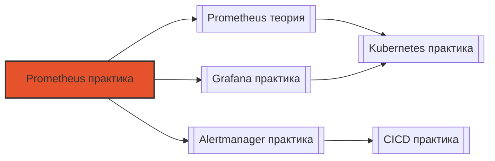

# 📄 Файл: `Prometheus практика.md`

tags: [prometheus, monitoring, observability, devops, sre, promql]
aliases: [prometheus-practice, promql-exercises, monitoring-labs]
created: 2026-05-07
---

# 📊 Prometheus для DevOps: Практические сценарии и упражнения

> [!INFO] Структура
> Сценарии разделены по уровням: 🟢 Junior → 🟡 Middle → 🔴 Senior.  
> Каждый сценарий содержит: задачу, решение, разбор и DevOps-контекст.

📋 [[#🗂️ Оглавление для навигации|Оглавление]] | [[#🧪 Чек-лист навыков|Чек-лист]] | [[#🔗 Связь с другими файлами|Связи]]

---

## 🗂️ Оглавление для навигации

### 🟢 Junior (базовые запросы и настройка)
- [[#1. Написать запрос для подсчёта RPS (requests per second) по всем инстансам|1. RPS: rate()]]
- [[#2. Построить график 95-го перцентиля времени ответа за 5 минут|2. Перцентили: histogram_quantile]]
- [[#3. Найти инстансы, где CPU > 80% последние 10 минут|3. Алерт на CPU]]
- [[#4. Отфильтровать метрики по лейблам: только prod и service=api|4. Фильтрация по лейблам]]
- [[#5. Посчитать процент ошибок (5xx) от общего числа запросов|5. Процент ошибок]]
- [[#6. Настроить basic scrape config для нового микросервиса|6. Scrape config]]
- [[#7. Создать простой dashboard в Grafana с 3 панелями|7. Dashboard в Grafana]]
- [[#8. Написать alert rule для "нет данных" (метрика пропала)|8. Alert: absent()]]
- [[#9. Использовать recording rule для оптимизации тяжёлого запроса|9. Recording rules]]
- [[#10. Проверить, что Prometheus скрейпит целевой endpoint|10. Проверка скрейпинга]]

### 🟡 Middle (продвинутые запросы, отладка, alerting)
- [[#11. ⭐ Написать запрос для SLO: availability 99.9% за 28 дней|11. SLO: availability ⭐]]
- [[#12. Найти "горячие" лейблы, которые раздувают cardinality|12. Cardinality audit]]
- [[#13. Настроить alert с группировкой и inhibit rules в Alertmanager|13. Alertmanager: inhibit]]
- [[#14. ⭐ Рассчитать burn rate для error budget и настроить мульти-оконные алерты|14. Burn rate ⭐]]
- [[#15. Отладить почему метрика не появляется в Prometheus|15. Debug: метрики не видны]]
- [[#16. Использовать relabel_configs для добавления/удаления лейблов|16. Relabel configs]]
- [[#17. Настроить federation для агрегации метрик из нескольких Prometheus|17. Federation]]
- [[#18. Создать custom exporter для приложения без Prometheus-метрик|18. Custom exporter]]
- [[#19. Оптимизировать запрос, который тормозит Grafana|19. Query optimization]]
- [[#20. Настроить remote write в Thanos/Cortex для долгосрочного хранения|20. Remote write]]

### 🔴 Senior (архитектура, масштабирование, troubleshooting)
- [[#21. ⭐ Спроектировать multi-tenant Prometheus для 100+ команд|21. Multi-tenant архитектура ⭐]]
- [[#22. Рассчитать ресурсы для Prometheus: память, CPU, диск под 1M series|22. Capacity planning]]
- [[#23. Настроить sharding с Thanos Sidecar vs Cortex vs Mimir: trade-offs|23. Sharding: сравнение]]
- [[#24. ⭐ Реализовать alerting на симптомы, а не причины: пример для e-commerce|24. Alerting philosophy ⭐]]
- [[#25. Отладить утечку памяти в Prometheus: profiling и tuning|25. Debug: memory leak]]
- [[#26. Настроить downsampling и retention policies для cost optimization|26. Retention & downsampling]]
- [[#27. Реализовать метрики для GitOps: sync status, drift detection|27. GitOps метрики]]
- [[#28. Создать чёрный ящик (blackbox) мониторинг для критичных эндпоинтов|28. Blackbox monitoring]]
- [[#29. Настроить метрики безопасности: failed logins, privilege escalations|29. Security metrics]]
- [[#30. ⭐ Спроектировать observability-стратегию для миграции с монолита на микросервисы|30. Observability strategy ⭐]]

---

## 🟢 Junior (базовые запросы и настройка)

### 1. Написать запрос для подсчёта RPS (requests per second) по всем инстансам
**Задача**: Посчитать количество HTTP-запросов в секунду, агрегированное по всем инстансам сервиса.

**Решение**:
```promql
sum(rate(http_requests_total[5m]))
```

**Разбор**: 
- `rate()` вычисляет скорость изменения counter'а за окно `[5m]`, экстраполируя на секунду
- `sum()` агрегирует по всем лейблам (инстансам, методам, статусам)
- Окно 5м — компромисс между шумом и реактивностью [[3]]

**DevOps-контекст**: Базовая метрика для дашборда "здоровья" сервиса. В алертах: `sum(rate(...)) < 10` может означать простой сервиса.

**Проверка в Grafana**: Добавить панель → Time series → Query: `sum(rate(http_requests_total[5m]))` → Legend: `RPS`.

[[#🗂️ Оглавление для навигации|↑ К оглавлению]]

### 2. Построить график 95-го перцентиля времени ответа за 5 минут
**Задача**: Показать p95 latency для HTTP-запросов.

**Решение** (для histogram):
```promql
histogram_quantile(0.95, sum(rate(http_request_duration_seconds_bucket[5m])) by (le))
```

**Разбор**:
- `http_request_duration_seconds_bucket` — bucket'ы гистограммы
- `rate(...[5m])` — скорость попадания в каждый бакет
- `sum by (le)` — агрегируем бакеты, сохраняя лейбл `le` (less or equal)
- `histogram_quantile(0.95, ...)` — интерполирует 95-й перцентиль [[4]]

**DevOps-контекст**: p95 лучше среднего для оценки пользовательского опыта: показывает, что видят 95% пользователей, игнорируя выбросы.

**Проверка**: Если метрика — summary, использовать: `http_request_duration_seconds{quantile="0.95"}`.

[[#🗂️ Оглавлению для навигации|↑ К оглавлению]]

### 3. Найти инстансы, где CPU > 80% последние 10 минут
**Задача**: Алерт на высокую загрузку CPU.

**Решение**:
```promql
avg(rate(node_cpu_seconds_total{mode!="idle"}[10m])) by (instance) > 0.8
```

**Разбор**:
- `node_cpu_seconds_total` — counter времени по режимам
- `rate(...[10m])` — доля времени в не-idle режиме
- `avg by (instance)` — усредняем по ядрам для каждого инстанса
- `> 0.8` — порог 80%

**DevOps-контекст**: Для алерта добавить `for: 5m`, чтобы избежать ложных срабатываний на кратковременные пики [[40]].

**Alert rule**:
```yaml
- alert: HighCPUUsage
  expr: avg(rate(node_cpu_seconds_total{mode!="idle"}[10m])) by (instance) > 0.8
  for: 5m
  labels:
    severity: warning
  annotations:
    summary: "High CPU on {{ $labels.instance }}"
    description: "CPU usage is {{ $value | humanizePercentage }} for 10m"
```

[[#🗂️ Оглавлению для навигации|↑ К оглавлению]]

### 4. Отфильтровать метрики по лейблам: только prod и service=api
**Задача**: Показать метрики только для production-окружения и API-сервиса.

**Решение**:
```promql
http_requests_total{env="prod", service="api"}
```

**Разбор**:
- Фильтрация по точному совпадению лейблов
- Можно использовать `=~` для regex: `instance=~"prod-.*"`
- Отрицание: `!~` или `!=`

**DevOps-контекст**: Критично для multi-env: случайно не послать алерт из staging в prod-канал Slack [[2]].

**Совет**: Стандартизировать лейблы: `env`, `service`, `team`, `region` — согласовать в команде [[3]].

[[#🗂️ Оглавлению для навигации|↑ К оглавлению]]

### 5. Посчитать процент ошибок (5xx) от общего числа запросов
**Задача**: Метрика "error rate" для SLO.

**Решение**:
```promql
sum(rate(http_requests_total{status=~"5.."}[5m])) 
/ 
sum(rate(http_requests_total[5m])) * 100
```

**Разбор**:
- Числитель: запросы со статусом 500-599
- Знаменатель: все запросы
- `* 100` — перевод в проценты

**DevOps-контекст**: Базовая метрика для SLO: "error budget" = 100% - target availability [[40]].

**Алерт**: `> 1` (более 1% ошибок) → warning, `> 5` → critical.

[[#🗂️ Оглавлению для навигации|↑ К оглавлению]]

### 6. Настроить basic scrape config для нового микросервиса
**Задача**: Добавить скрейпинг сервиса на порту 8080.

**Решение** (`prometheus.yml`):
```yaml
scrape_configs:
  - job_name: 'my-service'
    metrics_path: /metrics
    scrape_interval: 30s
    static_configs:
      - targets: ['my-service.prod.svc:8080']
    labels:
      env: prod
      service: my-service
      team: backend
```

**Разбор**:
- `scrape_interval`: 30s — баланс между детализацией и нагрузкой [[3]]
- `labels`: добавляются ко всем метрикам этого джоба
- `static_configs` → для Kubernetes заменить на `kubernetes_sd_configs`

**DevOps-контекст**: В Kubernetes использовать service discovery:
```yaml
kubernetes_sd_configs:
  - role: pod
relabel_configs:
  - source_labels: [__meta_kubernetes_pod_annotation_prometheus_io_scrape]
    action: keep
    regex: true
```

[[#🗂️ Оглавлению для навигации|↑ К оглавлению]]

### 7. Создать простой dashboard в Grafana с 3 панелями
**Задача**: Дашборд "здоровья" сервиса: RPS, latency, errors.

**Решение** (JSON-модель или UI):
1. Panel 1: `sum(rate(http_requests_total[5m]))` → Time series → Title: "RPS"
2. Panel 2: `histogram_quantile(0.95, ...)` → Time series → Title: "p95 latency"
3. Panel 3: `sum(rate(http_requests_total{status=~"5.."}[5m])) / sum(rate(...)) * 100` → Stat → Thresholds: 1%/5%

**Разбор**:
- Использовать переменные: `$service`, `$env` для фильтрации
- Добавить annotation: деплои (`git commit` из CI)

**DevOps-контекст**: Дашборд должен отвечать на вопрос "сервис здоров?" за 5 секунд [[2]].

**Совет**: Экспортировать дашборд в JSON и хранить в Git (GitOps для мониторинга).

[[#🗂️ Оглавлению для навигации|↑ К оглавлению]]

### 8. Написать alert rule для "нет данных" (метрика пропала)
**Задача**: Алерт, если сервис перестал присылать метрики.

**Решение**:
```promql
absent(http_requests_total{service="api", env="prod"})
```

**Разбор**:
- `absent()` возвращает 1, если вектор пуст (нет метрик)
- Срабатывает, если скрейпинг упал или сервис "умер"

**DevOps-контекст**: Критичный алерт: "мониторинг не видит сервис" → проверить деплой, сеть, exporter [[40]].

**Alert rule**:
```yaml
- alert: ServiceMetricsMissing
  expr: absent(http_requests_total{service="api", env="prod"})
  for: 2m
  labels:
    severity: critical
  annotations:
    summary: "No metrics from api service"
    runbook_url: "https://wiki/runbooks/api-metrics-missing"
```

[[#🗂️ Оглавлению для навигации|↑ К оглавлению]]

### 9. Использовать recording rule для оптимизации тяжёлого запроса
**Задача**: Предвычислить сложный запрос для дашборда.

**Решение** (`rules.yml`):
```yaml
groups:
  - name: api_recording
    interval: 30s
    rules:
      - record: api:http_requests:rate5m
        expr: sum(rate(http_requests_total{service="api"}[5m])) by (status)
```

**Разбор**:
- `record`: имя новой метрики (префикс `ж:` — конвенция)
- Запрос вычисляется раз в 30с, результат кешируется
- В Grafana использовать `api:http_requests:rate5m` вместо исходного запроса

**DevOps-контекст**: Снижает нагрузку на Prometheus при 100+ одновременных запросах из Grafana [[3]].

**Проверка**: `promtool check rules rules.yml` → валидация перед деплоем.

[[#🗂️ Оглавлению для навигации|↑ К оглавлению]]

### 10. Проверить, что Prometheus скрейпит целевой endpoint
**Задача**: Убедиться, что метрики собираются.

**Решение**:
```promql
up{job="my-service"}
```

**Разбор**:
- `up` — специальная метрика: 1 = скрейпинг успешен, 0 = ошибка
- Фильтр по `job` изолирует нужный сервис

**DevOps-контекст**: Базовая проверка после деплоя Prometheus-конфига или нового сервиса [[6]].

**Доп. команды**:
```bash
# Проверить целевой эндпоинт вручную
curl http://my-service:8080/metrics

# Проверить статус в UI Prometheus: Status → Targets
# Или через API:
curl http://prometheus:9090/api/v1/targets | jq '.data.activeTargets[] | select(.labels.job=="my-service")'
```

[[#🗂️ Оглавлению для навигации|↑ К оглавлению]]

---

## 🟡 Middle (продвинутые запросы, отладка, alerting)

### 11. ⭐ Написать запрос для SLO: availability 99.9% за 28 дней
**Задача**: Рассчитать availability для SLO на основе ошибок.

**Решение**:
```promql
1 - (
  sum(rate(http_requests_total{status=~"5..", service="api"}[28d]))
  /
  sum(rate(http_requests_total{service="api"}[28d]))
)
```

**Разбор**:
- Числитель: ошибки за 28 дней
- Знаменатель: все запросы за 28 дней
- `1 - error_rate` = availability
- Сравнивать с целевым: `> 0.999`

**DevOps-контекст**: Основа error budget: если availability < 99.9% → остановить фичи, чинить надёжность [[40]].

**Алерт на burn rate** (см. вопрос 14) предпочтительнее прямого сравнения.

[[#🗂️ Оглавлению для навигации|↑ К оглавлению]]

### 12. Найти "горячие" лейблы, которые раздувают cardinality
**Задача**: Обнаружить лейблы с высокой кардинальностью.

**Решение**:
```promql
# Посчитать уникальные серии по лейблу
count by (le) (http_request_duration_seconds_bucket)

# Или в Prometheus UI: Status → TSDB Stats → Top 10 label names by cardinality
```

**Разбор**:
- Высокая кардинальность = много уникальных комбинаций лейблов
- Опасные лейблы: `user_id`, `request_id`, `pod` (без агрегации)

**DevOps-контекст**: Кардинальность > 100k серий → рост памяти, медленные запросы, риск OOM [[3]].

**Решение**:
- Удалить динамические лейблы: `metric_relabel_configs: drop user_id`
- Агрегировать: `sum by (service)` вместо `by (pod)`

[[#🗂️ Оглавлению для навигации|↑ К оглавлению]]

### 13. Настроить alert с группировкой и inhibit rules в Alertmanager
**Задача**: Избежать "шторма" алертов при инциденте.

**Решение** (`alertmanager.yml`):
```yaml
route:
  group_by: ['alertname', 'service']
  group_wait: 30s
  group_interval: 5m
  repeat_interval: 4h
  routes:
    - match: {severity: critical}
      receiver: pagerduty-critical

inhibit_rules:
  - source_match: {alertname: "ClusterDown"}
    target_match_re: {alertname: ".*"}
    equal: ['cluster']
```

**Разбор**:
- `group_by`: объединяет алерты по сервису → одно уведомление вместо 50
- `inhibit_rules`: если кластер упал, не слать алерты на отдельные сервисы

**DevOps-контекст**: Снижает alert fatigue, фокусирует команду на корне проблемы [[40]].

**Проверка**: `amtool check-config alertmanager.yml` → валидация конфига.

[[#🗂️ Оглавлению для навигации|↑ К оглавлению]]

### 14. ⭐ Рассчитать burn rate для error budget и настроить мульти-оконные алерты
**Задача**: Алерт, который срабатывает при быстром сжигании error budget.

**Решение** (для SLO 99.9%, budget = 0.1%):
```yaml
# Fast burn: 2% ошибок за 1 час → сжигает бюджет за 3 дня
- alert: SLOErrorBudgetBurnFast
  expr: |
    (
      sum(rate(http_requests_total{status=~"5.."}[1h]))
      /
      sum(rate(http_requests_total[1h]))
    ) > 0.02
  for: 2m
  labels:
    severity: critical
    slo: api-availability

# Slow burn: 0.5% ошибок за 6 часов → сжигает бюджет за 2 недели  
- alert: SLOErrorBudgetBurnSlow
  expr: |
    (
      sum(rate(http_requests_total{status=~"5.."}[6h]))
      /
      sum(rate(http_requests_total[6h]))
    ) > 0.005
  for: 15m
  labels:
    severity: warning
    slo: api-availability
```

**Разбор**:
- Быстрое окно (1ч) ловит острые инциденты → page
- Медленное окно (6ч) ловит деградации → ticket
- Пороги: `0.02 = 2% * (28d/1d) / 0.001` — математика burn rate [[40]]

**DevOps-контекст**: Google SRE-практика: мульти-оконные алерты балансируют между реактивностью и шумом.

[[#🗂️ Оглавлению для навигации|↑ К оглавлению]]

### 15. Отладить почему метрика не появляется в Prometheus
**Задача**: Метрика есть в приложении, но не в Prometheus.

**Чек-лист отладки**:
1. Проверить, что приложение экспортирует метрики:
   ```bash
   curl http://app:8080/metrics | grep my_metric
   ```
2. Проверить `up{job="..."}` в Prometheus UI
3. Проверить Target status: `Status → Targets` → ошибка скрейпинга?
4. Проверить relabel_configs: не дропается ли метрика?
5. Проверить метрику на high cardinality: не отбрасывается ли?
6. Проверить время: метрика появилась после деплоя?

**DevOps-контекст**: Частая причина — mismatch лейблов или неправильный `metrics_path` [[3]].

**Полезные запросы**:
```promql
# Какие метрики есть в скрейпе?
scrape_samples_scraped{job="my-service"}

# Сколько серий по джобу?
count({__name__=~".+", job="my-service"})
```

[[#🗂️ Оглавлению для навигации|↑ К оглавлению]]

### 16. Использовать relabel_configs для добавления/удаления лейблов
**Задача**: Добавить лейбл `team` из аннотации Kubernetes.

**Решение**:
```yaml
relabel_configs:
  # Добавить лейбл из аннотации
  - source_labels: [__meta_kubernetes_pod_annotation_team]
    target_label: team
    regex: (.+)
    action: replace
  # Удалить чувствительный лейбл
  - source_labels: [user_id]
    action: labeldrop
  # Переименовать лейбл
  - source_labels: [namespace]
    target_label: k8s_namespace
    action: replace
```

**Разбор**:
- `relabel_configs` применяется ДО скрейпинга (к целевым адресам)
- `metric_relabel_configs` — ПОСЛЕ скрейпинга (к метрикам)
- Порядок важен: правила выполняются последовательно

**DevOps-контекст**: Позволяет стандартизировать лейблы без изменения кода приложения [[3]].

**Проверка**: `promtool check config prometheus.yml` → валидация.

[[#🗂️ Оглавлению для навигации|↑ К оглавлению]]

### 17. Настроить federation для агрегации метрик из нескольких Prometheus
**Задача**: Собрать метрики из региональных Prometheus в центральный.

**Решение** (центральный `prometheus.yml`):
```yaml
scrape_configs:
  - job_name: 'federate'
    scrape_interval: 1m
    honor_labels: true
    metrics_path: /federate
    params:
      'match[]':
        - '{job="api-service"}'
        - '{__name__=~"up|http_.*"}'
    static_configs:
      - targets:
        - 'prometheus-eu:9090'
        - 'prometheus-us:9090'
```

**Разбор**:
- `/federate` — специальный эндпоинт Prometheus для экспорта метрик
- `match[]` — фильтрует, какие метрики забирать (экономит трафик)
- `honor_labels: true` — сохраняет оригинальные лейблы

**DevOps-контекст**: Federation подходит для <10 Prometheus; для 100+ — Thanos/Cortex [[3]].

**Альтернатива**: `remote_write` в центральное хранилище (масштабируется лучше).

[[#🗂️ Оглавлению для навигации|↑ К оглавлению]]

### 18. Создать custom exporter для приложения без Prometheus-метрик
**Задача**: Экспортировать метрики из legacy-приложения.

**Решение** (пример на Python с `prometheus_client`):
```python
from prometheus_client import Counter, start_http_server
import requests, time

REQUEST_COUNT = Counter('legacy_api_calls_total', 'API calls', ['status'])

def fetch_metrics():
    # Парсинг логов / статуса приложения
    status = check_app_health()
    REQUEST_COUNT.labels(status=status).inc()

start_http_server(8000)
while True:
    fetch_metrics()
    time.sleep(15)
```

**Разбор**:
- Использовать официальные client libraries: Python, Go, Java, etc.
- Экспортировать на `/metrics` в формате Prometheus text
- Не делать тяжёлых операций в сборе метрик

**DevOps-контекст**: Если приложение нельзя модифицировать — использовать `exporter` как sidecar или отдельный сервис [[4]].

**Альтернативы**: 
- `blackbox_exporter` для HTTP/TCP-проверок
- `snmp_exporter` для сетевого оборудования
- `jmx_exporter` для Java-приложений

[[#🗂️ Оглавлению для навигации|↑ К оглавлению]]

### 19. Оптимизировать запрос, который тормозит Grafana
**Задача**: Запрос `histogram_quantile` грузит CPU Prometheus.

**Решение**:
1. Использовать recording rule (см. вопрос 9)
2. Уменьшить диапазон: `[5m]` вместо `[1h]`
3. Добавить фильтрацию лейблов ДО агрегации:
   ```promql
   # Плохо: агрегируем всё, потом фильтруем
   histogram_quantile(0.95, sum(rate(bucket[5m])) by (le))
   
   # Хорошо: фильтруем сначала
   histogram_quantile(0.95, sum(rate(bucket{service="api"}[5m])) by (le))
   ```
4. Использовать `sum by (le)` вместо `by (le, instance)` — меньше серий

**Разбор**: 
- Каждый уникальный набор лейблов = отдельная серия = память + CPU
- Агрегация по высококардинальным лейблам — главный враг производительности [[3]]

**DevOps-контекст**: В больших кластерах один плохой запрос может "уронить" Prometheus для всех.

**Мониторинг самого Prometheus**:
```promql
# Запросы, которые грузят CPU
topk(5, sum by (query) (rate(prometheus_engine_query_duration_seconds_sum[5m])))
```

[[#🗂️ Оглавлению для навигации|↑ К оглавлению]]

### 20. Настроить remote write в Thanos/Cortex для долгосрочного хранения
**Задача**: Отправлять метрики в долгосрочное хранилище.

**Решение** (`prometheus.yml`):
```yaml
remote_write:
  - url: "http://thanos-receive:19291/api/v1/receive"
    queue_config:
      max_samples_per_send: 1000
      capacity: 10000
      max_shards: 50
    metadata_config:
      send: true  # отправлять метаданные метрик
```

**Разбор**:
- `remote_write` — push-модель: Prometheus отправляет метрики наружу
- `queue_config` — тюнинг буфера для пиков нагрузки
- `metadata_config` — помогает в поиске метрик в Thanos UI

**DevOps-контекст**: Позволяет хранить метрики годами без раздувания локального Prometheus [[3]].

**Проверка**:
```promql
# Статистика remote write
rate(prometheus_remote_storage_samples_sent_total[5m])
prometheus_remote_storage_highest_timestamp_in_seconds
```

[[#🗂️ Оглавлению для навигации|↑ К оглавлению]]

---

## 🔴 Senior (архитектура, масштабирование, troubleshooting)

### 21. ⭐ Спроектировать multi-tenant Prometheus для 100+ команд
**Задача**: Изолировать метрики команд, но дать общий доступ к агрегированным данным.

**Архитектура**:
```
┌─────────────────┐
│  Prometheus per │
│  team (namespace)│
└────────┬────────┘
         │ remote_write
         ▼
┌─────────────────┐
│  Thanos Receive │
│  (global store) │
└────────┬────────┘
         │
    ┌────┴─────┐
    ▼          ▼
┌───────┐ ┌─────────┐
│Query  │ │Alerting │
│(Cortex│ │(Alert-  │
│/Thanos│ │manager) │
└───────┘ └─────────┘
```

**Решение**:
1. Каждая команда: свой Prometheus в namespace, лейбл `team=<name>`
2. `remote_write` в Thanos Receive с валидацией лейблов
3. Thanos Query: RBAC через `--tenant-header=X-Scope-OrgID`
4. Alertmanager: маршрутизация по `team` лейблу

**Разбор**:
- Изоляция: команды не видят метрики друг друга
- Агрегация: глобальные дашборды через Thanos Query
- Масштабирование: горизонтальное через sharding

**DevOps-контекст**: Баланс между autonomy команд и централизованным контролем [[3]].

**Инструменты**: Thanos, Cortex, Mimir, kube-prometheus-stack с multi-tenant настройками.

[[#🗂️ Оглавлению для навигации|↑ К оглавлению]]

### 22. Рассчитать ресурсы для Prometheus: память, CPU, диск под 1M series
**Задача**: Спланировать инфраструктуру под нагрузку.

**Формулы** (оценочные) [[3]]:
- **Память**: ~2-3 байта на серию в памяти + индекс
  ```
  1M series × 3B = ~3GB RAM (минимум 8GB для буферов)
  ```
- **Диск**: ~1-2 байта/серия/час после сжатия
  ```
  1M series × 1.5B × 24h × 15d = ~540GB для 15 дней
  ```
- **CPU**: зависит от запросов; ~1 ядро на 100 QPS простых запросов

**Решение** (Kubernetes resources):
```yaml
resources:
  requests:
    memory: 8Gi
    cpu: 2
  limits:
    memory: 16Gi
    cpu: 4
storage:
  size: 600Gi
  storageClass: fast-ssd
```

**Разбор**:
- Запас 2× на пики и рост
- SSD критичен для скорости записи/чтения
- Мониторить `prometheus_tsdb_head_series` и `prometheus_tsdb_storage_blocks_bytes`

**DevOps-контекст**: Недооценка ресурсов → OOM → потеря метрик → слепой мониторинг [[3]].

**Чек-лист перед продакшеном**:
- [ ] Тестовая нагрузка: 1.5× от ожидаемой
- [ ] Проверка retention: не переполняется ли диск
- [ ] Алерты на 80% использования памяти/диска

[[#🗂️ Оглавлению для навигации|↑ К оглавлению]]

### 23. Настроить sharding с Thanos Sidecar vs Cortex vs Mimir: trade-offs
**Задача**: Выбрать архитектуру для 10M+ серий.

**Сравнение**:

| Критерий | Thanos Sidecar | Cortex | Mimir |
|----------|---------------|--------|-------|
| **Сложность** | Низкая (sidecar к Prometheus) | Высокая (отдельные компоненты) | Средняя (fork Cortex) |
| **Масштабирование** | Вертикальное + federation | Горизонтальное (sharding) | Горизонтальное (автоматическое) |
| **Хранилище** | S3/GCS через objstore | Cassandra/S3 | S3/GCS |
| **Query latency** | Зависит от Prometheus | Оптимизировано | Оптимизировано + caching |
| **Multi-tenancy** | Ограничено | Полная | Полная + RBAC |
| **Операционные затраты** | Низкие | Высокие | Средние |

**Решение** (пример для Mimir):
```yaml
# values.yaml для grafana/mimir-distributed
mimir:
  structuredConfig:
    limits:
      ingestion_rate: 100000  # series/sec per tenant
      max_series_per_metric: 50000
  minio:
    enabled: true  # для тестов, в prod — внешний S3
```

**Разбор**:
- Thanos: хорош для "поднять быстро", меньше operational overhead
- Cortex/Mimir: для крупных инсталляций, но требуют экспертизы
- Mimir: "Cortex от Grafana" — проще деплой, активное развитие

**DevOps-контекст**: Выбор зависит от команды: есть ли SRE для поддержки Cortex, или нужен "managed" опыт [[3]].

[[#🗂️ Оглавлению для навигации|↑ К оглавлению]]

### 24. ⭐ Реализовать alerting на симптомы, а не причины: пример для e-commerce
**Задача**: Алерты, которые помогают, а не шумят.

**Принцип** [[40]]:
- ❌ Не алертить на: "CPU high", "pod restarted"
- ✅ Алертить на: "пользователи не могут оформить заказ", "платежи не проходят"

**Пример для e-commerce**:
```yaml
# Симптом: пользователи видят ошибки при оплате
- alert: PaymentErrorsHigh
  expr: |
    sum(rate(payment_requests_total{status="error"}[5m]))
    /
    sum(rate(payment_requests_total[5m])) > 0.05
  for: 2m
  labels:
    severity: critical
    page: "true"
  annotations:
    summary: "Payment errors > 5%"
    runbook: "https://wiki/runbooks/payment-errors"

# Симптом: время ответа корзины растёт
- alert: CartLatencyDegraded
  expr: |
    histogram_quantile(0.99, sum(rate(cart_duration_seconds_bucket[5m])) by (le)) > 2
  for: 5m
  labels:
    severity: warning
  annotations:
    summary: "Cart p99 latency > 2s"

# НЕ делать: алерт на каждый restart pod (шум)
# Вместо этого: алерт, если restarts влияют на доступность
- alert: ServiceUnavailable
  expr: up{service="checkout"} == 0
  for: 1m
  labels:
    severity: critical
```

**Разбор**:
- Алерты на симптомы → меньше шума, быстрее реакция
- Каждый алерт должен иметь runbook: "что делать"
- `page: "true"` → интеграция с PagerDuty для критичных

**DevOps-контекст**: Философия "alert on symptoms" снижает alert fatigue и ускоряет MTTR [[40]].

**Чек-лист алерта**:
- [ ] Алерт на пользовательский опыт?
- [ ] Есть ли действие при срабатывании?
- [ ] Протестирован ли в staging?
- [ ] Есть ли runbook?

[[#🗂️ Оглавлению для навигации|↑ К оглавлению]]

### 25. Отладить утечку памяти в Prometheus: profiling и tuning
**Задача**: Prometheus потребляет всё больше памяти.

**Чек-лист отладки**:
1. Проверить cardinality:
   ```promql
   topk(10, count by (__name__) ({__name__=~".+"}))
   ```
2. Проверить "дорогие" запросы:
   ```promql
   topk(5, sum by (query) (rate(prometheus_engine_query_duration_seconds_sum[5m])))
   ```
3. Включить profiling:
   ```bash
   # Получить heap profile
   curl http://prometheus:9090/debug/pprof/heap > heap.prof
   # Проанализировать
   go tool pprof heap.prof
   ```
4. Проверить TSDB:
   ```promql
   prometheus_tsdb_head_series  # серии в памяти
   prometheus_tsdb_wal_corruptions_total  # проблемы с WAL
   ```

**Решения**:
- Уменьшить `--storage.tsdb.retention.time` если не нужно долго хранить
- Добавить `metric_relabel_configs` для дропа ненужных лейблов
- Увеличить `--query.max-concurrency` если много параллельных запросов
- Разделить нагрузку: federation или remote_write

**DevOps-контекст**: Утечка памяти → OOM → потеря метрик → мониторинг "ослеп" [[3]].

**Проактивный мониторинг самого Prometheus**:
```yaml
- alert: PrometheusHighMemory
  expr: process_resident_memory_bytes{job="prometheus"} / 1024 / 1024 / 1024 > 14
  for: 5m
  labels:
    severity: warning
  annotations:
    summary: "Prometheus using >14GB RAM"
```

[[#🗂️ Оглавлению для навигации|↑ К оглавлению]]

### 26. Настроить downsampling и retention policies для cost optimization
**Задача**: Хранить детальные метрики 15 дней, агрегированные — год.

**Решение** (Thanos Compactor):
```yaml
# compactor config
downsampling:
  raw: 0s          # сырые данные: 0 дней (сразу в компакт)
  downsample_5m: 15d  # 5-минутные агрегаты: 15 дней
  downsample_1h: 90d  # 1-часовые агрегаты: 90 дней
retention:
  raw: 15d
  downsample_5m: 90d
  downsample_1h: 365d
```

**Разбор**:
- Thanos Compactor создаёт агрегированные блоки: 5m, 1h
- Query автоматически выбирает нужную гранулярность
- Экономия: 10-100× меньше места для старых данных

**DevOps-контекст**: Баланс между детализацией для отладки и стоимостью хранения [[3]].

**Альтернатива** (без Thanos):
```yaml
# Prometheus local retention
--storage.tsdb.retention.time=15d
--storage.tsdb.retention.size=500GB  # лимит по размеру
```

[[#🗂️ Оглавлению для навигации|↑ К оглавлению]]

### 27. Реализовать метрики для GitOps: sync status, drift detection
**Задача**: Мониторить состояние деплоя через ArgoCD/Flux.

**Решение** (пример для ArgoCD):
```promql
# Приложения не в sync
argocd_app_info{sync_status!="Synced"}

# Дрифт конфигурации: желаемое != фактическое
argocd_app_health_status{health_status!="Healthy"}

# Время с последнего успешного деплоя
time() - argocd_app_last_successful_sync{app="checkout"}
```

**Разбор**:
- ArgoCD экспортирует метрики на `/metrics` по умолчанию
- Лейблы: `app`, `project`, `namespace`, `sync_status`, `health_status`
- Комбинировать с бизнес-метриками: "если деплой упал + ошибки растут → инцидент"

**DevOps-контекст**: GitOps-метрики позволяют автоматизировать реакцию: алерт → откат → уведомление [[27]].

**Алерт на дрифт**:
```yaml
- alert: GitOpsDriftDetected
  expr: argocd_app_info{sync_status!="Synced"} == 1
  for: 10m
  labels:
    severity: warning
  annotations:
    summary: "App {{ $labels.app }} out of sync"
    description: "Desired state != cluster state for 10m"
```

[[#🗂️ Оглавлению для навигации|↑ К оглавлению]]

### 28. Создать чёрный ящик (blackbox) мониторинг для критичных эндпоинтов
**Задача**: Проверять доступность извне, не доверяя внутренним метрикам.

**Решение** (blackbox_exporter + Prometheus):
```yaml
# prometheus.yml
scrape_configs:
  - job_name: 'blackbox-http'
    metrics_path: /probe
    params:
      module: [http_2xx]
    static_configs:
      - targets:
        - https://api.example.com/health
        - https://checkout.example.com
    relabel_configs:
      - source_labels: [__address__]
        target_label: __param_target
      - source_labels: [__param_target]
        target_label: instance
      - target_label: __address__
        replacement: blackbox-exporter:9115
```

**Разбор**:
- `blackbox_exporter` делает HTTP/TCP/ICMP проверки
- Метрика `probe_success{instance="..."}`: 1 = OK, 0 = fail
- Добавлять лейблы: `region`, `provider` для гео-мониторинга

**DevOps-контекст**: Blackbox-мониторинг ловит проблемы, невидимые изнутри: DNS, SSL, сеть [[40]].

**Алерт**:
```yaml
- alert: ExternalEndpointDown
  expr: probe_success{job="blackbox-http"} == 0
  for: 1m
  labels:
    severity: critical
  annotations:
    summary: "External check failed for {{ $labels.instance }}"
```

[[#🗂️ Оглавлению для навигации|↑ К оглавлению]]

### 29. Настроить метрики безопасности: failed logins, privilege escalations
**Задача**: Детектировать аномалии безопасности через метрики.

**Решение** (примеры метрик):
```promql
# Рост неудачных логинов (брутфорс)
sum(rate(auth_login_attempts_total{status="failed"}[5m])) by (user) > 10

# Необычная активность: привилегии вне рабочего времени
sum(rate(privilege_escalation_events_total[1h])) by (user) 
  and on(user) 
  hour() < 8 or hour() > 20

# Аномальный трафик: скачок исходящих запросов
sum(rate(egress_requests_total[5m])) > 2 * avg_over_time(sum(rate(egress_requests_total[1h]))[24h:1h])
```

**Разбор**:
- Использовать `rate()` для детекции всплесков
- Комбинировать с временными функциями: `hour()`, `day_of_week()`
- Интегрировать с SIEM: remote_write в Security Data Lake

**DevOps-контекст**: Prometheus — не замена SIEM, но хороший источник для real-time детекции аномалий [[29]].

**Важно**: Не хранить чувствительные данные в лейблах (PII, токены) — использовать хеши или агрегацию.

[[#🗂️ Оглавлению для навигации|↑ К оглавлению]]

### 30. ⭐ Спроектировать observability-стратегию для миграции с монолита на микросервисы
**Задача**: Сохранить видимость при переходе на распределённую архитектуру.

**Стратегия** (по этапам):

**Этап 1: Монолит (база)**
- Метрики: RPS, latency, errors, saturation (CPU/mem)
- Трейсинг: не критичен, но добавить корреляцию через `request_id`
- Логирование: централизованный сбор (Loki/ELK)

**Этап 2: Гибрид (монолит + первые сервисы)**
- Ввести стандарт метрик: `http_requests_total`, `request_duration_seconds`
- Добавить distributed tracing (Jaeger/Tempo) с `trace_id` в логах
- Service map: визуализация зависимостей (Grafana Service Graph)

**Этап 3: Микросервисы (полный переход)**
- Golden Signals per service: latency, traffic, errors, saturation
- SLO per service + aggregate SLO для user journey
- Alerting на симптомы пользовательского опыта, а не инфраструктуру
- Auto-remediation: алерт → webhook → масштабирование/откат

**Ключевые метрики для миграции**:
```promql
# Cross-service latency: сколько времени занимает полный пользовательский сценарий
sum(rate(user_journey_duration_seconds_sum[5m])) 
/ 
sum(rate(user_journey_duration_seconds_count[5m]))

# Dependency health: если сервис Б зависит от А, алерт если А деградирует
sum(rate(http_requests_total{service="A", status=~"5.."}[5m])) > 0
  and on() 
  sum(rate(http_requests_total{service="B"}[5m])) > 0
```

**DevOps-контекст**: Миграция без observability = полёт вслепую. Начинать с метрик, потом трейсинг, потом логи-корреляция [[30]].

**Чек-лист перед миграцией**:
- [ ] Все сервисы экспортируют стандартные метрики
- [ ] Есть end-to-end тесты с метриками (canary-деплои)
- [ ] Алерты протестированы в staging
- [ ] Runbooks обновлены для новой архитектуры

[[#🗂️ Оглавлению для навигации|↑ К оглавлению]]

---

## 🧪 Чек-лист навыков

- [ ] Могу написать `rate()`/`increase()` для counter'ов и объяснить разницу
- [ ] Понимаю, как работают histogram vs summary и когда что использовать
- [ ] Могу настроить scrape config для Kubernetes с service discovery
- [ ] Умею писать alert rules с `for`, `labels`, `annotations`
- [ ] Понимаю разницу между `relabel_configs` и `metric_relabel_configs`
- [ ] Могу отладить почему метрика не появляется в Prometheus
- [ ] Знаю, как рассчитать cardinality и избежать cardinality explosion
- [ ] Могу настроить recording rules для оптимизации запросов
- [ ] Понимаю принципы alerting на симптомы, а не причины
- [ ] Могу спроектировать multi-tenant мониторинг для 100+ команд

> [!TIP] Практика
> Лучшая подготовка — создать локальный стенд:
> 1. `docker-compose up` с Prometheus + Grafana + node_exporter
> 2. Написать 5 PromQL запросов из Junior-секции
> 3. Настроить алерт и проверить уведомление в Slack webhook
> 4. Сымитировать сбой: `kill` процесса → увидеть алерт → восстановить
> 5. Попробовать Thanos sidecar для long-term storage

---

## 🔗 Связь с другими файлами

> [!TIP] Следующие шаги
> После проработки практики:
> - [[Prometheus теория]] — архитектура, TSDB, remote read/write
> - [[Grafana практика]] — дашборды, variables, annotations
> - [[Alertmanager практика]] — routing, inhibit, silences
> - [[Kubernetes практика]] — kube-prometheus-stack, service discovery
> - [[CICD практика]] — деплой мониторинга как код (Helm/Terraform)



[[#🗂️ Оглавление для навигации|↑ К оглавлению]]```
Observability (теория)
│
├─▶ [[Prometheus практика]]: запросы, алерты, отладка ← этот файл
├─▶ [[Prometheus теория]]: архитектура, TSDB, remote storage
├─▶ [[Grafana практика]]: дашборды, панели, variables
├─▶ [[Alertmanager практика]]: routing, inhibit, silences
├─▶ [[Kubernetes практика]]: kube-prometheus, service discovery
├─▶ [[CICD практика]]: деплой мониторинга как код
├─▶ [[Terraform практика]]: инфраструктура для observability
├─▶ [[Security практика]]: метрики безопасности, audit
└─▶ [[Networking практика]]: blackbox, сетевые метрики