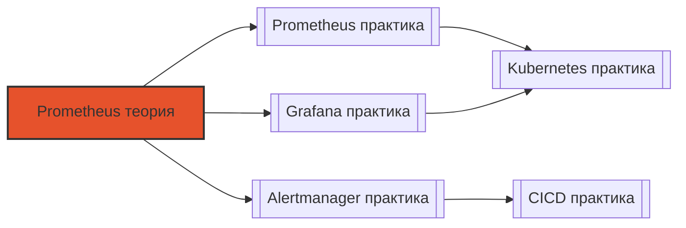

# 📄 Файл: `Prometheus теория.md`

tags: [prometheus, monitoring, observability, theory, architecture, tsdb]
aliases: [prometheus-theory, prometheus-internals, monitoring-concepts]
created: 2026-05-07
---

# 🧠 Prometheus для DevOps: Теория и архитектура

> [!INFO] Структура
> Концепции разделены по уровням: 🟢 Junior → 🟡 Middle → 🔴 Senior.  
> Каждая тема содержит: суть, техническое объяснение, DevOps-контекст и связанные инструменты.

📋 [[#🗂️ Оглавление для навигации|Оглавление]] | [[#🧪 Чек-лист понимания|Чек-лист]] | [[#🔗 Связь с другими файлами|Связи]]

---

## 🗂️ Оглавление для навигации

### 🟢 Junior (базовые концепции)
- [[#1. Что такое Prometheus и чем он отличается от Graphite/InfluxDB?|1. Prometheus vs другие TSDB]]
- [[#2. Какие 4 типа метрик существуют в Prometheus и когда их использовать?|2. Типы метрик]]
- [[#3. Как устроена модель данных Prometheus: метрики, лейблы, временные ряды?|3. Модель данных]]
- [[#4. Что такое pull-модель сбора метрик и почему Prometheus её использует?|4. Pull-модель]]
- [[#5. Как работает service discovery в Prometheus и какие типы поддерживаются?|5. Service discovery]]
- [[#6. Что такое scrape interval и evaluation interval? Как их выбирать?|6. Интервалы сбора]]
- [[#7. Как устроен базовый workflow: scrape → TSDB → query → alert?|7. Базовый workflow]]
- [[#8. Что такое экспортеры и зачем они нужны?|8. Экспортеры]]
- [[#9. Как работает PromQL: векторы, операторы, агрегации?|9. Основы PromQL]]
- [[#10. Что такое alerting rules и как они вычисляются?|10. Alerting rules]]

### 🟡 Middle (архитектура, хранение, запросы)
- [[#11. ⭐ Как устроена TSDB Prometheus: блоки, сегменты, индексы?|11. Архитектура TSDB ⭐]]
- [[#12. Что такое cardinality и почему "cardinality explosion" опасен?|12. Cardinality ⭐]]
- [[#13. Как работает relabeling: когда применять и какие действия доступны?|13. Relabeling]]
- [[#14. ⭐ В чём разница между counter, gauge, histogram и summary? Когда что выбрать?|14. Типы метрик: выбор ⭐]]
- [[#15. Как работает `rate()` и `increase()`: экстраполяция и артефакты?|15. Rate и increase]]
- [[#16. Что такое recording rules и как они оптимизируют запросы?|16. Recording rules]]
- [[#17. Как устроен Alertmanager: routing, grouping, inhibition, silencing?|17. Alertmanager архитектура]]
- [[#18. Что такое remote write/read и когда их использовать?|18. Remote read/write]]
- [[#19. Как работает federation и в чём его ограничения?|19. Federation]]
- [[#20. Что такое staleness и как Prometheus определяет "мёртвые" серии?|20. Staleness]]

### 🔴 Senior (масштабирование, internals, trade-offs)
- [[#21. ⭐ Как устроен WAL (Write-Ahead Log) в Prometheus и зачем он нужен?|21. WAL internals ⭐]]
- [[#22. Как работает compaction в TSDB: от head blocks к persistent blocks?|22. Compaction]]
- [[#23. ⭐ Как рассчитать ресурсы для Prometheus: формулы для памяти, диска, CPU?|23. Capacity planning ⭐]]
- [[#24. Почему Prometheus не подходит для long-term storage и какие есть решения?|24. Long-term storage]]
- [[#25. Как работает query engine: от AST до выполнения на time range?|25. Query engine internals]]
- [[#26. Что такое downsampling и как он влияет на точность метрик?|26. Downsampling]]
- [[#27. Как реализовать multi-tenancy в Prometheus: подходы и ограничения?|27. Multi-tenancy]]
- [[#28. В чём архитектурные различия между Thanos, Cortex и Mimir?|28. Thanos vs Cortex vs Mimir]]
- [[#29. Как работает gossip-протокол в Alertmanager для кластеризации?|29. Alertmanager clustering]]
- [[#30. ⭐ Как спроектировать отказоустойчивую observability-платформу на Prometheus?|30. HA архитектура ⭐]]

---

## 🟢 Junior (базовые концепции)

### 1. Что такое Prometheus и чем он отличается от Graphite/InfluxDB?
**Суть**: Prometheus — open-source система мониторинга с pull-моделью, многомерной моделью данных и мощным языком запросов.

**Подробно**:
| Характеристика | Prometheus | Graphite | InfluxDB |
|---------------|------------|----------|----------|
| **Модель сбора** | Pull (по умолчанию) | Push | Push/Pull |
| **Модель данных** | Многомерная (метрика + лейблы) | Иерархическая (точки) | Теги + поля |
| **Язык запросов** | PromQL (мощный, типизированный) | Graphite DSL (простой) | InfluxQL/Flux |
| **Хранилище** | Локальная TSDB + remote write | Whisper files | TSM engine |
| **Alerting** | Встроенный + Alertmanager | Нет (внешние) | Встроенный (базовый) |
| **Service discovery** | Native (K8s, Consul, etc.) | Нет | Ограничено |

**DevOps-контекст**: Prometheus стал де-факто стандартом в Kubernetes-экосистеме благодаря нативной интеграции с K8s SD и гибкости PromQL для SRE-практик.

**Связанные инструменты**: `node_exporter`, `blackbox_exporter`, `kube-state-metrics`, `Alertmanager`.

[[#🗂️ Оглавление для навигации|↑ К оглавлению]]

### 2. Какие 4 типа метрик существуют в Prometheus и когда их использовать?
**Суть**: Counter, Gauge, Histogram, Summary — каждый тип решает специфичную задачу.

**Подробно**:
```
1. Counter (монотонно растёт):
   - Пример: http_requests_total
   - Use case: подсчёт событий, никогда не уменьшается
   - Операции: rate(), increase(), irate()

2. Gauge (может расти/падать):
   - Пример: node_memory_Active_bytes, temperature
   - Use case: текущее состояние, значения с плавающей точкой
   - Операции: любые арифметические

3. Histogram (распределение по бакетам):
   - Пример: http_request_duration_seconds_bucket{le="0.1"}
   - Use case: latency, size distribution
   - Даёт: quantiles, sum, count
   - Минус: фиксированные бакеты, нельзя изменить постфактум

4. Summary (предвычисленные квантили):
   - Пример: http_request_duration_seconds{quantile="0.95"}
   - Use case: когда нужны точные квантили на стороне приложения
   - Минус: квантили нельзя агрегировать между инстансами
```

**DevOps-контекст**: Неправильный выбор типа метрики ведёт к невозможности нужных запросов. Например, нельзя посчитать p95 из Counter.

**Правило выбора**:
- События → Counter
- Текущее состояние → Gauge  
- Распределение с агрегацией → Histogram
- Точные квантили на одном инстансе → Summary

[[#🗂️ Оглавление для навигации|↑ К оглавлению]]

### 3. Как устроена модель данных Prometheus: метрики, лейблы, временные ряды?
**Суть**: Данные = метрика + набор лейблов → уникальный временной ряд (time series).

**Подробно**:
```
Метрика:     http_requests_total
Лейблы:      {method="POST", handler="/api", status="200", instance="api-1:8080"}
Временной ряд: последовательность <timestamp, value> пар

Уникальный идентификатор серии = метрика + отсортированные лейблы:
  http_requests_total{handler="/api",instance="api-1:8080",method="POST",status="200"}
```

**Ключевые свойства**:
- Лейблы — строки, упорядочиваются лексикографически
- Каждая уникальная комбинация = отдельная серия в хранилище
- Лейблы позволяют делать срезы: `http_requests_total{status=~"5.."}`

**DevOps-контекст**: Понимание модели критично для:
- Избегания cardinality explosion (слишком много уникальных серий)
- Правильной фильтрации в запросах
- Эффективного использования памяти в TSDB

**Анти-паттерн**: Не использовать высококардинальные данные как лейблы:
```promql
# ❌ Плохо: user_id может быть миллионы значений
http_requests_total{user_id="12345"}

# ✅ Хорошо: агрегировать или логировать
http_requests_total{endpoint="/profile"}
```

[[#🗂️ Оглавление для навигации|↑ К оглавлению]]

### 4. Что такое pull-модель сбора метрик и почему Prometheus её использует?
**Суть**: Prometheus сам инициирует запрос к `/metrics` эндпоинту, а не ждёт, когда приложение пришлёт данные.

**Подробно**:
```
Pull-модель:
  Prometheus ──HTTP GET /metrics──▶ Приложение
  Prometheus ◀──text-format metrics── Приложение

Цикл:
  1. По таймеру (scrape_interval) Prometheus подключается к target
  2. Запрашивает /metrics (или другой path)
  3. Парсит ответ в формате Prometheus text exposition
  4. Записывает в TSDB с текущим timestamp
```

**Преимущества pull**:
- ✅ Prometheus контролирует частоту сбора
- ✅ Легче обнаружить "мёртвые" цели (нет ответа = down)
- ✅ Не нужно менять приложение для отправки метрик
- ✅ Безопаснее: приложение не должно знать адрес Prometheus

**Недостатки**:
- ❌ Сложнее скрейпить динамические/эфемерные цели (решается service discovery)
- ❌ Не подходит для push-сценариев (batch jobs, short-lived tasks) → используется Pushgateway

**DevOps-контекст**: В Kubernetes pull-модель идеально сочетается с Service/Pod discovery: Prometheus автоматически находит новые поды по лейблам.

**Для push-сценариев**: Pushgateway — промежуточный сервис, который принимает метрики от jobs и отдаёт их Prometheus при скрейпе.

[[#🗂️ Оглавление для навигации|↑ К оглавлению]]

### 5. Как работает service discovery в Prometheus и какие типы поддерживаются?
**Суть**: Автоматическое обнаружение целей для скрейпинга без ручного обновления конфига.

**Подробно**:
```
Типы service discovery:
├─ Kubernetes: pods, services, endpoints, nodes, ingress
├─ Consul: services с tags и metadata
├─ DNS: A/AAAA/SRV records
├─ EC2/GCE/Azure: облачные инстансы по тегам
├─ File: список target'ов из файла (обновляется внешним процессом)
├─ Static: ручное указание (без discovery)
```

**Пример для Kubernetes**:
```yaml
scrape_configs:
  - job_name: 'kubernetes-pods'
    kubernetes_sd_configs:
      - role: pod
    relabel_configs:
      # Скрейпить только поды с аннотацией prometheus.io/scrape=true
      - source_labels: [__meta_kubernetes_pod_annotation_prometheus_io_scrape]
        action: keep
        regex: true
      # Использовать аннотированный порт
      - source_labels: [__address__, __meta_kubernetes_pod_annotation_prometheus_io_port]
        action: replace
        regex: ([^:]+)(?::\d+)?;(\d+)
        replacement: $1:$2
        target_label: __address__
```

**DevOps-контекст**: Service discovery — основа динамического мониторинга в cloud-native: новые поды автоматически добавляются в мониторинг, удалённые — удаляются.

**Важно**: `__meta_*` лейблы от SD доступны только в `relabel_configs`, не в метриках.

[[#🗂️ Оглавление для навигации|↑ К оглавлению]]

### 6. Что такое scrape interval и evaluation interval? Как их выбирать?
**Суть**: Два независимых таймера в Prometheus.

**Подробно**:
```
scrape_interval: как часто Prometheus опрашивает target'ы за метриками
  - Типичные значения: 15s, 30s, 60s
  - Меньше = детальнее, но больше нагрузка на target и Prometheus
  - Больше = меньше нагрузка, но можно пропустить короткие пики

[ scrape:15s ]──▶[ метрики ]──▶[ TSDB ]

evaluation_interval: как часто вычисляются rules (alerting/recording)
  - Должен быть кратен scrape_interval для предсказуемости
  - Типичные значения: 15s, 30s, 1m
  - Меньше = быстрее реакция на алерты, но больше CPU

[ eval:30s ]──▶[ правила ]──▶[ алерты / recording ]
```

**Правила выбора**:
1. Начните с `scrape_interval: 30s`, `evaluation_interval: 30s`
2. Для критичных сервисов: `scrape: 15s` (но учтите нагрузку)
3. Для `rate()` используйте окно ≥ 4× scrape_interval для сглаживания
4. `evaluation_interval` не должен быть меньше времени выполнения самых тяжёлых правил

**DevOps-контекст**: Неправильные интервалы → либо шумные алерты, либо пропущенные инциденты. Тестируйте в staging под нагрузкой.

**Формула для rate()**: если `scrape_interval=30s`, используйте `rate(metric[2m])` минимум, чтобы захватить 4+ точки.

[[#🗂️ Оглавление для навигации|↑ К оглавлению]]

### 7. Как устроен базовый workflow: scrape → TSDB → query → alert?
**Суть**: Поток данных в Prometheus: сбор → хранение → запрос → алертинг.

**Подробно**:
```
┌─────────────────────────────────────────┐
│  1. SCRAPE (сбор)                        │
│  • По scrape_interval подключается к target │
│  • GET /metrics, парсинг text-format    │
│  • Добавляет лейблы: job, instance      │
└────────────┬────────────────────────────┘
             ▼
┌─────────────────────────────────────────┐
│  2. TSDB (хранение)                      │
│  • Запись в WAL (Write-Ahead Log)       │
│  • В памяти: Head block (последние 2-3ч)│
│  • На диске: immutable blocks (2h каждый)│
│  • Индексы: по метрикам и лейблам       │
└────────────┬────────────────────────────┘
             ▼
┌─────────────────────────────────────────┐
│  3. QUERY (PromQL)                       │
│  • HTTP API: /api/v1/query, /query_range│
│  • Query engine: парсинг → планирование → выполнение │
│  • Возвращает instant vector или matrix │
└────────────┬────────────────────────────┘
             ▼
┌─────────────────────────────────────────┐
│  4. ALERTING (правила)                   │
│  • По evaluation_interval вычисляются rules │
│  • Активные алерты → Alertmanager       │
│  • Alertmanager: grouping, routing, notify │
└─────────────────────────────────────────┘
```

**DevOps-контекст**: Понимание потока помогает отлаживать проблемы:
- Метрика не появилась? → проверить scrape → TSDB write
- Запрос тормозит? → проверить cardinality → query planning
- Алерт не сработал? → проверить evaluation → Alertmanager routing

**Мониторинг самого Prometheus**:
```promql
prometheus_tsdb_head_samples_appended_total  # сколько семплов записано
prometheus_http_request_duration_seconds_bucket{handler="/api/v1/query"}  # latency запросов
alertmanager_notifications_total  # сколько уведомлений отправлено
```

[[#🗂️ Оглавление для навигации|↑ К оглавлению]]

### 8. Что такое экспортеры и зачем они нужны?
**Суть**: Экспортеры — прокси-сервисы, которые преобразуют метрики из сторонних систем в формат Prometheus.

**Подробно**:
```
Зачем нужны:
• Приложение не экспортирует метрики в Prometheus-формате
• Нужно мониторить инфраструктуру: ОС, сеть, БД, очереди
• Легаси-системы без native metrics

Архитектура:
  [Сторонняя система] ──native API──▶ [Exporter] ──/metrics──▶ [Prometheus]

Популярные экспортеры:
├─ node_exporter: Linux/Unix метрики (CPU, mem, disk, net)
├─ blackbox_exporter: HTTP/TCP/ICMP проверки доступности
├─ mysqld_exporter, postgres_exporter: метрики БД
├─ redis_exporter, kafka_exporter: очереди и кэши
├─ snmp_exporter: сетевое оборудование
├─ jmx_exporter: Java-приложения через JMX
```

**DevOps-контекст**: Экспортеры позволяют унифицировать мониторинг разнородной инфраструктуры без изменения исходных систем.

**Безопасность**: Экспортеры часто требуют доступа к системе → запускать с минимальными привилегиями, изолировать в сети.

**Альтернатива**: Если приложение можно модифицировать — лучше использовать Prometheus client library напрямую.

[[#🗂️ Оглавление для навигации|↑ К оглавлению]]

### 9. Как работает PromQL: векторы, операторы, агрегации?
**Суть**: PromQL — функциональный язык запросов для временных рядов с типизированными векторами.

**Подробно**:
```
Типы векторов:
• Instant vector: одна точка времени на серию
  {__name__="up", job="prometheus"} ⇒ {instance="a": 1, instance="b": 0}
• Range vector: серия точек за период
  http_requests_total[5m] ⇒ массив значений за 5 минут

Операторы:
• Арифметика: +, -, *, /, %, ^
• Сравнение: ==, !=, >, <, >=, <= (возвращают 1/0 или фильтруют)
• Логика: and, or, unless (set operations по лейблам)
• Агрегации: sum, avg, min, max, count, stddev, quantile

Примеры:
  # Сумма по всем инстансам
  sum(rate(http_requests_total[5m]))
  
  # Процент ошибок
  sum(rate(http_requests_total{status=~"5.."}[5m])) 
  / 
  sum(rate(http_requests_total[5m]))
  
  # 95-й перцентиль по бакетам гистограммы
  histogram_quantile(0.95, sum(rate(duration_bucket[5m])) by (le))
```

**DevOps-контекст**: Промежуточное владение PromQL обязательно для DevOps: от простых дашбордов до сложных SLO-запросов.

**Важно**: Агрегации без `by`/`without` удаляют все лейблы — часто это не то, что нужно.

[[#🗂️ Оглавление для навигации|↑ К оглавлению]]

### 10. Что такое alerting rules и как они вычисляются?
**Суть**: Правила, которые периодически вычисляются и генерируют алерты при выполнении условий.

**Подробно**:
```
Структура правила:
- alert: имя алерта
- expr: PromQL-выражение, возвращающее instant vector
- for: как долго условие должно быть истинным перед срабатыванием
- labels: метаданные для группировки/роутинга
- annotations: человекочитаемое описание (поддерживает шаблоны)

Пример:
- alert: HighErrorRate
  expr: sum(rate(http_requests_total{status=~"5.."}[5m])) / sum(rate(http_requests_total[5m])) > 0.05
  for: 2m
  labels:
    severity: warning
    team: backend
  annotations:
    summary: "Error rate > 5% on {{ $labels.job }}"
    description: "Current value: {{ $value | humanizePercentage }}"

Вычисление:
1. По evaluation_interval Prometheus вычисляет expr
2. Если результат > 0 (непустой вектор) → алерт становится Pending
3. Если условие держится ≥ for → алерт становится Firing
4. Firing алерты отправляются в Alertmanager
5. Когда expr возвращает пустой вектор → алерт resolves
```

**DevOps-контекст**: Правильно настроенные `for` и `labels` критичны для снижения alert fatigue и корректного роутинга.

**Шаблонизация**: В `annotations` доступны переменные: `$labels.<name>`, `$value`, `$externalURL`.

[[#🗂️ Оглавление для навигации|↑ К оглавлению]]

---

## 🟡 Middle (архитектура, хранение, запросы)

### 11. ⭐ Как устроена TSDB Prometheus: блоки, сегменты, индексы?
**Суть**: TSDB — специализированное хранилище временных рядов с оптимизацией под запись и диапазонные запросы.

**Подробно**:
```
Иерархия хранения:

1. WAL (Write-Ahead Log) — .wal/
   • Последовательная запись всех новых семплов
   • Гарантирует сохранность при краше
   • Удаляется после создания блока

2. Head block — в памяти
   • Последние 2-3 часа данных (настраивается)
   • Оптимизирован для быстрой записи и recent queries
   • При достижении размера/времени → compaction в блок

3. Immutable blocks — на диске, .tsdb/blocks/
   • Каждый блок: 2 часа данных, ~512MB
   • Структура блока:
     ├── meta.json          # метаданные: min/max time, stats
     ├── index              # inverted index: метрика/лейбл → series IDs
     ├── chunks/            # сжатые данные: <series_id, time_range, encoded_values>
     └─┬ postings/          # offset index для быстрого поиска
       
   • Формат chunks: XOR-delta encoding + zlib compression
   • Индекс: два уровня — по метрикам и по лейблам

4. Compaction:
   • Блоки 2h → 8h → 24h → ... (иерархическая агрегация)
   • Уменьшает количество файлов, ускоряет long-range queries
   • Запускается автоматически или вручную
```

**DevOps-контекст**: Понимание TSDB помогает:
- Тюнить `--storage.tsdb.retention.*` под доступный диск
- Диагностировать медленные запросы (много мелких блоков)
- Планировать миграцию на Thanos для long-term storage

**Команды**:
```bash
# Проверить блоки
ls -lh /prometheus/data/blocks/

# Статистика TSDB через API
curl http://prometheus:9090/api/v1/status/tsdb

# Принудительная компакция
curl -XPOST http://prometheus:9090/api/v1/admin/tsdb/snapshot
```

[[#🗂️ Оглавление для навигации|↑ К оглавлению]]

### 12. Что такое cardinality и почему "cardinality explosion" опасен?
**Суть**: Cardinality = количество уникальных временных рядов; взрыв кардинальности ведёт к росту памяти и деградации производительности.

**Подробно**:
```
Расчёт кардинальности:
  cardinality = ∏ (количество уникальных значений каждого лейбла)

Пример:
  http_requests_total{method, endpoint, status, instance, user_id}
  • method: 5 значений (GET, POST, ...)
  • endpoint: 50
  • status: 20
  • instance: 100
  • user_id: 1_000_000  ← ⚠️ проблема!

  Итого: 5 × 50 × 20 × 100 × 1_000_000 = 50 миллиардов серий!

Последствия высокой кардинальности:
• Память: ~2-3 байта на серию в Head block + индекс
• CPU: больше серий = дольше агрегации в запросах
• Диск: больше блоков, медленнее compaction
• Query latency: O(n) по количеству серий в диапазоне

Причины взрыва:
• Высококардинальные лейблы: user_id, request_id, pod_name (без агрегации)
• Динамические значения: timestamp в лейбле, UUID
• Неконтролируемый рост сервисов/инстансов
```

**DevOps-контекст**: Кардинальность — главный лимитирующий фактор масштабируемости Prometheus. Мониторить обязательно.

**Мониторинг кардинальности**:
```promql
# Топ метрик по количеству серий
topk(10, count by (__name__) ({__name__=~".+"}))

# Уникальные значения лейбла
count by (endpoint) (http_requests_total)

# Общий размер индекса
prometheus_tsdb_index_size_bytes
```

**Решения**:
- Удалить высококардинальные лейблы через `metric_relabel_configs`
- Агрегировать на уровне приложения или recording rules
- Использовать `__name__` и несколько ключевых лейблов вместо "всего подряд"

[[#🗂️ Оглавление для навигации|↑ К оглавлению]]

### 13. Как работает relabeling: когда применять и какие действия доступны?
**Суть**: Relabeling — механизм преобразования лейблов на этапе discovery (до скрейпа) или после скрейпа метрик.

**Подробно**:
```
Два типа relabeling:

1. relabel_configs (применяется к target'ам ДО скрейпа):
   • Работает с __meta_* лейблами от service discovery
   • Влияет на __address__, __metrics_path__, и добавляемые лейблы
   • Не влияет на сами метрики

2. metric_relabel_configs (применяется к метрикам ПОСЛЕ скрейпа):
   • Работает с __name__ и лейблами метрик
   • Может дропать, переименовывать, модифицировать метрики
   • Влияет на то, что попадает в TSDB

Доступные действия (action):
• replace: заменить/добавить лейбл (по умолчанию)
• keep: оставить только совпадающие с regex
• drop: удалить совпадающие с regex
• hashmod: хеш-модуль для sharding
• labelmap: скопировать лейблы по паттерну
• labeldrop/labelkeep: удалить/оставить лейблы по имени
• lowercase/uppercase: регистр

Пример: добавить лейбл 'team' из аннотации K8s
- source_labels: [__meta_kubernetes_pod_annotation_team]
  target_label: team
  regex: (.+)
  action: replace

Пример: дропнуть метрики с user_id
- source_labels: [__name__]
  regex: .*_with_user_id
  action: drop
```

**DevOps-контекст**: Relabeling — мощный инструмент для:
- Стандартизации лейблов без изменения кода приложений
- Снижения кардинальности (дроппинг лишних лейблов)
- Реализации sharding через hashmod

**Важно**: Порядок правил важен! Правила выполняются последовательно.

[[#🗂️ Оглавление для навигации|↑ К оглавлению]]

### 14. ⭐ В чём разница между counter, gauge, histogram и summary? Когда что выбрать?
**Суть**: Каждый тип метрики имеет специфичную семантику и ограничения — неправильный выбор ломает аналитику.

**Подробно**:
```
Counter:
• Монотонно растёт (или сбрасывается при рестарте)
• Семантика: "сколько раз произошло событие"
• Операции: rate(), increase(), irate()
• Нельзя: уменьшать, ставить произвольные значения
• Примеры: requests_total, errors_total, bytes_sent_total

Gauge:
• Может расти и падать произвольно
• Семантика: "текущее значение"
• Операции: любые арифметические, сравнения
• Примеры: temperature, memory_usage, queue_length

Histogram:
• Распределяет наблюдения по предопределённым бакетам
• Экспортирует: _bucket{le}, _sum, _count
• Семантика: "распределение значений"
• Плюсы: можно агрегировать между инстансами, считать квантили постфактум
• Минусы: бакеты фиксированы при компиляции
• Пример: latency с бакетами [0.01, 0.05, 0.1, 0.5, 1, +Inf]

Summary:
• Предвычисляет квантили на стороне приложения (скользящее окно)
• Экспортирует: {quantile="0.5"}, {quantile="0.95"}, _sum, _count
• Семантика: "точные квантили для этого инстанса"
• Плюсы: точные квантили без аппроксимации
• Минусы: нельзя агрегировать квантили между инстансами!
• Пример: p95 latency для одного пода

Выбор:
┌─────────────────┬─────────────┬────────────┐
│ Задача          │ Лучший тип  │ Почему     │
├─────────────────┼─────────────┼────────────┤
│ Подсчёт запросов│ Counter     │ Монотонный │
│ Текущая память  │ Gauge       │ Может падать│
│ Latency (агрегация)│ Histogram│ Агрегируемый│
│ Latency (точный p99 на инстансе)│ Summary│ Точность │
│ Размер ответа   │ Histogram   │ Распределение│
│ Статус очереди  │ Gauge       │ Текущее состояние│
└─────────────────┴─────────────┴────────────┘
```

**DevOps-контекст**: Неправильный выбор типа метрики — частая причина "невозможно посчитать нужную метрику". Планируйте метрики на этапе дизайна сервиса.

**Проверка**: Используйте `promtool check metrics` для валидации экспортируемых метрик.

[[#🗂️ Оглавление для навигации|↑ К оглавлению]]

### 15. Как работает `rate()` и `increase()`: экстраполяция и артефакты?
**Суть**: Функции для работы с counter'ами, использующие экстраполяцию для компенсации пропущенных скрейпов.

**Подробно**:
```
rate(counter[d]):
• Возвращает скорость изменения в секунду
• Формула: (последнее - первое) / (время_между_ними) × экстраполяция
• Экстраполяция: компенсирует, если скрейпы не идеально равномерны
• Возвращает float, даже если counter целочисленный

increase(counter[d]):
• То же, что rate() × d (возвращает абсолютный прирост)
• Может возвращать дробные значения из-за экстраполяции

Артефакты и нюансы:
1. Скачки при рестарте процесса:
   • Counter сбрасывается в 0 → rate() видит "отрицательный" скачок
   • Решение: Prometheus автоматически детектирует сброс и корректирует

2. Дробные значения от increase():
   • increase(http_requests_total[5m]) может вернуть 42.7
   • Это нормально: экстраполяция + компенсация сбросов

3. Окно должно быть ≥ 4× scrape_interval:
   • rate(metric[1m]) при scrape_interval=30s = только 2 точки → шум
   • Рекомендуется: [2m] минимум для 30s скрейпа

4. irate() vs rate():
   • irate() использует последние 2 точки → чувствителен к шуму
   • rate() усредняет по всему окну → стабильнее для алертов

Примеры:
  # Корректно: окно 4× интервал
  rate(http_requests_total[2m])  # при scrape:30s
  
  # Риск шума: окно = интервал
  rate(http_requests_total[30s])  # только 1 интервал!
```

**DevOps-контекст**: Понимание экстраполяции помогает интерпретировать "странные" значения и избегать ложных алертов.

**Правило**: Для алертов используйте `rate()` с окном ≥2м, для дашбордов можно `irate()` для реактивности.

[[#🗂️ Оглавление для навигации|↑ К оглавлению]]

### 16. Что такое recording rules и как они оптимизируют запросы?
**Суть**: Recording rules — предвычисленные метрики, которые сохраняются в TSDB для ускорения сложных запросов.

**Подробно**:
```
Зачем нужны:
• Сложный PromQL-запрос вычисляется раз в N секунд, результат сохраняется как новая метрика
• Графана и алерты используют готовую метрику → меньше нагрузка на query engine
• Упрощает запросы: вместо 20-строчного выражения — одна метрика

Синтаксис:
- record: <имя_новой_метрики>
  expr: <PromQL-выражение>
  labels:
    <дополнительные_лейблы>

Конвенции имён:
• уровень1:уровень2:...:операция:агрегация
• Пример: job:http_requests:rate5m = по джобу, метрика, rate за 5м

Пример:
- record: job:http_errors:rate5m
  expr: sum(rate(http_requests_total{status=~"5.."}[5m])) by (job)

- record: instance:node_cpu:avg_idle
  expr: avg(rate(node_cpu_seconds_total{mode="idle"}[5m])) by (instance)

Как работает:
1. По evaluation_interval вычисляется expr
2. Результат записывается в TSDB как новая серия с именем из 'record'
3. В запросах можно использовать эту метрику напрямую

Оптимизация:
• Без recording rule: 100 дашбордов × сложный запрос = 100 вычислений
• С recording rule: 1 вычисление → 100 дашбордов читают готовое
```

**DevOps-контекст**: Recording rules — must-have для больших инсталляций: снижают latency запросов и CPU нагрузку на Prometheus.

**Важно**: Имя записываемой метрики не должно конфликтовать с существующими — используйте префикс или конвенцию.

[[#🗂️ Оглавление для навигации|↑ К оглавлению]]

### 17. Как устроен Alertmanager: routing, grouping, inhibition, silencing?
**Суть**: Alertmanager — отдельный сервис для дедупликации, группировки и маршрутизации алертов.

**Подробно**:
```
Основные компоненты:

1. Grouping (группировка):
   • Алерты с одинаковыми group_by лейблами объединяются в одно уведомление
   • Уменьшает "шторм" уведомлений при инциденте
   - route:
       group_by: ['alertname', 'service']
       group_wait: 30s      # ждать 30с перед первой отправкой группы
       group_interval: 5m   # ждать 5м перед добавлением нового алерта в группу
       repeat_interval: 4h  # повторять уведомление не чаще 4ч

2. Routing (маршрутизация):
   • Алерты направляются в разные receivers по лейблам
   - route:
       match: {severity: critical}
       receiver: pagerduty-critical
       routes:
         - match: {team: frontend}
           receiver: slack-frontend

3. Inhibition (подавление):
   • Если сработал "старший" алерт, не слать "младшие"
   - inhibit_rules:
       - source_match: {alertname: "ClusterDown"}
         target_match_re: {alertname: ".*"}
         equal: ['cluster']  # подавлять только в том же кластере

4. Silencing (заглушение):
   • Временное отключение алертов через UI или API
   • Используется для плановых работ
   • Не удаляет алерты, только скрывает уведомления

5. Receivers (получатели):
   • Поддерживает: email, Slack, PagerDuty, OpsGenie, Webhook, etc.
   • Каждый receiver настраивает формат и канал уведомления
```

**DevOps-контекст**: Правильная настройка Alertmanager критична для снижения alert fatigue и обеспечения эскалации критичных инцидентов.

**HA режим**: Alertmanager поддерживает кластеризацию через gossip-протокол для отказоустойчивости.

[[#🗂️ Оглавление для навигации|↑ К оглавлению]]

### 18. Что такое remote write/read и когда их использовать?
**Суть**: Механизмы для интеграции Prometheus с внешними системами хранения и запросов.

**Подробно**:
```
remote_write:
• Prometheus PUSH'ит семплы во внешнее хранилище в реальном времени
• Формат: protobuf с сжатием Snappy
• Use cases:
  - Долгосрочное хранение (месяцы/годы)
  - Централизация метрик из множества Prometheus
  - Интеграция с Cortex, Thanos Receive, Mimir, VictoriaMetrics

Конфиг:
  remote_write:
    - url: "https://thanos-receive:19291/api/v1/receive"
      queue_config:
        max_samples_per_send: 1000
        capacity: 10000
        max_shards: 50
      metadata_config:
        send: true  # отправлять метаданные метрик

remote_read:
• Prometheus PULL'ит данные из внешнего хранилища при запросах
• Прозрачно для пользователя: запрос объединяет локальные и удалённые данные
• Use cases:
  - Query long-term данных без хранения всего локально
  - Федерации данных из разных кластеров

Конфиг:
  remote_read:
    - url: "https://thanos-query:10902/api/v1/receive"
      read_recent: true  # читать недавние данные и локально тоже

Trade-offs:
┌─────────────────┬────────────────────────┐
│ Преимущество    │ Недостаток             │
├─────────────────┼────────────────────────┤
│ Масштабируемость│ Сложность отладки      │
│ Долгосрочное хранение│ Задержка синхронизации│
│ Централизация   │ Дополнительные затраты │
│ Гибкость запросов│ Зависимость от сети   │
└─────────────────┴────────────────────────┘
```

**DevOps-контекст**: Remote write/read — основа гибридных архитектур: локальный Prometheus для оперативных задач + централизованное хранилище для истории и кросс-кластерных запросов.

**Мониторинг**:
```promql
prometheus_remote_storage_highest_timestamp_in_seconds  # актуальность отправки
prometheus_remote_storage_samples_pending  # очередь на отправку
prometheus_remote_storage_sent_batch_duration_seconds  # latency отправки
```

[[#🗂️ Оглавление для навигации|↑ К оглавлению]]

### 19. Как работает federation и в чём его ограничения?
**Суть**: Federation — механизм, позволяющий одному Prometheus скрейпить метрики из других Prometheus.

**Подробно**:
```
Как работает:
• Целевой Prometheus экспортирует метрики на специальном эндпоинте /federate
• Источник указывает, какие метрики забирать через параметр 'match[]'
• Формат: тот же Prometheus text exposition

Конфиг источника:
  scrape_configs:
    - job_name: 'federate'
      scrape_interval: 1m
      honor_labels: true  # сохранять оригинальные лейблы
      metrics_path: /federate
      params:
        'match[]':
          - '{job="api-service"}'
          - '{__name__=~"up|http_.*"}'
      static_configs:
        - targets: ['prometheus-eu:9090', 'prometheus-us:9090']

Use cases:
• Агрегация метрик из региональных Prometheus в центральный
• Сбор "золотых сигналов" для глобального дашборда
• Резервное копирование критичных метрик

Ограничения:
• Не масштабируется линейно: каждый target добавляет нагрузку
• Нет автоматического sharding — ручное распределение
• Не подходит для 100+ Prometheus (лучше remote_write в Cortex/Thanos)
• Задержка: федерация работает по таймеру, не real-time

Когда использовать federation:
✅ < 10 Prometheus-инстансов
✅ Нужно агрегировать конкретные метрики
✅ Простота важнее масштабируемости

Когда НЕ использовать:
❌ > 10 инстансов → remote_write + Thanos/Cortex
❌ Нужны cross-cluster joins → Thanos Query
❌ Требуется low-latency → федерация добавляет задержку
```

**DevOps-контекст**: Federation — хороший "быстрый старт" для централизации, но для продакшена с ростом лучше планировать миграцию на Thanos/Mimir.

[[#🗂️ Оглавление для навигации|↑ К оглавлению]]

### 20. Что такое staleness и как Prometheus определяет "мёртвые" серии?
**Суть**: Staleness — механизм определения, когда временной ряд перестал обновляться.

**Подробно**:
```
Правило staleness:
• Если серия не получала новые семплы в течение 5 минут (по умолчанию) → считается "устаревшей"
• При запросах: устаревшие серии не возвращаются (если не использовать special flags)
• В алертах: absent() и другие функции учитывают staleness

Как работает:
1. При скрейпе каждая серия получает последний timestamp
2. Query engine проверяет: если (сейчас - last_timestamp) > 5m → серия stale
3. Stale серии исключаются из результатов (если не указано иное)

Настройка:
• --query.lookback-delta: окно для staleness (default: 5m)
• Меньше = быстрее детектируем "умершие" сервисы, но рискуем исключить задержанные метрики
• Больше = терпимее к задержкам, но медленнее реакция на сбои

Специальные маркеры:
• Приложение может явно послать "stale marker" для серии
• Формат: значение = 0x7ff0000000000002 (special NaN)
• Prometheus интерпретирует это как "серия намеренно завершена"

Use cases:
• Алерт на пропавшие метрики: absent(http_requests_total{...})
• Очистка дашбордов от "зомби"-серий
• Корректная работа rate() при рестартах

Пример алерта:
- alert: ServiceMetricsMissing
  expr: absent(up{job="critical-service"})
  for: 2m  # ждать 2 минуты перед алертом
```

**DevOps-контекст**: Понимание staleness помогает настраивать чувствительность алертов на "пропавшие" сервисы и интерпретировать пустые результаты запросов.

**Важно**: `absent()` работает только с instant vector — не используйте с range selector.

[[#🗂️ Оглавление для навигации|↑ К оглавлению]]

---

## 🔴 Senior (масштабирование, internals, trade-offs)

### 21. ⭐ Как устроен WAL (Write-Ahead Log) в Prometheus и зачем он нужен?
**Суть**: WAL — последовательный журнал записи, обеспечивающий durability данных до их компакции в блоки.

**Подробно**:
```
Архитектура WAL:

1. Назначение:
   • Гарантировать, что данные не потеряются при краше Prometheus
   • Обеспечить быстрый append-only write (без случайных записей)
   • Служить источником для восстановления Head block после рестарта

2. Структура файлов (.wal/):
   • Файлы: 000001, 000002, ... (последовательные номера)
   • Размер файла: ~128MB (настраивается)
   • Формат записи:
     [4B: длина][тип: series/sample/tombstone][данные][CRC32]
   
3. Типы записей:
   • SeriesRecord: регистрация новой серии (метрика + лейблы → series_id)
   • SampleRecord: <series_id, timestamp, value>
   • TombstoneRecord: маркировка серии как удалённой (при relabel drop)

4. Жизненный цикл:
   • Запись: каждый семпл → WAL → Head block (in-memory)
   • Compaction: когда Head block достигает 2ч или размера → создается блок на диске
   • Truncation: WAL-файлы, чьи данные уже в блоках, удаляются
   • Восстановление: при старте читаем WAL с последнего чекапоинта → восстанавливаем Head

5. Оптимизации:
   • Batched writes: несколько семплов в одной записи
   • Async fsync: баланс между durability и производительностью
   • Checkpointing: периодический снэпшот состояния для ускорения восстановления

6. Тюнинг:
   --storage.tsdb.wal-segment-size: размер сегмента (default: 128MB)
   --storage.tsdb.min-block-duration: мин. длительность блока (влияет на частоту compaction)

Производительность:
• WAL: ~100k-1M семплов/сек на ядро (зависит от диска)
• Восстановление: ~10-100MB/сек с диска
```

**DevOps-контекст**: WAL — критичный компонент для reliability. Проблемы с диском (медленный I/O, переполнение) → потеря метрик или падение Prometheus.

**Мониторинг WAL**:
```promql
prometheus_tsdb_wal_corruptions_total  # ошибки записи
prometheus_tsdb_wal_fsync_duration_seconds  # latency fsync
prometheus_tsdb_wal_segment_current  # текущий сегмент

# Алерт на проблемы с WAL
- alert: PrometheusWALCorruption
  expr: increase(prometheus_tsdb_wal_corruptions_total[5m]) > 0
  severity: critical
```

[[#🗂️ Оглавление для навигации|↑ К оглавлению]]

### 22. Как работает compaction в TSDB: от head blocks к persistent blocks?
**Суть**: Compaction — процесс преобразования in-memory данных в оптимизированные on-disk блоки.

**Подробно**:
```
Этапы compaction:

1. Head → Block (первичная компакция):
   • Триггеры: время (2ч по умолчанию) ИЛИ размер (~512MB)
   • Процесс:
     а) Head block замораживается (новые данные идут в новый Head)
     б) Сортировка серий по времени
     в) Кодирование значений: XOR-delta compression
     г) Построение индексов:
        - postings: метрика/лейбл → список series_id
        - symbol table: дедупликация строк (имена метрик, значения лейблов)
     д) Запись блока: meta.json, index, chunks/
   • Результат: immutable block в data/blocks/<ulid>/

2. Vertical compaction (укрупнение блоков):
   • Блоки 2ч → 8ч → 24ч → 48ч → ...
   • Цель: уменьшить количество файлов для long-range queries
   • Происходит в фоне, не блокирует запись/чтение

3. Горизонтальная компакция (слияние перекрывающихся блоков):
   • Если блоки по времени пересекаются (редко, при восстановлении)
   • Объединяются в один блок без дубликатов

4. Очистка:
   • Блоки старше retention удаляются
   • WAL-файлы, чьи данные в блоках, удаляются

Формат блока:
```

├── meta.json          # мин/макс время, статистика, версия
├── index              # inverted index + postings
├── chunks/
│   └── 000001         # сжатые данные: <series, time_range, encoded_values>
├── tombstones         # удалённые серии (для consistency)
└── hash.json          # checksum для integrity check
```

Оптимизации:
• XOR-encoding: для float-значений хранится разница от предыдущего + битовая маска
• Delta-of-delta для временных меток: компактное хранение регулярных интервалов
• Zlib компрессия для чанков

Тюнинг:
--storage.tsdb.min-block-duration: мин. длительность блока (2h default)
--storage.tsdb.max-block-duration: макс. длительность (для vertical compaction)
```

**DevOps-контекст**: Compaction влияет на:
- Query latency: меньше блоков = быстрее диапазонные запросы
- Disk usage: эффективная компрессия экономит место
- Recovery time: больше мелких блоков = дольше восстановление

**Мониторинг**:
```promql
prometheus_tsdb_blocks_loaded  # сколько блоков в памяти
prometheus_tsdb_compactions_total  # сколько компакций выполнено
prometheus_tsdb_compaction_duration_seconds  # время компакции
```

[[#🗂️ Оглавление для навигации|↑ К оглавлению]]

### 23. ⭐ Как рассчитать ресурсы для Prometheus: формулы для памяти, диска, CPU?
**Суть**: Планирование ресурсов на основе характеристик нагрузки: series, ingestion rate, retention.

**Подробно**:
```
Входные параметры:
• S = количество уникальных временных рядов (кардинальность)
• R = rate ingestion (семплов в секунду)
• T = retention period (сколько хранить)
• Q = query load (запросов в секунду)

1. Память (RAM):
   • Head block хранит последние ~2-3 часа данных
   • Оценка: 2-3 байта на серию для индекса + значения
   • Формула: RAM_Head ≈ S × 3B × (head_duration / 1s)
   • Пример: 100k series × 3B × 7200s ≈ 2.1GB
   • Запас: ×2-3 для буферов, query execution, Go runtime
   • Итого: для 100k series → 8GB RAM минимум

2. Диск (для TSDB blocks):
   • После сжатия: ~1-2 байта на серию в час
   • Формула: Disk ≈ S × 1.5B × 3600 × T_hours
   • Пример: 100k series × 1.5B × 24h × 15d ≈ 540GB
   • SSD обязателен: random read для индексов, sequential write для блоков
   • Запас: +20-30% на WAL, overhead, рост

3. CPU:
   • Ingestion: ~1 ядро на 50-100k семплов/сек (зависит от relabeling)
   • Query: зависит от сложности; простой запрос ~10-50ms CPU, сложный — секунды
   • Формула (оценочно): CPU_cores ≈ max(R/100k, Q × avg_query_cost)
   • Пример: 200k семплов/сек + 10 запросов/сек × 100ms = 2 + 1 = 3 ядра

4. Сеть:
   • Ingestion: R × ~50B/семпл (text format) = 200k × 50B = 10MB/s
   • Query responses: зависит от размера результатов
   • Remote write: аналогично ingestion + overhead protobuf

Практический чек-лист для 100k series, 15d retention:
□ RAM: 16GB (8GB минимум + запас)
□ CPU: 4 ядра (2 для ingestion + 2 для queries)
□ Disk: 600GB SSD (540GB данные + 60GB overhead)
□ Network: 1Gbps достаточно

Мониторинг использования:
```promql
# Память
process_resident_memory_bytes{job="prometheus"}

# Диск
prometheus_tsdb_storage_blocks_bytes

# Ingestion rate
rate(prometheus_tsdb_head_samples_appended_total[5m])

# Query latency
histogram_quantile(0.95, rate(prometheus_http_request_duration_seconds_bucket[5m]))
```

**DevOps-контекст**: Недооценка ресурсов → OOM, disk full, slow queries → потеря видимости. Всегда планируйте с запасом и мониторьте утилизацию.

**Автомасштабирование**: В Kubernetes использовать Vertical Pod Autoscaler с лимитами, но не полагаться только на него — Prometheus плохо переносит рестарты с потерей Head block.

[[#🗂️ Оглавление для навигации|↑ К оглавлению]]

### 24. Почему Prometheus не подходит для long-term storage и какие есть решения?
**Суть**: Архитектура Prometheus оптимизирована для оперативного мониторинга, не для архивного хранения.

**Подробно**:
```
Ограничения Prometheus для long-term:

1. Вертикальное масштабирование:
   • Один инстанс = один процесс, одна копия данных
   • Нет встроенного sharding по метрикам или времени
   • Предел: ~1млн серий на инстанс (зависит от ресурсов)

2. Хранение:
   • Локальный диск: ограничено, сложно масштабировать
   • Компакция эффективна до ~1000 блоков, дальше деградация запросов
   • Удаление старых данных (retention) необратимо

3. Доступность:
   • Нет встроенной репликации: падение инстанса = потеря данных в Head
   • HA требует внешнего load balancer + дублирование данных (2× стоимость)

4. Стоимость:
   • Хранить 1млн серий × 1 год локально = терабайты, дорогие SSD
   • Нет tiered storage (hot/cold архивы)

Решения для long-term:

1. Thanos:
   • Sidecar: прикреплён к Prometheus, выгружает блоки в object storage (S3/GCS)
   • Store Gateway: читает блоки из object storage при запросах
   • Query: объединяет данные из множества источников (федерация)
   • Compactor: downsampling + retention для object storage
   • Плюсы: open-source, совместим с Prometheus, глобальный view
   • Минусы: сложность эксплуатации, дополнительные компоненты

2. Cortex / Mimir:
   • Полностью распределённая архитектура: ingesters, distributors, queriers, store
   • Native multi-tenancy, horizontal scaling
   • Object storage + caching layers
   • Mimir = "Cortex от Grafana Labs" с упрощённым деплоем
   • Плюсы: масштабируется до 10M+ серий, enterprise-функции
   • Минусы: высокая операционная сложность, требует экспертизы

3. VictoriaMetrics:
   • Drop-in замена Prometheus с лучшей компрессией и производительностью
   • Поддерживает remote write/read, clustering в enterprise-версии
   • Плюсы: проще чем Thanos/Cortex, хорошая документация
   • Минусы: менее зрелая экосистема, некоторые PromQL-несовместимости

4. Managed services:
   • Grafana Cloud Metrics, AWS Managed Prometheus, Datadog
   • Плюсы: нулевая операционная нагрузка, автоматическое масштабирование
   • Минусы: vendor lock-in, стоимость при больших объёмах

Выбор стратегии:
┌─────────────────┬────────────────────────┐
│ Сценарий        │ Решение                │
├─────────────────┼────────────────────────┤
│ < 100k series, < 30d retention │ Prometheus локально │
│ 100k-1M series, 30-90d │ Prometheus + remote write в Thanos │
│ > 1M series, multi-tenant │ Cortex/Mimir кластер │
│ Нет экспертизы, нужен managed │ Grafana Cloud / AWS AMP │
│ Бюджет ограничен, нужен self-hosted │ VictoriaMetrics cluster │
└─────────────────┴────────────────────────┘
```

**DevOps-контекст**: Не откладывайте планирование long-term storage — миграция "на бегу" сложна и рискованна. Начните с remote_write в object storage даже если не используете Thanos сразу.

[[#🗂️ Оглавление для навигации|↑ К оглавлению]]

### 25. Как работает query engine: от AST до выполнения на time range?
**Суть**: PromQL запрос проходит парсинг, планирование и выполнение с оптимизациями.

**Подробно**:
```
Этапы выполнения запроса:

1. Парсинг → AST (Abstract Syntax Tree):
   • Лексический анализ: токенизация строки запроса
   • Синтаксический разбор: построение дерева операций
   • Пример: sum(rate(http[5m])) by (job)
     └─ AggregateOp(sum, by=[job])
        └─ FunctionCall(rate, [5m])
           └─ VectorSelector(http)

2. Планирование (planning):
   • Определение необходимых данных: какие метрики, лейблы, временной диапазон
   • Оптимизация:
     - Pushdown фильтрации: применить {status="200"} до агрегации
     - Выбор индексов: использовать postings index для быстрого поиска серий
     - Оценка стоимости: выбрать порядок операций для минимизации промежуточных данных

3. Загрузка данных:
   • Query range разбивается на интервалы по шагу (step)
   • Для каждого интервала:
     а) Поиск серий в индексе по метрике и лейблам
     б) Загрузка чанков, покрывающих временной диапазон
     в) Декодирование значений (XOR + zlib)
     г) Интерполяция для точных временных точек (если нужно)

4. Выполнение операций:
   • Векторные операции применяются поэлементно по сериям
   • Агрегации: группировка по лейблам, применение sum/avg/etc.
   • Функции: rate(), histogram_quantile() и др. вычисляются на загруженных данных
   • Результаты кэшируются в памяти для повторного использования в запросе

5. Форматирование ответа:
   • Преобразование внутренних структур в JSON для API
   • Instant query: одна точка времени
   • Range query: массив точек с шагом

Оптимизации:
• Query caching: повторные идентичные запросы возвращают кэш (настраивается)
• Parallel execution: независимые части запроса выполняются параллельно
• Early exit: для boolean операций можно остановить вычисления при первом совпадении

Профилирование запросов:
```bash
# Включить трассировку запроса (для отладки)
?stats=all в API-запросе

# Анализ через /api/v1/status/tsdb
curl 'http://prometheus:9090/api/v1/status/tsdb?stats=all'

# Prometheus UI: Graph → "Explain" (показывает план выполнения)
```

**DevOps-контекст**: Понимание query engine помогает писать эффективные запросы и диагностировать медленные дашборды.

**Правило**: Фильтруйте по лейблам ДО агрегации — это позволяет использовать индексы и уменьшает объём обрабатываемых данных.

[[#🗂️ Оглавление для навигации|↑ К оглавлению]]

### 26. Что такое downsampling и как он влияет на точность метрик?
**Суть**: Downsampling — уменьшение гранулярности данных для старых периодов с сохранением трендов.

**Подробно**:
```
Зачем нужен:
• Хранить все данные с исходной детализацией дорого и избыточно
• Для анализа трендов за недели/месяцы не нужны секундные значения
• Downsampling балансирует точность и стоимость

Как работает (в Thanos Compactor):
1. Исходные блоки: 2 часа, семплы каждые 30с
2. Первый уровень downsampling: 5-минутные агрегаты
   • Для counter: increase за 5м → rate
   • Для gauge: avg/min/max за 5м (настраивается)
   • Для histogram: пересчёт бакетов
3. Второй уровень: 1-часовые агрегаты
   • Аналогично, но на основе 5-минутных данных
4. Хранение:
   • Сырые данные: 15 дней
   • 5-минутные: 90 дней  
   • 1-часовые: 1 год+

Влияние на точность:
┌─────────────────┬────────────────────────┐
│ Операция        │ Точность после downsampling │
├─────────────────┼────────────────────────┤
│ sum/avg         │ Высокая (линейные операции) │
│ min/max         │ Средняя (теряются экстремумы внутри окна) │
│ rate(counter)   │ Высокая (increase сохраняется) │
│ histogram_quantile │ Средняя (аппроксимация бакетов) │
│ stddev          │ Низкая (требует исходных значений) │
└─────────────────┴────────────────────────┘

Конфигурация (Thanos):
  downsampling:
    raw: 0s           # сырые данные не агрегируются сразу
    downsample_5m: 15d  # 5-минутные агрегаты после 15 дней
    downsample_1h: 90d  # 1-часовые после 90 дней

  retention:
    raw: 15d
    downsample_5m: 90d
    downsample_1h: 365d

Как Prometheus/Thanos выбирают гранулярность:
• Query автоматически использует наиболее детальную доступную гранулярность
• Для long-range запросов может переключиться на агрегаты для производительности
• Пользователь может явно указать: ?dedup=partial&partial_response=warn

Best practices:
• Не используйте downsampling для алертов — только для дашбордов и аналитики
• Документируйте, какие метрики теряют точность после агрегации
• Тестируйте запросы на разных гранулярностях перед использованием в production
```

**DevOps-контекст**: Downsampling — ключ к экономии на хранении без потери аналитической ценности. Но требует понимания компромиссов в точности.

**Мониторинг**:
```promql
# Статистика по уровням downsampling (Thanos)
thanos_compact_downsampled_blocks_total
thanos_store_bucket_cache_operation_requests_total
```

[[#🗂️ Оглавление для навигации|↑ К оглавлению]]

### 27. Как реализовать multi-tenancy в Prometheus: подходы и ограничения?
**Суть**: Multi-tenancy — изоляция данных и доступа для разных команд/проектов в одной инфраструктуре мониторинга.

**Подробно**:
```
Проблема:
• В больших организациях 100+ команд хотят свой мониторинг
• Запуск отдельного Prometheus на команду не масштабируется
• Нужна изоляция: команда А не видит метрики команды Б

Подходы:

1. Лейбл-базированная изоляция (Prometheus native):
   • Все метрики имеют лейбл `tenant="team-a"`
   • Query-time фильтрация: запросы обязаны включать {tenant="..."}
   • Реализация:
     - Relabel: добавлять tenant на этапе scrape
     - Query enforcement: proxy (promxy, thanos query) добавляет фильтр
   • Плюсы: просто, не требует изменений в Prometheus
   • Минусы: нет криптографической изоляции, человеческий фактор

2. Separate Prometheus per tenant:
   • Каждая команда — свой Prometheus инстанс
   • Централизация через federation или remote_write в Thanos
   • Плюсы: полная изоляция, независимое масштабирование
   • Минусы: операционный overhead, сложнее глобальный view

3. Thanos Query с тенантами:
   • Thanos Query поддерживает X-Scope-OrgID header
   • Store Gateway фильтрует данные по тенанту при запросе
   • Конфигурация:
     --tenant-header=X-Scope-OrgID
     --default-tenant=global  # fallback
   • Плюсы: единая точка запроса, изоляция на уровне storage
   • Минусы: требует Thanos, сложная настройка RBAC

4. Cortex/Mimir native multi-tenancy:
   • Встроенная поддержка тенантов на всех уровнях
   • Аутентификация: API key / OIDC → tenant ID
   • Изоляция: данные, квоты, лимиты на тенант
   • Плюсы: enterprise-grade, масштабируется
   • Минусы: высокая сложность, требует экспертизы

Пример enforcement через promxy (proxy):
```yaml
global:
  evaluation_interval: 30s

remote_read:
  - url: "http://thanos-query:10902"
    headers:
      X-Scope-OrgID: "team-a"  # жёстко заданный тенант

# Запросы к promxy автоматически получат фильтр по тенанту
```

Безопасность:
• Никогда не доверяйте клиентской фильтрации — всегда валидируйте на сервере
• Используйте network policies для изоляции scrape-трафика
• Логируйте запросы для аудита доступа к метрикам

**DevOps-контекст**: Multi-tenancy — обязательное требование для platform teams. Начинайте с лейбл-изоляции, но планируйте миграцию на Thanos/Cortex при росте.

[[#🗂️ Оглавление для навигации|↑ К оглавлению]]

### 28. В чём архитектурные различия между Thanos, Cortex и Mimir?
**Суть**: Три решения для горизонтального масштабирования Prometheus с разными философиями.

**Подробно**:
```
Сравнительная матрица:

| Критерий              | Thanos                    | Cortex                    | Mimir                     |
|----------------------|---------------------------|---------------------------|---------------------------|
| **Происхождение**    | Сообщество (императивный) | Weaveworks → Grafana Labs | Fork Cortex от Grafana    |
| **Архитектура**      | Sidecar к Prometheus      | Полностью распределённая  | Упрощённая распределённая |
| **Хранилище**        | Object storage (S3/GCS)   | Cassandra/S3 + memcached  | S3/GCS + caching layers   |
| **Масштабирование**  | Вертикальное + federation | Горизонтальное (sharding) | Горизонтальное (auto)     |
| **Multi-tenancy**    | Через query-headers       | Native, mature            | Native, simplified setup  |
| **Query latency**    | Зависит от Prometheus     | Оптимизировано            | Оптимизировано + caching  |
| **Операционная сложность** | Средняя (доп. компоненты) | Высокая (много компонентов) | Средняя (упрощённый деплой) |
| **Community**        | Большая, нейтральная      | Меньше, переход на Mimir  | Растущая, под эгидой Grafana |
| **Документация**     | Хорошая                   | Техническая, сложная      | Отличная, Grafana-style   |
| **Use case fit**     | "Добавить long-term к существующему Prometheus" | "Построить масштабируемую платформу с нуля" | "Cortex-мощность с Prometheus-простотой" |

Компоненты Thanos:
• Sidecar: прикреплён к Prometheus, выгружает блоки в object storage
• Store Gateway: читает блоки из object storage
• Query: объединяет данные из Prometheus + Store Gateway
• Compactor: downsampling, retention, block maintenance
• Receiver: принимает remote_write (опционально)
• Ruler: вычисление alerting rules глобально

Компоненты Mimir (упрощённо):
• Distributor: приём метрик (remote_write), валидация, шардинг
• Ingester: буферизация в памяти, запись в object storage
• Querier: выполнение запросов, кэширование
• Store Gateway: чтение блоков из object storage
• Compactor: downsampling и maintenance
• Ruler: глобальный alerting

Когда выбирать:
✅ Thanos: уже есть Prometheus, нужен long-term storage и глобальный view
✅ Cortex: строите observability-платформу с нуля, есть SRE-команда
✅ Mimir: хотите Cortex-мощность, но с более простым деплоем и поддержкой Grafana

**DevOps-контекст**: Выбор между этими инструментами — стратегическое решение. Ошибка стоит дорого: миграция между ними сложна. Начинайте с чётких требований: масштаб, multi-tenancy, бюджет, экспертиза.

[[#🗂️ Оглавление для навигации|↑ К оглавлению]]

### 29. Как работает gossip-протокол в Alertmanager для кластеризации?
**Суть**: Gossip-протокол обеспечивает eventual consistency между репликами Alertmanager без центрального координатора.

**Подробно**:
```
Зачем кластеризация:
• Отказоустойчивость: падение одного инстанса не прерывает алертинг
• Масштабирование: распределение нагрузки по обработке алертов
• Дедупликация: один алерт от нескольких Prometheus не дублируется

Как работает gossip (на основе Hashicorp memberlist):

1. Обнаружение узлов:
   • При старте узел подключается к известным пирам (--cluster.peer)
   • Периодически обменивается списком известных узлов
   • Новые узлы автоматически добавляются в кластер

2. Распространение состояния:
   • Каждый узел хранит локальную копию состояний алертов
   • При изменении (новый алерт, обновление, resolution):
     а) Изменение помечается с векторными часами (causal ordering)
     б) Рассылается случайным 3 пиром (fanout=3)
     в) Получатели мерджат изменения, разрешая конфликты по времени
   • Eventual consistency: все узлы сходятся к одному состоянию за ~секунды

3. Обработка дубликатов:
   • Несколько Prometheus могут слать один и тот же алерт
   • Alertmanager дедуплицирует по: alertname + лейблы + fingerprint
   • Только первое поступление создаёт запись, остальные игнорируются

4. Отправка уведомлений:
   • Только один узел кластера отправляет уведомление получателю
   • Выбор "ответственного" узла: хеш от fingerprint алерта
   • Если ответственный упал — другой узел подхватывает после timeout

Конфигурация кластера:
```yaml
global:
  resolve_timeout: 5m

cluster:
  listen-address: 0.0.0.0:9094
  peers:
    - alertmanager-0.alertmanager:9094
    - alertmanager-1.alertmanager:9094
    - alertmanager-2.alertmanager:9094
  # Tuning (опционально):
  push_pull_interval: 60s   # sync full state
  gossip_interval: 200ms    # частота gossip-обмена
  membership:
    min_join_backoff: 1s
    max_join_backoff: 1m
```

Требования к сети:
• TCP 9094 между всеми узлами кластера
• UDP 9094 для gossip (если включён)
• Низкая задержка (<100ms) для быстрой консистентности
• Стабильные hostname (не IP, чтобы переживал рестарты подов)

Мониторинг кластера:
```promql
alertmanager_cluster_members  # сколько узлов в кластере
alertmanager_cluster_health_score  # 0-1, чем ближе к 1 тем лучше
alertmanager_cluster_enabled  # включена ли кластеризация

# Алерт на раскол кластера
- alert: AlertmanagerClusterSplit
  expr: alertmanager_cluster_members < 3  # для 3-нодового кластера
  for: 2m
```

**DevOps-контекст**: Gossip-кластеризация Alertmanager — надёжный способ обеспечить HA алертинга, но требует внимания к сетевой конфигурации и мониторингу самого кластера.

[[#🗂️ Оглавление для навигации|↑ К оглавлению]]

### 30. ⭐ Как спроектировать отказоустойчивую observability-платформу на Prometheus?
**Суть**: Архитектура, которая переживает сбои компонентов без потери видимости.

**Подробно**:
```
Принципы отказоустойчивости:

1. Нет единой точки отказа (SPOF):
   • Prometheus: минимум 2 реплики за load balancer
   • Alertmanager: кластер из 3+ узлов (кворум для gossip)
   • Storage: object storage с репликацией (S3/GCS) или RAID

2. Graceful degradation:
   • При потере long-term storage: Prometheus продолжает работать локально
   • При потере одного Prometheus: другие покрывают scrape-нагрузку
   • При сетевом разделении: каждый сегмент работает автономно

3. Изоляция отказов:
   • Разные команды/сервисы → разные scrape jobs → сбой одного не влияет на других
   • Resource limits в Kubernetes: чтобы "шумный сосед" не уронил Prometheus
   • Circuit breakers на remote_write: не блокировать локальную запись при проблемах с внешним хранилищем

Референсная архитектура (средний масштаб):
```
┌─────────────────────────────────┐
│  Kubernetes кластер              │
│  ┌─────────┐  ┌─────────┐       │
│  │Prometheus-1│ │Prometheus-2│  │  ← реплики за LB
│  └────┬────┘  └────┬────┘       │
│       │ scrape     │ scrape     │
│       ▼            ▼            │
│  ┌─────────────────────┐        │
│  │  Приложения + Exporters │     │
│  └─────────────────────┘        │
└────────┬────────────────────────┘
         │ remote_write
         ▼
┌─────────────────────────────────┐
│  Thanos / Mimir кластер         │
│  • Object storage: S3/GCS       │
│  • Query: глобальный view       │
│  • Compactor: downsampling      │
└────────┬────────────────────────┘
         │ query / alerting
         ▼
┌─────────────────────────────────┐
│  Alertmanager кластер (3 узла)  │
│  • Gossip для консистентности   │
│  • Routing: Slack/PagerDuty/etc │
└─────────────────────────────────┘
```

Ключевые настройки:

Prometheus HA:
```yaml
# Одинаковый scrape config на всех репликах
# Уникальный external_label для идентификации:
global:
  external_labels:
    replica: prometheus-1  # или prometheus-2

# Remote write с retry и circuit breaker:
remote_write:
  - url: "https://thanos-receive:19291/api/v1/receive"
    queue_config:
      max_retries: 5
      min_backoff: 1s
      max_backoff: 30s
```

Alertmanager HA:
```yaml
cluster:
  peers:
    - alertmanager-0:9094
    - alertmanager-1:9094
    - alertmanager-2:9094
  # Важно: нечётное число узлов для кворума
```

Мониторинг самой платформы:
```promql
# Prometheus health
up{job="prometheus"} == 0  # алерт на падение реплики

# Alertmanager cluster health
alertmanager_cluster_health_score < 0.9

# Remote write lag
prometheus_remote_storage_highest_timestamp_in_seconds - time() > 300

# Disk pressure
prometheus_tsdb_storage_blocks_bytes / prometheus_tsdb_storage_retention_bytes > 0.8
```

Disaster recovery:
• Регулярные бэкапы object storage (versioning + cross-region replication)
• Документированные runbooks на каждый тип сбоя
• Регулярные chaos-тесты: отключение узлов, сети, диска

**DevOps-контекст**: Отказоустойчивая observability — не опция, а необходимость. Платформа мониторинга должна быть надёжнее, чем системы, которые она мониторит.

**Чек-лист перед продакшеном**:
- [ ] 2+ реплики Prometheus за LB
- [ ] Alertmanager кластер из 3 узлов
- [ ] Object storage с versioning и cross-region replication
- [ ] Resource limits и requests для всех компонентов
- [ ] Алерты на здоровье самой observability-платформы
- [ ] Задокументированные runbooks и регулярные учения
```

[[#🗂️ Оглавление для навигации|↑ К оглавлению]]

---

## 🧪 Чек-лист понимания

- [ ] Понимаю разницу между counter, gauge, histogram и summary и когда что использовать
- [ ] Могу объяснить, как работает pull-модель и service discovery
- [ ] Понимаю архитектуру TSDB: WAL, Head block, immutable blocks
- [ ] Знаю, что такое cardinality и как избежать cardinality explosion
- [ ] Могу настроить relabeling для фильтрации и стандартизации лейблов
- [ ] Понимаю, как работают rate(), increase() и их артефакты
- [ ] Знаю разницу между remote write/read и federation
- [ ] Понимаю принципы multi-tenancy и изоляции данных
- [ ] Могу сравнить Thanos, Cortex и Mimir и выбрать под задачу
- [ ] Понимаю, как спроектировать HA-архитектуру observability-платформы

> [!TIP] Практика
> Лучшее понимание теории — через практику:
> 1. Разверните Prometheus + Grafana локально через docker-compose
> 2. Поэкспериментируйте с cardinality: добавьте лейбл с 1000 значений → посмотрите на память
> 3. Настройте remote_write в MinIO (S3-compatible) → проверьте, как выгружаются блоки
> 4. Сымитируйте сбой: `kill -9` Prometheus → проверьте восстановление из WAL
> 5. Попробуйте Thanos sidecar: подключите к локальному Prometheus → запросите данные через thanos-query

---

## 🔗 Связь с другими файлами

> [!TIP] Следующие шаги
> После проработки теории:
> - [[Prometheus практика]] — отработка запросов и сценариев
> - [[Grafana практика]] — визуализация метрик, дашборды
> - [[Alertmanager практика]] — настройка алертинга и уведомлений
> - [[Kubernetes практика]] — kube-prometheus-stack, service discovery
> - [[CICD практика]] — деплой мониторинга как код (Helm/Terraform)



[[#🗂️ Оглавление для навигации|↑ К оглавлению]]
Observability (теория)
│
├─▶ [[Prometheus практика]]: запросы, алерты, отладка
├─▶ [[Prometheus теория]]: архитектура, TSDB, remote storage ← этот файл
├─▶ [[Grafana практика]]: дашборды, панели, variables
├─▶ [[Alertmanager практика]]: routing, inhibit, silences
├─▶ [[Kubernetes практика]]: kube-prometheus, service discovery
├─▶ [[CICD практика]]: деплой мониторинга как код
├─▶ [[Terraform практика]]: инфраструктура для observability
├─▶ [[Security практика]]: метрики безопасности, audit
└─▶ [[Networking практика]]: blackbox, сетевые метрики