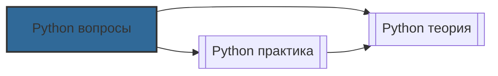

# 📄 Файл: `Python вопросы.md`

tags: [python, devops, interview, questions, scripting, automation, boto3, asyncio]
aliases: [python-questions, python-qa, python-interview]
created: 2026-05-07
---

# 🐍 Python для DevOps: Вопросы для собеседования и самопроверки

> [!INFO] Структура
> Вопросы разделены по уровням: 🟢 Junior → 🟡 Middle → 🔴 Senior.  
> Каждый вопрос содержит: краткий ответ, подробное объяснение, DevOps-контекст и связанные команды/код.

📋 [[#🗂️ Оглавление для навигации|Оглавление]] | [[#🧪 Чек-лист подготовки|Чек-лист]] | [[#🔗 Связь с другими файлами|Связи]]

---

## 🗂️ Оглавление для навигации

### 🟢 Junior (базовое понимание)
- [[#1. Как устроена модель данных Python: объекты, ссылки, мутабельность?|1. Модель данных]]
- [[#2. В чём разница между list, tuple, dict, set и когда что использовать?|2. Коллекции]]
- [[#3. Как правильно работать с файлами и директориями?|3. Файлы и pathlib]]
- [[#4. Почему subprocess.run() предпочтительнее os.system()?|4. subprocess]]
- [[#5. Как обрабатывать ошибки и не ронять скрипт при частичном сбое?|5. Error handling]]
- [[#6. Зачем нужны виртуальные окружения и как фиксировать зависимости?|6. venv и pip]]
- [[#7. Как создать CLI-скрипт с аргументами и help?|7. argparse]]
- [[#8. Почему logging лучше print в production-скриптах?|8. logging]]
- [[#9. Как использовать regex для анализа логов?|9. regex]]
- [[#10. Как объединить файловый ввод-вывод, аргументы и обработку ошибок в одном скрипте?|10. Комплексный скрипт]]

### 🟡 Middle (применение, библиотеки, тестирование)
- [[#11. ⭐ Что такое GIL и как он влияет на многопоточность?|11. GIL ⭐]]
- [[#12. Когда выбирать threading, multiprocessing или asyncio?|12. Concurrency models]]
- [[#13. Как работает async/await и event loop?|13. Async internals]]
- [[#14. Как автоматизировать AWS с помощью boto3?|14. boto3]]
- [[#15. Как управлять Kubernetes через Python-клиент?|15. kubernetes client]]
- [[#16. Как генерировать конфиги динамически?|16. Jinja2]]
- [[#17. Как тестировать скрипты с внешними зависимостями?|17. pytest + mock]]
- [[#18. Как валидировать и управлять конфигурацией приложения?|18. Pydantic]]
- [[#19. Как обрабатывать гигабайтные логи без переполнения памяти?|19. Генераторы]]
- [[#20. Как создать webhook-сервер для интеграции с CI/CD?|20. Webhooks]]

### 🔴 Senior (архитектура, internals, production)
- [[#21. ⭐ Как работает CPython: байт-код, VM, оптимизации?|21. CPython internals ⭐]]
- [[#22. Как работает Garbage Collector и как его тюнить?|22. GC deep dive]]
- [[#23. ⭐ Как профилировать и оптимизировать Python-код?|23. Profiling & optimization ⭐]]
- [[#24. Как устроен packaging: wheels, sdist, pyproject, разрешение зависимостей?|24. Packaging]]
- [[#25. Как реализовать отказоустойчивость: retry, circuit breaker, idempotency?|25. Resilience patterns]]
- [[#26. Как работает multiprocessing: fork vs spawn, IPC?|26. Multiprocessing internals]]
- [[#27. Как обеспечить безопасность Python-кода в production?|27. Security]]
- [[#28. Как интегрировать Python в CI/CD эффективно?|28. CI/CD integration]]
- [[#29. Когда использовать альтернативные интерпретаторы (PyPy, Jython)?|29. Alternative interpreters]]
- [[#30. ⭐ Как спроектировать масштабируемую платформу автоматизации?|30. Platform architecture ⭐]]

---

## 🟢 Junior (базовое понимание)

### 1. Как устроена модель данных Python: объекты, ссылки, мутабельность?
**Кратко**: В Python всё — объект; переменные хранят ссылки на объекты, а не сами значения. Объекты бывают изменяемые (list, dict) и неизменяемые (int, str, tuple).

**Подробно**: Присваивание `b = a` копирует ссылку, а не данные. Изменение мутабельного объекта через одну ссылку видно через все. Для копирования используют `copy()` (shallow) или `copy.deepcopy()` (deep). `is` проверяет идентичность ссылок, `==` — равенство значений.

**DevOps-контекст**: Непонимание ссылок приводит к багам в конфигурациях: изменение "копии" конфига меняет оригинал. Всегда копируй мутабельные дефолты в функциях (`def func(cfg=None): cfg = cfg or {}`).

**Команды/Код**: `id(obj)`, `sys.getrefcount()`, `copy` модуль.

[[#🗂️ Оглавление для навигации|↑ К оглавлению]]

### 2. В чём разница между list, tuple, dict, set и когда что использовать?
**Кратко**: List — изменяемый упорядоченный, tuple — неизменяемый упорядоченный, dict — хэш-таблица ключ-значение, set — хэш-таблица уникальных элементов.

**Подробно**: 
- `list`: O(1) доступ по индексу, O(n) поиск. Для очередей, последовательностей.
- `tuple`: неизменяем, быстрее, можно использовать как ключ dict. Для конфигов, возврата нескольких значений.
- `dict`: O(1) поиск по ключу. Для маппингов, конфигов, кэшей.
- `set`: O(1) проверка принадлежности, операции множеств. Для уникализации, фильтрации.

**DevOps-контекст**: `x in list` — O(n), `x in set` — O(1). При проверке тысяч IP или тегов set ускорит скрипт в десятки раз.

**Команды/Код**: `timeit` для замера, `frozenset` для неизменяемого set.

[[#🗂️ Оглавление для навигации|↑ К оглавлению]]

### 3. Как правильно работать с файлами и директориями?
**Кратко**: Использовать `pathlib` вместо `os.path`: объектный API, кроссплатформенность, безопасное создание путей.

**Подробно**: `Path("dir/file").parent`, `.suffix`, `.exists()`, `.mkdir(parents=True, exist_ok=True)`, `.read_text()`, `.write_text()`. Контекстный менеджер `open()` гарантирует закрытие файла.

**DevOps-контекст**: Очистка временных файлов, ротация логов, подготовка артефактов. `pathlib` снижает риск опечаток в путях и упрощает поддержку.

**Команды/Код**: `from pathlib import Path`, `glob()`, `rglob()`, `stat().st_mtime`.

[[#🗂️ Оглавление для навигации|↑ К оглавлению]]

### 4. Почему subprocess.run() предпочтительнее os.system()?
**Кратко**: `subprocess.run()` безопаснее, контролирует вывод, возвращает код возврата, поддерживает таймауты, не использует shell по умолчанию.

**Подробно**: `os.system()` запускает shell, уязвима к injection, не захватывает stdout/stderr. `subprocess.run(["cmd", "arg"], capture_output=True, text=True, check=True, timeout=10)` возвращает `CompletedProcess` с `stdout`, `stderr`, `returncode`.

**DevOps-контекст**: Запуск docker, kubectl, terraform из скриптов. Никогда не используй `shell=True` с пользовательским вводом.

**Команды/Код**: `subprocess.run()`, `subprocess.Popen()` для потокового чтения.

[[#🗂️ Оглавление для навигации|↑ К оглавлению]]

### 5. Как обрабатывать ошибки и не ронять скрипт при частичном сбое?
**Кратко**: Ловить конкретные исключения, собирать ошибки в список, использовать `try/except/else/finally`, применять graceful degradation.

**Подробно**: `except Exception as e` — ловить широкие исключения только на верхнем уровне. Лучше `except (ConnectionError, TimeoutError)`. Собирать ошибки: `errors.append(f"{task}: {e}")`. В конце поднять кастомное исключение с отчётом.

**DevOps-контекст**: В пайплайнах и runbook'ах часто нужно выполнить максимум задач и отчитаться о частичном успехе, а не падать на первой ошибке.

**Команды/Код**: `raise CustomError(...) from e`, `logging.exception()`.

[[#🗂️ Оглавление для навигации|↑ К оглавлению]]

### 6. Зачем нужны виртуальные окружения и как фиксировать зависимости?
**Кратко**: `venv` изолирует пакеты от системного Python, предотвращает конфликты версий. `pip freeze > requirements.txt` фиксирует точные версии.

**Подробно**: Системный Python обновляется ОС, что может сломать скрипты. `venv` создаёт изолированную копию интерпретатора и site-packages. `pip install -r requirements.txt` воспроизводит окружение.

**DevOps-контекст**: Никогда не запускай automation в системном Python. В CI кэшируй `.venv` или `~/.cache/pip` для ускорения.

**Команды/Код**: `python3 -m venv .venv`, `source .venv/bin/activate`, `pip freeze`.

[[#🗂️ Оглавление для навигации|↑ К оглавлению]]

### 7. Как создать CLI-скрипт с аргументами и help?
**Кратко**: Использовать `argparse`: автоматически генерирует `--help`, валидирует типы, поддерживает обязательные/опциональные аргументы и флаги.

**Подробно**: `parser.add_argument("--env", choices=["dev","prod"], default="dev")`, `parser.add_argument("--dry-run", action="store_true")`. `parser.parse_args()` возвращает namespace.

**DevOps-контекст**: Внутренние CLI-инструменты должны быть самодокументируемыми. Хороший `argparse` снижает количество тикетов в поддержку.

**Команды/Код**: `argparse`, `sys.exit()` для кодов возврата.

[[#🗂️ Оглавление для навигации|↑ К оглавлению]]

### 8. Почему logging лучше print в production-скриптах?
**Кратко**: `logging` поддерживает уровни, фильтры, хендлеры (файл, syslog, JSON), ротацию, структурирование. `print` — только stdout, без контекста.

**Подробно**: `logging.basicConfig(level=logging.INFO, format="%(asctime)s %(levelname)s %(message)s")`. `logging.handlers.RotatingFileHandler` предотвращает переполнение диска. JSON-формат парсится в Loki/ELK.

**DevOps-контекст**: Централизованное логирование критично для отладки в distributed-системах. `print` теряется в stdout контейнеров, `logging` идёт в стандартные потоки с уровнями.

**Команды/Код**: `logging`, `python-json-logger`, `structlog`.

[[#🗂️ Оглавление для навигации|↑ К оглавлению]]

### 9. Как использовать regex для анализа логов?
**Кратко**: `re.compile()` для предварительной компиляции, именованные группы `(?P<name>...)` для читаемости, `re.finditer()` для потоковой обработки.

**Подробно**: `LOG_RE = re.compile(r'(?P<ip>\d+\.\d+\.\d+\.\d+) .* "(?P<method>\w+) .*" (?P<status>\d{3})')`. `match.group("ip")` быстрее и безопаснее, чем индексация.

**DevOps-контекст**: Быстрый парсинг access/error логов без ELK. Регулярки должны быть строгими, чтобы не ловить шум.

**Команды/Код**: `re`, `collections.Counter`, `timeit`.

[[#🗂️ Оглавление для навигации|↑ К оглавлению]]

### 10. Как объединить файловый ввод-вывод, аргументы и обработку ошибок в одном скрипте?
**Кратко**: Использовать `if __name__ == "__main__":`, `argparse` для CLI, `pathlib` для файлов, `logging` для отчёта, `try/except` для graceful fallback.

**Подробно**: Структура: парсинг аргументов → настройка логгера → основная логика в функции → обработка исключений на верхнем уровне → возврат кода выхода.

**DevOps-контекст**: Production-ready скрипты должны быть переиспользуемыми (импорт без выполнения), предсказуемыми (коды возврата 0/1) и наблюдаемыми (логи).

**Команды/Код**: `sys.exit(0/1)`, `pathlib`, `argparse`, `logging`.

[[#🗂️ Оглавление для навигации|↑ К оглавлению]]

---

## 🟡 Middle (применение, библиотеки, тестирование)

### 11. ⭐ Что такое GIL и как он влияет на многопоточность?
**Кратко**: Global Interpreter Lock — мьютекс, разрешающий только одному потоку выполнять байт-код Python одновременно. Ограничивает CPU-параллелизм, но не влияет на I/O.

**Подробно**: GIL упрощает управление памятью (refcounting) и безопасность C-расширений. Освобождается при I/O, sleep, явном yield. Для CPU-bound задач потоки не дают ускорения. Обход: `multiprocessing`, C-расширения (numpy), async/await.

**DevOps-контекст**: Для health checks, API-запросов, работы с БД — `threading` или `asyncio` эффективны. Для парсинга, вычислений, трансформаций данных — `multiprocessing` или `concurrent.futures.ProcessPoolExecutor`.

**Команды/Код**: `sys.getswitchinterval()`, `threading`, `multiprocessing`.

[[#🗂️ Оглавление для навигации|↑ К оглавлению]]

### 12. Когда выбирать threading, multiprocessing или asyncio?
**Кратко**: 
- `threading`: I/O-bound, умеренная конкурентность, простая синхронизация.
- `multiprocessing`: CPU-bound, изоляция сбоев, обход GIL.
- `asyncio`: High-concurrency I/O (1000+ соединений), кооперативная многозадачность.

**Подробно**: Threading переключается OS, asyncio — в event loop при await. Multiprocessing создаёт отдельные процессы с IPC overhead. Asyncio требует async-friendly библиотек во всём стеке.

**DevOps-контекст**: Health checks 100 сервисов → asyncio. Обработка 10 ГБ логов → multiprocessing + generators. Параллельные API-запросы → asyncio/httpx.

**Команды/Код**: `asyncio.gather()`, `concurrent.futures`, `queue`.

[[#🗂️ Оглавление для навигации|↑ К оглавлению]]

### 13. Как работает async/await и event loop?
**Кратко**: Event loop планирует корутины. `await` приостанавливает корутину, отдаёт управление loop'у, ждёт результат I/O, затем возобновляет. Нет потоков, нет GIL-конкуренции.

**Подробно**: `async def` создаёт coroutine object. `loop.create_task()` планирует выполнение. `await` — точка переключения. Блокирующий код (time.sleep, sync requests) блокирует весь loop.

**DevOps-контекст**: Asyncio ускоряет I/O-bound автоматизации в 10-50×. Никогда не миксуй sync-blocking код внутри async без `loop.run_in_executor()`.

**Команды/Код**: `asyncio.run()`, `httpx.AsyncClient`, `aiofiles`.

[[#🗂️ Оглавление для навигации|↑ К оглавлению]]

### 14. Как автоматизировать AWS с помощью boto3?
**Кратко**: `boto3` — официальный AWS SDK. Использует клиентов (low-level API) и ресурсы (high-level OOP). Аутентификация через IAM-роли, env vars, или config files.

**Подробно**: `s3 = boto3.client("s3")`, `ec2 = boto3.resource("ec2")`. Обрабатывай `ClientError` (AWS возвращает HTTP-ошибки, а не Python-исключения). Используй пагинаторы для больших списков.

**DevOps-контекст**: Автоматизация бэкапов, ротации снапшотов, инвентаризации. В production используй IAM-роли, никогда не хардкодь ключи.

**Команды/Код**: `boto3`, `botocore.exceptions.ClientError`, `aws configure`.

[[#🗂️ Оглавление для навигации|↑ К оглавлению]]

### 15. Как управлять Kubernetes через Python-клиент?
**Кратко**: `kubernetes` клиент предоставляет API для всех ресурсов. `load_incluster_config()` внутри кластера, `load_kube_config()` локально.

**Подробно**: `client.CoreV1Api().list_namespaced_pod()`, `client.AppsV1Api().patch_namespaced_deployment()`. Избегай `subprocess.run(["kubectl", ...])` — это медленнее и менее надёжно. Обрабатывай `ApiException`.

**DevOps-контекст**: Pre-check скрипты, кастомные операторы, динамическое масштабирование, validation webhooks.

**Команды/Код**: `kubernetes`, `kubectl config view --raw`, service accounts.

[[#🗂️ Оглавление для навигации|↑ К оглавлению]]

### 16. Как генерировать конфиги динамически?
**Кратко**: `Jinja2` — шаблонизатор с циклами, условиями, фильтрами. Позволяет отделять данные от представления.

**Подробно**: `Environment(loader=FileSystemLoader("templates"))`, `template.render(context)`. Валидируй результат через `yaml.safe_load()` перед применением. Используй `trim_blocks=True` для чистого вывода.

**DevOps-контекст**: Генерация k8s манифестов, nginx.conf, systemd unit'ов, terraform vars. Заменяет `sed`-хаки и ручное редактирование.

**Команды/Код**: `jinja2`, `yaml`, `envsubst` (альтернатива).

[[#🗂️ Оглавление для навигации|↑ К оглавлению]]

### 17. Как тестировать скрипты с внешними зависимостями?
**Кратко**: `pytest` + `unittest.mock` для изоляции. Мокай только внешние вызовы (API, БД, файлы). Используй `testcontainers` для интеграционных тестов.

**Подробно**: `@patch("module.requests.get")` подменяет объект на время теста. Проверяй `assert_called_once_with()`. Для реальных зависимостей: `PostgresContainer`, `RedisContainer`.

**DevOps-контекст**: Автоматизация без тестов — технический долг. Моки ускоряют unit-тесты, testcontainers ловят проблемы интеграции.

**Команды/Код**: `pytest`, `unittest.mock`, `testcontainers`, `coverage`.

[[#🗂️ Оглавление для навигации|↑ К оглавлению]]

### 18. Как валидировать и управлять конфигурацией приложения?
**Кратко**: `Pydantic` — валидация типов, диапазонов, обязательных полей на старте. `env_prefix` маппит переменные окружения.

**Подробно**: `class Config(BaseModel): env: Literal["dev","prod"]; db_port: int = Field(5432, ge=1)`. Ошибки конфигурации ловятся до бизнес-логики. Поддерживает JSON/YAML загрузку.

**DevOps-контекст**: "Fail fast on bad config" — золотое правило. Pydantic заменяет ручные `assert` и делает конфиги self-documenting.

**Команды/Код**: `pydantic`, `python-dotenv`, `yaml`.

[[#🗂️ Оглавление для навигации|↑ К оглавлению]]

### 19. Как обрабатывать гигабайтные логи без переполнения памяти?
**Кратко**: Использовать генераторы (`yield`) и потоковую обработку. Никогда не делай `file.read()` на больших файлах.

**Подробно**: `def stream_lines(path): with open(path) as f: for line in f: yield line`. Потребление памяти O(1). Комбинируй с `re.finditer()` и `collections.Counter`.

**DevOps-контекст**: Парсинг логов в CI, on-call скрипты, миграции данных. Генераторы позволяют обрабатывать файлы больше RAM.

**Команды/Код**: `yield`, `itertools`, `mmap` (для случайного доступа).

[[#🗂️ Оглавление для навигации|↑ К оглавлению]]

### 20. Как создать webhook-сервер для интеграции с CI/CD?
**Кратко**: `FastAPI` или `Flask` для приёма HTTP-запросов. Валидируй подпись (HMAC), парси JSON, триггерь асинхронные задачи.

**Подробно**: `@app.post("/webhook")`, `hmac.compare_digest()` для защиты от timing-атак. `BackgroundTasks` или очередь (RQ/Celery) для неблокирующей обработки.

**DevOps-контекст**: Связка Git → CI → ChatOps → Deploy. Вебхуки автоматизируют реакции на события без polling.

**Команды/Код**: `fastapi`, `uvicorn`, `hmac`, `hashlib`.

[[#🗂️ Оглавление для навигации|↑ К оглавлению]]

---

## 🔴 Senior (архитектура, internals, production)

### 21. ⭐ Как работает CPython: байт-код, VM, оптимизации?
**Кратко**: CPython компилирует код в платформенно-независимый байт-код, исполняемый стековой VM. Оптимизации: constant folding, peephole, adaptive interpreter (3.11+).

**Подробно**: Исходник → AST → оптимизации → байт-код (.pyc) → VM цикл fetch-decode-execute. `dis` модуль показывает байт-код. Adaptive interpreter специализирует инструкции под типы аргументов на лету.

**DevOps-контекст**: Понимание байт-кода помогает оптимизировать горячие пути. Для CPU-bound задач рассматривай Cython/Numba. Профилируй до оптимизации.

**Команды/Код**: `dis.dis()`, `sys.settrace()`, `python -m compileall`.

[[#🗂️ Оглавление для навигации|↑ К оглавлению]]

### 22. Как работает Garbage Collector и как его тюнить?
**Кратко**: Reference counting освобождает память немедленно. GC обрабатывает циклические ссылки. Поколения (0,1,2) с порогами срабатывания.

**Подробно**: `gc.get_threshold()` → (700, 10, 10). Gen 0 проверяется чаще. `gc.disable()`/`gc.collect()` для критичных по latency участков. `gc.set_debug(gc.DEBUG_SAVEALL)` для отладки утечек.

**DevOps-контекст**: В долгоживущих демонах неправильный тюнинг GC вызывает паузы или утечки. Профилируй память, настраивай пороги под паттерны аллокаций.

**Команды/Код**: `gc` модуль, `tracemalloc`, `objgraph`, `pympler`.

[[#🗂️ Оглавление для навигации|↑ К оглавлению]]

### 23. ⭐ Как профилировать и оптимизировать Python-код?
**Кратко**: Измерь → найди узкое место → оптимизируй алгоритм/структуры → оптимизируй реализацию → валидируй. Используй `cProfile`, `py-spy`, `line_profiler`.

**Подробно**: `py-spy` — sampling profiler, production-safe, без изменения кода. `cProfile` — детерминированный, показывает время по функциям. 80% выигрыша дают алгоритмы и структуры данных, не микрооптимизации.

**DevOps-контекст**: Оптимизация без профилирования — гадание. В CI добавь performance-тесты для критичных путей. Кэшируй результаты, используй async для I/O.

**Команды/Код**: `python -m cProfile -o out.prof script.py`, `py-spy top --pid`, `snakeviz`.

[[#🗂️ Оглавление для навигации|↑ К оглавлению]]

### 24. Как устроен packaging: wheels, sdist, pyproject, разрешение зависимостей?
**Кратко**: `sdist` — исходники, требует сборки. `wheel` — предварительно собранный, быстрая установка. `pyproject.toml` стандартизирует сборку. Resolver ищет совместимые версии.

**Подробно**: `pip` использует SAT-solver. Фиксируй версии в production. `--no-cache-dir` в Docker для воспроизводимости. `pip-audit`/`safety` для сканирования уязвимостей.

**DevOps-контекст**: Надёжный packaging критичен для воспроизводимости деплоев. Кэшируй зависимости в CI, валидируй lock-файлы, сканируй на CVE.

**Команды/Код**: `pip wheel`, `build`, `twine`, `pip-audit`, `poetry export`.

[[#🗂️ Оглавление для навигации|↑ К оглавлению]]

### 25. Как реализовать отказоустойчивость: retry, circuit breaker, idempotency?
**Кратко**: 
- `Retry`: экспоненциальная задержка + jitter для временных сбоев.
- `Circuit breaker`: Open/Half-Open/Closed состояния для предотвращения каскадных сбоев.
- `Idempotency`: одинаковый результат при повторном вызове (ключи, проверка состояния).

**Подробно**: `tenacity` библиотека реализует retry. Idempotency через state store (Redis/DB) + идемпотентность ключи. Circuit breaker через `pybreaker` или кастомную логику.

**DevOps-контекст**: Production-автоматизация должна быть resilient. Интегрируй паттерны во все внешние вызовы. Логируй состояния breaker для отладки.

**Команды/Код**: `tenacity`, `pybreaker`, `hashlib` для ключей, Redis/DB для состояния.

[[#🗂️ Оглавление для навигации|↑ К оглавлению]]

### 26. Как работает multiprocessing: fork vs spawn, IPC?
**Кратко**: `fork` копирует память (быстро, Linux), `spawn` запускает свежий интерпретатор (медленнее, кроссплатформенно). IPC через `Queue`, `Pipe`, `Manager`, `SharedMemory`.

**Подробно**: `set_start_method("spawn")` для предсказуемости. `fork` может копировать открытые соединения → утечки. `SharedMemory` (3.8+) для больших массивов без сериализации.

**DevOps-контекст**: Multiprocessing обходит GIL для CPU-bound задач. Сериализация аргументов/результатов добавляет overhead. Для I/O-bound предпочитай asyncio.

**Команды/Код**: `multiprocessing`, `concurrent.futures.ProcessPoolExecutor`, `queue`.

[[#🗂️ Оглавление для навигации|↑ К оглавлению]]

### 27. Как обеспечить безопасность Python-кода в production?
**Кратко**: Валидируй ввод, избегай `eval/exec/pickle` с ненадёжными данными, сканируй зависимости, фиксируй версии, изолируй выполнение.

**Подробно**: `ast.literal_eval()` вместо `eval()`. `json.loads()` вместо `pickle.loads()`. `subprocess.run(["cmd", arg])` вместо `shell=True`. `pip-audit`, `safety`, `gitleaks` в CI. Контейнеризация + non-root + seccomp.

**DevOps-контекст**: Скрипты часто работают с высокими привилегиями. Supply chain атаки реальны. Валидация, сканирование, изоляция — must-have.

**Команды/Код**: `pip-audit`, `safety check`, `bandit`, `gitleaks`, `docker run --read-only`.

[[#🗂️ Оглавление для навигации|↑ К оглавлению]]

### 28. Как интегрировать Python в CI/CD эффективно?
**Кратко**: Кэшируй `.venv` и pip-cache, параллельно запускай тесты (`pytest -n auto`), сохраняй артефакты (отчёты, coverage), изолируй окружение.

**Подробно**: Ключ кэша = хеш от `requirements.txt`. Multi-stage Docker для сборки. `tox`/`nox` для тестирования на нескольких версиях Python. Фиксируй базовый образ.

**DevOps-контекст**: Эффективный CI ускоряет feedback loop. Кэширование сокращает время в 3-10×. Параллелизм и артефакты улучшают диагностику.

**Команды/Код**: GitLab CI/GitHub Actions cache, `pytest-xdist`, `coverage`, `tox`.

[[#🗂️ Оглавление для навигации|↑ К оглавлению]]

### 29. Когда использовать альтернативные интерпретаторы (PyPy, Jython)?
**Кратко**: `PyPy` (JIT) — для долгоживущих CPU-bound сервисов (2-10× быстрее). `Jython`/`IronPython` — только для интеграции с JVM/.NET. `CPython` — безопасный выбор по умолчанию.

**Подробно**: PyPy не совместим со всеми C-расширениями. Startup time медленнее. Для CLI-скриптов не подходит. Всегда тестируй на целевом интерпретаторе.

**DevOps-контекст**: Рассматривай PyPy для демонов, обработчиков очередей, вычислительных задач. Для автоматизации и CLI оставайся на CPython.

**Команды/Код**: `pypy3`, `jython`, `benchmark` скрипты.

[[#🗂️ Оглавление для навигации|↑ К оглавлению]]

### 30. ⭐ Как спроектировать масштабируемую платформу автоматизации?
**Кратко**: Clean Architecture, Dependency Injection, конфигурация как код, надёжность по умолчанию (retry/circuit breaker/idempotency), observability (логи/метрики/трейсы), тестируемость.

**Подробно**: Раздели domain/application/infrastructure. Валидируй конфиги на старте. Секреты — отдельно (Vault). Структурированные JSON-логи с correlation ID. Prometheus метрики для ключевых операций. Unit + integration + contract тесты.

**DevOps-контекст**: Эти принципы отличают enterprise-платформы от скриптов. Инвестиции в архитектуру окупаются при масштабировании команды. Начинай с малого, закладывай возможность роста.

**Команды/Код**: `pydantic`, `opentelemetry`, `prometheus-client`, `testcontainers`, `injector`.

[[#🗂️ Оглавление для навигации|↑ К оглавлению]]

---

## 🧪 Чек-лист подготовки к собеседованию

- [ ] Могу объяснить модель данных Python и избежать багов со ссылками
- [ ] Знаю сложность операций для list/dict/set и выбираю правильную структуру
- [ ] Понимаю влияние GIL и выбираю threading/multiprocessing/asyncio под задачу
- [ ] Умею работать с boto3 и kubernetes client для облачной автоматизации
- [ ] Могу генерировать конфиги через Jinja2 и валидировать через Pydantic
- [ ] Пишу тесты с pytest, мокую зависимости, использую testcontainers
- [ ] Понимаю internals: байт-код, GC, packaging, resolver зависимостей
- [ ] Применяю resilience patterns: retry, circuit breaker, idempotency
- [ ] Интегрирую Python в CI/CD с кэшированием, параллелизмом, security scanning
- [ ] Могу спроектировать отказоустойчивую, наблюдаемую платформу автоматизации

> [!TIP] Практика
> Лучшая подготовка — симуляция собеседования:
> 1. Объясни GIL и как его обойти за 2 минуты
> 2. Напиши на доске async health check для 100 сервисов
> 3. Спроектируй idempotent deploy-операцию с retry и state store
> 4. Объясни разницу между fork и spawn в multiprocessing
> 5. Пройди mock-интервью с фокусом на production-ready автоматизацию

---

## 🔗 Связь с другими файлами

> [!TIP] Следующие шаги
> После проработки вопросов:
> - [[Python практика]]: отработка сценариев на практике
> - [[Python теория]]: глубокое понимание internals и архитектуры
> - [[CICD практика]]: интеграция Python-инструментов в пайплайны
> - [[Kubernetes практика]]: операторы, controllers, k8s Python client deep dive
> - [[Cloud практика]]: boto3, azure-mgmt, google-cloud автоматизация

[[#🗂️ Оглавление для навигации|↑ К оглавлению]]
DevOps_start-main
├── 00_Fundamentals
│   ├── Linux
│   ├── Networking
│   └── Scripting
│       ├── [[Python практика]]
│       ├── [[Python теория]]
│       ├── [[Python вопросы]] ← этот файл
│       └── Bash практика
├── 01_Version_Control
│   └── Git
├── 02_Containers
│   ├── Docker
│   └── Kubernetes
├── 03_Infrastructure
│   ├── Terraform
│   ├── Ansible
│   └── AWS_Cloud
├── 04_CI_CD
│   ├── CI_CD
│   └── GitOps
├── 05_Observability
│   ├── Prometheus
│   ├── Grafana
│   ├── Loki
│   └── Tempo
├── 06_Databases
├── 07_Security
├── 08_Advanced
└── Roadmap