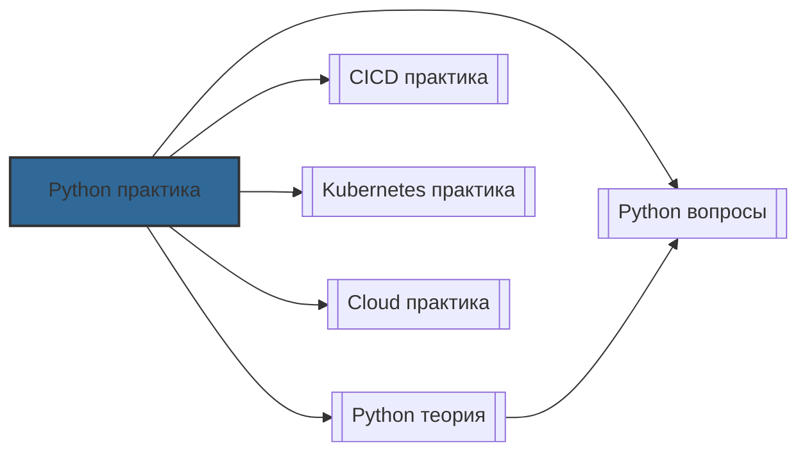

# 📄 Файл: `Python практика.md`

tags: [python, devops, scripting, automation, boto3, kubernetes, pytest, asyncio]
aliases: [python-practice, devops-python, python-automation]
created: 2026-05-07
---

# 🐍 Python для DevOps: Практические сценарии и упражнения

> [!INFO] Структура
> Сценарии разделены по уровням: 🟢 Junior →  Middle → 🔴 Senior.  
> Каждый сценарий содержит: задачу, решение, разбор и DevOps-контекст.

📋 [[#🗂️ Оглавление для навигации|Оглавление]] | [[#🧪 Чек-лист навыков|Чек-лист]] | [[#🔗 Связь с другими файлами|Связи]]

---

## 🗂️ Оглавление для навигации

### 🟢 Junior (базовые скрипты и автоматизация)
- [[#1. Работа с файлами и директориями: pathlib vs os|1. Файлы и pathlib]]
- [[#2. Запуск системных команд: subprocess.run()|2. subprocess]]
- [[#3. Парсинг JSON и YAML конфигов|3. JSON/YAML парсинг]]
- [[#4. HTTP-запросы и health checks: requests|4. requests библиотека]]
- [[#5. Регулярные выражения для анализа логов|5. regex и логи]]
- [[#6. Правильное логирование: logging vs print|6. logging модуль]]
- [[#7. Виртуальные окружения и управление зависимостями|7. venv и pip]]
- [[#8. Аргументы командной строки: argparse|8. argparse CLI]]
- [[#9. Обработка ошибок и graceful degradation|9. Error handling]]
- [[#10. Скрипт-объединение: лог-анализатор с отчётом|10. Мини-проект: log analyzer]]

### 🟡 Middle (облака, k8s, асинхронность, тесты)
- [[#11. ⭐ Автоматизация AWS: boto3 для S3/EC2|11. boto3 automation ⭐]]
- [[#12. Взаимодействие с Kubernetes через Python клиент|12. kubernetes client]]
- [[#13. Асинхронные запросы: asyncio + httpx/aiohttp|13. asyncio concurrency]]
- [[#14. Динамическая генерация конфигов: Jinja2|14. Jinja2 templating]]
- [[#15. Тестирование скриптов: pytest + mock|15. pytest testing]]
- [[#16. Валидация и управление настройками: pydantic|16. pydantic config]]
- [[#17. Эффективная обработка больших логов: генераторы|17. Generators & streams]]
- [[#18. Приём вебхуков: FastAPI/Flask для CI/CD уведомлений|18. Webhooks server]]
- [[#19. Упаковка и распространение инструментов: poetry/pyproject|19. Packaging]]
- [[#20. Безопасная работа с секретами: hvac/vault integration|20. Secrets management]]

### 🔴 Senior (архитектура, производительность, enterprise)
- [[#21. ⭐ Production-grade CLI: Typer/Click с автодополнением|21. Advanced CLI ⭐]]
- [[#22. Асинхронные микросервисы автоматизации|22. Async automation services]]
- [[#23. Kubernetes Operators и Controllers на Python|23. K8s Operators]]
- [[#24. Профилирование и оптимизация: cProfile, py-spy, memory leaks|24. Profiling & perf]]
- [[#25. Интеграция в CI/CD: кэширование, параллелизм, артефакты|25. CI/CD patterns]]
- [[#26. Продвинутое тестирование: testcontainers, property-based testing|26. Advanced testing]]
- [[#27. Безопасность кода: bandit, safety, secrets scanning в пайплайне|27. Security scanning]]
- [[#28. Архитектурные паттерны для внутренних платформ|28. Platform architecture]]
- [[#29. Контейнеризация Python-инструментов: multi-stage, distroless|29. Containerization]]
- [[#30. ⭐ Проектирование отказоустойчивых автоматизаций: retry, idempotency, observability|30. Resilient automation ⭐]]

---

## 🟢 Junior (базовые скрипты и автоматизация)

### 1. Работа с файлами и директориями: pathlib vs os
**Задача**: Создать структуру папок, записать конфиг, очистить временные файлы старше 7 дней.

**Решение**:
```python
from pathlib import Path
import shutil
from datetime import datetime, timedelta

def setup_workspace():
    base = Path("/tmp/devops-workspace")
    (base / "configs").mkdir(parents=True, exist_ok=True)
    (base / "logs").mkdir(exist_ok=True)
    
    # Записать конфиг
    (base / "configs" / "app.yaml").write_text("env: prod\nreplicas: 3")
    
    # Очистить старые логи
    cutoff = datetime.now() - timedelta(days=7)
    for log_file in (base / "logs").glob("*.log"):
        if log_file.stat().st_mtime < cutoff.timestamp():
            log_file.unlink()
            print(f"Удалён: {log_file}")

setup_workspace()
```

**Разбор**: 
- `pathlib` предпочтительнее `os.path`: объектный API, кроссплатформенность, меньше boilerplate
- `parents=True, exist_ok=True` безопасно создаёт вложенные директории
- `stat().st_mtime` возвращает Unix timestamp для сравнения

**DevOps-контекст**: Основа для скриптов очистки, бэкапов, подготовки окружений. Всегда используй `pathlib` в новых проектах.

[[#🗂️ Оглавление для навигации|↑ К оглавлению]]

### 2. Запуск системных команд: subprocess.run()
**Задача**: Выполнить `docker ps`, проверить статус, получить вывод без блокировки.

**Решение**:
```python
import subprocess
import sys

def check_docker():
    try:
        result = subprocess.run(
            ["docker", "ps", "--format", "{{.Names}}"],
            capture_output=True, text=True, check=True, timeout=10
        )
        containers = result.stdout.strip().split("\n")
        print(f"Активные контейнеры: {len(containers)}")
        return containers
    except subprocess.CalledProcessError as e:
        print(f"Docker error: {e.stderr}", file=sys.stderr)
        sys.exit(1)
    except subprocess.TimeoutExpired:
        print("Docker не ответил за 10 секунд")
        sys.exit(1)

check_docker()
```

**Разбор**:
- `subprocess.run()` заменяет `os.system()` и `commands`: безопаснее, контролируемый вывод
- `check=True` бросает исключение при non-zero exit code
- `capture_output=True, text=True` возвращает строки вместо байтов
- Никогда не используй `shell=True` без крайней необходимости (риск injection)

**DevOps-контекст**: Интеграция с CLI-утилитами (docker, kubectl, aws, terraform) — частая задача автоматизации.

[[#🗂️ Оглавление для навигации|↑ К оглавлению]]

### 3. Парсинг JSON и YAML конфигов
**Задача**: Прочитать конфиг приложения, обновить значение, сохранить обратно.

**Решение**:
```python
import json
import yaml

def update_config(config_path: str, key: str, value):
    with open(config_path, "r") as f:
        # Автоопределение формата по расширению
        if config_path.endswith(".yaml") or config_path.endswith(".yml"):
            config = yaml.safe_load(f)
        else:
            config = json.load(f)
    
    # Обновление вложенного ключа
    keys = key.split(".")
    d = config
    for k in keys[:-1]:
        d = d[k]
    d[keys[-1]] = value
    
    with open(config_path, "w") as f:
        if config_path.endswith(".yaml"):
            yaml.dump(config, f, default_flow_style=False, sort_keys=False)
        else:
            json.dump(config, f, indent=2)

update_config("app.yaml", "database.replicas", 5)
```

**Разбор**:
- `yaml.safe_load()` безопаснее `yaml.load()` (предотвращает выполнение произвольного кода)
- Вложенные ключи через `.` позволяют гибко обновлять конфиги
- `sort_keys=False` сохраняет порядок полей (важно для читаемости и git-diff)

**DevOps-контекст**: Частая задача в CI/CD: динамически менять версии образов, реплики, флаги фич перед деплоем.

[[#🗂️ Оглавление для навигации|↑ К оглавлению]]

### 4. HTTP-запросы и health checks: requests
**Задача**: Проверить доступность сервиса, повторить при ошибке, вернуть статус.

**Решение**:
```python
import requests
from requests.adapters import HTTPAdapter
from urllib3.util.retry import Retry

def health_check(url: str, retries: int = 3) -> bool:
    session = requests.Session()
    retry_strategy = Retry(
        total=retries,
        backoff_factor=1,
        status_forcelist=[429, 500, 502, 503, 504],
    )
    session.mount("http://", HTTPAdapter(max_retries=retry_strategy))
    session.mount("https://", HTTPAdapter(max_retries=retry_strategy))
    
    try:
        resp = session.get(url, timeout=5)
        resp.raise_for_status()
        return True
    except requests.RequestException as e:
        print(f"Health check failed: {e}")
        return False

print(health_check("http://api.example.com/health"))
```

**Разбор**:
- `Retry` + `HTTPAdapter` реализуют экспоненциальный backoff без ручных циклов
- `status_forcelist` повторяет только при временных ошибках сервера
- `timeout` обязателен: предотвращает вечное зависание скрипта

**DevOps-контекст**: Health checks в пайплайнах, пре-деплой проверки, мониторинг зависимостей.

[[#🗂️ Оглавление для навигации|↑ К оглавлению]]

### 5. Регулярные выражения для анализа логов
**Задача**: Извлечь IP-адреса и коды ошибок из access.log.

**Решение**:
```python
import re
from collections import Counter

LOG_PATTERN = re.compile(
    r'(?P<ip>\d{1,3}(?:\.\d{1,3}){3})\s.*?"\w+\s\S+\sHTTP/\d\.\d"\s(?P<status>\d{3})'
)

def parse_access_log(filepath: str):
    ip_counter = Counter()
    error_codes = Counter()
    
    with open(filepath, "r") as f:
        for line in f:
            match = LOG_PATTERN.search(line)
            if match:
                ip_counter[match.group("ip")] += 1
                status = int(match.group("status"))
                if status >= 400:
                    error_codes[status] += 1
                    
    print("Топ IP:", ip_counter.most_common(5))
    print("Ошибки:", dict(error_codes))

parse_access_log("/var/log/nginx/access.log")
```

**Разбор**:
- Скомпилированный `re.compile` быстрее при многократном использовании
- Именованные группы `(?P<name>...)` улучшают читаемость
- `Counter` оптимизирован для частотного анализа

**DevOps-контекст**: Быстрый анализ логов без тяжёлых инструментов (ELK/Loki). Полезно для ad-hoc расследований и лёгких парсеров.

[[#🗂️ Оглавление для навигации|↑ К оглавлению]]

### 6. Правильное логирование: logging vs print
**Задача**: Настроить структурированное логирование с уровнями, ротацией и JSON-форматом.

**Решение**:
```python
import logging
import logging.handlers
import json

class JsonFormatter(logging.Formatter):
    def format(self, record):
        log_record = {
            "timestamp": self.formatTime(record),
            "level": record.levelname,
            "message": record.getMessage(),
            "module": record.module,
        }
        if record.exc_info:
            log_record["exception"] = self.formatException(record.exc_info)
        return json.dumps(log_record)

def setup_logger():
    logger = logging.getLogger("devops-tool")
    logger.setLevel(logging.INFO)
    
    handler = logging.handlers.RotatingFileHandler(
        "tool.log", maxBytes=10*1024*1024, backupCount=3
    )
    handler.setFormatter(JsonFormatter())
    logger.addHandler(handler)
    
    return logger

log = setup_logger()
log.info("Запуск скрипта", extra={"version": "1.2.0"})
```

**Разбор**:
- `logging` поддерживает уровни, фильтры, хендлеры, форматирование — `print` этого не даёт
- Ротация предотвращает переполнение диска
- JSON-логи парсятся в Loki/ELK без дополнительных парсеров

**DevOps-контекст**: В production-скриптах всегда используй `logging`. Структурированные логи критичны для централизованного мониторинга.

[[#🗂️ Оглавление для навигации|↑ К оглавлению]]

### 7. Виртуальные окружения и управление зависимостями
**Задача**: Изолировать зависимости скрипта, зафиксировать версии, воспроизвести окружение.

**Решение**:
```bash
# Создание и активация
python3 -m venv .venv
source .venv/bin/activate  # Linux/macOS
# .venv\Scripts\activate   # Windows

# Установка и фиксация
pip install requests pyyaml
pip freeze > requirements.txt

# Воспроизведение на другом хосте
pip install -r requirements.txt
```

**Разбор**:
- `venv` изолирует пакеты от системного Python
- `pip freeze` фиксирует точные версии + хеши зависимостей
- В CI/CD используй кэширование `.venv` или `pip install --cache-dir`

**DevOps-контекст**: Никогда не запускай automation-скрипты в системном Python. Изоляция предотвращает конфликты версий и поломки после обновлений ОС.

[[#🗂️ Оглавление для навигации|↑ К оглавлению]]

### 8. Аргументы командной строки: argparse
**Задача**: Создать CLI-скрипт с обязательными/опциональными аргументами, help, валидацией.

**Решение**:
```python
import argparse

def parse_args():
    parser = argparse.ArgumentParser(description="Деплой микросервиса")
    parser.add_argument("--service", required=True, help="Имя сервиса")
    parser.add_argument("--env", choices=["dev", "staging", "prod"], default="dev")
    parser.add_argument("--dry-run", action="store_true", help="Только симуляция")
    parser.add_argument("--replicas", type=int, default=2, help="Количество реплик")
    return parser.parse_args()

args = parse_args()
print(f"Деплой {args.service} в {args.env} ({args.replicas} replicas, dry={args.dry_run})")
```

**Разбор**:
- `argparse` генерирует `--help` автоматически
- `choices` и `type` валидируют ввод до выполнения логики
- `action="store_true"` создаёт булевы флаги

**DevOps-контекст**: CLI-скрипты — основа внутренних платформ. Хороший `argparse` снижает порог входа для разработчиков и предотвращает ошибки ввода.

[[#🗂️ Оглавление для навигации|↑ К оглавлению]]

### 9. Обработка ошибок и graceful degradation
**Задача**: Продолжить выполнение при частичном сбое, собрать все ошибки, вернуть осмысленный отчёт.

**Решение**:
```python
import logging
from typing import List

class TaskError(Exception):
    pass

def run_tasks(tasks: List[str]):
    errors = []
    for task in tasks:
        try:
            # Имитация задачи
            if "fail" in task:
                raise RuntimeError(f"Task {task} failed")
            print(f"✅ {task}")
        except Exception as e:
            errors.append(f"{task}: {e}")
            logging.warning("Пропущена задача: %s", task)
    
    if errors:
        raise TaskError(f"Завершено с ошибками:\n" + "\n".join(errors))
    print("Все задачи выполнены успешно")

try:
    run_tasks(["deploy-app", "run-tests", "fail-migration", "cleanup"])
except TaskError as e:
    print(f"Критично: {e}")
```

**Разбор**:
- Сбор ошибок в список позволяет показать полную картину, а не падать на первой ошибке
- Кастомные исключения улучшают читаемость и обработку
- `logging.warning` для некритичных сбоев, `raise` для финального отчёта

**DevOps-контекст**: В пайплайнах и автоматизации "fail-fast" не всегда подходит. Часто нужно выполнить всё возможное и отчитаться о частичном успехе.

[[#🗂️ Оглавление для навигации|↑ К оглавлению]]

### 10. Скрипт-объединение: лог-анализатор с отчётом
**Задача**: Объединить pathlib, regex, logging, argparse в один production-ready скрипт.

**Решение**:
```python
#!/usr/bin/env python3
import argparse
import logging
import re
from pathlib import Path
from collections import Counter

logging.basicConfig(level=logging.INFO, format="%(levelname)s: %(message)s")

IP_RE = re.compile(r'\b(?:\d{1,3}\.){3}\d{1,3}\b')

def analyze_logs(log_dir: str, threshold: int):
    ip_counts = Counter()
    for log_file in Path(log_dir).glob("*.log"):
        logging.info("Обработка: %s", log_file)
        with open(log_file, "r") as f:
            for line in f:
                for ip in IP_RE.findall(line):
                    ip_counts[ip] += 1
    
    suspicious = {ip: cnt for ip, cnt in ip_counts.items() if cnt > threshold}
    if suspicious:
        logging.warning("Подозрительные IP (> %d запросов):", threshold)
        for ip, cnt in suspicious.items():
            logging.warning("  %s: %d", ip, cnt)
    else:
        logging.info("Аномалий не обнаружено")

if __name__ == "__main__":
    parser = argparse.ArgumentParser()
    parser.add_argument("--dir", required=True, help="Путь к логам")
    parser.add_argument("--threshold", type=int, default=100)
    analyze_logs(**vars(parser.parse_args()))
```

**Разбор**:
- `if __name__ == "__main__":` позволяет импортировать функции без выполнения
- `vars(parser.parse_args())` передаёт аргументы как kwargs
- Комбинация стандартных библиотек покрывает 80% задач автоматизации

**DevOps-контекст**: Такие скрипты легко запускать в CI, cron, или как часть runbook'ов. Главное — тестируемость и читаемость.

[[#🗂️ Оглавление для навигации|↑ К оглавлению]]

---

## 🟡 Middle (облака, k8s, асинхронность, тесты)

### 11. ⭐ Автоматизация AWS: boto3 для S3/EC2
**Задача**: Загрузить бэкап в S3, проверить существование, получить список инстансов.

**Решение**:
```python
import boto3
from botocore.exceptions import ClientError

def upload_backup(bucket: str, key: str, file_path: str):
    s3 = boto3.client("s3")
    try:
        s3.head_object(Bucket=bucket, Key=key)
        print(f"⚠️ Файл уже существует: {key}")
        return
    except ClientError as e:
        if e.response["Error"]["Code"] != "404":
            raise
    
    s3.upload_file(file_path, bucket, key, ExtraArgs={"ServerSideEncryption": "AES256"})
    print(f"✅ Загружено: s3://{bucket}/{key}")

def list_running_instances():
    ec2 = boto3.resource("ec2")
    running = [i for i in ec2.instances.all() if i.state["Name"] == "running"]
    for i in running:
        print(f"{i.id} | {i.instance_type} | {i.private_ip_address}")

upload_backup("my-backups", "db-2024-05-07.sql", "/tmp/dump.sql")
list_running_instances()
```

**Разбор**:
- `boto3` — официальный AWS SDK, поддерживает ресурсы (high-level) и клиенты (low-level)
- `head_object` дешевле `list_objects` для проверки существования
- Всегда обрабатывай `ClientError`: AWS API возвращает 4xx/5xx, а не исключения Python

**DevOps-контекст**: Автоматизация бэкапов, ротации снапшотов, инвентаризации ресурсов. Используй IAM-роли вместо ключей в production.

[[#🗂️ Оглавление для навигации|↑ К оглавлению]]

### 12. Взаимодействие с Kubernetes через Python клиент
**Задача**: Получить статус подов, перезапустить deployment, проверить readiness.

**Решение**:
```python
from kubernetes import client, config
from kubernetes.client.rest import ApiException

def check_pods(namespace: str = "default"):
    config.load_incluster_config()  # или load_kube_config() локально
    v1 = client.CoreV1Api()
    
    pods = v1.list_namespaced_pod(namespace)
    for pod in pods.items:
        status = pod.status.phase
        ready = any(c.ready for c in pod.status.container_statuses or [])
        print(f"{pod.metadata.name}: {status} (ready={ready})")

def restart_deployment(name: str, namespace: str = "default"):
    apps_v1 = client.AppsV1Api()
    patch = {"spec": {"template": {"metadata": {"annotations": {"kubectl.kubernetes.io/restartedAt": "now"}}}}}
    apps_v1.patch_namespaced_deployment(name, namespace, body=patch)
    print(f"🔄 Deployment {name} restarted")

check_pods("production")
```

**Разбор**:
- `load_incluster_config()` работает внутри кластера, `load_kube_config()` — локально
- Аннотация `restartedAt` — стандартный способ перезапуска без `kubectl rollout restart`
- Всегда проверяй `container_statuses` на `None` (бывает в Pending pods)

**DevOps-контекст**: Python-клиент используется в операторах, скриптах пре-чеков, кастомных CI-шагах. Избегай `subprocess.run(["kubectl", ...])` — это медленнее и менее надёжно.

[[#🗂️ Оглавление для навигации|↑ К оглавлению]]

### 13. Асинхронные запросы: asyncio + httpx/aiohttp
**Задача**: Параллельно проверить 100 эндпоинтов, собрать результаты, уложиться в 5 секунд.

**Решение**:
```python
import asyncio
import httpx
from typing import List, Dict

async def check_endpoint(client: httpx.AsyncClient, url: str) -> Dict:
    try:
        resp = await client.get(url, timeout=5.0)
        return {"url": url, "status": resp.status_code, "ok": resp.is_success}
    except Exception as e:
        return {"url": url, "status": 0, "ok": False, "error": str(e)}

async def batch_health_check(urls: List[str], concurrency: int = 20):
    limits = httpx.Limits(max_connections=concurrency)
    async with httpx.AsyncClient(limits=limits) as client:
        tasks = [check_endpoint(client, url) for url in urls]
        results = await asyncio.gather(*tasks, return_exceptions=True)
    
    ok = sum(1 for r in results if isinstance(r, dict) and r["ok"])
    print(f"✅ {ok}/{len(urls)} сервисов доступны")
    return results

urls = [f"http://svc-{i}.internal/health" for i in range(100)]
asyncio.run(batch_health_check(urls))
```

**Разбор**:
- `httpx` поддерживает async/await, HTTP/2, автоматическое управление соединениями
- `asyncio.gather` запускает задачи параллельно, ждёт все
- `Limits` предотвращает открытие тысяч соединений одновременно

**DevOps-контекст**: Синхронные `requests` в цикле убивают время выполнения скриптов. `asyncio` ускоряет health checks, сбор метрик, параллельные деплои в 10-50×.

[[#🗂️ Оглавление для навигации|↑ К оглавлению]]

### 14. Динамическая генерация конфигов: Jinja2
**Задача**: Сгенерировать nginx.conf или k8s manifest из шаблона и данных.

**Решение**:
```python
from jinja2 import Environment, FileSystemLoader

env = Environment(loader=FileSystemLoader("templates"), trim_blocks=True, lstrip_blocks=True)
template = env.get_template("deployment.yaml.j2")

context = {
    "app": "api-gateway",
    "image": "registry.example.com/api:v2.1.0",
    "replicas": 3,
    "env_vars": {"LOG_LEVEL": "info", "DB_HOST": "postgres.prod.svc"}
}

rendered = template.render(context)
with open("output/deployment.yaml", "w") as f:
    f.write(rendered)
print("✅ Манифест сгенерирован")
```

**Шаблон `deployment.yaml.j2`**:
```yaml
apiVersion: apps/v1
kind: Deployment
meta
  name: {{ app }}
spec:
  replicas: {{ replicas }}
  template:
    spec:
      containers:
        - name: {{ app }}
          image: {{ image }}
          env:
            
            - name: {{ key }}
              value: {{ value }}
            
```

**Разбор**:
- Jinja2 — стандарт для templating в DevOps (Ansible, Helm, Salt)
- `trim_blocks/lstrip_blocks` убирает лишние пустые строки
- Валидируй сгенерированный YAML через `yaml.safe_load()` перед применением

**DevOps-контекст**: Генерация манифестов, конфигов балансировщиков, systemd unit'ов. Заменяет ручное редактирование и `sed`-хаки.

[[#🗂️ Оглавление для навигации|↑ К оглавлению]]

### 15. Тестирование скриптов: pytest + mock
**Задача**: Протестировать функцию, которая вызывает внешний API, без реальных запросов.

**Решение**:
```python
# service.py
import requests

def get_user_status(user_id: str) -> str:
    resp = requests.get(f"https://api.example.com/users/{user_id}")
    resp.raise_for_status()
    return resp.json().get("status", "unknown")

# test_service.py
import pytest
from unittest.mock import patch
from service import get_user_status

@patch("service.requests.get")
def test_get_user_status(mock_get):
    mock_resp = type("MockResp", (), {"raise_for_status": lambda self: None, "json": lambda self: {"status": "active"}})()
    mock_get.return_value = mock_resp
    
    status = get_user_status("usr-123")
    assert status == "active"
    mock_get.assert_called_once_with("https://api.example.com/users/usr-123")

@patch("service.requests.get")
def test_get_user_status_api_error(mock_get):
    mock_get.return_value.raise_for_status.side_effect = requests.HTTPError("500")
    with pytest.raises(requests.HTTPError):
        get_user_status("usr-123")
```

**Разбор**:
- `patch` подменяет объект на время теста, не влияя на продакшен
- Мокай только внешние зависимости (API, БД, файловая система)
- `pytest` автоматически находит `test_*.py`, поддерживает фикстуры, параметризацию

**DevOps-контекст**: Автоматизация без тестов — это "надеюсь, сработает". `pytest` + `mock` позволяют безопасно рефакторить и добавлять фичи.

[[#🗂️ Оглавление для навигации|↑ К оглавлению]]

### 16. Валидация и управление настройками: pydantic
**Задача**: Загрузить конфиг из env vars и YAML, валидировать типы, вернуть dataclass-подобный объект.

**Решение**:
```python
from pydantic import BaseModel, Field, ValidationError
from typing import Literal
import os

class AppSettings(BaseModel):
    env: Literal["dev", "staging", "prod"]
    db_host: str = "localhost"
    db_port: int = Field(5432, ge=1, le=65535)
    log_level: str = "INFO"
    max_retries: int = Field(3, ge=0)
    
    class Config:
        env_prefix = "APP_"  # читает APP_ENV, APP_DB_HOST и т.д.

def load_settings() -> AppSettings:
    # Приоритет: env vars > YAML > defaults
    try:
        return AppSettings()
    except ValidationError as e:
        raise RuntimeError(f"Конфиг невалиден:\n{e}") from e

settings = load_settings()
print(f"Running in {settings.env} mode, DB: {settings.db_host}:{settings.db_port}")
```

**Разбор**:
- Pydantic валидирует типы, диапазоны, обязательные поля на старте
- `env_prefix` автоматически маппит переменные окружения
- Ошибки конфигурации ловятся до выполнения бизнес-логики

**DevOps-контекст**: "Fail fast on bad config" — золотое правило. Pydantic заменяет ручные проверки и `assert`'ы, делая конфиги self-documenting.

[[#🗂️ Оглавление для навигации|↑ К оглавлению]]

### 17. Эффективная обработка больших логов: генераторы
**Задача**: Обработать 10 ГБ логов, не загружая всё в память, найти паттерны.

**Решение**:
```python
import re
from typing import Iterator, Dict

ERROR_PATTERN = re.compile(r'\b(ERROR|CRITICAL)\b')

def stream_log_lines(filepath: str) -> Iterator[str]:
    with open(filepath, "r", encoding="utf-8", errors="ignore") as f:
        for line in f:
            yield line.strip()

def extract_errors(log_dir: str) -> Dict[str, int]:
    error_counts = {}
    for log_file in Path(log_dir).glob("*.log"):
        for line in stream_log_lines(str(log_file)):
            if ERROR_PATTERN.search(line):
                # Извлечение компонента: [api-gateway] ERROR ...
                match = re.match(r'\[([\w-]+)\]', line)
                component = match.group(1) if match else "unknown"
                error_counts[component] = error_counts.get(component, 0) + 1
    return error_counts

print(extract_errors("/var/log/services"))
```

**Разбор**:
- Генераторы (`yield`) обрабатывают по одной строке, потребление памяти ~O(1)
- `encoding="utf-8", errors="ignore"` предотвращает падение на битых логах
- Регулярки компилируются один раз, применяются потоково

**DevOps-контекст**: Парсинг гигабайт логов в CI/CD или on-call скриптах. Никогда не делай `file.read()` на больших файлах.

[[#🗂️ Оглавление для навигации|↑ К оглавлению]]

### 18. Приём вебхуков: FastAPI/Flask для CI/CD уведомлений
**Задача**: Создать endpoint для приёма GitLab/GitHub webhooks, валидировать подпись, триггерить действие.

**Решение** (FastAPI):
```python
from fastapi import FastAPI, Request, HTTPException
import hashlib
import hmac
import os

app = FastAPI()
WEBHOOK_SECRET = os.getenv("WEBHOOK_SECRET", "supersecret")

def verify_signature(payload: bytes, signature: str) -> bool:
    expected = hmac.new(WEBHOOK_SECRET.encode(), payload, hashlib.sha256).hexdigest()
    return hmac.compare_digest(f"sha256={expected}", signature)

@app.post("/webhook/deploy")
async def handle_deploy(request: Request):
    sig = request.headers.get("X-Hub-Signature-256")
    if not sig or not verify_signature(await request.body(), sig):
        raise HTTPException(401, "Invalid signature")
    
    data = await request.json()
    if data.get("ref") == "refs/heads/main":
        print("🚀 Triggering deployment for main branch")
        # TODO: запуск пайплайна через API CI/CD
    return {"status": "ok"}
```

**Разбор**:
- `hmac.compare_digest` предотвращает timing-атаки
- Валидация подписи обязательна: иначе кто угодно может триггерить деплой
- FastAPI автоматически парсит JSON, валидирует типы, генерирует OpenAPI-доку

**DevOps-контекст**: Вебхуки связывают Git, CI, мониторинг и чат-боты. Всегда валидируй подпись и логируй входящие события для аудита.

[[#🗂️ Оглавление для навигации|↑ К оглавлению]]

### 19. Упаковка и распространение инструментов: poetry/pyproject
**Задача**: Создать переиспользуемый CLI-инструмент, установить в команду, обновлять без конфликтов.

**Решение** (`pyproject.toml`):
```toml
[tool.poetry]
name = "devops-cli"
version = "1.0.0"
description = "Internal DevOps automation tool"
authors = ["Platform Team <devops@company.com>"]

[tool.poetry.dependencies]
python = "^3.10"
typer = "^0.9.0"
httpx = "^0.27.0"
pydantic = "^2.0.0"

[tool.poetry.scripts]
devops = "devops_cli.main:app"

[build-system]
requires = ["poetry-core"]
build-backend = "poetry.core.masonry.api"
```

```python
# devops_cli/main.py
import typer

app = typer.Typer()

@app.command()
def deploy(service: str, env: str = "dev"):
    """Запустить деплой сервиса в указанное окружение."""
    typer.echo(f"🚀 Deploying {service} to {env}...")

if __name__ == "__main__":
    app()
```

**Разбор**:
- `poetry` управляет зависимостями, виртуальным окружением, сборкой
- `[tool.poetry.scripts]` создаёт исполняемый файл в `PATH`
- `pyproject.toml` — современный стандарт, заменяет `setup.py`

**DevOps-контекст**: Внутренние инструменты должны устанавливаться как `pip install devops-cli`, а не копироваться скриптами. Это даёт версионирование, зависимости, обновления.

[[#🗂️ Оглавление для навигации|↑ К оглавлению]]

### 20. Безопасная работа с секретами: hvac/vault integration
**Задача**: Получить секрет из HashiCorp Vault, использовать в скрипте, не логировать.

**Решение**:
```python
import hvac
import os
from contextlib import contextmanager

@contextmanager
def get_db_credentials():
    client = hvac.Client(url=os.getenv("VAULT_ADDR"))
    client.token = os.getenv("VAULT_TOKEN")  # или AppRole auth
    
    secret = client.secrets.kv.v2.read_secret_version(
        path="database/prod", mount_point="kv"
    )
    creds = secret["data"]["data"]
    
    try:
        yield creds  # Передаём наружу только на время использования
    finally:
        # Очищаем из памяти (насколько возможно в Python)
        creds.clear()

with get_db_credentials() as creds:
    print(f"Подключаемся к {creds['host']} как {creds['username']}")
    # Никогда не логируй creds!
```

**Разбор**:
- Vault хранит секреты централизованно, с аудитом и ротацией
- `contextmanager` гарантирует очистку после использования
- Никогда не сохраняй секреты в переменные окружения надолго или в логи

**DevOps-контекст**: Секреты в коде или env vars — частая причина утечек. Vault + короткие TTL + аудит — стандарт для production.

[[#🗂️ Оглавление для навигации|↑ К оглавлению]]

---

## 🔴 Senior (архитектура, производительность, enterprise)

### 21. ⭐ Production-grade CLI: Typer/Click с автодополнением
**Задача**: Создать CLI с подкомандами, автодополнением, прогресс-барами, конфигурацией из файлов.

**Решение** (Typer):
```python
import typer
from pathlib import Path
from rich.console import Console
from rich.progress import Progress

app = typer.Typer()
console = Console()

@app.command()
def backup(
    source: Path = typer.Argument(..., exists=True, dir_okay=False),
    destination: Path = typer.Argument(...),
    compress: bool = typer.Option(True, "--compress/--no-compress"),
    config: Path = typer.Option(None, "--config", exists=True)
):
    """Создать бэкап файла с опциональным сжатием."""
    if config:
        console.print(f"📄 Загрузка конфига: {config}")
    
    with Progress() as progress:
        task = progress.add_task("Копирование...", total=100)
        # Имитация работы
        for _ in range(100):
            progress.advance(task)
            # time.sleep(0.01)
    console.print(f"✅ Бэкап сохранён в {destination}")

if __name__ == "__main__":
    app()
```

**Разбор**:
- Typer/Click дают `--help`, автодополнение для bash/zsh, валидацию аргументов
- `rich` добавляет цвета, прогресс, таблицы — улучшает UX для команд
- Конфигурация из файлов + env vars + CLI args (приоритет: CLI > env > config)

**DevOps-контекст**: Внутренние CLI — лицо платформы для разработчиков. Хороший UX снижает количество тикетов в поддержку и ускоряет онбординг.

[[#🗂️ Оглавление для навигации|↑ К оглавлению]]

### 22. Асинхронные микросервисы автоматизации
**Задача**: Сервис, принимающий задачи на деплой, ставящий их в очередь, выполняющий асинхронно, возвращающий статус.

**Решение** (FastAPI + asyncio + Redis queue):
```python
from fastapi import FastAPI, BackgroundTasks
import asyncio
import httpx

app = FastAPI()
task_status = {}

async def run_deploy(task_id: str, service: str, env: str):
    task_status[task_id] = "running"
    try:
        # Имитация async вызова к CI API
        async with httpx.AsyncClient() as client:
            await client.post(f"https://ci.example.com/api/deploy", json={"service": service, "env": env})
        task_status[task_id] = "success"
    except Exception as e:
        task_status[task_id] = f"failed: {e}"

@app.post("/deploy")
async def trigger_deploy(service: str, env: str, background_tasks: BackgroundTasks):
    import uuid
    task_id = str(uuid.uuid4())
    background_tasks.add_task(run_deploy, task_id, service, env)
    return {"task_id": task_id, "status": "queued"}

@app.get("/status/{task_id}")
async def get_status(task_id: str):
    return {"task_id": task_id, "status": task_status.get(task_id, "unknown")}
```

**Разбор**:
- `BackgroundTasks` запускает код после ответа клиенту (не блокирует HTTP)
- Для production используй Celery/RQ/ARQ + Redis/RabbitMQ, а не in-memory dict
- Async HTTP позволяет обрабатывать тысячи задач без тредов

**DevOps-контекст**: Автоматизация как сервис: веб-интерфейс, вебхуки, API для внешних систем. Async Python идеален для I/O-bound workloads.

[[#🗂️ Оглавление для навигации|↑ К оглавлению]]

### 23. Kubernetes Operators и Controllers на Python
**Задача**: Создать оператор, который следит за CustomResource и автоматически создаёт ConfigMap.

**Решение** (kopf framework):
```python
import kopf
import kubernetes

@kopf.on.create("mycompany.com", "v1", "customapps")
def create_configmap(spec, meta, **kwargs):
    app_name = meta.name
    replicas = spec.get("replicas", 1)
    
    configmap = kubernetes.client.V1ConfigMap(
        metadata=kubernetes.client.V1ObjectMeta(name=f"{app_name}-config"),
        data={"REPLICAS": str(replicas), "APP_NAME": app_name}
    )
    
    kubernetes.client.CoreV1Api().create_namespaced_config_map(
        namespace=meta.namespace, body=configmap
    )
    kopf.info(f"Создан ConfigMap для {app_name}")

@kopf.on.update("mycompany.com", "v1", "customapps")
def update_configmap(spec, meta, **kwargs):
    # Логика обновления
    pass
```

**Разбор**:
- `kopf` упрощает написание операторов на Python без boilerplate
- Операторы реализуют control loop: watch → diff → reconcile
- Подходит для кастомных ресурсов, автоматической настройки, самовосстановления

**DevOps-контекст**: Операторы — эволюция скриптов. Они декларативны, resilient, интегрируются в k8s lifecycle. Python + kopf снижает порог входа по сравнению с Go.

[[#🗂️ Оглавление для навигации|↑ К оглавлению]]

### 24. Профилирование и оптимизация: cProfile, py-spy, memory leaks
**Задача**: Найти узкое место в скрипте, оптимизировать потребление памяти.

**Решение**:
```bash
# 1. CPU профилирование
python -m cProfile -o profile.prof slow_script.py
snakeviz profile.prof  # визуализация

# 2. Memory профилирование
pip install memory_profiler
mprof run script.py
mprof plot

# 3. Продакшен профилирование (без остановки)
pip install py-spy
py-spy top --pid 12345  # live view
py-spy record -o profile.svg --pid 12345  # flamegraph
```

**Python код с типичной оптимизацией**:
```python
# ❌ Плохо: загрузка всего файла в память
data = open("large.csv").read().split("\n")

# ✅ Хорошо: потоковая обработка
import csv
with open("large.csv") as f:
    reader = csv.DictReader(f)
    for row in reader:
        process(row)  # O(1) memory
```

**Разбор**:
- `cProfile` показывает, какие функции едят CPU
- `py-spy` работает без изменения кода, безопасен для production
- Частая причина memory leaks: глобальные кэши, незакрытые соединения, циклические ссылки

**DevOps-контекст**: Скрипты, работающие с гигабайтами данных или тысячами API-запросов, должны быть оптимизированы. Профилирование экономит время CI и деньги на инфраструктуру.

[[#🗂️ Оглавление для навигации|↑ К оглавлению]]

### 25. Интеграция в CI/CD: кэширование, параллелизм, артефакты
**Задача**: Настроить пайплайн с кэшированием зависимостей, параллельными тестами, артефактами.

**Решение** (GitLab CI пример):
```yaml
stages:
  - test
  - build

variables:
  PIP_CACHE_DIR: "$CI_PROJECT_DIR/.pip-cache"

cache:
  paths:
    - .venv/
    - .pip-cache/

unit-tests:
  stage: test
  script:
    - python -m venv .venv
    - source .venv/bin/activate
    - pip install --cache-dir $PIP_CACHE_DIR -r requirements.txt
    - pytest tests/ -n auto --junitxml=report.xml  # параллельно
  artifacts:
    when: always
    reports:
      junit: report.xml

build-tool:
  stage: build
  script:
    - poetry build
  artifacts:
    paths:
      - dist/*.whl
    expire_in: 1 week
```

**Разбор**:
- Кэширование `.venv` и `pip-cache` ускоряет CI в 3-10×
- `pytest -n auto` распределяет тесты по ядрам
- Артефакты сохраняют результаты между stage'ами

**DevOps-контекст**: Python-инструменты должны интегрироваться в CI как first-class citizens. Кэширование и параллелизм — must-have для больших команд.

[[#🗂️ Оглавление для навигации|↑ К оглавлению]]

### 26. Продвинутое тестирование: testcontainers, property-based testing
**Задача**: Протестировать интеграцию с PostgreSQL и Redis без моков, проверить граничные условия.

**Решение**:
```python
import pytest
from testcontainers.postgres import PostgresContainer
from testcontainers.redis import RedisContainer
from hypothesis import given, strategies as st

@pytest.fixture(scope="module")
def postgres():
    with PostgresContainer("postgres:15") as pg:
        yield pg.get_connection_url()

@pytest.fixture(scope="module")
def redis():
    with RedisContainer("redis:7") as r:
        yield r.get_connection_url()

def test_db_integration(postgres):
    # Реальный тест с настоящим PostgreSQL
    pass

@given(st.text(min_size=1, max_size=100))
def test_config_parser(s):
    # Property-based: проверяет инварианты на случайных входных данных
    from config_parser import parse
    result = parse(s)
    assert isinstance(result, dict)
    assert "validated_at" in result
```

**Разбор**:
- `testcontainers` поднимает реальные Docker-контейнеры для тестов
- `hypothesis` генерирует edge-cases, которые человек не придумает
- Интеграционные тесты ловят несовместимости версий, сетевые проблемы, миграции

**DevOps-контекст**: Моки скрывают реальные проблемы. Testcontainers + property testing дают уверенность при обновлении зависимостей и рефакторинге.

[[#🗂️ Оглавление для навигации|↑ К оглавлению]]

### 27. Безопасность кода: bandit, safety, secrets scanning в пайплайне
**Задача**: Автоматически проверять Python-код на уязвимости, секреты, плохие паттерны.

**Решение** (pre-commit + CI):
```yaml
# .pre-commit-config.yaml
repos:
  - repo: https://github.com/PyCQA/bandit
    rev: 1.7.5
    hooks:
      - id: bandit
        args: ["-r", "-ll", "-f", "json"]  # level high, json output

  - repo: https://github.com/pyupio/safety
    rev: 2.3.5
    hooks:
      - id: safety
        args: ["--json"]

  - repo: https://github.com/gitleaks/gitleaks
    rev: v8.18.0
    hooks:
      - id: gitleaks
```

**CI шаг**:
```bash
pip install bandit safety
bandit -r src/ -ll  # игнорировать low severity
safety check --json --output safety-report.json
# Парсить JSON, фейлить пайплайн при CRITICAL/HIGH
```

**Разбор**:
- `bandit` ищет `eval()`, `subprocess(shell=True)`, хардкод паролей
- `safety` проверяет зависимости против базы CVE
- `gitleaks` ищет секреты в истории Git

**DevOps-контекст**: Security as Code. Автоматические проверки предотвращают попадание уязвимостей и секретов в production. Интегрируй в PR и pre-push.

[[#🗂️ Оглавление для навигации|↑ К оглавлению]]

### 28. Архитектурные паттерны для внутренних платформ
**Задача**: Спроектировать масштабируемый, тестируемый, расширяемый инструмент автоматизации.

**Решение** (Clean Architecture + Dependency Injection):
```python
# domain/models.py
from pydantic import BaseModel

class DeployRequest(BaseModel):
    service: str
    env: str
    version: str

# infrastructure/ci_client.py
class CIClient:
    def trigger_pipeline(self, req: DeployRequest) -> str:
        # Реальная интеграция с GitLab/Jenkins
        return "pipeline-123"

# application/deploy_service.py
class DeployService:
    def __init__(self, ci_client: CIClient):
        self.ci = ci_client
    
    def execute(self, req: DeployRequest) -> str:
        self.validate(req)
        return self.ci.trigger_pipeline(req)
    
    def validate(self, req: DeployRequest):
        if req.env not in ["dev", "staging", "prod"]:
            raise ValueError("Invalid env")

# main.py (composition root)
def main():
    ci = CIClient()
    service = DeployService(ci)
    # CLI / API layer вызывает service.execute()
```

**Разбор**:
- Разделение на domain/application/infrastructure упрощает тестирование и замену реализаций
- Dependency injection позволяет моковать внешние системы
- Pydantic-модели как контракт между слоями

**DevOps-контекст**: Скрипты растут в платформы. Чистая архитектура предотвращает "спагетти-код", позволяет добавлять новые CI-системы, чаты, провайдеры без переписывания ядра.

[[#🗂️ Оглавление для навигации|↑ К оглавлению]]

### 29. Контейнеризация Python-инструментов: multi-stage, distroless
**Задача**: Собрать минимальный, безопасный образ для CLI-инструмента.

**Решение** (Dockerfile):
```dockerfile
# Stage 1: сборка
FROM python:3.12-slim AS builder
WORKDIR /build
COPY pyproject.toml poetry.lock ./
RUN pip install --no-cache-dir poetry && \
    poetry export -f requirements.txt --output requirements.txt --without-hashes

# Stage 2: production (distroless)
FROM gcr.io/distroless/python3-debian12
WORKDIR /app
COPY --from=builder /build/requirements.txt .
RUN python -m pip install --no-cache-dir -r requirements.txt
COPY src/ ./src/
ENTRYPOINT ["python", "-m", "src.cli"]
```

**Разбор**:
- `slim` образ уменьшает размер, убирает ненужные пакеты
- `distroless` не содержит shell, package manager — минимальная attack surface
- Multi-stage отделяет зависимости сборки от runtime
- `--no-cache-dir` экономит место в слоях

**DevOps-контекст**: Контейнеризация инструментов даёт воспроизводимость, изоляцию, простую доставку. Distroless + non-root user = security best practice.

[[#🗂️ Оглавление для навигации|↑ К оглавлению]]

### 30. ⭐ Проектирование отказоустойчивых автоматизаций: retry, idempotency, observability
**Задача**: Скрипт деплоя, который не ломается при временных сбоях, безопасен при повторном запуске, наблюдаем.

**Решение**:
```python
import time
import logging
from tenacity import retry, stop_after_attempt, wait_exponential, retry_if_exception_type
from opentelemetry import trace, metrics

tracer = trace.get_tracer(__name__)
meter = metrics.get_meter(__name__)
deploy_counter = meter.create_counter("deploys_total")

class IdempotentDeploy:
    def __init__(self, state_store):
        self.state = state_store  # Redis/DB для хранения статуса
    
    @retry(
        stop=stop_after_attempt(3),
        wait=wait_exponential(multiplier=1, min=2, max=10),
        retry=retry_if_exception_type((ConnectionError, TimeoutError))
    )
    def execute(self, service: str, version: str):
        with tracer.start_as_current_span("deploy"):
            # Idempotency check
            last = self.state.get(f"deploy:{service}")
            if last == version:
                logging.info("Already deployed: %s==%s", service, version)
                return
            
            logging.info("Deploying %s %s...", service, version)
            # ... реальный деплой ...
            
            self.state.set(f"deploy:{service}", version)
            deploy_counter.add(1, {"service": service})
            logging.info("✅ Deployed successfully")

# Использование
deployer = IdempotentDeploy(RedisStateStore())
deployer.execute("api", "v2.1.0")
```

**Разбор**:
- `tenacity` реализует retry с exponential backoff и jitter
- Idempotency через state store предотвращает дублирование при повторном запуске
- OpenTelemetry даёт трейсы и метрики без привязки к вендору
- Логирование структурное, с контекстом

**DevOps-контекст**: Production-автоматизация должна быть resilient, idempotent, observable. Это отличает hobby-скрипты от enterprise-платформ.

[[#🗂️ Оглавление для навигации|↑ К оглавлению]]

---

## 🧪 Чек-лист навыков

- [ ] Могу написать скрипт для парсинга логов, работы с файлами и подпроцессами
- [ ] Понимаю разницу между синхронным и асинхронным кодом, умею ускорять I/O-bound задачи
- [ ] Умею взаимодействовать с AWS (boto3) и Kubernetes (kubernetes client)
- [ ] Могу генерировать конфиги через Jinja2, валидировать через Pydantic
- [ ] Пишу тесты с pytest, мокую внешние зависимости, использую testcontainers
- [ ] Упаковываю инструменты через poetry/pyproject, создаю CLI с Typer/Click
- [ ] Интегрирую Python-скрипты в CI/CD с кэшированием, параллелизмом, артефактами
- [ ] Применяю security scanning (bandit, safety, gitleaks) в пайплайнах
- [ ] Проектирую отказоустойчивые автоматизации: retry, idempotency, observability
- [ ] Контейнеризирую инструменты: multi-stage, distroless, non-root

> [!TIP] Практика
> Лучшая подготовка — реальные проекты:
> 1. Напиши CLI для проверки health всех сервисов в k8s с async и прогресс-баром
> 2. Создай оператор, который автоматически масштабирует deployment при росте очереди
> 3. Упакуй инструмент в distroless-контейнер, добавь OpenTelemetry метрики
> 4. Настрой pre-commit + CI с bandit, safety, gitleaks, pytest coverage
> 5. Реализуй idempotent deploy-скрипт с retry, state store и observability

---

## 🔗 Связь с другими файлами

> [!TIP] Следующие шаги
> После проработки практики:
> - [[Python теория]]: GIL, async internals, memory management, packaging
> - [[Python вопросы]]: собеседование, самопроверка
> - [[CICD практика]]: интеграция Python-инструментов в пайплайны
> - [[Kubernetes практика]]: операторы, controllers, k8s Python client deep dive
> - [[Cloud практика]]: boto3, azure-mgmt, google-cloud автоматизация



[[#🗂️ Оглавление для навигации|↑ К оглавлению
DevOps_start-main
├── 00_Fundamentals
│   ├── Linux
│   ├── Networking
│   └── Scripting
│       ├── [[Python практика]] ← этот файл
│       ├── [[Python теория]]
│       ├── [[Python вопросы]]
│       └── Bash практика
├── 01_Version_Control
│   └── Git
├── 02_Containers
│   ├── Docker
│   └── Kubernetes
├── 03_Infrastructure
│   ├── Terraform
│   ├── Ansible
│   └── AWS_Cloud
├── 04_CI_CD
│   ├── CI_CD
│   └── GitOps
├── 05_Observability
│   ├── Prometheus
│   ├── Grafana
│   ├── Loki
│   └── Tempo
├── 06_Databases
├── 07_Security
├── 08_Advanced
└── Roadmap