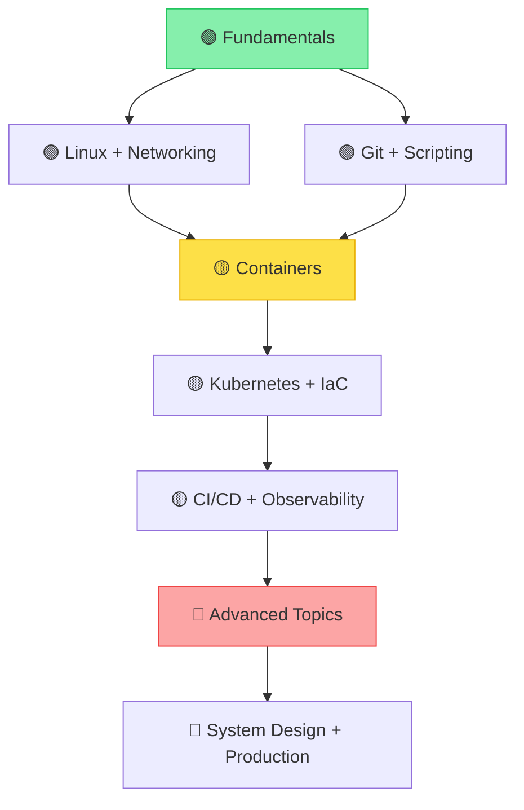

# 🚀 DevOps_start

> 📚 Полноценный учебный план и база знаний для изучения DevOps  
> 🗂️ Структурировано для [Obsidian.md](https://obsidian.md) • 🎯 От Junior до Senior

[](LICENSE)
[](https://obsidian.md)
[](#)

---

## 📖 О проекте

**DevOps_start** — это структурированная база знаний для системного изучения DevOps-инженерии. Материалы организованы по принципу "от простого к сложному" и разделены на три уровня подготовки:

```
🟢 Junior  → 🟡 Middle  → 🔴 Senior
```

Каждая тема содержит:
- ✅ **Теория** — концепции, архитектура, внутренние механизмы
- ✅ **Практика** — пошаговые руководства, конфигурации, код
- ✅ **Вопросы** — подготовка к собеседованиям, самопроверка

---

## 🗂️ Структура репозитория

```
DevOps_start/
├── 📁 00_Fundamentals/          # Основы
│   ├── 📁 Linux/                # Команды, файловая система, процессы
│   ├── 📁 Networking/           # OSI, TCP/IP, DNS, HTTP, firewall
│   └── 📁 Scripting/            # Bash, Python основы
│
├── 📁 01_Version_Control/       # Системы контроля версий
│   └── 📁 Git/                  # Ветвление, merge, rebase, workflows
│
├── 📁 02_Containers/            # Контейнеризация
│   ├── 📁 Docker/               # Images, Dockerfile, Compose, best practices
│   └── 📁 Kubernetes/           # Pods, Deployments, Services, Helm, operators
│
├── 📁 03_Infrastructure/        # Infrastructure as Code & Cloud
│   ├── 📁 Terraform/            # Providers, state, modules, workspaces
│   ├── 📁 Ansible/              # Playbooks, roles, inventories, vault
│   └── 📁 AWS_Cloud/            # EC2, S3, VPC, IAM, RDS, Lambda
│
├── 📁 04_CI_CD/                 # Непрерывная интеграция и доставка
│   ├── 📁 CI_CD/                # Jenkins, GitLab CI, GitHub Actions
│   └── 📁 GitOps/               # ArgoCD, Flux, принципы GitOps
│
├── 📁 05_Observability/         # Наблюдаемость
│   ├── 📁 Prometheus/           # Metrics, exporters, alerting, PromQL
│   ├── 📁 Grafana/              # Dashboards, datasources, alerting
│   ├── 📁 Logging/              # ELK, Loki, Fluent Bit, LogQL
│   └── 📁 Tempo/                # Distributed tracing, OpenTelemetry
│
├── 📁 06_Databases/             # Базы данных для DevOps
│   ├── 📄 Databases практика.md
│   ├── 📄 Databases теория.md
│   └── 📄 Databases вопросы.md
│
├── 📁 07_Messaging/             # Системы обмена сообщениями
│   ├── 📁 Kafka/                # Архитектура, операции, production
│   └── 📁 RabbitMQ/             # (в разработке)
│
├── 📁 08_Security/              # Безопасность (DevSecOps)
│   ├── 🔐 Secrets Management
│   ├── 🛡️ Container Security
│   └── 🔍 Vulnerability Scanning
│
├── 📁 09_Advanced/              # Продвинутые темы
│   ├── 🧠 System Design
│   ├── ⚡ Performance Tuning
│   └── 🔄 Disaster Recovery
│
├── 📄 Roadmap.md                # Визуальная карта обучения
├── 📄 README.md                 # Этот файл
└── 📄 .obsidian/                # Настройки Obsidian (опционально)
```

---

## 🎯 Как использовать

### 1️⃣ Для обучения в Obsidian (рекомендуется)

```bash
# 1. Клонируйте репозиторий
git clone https://github.com/Ghostosmoke/DevOps_start.git

# 2. Откройте папку в Obsidian как новый vault
#    File → Open folder as vault → выберите DevOps_start/

# 3. Начните с файла [[Roadmap]] или [[00_Fundamentals/Linux]]
```

✅ **Преимущества Obsidian**:
- 🔗 Внутренние ссылки между файлами (`[[Python теория]]`)
- 🏷️ Теги для фильтрации (`#devops #kafka #senior`)
- 🗺️ Graph view для визуализации связей
- 📱 Синхронизация через Git или Obsidian Sync

### 2️⃣ Для чтения в браузере / GitHub

- Просматривайте файлы напрямую на GitHub
- Используйте оглавление в начале каждого файла для навигации
- Ссылки `[[...]]` работают как обычные маркдаун-ссылки при открытии в совместимых редакторах

### 3️⃣ Для подготовки к собеседованиям

```bash
# Найдите все файлы с вопросами:
find . -name "*вопросы.md" -o -name "*questions.md"

# Или используйте теги в Obsidian:
# Поиск: tag:#interview OR tag:#questions
```

---

## 📊 Roadmap обучения



### 🗓️ Рекомендуемый план

| Неделя | Фокус | Результат |
|--------|-------|-----------|
| 1-2 | 🟢 Linux, Bash, Git | Уверенная работа в терминале, базовые скрипты |
| 3-4 | 🟢 Networking, Python основы | Понимание TCP/IP, написание утилит на Python |
| 5-6 | 🟡 Docker, Docker Compose | Упаковка приложений, multi-stage builds |
| 7-9 | 🟡 Kubernetes основы | Деплой приложений, Services, ConfigMaps |
| 10-11 | 🟡 Terraform, Ansible | Provisioning инфраструктуры как код |
| 12-13 | 🟡 CI/CD пайплайны | Автоматизация тестов и деплоя |
| 14-16 | 🟡 Prometheus, Grafana, Loki | Мониторинг и логирование приложений |
| 17-18 | 🟡 Kafka основы | Понимание event-driven архитектуры |
| 19-20 | 🟡 Базы данных для DevOps | Бэкапы, репликация, мониторинг БД |
| 21+ | 🔴 Продвинутые темы | HA, DR, performance tuning, security |

> 💡 **Совет**: Не стремитесь пройти всё линейно. Возвращайтесь к темам по мере необходимости в реальных задачах.

---

## 🏷️ Система тегов

Каждый файл помечен тегами для удобной фильтрации:

```yaml
# По уровню сложности
- #junior    #middle    #senior

# По типу контента
- #theory    #practice    #questions    #interview

# По технологии
- #python    #kafka    #kubernetes    #terraform
- #prometheus    #loki    #postgresql    #aws

# По домену
- #devops    #sre    #automation    #security
```

**Пример поиска в Obsidian**:
```
#senior AND #kafka AND #practice
#interview AND (#database OR #kubernetes)
```

> 🎓 **Для студентов и преподавателей**: Используйте материалы в учебных целях свободно. Буду рад, если поделитесь результатом!

> 🗓️ **Последнее обновление**: Май 2026  
> 🔖 **Версия**: 0.3.0 (в разработке)  
> 👤 **Автор**: Ghostosmoke & contributors

