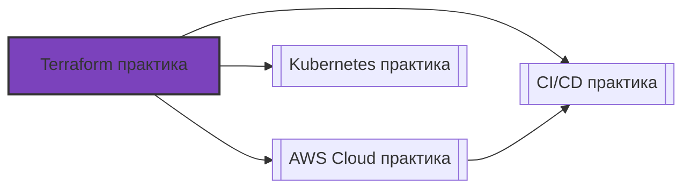

# 📄 Файл: `Terraform практика.md`

tags: [terraform, iac, devops, practice, hands-on, aws]
aliases: [terraform-practice, iac-practice]
created: 2026-05-07
---

# 🏗️ Terraform для DevOps: Полноценная Практика (Hands-On)

> [!INFO] Формат
> Реальные сценарии из продакшена → пошаговое выполнение → DevOps-контекст → задания для самостоятельной отработки.
> 
> 💡 **Рекомендация**: Используй AWS Free Tier. Все команды ниже предполагают установленный `terraform >= 1.5`. **Обязательно** запускай `terraform destroy` после каждого сценария, чтобы избежать списаний!

📋 [[#🗂️ Оглавление для навигации|Оглавление]] | [[#🧪 Чек-лист самостоятельной практики|Чек-лист]] | [[#🔗 Связь с другими файлами|Связи]]

---

## 🗂️ Оглавление для навигации

### 🔹 Базовые сценарии
- [[#📁 СЦЕНАРИЙ 1: Инициализация + Remote State с блокировкой|1. Init и Remote State]]
- [[#📁 СЦЕНАРИЙ 2: Переменные, Outputs, Locals и валидация|2. Variables & Outputs]]
- [[#📁 СЦЕНАРИЙ 3: Создание и переиспользование модулей|3. Модули]]
- [[#📁 СЦЕНАРИЙ 4: Импорт существующей инфраструктуры|4. Import & State]]
- [[#📁 СЦЕНАРИЙ 5: Workspaces и разделение окружений|5. Workspaces]]
- [[#📁 СЦЕНАРИЙ 6: CI/CD интеграция и безопасный деплой|6. CI/CD & Security]]

---

## 🔹 Базовые сценарии

### 📁 СЦЕНАРИЙ 1: Инициализация + Remote State с блокировкой

### 🎯 Цель
Настроить безопасное хранение state-файла в облаке с механизмом блокировки для командной работы.

### 📋 Пошаговое выполнение

```bash
# 1. Создаём инфраструктуру для backend (S3 + DynamoDB)
aws s3api create-bucket --bucket terraform-state-$(date +%s) --region eu-central-1
aws dynamodb create-table \
  --table-name terraform-locks \
  --attribute-definitions AttributeName=LockID,AttributeType=S \
  --key-schema AttributeName=LockID,KeyType=HASH \
  --billing-mode PAY_PER_REQUEST --region eu-central-1

# 2. Структура проекта
mkdir tf-practice && cd tf-practice
touch main.tf backend.tf

# 3. backend.tf
cat > backend.tf <<EOF
terraform {
  backend "s3" {
    bucket         = "terraform-state-$(date +%s)"  # замени на имя своего бакета
    key            = "dev/vpc/terraform.tfstate"
    region         = "eu-central-1"
    dynamodb_table = "terraform-locks"
    encrypt        = true
  }
}
EOF

# 4. main.tf (базовый ресурс)
cat > main.tf <<EOF
provider "aws" {
  region = "eu-central-1"
}

resource "aws_s3_bucket" "example" {
  bucket = "my-tf-test-bucket-$(date +%s)"

  tags = {
    Environment = "dev"
    ManagedBy   = "terraform"
  }
}
EOF

# 5. Инициализация и применение
terraform init          # Загружает провайдеры, настраивает backend
terraform plan          # Сравнивает код с состоянием (dry-run)
terraform apply -auto-approve  # Создаёт ресурсы
```

### 🔍 DevOps-контекст
- **State-файл** хранит mapping между кодом и реальными ресурсами. Потеря state = потеря управления инфраструктурой.
- `S3` обеспечивает надёжное хранение + версионирование. `DynamoDB` обеспечивает **state locking**: два инженера не могут одновременно применять изменения, что предотвращает race conditions.
- В продакшене backend выносится в отдельный модуль/репозиторий и создаётся один раз вручную.

### ⚠️ Подводные камни
- Без `dynamodb_table` Terraform **не блокирует** state → риск одновременного `apply` и corruption.
- `encrypt = true` обязателен: state часто содержит пароли, ARN, ключи.
- Никогда не коммить `.terraform/` и `terraform.tfstate` в Git!

### 🧪 Задание для отработки
1. Замени `key` в `backend.tf` на `prod/vpc/terraform.tfstate` и запусти `terraform init`.
2. Ответь `yes` на предложение миграции state.
3. Проверь в AWS Console: объект `terraform.tfstate` появился в S3, таблица DynamoDB заблокирована во время `apply`.
4. Выполни `terraform destroy` и убедись, что ресурсы удалены, а state-файл остался в S3.

[[#🗂️ Оглавление для навигации|↑ К оглавлению]]

---

### 📁 СЦЕНАРИЙ 2: Переменные, Outputs, Locals и валидация

### 🎯 Цель
Научиться параметризировать конфигурацию, вычислять значения локально и безопасно экспортировать данные.

### 📋 Пошаговое выполнение

```bash
# 1. variables.tf
cat > variables.tf <<EOF
variable "env" {
  description = "Окружение (dev/staging/prod)"
  type        = string
  default     = "dev"

  validation {
    condition     = contains(["dev", "staging", "prod"], var.env)
    error_message = "Допустимые значения: dev, staging, prod."
  }
}

variable "instance_type" {
  description = "Тип EC2 инстанса"
  type        = string
  default     = "t3.micro"
}

variable "tags" {
  type    = map(string)
  default = { Project = "terraform-practice" }
}
EOF

# 2. locals.tf
cat > locals.tf <<EOF
locals {
  name_prefix = "${var.env}-app"
  common_tags = merge(var.tags, {
    Environment = var.env
    Terraform   = "true"
  })
}
EOF

# 3. main.tf (добавляем EC2)
cat >> main.tf <<EOF
resource "aws_instance" "web" {
  ami           = data.aws_ami.amazon_linux.id
  instance_type = var.instance_type

  tags = local.common_tags
}

data "aws_ami" "amazon_linux" {
  most_recent = true
  owners      = ["amazon"]
  filter {
    name   = "name"
    values = ["al2023-ami-*-x86_64"]
  }
}

output "instance_public_ip" {
  value       = aws_instance.web.public_ip
  description = "Публичный IP веб-сервера"
  sensitive   = false
}

output "instance_id" {
  value = aws_instance.web.id
}
EOF

# 4. Запуск с параметрами
terraform plan -var="env=staging" -var="instance_type=t3.small"
terraform apply -var="env=staging"
```

### 🔍 DevOps-контекст
- `variables.tf` + `*.tfvars` = основа CI/CD: пайплайн передаёт `-var-file=prod.tfvars` в зависимости от ветки.
- `locals` устраняют дублирование: сложные выражения вычисляются один раз, код становится читаемым.
- `data` источники позволяют читать существующую инфраструктуру (AMI, VPC IDs, IAM роли) без хардкода.

### ⚠️ Подводные камни
- `validation` работает только на этапе `plan`/`apply`, не на `init`.
- `sensitive = true` в output скрывает значение в CLI, но **не шифрует** в state-файле.
- Чрезмерное использование `depends_on` подавляет параллелизм Terraform → замедляет apply. Используй только когда неявных зависимостей недостаточно.

### 🧪 Задание для отработки
1. Создай файл `staging.tfvars` с переопределением `env` и `instance_type`.
2. Запусти `terraform plan -var-file=staging.tfvars`.
3. Попробуй передать `-var="env=invalid"` → убедись, что валидация сработала.
4. Добавь `sensitive = true` к output, запусти `apply`, проверь вывод в CLI.

[[#🗂️ Оглавление для навигации|↑ К оглавлению]]

---

### 📁 СЦЕНАРИЙ 3: Создание и переиспользование модулей

### 🎯 Цель
Вынести повторяющуюся логику в модуль и использовать его несколько раз с разными параметрами.

### 📋 Пошаговое выполнение

```bash
# 1. Создаём структуру модуля
mkdir -p modules/vpc
touch modules/vpc/{main.tf,variables.tf,outputs.tf}

# 2. modules/vpc/variables.tf
cat > modules/vpc/variables.tf <<EOF
variable "cidr_block" { type = string }
variable "env"        { type = string }
EOF

# 3. modules/vpc/main.tf
cat > modules/vpc/main.tf <<EOF
resource "aws_vpc" "this" {
  cidr_block           = var.cidr_block
  enable_dns_support   = true
  enable_dns_hostnames = true

  tags = { Name = "${var.env}-vpc" }
}

resource "aws_subnet" "public" {
  vpc_id     = aws_vpc.this.id
  cidr_block = cidrsubnet(var.cidr_block, 8, 1)

  tags = { Name = "${var.env}-public-subnet" }
}
EOF

# 4. modules/vpc/outputs.tf
cat > modules/vpc/outputs.tf <<EOF
output "vpc_id" {
  value = aws_vpc.this.id
}

output "subnet_id" {
  value = aws_subnet.public.id
}
EOF

# 5. Вызов модуля из корня (main.tf)
cat > root_module.tf <<EOF
module "dev_vpc" {
  source   = "./modules/vpc"
  cidr_block = "10.0.0.0/16"
  env      = "dev"
}

module "prod_vpc" {
  source   = "./modules/vpc"
  cidr_block = "10.1.0.0/16"
  env      = "prod"
}

output "dev_vpc_id" {
  value = module.dev_vpc.vpc_id
}
EOF

terraform init
terraform plan
terraform apply
```

### 🔍 DevOps-контекст
- Модули = стандарты инфраструктуры в организации. Один раз протестировал → используешь во всех командах.
- `source` может указывать на: локальную папку, Git-репо, Terraform Registry. В продакшене фиксируй версии: `source = "git::https://...?ref=v1.2.0"`.
- `module.*.output` позволяет строить граф зависимостей между модулями без `depends_on`.

### ⚠️ Подводные камни
- Глубокая вложенность модулей (>3 уровней) усложняет отладку и `terraform plan`.
- Модуль должен быть **идемпотентным**: повторный apply не должен менять ресурсы без изменений в коде.
- Не харкодьте провайдеры внутри модулей — провайдер наследуется из корневого модуля.

### 🧪 Задание для отработки
1. Добавь в модуль `vpc` переменную `enable_nat_gateway` (bool) и условное создание ресурса `count = var.enable_nat_gateway ? 1 : 0`.
2. Вызови модуль с `enable_nat_gateway = true` и проверь, что ресурс создался.
3. Замени `source = "./modules/vpc"` на публичный модуль из Registry (например, `terraform-aws-modules/vpc/aws`).
4. Запусти `terraform plan` → убедись, что Terraform корректно обрабатывает смену source.

[[#🗂️ Оглавление для навигации|↑ К оглавлению]]

---

### 📁 СЦЕНАРИЙ 4: Импорт существующей инфраструктуры

### 🎯 Цель
Взять под контроль ресурсы, созданные вручную или через консоль, без их пересоздания.

### 📋 Пошаговое выполнение

```bash
# 1. Создаём ресурс ВНЕ Terraform (вручную или через CLI)
aws s3api create-bucket --bucket legacy-import-test --region eu-central-1

# 2. Пишем конфигурацию, которая опишет этот ресурс
cat > import_bucket.tf <<EOF
resource "aws_s3_bucket" "legacy" {
  bucket = "legacy-import-test"

  tags = {
    Imported = "true"
    Date     = formatdate("YYYY-MM-DD", timestamp())
  }
}
EOF

# 3. Импортируем в state
terraform import aws_s3_bucket.legacy legacy-import-test

# 4. Сверяем plan (должно быть 0 изменений)
terraform plan

# ⚠️ Если есть дрейф (различия) → дописываем конфиг, пока plan не станет чистым.
```

### 🔍 DevOps-контекст
- `terraform import` **не генерирует код**. Он только добавляет ресурс в state-файл. Код пишешь ты.
- Критичен для миграции legacy-инфраструктуры, compliance-аудита и внедрения IaC в зрелые проекты.
- В Terraform 1.5+ доступен `terraform plan -generate-config-out=generated.tf` (experimental) для авто-генерации кода.

### ⚠️ Подводные камни
- Импорт не поддерживает вложенные ресурсы (например, отдельные правила Security Group) → импортируй весь ресурс целиком.
- Если state и реальный ресурс разошлись → `terraform plan` покажет изменения. Применяй осторожно: `apply` может удалить или пересоздать ресурс.
- Всегда делай `terraform state pull > backup.json` перед импортом сложных ресурсов.

### 🧪 Задание для отработки
1. Создай вручную EC2-инстанс через консоль.
2. Напиши `resource "aws_instance" "manual" { ... }` с нужными параметрами.
3. Импортируй: `terraform import aws_instance.manual i-0123456789abcdef0`.
4. Запускай `terraform plan` → корректируй код → добейся `No changes`.
5. Выполни `terraform destroy` для очистки.

[[#🗂️ Оглавлению|↑ К оглавлению]]

---

### 📁 СЦЕНАРИЙ 5: Workspaces и разделение окружений

### 🎯 Цель
Использовать workspaces для изоляции state одного кода под разные окружения.

### 📋 Пошаговое выполнение

```bash
# 1. Проверяем текущий workspace
terraform workspace list
# * default

# 2. Создаём workspace для dev
terraform workspace new dev
terraform workspace select dev

# 3. Запускаем с workspace-specific переменными
# Terraform автоматически читает terraform.tfvars.d/dev.tfvars если существует
mkdir terraform.tfvars.d
cat > terraform.tfvars.d/dev.tfvars <<EOF
env = "dev"
instance_type = "t3.micro"
EOF

terraform apply

# 4. Переключаемся на prod
terraform workspace new prod
terraform workspace select prod
cat > terraform.tfvars.d/prod.tfvars <<EOF
env = "prod"
instance_type = "t3.small"
EOF

terraform apply

# 5. Проверяем разделение state
terraform workspace select dev
terraform state list  # увидим только dev-ресурсы
```

### 🔍 DevOps-контекст
- Workspaces хранят разные state-файлы в одном backend по пути: `env:/<workspace>/key`.
- Удобны для тестов, демо-стендов, короткоживущих feature-окружений.
- **В продакшене** чаще используют отдельные директории/репозитории на окружение + разные backend-пути, так как workspaces не изолируют доступ и усложняют CI.

### ⚠️ Подводные камеры
- Workspaces **не поддерживают разные версии провайдеров** в одном коде.
- Удаление workspace: `terraform workspace delete dev` → удаляет state, но **не ресурсы**! Нужно сначала `terraform destroy`.
- В CI/CD работа с workspaces требует явного `workspace select` перед каждым шагом.

### 🧪 Задание для отработки
1. Создай 3 workspace: `dev`, `staging`, `prod`.
2. Для каждого запусти `apply` с разными `instance_type`.
3. Переключись на `dev`, измени код, запусти `plan` → убедись, что `staging` и `prod` не затронуты.
4. Удали workspace `dev` корректно: `destroy` → `workspace delete`.

[[#🗂️ Оглавлению|↑ К оглавлению]]

---

### 📁 СЦЕНАРИЙ 6: CI/CD интеграция и безопасный деплой

### 🎯 Цель
Настроить GitHub Actions workflow для Terraform с проверками, plan в PR и manual apply.

### 📋 Пошаговое выполнение

```yaml
# .github/workflows/terraform.yml
name: Terraform CI/CD

on:
  pull_request:
    branches: [ main ]
    paths: [ 'infra/**' ]
  push:
    branches: [ main ]
    paths: [ 'infra/**' ]

defaults:
  run:
    working-directory: infra/

jobs:
  lint-validate:
    runs-on: ubuntu-latest
    steps:
      - uses: actions/checkout@v4
      - uses: hashicorp/setup-terraform@v3
      - run: terraform fmt -check
      - run: terraform init
      - run: terraform validate

  plan:
    needs: lint-validate
    runs-on: ubuntu-latest
    environment: staging  # Требует approval для apply
    steps:
      - uses: actions/checkout@v4
      - uses: hashicorp/setup-terraform@v3
      - name: Configure AWS OIDC
        uses: aws-actions/configure-aws-credentials@v4
        with:
          role-to-assume: ${{ secrets.AWS_ROLE_ARN }}
          aws-region: eu-central-1
      - run: terraform init
      - run: terraform plan -out=tfplan
      - uses: actions/upload-artifact@v4
        with:
          name: tfplan
          path: infra/tfplan
          retention-days: 1

  apply:
    needs: plan
    runs-on: ubuntu-latest
    environment: staging
    if: github.ref == 'refs/heads/main'
    steps:
      - uses: actions/checkout@v4
      - uses: hashicorp/setup-terraform@v3
      - uses: actions/download-artifact@v4
        with:
          name: tfplan
          path: infra/
      - name: Configure AWS OIDC
        uses: aws-actions/configure-aws-credentials@v4
        with:
          role-to-assume: ${{ secrets.AWS_ROLE_ARN }}
          aws-region: eu-central-1
      - run: terraform init
      - run: terraform apply -auto-approve tfplan
```

### 🔍 DevOps-контекст
- **Plan в PR**: разработчики видят diff инфраструктуры до мержа. Review кода = review infra.
- **OIDC вместо secrets**: GitHub получает временный токен от AWS, нет долгоживущих ключей в репо.
- **Artifact для plan**: гарантирует, что apply применяет ровно тот план, который был утверждён в CI.

### ⚠️ Подводные камни
- `terraform fmt -check` ломает пайплайн при неправильном форматировании → добавь `pre-commit` хук локально.
- `terraform validate` не проверяет логику облака → нужен `tflint` или `checkov` для deeper scan.
- `apply` без approval в main → риск accidental destroy. Всегда используй `environment: prod` с required reviewers.

### 🧪 Задание для отработки
1. Создай `.github/workflows/terraform.yml` в тестовом репо.
2. Настрой OIDC роль в AWS (доверие `github.com`, permission `AdministratorAccess` для теста).
3. Создай PR с изменением `instance_type` → проверь, что plan отобразился в комментариях (через `hashicorp/setup-terraform` output).
4. Смерджи → убедись, что apply запустился только после подтверждения environment.

[[#🗂️ Оглавлению|↑ К оглавлению]]

---

## 🛠️ Полезные алиасы и утилиты

```bash
# === Глобальные алиасы ===
alias tf='terraform'
alias tfi='terraform init'
alias tff='terraform fmt -recursive'
alias tfv='terraform validate'
alias tfp='terraform plan'
alias tfa='terraform apply'
alias tfd='terraform destroy'
alias tfl='terraform state list'
alias tfout='terraform output -json'

# === Управление версиями ===
# Установи tfenv: https://github.com/tfutils/tfenv
tfenv install 1.8.5
tfenv use 1.8.5
tfenv list

# === Инспекция state ===
terraform state pull > state.json
terraform state show aws_instance.web
terraform state mv aws_instance.old aws_instance.new
terraform state rm aws_instance.deprecated

# === Безопасность и линтинг ===
# Установи tflint, tfsec, checkov
tflint --recursive
tfsec .
checkov -d . --framework terraform
```

---

## 🧪 Чек-лист самостоятельной практики

- [ ] Настроил remote backend (S3 + DynamoDB) с шифрованием и блокировкой
- [ ] Использовал `variables`, `locals`, `outputs` с валидацией и типизацией
- [ ] Создал кастомный модуль, вызвал его дважды с разными параметрами
- [ ] Импортировал ресурс, созданный вручную, добился `plan: No changes`
- [ ] Работал с workspaces, разделил state для dev/prod
- [ ] Настроил CI/CD workflow: fmt → validate → plan (PR) → apply (main + approval)
- [ ] Использовал OIDC для аутентификации в облаке без long-lived secrets
- [ ] Проверил инфраструктуру через `tflint` / `tfsec` / `checkov`
- [ ] Выполнял `terraform state` операции: `list`, `show`, `mv`, `rm`
- [ ] Полностью очистил тестовые ресурсы через `terraform destroy`

---

## ⚠️ Топ-5 ошибок в продакшене и как их избежать

| Ошибка | Последствия | Решение |
|--------|-------------|---------|
| Хранение state локально или в Git | Потеря контроля, утечка секретов, конфликты в команде | Всегда используй remote backend с шифрованием и locking |
| Ручное редактирование `.tfstate` | Corruption state, невозможность apply, потеря ресурсов | Используй только `terraform state *` команды или `import` |
| `terraform apply -auto-approve` в main без review | Случайное удаление продакшена, drift без аудита | Разделяй plan/apply, требуй approval, используй GitOps-паттерн |
| Хардкод секретов в `.tfvars` или коде | Утечка в Git, компрометация аккаунта | Используй `sensitive = true`, Vault, AWS Secrets Manager, OIDC |
| Игнорирование `depends_on` и неявных зависимостей | Race conditions, таймауты, некорректный порядок создания | Явно указывай зависимости только когда граф неочевиден, тестируй `plan` |

---

## 🔗 Связь с другими файлами

> [!TIP] Следующие шаги
> После отработки этих сценариев переходи к:
> - [[AWS Cloud практика]] — ручное управление ресурсами для понимания TF-ресурсов
> - [[CICD практика]] — интеграция Terraform в пайплайны с approval
> - [[Kubernetes практика]] — деплой EKS/инфраструктуры через TF + GitOps
> - [[Git практика]] — версионирование IaC, PR-ревью инфраструктуры



[[#🗂️ Оглавлению|↑ К оглавлению]]