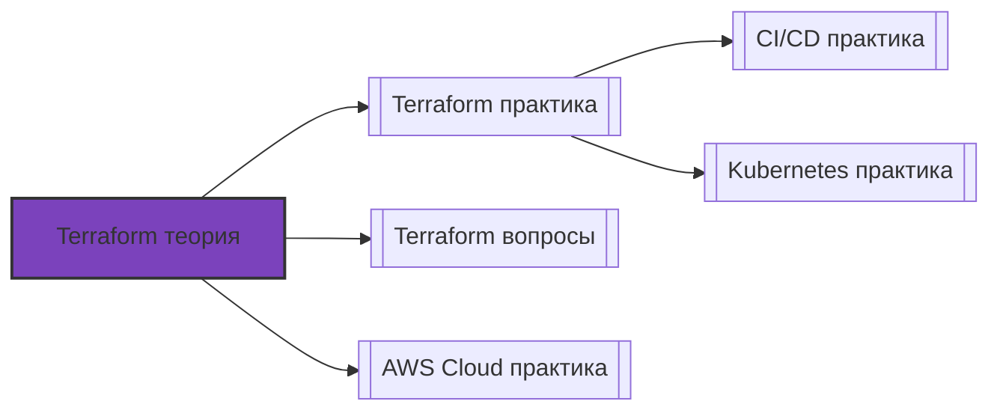

# 📄 Файл: `Terraform теория.md`

tags: [terraform, iac, devops, theory, architecture]
aliases: [terraform-theory, iac-theory]
created: 2026-05-07
---

# 🎯 Terraform для DevOps: Глубокое изучение теории

> [!INFO] Тема подтверждена  
> `Terraform — архитектура, внутренние механизмы, принципы IaC`  
> **Уровень**: подготовка к собеседованию в топ-компанию  
> **Фокус**: теория + контекст DevOps + связь с экосистемой

📋 [[#🗂️ Оглавление для навигации|Оглавление]] | [[#🔑 Ключевые моменты|Итоги]] | [[#🔗 Связь с другими файлами|Связи]]

---

## 🗂️ Оглавление для навигации

### 🔹 Фундамент
- [[#🔹 Что такое Terraform? Простыми словами|Что такое Terraform]]
- [[#🔹 Почему IaC? Эволюция управления инфраструктурой|Эволюция IaC]]

### 🔹 Архитектура Terraform
- [[#🔹 Компоненты: CLI, провайдеры, бэкенды|Компоненты архитектуры]]
- [[#🔹 State-файл: сердце Terraform|State-файл]]
- [[#🔹 Граф зависимостей и планирование|Граф и планирование]]

### 🔹 Язык HCL и декларативная модель
- [[#🔹 Декларативный подход: желаемое → текущее|Декларативная модель]]
- [[#🔹 Ресурсы, данные, переменные, модули|Объекты HCL]]
- [[#🔹 Выражения, функции, динамические блоки|Выразительность HCL]]

### 🔹 Жизненный цикл ресурсов
- [[#🔹 Четыре фазы: init → plan → apply → destroy|Жизненный цикл]]
- [[#🔹 Мета-аргументы: count, for_each, depends_on|Управление ресурсами]]
- [[#🔹 Provisioners и local-exec: когда код выполняется|Provisioners]]

### 🔹 State: хранение, блокировка, миграция
- [[#🔹 Локальный vs Remote State|Типы state]]
- [[#🔹 State locking и консистентность|Блокировка]]
- [[#🔹 Импорт, дрейф, восстановление|Управление state]]

### 🔹 Модули и переиспользование
- [[#🔹 Архитектура модулей: вход, выход, композиция|Модули]]
- [[#🔹 Версионирование и источники модулей|Публикация модулей]]
- [[#🔹 Паттерны: композиция, наследование, обёртки|Паттерны]]

### 🔹 Безопасность и надёжность
- [[#🔹 Управление секретами в Terraform|Секреты]]
- [[#🔹 Политики: Sentinel, OPA, tflint|Policy as Code]]
- [[#🔹 Аудит, дрифт, восстановление|Надёжность]]

### 🔹 Интеграция с экосистемой
- [[#🔹 CI/CD: пайплайны для Terraform|Интеграция с CI/CD]]
- [[#🔹 GitOps и Terraform: совместимость|GitOps]]
- [[#🔹 Мульти-облако и абстракции|Мульти-облако]]

---

## 🔹 Фундамент

### 🔹 Что такое Terraform? Простыми словами

**Terraform** — это инструмент инфраструктуры как код (IaC) от HashiCorp, который позволяет описывать, планировать и применять изменения в инфраструктуре с помощью декларативного конфигурационного языка (HCL).

> [!NOTE] Ключевая идея
> Вы описываете **что** хотите получить (желаемое состояние), а Terraform **как** это сделать — решает сам через граф зависимостей и провайдеры.

**Что умеет Terraform**:
- ✅ Создавать, изменять, удалять ресурсы в 3000+ провайдерах (облака, SaaS, on-prem)
- ✅ Планировать изменения до применения (`terraform plan` — dry-run)
- ✅ Управлять зависимостями между ресурсами автоматически
- ✅ Переиспользовать конфигурацию через модули
- ✅ Хранить состояние инфраструктуры и детектировать дрейф

**DevOps-контекст**: Terraform — не просто "скрипт для создания серверов", а платформа для:
- 🔄 Непрерывной доставки инфраструктуры (Infrastructure CI/CD)
- 🔐 Безопасности через Policy as Code (Sentinel, OPA)
- 📊 Аудита и соответствия стандартам (кто, что, когда изменил)
- 💰 Управления затратами через тегирование и планирование

[[#🗂️ Оглавление для навигации|↑ К оглавлению]]

### 🔹 Почему IaC? Эволюция управления инфраструктурой

```
Ручное управление (2000-е)
  ↓
  • Консоль/SSH: "кликаем и пишем команды"
  • Документация в Wiki: "как мы это настроили"
  • Проблемы: дрейф, нет воспроизводимости, сложно масштабировать

Скрипты и конфиг-менеджмент (2010-е)
  ↓
  • Bash/Ansible/Puppet: "описываем шаги"
  • Идемпотентность: можно запускать много раз
  • Проблемы: императивный подход, сложно предсказать результат

Infrastructure as Code (2015–настоящее время)
  ↓
  • Terraform/CloudFormation/Pulumi: "описываем желаемое состояние"
  • Декларативность + планирование + аудит
  • Интеграция с Git, CI/CD, GitOps
```

| Подход | Пример | Плюсы | Минусы |
|--------|--------|-------|--------|
| **Ручной** | Консоль AWS, SSH | Быстро для разовых задач | Нет аудита, дрейф, невозможно масштабировать |
| **Императивный** | Bash, Ansible playbook | Гибкость, контроль | Сложно предсказать результат, порядок важен |
| **Декларативный** | Terraform, CloudFormation | Предсказуемость, план, аудит | Кривая обучения, менее гибкий для сложной логики |

**DevOps-контекст**: Современные практики не заменяют старые, а дополняют:
- `Ansible` идеален для конфигурации внутри ВМ/контейнеров
- `Terraform` — стандарт для создания самой инфраструктуры (сети, ВМ, БД, балансировщики)
- Комбинация: Terraform создаёт ресурсы → Ansible настраивает ОС внутри

[[#🗂️ Оглавление для навигации|↑ К оглавлению]]

---

## 🔹 Архитектура Terraform

### 🔹 Компоненты: CLI, провайдеры, бэкенды

**Три столпа архитектуры Terraform**:

```
┌─────────────────────────────────┐
│         Terraform CLI           │
│  (интерпретатор HCL, оркестратор)│
├─────────────────────────────────┤
│ • Парсинг .tf-файлов            │
│ • Построение графа зависимостей │
│ • Планирование изменений        │
│ • Координация провайдеров       │
└─────────────────────────────────┘
                   │
                   │ (RPC через gRPC)
                   ▼
┌─────────────────────────────────┐
│         Провайдеры              │
│   (плагины для каждого сервиса) │
├─────────────────────────────────┤
│ • aws, azure, google, kubernetes│
│ • github, datadog, cloudflare   │
│ • local, null, http (утилитарные)│
└─────────────────────────────────┘
                   │
                   │ (через сеть или локально)
                   ▼
┌─────────────────────────────────┐
│         Бэкенды (State)         │
│  (хранение и блокировка state)  │
├─────────────────────────────────┤
│ • local (файл)                  │
│ • remote: S3+DynamoDB, GCS,     │
│   Terraform Cloud, PG           │
└─────────────────────────────────┘
```

**Провайдеры** — это плагины, которые:
- Маппят ресурсы HCL на API целевого сервиса
- Реализуют CRUD-операции для каждого типа ресурса
- Обрабатывают аутентификацию, пейджинг, ретраи

> [!WARNING] Версионирование провайдеров
> Всегда фиксируйте версии в `required_providers`:
> ```hcl
> terraform {
>   required_providers {
>     aws = {
>       source  = "hashicorp/aws"
>       version = "~> 5.0"  # Совместимость с 5.x, но не 6.0
>     }
>   }
> }
> ```

[[#🗂️ Оглавление для навигации|↑ К оглавлению]]

### 🔹 State-файл: сердце Terraform

**Что такое state**:
- JSON-файл, который хранит **mapping** между кодом Terraform и реальными ресурсами
- Содержит: атрибуты ресурсов, зависимости, метаданные, результаты `data` источников
- **Не является** конфигурацией — это кэш и журнал изменений

**Структура state (упрощённо)**:
```json
{
  "version": 4,
  "terraform_version": "1.8.5",
  "serial": 42,
  "lineage": "abc123...",
  "outputs": { ... },
  "resources": [
    {
      "type": "aws_instance",
      "name": "web",
      "provider": "provider[\"registry.terraform.io/hashicorp/aws\"]",
      "instances": [
        {
          "attributes": {
            "id": "i-0123456789abcdef0",
            "ami": "ami-0c55b159cbfafe1f0",
            "instance_type": "t3.micro",
            "tags": { "Name": "web-server" }
          },
          "dependencies": ["aws_vpc.main", "aws_subnet.public"]
        }
      ]
    }
  ]
}
```

**Почему state критичен**:
- ✅ Позволяет `terraform plan` сравнивать желаемое и фактическое
- ✅ Хранит вычисленные атрибуты (например, `public_ip`, который неизвестен до создания)
- ✅ Отслеживает зависимости для правильного порядка операций

> [!WARNING] State содержит секреты!
> Атрибуты вроде `password`, `secret_key`, `private_key` могут храниться в state в открытом виде. Всегда шифруйте remote state и ограничивайте доступ.

[[#🗂️ Оглавление для навигации|↑ К оглавлению]]

### 🔹 Граф зависимостей и планирование

**Как Terraform строит граф**:

```
1. Парсинг: читаем все .tf-файлы, собираем ресурсы
2. Анализ ссылок: ресурс A ссылается на ресурс B через ${...}
3. Построение ориентированного ациклического графа (DAG)
4. Топологическая сортировка: определяем порядок создания
5. Параллелизация: независимые ресурсы создаются одновременно
```

**Пример графа**:
```
[aws_vpc.main]
       │
       ▼
[aws_subnet.public] ──► [aws_instance.web]
       │                      │
       ▼                      ▼
[aws_internet_gateway]  [aws_eip.web]
```

**Планирование (`terraform plan`)**:
1. Читает текущий state
2. Запрашивает актуальное состояние ресурсов у провайдеров
3. Сравнивает с желаемым (из .tf-файлов)
4. Вычисляет разницу (diff) и строит план действий
5. Выводит человекочитаемый отчёт: `+` создать, `~` изменить, `-` удалить

**DevOps-контекст**: 
- `plan` — основа CI/CD: пайплайн показывает diff перед мержем
- В продакшене `apply` запускается только после ревью `plan`-отчёта
- Для сложных изменений: `terraform plan -out=tfplan` → артефакт → `apply tfplan`

[[#🗂️ Оглавление для навигации|↑ К оглавлению]]

---

## 🔹 Язык HCL и декларативная модель

### 🔹 Декларативный подход: желаемое → текущее

**Принцип**: Вы описываете **что** хотите, а не **как** это сделать.

```hcl
# Вы пишете:
resource "aws_instance" "web" {
  ami           = "ami-0c55b159cbfafe1f0"
  instance_type = "t3.micro"

  tags = {
    Name = "web-server"
    Env  = "prod"
  }
}

# Terraform делает:
# 1. Проверяет: есть ли инстанс с такими параметрами?
# 2. Если нет → создаёт через AWS API
# 3. Если есть, но отличается → обновляет (если возможно)
# 4. Записывает результат в state
# 5. При следующем запуске: сравнивает state с реальностью → детектирует дрейф
```

**Преимущества декларативности**:
- ✅ Идемпотентность: `apply` можно запускать много раз — результат одинаковый
- ✅ Предсказуемость: `plan` показывает изменения до применения
- ✅ Аудит: вся история изменений в state и в Git

[[#🗂️ Оглавление для навигации|↑ К оглавлению]]

### 🔹 Ресурсы, данные, переменные, модули

**Четыре типа блоков в HCL**:

| Блок | Назначение | Пример |
|------|-----------|--------|
| `resource` | Управление жизненным циклом ресурса | `aws_instance`, `kubernetes_deployment` |
| `data` | Чтение существующих ресурсов (только чтение) | `data "aws_ami" "latest"` |
| `variable` | Параметризация конфигурации | `variable "env" { type = string }` |
| `output` | Экспорт значений для других модулей/пользователей | `output "public_ip" { value = ... }` |

**Дополнительные блоки**:
- `locals` — вычисляемые значения внутри модуля (как переменные, но без ввода извне)
- `provider` — конфигурация провайдера (регион, аутентификация)
- `module` — вызов переиспользуемого модуля

**Пример связи**:
```hcl
# data читает существующий AMI
data "aws_ami" "amazon_linux" {
  most_recent = true
  owners      = ["amazon"]
  filter {
    name   = "name"
    values = ["al2023-ami-*-x86_64"]
  }
}

# resource использует data
resource "aws_instance" "web" {
  ami           = data.aws_ami.amazon_linux.id  # ← ссылка на data
  instance_type = var.instance_type              # ← ссылка на variable
}

# output экспортирует результат
output "instance_id" {
  value = aws_instance.web.id  # ← ссылка на resource
}
```

[[#🗂️ Оглавление для навигации|↑ К оглавлению]]

### 🔹 Выражения, функции, динамические блоки

**Выражения в HCL**:
```hcl
# Конкатенация и интерполяция
name = "${var.env}-${var.app_name}"

# Условные выражения
instance_type = var.env == "prod" ? "t3.large" : "t3.micro"

# Ссылки на атрибуты
subnet_id = aws_subnet.public[0].id

# Вызов функций
cidrsubnet(var.vpc_cidr, 8, 1)  # Вычисляет подсеть
```

**Полезные встроенные функции**:

| Категория | Функции | Пример |
|-----------|---------|--------|
| Строки | `format()`, `join()`, `split()`, `replace()` | `join("-", [var.env, "vpc"])` |
| Коллекции | `length()`, `lookup()`, `merge()`, `flatten()` | `merge(var.tags, local.common)` |
| Числа | `max()`, `min()`, `abs()`, `ceil()` | `max(var.min_instances, 2)` |
| Крипто | `base64encode()`, `sha256()`, `uuid()` | `uuid()` для уникальных имён |
| Файлы/сеть | `file()`, `templatefile()`, `cidrhost()` | `templatefile("user_data.sh", {...})` |

**Динамические блоки** — для генерации повторяющихся структур:
```hcl
resource "aws_security_group" "web" {
  dynamic "ingress" {
    for_each = var.allowed_ports
    content {
      from_port   = ingress.value
      to_port     = ingress.value
      protocol    = "tcp"
      cidr_blocks = ["0.0.0.0/0"]
    }
  }
}
# Если var.allowed_ports = [80, 443, 8080] → создаст 3 ingress-правила
```

[[#🗂️ Оглавление для навигации|↑ К оглавлению]]

---

## 🔹 Жизненный цикл ресурсов

### 🔹 Четыре фазы: init → plan → apply → destroy

**Жизненный цикл Terraform-операции**:

```
┌─────────────┐
│  1. init    │
│ • Загрузка провайдеров      │
│ • Настройка backend         │
│ • Валидация конфигурации    │
└──────┬──────┘
       │
       ▼
┌─────────────┐
│  2. plan    │
│ • Чтение state              │
│ • Запрос актуального состояния у провайдеров │
│ • Сравнение: desired vs current │
│ • Построение плана действий │
└──────┬──────┘
       │
       ▼
┌─────────────┐
│  3. apply   │
│ • Выполнение плана: CRUD-операции │
│ • Обновление state              │
│ • Обработка ошибок и ретраи     │
└──────┬──────┘
       │
       ▼
┌─────────────┐
│  4. destroy │ (опционально)
│ • Удаление ресурсов в обратном порядке │
│ • Очистка state (или сохранение) │
└─────────────┘
```

**DevOps-контекст**:
- В CI/CD: `init` → `validate` → `plan` (в PR) → `apply` (после мержа)
- `destroy` используется для тестовых окружений, но **никогда** для prod без утверждения
- `terraform refresh` (устарел) / `apply -refresh-only` — только обновить state без изменений

[[#🗂️ Оглавление для навигации|↑ К оглавлению]]

### 🔹 Мета-аргументы: count, for_each, depends_on

**Управление множественными ресурсами**:

| Аргумент | Назначение | Пример |
|----------|-----------|--------|
| `count` | Создать N одинаковых ресурсов | `count = var.instance_count` |
| `for_each` | Создать ресурсы по ключам/значениям из map/set | `for_each = var.subnet_configs` |
| `depends_on` | Явная зависимость (когда неявной недостаточно) | `depends_on = [aws_db_instance.main]` |

**Разница `count` vs `for_each`**:
```hcl
# count: индексы 0,1,2... — опасно при удалении среднего элемента
resource "aws_instance" "web" {
  count = 3
  # Удаление count=1 пересоздаст инстансы с индексами 1 и 2!
}

# for_each: ключи стабильны — безопасно для изменений
resource "aws_instance" "web" {
  for_each = {
    web-1 = { az = "us-east-1a", type = "t3.micro" }
    web-2 = { az = "us-east-1b", type = "t3.small" }
  }
  # Удаление "web-1" затронет только этот инстанс
}
```

> [!TIP] Best practice
> Используйте `for_each` вместо `count`, когда ресурсы имеют уникальные параметры. Это предотвращает каскадное пересоздание при изменениях.

[[#🗂️ Оглавление для навигации|↑ К оглавлению]]

### 🔹 Provisioners и local-exec: когда код выполняется

**Provisioners** — механизм выполнения кода **после** создания ресурса:

```hcl
resource "aws_instance" "web" {
  # ... конфигурация ...

  provisioner "remote-exec" {
    connection {
      type = "ssh"
      user = "ec2-user"
      host = self.public_ip
    }
    inline = [
      "sudo yum update -y",
      "sudo amazon-linux-extras install nginx1 -y",
      "sudo systemctl start nginx"
    ]
  }
}
```

**Типы provisioners**:
| Тип | Где выполняется | Использование |
|-----|----------------|---------------|
| `local-exec` | На машине, где запущен Terraform | Запуск локальных скриптов, уведомлений |
| `remote-exec` | На созданном ресурсе (через SSH/WinRM) | Первоначальная настройка ОС |
| `file` | Копирование файлов на ресурс | Деплой конфигов, скриптов |

> [!WARNING] Provisioners — антипаттерн в большинстве случаев
> Почему:
> - ❌ Нарушают идемпотентность: повторный `apply` может не выполнить скрипт
> - ❌ Сложно отлаживать: ошибки внутри provisioner маскируются
> - ❌ Не поддерживают `create_before_destroy`
> 
> ✅ Альтернативы:
> - `user_data` / `cloud-init` для начальной настройки
> - Ansible/Chef/Puppet для конфигурации
> - Packer для создания пред-настроенных AMI

[[#🗂️ Оглавление для навигации|↑ К оглавлению]]

---

## 🔹 State: хранение, блокировка, миграция

### 🔹 Локальный vs Remote State

**Локальный state** (`terraform.tfstate` в рабочей папке):
- ✅ Прост для начала, не требует настройки
- ❌ Не подходит для команд: конфликты, потеря при удалении
- ❌ Нет шифрования, нет бэкапов, нет аудита

**Remote state** (рекомендуется для продакшена):
```hcl
terraform {
  backend "s3" {
    bucket         = "my-terraform-state"
    key            = "prod/vpc/terraform.tfstate"
    region         = "us-east-1"
    dynamodb_table = "terraform-locks"  # для блокировки
    encrypt        = true               # шифрование на стороне S3
  }
}
```

**Преимущества remote state**:
- ✅ **Блокировка**: `dynamodb`/`consul` предотвращают параллельные `apply`
- ✅ **Шифрование**: данные защищены at-rest и in-transit
- ✅ **Версионирование**: бэкапы через versioning в S3
- ✅ **Доступ**: контроль через IAM, аудит через CloudTrail

[[#🗂️ Оглавление для навигации|↑ К оглавлению]]

### 🔹 State locking и консистентность

**Проблема**: Два инженера запускают `apply` одновременно → гонка за ресурсы → corruption state.

**Решение**: Блокировка через `dynamodb` (AWS), `consul`, `gcs` и др.

**Как работает**:
```
1. Перед началом apply Terraform пытается создать запись в DynamoDB:
   { LockID: "my-bucket/key", Info: "user@host, timestamp" }

2. Если запись уже есть → ошибка: "Lock already held"

3. После успешного apply/ошибки → запись удаляется

4. Если процесс упал → запись остаётся, но можно снять вручную:
   terraform force-unlock <lock_id>
```

**DevOps-контекст**:
- В пайплайнах: `apply` должен быть эксклюзивным для каждого окружения
- `force-unlock` — опасная операция: используйте только после проверки, что процесс действительно "завис"
- Мониторинг: алерт на "stale locks" (блокировки старше 1 часа)

[[#🗂️ Оглавление для навигации|↑ К оглавлению]]

### 🔹 Импорт, дрейф, восстановление

**`terraform import`** — добавление существующего ресурса в state:
```bash
# 1. Ресурс создан вручную или через консоль
aws s3api create-bucket --bucket legacy-app

# 2. Пишем конфигурацию
resource "aws_s3_bucket" "legacy" {
  bucket = "legacy-app"
  # ... остальные параметры ...
}

# 3. Импортируем
terraform import aws_s3_bucket.legacy legacy-app

# 4. Сверяем: должно быть 0 изменений
terraform plan
```

> [!WARNING] Import не генерирует код!
> Он только добавляет ресурс в state. Конфигурацию вы пишете вручную.

**Детектирование дрейфа**:
```bash
# Сравнить state с реальностью (без изменений)
terraform apply -refresh-only

# Вывести разницу
terraform plan -refresh-only -detailed-exitcode
```

**Восстановление после потери state**:
1. Если есть бэкап в S3 (versioning) → восстановить нужную версию
2. Если нет → `terraform refresh` пересоздаст state из реальных ресурсов (но потеряет вычисленные атрибуты)
3. Профилактика: регулярные снапшоты, `terraform state pull > backup.json`

[[#🗂️ Оглавление для навигации|↑ К оглавлению]]

---

## 🔹 Модули и переиспользование

### 🔹 Архитектура модулей: вход, выход, композиция

**Модуль** — переиспользуемый набор конфигураций с чётким интерфейсом.

**Структура модуля**:
```
modules/vpc/
├── main.tf        # Ресурсы
├── variables.tf   # Входные параметры
├── outputs.tf     # Выходные значения
├── README.md      # Документация
└── versions.tf    # Версии провайдеров
```

**Интерфейс модуля**:
```hcl
# variables.tf — что модуль принимает
variable "cidr_block" {
  type        = string
  description = "CIDR для VPC"
}

variable "enable_nat" {
  type    = bool
  default = false
}

# outputs.tf — что модуль возвращает
output "vpc_id" {
  value = aws_vpc.this.id
}

output "public_subnet_ids" {
  value = aws_subnet.public[*].id
}
```

**Вызов модуля**:
```hcl
module "prod_vpc" {
  source = "./modules/vpc"  # или "git::https://...?ref=v1.2.0"
  
  cidr_block   = "10.0.0.0/16"
  enable_nat   = true
  
  # Передача в другие модули
  depends_on = [module.network]
}
```

[[#🗂️ Оглавление для навигации|↑ К оглавлению]]

### 🔹 Версионирование и источники модулей

**Источники модулей**:

| Источник | Синтаксис | Использование |
|----------|-----------|---------------|
| Локальный | `./modules/vpc` | Разработка, тестирование |
| Файловая система | `/absolute/path` | Монорепозитории |
| Git | `git::https://github.com/org/modules//vpc?ref=v1.2.0` | Приватные репо |
| Terraform Registry | `terraform-aws-modules/vpc/aws` | Публичные, проверенные модули |
| HTTP | `https://example.com/module.zip` | Корпоративные артефакты |

**Версионирование**:
```hcl
# ✅ Хорошо: фиксированная версия или совместимость
source = "terraform-aws-modules/vpc/aws"
version = "~> 3.14"  # Любая 3.14.x, но не 3.15 или 4.0

# ❌ Плохо: без версии или "последняя"
source = "terraform-aws-modules/vpc/aws"  # Может сломаться при обновлении
```

**DevOps-контекст**:
- В крупных организациях: внутренний registry (Artifactory, Terraform Cloud) с approval workflow
- Для безопасности: сканирование модулей на уязвимости перед публикацией
- Для стабильности: тестирование модулей в staging перед использованием в prod

[[#🗂️ Оглавление для навигации|↑ К оглавлению]]

### 🔹 Паттерны: композиция, наследование, обёртки

**Паттерны проектирования модулей**:

| Паттерн | Описание | Пример |
|---------|----------|--------|
| **Композиция** | Модуль вызывает другие модули | `app-stack` → `vpc` + `eks` + `rds` |
| **Обёртка (wrapper)** | Упрощённый интерфейс над сложным модулем | `simple-vpc` → вызывает `terraform-aws-modules/vpc` с дефолтами |
| **Наследование через переменные** | Передача конфигурации вниз по цепочке | `env-vars` → `app-config` → `deployment` |
| **Динамическая генерация** | `for_each` + `dynamic` для гибкости | Создание правил безопасности из списка портов |

**Пример композиции**:
```hcl
# root module
module "network" {
  source = "./modules/vpc"
  cidr   = var.vpc_cidr
}

module "compute" {
  source = "./modules/eks"
  vpc_id = module.network.vpc_id  # ← выход одного модуля → вход другого
  subnet_ids = module.network.private_subnet_ids
}

module "database" {
  source = "./modules/rds"
  subnet_group = module.network.db_subnet_group_name
}
```

> [!TIP] Правило "одной ответственности"
> Модуль должен делать одну вещь хорошо. Не создавайте "мега-модуль", который разворачивает всю инфраструктуру — это сложно тестировать и переиспользовать.

[[#🗂️ Оглавление для навигации|↑ К оглавлению]]

---

## 🔹 Безопасность и надёжность

### 🔹 Управление секретами в Terraform

**Проблема**: Секреты в `.tf`/`.tfvars` → утечка в Git → компрометация.

**Решения (по возрастанию безопасности)**:

| Метод | Описание | Когда использовать |
|-------|----------|-------------------|
| `sensitive = true` в output | Скрывает значение в CLI, но **не шифрует** в state | Быстрое скрытие, не для реальных секретов |
| Переменные окружения | `TF_VAR_db_password` → не хранится в коде | Локальная разработка, временные секреты |
| `vault` provider | Чтение секретов из HashiCorp Vault на лету | Продакшен, централизованное управление |
| `aws_secretsmanager` data source | Чтение из AWS Secrets Manager | При использовании AWS |
| `sops` + `encrypt` | Шифрование `.tfvars` перед коммитом | Гибридный подход, аудит в Git |

**Пример с Vault**:
```hcl
provider "vault" {
  address = "https://vault.internal"
}

data "vault_generic_secret" "db" {
  path = "secret/data/prod/db"
}

resource "aws_db_instance" "main" {
  password = data.vault_generic_secret.db.data["password"]
  # Пароль не попадёт в state в открытом виде, если настроить правильно
}
```

> [!WARNING] State всё ещё может содержать секреты!
> Даже если вы не пишете их в код, провайдер может вернуть чувствительные атрибуты. Всегда:
> - Шифруйте remote state
> - Ограничивайте доступ к state через IAM
> - Регулярно ротируйте секреты

[[#🗂️ Оглавление для навигации|↑ К оглавлению]]

### 🔹 Политики: Sentinel, OPA, tflint

**Policy as Code** — автоматическая проверка конфигурации до применения.

| Инструмент | Тип | Интеграция | Пример политики |
|-----------|-----|-----------|----------------|
| **Sentinel** (Terraform Cloud/Enterprise) | Встроенный | Только TFC/E | "Запретить инстансы дороже $1/час" |
| **OPA/Conftest** | Внешний | Любой пайплайн | "Все ресурсы должны иметь тег Owner" |
| **tflint** | Линтер | Pre-commit / CI | "Проверка синтаксиса, лучших практик" |
| **checkov** | Security scanner | CI/CD | "Обнаружение незашифрованных S3, открытых портов" |

**Пример OPA-политики (Rego)**:
```rego
# require_tags.rego
package terraform

deny[msg] {
  resource := input.resource_changes[_]
  resource.type == "aws_instance"
  not resource.after.tags.Owner
  msg := sprintf("aws_instance %s missing required tag 'Owner'", [resource.address])
}
```

**DevOps-контекст**:
- В пайплайне: `terraform plan -out=tfplan` → `conftest test tfplan` → `terraform apply tfplan`
- Политики должны быть "fail fast": блокировать опасные изменения до мержа
- Для compliance: экспорт отчётов в SIEM, аудит изменений политик

[[#🗂️ Оглавление для навигации|↑ К оглавлению]]

### 🔹 Аудит, дрифт, восстановление

**Аудит изменений**:
- **Git**: кто, что, когда изменил в конфигурации
- **State**: `terraform show -json state.tfstate` → парсинг в SIEM
- **Cloud provider**: CloudTrail (AWS), Audit Logs (GCP) — кто вызвал API

**Детектирование дрейфа**:
```bash
# Сравнить state с реальностью
terraform apply -refresh-only -input=false

# Если есть изменения → алерт или автокоррекция
if [ $? -ne 0 ]; then
  echo "⚠️ Drift detected!" | slack-notify
  # Опционально: автоматический apply для коррекции
  # Но осторожно: дрейф может быть намеренным (ручное вмешательство)
fi
```

**Восстановление после инцидента**:
1. **Откат конфигурации**: `git revert <commit>` → `apply`
2. **Восстановление state**: из бэкапа в S3 (versioning)
3. **Ручная коррекция**: `terraform import` + `apply` для синхронизации

> [!TIP] Правило "безопасного отката"
> Всегда тестируйте `destroy` и `recreate` в staging. В prod предпочитайте `update` вместо `destroy+create`.

[[#🗂️ Оглавление для навигации|↑ К оглавлению]]

---

## 🔹 Интеграция с экосистемой

### 🔹 CI/CD: пайплайны для Terraform

**Типичный пайплайн**:

```yaml
# .github/workflows/terraform.yml
jobs:
  validate:
    runs-on: ubuntu-latest
    steps:
      - uses: actions/checkout@v4
      - uses: hashicorp/setup-terraform@v3
      - run: terraform init
      - run: terraform validate
      - run: tflint -r terraform/
      - run: checkov -d .

  plan:
    needs: validate
    runs-on: ubuntu-latest
    environment: staging
    steps:
      - uses: actions/checkout@v4
      - uses: hashicorp/setup-terraform@v3
      - name: Configure AWS OIDC
        uses: aws-actions/configure-aws-credentials@v4
        with:
          role-to-assume: ${{ secrets.AWS_ROLE_ARN }}
      - run: terraform init
      - run: terraform plan -out=tfplan
      - uses: actions/upload-artifact@v4
        with: { name: tfplan, path: tfplan }

  apply:
    needs: plan
    runs-on: ubuntu-latest
    environment: staging  # Требует approval
    if: github.ref == 'refs/heads/main'
    steps:
      - uses: actions/checkout@v4
      - uses: hashicorp/setup-terraform@v3
      - uses: actions/download-artifact@v4
        with: { name: tfplan }
      - name: Configure AWS OIDC
        uses: aws-actions/configure-aws-credentials@v4
        with: { role-to-assume: ${{ secrets.AWS_ROLE_ARN }} }
      - run: terraform init
      - run: terraform apply -auto-approve tfplan
```

**Ключевые практики**:
- ✅ `plan` в PR: разработчики видят diff инфраструктуры до мержа
- ✅ `environment` с approval: ручное подтверждение для prod
- ✅ OIDC вместо secrets: временные токены, нет долгоживущих ключей
- ✅ Артефакт `tfplan`: гарантия, что apply применяет ровно утверждённый план

[[#🗂️ Оглавление для навигации|↑ К оглавлению]]

### 🔹 GitOps и Terraform: совместимость

**Парадокс**: GitOps предполагает, что желаемое состояние хранится в Git, а оператор синхронизирует кластер. Но Terraform сам управляет state.

**Решения**:

| Подход | Описание | Плюсы | Минусы |
|--------|----------|-------|--------|
| **Terraform + ArgoCD** | TF создаёт инфраструктуру, ArgoCD деплоит приложения в K8s | Разделение ответственности | Два инструмента, два state |
| **GitOps для TF** | Хранить `.tf` и `tfplan` в Git, CI применяет после ревью | Единый источник истины | Сложнее с state-менеджментом |
| **Terragrunt + GitOps** | Terragrunt управляет зависимостями, GitOps — деплоем | Масштабируемость | Дополнительный инструмент |

**Рекомендация**:
- Инфраструктура (VPC, EKS, RDS) → Terraform + CI/CD с approval
- Приложения в K8s → ArgoCD/Flux + GitOps
- Связка: TF создаёт EKS → пушит kubeconfig в Secrets Manager → ArgoCD подключается и деплоит

[[#🗂️ Оглавление для навигации|↑ К оглавлению]]

### 🔹 Мульти-облако и абстракции

**Проблема**: Разные провайдеры имеют разные ресурсы и атрибуты.

**Подходы к абстракции**:

| Уровень | Инструмент | Пример |
|---------|-----------|--------|
| **Низкий** | Terraform native | Один код с `count`/`for_each` по провайдерам |
| **Средний** | Модули с интерфейсом | `modules/compute` → внутри `aws_eks_cluster` или `azurerm_kubernetes_cluster` |
| **Высокий** | Crossplane, Pulumi | Единый API для мульти-облака, но другая парадигма |

**Пример условной логики в HCL**:
```hcl
variable "cloud_provider" {
  type    = string
  default = "aws"
}

resource "aws_instance" "main" {
  count = var.cloud_provider == "aws" ? 1 : 0
  # ... aws-specific config ...
}

resource "azurerm_virtual_machine" "main" {
  count = var.cloud_provider == "azure" ? 1 : 0
  # ... azure-specific config ...
}
```

> [!WARNING] Абстракция имеет цену
> Слишком высокий уровень абстракции скрывает особенности провайдеров и усложняет отладку. Начинайте с нативных ресурсов, абстрагируйте только при реальной необходимости.

[[#🗂️ Оглавление для навигации|↑ К оглавлению]]

---

## 🔑 Ключевые моменты (запомнить!)

✅ **Terraform — декларативный**: вы описываете желаемое состояние, система приводит к нему через граф зависимостей.  
✅ **State — это не конфигурация**: это кэш и журнал, который должен быть защищён и версионирован.  
✅ **Планирование — основа надёжности**: `terraform plan` показывает изменения до применения — используйте это в ревью.  
✅ **Модули = стандарты**: переиспользуемые, протестированные блоки ускоряют разработку и обеспечивают консистентность.  
✅ **Безопасность — слоями**: секреты, политики, аудит, шифрование — нет "серебряной пули".  
✅ **Интеграция важнее изоляции**: Terraform — часть экосистемы (Git, CI/CD, облака), проектируйте связи.  
✅ **Люди > инструменты**: автоматизация освобождает время для архитектуры, а не заменяет инженеров.

[[#🗂️ Оглавление для навигации|↑ К оглавлению]]

---

## ⚠️ Частые ошибки и антипаттерны

| Ошибка | Почему плохо | Как правильно |
|--------|--------------|---------------|
| Хардкод секретов в `.tf`/`.tfvars` | Утечка в Git, компрометация аккаунта | Используйте Vault, Secrets Manager, `sensitive = true` |
| Локальный state в команде | Конфликты, потеря данных, нет аудита | Всегда remote backend с блокировкой и шифрованием |
| `provisioner` для конфигурации | Нарушает идемпотентность, сложно отлаживать | Используйте `user_data`, Ansible, Packer |
| Игнорирование версионирования модулей | Сломанные пайплайны при обновлении | Фиксируйте версии: `~> 1.2`, не `>= 1.0` |
| Один state на всё окружение | Долгий `plan`, риск accidental destroy | Разделяйте state по окружениям: `env:/prod/vpc/`, `env:/dev/vpc/` |
| `destroy` в prod без ревью | Случайное удаление критичных ресурсов | Требуйте approval, используйте `prevent_destroy` lifecycle |
| Нет тегирования ресурсов | Невозможно аллоцировать затраты, аудит | Обязательные теги: `Owner`, `Env`, `Project`, `CostCenter` |

[[#🗂️ Оглавление для навигации|↑ К оглавлению]]

---

## 🔗 Связь с другими файлами

> [!TIP] Следующие шаги
> После изучения теории:
> 1. Пройдите сценарии из [[Terraform практика]] — закрепите знания руками
> 2. Ответьте на вопросы из [[Terraform вопросы]] без подглядывания в документацию
> 3. Создайте тестовый проект: модуль → remote state → CI/CD с OIDC
> 4. Документируйте процесс в README и добавьте в портфолио



> [!NOTE] Связь с другими темами
> ```
> Terraform (теория)
> │
> ├─▶ [[Git теория]]: версионирование, ветвление, ревью инфраструктуры
> ├─▶ [[AWS Cloud практика]]: ручное управление для понимания ресурсов
> ├─▶ [[CI/CD практика]]: интеграция в пайплайны с approval
> ├─▶ [[Kubernetes практика]]: деплой EKS + приложений через GitOps
> ├─▶ [[Security практика]]: сканирование, политики, секреты
> └─▶ [[Monitoring практика]]: метрики инфраструктуры, алертинг
> ```

[[#🗂️ Оглавление для навигации|↑ К оглавлению]]