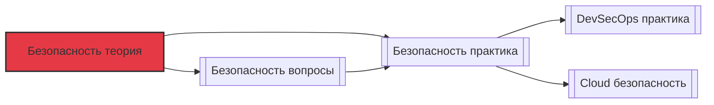

# 📄 Файл: `Безопасность теория.md`

tags: [security, devops, theory, infosec, compliance]
aliases: [security-theory, infosec-basics, security-fundamentals]
created: 2026-05-07
---

# 🔐 Безопасность: Теоретические основы для DevOps

> [!INFO] Структура
> Материал разделён по уровням: 🟢 Junior → 🟡 Middle → 🔴 Senior.  
> Каждый блок содержит: ключевые концепции, схемы, примеры и связь с практикой.

📋 [[#🗂️ Оглавление для навигации|Оглавление]] | [[#🧪 Чек-лист усвоения|Чек-лист]] | [[#🔗 Связь с другими файлами|Связи]]

---

## 🗂️ Оглавление для навигации

### 🟢 Junior (базовые концепции)
- [[#1. Триада информационной безопасности: CIA|1. CIA Triad]]
- [[#2. Аутентификация, авторизация, учёт: в чём разница?|2. AAA]]
- [[#3. Принципы наименьших привилегий и защиты в глубину|3. Least Privilege & Defense in Depth]]
- [[#4. Типы уязвимостей: классификация и примеры|4. Уязвимости]]
- [[#5. Криптография: симметричное и асимметричное шифрование|5. Криптография базово]]
- [[#6. Хэширование: назначение, свойства, алгоритмы|6. Хэширование]]
- [[#7. Что такое сертификат TLS и как работает рукопожатие?|7. TLS handshake]]
- [[#8. Модель угроз: зачем нужна и как строится?|8. Threat Modeling]]
- [[#9. Security vs Compliance: в чём разница?|9. Security vs Compliance]]
- [[#10. Базовые сетевые атаки: MITM, DDoS, XSS, SQLi|10. Сетевые атаки]]

### 🟡 Middle (применение, архитектура)
- [[#11. ⭐ Модель Zero Trust: принципы и реализация|11. Zero Trust ⭐]]
- [[#12. Управление секретами: принципы и архитектурные паттерны|12. Secrets Management]]
- [[#13. RBAC, ABAC, ReBAC: модели контроля доступа|13. Модели доступа]]
- [[#14. ⭐ Как работает PKI: цепочки доверия и отзыв сертификатов|14. PKI ⭐]]
- [[#15. Security Headers и CSP: защита веб-приложений на уровне браузера|15. Web Security Headers]]
- [[#16. Контейнерная безопасность: изоляция, namespaces, capabilities|16. Container Security]]
- [[#17. Security в CI/CD: SAST, DAST, SCA, IaC Scanning|17. DevSecOps инструменты]]
- [[#18. Логирование и аудит: что, как и зачем собирать?|18. Logging & Auditing]]
- [[#19. Инцидент-менеджмент: этапы реагирования и пост-мортем|19. Incident Response]]
- [[#20. Оценка рисков: качественные и количественные методы|20. Risk Assessment]]

### 🔴 Senior (архитектура, стратегии, trade-offs)
- [[#21. ⭐ Проектирование безопасной архитектуры: от требований до реализации|21. Secure Architecture ⭐]]
- [[#22. Cryptographic Agility: как проектировать системы с возможностью замены алгоритмов|22. Crypto Agility]]
- [[#23. Security в распределённых системах: consensus, replay attacks, mTLS|23. Distributed Security]]
- [[#24. Supply Chain Security: атака через зависимости и методы защиты|24. Supply Chain Security]]
- [[#25. ⭐ Threat Modeling на практике: STRIDE, PASTA, атака на архитектуру|25. Threat Modeling ⭐]]
- [[#26. Privacy by Design: GDPR, анонимизация, минимизация данных|26. Privacy Engineering]]
- [[#27. Security метрики и KPI: как измерять эффективность защиты?|27. Security Metrics]]
- [[#28. Red Team vs Blue Team vs Purple Team: стратегии тестирования|28. Security Testing]]
- [[#29. Compliance как код: автоматизация аудита (OPA, Sentinel, Checkov)|29. Policy as Code]]
- [[#30. ⭐ Стратегия безопасности для облачной инфраструктуры: shared responsibility и beyond|30. Cloud Security Strategy ⭐]]

---

## 🟢 Junior (базовые концепции)

### 1. Триада информационной безопасности: CIA
**Концепция**: 
- **Confidentiality** (Конфиденциальность) — доступ к данным только у авторизованных субъектов
- **Integrity** (Целостность) — данные не могут быть изменены несанкционированно
- **Availability** (Доступность) — данные и сервисы доступны, когда нужны

**Схема**:
```
          ┌─────────────┐
          │   CIA Triad │
          └──────┬──────┘
     ┌──────────┼──────────┐
     ▼          ▼          ▼
┌────────┐ ┌────────┐ ┌────────┐
│Encrypt │ │Hashes  │ │Redundancy│
│RBAC    │ │Signatures│ │Load Balancing│
│TLS     │ │WORM    │ │DDoS Protection│
└────────┘ └────────┘ └────────┘
```

**DevOps-контекст**: 
- Confidentiality: шифрование секретов в Vault, TLS для трафика
- Integrity: подписанные Docker-образы, checksums для артефактов
- Availability: health checks, auto-scaling, multi-AZ деплой

**Связь**: [[Безопасность практика#Шифрование данных в покое и при передаче|Практика: шифрование]]

[[#🗂️ Оглавление для навигации|↑ К оглавлению]]

### 2. Аутентификация, авторизация, учёт: в чём разница?
**Концепция (AAA)**:
| Термин | Вопрос | Пример |
|--------|--------|--------|
| **Authentication** | Кто ты? | Логин/пароль, MFA, сертификат |
| **Authorization** | Что тебе можно? | RBAC: `user:read`, `admin:write` |
| **Accounting** | Что ты сделал? | Аудит-логи: `user X deleted Y at Z` |

**DevOps-контекст**:
- В Kubernetes: аутентификация через OIDC, авторизация через RBAC, аудит через `audit.log`
- В CI/CD: сервисные аккаунты с минимальными правами + логирование всех действий

**Связь**: [[Безопасность вопросы#12. Управление секретами: принципы и архитектурные паттерны|Вопросы: Secrets Management]]

[[#🗂️ Оглавление для навигации|↑ К оглавлению]]

### 3. Принципы наименьших привилегий и защиты в глубину
**Концепция**:
- **Least Privilege**: субъект получает ровно столько прав, сколько нужно для задачи, и не больше
- **Defense in Depth**: многоуровневая защита, чтобы провал одного слоя не компрометировал систему

**Пример реализации**:
```
Уровень          Мера безопасности
─────────────────────────────────────
Сеть             Security Groups, WAF, DDoS protection
Хост             SELinux/AppArmor, минимальный OS image
Приложение       Input validation, параметризованные запросы
Данные           Шифрование, маскирование, токенизация
Доступ           MFA, JIT-доступ, review прав
Мониторинг       SIEM, алерты на аномалии
```

**DevOps-контекст**: 
- В Terraform: `iam_role` с конкретными `actions` и `resources`, а не `*:*`
- В Docker: запуск от non-root пользователя, `--read-only` filesystem, drop capabilities

**Связь**: [[Безопасность практика#Настройка RBAC в Kubernetes|Практика: RBAC]]

[[#🗂️ Оглавление для навигации|↑ К оглавлению]]

### 4. Типы уязвимостей: классификация и примеры
**Концепция**: Классификация по CWE/OWASP:

| Категория | Пример | Митигация |
|-----------|--------|-----------|
| **Injection** | SQLi, Command Injection | Параметризация, whitelist input |
| **Broken Auth** | Слабые пароли, сессии | MFA, secure session management |
| **Sensitive Data Exposure** | Хранение паролей в plain text | Шифрование, hashing с солью |
| **XXE** | XML External Entity | Отключение парсинга внешних сущностей |
| **Broken Access Control** | IDOR, вертикальный эскалация | Server-side authorization checks |
| **Security Misconfiguration** | Default credentials, debug mode | Hardening guides, IaC scanning |
| **XSS** | Reflected/Stored/DOM-based | CSP, output encoding |
| **Insecure Deserialization** | RCE через сериализованные объекты | Подпись объектов, safe parsers |
| **Using Components with Known Vulnerabilities** | Устаревшие библиотеки | SCA, dependabot, регулярные обновления |
| **Insufficient Logging & Monitoring** | Задержка обнаружения инцидента | Централизованное логирование, алерты |

**DevOps-контекст**: Интеграция сканеров уязвимостей в пайплайн: `trivy` для образов, `npm audit` для зависимостей, `tfsec` для Terraform.

**Связь**: [[Безопасность вопросы#4. Типы уязвимостей: классификация и примеры|Вопросы: уязвимости]]

[[#🗂️ Оглавление для навигации|↑ К оглавлению]]

### 5. Криптография: симметричное и асимметричное шифрование
**Концепция**:

```
Симметричное (AES, ChaCha20):
┌─────────────┐     ключ K     ┌─────────────┐
│ Plaintext   │ ───────────►  │ Ciphertext  │
└─────────────┘               └─────────────┘
         ◄───────────
              ключ K

• Быстрое, подходит для больших данных
• Проблема: безопасная передача ключа

Асимметричное (RSA, ECC):
┌─────────────┐   публичный ключ   ┌─────────────┐
│ Plaintext   │ ───────────────►  │ Ciphertext  │
└─────────────┘                   └─────────────┘
                         ◄───────────────
                        приватный ключ

• Решает проблему распределения ключей
• Медленное, используется для ключей/подписей
```

**Практическое применение**:
- **TLS**: асимметричное для обмена ключами, симметричное для трафика
- **Git commit signing**: GPG/SSH подписи
- **Secrets encryption**: Vault использует envelope encryption (DEK + KEK)

**Связь**: [[Безопасность практика#Работа с TLS сертификатами|Практика: TLS]]

[[#🗂️ Оглавление для навигации|↑ К оглавлению]]

### 6. Хэширование: назначение, свойства, алгоритмы
**Концепция**:
- **Назначение**: целостность данных, хранение паролей, адресация в структурах
- **Свойства криптографических хэшей**:
  - Детерминированность: одинаковый input → одинаковый output
  - Необратимость: по хэшу нельзя восстановить input
  - Устойчивость к коллизиям: сложно найти два input с одинаковым хэшем
  - Лавинный эффект: малое изменение input → радикальное изменение output

**Алгоритмы**:
| Алгоритм | Статус | Применение |
|----------|--------|------------|
| MD5 | ❌ Сломан | Не для безопасности, только checksum |
| SHA-1 | ⚠️ Устарел | Постепенно выводится из использования |
| SHA-256/384/512 | ✅ Актуален | Целостность, сертификаты, подписи |
| bcrypt / scrypt / Argon2 | ✅ Для паролей | Хранение паролей с солью и work factor |

**DevOps-контекст**: 
- Проверка целостности образов: `docker pull && sha256sum image.tar`
- Хранение паролей: никогда не хранить в plain text, использовать `bcrypt` с cost factor ≥ 12

**Связь**: [[Безопасность вопросы#6. Хэширование: назначение, свойства, алгоритмы|Вопросы: хэширование]]

[[#🗂️ Оглавление для навигации|↑ К оглавлению]]

### 7. Что такое сертификат TLS и как работает рукопожатие?
**Концепция**:
- **Сертификат** — цифровой документ, связывающий публичный ключ с идентичностью (домен, организация), подписанный доверенным CA
- **Формат**: X.509, содержит: subject, issuer, validity, public key, signature

**TLS 1.3 Handshake (упрощённо)**:
```
Client                          Server
   │                              │
   │ ── ClientHello ───────────►  │
   │   (supported suites, key share) │
   │                              │
   │ ◄── ServerHello ──────────  │
   │   (chosen suite, key share)   │
   │                              │
   │ ◄── Certificate ──────────  │
   │   (серверный сертификат)     │
   │                              │
   │ ◄── CertificateVerify ───  │
   │   (подпись сервера)          │
   │                              │
   │ ── Finished ─────────────►  │
   │   (подтверждение ключей)     │
   │                              │
   │ ◄── Finished ─────────────  │
   │                              │
   ▼                              ▼
[ Зашифрованный канал установлен ]
```

**DevOps-контекст**:
- Автоматизация: Let's Encrypt + cert-manager в Kubernetes
- mTLS: взаимная аутентикация сервисов в service mesh (Istio, Linkerd)
- Ротация: автоматическая перевыпуск сертификатов до истечения срока

**Связь**: [[Безопасность практика#Настройка mTLS в сервис-меше|Практика: mTLS]]

[[#🗂️ Оглавление для навигации|↑ К оглавлению]]

### 8. Модель угроз: зачем нужна и как строится?
**Концепция**: Модель угроз (Threat Model) — структурированное представление о том, что может пойти не так, кто может атаковать и как защититься.

**Процесс построения**:
1. **Декомпозиция системы**: диаграммы потоков данных, границы доверия
2. **Идентификация угроз**: по методологии (STRIDE, PASTA) или мозговой штурм
3. **Оценка рисков**: вероятность × воздействие
4. **Определение контрмер**: профилактика, детекция, реагирование
5. **Валидация и обновление**: модель живая, пересматривать при изменениях

**Пример STRIDE**:
| Угроза | Вопрос | Контрмера |
|--------|--------|-----------|
| **S**poofing | Может ли злоумышленник выдать себя за другого? | MFA, сертификаты |
| **T**ampering | Может ли изменить данные/код? | Подписи, checksums |
| **R**epudiation | Может ли отрицать свои действия? | Аудит-логи, подписи |
| **I**nformation Disclosure | Может ли получить доступ к данным? | Шифрование, RBAC |
| **D**enial of Service | Может ли нарушить доступность? | Rate limiting, scaling |
| **E**levation of Privilege | Может ли получить больше прав? | Least privilege, validation |

**DevOps-контекст**: Интеграция threat modeling в дизайн-ревью архитектуры и в Definition of Done для фич.

**Связь**: [[Безопасность вопросы#25. Threat Modeling на практике|Вопросы: Threat Modeling]]

[[#🗂️ Оглавление для навигации|↑ К оглавлению]]

### 9. Security vs Compliance: в чём разница?
**Концепция**:
| Аспект | Security | Compliance |
|--------|----------|------------|
| **Цель** | Защита от реальных угроз | Соответствие регуляторным требованиям |
| **Драйвер** | Риски, инциденты | Законы, стандарты, контракты |
| **Метрика** | MTTR, количество инцидентов | Прохождение аудита, чек-листы |
| **Гибкость** | Адаптивная, на основе угроз | Фиксированная, на основе требований |

**Важно**: Compliance ≠ Security. Можно пройти аудит, но быть уязвимым. И наоборот: сильная security-позиция может не покрывать специфичные требования регулятора.

**Примеры стандартов**:
- **GDPR** — защита персональных данных (ЕС)
- **PCI DSS** — безопасность платёжных данных
- **SOC 2** — контроль безопасности, доступности, конфиденциальности
- **ISO 27001** — система управления информационной безопасностью

**DevOps-контекст**: Автоматизация комплаенса через Policy as Code: OPA, Sentinel, Checkov для проверки инфраструктуры на соответствие требованиям.

**Связь**: [[Безопасность вопросы#29. Compliance как код|Вопросы: Policy as Code]]

[[#🗂️ Оглавление для навигации|↑ К оглавлению]]

### 10. Базовые сетевые атаки: MITM, DDoS, XSS, SQLi
**Концепция**:

| Атака | Механизм | Пример | Защита |
|-------|----------|--------|--------|
| **MITM** (Man-in-the-Middle) | Перехват и модификация трафика | ARP spoofing, rogue Wi-Fi | TLS, certificate pinning, HSTS |
| **DDoS** (Distributed Denial of Service) | Перегрузка ресурса запросами | UDP flood, HTTP flood | Rate limiting, CDN, WAF, auto-scaling |
| **XSS** (Cross-Site Scripting) | Внедрение вредоносного JS в страницу | `<script>stealCookies()</script>` | CSP, output encoding, input validation |
| **SQLi** (SQL Injection) | Внедрение вредоносного SQL-кода | `' OR '1'='1` | Параметризованные запросы, ORM |

**DevOps-контекст**:
- WAF (Web Application Firewall) как первый рубеж: AWS WAF, Cloudflare, ModSecurity
- Интеграция сканеров в CI: `zap-cli`, `sqlmap` (с осторожностью), `nikto`
- Мониторинг аномального трафика: алерты на всплески запросов, необычные user-agent

**Связь**: [[Безопасность практика#Настройка WAF и rate limiting|Практика: защита периметра]]

[[#🗂️ Оглавление для навигации|↑ К оглавлению]]

---

## 🟡 Middle (применение, архитектура)

### 11. ⭐ Модель Zero Trust: принципы и реализация
**Концепция**:
> "Никогда не доверяй, всегда проверяй" (Never trust, always verify)

**Ключевые принципы**:
1. **Явная верификация**: аутентификация и авторизация для каждого запроса
2. **Принцип наименьших привилегий**: доступ по необходимости, с ограничением по времени и контексту
3. **Предположение о компрометации**: мониторинг и аудит всех действий, сегментация

**Архитектурные компоненты**:
```
┌─────────────────────────────────────┐
│          Identity Provider          │
│  (OIDC, MFA, устройства, поведение) │
└──────────────┬──────────────────────┘
               ▼
┌─────────────────────────────────────┐
│         Policy Decision Point       │
│  (оценка контекста: кто, что, где,  │
│   когда, как → разрешить/отклонить) │
└──────────────┬──────────────────────┘
               ▼
┌─────────────────────────────────────┐
│   Policy Enforcement Point (PEP)    │
│  (прокси, сервис-меш, API Gateway)  │
└─────────────────────────────────────┘
```

**DevOps-реализация**:
- **Сеть**: микросегментация через service mesh (Istio AuthorizationPolicy)
- **Доступ**: JIT (Just-In-Time) доступ через Vault, временные сертификаты
- **Устройства**: проверка состояния устройства перед доступом (Intune, Jamf)
- **Данные**: шифрование на уровне приложения, tokenization

**Связь**: [[Безопасность вопросы#11. Модель Zero Trust|Вопросы: Zero Trust]] | [[Безопасность практика#Реализация mTLS и политик доступа|Практика]]

[[#🗂️ Оглавление для навигации|↑ К оглавлению]]

### 12. Управление секретами: принципы и архитектурные паттерны
**Концепция**:
> Секрет — любая конфиденциальная информация: пароли, ключи API, токены, сертификаты

**Принципы**:
1. **Никогда не хранить в коде** — даже в приватных репозиториях
2. **Шифровать в покое и при передаче** — secrets manager + TLS
3. **Ротация** — автоматическая смена секретов без downtime
4. **Аудит** — логирование всех обращений к секретам
5. **Least privilege** — сервис получает только нужные ему секреты

**Архитектурные паттерны**:
| Паттерн | Описание | Инструменты |
|---------|----------|-------------|
| **Centralized Vault** | Единое хранилище с API | HashiCorp Vault, AWS Secrets Manager |
| **Sidecar Injection** | Секреты монтируются в pod как volume | Kubernetes Secrets + CSI driver |
| **Dynamic Secrets** | Временные учётные данные по запросу | Vault DB secrets engine, IAM roles |
| **Envelope Encryption** | DEK шифрует данные, KEK шифрует DEK | Vault transit engine, KMS |

**Пример потока в Kubernetes**:
```
1. Приложение стартует → запрашивает секрет у Vault через JWT аутентификацию
2. Vault проверяет JWT → выдаёт динамический секрет с TTL
3. Приложение получает секрет в память → использует → не сохраняет на диск
4. По истечении TTL секрет автоматически отзывается
```

**Связь**: [[Безопасность вопросы#12. Управление секретами|Вопросы]] | [[Безопасность практика#Настройка HashiCorp Vault|Практика]]

[[#🗂️ Оглавление для навигации|↑ К оглавлению]]

### 13. RBAC, ABAC, ReBAC: модели контроля доступа
**Концепция**:

| Модель | Основа решения | Пример | Плюсы | Минусы |
|--------|---------------|--------|-------|--------|
| **RBAC** (Role-Based) | Роль пользователя | `admin`, `developer` | Простота, масштабируемость | Жёсткость, сложно для динамичных правил |
| **ABAC** (Attribute-Based) | Атрибуты субъекта/ресурса/действия | `user.department == resource.owner` | Гибкость, контекст | Сложность политики, производительность |
| **ReBAC** (Relationship-Based) | Отношения между сущностями | "Доступ к файлу, если ты в том же проекте" | Естественность для коллаборации | Требует графовой модели данных |

**Пример ABAC-политики (OPA/Rego)**:
```rego
package kubernetes.admission

deny[msg] {
  input.request.kind.kind == "Pod"
  input.request.object.spec.containers[i].securityContext.privileged == true
  msg := "Privileged containers are not allowed"
}

allow {
  input.request.userInfo.username == "admin"
  input.request.operation == "DELETE"
}
```

**DevOps-контекст**:
- Kubernetes: RBAC через `Role`/`ClusterRole`, ABAC через OPA Gatekeeper
- Cloud: IAM policies с условиями (ABAC-подобные)
- Приложения: авторизация через Casbin, Oso, или кастомную логику

**Связь**: [[Безопасность практика#Настройка OPA Gatekeeper|Практика: ABAC]]

[[#🗂️ Оглавление для навигации|↑ К оглавлению]]

### 14. ⭐ Как работает PKI: цепочки доверия и отзыв сертификатов
**Концепция**:
**PKI (Public Key Infrastructure)** — система создания, управления и отзыва цифровых сертификатов.

**Цепочка доверия**:
```
[Root CA] (самоподписанный, доверен "из коробки")
    │
    ▼
[Intermediate CA] (подписан Root)
    │
    ▼
[Leaf Certificate] (подписан Intermediate, для домена/сервиса)
```

**Проверка сертификата**:
1. Проверка подписи каждого уровня цепочки
2. Проверка срока действия (Not Before / Not After)
3. Проверка отзыва:
   - **CRL** (Certificate Revocation List) — список отозванных, скачивается периодически
   - **OCSP** (Online Certificate Status Protocol) — онлайн-запрос статуса
   - **OCSP Stapling** — сервер сам предоставляет свежий OCSP-ответ

**DevOps-контекст**:
- **cert-manager** в Kubernetes: автоматическая выдача и ротация сертификатов от Let's Encrypt или внутренней PKI
- **mTLS в сервис-меше**: каждый сервис получает сертификат от внутреннего CA, цепочка доверяется кластером
- **Отзыв**: при компрометации ключа — немедленный отзыв через OCSP + пересоздание сертификатов

**Связь**: [[Безопасность вопросы#14. Как работает PKI|Вопросы]] | [[Безопасность практика#Настройка внутреннего CA|Практика]]

[[#🗂️ Оглавление для навигации|↑ К оглавлению]]

### 15. Security Headers и CSP: защита веб-приложений на уровне браузера
**Концепция**:
Заголовки безопасности инструктируют браузер, как обрабатывать контент, чтобы предотвратить атаки.

**Ключевые заголовки**:
| Заголовок | Назначение | Пример значения |
|-----------|------------|-----------------|
| `Strict-Transport-Security` | Принудительный HTTPS | `max-age=31536000; includeSubDomains` |
| `Content-Security-Policy` | Ограничение источников скриптов/стилей | `default-src 'self'; script-src 'self' https://cdn.example.com` |
| `X-Content-Type-Options` | Запрет MIME-sniffing | `nosniff` |
| `X-Frame-Options` | Защита от clickjacking | `DENY` или `SAMEORIGIN` |
| `Referrer-Policy` | Контроль передачи Referer | `strict-origin-when-cross-origin` |
| `Permissions-Policy` | Ограничение браузерных фич | `geolocation=(), camera=()` |

**CSP (Content Security Policy) — детально**:
- Директивы: `default-src`, `script-src`, `style-src`, `img-src`, `connect-src` и др.
- Источники: `'self'`, `'unsafe-inline'`, `'unsafe-eval'`, `https://trusted.cdn.com`, `nonce-<random>`, `hash-<base64>`
- Режимы: `Content-Security-Policy` (блокировка), `Content-Security-Policy-Report-Only` (только логирование)

**DevOps-контекст**:
- Настройка в reverse proxy (Nginx, Traefik) или через middleware приложения
- Автоматическое тестировь заголовков в CI: `securityheaders.com` API, `zap-cli`
- Мониторинг нарушений CSP через `report-uri` или `report-to`

**Связь**: [[Безопасность практика#Настройка security headers в Nginx|Практика]]

[[#🗂️ Оглавление для навигации|↑ К оглавлению]]

### 16. Контейнерная безопасность: изоляция, namespaces, capabilities
**Концепция**:
Контейнеры — не виртуальные машины. Изоляция обеспечивается на уровне ядра:

**Механизмы изоляции**:
| Механизм | Назначение | Пример |
|----------|------------|--------|
| **Namespaces** | Изоляция ресурсов: PID, сеть, mount, IPC, UTS, user | `pid namespace` → процессы внутри контейнера не видят процессы хоста |
| **Cgroups** | Ограничение потребления ресурсов: CPU, memory, I/O | `memory.limit_in_bytes=512M` |
| **Capabilities** | Дробление root-прав на отдельные привилегии | `CAP_NET_BIND_SERVICE` — привязка к портам <1024 без полного root |
| **Seccomp** | Фильтрация системных вызовов | Профиль: запрещает `mount()`, `ptrace()` |
| **AppArmor/SELinux** | Mandatory Access Control: политики доступа к файлам, сетям | Профиль: "контейнер не может читать /etc/shadow" |

**DevOps-контекст**:
- Безопасный Dockerfile: `USER nobody`, `RUN apt-get update && apt-get install -y myapp && apt-get clean`, `HEALTHCHECK`
- Kubernetes securityContext: `runAsNonRoot: true`, `allowPrivilegeEscalation: false`, `capabilities.drop: ["ALL"]`
- Сканирование образов: `trivy image myapp:latest`, `docker scan`

**Связь**: [[Безопасность вопросы#16. Контейнерная безопасность|Вопросы]] | [[Безопасность практика#Hardening Docker и Kubernetes|Практика]]

[[#🗂️ Оглавление для навигации|↑ К оглавлению]]

### 17. Security в CI/CD: SAST, DAST, SCA, IaC Scanning
**Концепция**:
Интеграция проверок безопасности на разных этапах пайплайна (Shift Left):

```
[Code] → [Build] → [Test] → [Deploy] → [Run]
   │        │        │         │         │
   ▼        ▼        ▼         ▼         ▼
 SAST     SCA     DAST     IaC Scan  Runtime Protection
```

**Типы сканирования**:
| Тип | Полное название | Что проверяет | Примеры инструментов |
|-----|----------------|---------------|---------------------|
| **SAST** | Static Application Security Testing | Исходный код на уязвимости | SonarQube, Semgrep, CodeQL |
| **SCA** | Software Composition Analysis | Зависимости на известные уязвимости | Dependabot, Snyk, Trivy |
| **DAST** | Dynamic Application Security Testing | Запущенное приложение (черный ящик) | OWASP ZAP, Burp Suite |
| **IaC Scan** | Infrastructure as Code Scanning | Terraform, K8s манифесты на мисконфигурации | Checkov, tfsec, KubeLinter |
| **Container Scan** | Сканирование образов | Слои Docker-образа на уязвимости и секреты | Trivy, Grype, Clair |

**DevOps-контекст**:
- Стратегия: не блокировать пайплайн на все уязвимости, а по критичности (Critical/High → fail, Medium → warn)
- Интеграция: `trivy fs . --exit-code 1 --severity CRITICAL,HIGH`
- Отчётность: агрегация результатов в Security Dashboard (DefectDojo, Dependency-Track)

**Связь**: [[Безопасность практика#Настройка DevSecOps пайплайна|Практика]]

[[#🗂️ Оглавление для навигации|↑ К оглавлению]]

### 18. Логирование и аудит: что, как и зачем собирать?
**Концепция**:
> "Если это не залогировано — этого не было"

**Что логировать**:
- **Аутентификация**: успешные/неуспешные входы, смена прав
- **Авторизация**: попытки доступа к ресурсам, особенно отклонённые
- **Изменения конфигурации**: кто, что, когда изменил в инфраструктуре
- **Доступ к данным**: чтение/запись чувствительных данных (с маскированием!)
- **Системные события**: ошибки, перезагрузки, аномалии ресурсов

**Принципы качественного логирования**:
1. **Структурированность**: JSON вместо plain text для парсинга
2. **Контекст**: correlation ID, user ID, session ID в каждом событии
3. **Безопасность логов**: защита от инъекций, маскирование секретов
4. **Неизменяемость**: write-once storage, WORM для аудита
5. **Ретенция**: политики хранения согласно комплаенсу

**DevOps-контекст**:
- Stack: Fluent Bit → Kafka → Elasticsearch → Kibana (EFK) или Loki + Grafana
- Алертинг: правила в Prometheus Alertmanager на аномалии (много неудачных входов, доступ из новой страны)
- Аудит в Kubernetes: включение `auditPolicy` с логированием запросов к API server

**Связь**: [[Безопасность вопросы#18. Логирование и аудит|Вопросы]] | [[Безопасность практика#Настройка ELK для security-логов|Практика]]

[[#🗂️ Оглавление для навигации|↑ К оглавлению]]

### 19. Инцидент-менеджмент: этапы реагирования и пост-мортем
**Концепция**:
**Жизненный цикл инцидента (NIST/ISO 27035)**:
```
1. Preparation     → Планы, инструменты, тренировки (tabletop exercises)
2. Detection & Analysis → SIEM алерты, триаж, классификация
3. Containment     → Изоляция поражённых систем, сохранение доказательств
4. Eradication     → Устранение причины: патч, отзыв ключа, удаление бэкдора
5. Recovery        → Восстановление сервисов, мониторинг на рецидив
6. Lessons Learned → Пост-мортем: что случилось, почему, как предотвратить
```

**Пост-мортем (Blameless)**:
- Фокус на системные причины, а не на человеческие ошибки
- Документирование: таймлайн, root cause, action items с владельцами и дедлайнами
- Публичность: внутри команды/организации для обучения

**DevOps-контекст**:
- Автоматизация реагирования: SOAR-платформы, webhook в Slack + runbook
- Интеграция с тикет-системой: автоматическое создание инцидента в Jira при алерте
- Тестирование планов: регулярные chaos engineering + security drills

**Связь**: [[Безопасность вопросы#19. Инцидент-менеджмент|Вопросы]] | [[Безопасность практика#Проведение tabletop exercise|Практика]]

[[#🗂️ Оглавление для навигации|↑ К оглавлению]]

### 20. Оценка рисков: качественные и количественные методы
**Концепция**:
**Риск = Вероятность × Воздействие**

**Качественная оценка**:
- Шкалы: Низкий / Средний / Высокий / Критический
- Матрица рисков:
```
Воздействие
   ▲
Кр │  ● Средний  │  ● Высокий  │  ● Критический
и  ├─────────────┼─────────────┼─────────────
т  │  ● Низкий   │  ● Средний  │  ● Высокий
и  ├─────────────┼─────────────┼─────────────
ч  │  ● Игнор    │  ● Низкий   │  ● Средний
е  └─────────────┴─────────────┴─────────────► Вероятность
```

**Количественная оценка**:
- **ALE** (Annualized Loss Expectancy) = SLE × ARO
  - SLE (Single Loss Expectancy) = стоимость одного инцидента
  - ARO (Annual Rate of Occurrence) = сколько раз в год ожидается
- Пример: утечка базы клиентов → $500k × 0.1 раза/год = $50k/год риска

**DevOps-контекст**:
- Приоритизация бэклога безопасности: фичи с высоким риском → выше в приоритете
- Обоснование инвестиций в безопасность: "внедрение WAF снизит вероятность атаки на 70%, экономия $30k/год"
- Интеграция с Jira: risk score как поле в тикетах

**Связь**: [[Безопасность вопросы#20. Оценка рисков|Вопросы]]

[[#🗂️ Оглавление для навигации|↑ К оглавлению]]

---

## 🔴 Senior (архитектура, стратегии, trade-offs)

### 21. ⭐ Проектирование безопасной архитектуры: от требований до реализации
**Концепция**:
**Процесс Secure by Design**:
```
1. Требования
   ├─ Функциональные: что система делает
   ├─ Нефункциональные: производительность, масштабируемость
   └─ **Безопасность**: конфиденциальность, целостность, доступность, комплаенс

2. Архитектурное проектирование
   ├─ Диаграммы: C4 model, потоки данных, границы доверия
   ├─ Threat modeling: STRIDE на каждом компоненте
   └─ Выбор паттернов: Zero Trust, defense in depth, least privilege

3. Детальное проектирование
   ├─ Спецификация контролей: шифрование, аутентификация, логирование
   ├─ Интерфейсы: API security, валидация входных данных
   └─ Зависимости: управление уязвимостями в сторонних компонентах

4. Реализация и верификация
   ├─ Secure coding standards, code review checklist
   ├─ Автоматизированные тесты безопасности в CI
   └─ Пен-тесты и red team упражнения

5. Эксплуатация и мониторинг
   ├─ Security monitoring: SIEM, алерты, дашборды
   ├─ Инцидент-ответ: playbooks, automation
   └─ Непрерывное улучшение: пост-мортемы, обновление модели угроз
```

**Trade-offs и решения**:
| Дилемма | Варианты | Критерии выбора |
|---------|----------|-----------------|
| **Безопасность vs Удобство** | MFA везде / только для админов | Риск данных, пользовательский опыт, регуляторные требования |
| **Шифрование vs Производительность** | AES-256 / AES-128 / без шифрования | Чувствительность данных, latency SLA, аппаратное ускорение |
| **Централизация vs Децентрализация** | Единый Vault / секреты в каждом сервисе | Масштаб, скорость изменений, требования к доступности |

**DevOps-контекст**:
- Infrastructure as Code: security controls как код (Terraform modules с встроенными политиками)
- GitOps для безопасности: политики в Git, автоматическое применение через ArgoCD
- Документация: ADR (Architecture Decision Records) для security-решений

**Связь**: [[Безопасность вопросы#21. Проектирование безопасной архитектуры|Вопросы]] | [[Безопасность практика#Пример ADR для security-решения|Практика]]

[[#🗂️ Оглавление для навигации|↑ К оглавлению]]

### 22. Cryptographic Agility: как проектировать системы с возможностью замены алгоритмов
**Концепция**:
> Криптографическая гибкость — способность системы заменить криптоалгоритм без переписывания всей кодовой базы.

**Зачем нужно**:
- Алгоритмы устаревают (SHA-1, RSA-1024) или ломаются (квантовые компьютеры → пост-квантовая криптография)
- Требования комплаенса меняются (NIST, PCI DSS)
- Производительность: переход на более быстрые алгоритмы (ChaCha20 vs AES на устройствах без AES-NI)

**Паттерны реализации**:
1. **Абстракция крипто-провайдера**:
```python
# Псевдокод
class CryptoProvider:
    def encrypt(self, plaintext: bytes, key: Key) -> bytes: ...
    def decrypt(self, ciphertext: bytes, key: Key) -> bytes: ...

# Реализации
class AES256Provider(CryptoProvider): ...
class ChaCha20Provider(CryptoProvider): ...

# Использование
provider = CryptoProviderFactory.get_provider(config.algorithm)
ciphertext = provider.encrypt(data, key)
```

2. **Версионирование ключей и алгоритмов**:
- Хранить `algorithm_id` и `key_version` вместе с зашифрованными данными
- При чтении: определить алгоритм по метаданным → выбрать провайдер → расшифровать
- Фоновая миграция: при чтении старых данных → перешифровать новым алгоритмом

3. **Envelope encryption с гибкостью**:
```
Данные шифруются DEK (Data Encryption Key)
DEK шифруется разными KEK (Key Encryption Key) под разные алгоритмы
При ротации: перешифровать только DEK, а не все данные
```

**DevOps-контекст**:
- Vault Transit Engine: поддерживает несколько ключей и алгоритмов, прозрачная ротация
- Kubernetes: External KMS providers с поддержкой нескольких алгоритмов
- Тестирование: chaos-тесты на отключение алгоритмов, проверка фоллбэков

**Связь**: [[Безопасность вопросы#22. Cryptographic Agility|Вопросы]]

[[#🗂️ Оглавление для навигации|↑ К оглавлению]]

### 23. Security в распределённых системах: consensus, replay attacks, mTLS
**Концепция**:
Распределённые системы вводят новые векторы атак:

**Ключевые проблемы и решения**:
| Проблема | Описание | Решение |
|----------|----------|---------|
| **Consensus security** | Злоумышленник может повлиять на выбор лидера в Raft/Paxos | Аутентификация узлов, кворум доверенных нод, аудит голосов |
| **Replay attacks** | Перехват и повторная отправка валидного сообщения | Nonce, timestamps, sequence numbers, idempotency keys |
| **Clock skew** | Рассинхронизация времени ломает валидацию токенов/сертификатов | NTP с аутентификацией, допуск в валидации, логика "grace period" |
| **Partial failure** | Атака на один узел не должна компрометировать систему | Изоляция, автоматическое исключение скомпрометированных нод |
| **Service identity** | Как сервис подтверждает свою идентичность в mesh? | mTLS с короткоживущими сертификатами, SPIFFE/SPIRE |

**mTLS в сервис-меше**:
```
Сервис A                          Сервис B
   │                                │
   │ 1. Запрашивает сертификат у CA │
   │ ◄──────────────────────────── │
   │ 2. Получает cert_A (TTL=24h)   │
   │                                │
   │ 3. Инициирует соединение к B   │
   │ ── ClientHello + cert_A ───►  │
   │                                │
   │ ◄── ServerHello + cert_B ───  │
   │                                │
   │ 4. Взаимная проверка:         │
   │    • Подпись от доверенного CA│
   │    • Срок действия            │
   │    • SAN (SPIFFE ID)          │
   │                                │
   │ 5. Установление сессионного ключа │
   │ ◄────────────────────────────► │
   │                                │
   ▼ [ Зашифрованный и аутентифицированный канал ] ▼
```

**DevOps-контекст**:
- SPIFFE/SPIRE: стандарт для identity в распределённых системах, интеграция с Istio/Linkerd
- Автоматическая ротация: сертификаты с TTL 24h, перевыпуск каждые 12h без downtime
- Мониторинг: алерты на истечение сертификатов, аномалии в аутентификации

**Связь**: [[Безопасность вопросы#23. Security в распределённых системах|Вопросы]] | [[Безопасность практика#Настройка SPIRE + Istio|Практика]]

[[#🗂️ Оглавление для навигации|↑ К оглавлению]]

### 24. Supply Chain Security: атака через зависимости и методы защиты
**Концепция**:
> Атака на цепочку поставок — компрометация программного обеспечения через уязвимости в зависимостях, инструментах сборки или процессах доставки.

**Известные инциденты**:
- **SolarWinds (2020)**: компрометация системы сборки → бэкдор в обновлениях
- **CodeCov (2021)**: утечка токенов через скомпрометированный скрипт загрузки
- **event-stream (2018)**: вредоносный пакет в npm-зависимостях
- **Log4j (2021)**: уязвимость в широко используемой библиотеке

**Модель угроз для цепочки поставок**:
```
[Исходный код] → [Зависимости] → [Сборка] → [Артефакт] → [Дистрибуция] → [Развёртывание]
      │              │              │           │              │              │
      ▼              ▼              ▼           ▼              ▼              ▼
  Commit signing  SCA сканирование  Изолированная  Подпись    Проверка      Runtime
  Review процесса  на уязвимости    среда сборки   артефакта  целостности   защита
```

**Методы защиты**:
1. **Software Bill of Materials (SBOM)**:
   - Форматы: SPDX, CycloneDX, SWID
   - Генерация: `syft`, `cyclonedx-maven-plugin`, `trivy sbom`
   - Использование: аудит зависимостей, быстрый ответ на уязвимости

2. **Подпись и верификация артефактов**:
   - **Sigstore**: Cosign для подписи образов, Rekor для прозрачного лога, Fulcio для сертификатов
   - **Ключевые команды**:
     ```bash
     # Подпись образа
     cosign sign --key cosign.key myapp:1.0.0
     
     # Верификация в пайплайне
     cosign verify --key cosign.pub myapp:1.0.0 && kubectl apply -f deployment.yaml
     ```

3. **Изоляция сборки**:
   - Ephemeral CI-раннеры с чистым образом
   - Запрет сетевого доступа во время сборки (кроме доверенных репозиториев)
   - Аудит всех шагов пайплайна

4. **Зависимости**:
   - Lock files: `package-lock.json`, `Gemfile.lock`, `poetry.lock`
   - Приватные прокси: Nexus, Artifactory с кэшированием и сканированием
   - Автоматические обновления: Dependabot, Renovate с review-процессом

**DevOps-контекст**:
- Интеграция в пайплайн: генерация SBOM → подпись артефакта → верификация при деплое
- Политики: блокировка деплоя неподписанных образов через Admission Controller
- Мониторинг: алерты на новые уязвимости в зависимостях через OSV.dev API

**Связь**: [[Безопасность вопросы#24. Supply Chain Security|Вопросы]] | [[Безопасность практика#Настройка Sigstore Cosign|Практика]]

[[#🗂️ Оглавление для навигации|↑ К оглавлению]]

### 25. ⭐ Threat Modeling на практике: STRIDE, PASTA, атака на архитектуру
**Концепция**:
**Методологии**:

| Методология | Фокус | Этапы | Когда использовать |
|-------------|-------|-------|-------------------|
| **STRIDE** | Технические угрозы | 1. Декомпозиция 2. Идентификация по 6 категориям 3. Оценка 4. Контрмеры | На уровне компонентов, для разработчиков |
| **PASTA** | Риски для бизнеса | 1. Определение целей 2. Технический обзор 3. Анализ приложений 4. Угрозы 5. Уязвимости 6. Моделирование атак 7. Анализ рисков | Для архитектурных решений, с участием бизнеса |
| **Attack Trees** | Пути атаки | 1. Цель атаки 2. Декомпозиция на подцели 3. Оценка вероятности/сложности | Для анализа конкретных сценариев, red team |

**Практический пример (STRIDE) для API Gateway**:
```
Компонент: API Gateway
Границы доверия: внешний интернет ↔ внутренняя сеть

Угрозы:
• Spoofing: злоумышленник подделывает JWT → Контрмера: валидация подписи, short TTL, refresh token rotation
• Tampering: модификация запроса в пути → Контрмера: TLS, HMAC для внутренних вызовов
• Repudiation: пользователь отрицает запрос → Контрмера: аудит-логи с подписью, immutable storage
• Information Disclosure: утечка данных через ошибки → Контрмера: унифицированные сообщения об ошибках, masking в логах
• DoS: flood запросов → Контрмера: rate limiting, WAF, auto-scaling
• Elevation of Privilege: доступ к админским эндпоинтам → Контрмера: RBAC, отдельный auth flow для admin

Оценка рисков (пример):
- Spoofing с подделкой JWT: вероятность 3/5, воздействие 5/5 → риск 15/25 → приоритет: высокий
- Контрмера: внедрить JWK rotation + мониторинг аномальных паттернов валидации
```

**Инструменты**:
- **Microsoft Threat Modeling Tool**: визуальный редактор с шаблонами STRIDE
- **OWASP Threat Dragon**: open-source, интеграция с Git
- **IriusRisk**: коммерческий, с автоматической генерацией контрмер

**DevOps-контекст**:
- Интеграция в процесс: threat modeling как часть Definition of Done для эпиков
- Автоматизация: генерация checklist из модели для code review
- Живая модель: обновление при изменении архитектуры, триггер — изменение в диаграммах C4

**Связь**: [[Безопасность вопросы#25. Threat Modeling|Вопросы]] | [[Безопасность практика#Пример threat model в Markdown|Практика]]

[[#🗂️ Оглавление для навигации|↑ К оглавлению]]

### 26. Privacy by Design: GDPR, анонимизация, минимизация данных
**Концепция**:
> Защита приватности должна быть встроена в систему с самого начала, а не добавлена постфактум.

**Принципы Privacy by Design (Ann Cavoukian)**:
1. Proactive not Reactive
2. Privacy as the Default Setting
3. Privacy Embedded into Design
4. Full Functionality — Positive-Sum, not Zero-Sum
5. End-to-End Security — Full Lifecycle Protection
6. Visibility and Transparency
7. Respect for User Privacy

**Технические паттерны**:
| Паттерн | Описание | Пример реализации |
|---------|----------|-------------------|
| **Минимизация данных** | Собирать только то, что необходимо | Не хранить полный IP, только /24 подсеть для аналитики |
| **Псевдонимизация** | Замена идентификаторов на искусственные | `user_id=123` → `token=abc789`, маппинг в отдельном хранилище |
| **Анонимизация** | Необратимое удаление связи с субъектом | Агрегация, добавление шума (differential privacy) |
| **Шифрование на уровне приложения** | Данные зашифрованы до попадания в БД | Application-layer encryption с ключами у клиента |
| **Право на забвение** | Возможность полного удаления данных | Soft delete + background job для физического удаления, каскадное удаление в зависимых системах |

**GDPR ключевые требования**:
- **Lawful basis**: согласие, контракт, законный интерес — документировать основание для каждого типа данных
- **Data Protection Impact Assessment (DPIA)**: оценка рисков для приватности перед запуском новых фич
- **Data Subject Rights**: доступ, исправление, удаление, перенос данных — технические возможности для выполнения в срок (30 дней)
- **Breach notification**: уведомление регулятора в течение 72 часов после обнаружения утечки

**DevOps-контекст**:
- Автоматизация прав субъектов: API для экспорта/удаления данных пользователя
- Логирование с приватностью: маскирование персональных данных в логах, отдельный доступ к "сырым" логам
- Тестирование: данные для тестов — синтетические или анонимизированные, никогда не production

**Связь**: [[Безопасность вопросы#26. Privacy by Design|Вопросы]]

[[#🗂️ Оглавление для навигации|↑ К оглавлению]]

### 27. Security метрики и KPI: как измерять эффективность защиты?
**Концепция**:
> "Что нельзя измерить, тем нельзя управлять" — но важно измерять правильные вещи.

**Категории метрик**:

| Категория | Примеры метрик | Зачем нужно |
|-----------|----------------|-------------|
| **Проактивные** (предотвращение) | • % кода, покрытого SAST<br>• Время от обнаружения уязвимости до фикса (MTTR)<br>• % сервисов с включённым mTLS | Показать, что безопасность встроена в процесс |
| **Детективные** (обнаружение) | • Mean Time to Detect (MTTD)<br>• % алертов с true positive<br>• Покрытие критических активов мониторингом | Оценить эффективность мониторинга |
| **Реактивные** (реагирование) | • Mean Time to Respond (MTTR)<br>• % инцидентов с выполненным post-mortem<br>• Время восстановления после атаки | Измерить готовность к инцидентам |
| **Бизнес-ориентированные** | • Стоимость инцидентов ($)<br>• Риск, сниженный контрмерами ($)<br>• Соответствие требованиям (аудит) | Обосновать инвестиции в безопасность |

**Пример дашборда (Grafana)**:
```
[Security Health Dashboard]
├─ Vulnerability Management
│  ├─ Critical vulns open: 3 ▼ (was 12)
│  ├─ Avg. fix time: 4.2 days (target: <7)
│  └─ Coverage: 94% of repos scanned
├─ Access Control
│  ├─ Privileged accounts: 12 (reviewed: 100%)
│  ├─ MFA adoption: 98.7%
│  └─ Unused permissions removed: 234 this month
├─ Incident Response
│  ├─ MTTD: 18 min (target: <30)
│  ├─ MTTR: 2.1h (target: <4h)
│  └─ Post-mortems completed: 100%
└─ Compliance
   ├─ Policies as code: 47/50 checks passing
   ├─ Audit findings: 2 open (low severity)
   └─ Last penetration test: 2026-03-15 ✓
```

**Anti-patterns**:
- ❌ Измерять количество найденных уязвимостей → поощряет "охоту за цифрами", а не реальное снижение риска
- ❌ Использовать метрики для наказания команд → скрывают проблемы, а не решают их
- ✅ Связывать метрики с бизнес-целями: "снижение риска утечки данных на 40%" вместо "исправлено 100 багов"

**DevOps-контекст**:
- Автоматический сбор метрик: интеграция сканеров, тикет-систем, мониторинга в единую платформу
- Регулярный обзор: security metrics review на engineering all-hands раз в квартал
- Прозрачность: публичный (внутри компании) дашборд для формирования культуры безопасности

**Связь**: [[Безопасность вопросы#27. Security метрики|Вопросы]]

[[#🗂️ Оглавление для навигации|↑ К оглавлению]]

### 28. Red Team vs Blue Team vs Purple Team: стратегии тестирования
**Концепция**:

| Команда | Роль | Фокус | Инструменты |
|---------|------|-------|-------------|
| **Red Team** | Атакующие | Найти пути компрометации, имитируя реального злоумышленника | Metasploit, Cobalt Strike, кастомные эксплойты, социальная инженерия |
| **Blue Team** | Защитники | Детектировать и реагировать на атаки, укреплять защиту | SIEM, EDR, WAF, правила корреляции, playbooks |
| **Purple Team** | Коллаборация | Улучшать детекцию и защиту через совместные упражнения | Общие сценарии, feedback loop, совместные пост-мортемы |

**Типы упражнений**:
- **Tabletop Exercise**: обсуждение сценария за столом, без технических действий
- **Simulation**: Red Team проводит контролируемую атаку, Blue Team детектирует
- **Full-scope Exercise**: максимально реалистичная атака с минимальными ограничениями

**Пример сценария Purple Team**:
```
Цель: проверить детекцию lateral movement в Kubernetes

1. Подготовка (совместно):
   - Определить критичные активы: namespace production, сервис payments
   - Установить базовые метрики: нормальный трафик между сервисами

2. Атака (Red Team):
   - Компрометация pod через уязвимость в приложении
   - Получение service account token
   - Попытка доступа к secrets в другом namespace
   - Lateral movement через service mesh

3. Защита (Blue Team):
   - Детекция аномального доступа к API server
   - Алерт на использование токена из необычного pod
   - Автоматическая изоляция скомпрометированного pod

4. Анализ (совместно):
   - Какие алерты сработали? Какие нет?
   - Почему? (недостаточное покрытие, шум, ложные негативы)
   - Какие улучшения: новые правила корреляции, изменение политик доступа

5. Внедрение:
   - Обновление detection rules в SIEM
   - Изменение RBAC-политик
   - Документирование сценария в runbook
```

**DevOps-контекст**:
- Интеграция в процесс: регулярные упражнения (ежеквартально), включение в on-call ротацию
- Автоматизация: сценарии атак как код (Atomic Red Team), автоматическая проверка детекции
- Культура: blameless post-mortem, фокус на улучшении системы, а не поиске виноватых

**Связь**: [[Безопасность вопросы#28. Red Team vs Blue Team|Вопросы]] | [[Безопасность практика#Пример сценария для Purple Team|Практика]]

[[#🗂️ Оглавление для навигации|↑ К оглавлению]]

### 29. Compliance как код: автоматизация аудита (OPA, Sentinel, Checkov)
**Концепция**:
> "Compliance as Code" — описание требований безопасности и комплаенса в машиночитаемом формате, с автоматической проверкой.

**Преимущества**:
- **Скорость**: проверка за секунды вместо недель ручного аудита
- **Консистентность**: одинаковые правила для всех окружений
- **Документирование**: код политик = живая документация
- **Проактивность**: блокировка нарушений до деплоя, а не после

**Инструменты**:

| Инструмент | Язык политик | Область применения | Интеграция |
|------------|--------------|-------------------|------------|
| **OPA (Open Policy Agent)** | Rego | Универсальный: Kubernetes, API, CI/CD, Terraform | Admission Controller, CLI, API |
| **Sentinel** (HashiCorp) | Sentinel | Terraform Cloud/Enterprise, Vault | В пайплайны инфраструктуры |
| **Checkov** | Python/YAML | IaC: Terraform, CloudFormation, K8s, Docker | CI/CD, CLI, pre-commit |
| **Conftest** | Rego | Тестирование конфигураций в CI | Pre-commit, CI pipelines |

**Пример политики OPA для Kubernetes (запрет привилегированных контейнеров)**:
```rego
package kubernetes.admission

deny[msg] {
  input.request.kind.kind == "Pod"
  container := input.request.object.spec.containers[_]
  container.securityContext.privileged == true
  msg := sprintf("Privileged container '%s' is not allowed", [container.name])
}

# Дополнительно: требовать runAsNonRoot
deny[msg] {
  input.request.kind.kind == "Pod"
  not input.request.object.spec.securityContext.runAsNonRoot
  msg := "Pod must set runAsNonRoot: true"
}
```

**Процесс внедрения**:
```
1. Инвентаризация требований
   ├─ Регуляторные: GDPR, PCI DSS, SOC 2
   ├─ Внутренние: security standards, best practices
   └─ Технические: hardening guides, CIS benchmarks

2. Кодирование политик
   ├─ Приоритизация: начать с критичных (no root, no public S3)
   ├─ Тестирование: юнит-тесты для политик (OPA test, pytest для Checkov)
   └─ Версионирование: политики в Git, review как код

3. Интеграция в пайплайн
   ├─ Pre-commit: быстрая проверка локально
   ├─ CI: блокировка мержа при нарушениях
   ├─ Admission: блокировка деплоя в кластер
   └─ Периодический аудит: сканирование существующих ресурсов

4. Мониторинг и улучшение
   ├─ Метрики: % ресурсов, соответствующих политикам
   ├─ Исключения: процесс для временных waiver с approval
   └─ Обновление: адаптация политик к новым требованиям
```

**DevOps-контекст**:
- Гибридный подход: строгие политики для production, warn-only для dev
- Самообслуживание: разработчики могут запускать `conftest test` локально перед пушем
- Прозрачность: публичный репозиторий с политиками и примерами "правильных" конфигураций

**Связь**: [[Безопасность вопросы#29. Compliance как код|Вопросы]] | [[Безопасность практика#Настройка OPA Gatekeeper|Практика]]

[[#🗂️ Оглавление для навигации|↑ К оглавлению]]

### 30. ⭐ Стратегия безопасности для облачной инфраструктуры: shared responsibility и beyond
**Концепция**:
**Модель разделённой ответственности (Shared Responsibility)**:
```
                    │  On-Premises  │  IaaS  │  PaaS  │  SaaS  │
────────────────────┼───────────────┼────────┼────────┼────────┤
Приложения          │   Вы         │  Вы    │  Вы    │  Вы    │
Данные              │   Вы         │  Вы    │  Вы    │  Вы    │
Идентификация       │   Вы         │  Вы    │  Совместно │  Поставщик │
Сеть                │   Вы         │  Совместно │  Поставщик │  Поставщик │
Хосты / ВМ          │   Вы         │  Поставщик │  Поставщик │  Поставщик │
Физическая безопасность │ Вы      │  Поставщик │  Поставщик │  Поставщик │
```

**Расширение: "Beyond Shared Responsibility"**:
Даже в PaaS/SaaS ваша ответственность не заканчивается:
- **Конфигурация**: неправильная настройка S3 bucket → публичный доступ
- **Данные**: шифрование, классификация, управление доступом — всегда на вас
- **Идентификация**: управление пользователями, MFA, JIT-доступ
- **Мониторинг**: вы должны детектировать аномалии в использовании сервиса

**Стратегические принципы**:
1. **Единый контроль доступа**: централизованная идентичность (OIDC) для всех облаков, федерация
2. **Инфраструктура как код**: все ресурсы через Terraform/CDK, с встроенными политиками безопасности
3. **Непрерывный комплаенс**: автоматическая проверка конфигураций на соответствие стандартам (CIS, NIST)
4. **Защита данных по умолчанию**: шифрование в покое и при передаче для всех сервисов, управление ключами через KMS
5. **Единый мониторинг**: агрегация логов и алертов из всех облак в единую SIEM

**Пример архитектуры (multi-cloud)**:
```
[Identity]
├─ Центральный IdP (Okta/Azure AD) с MFA
├─ Federated access к AWS (IAM Identity Center), GCP (Workload Identity), Azure (Entra ID)
└─ JIT-доступ через Vault / cloud-native решения

[Infrastructure]
├─ Terraform modules с security-by-default
├─ Policy as Code: OPA/Sentinel для проверки планов перед apply
└─ Drift detection: периодическая сверка реального состояния с кодом

[Data Protection]
├─ Классификация данных: тегирование ресурсов по чувствительности
├─ Шифрование: KMS с customer-managed keys, автоматическая ротация
└─ DLP: сканирование хранилищ на чувствительные данные, алерты на аномальный доступ

[Monitoring & Response]
├─ Централизованный сбор логов: CloudWatch, Stackdriver, Azure Monitor → SIEM
├─ Детекция угроз: cloud-native (GuardDuty, Security Command Center) + кастомные правила
└─ Автоматизированный ответ: Lambda/Functions для изоляции ресурсов при алерте
```

**DevOps-контекст**:
- GitOps для безопасности: политики в Git, автоматическое применение через ArgoCD/Flux
- Самообслуживание с гвардрейлами: разработчики могут создавать ресурсы, но в рамках утверждённых шаблонов
- Регулярные упражнения: chaos engineering + security drills для проверки отказоустойчивости и детекции

**Связь**: [[Безопасность вопросы#30. Стратегия безопасности для облака|Вопросы]] | [[Безопасность практика#Пример multi-cloud security architecture|Практика]]

[[#🗂️ Оглавление для навигации|↑ К оглавлению]]

---

## 🧪 Чек-лист усвоения

- [ ] Могу объяснить CIA triad и привести пример реализации каждого принципа в инфраструктуре
- [ ] Понимаю разницу между аутентификацией, авторизацией и аудитом, и как они реализуются в Kubernetes
- [ ] Могу спроектировать систему с принципом наименьших привилегий от сети до приложения
- [ ] Знаю классификацию уязвимостей OWASP и методы митигации для каждой категории
- [ ] Понимаю разницу между симметричным и асимметричным шифрованием и где что применять
- [ ] Могу объяснить свойства криптографических хэшей и выбрать алгоритм для задачи
- [ ] Понимаю процесс TLS handshake и роль сертификатов в цепочке доверия
- [ ] Могу провести базовый threat modeling для нового сервиса по методологии STRIDE
- [ ] Понимаю разницу между security и compliance и как автоматизировать проверки
- [ ] Знаю основные сетевые атаки и методы защиты на уровне инфраструктуры и приложения
- [ ] Могу объяснить принципы Zero Trust и спроектировать архитектуру с микросегментацией
- [ ] Понимаю паттерны управления секретами и могу выбрать подходящий для сценария
- [ ] Могу сравнить RBAC, ABAC и ReBAC и обосновать выбор модели доступа
- [ ] Понимаю, как работает PKI, и могу настроить ротацию сертификатов в Kubernetes
- [ ] Знаю security headers и могу настроить CSP для защиты веб-приложения
- [ ] Понимаю механизмы изоляции контейнеров и могу hardening Dockerfile и pod spec
- [ ] Могу спроектировать DevSecOps пайплайн с интеграцией SAST/DAST/SCA/IaC сканирования
- [ ] Понимаю принципы качественного логирования и могу настроить аудит в инфраструктуре
- [ ] Знаю этапы инцидент-менеджмента и могу провести blameless post-mortem
- [ ] Могу провести качественную и количественную оценку рисков для проекта

> [!TIP] Практика
> Лучшее усвоение — через применение:
> 1. Возьми свой пет-проект и проведи threat modeling по STRIDE
> 2. Настрой OPA/Gatekeeper в тестовом кластере Kubernetes
> 3. Реализуй ротацию секретов через Vault с динамическими учётными данными
> 4. Проведи учебную атаку (red team) на тестовое окружение и отработай детекцию (blue team)

---

## 🔗 Связь с другими файлами

> [!TIP] Следующие шаги
> После проработки теории:
> - [[Безопасность вопросы]] — проверка знаний через собеседовательные вопросы
> - [[Безопасность практика]] — отработка сценариев: настройка инструментов, инциденты, архитектура
> - [[Безопасность практика]] — интеграция безопасности в пайплайны и инфраструктуру
> - [[AWS Cloud теория]] — углублённо по облачным провайдерам (AWS/GCP/Azure)



[[#🗂️ Оглавление для навигации|↑ К оглавлению]]