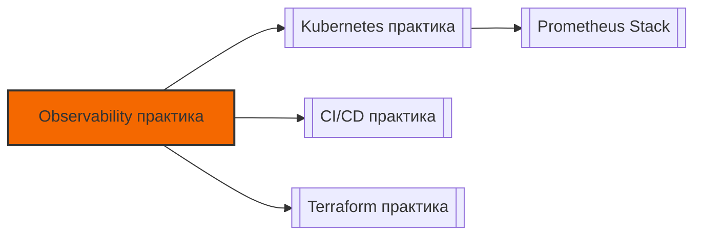

# 📄 Файл: `Observability практика.md`

tags: [observability, monitoring, prometheus, grafana, loki, devops, practice, hands-on]
aliases: [observability-practice, monitoring-practice]
created: 2026-05-07
---

# 🔍 Observability & Monitoring: Полноценная Практика (Hands-On)

> [!INFO] Формат
> Реальные сценарии из продакшена → пошаговое выполнение → DevOps-контекст → задания для самостоятельной отработки.
> 
> 💡 **Рекомендация**: Используй `docker-compose` для быстрого развёртывания стека локально. Не настраивай alerting в тестовых средах на реальные каналы команды — используй вебхуки для отладки или `webhook.site`.

📋 [[#🗂️ Оглавление для навигации|Оглавление]] | [[#🧪 Чек-лист самостоятельной практики|Чек-лист]] | [[#🔗 Связь с другими файлами|Связи]]

---

## 🗂️ Оглавление для навигации

### 🔹 Базовые сценарии
- [[#📁 СЦЕНАРИЙ 1: Метрики и RED/USE: запуск Prometheus + PromQL|1. Метрики и PromQL]]
- [[#📁 СЦЕНАРИЙ 2: Структурированные логи и сбор в Loki|2. Логи и LogQL]]
- [[#📁 СЦЕНАРИЙ 3: Визуализация: создание дашборда в Grafana|3. Дашборды Grafana]]
- [[#📁 СЦЕНАРИЙ 4: Алертинг: правила, маршрутизация, уведомления|4. Alertmanager]]
- [[#📁 СЦЕНАРИЙ 5: Health Checks и мониторинг проб|5. Health Checks]]
- [[#📁 СЦЕНАРИЙ 6: End-to-End корреляция: метрики → логи → причина|6. Корреляция]]

---

## 🔹 Базовые сценарии

### 📁 СЦЕНАРИЙ 1: Метрики и RED/USE: запуск Prometheus + PromQL

### 🎯 Цель
Запустить Prometheus, собрать метрики приложения, научиться писать базовые PromQL-запросы по методологии RED/USE.

### 📋 Пошаговое выполнение

```yaml
# 1. docker-compose.yml (prometheus + demo app)
version: '3.8'
services:
  prometheus:
    image: prom/prometheus:latest
    ports: ["9090:9090"]
    volumes:
      - ./prometheus.yml:/etc/prometheus/prometheus.yml
      - prom_data:/prometheus

  app:
    image: stefanprodan/podinfo:latest  # Демо-приложение с /metrics
    ports: ["9898:9898"]

volumes:
  prom_data:
```

```yaml
# 2. prometheus.yml
global:
  scrape_interval: 15s
  evaluation_interval: 15s

scrape_configs:
  - job_name: 'podinfo'
    metrics_path: '/metrics'
    static_configs:
      - targets: ['app:9898']
```

```bash
# 3. Запуск
docker compose up -d

# 4. Открой http://localhost:9090 → Status → Targets (должен быть UP)

# 5. PromQL-запросы в Expression bar:
# ✅ Rate (скорость запросов)
rate(http_requests_total[5m])

# ✅ Sum by (группировка по статус-кодам)
sum by (status_code) (rate(http_requests_total[5m]))

# ✅ Error Rate % (RED: Error Rate)
sum(rate(http_requests_total{status_code=~"5.."}[5m])) / sum(rate(http_requests_total[5m])) * 100
```

### 🔍 DevOps-контекст
- **RED** (Request rate, Error rate, Duration) — для сервисов/API. Фокус на用户体验 и бизнес-логике.
- **USE** (Utilization, Saturation, Errors) — для инфраструктуры (CPU, Memory, Disk I/O, Network).
- `rate()` работает только с **counter** (монотонно растущие метрики). Для `gauge` используй `avg()`, `max()`, `last()`.

### ⚠️ Подводные камни
- `rate(http_requests_total[1m])` на интервале 15s → шум и артефакты. Окно `rate()` должно быть ≥ `scrape_interval × 3`.
- Высокая кардинальность метрик (например, `user_id` в label) → OOM Prometheus → crash.
- `increase()` = `rate() × seconds`. Для процентных расчётов всегда используй `rate()`.

### 🧪 Задание для отработки
1. Напиши запрос для 95-го перцентиля длительности запросов: `histogram_quantile(0.95, rate(http_request_duration_seconds_bucket[5m]))`.
2. Добавь `relabel_configs` в `prometheus.yml`, чтобы добавить label `env="dev"` ко всем метрикам `podinfo`.
3. Проверь в `/targets`, что label применился.

[[#🗂️ Оглавление для навигации|↑ К оглавлению]]

---

### 📁 СЦЕНАРИЙ 2: Структурированные логи и сбор в Loki

### 🎯 Цель
Настроить приложение на вывод JSON-логов в stdout, собрать их через Promtail и запросить в Loki.

### 📋 Пошаговое выполнение

```bash
# 1. Добавляем в docker-compose.yml
  loki:
    image: grafana/loki:latest
    ports: ["3100:3100"]
    command: -config.file=/etc/loki/local-config.yaml

  promtail:
    image: grafana/promtail:latest
    volumes:
      - ./promtail-config.yml:/etc/promtail/config.yml
      - /var/lib/docker/containers:/var/lib/docker/containers:ro
    command: -config.file=/etc/promtail/config.yml
```

```yaml
# 2. promtail-config.yml
server:
  http_listen_port: 9080
  grpc_listen_port: 0

positions:
  filename: /tmp/positions.yaml

clients:
  - url: http://loki:3100/loki/api/v1/push

scrape_configs:
  - job_name: docker
    docker_sd_configs:
      - host: unix:///var/run/docker.sock
        refresh_interval: 5s
    pipeline_stages:
      - json:
          expressions:
            level: level
            msg: msg
      - labels:
          level:
```

```bash
# 3. Запуск
docker compose up -d loki promtail

# 4. Открой Grafana (или http://localhost:3000) → Explore → выбери Loki
# 5. LogQL-запросы:
# ✅ Все логи приложения
{container=~"app.*"}

# ✅ Фильтр по уровню
{container=~"app.*"} |= "error" | json | level="error"

# ✅ Подсчёт ошибок за 5 минут
sum(count_over_time({container=~"app.*"} |= "error" [5m]))
```

### 🔍 DevOps-контекст
- **Структурированные логи** (JSON) позволяют фильтровать, парсить и коррелировать с метриками без регулярных выражений.
- Loki хранит только индексы по label, сами логи — в object storage (S3/GCS). Это делает Loki дешёвым и масштабируемым.
- В продакшене: приложения пишут в `stdout` → sidecar/agent собирает → отправляет в Loki/ELK.

### ⚠️ Подводные камни
- Логи без `timestamp` или в неправильном формате → Loki не сможет корректно сортировать события.
- Сбор всех логов без фильтрации → быстрый рост хранилища, высокая стоимость S3.
- Секреты/PII в логах → нарушение compliance. Используй `pipeline_stages` для маскирования.

### 🧪 Задание для отработки
1. Добавь в приложение поле `trace_id: "abc-123"` в JSON-лог.
2. Напиши LogQL-запрос: найти все логи с конкретным `trace_id`.
3. Настрой `retention_period: 7d` в конфигурации Loki.
4. Проверь в Loki UI, как меняется объём данных при добавлении `level` в label.

[[#🗂️ Оглавление для навигации|↑ К оглавлению]]

---

### 📁 СЦЕНАРИЙ 3: Визуализация: создание дашборда в Grafana

### 🎯 Цель
Подключить Prometheus и Loki как источники данных, создать базовый дашборд по методологии RED с переменными.

### 📋 Пошаговое выполнение

```bash
# 1. Добавляем Grafana в docker-compose.yml
  grafana:
    image: grafana/grafana:latest
    ports: ["3000:3000"]
    environment:
      - GF_SECURITY_ADMIN_PASSWORD=admin
      - GF_USERS_ALLOW_SIGN_UP=false
    volumes:
      - grafana_data:/var/lib/grafana

volumes:
  grafana_data:
```

```bash
# 2. Запуск
docker compose up -d grafana
# Открой http://localhost:3000 → логин: admin / пароль: admin
```

**Шаги в UI**:
1. `Configuration → Data Sources → Add Prometheus` → URL: `http://prometheus:9090`
2. `Configuration → Data Sources → Add Loki` → URL: `http://loki:3100`
3. `+ → Dashboard → Add new panel`:
   - **Panel 1 (Request Rate)**: `sum(rate(http_requests_total[5m]))`
   - **Panel 2 (Error Rate %)**: `sum(rate(http_requests_total{status_code=~"5.."}[5m])) / sum(rate(http_requests_total[5m])) * 100`
   - **Panel 3 (Latency p95)**: `histogram_quantile(0.95, sum(rate(http_request_duration_seconds_bucket[5m])) by (le))`
   - **Panel 4 (Logs)**: Data Source: Loki, Query: `{container=~"app.*"} |= "error"`
4. `Dashboard Settings → Variables → Add`: Name: `instance`, Type: `Query`, Query: `label_values(up, instance)`
5. В каждой панели замени `app:9898` на `$instance`

### 🔍 DevOps-контекст
- Дашборд должен отвечать на вопрос *"Сервис жив?"* за <10 секунд.
- Переменные (`$job`, `$env`, `$instance`) позволяют переиспользовать один дашборд для всех сервисов.
- В командах дашборды хранятся в Git как JSON (`grafana-cli` или provisioning).

### ⚠️ Подводные камни
- Хардкод запросов без переменных → дашборд не масштабируется.
- Слишком много панелей (>15) → когнитивная перегрузка. Разделяй по уровням: Service → Infra → Business.
- Игнорирование единиц измерения → Prometheus возвращает секунды, а на панели отображаются миллисекунды без конвертации.

### 🧪 Задание для отработки
1. Экспортируй дашборд в JSON (`Share → Export → Save to file`).
2. Настрой автоматическое провиженирование дашбордов через `provisioning/dashboards/`.
3. Добавь панель с `node_cpu_seconds_total` (USE: Utilization).
4. Настрой `thresholds` для Error Rate: зелёный <1%, жёлтый <5%, красный >5%.

[[#🗂️ Оглавление для навигации|↑ К оглавлению]]

---

### 📁 СЦЕНАРИЙ 4: Алертинг: правила, маршрутизация, уведомления

### 🎯 Цель
Написать alerting rules, настроить Alertmanager для маршрутизации по severity и отправки в Slack.

### 📋 Пошаговое выполнение

```yaml
# 1. alert_rules.yml
groups:
  - name: service-alerts
    rules:
      - alert: HighErrorRate
        expr: sum(rate(http_requests_total{status_code=~"5.."}[5m])) / sum(rate(http_requests_total[5m])) * 100 > 5
        for: 3m
        labels:
          severity: critical
          team: backend
        annotations:
          summary: "Высокий уровень ошибок в {{ $labels.job }}"
          description: "Error rate > 5% в течение 3 минут. Текущее значение: {{ $value }}%"
          runbook_url: "https://wiki.internal/runbooks/high-error-rate"

      - alert: InstanceDown
        expr: up == 0
        for: 1m
        labels:
          severity: critical
        annotations:
          summary: "Инстанс {{ $labels.instance }} недоступен"
```

```yaml
# 2. alertmanager.yml
global:
  resolve_timeout: 5m
  slack_api_url: 'https://hooks.slack.com/services/YOUR/WEBHOOK/URL'

route:
  group_by: ['alertname', 'team']
  group_wait: 30s
  group_interval: 5m
  repeat_interval: 4h
  receiver: 'slack-notifications'
  routes:
    - match:
        severity: critical
      receiver: 'pagerduty-critical'
      continue: true

receivers:
  - name: 'slack-notifications'
    slack_configs:
      - channel: '#devops-alerts'
        send_resolved: true
        text: '{{ range .Alerts }}{{ .annotations.summary }}\n{{ end }}'
  - name: 'pagerduty-critical'
    pagerduty_configs:
      - service_key: 'YOUR_PD_INTEGRATION_KEY'
```

```bash
# 3. Подключаем в prometheus.yml
rule_files:
  - alert_rules.yml

alerting:
  alertmanagers:
    - static_configs:
        - targets: ['alertmanager:9093']
```

```bash
# 4. Валидация
docker exec prometheus promtool check config /etc/prometheus/prometheus.yml
docker exec alertmanager amtool check-config /etc/alertmanager/alertmanager.yml
```

### 🔍 DevOps-контекст
- **Alerting ≠ Monitoring**. Алерты должны требовать действия. Если алерт можно проигнорировать → удали его или понизи до warning в дашборде.
- `for:` предотвращает флейковые алерты на кратковременные скачки.
- `runbook_url` в annotation — стандарт для быстрого реадействия и снижения MTTR.

### ⚠️ Подводные камеры
- Алерт без `for` → шум при деплое/ресайзе.
- Отправка всех алертов в один канал → alert fatigue, команда перестаёт реагировать.
- Жёсткие пороги (CPU > 90%) без контекста → ложные срабатывания. Используй `rate()` и тренды.

### 🧪 Задание для отработки
1. Добавь алерт на задержку > 500ms (p95).
2. Настрой `inhibit_rules` в Alertmanager: если `InstanceDown` активен, не шлём `HighLatency` для того же инстанса.
3. Протестируй алерт: останови контейнер `app`, проверь приход уведомления.
4. Настрой `silence` в UI Alertmanager на 30 минут.

[[#🗂️ Оглавление для навигации|↑ К оглавлению]]

---

### 📁 СЦЕНАРИЙ 5: Health Checks и мониторинг проб

### 🎯 Цель
Реализовать liveness/readiness эндпоинты, мониторить их статус и связать с алертингом.

### 📋 Пошаговое выполнение

```python
# 1. app.py (пример на FastAPI/Flask)
from flask import Flask, jsonify
import random, time

app = Flask(__name__)

@app.route('/health')
def liveness():
    return jsonify({"status": "alive"}), 200

@app.route('/ready')
def readiness():
    # Имитация проверки зависимости (БД, кэш)
    db_up = random.choice([True, False, True])  # 66% успех
    if db_up:
        return jsonify({"status": "ready", "db": "connected"}), 200
    return jsonify({"status": "not_ready", "db": "timeout"}), 503

@app.route('/metrics')
def metrics():
    # ... prometheus_client generate_latest() ...
    pass
```

```yaml
# 2. prometheus.yml (добавляем job для проб)
  - job_name: 'health-probes'
    metrics_path: '/metrics'
    static_configs:
      - targets: ['app:9898']
    # В продакшене: blackbox_exporter для внешних проб
```

```promql
# 3. PromQL для мониторинга проб
# ✅ Процент успешных readiness проверок
sum(rate(http_requests_total{job="podinfo", status_code="200"}[5m])) by (path) / sum(rate(http_requests_total{job="podinfo"}[5m])) by (path)

# ✅ Алерт: сервис не готов > 2 минут
alert: ServiceNotReady
expr: up{job="podinfo"} == 0 or http_requests_total{path="/ready", status_code!="200"} > 0
for: 2m
```

### 🔍 DevOps-контекст
- **Liveness**: "Процесс жив?" → если нет, K8s перезапускает под.
- **Readiness**: "Готов принимать трафик?" → если нет, Service исключает под из балансировки.
- Мониторинг проб помогает обнаружить деградацию зависимостей до полного падения.

### ⚠️ Подводные камни
- `/health` делает тяжёлые проверки (запросы к БД, внешним API) → каскадные отказы при нагрузке.
- `/ready` проверяет только процесс, но не зависимости → трафик идёт на "пустой" под.
- Проб-эндпоинт без аутентификации → DDoS-вектор или информация для атакующего.

### 🧪 Задание для отработки
1. Добавь в `/ready` проверку подключения к Redis/DB.
2. Настрой алерт на `readiness_failure_rate > 10% for 1m`.
3. Сымитируй отказ БД → убедись, что `/ready` возвращает 503, а метрика `up` или error rate растёт.
4. Настрой в K8s (или локально в docker-compose) healthcheck с `start_period`, `interval`, `timeout`.

[[#🗂️ Оглавление для навигации|↑ К оглавлению]]

---

### 📁 СЦЕНАРИЙ 6: End-to-End корреляция: метрики → логи → причина

### 🎯 Цель
Отработать полный цикл observability: обнаружить аномалию в метрике → найти связанные логи → определить root cause.

### 📋 Пошаговое выполнение

```bash
# 1. Генерация трафика
while true; do curl -s http://localhost:9898/; sleep 0.5; done &

# 2. Имитация инцидента (в другом терминале)
docker compose stop app
sleep 15
docker compose start app

# 3. Корреляция в Grafana:
#    А. Открой дашборд → найди spike в Error Rate / падение up
#    Б. Кликни по панели → "Explore" → переключи на Loki
#    В. Используй label `container="app"` и временной диапазон совпадения
#    Г. Фильтр: `|= "error" or |= "timeout"`
#    Д. Найди `trace_id` или `error_message` → передай разработчикам

# 4. Автоматизация корреляции (в панели Grafana):
#    В разделе "Links" добавь ссылку:
#    Title: "View Logs in Loki"
#    URL: /explore?orgId=1&left=["now-1h","now","Loki",{"expr":"{container=\"$container\"}"}]
```

### 🔍 DevOps-контекст
- **Observability ≠ Monitoring**. Мониторинг отвечает на известные вопросы, observability позволяет исследовать неизвестные.
- Корреляция возможна через общие контексты: `trace_id`, `instance`, `pod`, `job`, `request_id`.
- В продакшене: APM (OpenTelemetry) + Logs (Loki) + Metrics (Prometheus) + Traces (Jaeger) = полный стек.

### ⚠️ Подводные камни
- Разные часовые пояса в логах и метриках → невозможность сопоставления по времени.
- Отсутствие `trace_id` в логах → ручное grep по timestamp (долго и неточно).
- Высокая стоимость хранения трейсов → настраивай sampling (1% для prod, 100% для dev).

### 🧪 Задание для отработки
1. Добавь `trace_id` в JSON-логи и в HTTP-заголовки ответа.
2. Настрой в Grafana `Dashboard Links` для перехода от метрики к логам по клику.
3. Напиши runbook: "При срабатывании HighErrorRate: 1) Проверь Loki, 2) Найди trace_id, 3) Проверь зависимости".
4. Протестируй полный цикл: сгенерируй ошибку → найди в метрике → перейди в логи → укажи причину.

[[#🗂️ Оглавление для навигации|↑ К оглавлению]]

---

## 🛠️ Полезные утилиты и команды

```bash
# === PromQL сниппеты ===
# ✅ CPU Utilization (USE)
100 - (avg by(instance) (rate(node_cpu_seconds_total{mode="idle"}[5m])) * 100)

# ✅ Memory Saturation
(node_memory_MemTotal_bytes - node_memory_MemAvailable_bytes) / node_memory_MemTotal_bytes * 100

# ✅ Disk I/O Utilization
rate(node_disk_io_time_seconds_total[5m])

# === LogQL сниппеты ===
# ✅ Parse JSON и фильтр по полю
{app="api"} | json | status >= 500

# ✅ Подсчёт уникальных ошибок
count by (error_code) (sum by (error_code) ({app="api"} |= "error" | json))

# === Alertmanager CLI ===
amtool alert query           # Посмотреть активные алерты
amtool silence add           # Создать silence
amtool check-config          # Валидация конфига

# === Grafana provisioning (docker) ===
# /etc/grafana/provisioning/datasources/prometheus.yml
apiVersion: 1
datasources:
  - name: Prometheus
    type: prometheus
    access: proxy
    url: http://prometheus:9090
    isDefault: true
```

---

## 🧪 Чек-лист самостоятельной практики

- [ ] Запустил Prometheus + Grafana + Loki через docker-compose
- [ ] Написал PromQL-запросы: `up`, `rate()`, `sum() by ()`, `histogram_quantile()`
- [ ] Настроил приложение на вывод JSON-логов в stdout
- [ ] Подключил Promtail → Loki, написал LogQL-запросы с фильтрацией
- [ ] Создал дашборд в Grafana с 4 панелями (RED) и переменными
- [ ] Настроил Alertmanager: правила, маршрутизация, уведомления в Slack
- [ ] Реализовал `/health` и `/ready`, настроил мониторинг их статусов
- [ ] Отработал цикл корреляции: метрика → логи → root cause
- [ ] Настроил `runbook_url` и `for` в алертах для снижения шума
- [ ] Экспортировал дашборд и настроил Grafana provisioning

---

## ⚠️ Топ-5 ошибок в продакшене и как их избежать

| Ошибка | Последствия | Решение |
|--------|-------------|---------|
| Алерт на всё подряд (`alert fatigue`) | Команда игнорирует уведомления, реальные инциденты пропускаются | Алерт только если требует немедленного действия. Остальное → дашборды |
| Высокая кардинальность label (`user_id`, `request_id` в метриках) | Prometheus OOM, crash, медленные запросы | Храни идентификаторы только в логах/трейсах. Метрики — агрегированные |
| Логи без структуры и `trace_id` | Невозможно быстро найти причину, ручной grep по terabytes | JSON-логи, обязательные поля: `level`, `msg`, `trace_id`, `service` |
| Monitoring без дашбордов и runbook | Данные есть, но команда не знает, как реагировать | Каждый алерт → ссылка на runbook. Дашборды → стандартизированы по RED/USE |
| Игнорирование saturation (USE) | Сервис падает "внезапно", хотя CPU/Disk были на 99% неделю | Мониторь не только ошибки, но и утилизацию/насыщение. Алерть на тренды |

---

## 🔗 Связь с другими файлами

> [!TIP] Следующие шаги
> После отработки этих сценариев переходи к:
> - [[Kubernetes практика]] — мониторинг кластера, kube-prometheus-stack, PodMonitors
> - [[CICD практика]] — деплой observability-стека, мониторинг пайплайнов
> - [[Terraform практика]] — инфраструктура для Prometheus/Loki как код
> - [[Безопасность практика]] — маскирование секретов в логах, audit-метрики



[[#🗂️ Оглавление для навигации|↑ К оглавлению]]