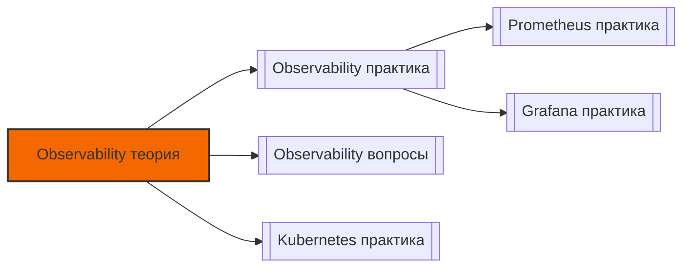

# 📄 Файл: `Observability теория.md`

tags: [observability, monitoring, prometheus, grafana, loki, devops, theory, architecture]
aliases: [observability-theory, monitoring-theory]
created: 2026-05-07
---

# 🔍 Observability & Monitoring: Глубокое изучение теории

> [!INFO] Тема подтверждена  
> `Observability — архитектура мониторинга, метрики, логи, трейсы, алертинг`  
> **Уровень**: подготовка к собеседованию в топ-компанию  
> **Фокус**: теория + контекст DevOps + связь с экосистемой

📋 [[#🗂️ Оглавление для навигации|Оглавление]] | [[#🔑 Ключевые моменты|Итоги]] | [[#🔗 Связь с другими файлами|Связи]]

---

## 🗂️ Оглавление для навигации

### 🔹 Фундамент
- [[#🔹 Что такое Observability? Простыми словами|Что такое Observability]]
- [[#🔹 Мониторинг vs Observability: в чём разница?|Мониторинг vs Observability]]

### 🔹 Три столпа наблюдаемости
- [[#🔹 Метрики: RED и USE методологии|Метрики: RED/USE]]
- [[#🔹 Логи: структурированные vs неструктурированные|Логи]]
- [[#🔹 Трейсы: распределённая трассировка|Трейсы]]

### 🔹 Архитектура стека мониторинга
- [[#🔹 Prometheus: архитектура и модель данных|Prometheus архитектура]]
- [[#🔹 Grafana: визуализация и дашборды|Grafana]]
- [[#🔹 Loki/ELK: сбор и анализ логов|Сбор логов]]
- [[#🔹 Alertmanager: маршрутизация и подавление алертов|Alertmanager]]

### 🔹 Инструментация приложений
- [[#🔹 Health Checks: liveness, readiness, startup|Health Checks]]
- [[#🔹 Экспорт метрик: типы и лучшие практики|Экспорт метрик]]
- [[#🔹 Контекст в логах: trace_id, request_id, correlation|Контекст логов]]

### 🔹 Алертинг и реагирование
- [[#🔹 Принципы эффективного алертинга|Принципы алертинга]]
- [[#🔹 Правило написания: expr, for, labels, annotations|Структура алерта]]
- [[#🔹 Маршрутизация и эскалация: от Slack до PagerDuty|Маршрутизация]]

### 🔹 Надёжность и масштабирование
- [[#🔹 High Availability Prometheus кластера|HA Prometheus]]
- [[#🔹 Федерация и remote write: масштабирование сбора|Масштабирование]]
- [[#🔹 Retention, downsampling, компромиссы стоимости|Хранение данных]]

### 🔹 Интеграция с экосистемой
- [[#🔹 Kubernetes-native мониторинг: ServiceMonitor, PodMonitor|K8s мониторинг]]
- [[#🔹 GitOps для observability: дашборды и алерты как код|GitOps для мониторинга]]
- [[#🔹 OpenTelemetry: стандартизация телеметрии|OpenTelemetry]]

---

## 🔹 Фундамент

### 🔹 Что такое Observability? Простыми словами

**Observability (наблюдаемость)** — это свойство системы, позволяющее понимать её внутреннее состояние по внешним выходным данным (метрикам, логам, трейсам).

> [!NOTE] Ключевая идея
> Мониторинг отвечает на известные вопросы ("сервис упал?"), observability позволяет исследовать неизвестные ("почему медленно?").

**Три столпа observability**:

| Столп | Что измеряет | Пример вопроса |
|-------|-------------|----------------|
| **Метрики** | Агрегированные числовые данные во времени | "Какой % запросов возвращает 500?" |
| **Логи** | Дискретные события с контекстом | "Что произошло перед ошибкой в 14:32?" |
| **Трейсы** | Распределённый путь запроса через сервисы | "Где в цепочке сервисов задержка?" |

**DevOps-контекст**: Observability — не просто "мониторинг", а основа для:
- 🔄 Быстрого обнаружения и восстановления инцидентов (MTTR)
- 🔍 Проактивного выявления деградации до падения
- 📊 Принятия архитектурных решений на основе данных
- 💰 Оптимизации затрат через понимание утилизации ресурсов

[[#🗂️ Оглавление для навигации|↑ К оглавлению]]

### 🔹 Мониторинг vs Observability: в чём разница?

```
Мониторинг (традиционный):
├─ Знаем, что может сломаться
├─ Настраиваем алерты на известные сценарии
├─ Реагируем на срабатывание
└─ Ограничен: не отвечает на "почему?"

Observability (современный подход):
├─ Не знаем всех возможных сбоев заранее
├─ Инструментируем систему для исследования
├─ Задаём вопросы постфактум, исследуем данные
└─ Гибкий: позволяет находить неизвестные неизвестные
```

**Практическое различие**:

| Ситуация | Мониторинг | Observability |
|----------|-----------|---------------|
| Сервис вернул 500 | Алерт: "500 errors > threshold" | Запрос: "показать все логи с 500 + трейсы + метрики зависимостей" |
| Медленный ответ | Алерт: "latency p99 > 2s" | Анализ: "какой сервис в цепочке добавляет задержку? какие запросы к БД?" |
| Необычное поведение | ❌ Не детектируется | ✅ Аномалии в метриках + корреляция с логами |

> [!TIP] Best practice
> Начинай с мониторинга известных сценариев, но проектируй систему с observability в уме: структурированные логи, контекстные метрики, трейсинг.

[[#🗂️ Оглавление для навигации|↑ К оглавлению]]

---

## 🔹 Три столпа наблюдаемости

### 🔹 Метрики: RED и USE методологии

**Метрика** — числовое значение, измеренное в момент времени, с возможностью агрегации.

**Два ключевых фреймворка**:

#### 📊 RED (для сервисов / пользовательского опыта)
| Метрика | Описание | Пример PromQL |
|---------|----------|--------------|
| **Rate** (частота) | Запросов в секунду | `sum(rate(http_requests_total[5m]))` |
| **Errors** (ошибки) | % неудачных запросов | `sum(rate(errors_total[5m])) / sum(rate(requests_total[5m]))` |
| **Duration** (длительность) | Латентность запросов | `histogram_quantile(0.95, rate(duration_bucket[5m]))` |

#### 💻 USE (для инфраструктуры / ресурсов)
| Метрика | Описание | Пример PromQL |
|---------|----------|--------------|
| **Utilization** (утилизация) | % времени ресурс занят | `100 - (avg(rate(cpu_idle[5m])) * 100)` |
| **Saturation** (насыщение) | Насколько ресурс перегружен | `node_load1 / node_cpu_count` |
| **Errors** (ошибки) | Ошибки на уровне ресурса | `rate(disk_io_errors[5m])` |

**Типы метрик в Prometheus**:

| Тип | Характеристика | Когда использовать |
|-----|---------------|-------------------|
| `Counter` | Монотонно растёт (или сбрасывается при рестарте) | Счётчики запросов, ошибок, байт |
| `Gauge` | Может расти и убывать | Температура, память, количество подключений |
| `Histogram` | Распределение значений по бакетам | Латентность, размер ответа |
| `Summary` | Квантили, вычисляемые на клиенте | Когда нужна точность квантилей на стороне приложения |

> [!WARNING] Высокая кардинальность — враг масштабируемости
> Метрики с лейблами типа `user_id`, `request_id`, `ip` создают экспоненциальный рост временных рядов. Храни такие данные в логах/трейсах, а не в метриках.

[[#🗂️ Оглавление для навигации|↑ К оглавлению]]

### 🔹 Логи: структурированные vs неструктурированные

**Неструктурированные логи** (традиционный подход):
```
2026-05-07 14:32:15 [ERROR] Connection to database failed: timeout after 30s
```
- ❌ Сложно парсить программно
- ❌ Требуют регулярных выражений для фильтрации
- ❌ Контекст "зашит" в текст

**Структурированные логи** (JSON, современный стандарт):
```json
{
  "timestamp": "2026-05-07T14:32:15Z",
  "level": "error",
  "message": "Connection to database failed",
  "error": "timeout after 30s",
  "service": "api-gateway",
  "trace_id": "abc-123-xyz",
  "user_id": "user-456",
  "duration_ms": 30000
}
```
- ✅ Легко фильтровать, агрегировать, коррелировать
- ✅ Автоматическое индексирование по полям
- ✅ Совместимость с инструментами (Loki, ELK, Datadog)

**Уровни логирования**:

| Уровень | Когда использовать | Пример |
|---------|-------------------|--------|
| `DEBUG` | Отладка разработки, не в продакшене | "Запрос к БД: SELECT * FROM users" |
| `INFO` | Нормальная работа, аудит | "Пользователь залогинился", "Деплой завершён" |
| `WARN` | Потенциальная проблема, но система работает | "Кэш не доступен, используем БД напрямую" |
| `ERROR` | Ошибка, требующая внимания | "Не удалось подключиться к БД" |
| `FATAL` | Критическая ошибка, приложение не может работать | "Конфигурация не валидна, выход" |

**DevOps-контекст**:
- В продакшене: `INFO` + `WARN` + `ERROR`, `DEBUG` только по флагу
- Логи в `stdout` → собираются агентом (Promtail, Fluent Bit) → отправляются в Loki/ELK
- Никогда не логируй секреты, PII, токены — маскируй или используй отдельный аудит-лог

[[#🗂️ Оглавление для навигации|↑ К оглавлению]]

### 🔹 Трейсы: распределённая трассировка

**Трейс** — запись пути одного запроса через несколько сервисов.

**Компоненты распределённого трейсинга**:

```
[Запрос пользователя]
       │
       ▼
[Span 1: API Gateway] ──trace_id: abc123──► [Span 2: Auth Service]
       │                                      │
       ▼                                      ▼
[Span 3: User Service] ◄────[Span 4: Database]
```

| Термин | Описание |
|--------|----------|
| `Trace` | Полный путь запроса, уникальный `trace_id` |
| `Span` | Один этап обработки (сервис, операция) |
| `Parent/Child` | Иерархия: вызов сервиса создаёт child-span |
| `Tags` | Метаданные: `http.method`, `db.statement`, `error=true` |
| `Logs` | События внутри span: "начал запрос", "получил ответ" |

**Стандарты и инструменты**:

| Инструмент | Протокол | Особенности |
|-----------|----------|-------------|
| **OpenTelemetry** | OTLP | Vendor-neutral стандарт, будущее индустрии |
| **Jaeger** | Jaeger UI | CNCF project, хорошая визуализация |
| **Zipkin** | Zipkin API | Простой, лёгкий, для небольших систем |
| **AWS X-Ray** | Proprietary | Глубокая интеграция с AWS-сервисами |

**DevOps-контекст**:
- Трейсинг критичен для микросервисов: без него невозможно понять, где задержка
- Sampling: в продакшене собирай 1-10% трейсов (экономия), в dev — 100%
- Корреляция: добавляй `trace_id` в логи → один клик из метрики в логи в трейс

[[#🗂️ Оглавление для навигации|↑ К оглавлению]]

---

## 🔹 Архитектура стека мониторинга

### 🔹 Prometheus: архитектура и модель данных

**Prometheus** — система мониторинга с pull-моделью сбора метрик и многомерной моделью данных.

**Архитектура**:

```
┌─────────────────────────────────┐
│         Prometheus Server       │
├─────────────────────────────────┤
│ • Retrieval: pull метрик с target │
│ • TSDB: хранение временных рядов  │
│ • HTTP Server: API для запросов   │
└─────────────────────────────────┘
                   ▲
                   │ /metrics (pull)
                   │
┌─────────────────────────────────┐
│         Exporters / Apps        │
├─────────────────────────────────┤
│ • node_exporter: метрики ОС      │
│ • app: /metrics endpoint         │
│ • blackbox_exporter: внешние пробы│
└─────────────────────────────────┘
```

**Модель данных**:

```
<метрика>{<лейбл>="<значение>", ...} <значение> <таймстемп>

# Пример:
http_requests_total{job="api", method="POST", status="200"} 1234 1683456789000
```

**Ключевые компоненты**:

| Компонент | Назначение |
|-----------|-----------|
| `scrape_configs` | Какие цели опрашивать, как часто, с какими параметрами |
| `relabel_configs` | Преобразование меток до скрейпинга (добавить `env`, отфильтровать) |
| `metric_relabel_configs` | Преобразование меток после скрейпинга (удалить высок-кардинальные) |
| `rule_files` | Alerting rules и recording rules для пре-агрегации |

**DevOps-контекст**:
- Pull-модель: Prometheus инициирует сбор → проще с firewall, NAT, service discovery
- Service discovery: Kubernetes, Consul, EC2 — автоматическое обнаружение target'ов
- В продакшене: несколько Prometheus инстансов + Thanos/Cortex для глобального view

[[#🗂️ Оглавление для навигации|↑ К оглавлению]]

### 🔹 Grafana: визуализация и дашборды

**Grafana** — платформа для визуализации и анализа метрик из различных источников.

**Архитектура**:

```
[Data Sources] ──► [Grafana] ──► [Dashboards]
   │                    │              │
   ▼                    ▼              ▼
Prometheus         Query Builder   Panels:
Loki               Transformations  • Graph
Elasticsearch      Variables        • Stat
MySQL              Annotations      • Table
```

**Ключевые концепции**:

| Концепция | Описание | Пример |
|-----------|----------|--------|
| `Data Source` | Подключение к источнику данных | Prometheus URL, Loki URL |
| `Dashboard` | Коллекция панелей с визуализациями | "Service Health", "Infra Overview" |
| `Panel` | Отдельная визуализация | График latency, таблица ошибок |
| `Variable` | Динамический параметр для фильтрации | `$job`, `$env`, `$instance` |
| `Annotation` | События на графике (деплои, инциденты) | Вертикальная линия "deploy v1.2" |

**Best practices для дашбордов**:

```yaml
# Структура эффективного дашборда:
1. Top row: SLO/SLI метрики (зелёный/жёлтый/красный статус)
2. Second row: RED-метрики сервиса (rate, errors, duration)
3. Third row: USE-метрики инфраструктуры (CPU, memory, disk)
4. Bottom row: Логи и трейсы для детального анализа

# Переменные для переиспользования:
- job: label_values(up, job)
- instance: label_values(up{job="$job"}, instance)
- env: label_values(up, env)
```

**DevOps-контекст**:
- Дашборды как код: храни JSON в Git, провиженируй через `grafana provisioning`
- RBAC: разные дашборды для dev/stage/prod, ограничение доступа к чувствительным метрикам
- Alerts из Grafana: можно, но предпочтительнее Alertmanager для централизованного управления

[[#🗂️ Оглавление для навигации|↑ К оглавлению]]

### 🔹 Loki/ELK: сбор и анализ логов

**Loki** (Grafana Stack) и **ELK** (Elasticsearch, Logstash, Kibana) — решения для агрегации и анализа логов.

**Сравнение архитектур**:

| Аспект | Loki | ELK Stack |
|--------|------|-----------|
| **Индексация** | Только по лейблам (как Prometheus) | Полнотекстовый индекс по всему контенту |
| **Хранение** | Объектное хранилище (S3, GCS) | Диски / Elasticsearch cluster |
| **Запросы** | LogQL (похож на PromQL) | Lucene Query Language / KQL |
| **Стоимость** | Низкая (нет индекса по контенту) | Высокая (индекс занимает ~30-50% от данных) |
| **Use case** | DevOps-логи, корреляция с метриками | Поиск по тексту, аналитика, security |

**Жизненный цикл лога в Loki**:

```
[Приложение] 
   │
   ▼ (пишет в stdout)
[Promtail / Fluent Bit] 
   │
   ▼ (парсит, добавляет лейблы)
[Лейблы: {job="api", env="prod", instance="pod-abc"}]
   │
   ▼ (отправляет)
[Loki Ingester] 
   │
   ▼ (индексирует лейблы, пишет контент в S3)
[Loki Querier] ← [Grafana: LogQL запрос]
```

**Пример LogQL**:

```logql
# Все логи приложения
{job="api"}

# Фильтр по уровню и тексту
{job="api"} |= "error" | json | level="error"

# Агрегация: количество ошибок за 5 минут
sum(count_over_time({job="api"} |= "error" [5m]))

# Корреляция с метрикой: показать логи при высоком error rate
{job="api"} |= "error" and on() sum(rate(http_errors[5m])) > 0.1
```

**DevOps-контекст**:
- Лейблы в Loki — как лейблы в Prometheus: используй для фильтрации, но избегай высокой кардинальности
- В продакшене: настрой `retention_period` (7-30 дней) и `chunk_target_size` для оптимизации хранения
- Корреляция: настраивай `derivedFields` в Loki для клика из лога в трейс по `trace_id`

[[#🗂️ Оглавление для навигации|↑ К оглавлению]]

### 🔹 Alertmanager: маршрутизация и подавление алертов

**Alertmanager** — компонент Prometheus для дедупликации, группировки и маршрутизации алертов.

**Архитектура**:

```
[Prometheus] ──► [Alertmanager] ──► [Receivers]
   │                   │                 │
   ▼                   ▼                 ▼
Alerting Rules   Grouping / Routing   • Slack
                 Inhibition           • PagerDuty
                 Silencing            • Email
                                      • Webhook
```

**Ключевые концепции**:

| Концепция | Описание | Пример |
|-----------|----------|--------|
| `Grouping` | Объединение похожих алертов в одно уведомление | Все `InstanceDown` для одного сервиса → одно сообщение |
| `Routing` | Маршрутизация по лейблам (`severity`, `team`) | `severity=critical` → PagerDuty, `warning` → Slack |
| `Inhibition` | Подавление алертов при наличии других | Если `ClusterDown` активен, не шлём `InstanceDown` |
| `Silencing` | Временное отключение алертов (плановые работы) | `silence` на 2 часа для деплоя |
| `Repeat interval` | Как часто повторять уведомление | Не спамить: повтор каждые 4 часа, а не каждую минуту |

**Пример конфигурации**:

```yaml
route:
  group_by: ['alertname', 'cluster', 'service']
  group_wait: 30s      # Ждать 30с перед первой отправкой группы
  group_interval: 5m   # Ждать 5м перед добавлением нового алерта в группу
  repeat_interval: 4h  # Повторять уведомление каждые 4 часа
  receiver: 'default'
  routes:
    - match:
        severity: critical
      receiver: 'pagerduty-critical'
      continue: true   # Продолжить проверку следующих маршрутов
    - match:
        team: backend
      receiver: 'slack-backend'

receivers:
  - name: 'pagerduty-critical'
    pagerduty_configs:
      - service_key: '<key>'
        severity: 'critical'
  - name: 'slack-backend'
    slack_configs:
      - channel: '#backend-alerts'
        send_resolved: true
        text: '{{ range .Alerts }}{{ .annotations.summary }}\n{{ end }}'
```

**DevOps-контекст**:
- Алерт должен требовать действия. Если можно проигнорировать → это не алерт, а дашборд.
- `runbook_url` в annotation — стандарт: ссылка на инструкцию по реагированию снижает MTTR.
- Тестируй алерты: `amtool alert add` для симуляции, `--dry-run` для проверки маршрутизации.

[[#🗂️ Оглавление для навигации|↑ К оглавлению]]

---

## 🔹 Инструментация приложений

### 🔹 Health Checks: liveness, readiness, startup

**Health checks** — эндпоинты для проверки состояния приложения.

| Тип | Назначение | Что проверяет | Реакция оркестратора |
|-----|-----------|--------------|---------------------|
| `Liveness` | "Процесс жив?" | Процесс запущен, не завис | Перезапустить под/контейнер |
| `Readiness` | "Готов к трафику?" | Зависимости доступны, кэш прогрет | Исключить из балансировки |
| `Startup` | "Приложение стартовало?" | Медленная инициализация (например, загрузка модели) | Не проверять liveness/readiness, пока не завершится |

**Пример реализации (HTTP эндпоинты)**:

```python
# FastAPI пример
@app.get("/health")  # liveness
async def liveness():
    return {"status": "alive"}  # 200 OK

@app.get("/ready")  # readiness
async def readiness():
    try:
        await db.ping()
        await redis.ping()
        return {"status": "ready", "dependencies": "ok"}  # 200
    except Exception as e:
        return {"status": "not_ready", "error": str(e)}  # 503

@app.get("/metrics")  # Prometheus metrics
async def metrics():
    return Response(prometheus_client.generate_latest(), media_type="text/plain")
```

**DevOps-контекст**:
- `liveness` должен быть лёгким: не делать тяжёлых проверок (запросы к БД, внешним API)
- `readiness` может проверять зависимости, но с таймаутом, чтобы не блокировать надолго
- В Kubernetes: настрой `initialDelaySeconds`, `periodSeconds`, `failureThreshold` под поведение приложения

[[#🗂️ Оглавление для навигации|↑ К оглавлению]]

### 🔹 Экспорт метрик: типы и лучшие практики

**Как экспортировать метрики из приложения**:

```python
# Пример: prometheus_client для Python
from prometheus_client import Counter, Histogram, start_http_server

# Counter: монотонный счётчик
REQUEST_COUNT = Counter('http_requests_total', 'Total HTTP requests', 
                        ['method', 'endpoint', 'status'])

# Histogram: распределение длительности
REQUEST_DURATION = Histogram('http_request_duration_seconds', 'Request duration',
                             ['method', 'endpoint'],
                             buckets=[0.1, 0.25, 0.5, 1.0, 2.5, 5.0, 10.0])

@app.middleware("http")
async def metrics_middleware(request, call_next):
    start_time = time.time()
    response = await call_next(request)
    duration = time.time() - start_time
    
    REQUEST_COUNT.labels(
        method=request.method,
        endpoint=request.url.path,
        status=response.status_code
    ).inc()
    
    REQUEST_DURATION.labels(
        method=request.method,
        endpoint=request.url.path
    ).observe(duration)
    
    return response

# Запуск /metrics endpoint
start_http_server(8000)
```

**Best practices для метрик**:

| Практика | Почему важно | Пример |
|----------|-------------|--------|
| **Именовать по конвенции** | Единый стиль, авто-документация | `http_requests_total`, `db_query_duration_seconds` |
| **Добавлять help и unit** | Понятность в UI, корректная визуализация | `# HELP http_requests_total Total HTTP requests` |
| **Избегать высокой кардинальности** | Не раздувать TSDB, экономить ресурсы | Не добавляй `user_id`, `request_id` как лейблы |
| **Использовать бакеты осознанно** | Точность квантилей, размер хранилища | Для latency: `[0.01, 0.05, 0.1, 0.25, 0.5, 1, 2.5, 5, 10]` |
| **Документировать бизнес-метрики** | Понимание для non-dev команды | `# HELP orders_processed_total Orders successfully processed` |

**DevOps-контекст**:
- Автоматический сбор метрик: Prometheus service discovery находит `/metrics` по аннотациям в K8s
- Recording rules: пре-агрегируй сложные запросы для ускорения дашбордов
- Метрики приложения + инфраструктурные метрики = полная картина для алертинга

[[#🗂️ Оглавление для навигации|↑ К оглавлению]]

### 🔹 Контекст в логах: trace_id, request_id, correlation

**Проблема**: Логи без контекста невозможно коррелировать с метриками и трейсами.

**Решение**: Добавлять общие идентификаторы во все три столпа.

**Структура контекстного лога**:

```json
{
  "timestamp": "2026-05-07T14:32:15Z",
  "level": "info",
  "message": "Processing order",
  "service": "order-service",
  "version": "1.2.3",
  "env": "prod",
  
  "trace_id": "abc123xyz",      # ← для корреляции с трейсами
  "span_id": "def456",          # ← текущий span
  "request_id": "req-789",      # ← для сквозного отслеживания
  "user_id": "user-456",        # ← для бизнес-аналитики (не как лейбл в метриках!)
  
  "duration_ms": 142,
  "status_code": 200,
  "endpoint": "/api/orders"
}
```

**Как распространять контекст**:

```
[Входящий запрос]
       │
       ▼
[API Gateway] 
├─ Генерирует trace_id (если нет)
├─ Добавляет в заголовки: X-Trace-Id, X-Request-Id
└─ Логирует с контекстом

[Downstream сервисы]
├─ Читают заголовки
├─ Добавляют в свои логи тот же trace_id
└─ Передают дальше при вызовах

[База данных / кэш]
├─ Логируют с trace_id (через middleware / extension)
└─ Возвращают в ответ
```

**DevOps-контекст**:
- OpenTelemetry автоматически инжектирует контекст в логи, метрики, трейсы
- В логах: `trace_id` как поле, но не как лейбл в Loki (чтобы не раздувать индекс)
- В дашбордах: настрой `derivedFields` в Loki для клика из лога → трейс в Jaeger по `trace_id`

[[#🗂️ Оглавление для навигации|↑ К оглавлению]]

---

## 🔹 Алертинг и реагирование

### 🔹 Принципы эффективного алертинга

**Правило "Алерт = Требует действия"**:

```
❌ Плохой алерт: "CPU > 80%"
   → Что делать? Это нормально для пиковой нагрузки?

✅ Хороший алерт: "CPU > 95% for 10m AND request latency p99 > 2s"
   → Действие: масштабировать, проверить зависимость, начать расследование
```

**Четыре вопроса перед созданием алерта**:

1. **Что сломалось?** — чёткое описание проблемы
2. **Как это влияет на пользователя?** — бизнес-контекст
3. **Что делать?** — ссылка на runbook или явное действие
4. **Как проверить, что починили?** — критерий разрешения

**Уровни серьёзности**:

| Severity | Когда использовать | Канал уведомления |
|----------|-------------------|------------------|
| `critical` | Сервис недоступен, данные теряются, бизнес-критично | PagerDuty, телефон, эскалация |
| `error` | Деградация, часть функционала не работает | Slack, email, тикет |
| `warning` | Потенциальная проблема, время на реакцию | Дашборд, еженедельный отчёт |
| `info` | Информационное, не требует действия | Только логирование |

[[#🗂️ Оглавление для навигации|↑ К оглавлению]]

### 🔹 Правило написания: expr, for, labels, annotations

**Структура alerting rule**:

```yaml
groups:
  - name: service-slos
    rules:
      - alert: HighErrorRate
        # expr: условие срабатывания (PromQL)
        expr: |
          sum(rate(http_requests_total{status_code=~"5.."}[5m])) 
          / 
          sum(rate(http_requests_total[5m])) * 100 > 5
        
        # for: как долго условие должно держаться (защита от шума)
        for: 3m
        
        # labels: для маршрутизации и группировки
        labels:
          severity: critical
          team: backend
          service: api-gateway
        
        # annotations: человекочитаемое описание + действия
        annotations:
          summary: "Высокий уровень ошибок в {{ $labels.service }}"
          description: |
            Error rate > 5% в течение 3 минут.
            Текущее значение: {{ $value }}%
            Инстансы: {{ $labels.instance }}
          runbook_url: "https://wiki.internal/runbooks/high-error-rate"
          dashboard_url: "https://grafana.internal/d/api-health"
```

**Ключевые поля**:

| Поле | Назначение | Пример |
|------|-----------|--------|
| `expr` | PromQL-условие | `up == 0`, `rate(errors[5m]) > 0.1` |
| `for` | Длительность для устойчивости | `1m`, `5m`, `10m` |
| `labels.severity` | Маршрутизация в Alertmanager | `critical`, `warning` |
| `annotations.summary` | Краткое описание в уведомлении | `"{{ $labels.job }} is down"` |
| `annotations.runbook_url` | Ссылка на инструкцию | `"https://wiki/runbook/..."` |

**DevOps-контекст**:
- Тестируй алерты: `promtool test rules` для юнит-тестов правил
- Мониторь сами алерты: метрики `alertmanager_alerts`, `prometheus_rule_evaluation_failures`
- Регулярный аудит: удаляй алерты, которые не срабатывали 90 дней, или на которые не реагируют

[[#🗂️ Оглавление для навигации|↑ К оглавлению]]

### 🔹 Маршрутизация и эскалация: от Slack до PagerDuty

**Типичный поток уведомления**:

```
[Алерт срабатывает]
       │
       ▼
[Alertmanager: группировка]
       │
       ▼
[Маршрутизация по лейблам]
       ├── severity=critical + team=backend ──► PagerDuty (звонок)
       ├── severity=warning ──► Slack #alerts (сообщение)
       └─► [Escalation policy]
              │
              ▼
         [Если не подтверждено за 5 мин] ──► Эскалация к тимлиду
         [Если не подтверждено за 15 мин] ──► Звонок on-call инженеру
```

**Best practices для эскалации**:

1. **Чёткие SLA на реакцию**:
   - `critical`: ответ за 5 минут, восстановление за 30 минут
   - `error`: ответ за 30 минут, план исправления за 4 часа

2. **On-call ротация**:
   - Не более 1 недели подряд на одном инженере
   - Пост-инцидентный разбор (blameless postmortem) для каждого критичного инцидента

3. **Автоматизация рутины**:
   - Авто-создание тикета в Jira при алерте
   - Авто-добавление в инцидент-канал Slack с шаблоном
   - Авто-закрытие алерта при восстановлении + пост-мортем чеклист

**DevOps-контекст**:
- Интеграция с ITSM: ServiceNow, Jira Service Management для трекинга инцидентов
- Метрики эффективности: MTTR (mean time to resolve), alert fatigue rate, false positive rate
- Регулярные учения: chaos engineering + алертинг = проверка готовности команды

[[#🗂️ Оглавление для навигации|↑ К оглавлению]]

---

## 🔹 Надёжность и масштабирование

### 🔹 High Availability Prometheus кластера

**Проблема**: Один Prometheus — единая точка отказа.

**Решение**: Кластеризация с репликацией.

**Архитектура HA Prometheus**:

```
┌─────────────────┐     ┌─────────────────┐
│  Prometheus A   │     │  Prometheus B   │
│  (scrape same   │     │  (scrape same   │
│   targets)      │     │   targets)      │
└────────┬────────┘     └────────┬────────┘
         │                       │
         ▼                       ▼
┌─────────────────────────────────┐
│         Thanos Sidecar          │
│  • Upload блоков в объектное хранилище │
│  • Compaction, downsampling    │
└────────┬────────────────────────┘
         │
         ▼
┌─────────────────────────────────┐
│       Thanos Query / Store      │
│  • Глобальный view по всем инстансам │
│  • Deduplication по external_labels │
└────────┬────────────────────────┘
         │
         ▼
┌─────────────────────────────────┐
│         Grafana                 │
│  • Один datasource → Thanos Query  │
└─────────────────────────────────┘
```

**Ключевые настройки**:

```yaml
# prometheus.yml
global:
  external_labels:
    cluster: prod-eu
    replica: a  # или b для второго инстанса

# thanos sidecar config:
--prometheus.url=http://localhost:9090
--objstore.config-file=object-store.yaml
--tsdb.path=/prometheus
```

**DevOps-контекст**:
- `external_labels` критичны для deduplication: Thanos объединяет одинаковые серии от разных реплик
- В Kubernetes: StatefulSet для Prometheus, отдельный Deployment для thanos-query
- Тестируй failover: убей один Prometheus, убедись, что Grafana продолжает показывать данные

[[#🗂️ Оглавление для навигации|↑ К оглавлению]]

### 🔹 Федерация и remote write: масштабирование сбора

**Два подхода к масштабированию**:

| Подход | Как работает | Когда использовать |
|--------|-------------|-------------------|
| **Federation** | Prometheus A скрейпит `/federate` Prometheus B | Несколько независимых кластеров, нужна агрегация |
| **Remote Write** | Prometheus отправляет метрики в удалённое хранилище (Thanos, Cortex, Mimir) | Централизованный long-term storage, глобальный view |

**Пример remote write конфигурации**:

```yaml
# prometheus.yml
remote_write:
  - url: "https://thanos-receive.example.com/api/v1/receive"
    queue_config:
      max_samples_per_send: 1000
      capacity: 10000
      max_shards: 50
    write_relabel_configs:
      # Удалить высок-кардинальные лейблы перед отправкой
      - source_labels: [__name__]
        regex: 'http_request_duration_seconds_bucket'
        action: keep
```

**DevOps-контекст**:
- Remote write асинхронный: не блокирует сбор, но может терять данные при долгой недоступности
- Настрой `queue_config` под нагрузку: слишком маленький `capacity` → дроп метрик, слишком большой → память
- В продакшене: thanos-receive в режиме HA (3 реплики) + объектное хранилище для durability

[[#🗂️ Оглавление для навигации|↑ К оглавлению]]

### 🔹 Retention, downsampling, компромиссы стоимости

**Проблема**: Хранить все метрики в высоком разрешении дорого.

**Решение**: Многоуровневое хранение с downsampling.

**Стратегия хранения**:

```
┌─────────────────────────────────┐
│  Горячий слой (Prometheus TSDB) │
│  • Raw данные, 15с интервал      │
│  • Retention: 15 дней           │
│  • Быстрые запросы, алертинг    │
└────────┬────────────────────────┘
         │
         ▼
┌─────────────────────────────────┐
│  Тёплый слой (Thanos/Cortex)    │
│  • Downsampled: 5м интервал     │
│  • Retention: 90 дней           │
│  • Исторические дашборды        │
└────────┬────────────────────────┘
         │
         ▼
┌─────────────────────────────────┐
│  Холодный слой (Object Storage) │
│  • Downsampled: 1ч интервал     │
│  • Retention: 1-3 года          │
│  • Compliance, аудит, тренды    │
└─────────────────────────────────┘
```

**Downsampling правила**:

```yaml
# recording rules для пре-агрегации
- record: job:http_requests:rate5m
  expr: sum(rate(http_requests_total[5m])) by (job)

- record: job:http_errors:ratio5m
  expr: |
    sum(rate(http_requests_total{status_code=~"5.."}[5m])) by (job)
    /
    sum(rate(http_requests_total[5m])) by (job)
```

**DevOps-контекст**:
- Настрой алерты на hot storage: `prometheus_tsdb_storage_blocks_bytes / prometheus_tsdb_storage_blocks_bytes_max > 0.9`
- Регулярный аудит: удаляй метрики, которые не используются в дашбордах/алертах 90 дней
- Стоимость: считай $/месяц = (объём данных × цена хранения) + (запросы × цена запросов)

[[#🗂️ Оглавление для навигации|↑ К оглавлению]]

---

## 🔹 Интеграция с экосистемой

### 🔹 Kubernetes-native мониторинг: ServiceMonitor, PodMonitor

**Prometheus Operator** — стандарт для мониторинга в Kubernetes.

**Ключевые CRD**:

| CRD | Назначение | Пример |
|-----|-----------|--------|
| `ServiceMonitor` | Авто-обнаружение сервисов для скрейпинга | Мониторинг веб-сервисов по `app=myapp` |
| `PodMonitor` | Скрейпинг подов без Service (например, sidecar) | Мониторинг `prometheus-exporter` в поде |
| `Probe` | Blackbox-проверки внешних эндпоинтов | Проверка доступности `https://api.example.com/health` |
| `PrometheusRule` | Alerting rules как Kubernetes-ресурс | Хранение алертов в Git, версионирование |

**Пример ServiceMonitor**:

```yaml
apiVersion: monitoring.coreos.com/v1
kind: ServiceMonitor
metadata:
  name: api-monitor
  labels:
    release: prometheus  # для selector Prometheus CRD
spec:
  selector:
    matchLabels:
      app: api-gateway
  namespaceSelector:
    matchNames:
      - production
  endpoints:
    - port: metrics
      path: /metrics
      interval: 30s
      scrapeTimeout: 10s
      metricRelabelings:
        # Удалить высок-кардинальные лейблы
        - sourceLabels: [__name__]
          regex: 'http_request_duration_seconds_bucket'
          action: keep
```

**DevOps-контекст**:
- Аннотации vs CRD: аннотации (`prometheus.io/scrape: "true"`) проще, но CRD дают больше контроля
- В продакшене: отдельный namespace `monitoring`, RBAC для ограничения доступа к метрикам
- Авто-обнаружение: `podMonitorSelector`, `serviceMonitorSelector` в Prometheus CRD

[[#🗂️ Оглавление для навигации|↑ К оглавлению]]

### 🔹 GitOps для observability: дашборды и алерты как код

**Проблема**: Дашборды и алерты, настроенные через UI, теряются при восстановлении, нет аудита.

**Решение**: Хранить конфигурацию в Git, применять через CI/CD или GitOps-оператор.

**Подходы**:

| Подход | Инструменты | Плюсы | Минусы |
|--------|------------|-------|--------|
| **Provisioning** | Grafana provisioning, Prometheus rule_files | Простота, нативная поддержка | Требует перезагрузки / reload |
| **API + CI** | Terraform, grafana-api, promtool | Гибкость, валидация в пайплайне | Сложнее, нужен доступ к API |
| **GitOps-оператор** | ArgoCD + grafana-operator, prometheus-operator | Автоматическая синхронизация, drift detection | Дополнительный компонент |

**Пример: Grafana provisioning**:

```
grafana-provisioning/
├── datasources/
│   └── prometheus.yaml
├── dashboards/
│   ├── service-health.json
│   └── infra-overview.json
└── alerting/
    └── rules.yaml
```

```yaml
# datasources/prometheus.yaml
apiVersion: 1
datasources:
  - name: Prometheus
    type: prometheus
    access: proxy
    url: http://prometheus:9090
    isDefault: true
    editable: false  # запретить редактирование через UI
```

**DevOps-контекст**:
- Валидация в CI: `grafana-dashboard-linter`, `promtool check rules` перед мержем
- Тестирование дашбордов: snapshot-тесты, проверка, что панели не пустые
- Дрейф-детекшн: оператор сравнивает Git и реальное состояние, алерт при рассинхроне

[[#🗂️ Оглавление для навигации|↑ К оглавлению]]

### 🔹 OpenTelemetry: стандартизация телеметрии

**OpenTelemetry (OTel)** — vendor-neutral стандарт для сбора метрик, логов, трейсов.

**Архитектура OTel**:

```
[Приложение] 
   │
   ▼ (OTel SDK)
[OTel Collector] 
   ├── Processors: batch, filter, transform
   ├── Exporters: Prometheus, Loki, Jaeger, OTLP
   └── Receivers: OTLP, Prometheus, Jaeger
   │
   ▼
[Backend: Prometheus / Loki / Jaeger / Commercial]
```

**Преимущества OTel**:

| Преимущество | Описание |
|-------------|----------|
| **Единый стандарт** | Один SDK для метрик, логов, трейсов вместо трёх разных |
| **Vendor-neutral** | Меняй бэкенд без переписывания кода приложения |
| **Контекст-корреляция** | Автоматическая связь трейс → лог → метрика через общий контекст |
| **Семплирование** | Гибкое управление объёмом данных (1% в prod, 100% в dev) |

**Пример конфигурации Collector**:

```yaml
# otel-collector-config.yaml
receivers:
  otlp:
    protocols:
      grpc:
      http:

processors:
  batch:
  filter:
    metrics:
      exclude:
        match_type: regexp
        metric_names:
          - http_request_duration_seconds_bucket  # убрать высок-кардинальные

exporters:
  prometheus:
    endpoint: "0.0.0.0:8889"
  loki:
    endpoint: "http://loki:3100/loki/api/v1/push"
  otlp/jaeger:
    endpoint: "jaeger:4317"

service:
  pipelines:
    metrics:
      receivers: [otlp]
      processors: [batch, filter]
      exporters: [prometheus]
    logs:
      receivers: [otlp]
      processors: [batch]
      exporters: [loki]
    traces:
      receivers: [otlp]
      processors: [batch]
      exporters: [otlp/jaeger]
```

**DevOps-контекст**:
- Миграция: начинай с одного сигнала (например, трейсы), затем добавляй логи и метрики
- В продакшене: настрой семплирование на уровне Collector, чтобы не перегружать бэкенды
- Корреляция: OTel автоматически добавляет `trace_id` в логи и метрики, если включён контекст

[[#🗂️ Оглавление для навигации|↑ К оглавлению]]

---

## 🔑 Ключевые моменты (запомнить!)

✅ **Observability ≠ Monitoring**: мониторинг отвечает на известные вопросы, observability позволяет исследовать неизвестные.  
✅ **Три столпа взаимодополняют**: метрики — "что", логи — "почему", трейсы — "где".  
✅ **Кардинальность — враг масштабируемости**: не добавляй `user_id`, `request_id` как лейблы в метрики.  
✅ **Алерт = Требует действия**: если можно проигнорировать — это не алерт, а дашборд.  
✅ **Контекст — ключ к корреляции**: `trace_id` в логах, метриках, трейсах позволяет быстро находить корень проблемы.  
✅ **GitOps для observability**: дашборды и алерты как код = аудит, версионирование, воспроизводимость.  
✅ **OpenTelemetry — будущее**: стандартизация упрощает миграцию и снижает vendor lock-in.

[[#🗂️ Оглавление для навигации|↑ К оглавлению]]

---

## ⚠️ Частые ошибки и антипаттерны

| Ошибка | Почему плохо | Как правильно |
|--------|--------------|---------------|
| Алерт на всё подряд (`alert fatigue`) | Команда игнорирует уведомления, реальные инциденты пропускаются | Алерт только если требует немедленного действия. Остальное → дашборды |
| Высокая кардинальность лейблов (`user_id`, `request_id` в метриках) | Prometheus OOM, медленные запросы, высокая стоимость хранения | Храни идентификаторы только в логах/трейсах. Метрики — агрегированные |
| Логи без структуры и `trace_id` | Невозможно быстро найти причину, ручной grep по terabytes | JSON-логи, обязательные поля: `level`, `msg`, `trace_id`, `service` |
| Monitoring без дашбордов и runbook | Данные есть, но команда не знает, как реагировать | Каждый алерт → ссылка на runbook. Дашборды → стандартизированы по RED/USE |
| Игнорирование saturation (USE) | Сервис падает "внезапно", хотя CPU/Disk были на 99% неделю | Мониторь не только ошибки, но и утилизацию/насыщение. Алерть на тренды |
| Хранение всех метрик в высоком разрешении | Экспоненциальный рост стоимости хранилища | Многоуровневое хранение: raw 15 дней → downsampled 90 дней → холодное 1 год |
| Настройка алертов без `for` | Флейковые алерты при кратковременных скачках | Всегда добавляй `for: 3m` или больше, чтобы отфильтровать шум |

[[#🗂️ Оглавление для навигации|↑ К оглавлению]]

---

## 🔗 Связь с другими файлами

> [!TIP] Следующие шаги
> После изучения теории:
> 1. Пройди сценарии из [[Observability практика]] — закрепи знания руками
> 2. Ответь на вопросы из [[Observability вопросы]] без подглядывания в документацию
> 3. Разверни локальный стек (docker-compose: prometheus + grafana + loki) и документируй процесс
> 4. Добавь проект в портфолио: `GitHub: yourname/observability-learning`



> [!NOTE] Связь с другими темами
> ```
> Observability (теория)
> │
> ├─▶ [[Prometheus практика]]: углублённая работа с PromQL, recording rules
> ├─▶ [[Grafana практика]]: создание дашбордов, variables, annotations
> ├─▶ [[Kubernetes практика]]: мониторинг кластера, kube-prometheus-stack
> ├─▶ [[CI/CD практика]]: деплой observability-стека, мониторинг пайплайнов
> ├─▶ [[Terraform практика]]: инфраструктура для Prometheus/Loki как код
> ├─▶ [[Security практика]]: маскирование секретов в логах, audit-метрики
> └─▶ [[Networking практика]]: blackbox-мониторинг, сетевые метрики
> ```

[[#🗂️ Оглавление для навигации|↑ К оглавлению]]