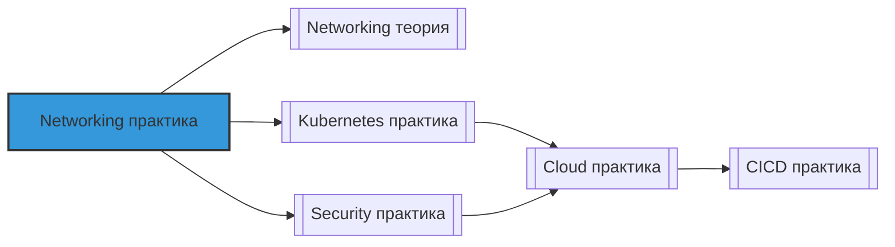

# 📄 Файл: `Networking практика.md`

tags: [networking, devops, security, tcp-ip, dns, http, load-balancing, vpc]
aliases: [networking-practice, network-labs, devops-networking]
created: 2026-05-07
---

# 🌐 Networking для DevOps: Практические сценарии и упражнения

> [!INFO] Структура
> Сценарии разделены по уровням: 🟢 Junior → 🟡 Middle → 🔴 Senior.  
> Каждый сценарий содержит: задачу, решение, разбор и DevOps-контекст.

📋 [[#🗂️ Оглавление для навигации|Оглавление]] | [[#🧪 Чек-лист навыков|Чек-лист]] | [[#🔗 Связь с другими файлами|Связи]]

---

## 🗂️ Оглавление для навигации

### 🟢 Junior (базовые команды и диагностика)
- [[#1. Проверить доступность хоста и порта: ping, telnet, nc|1. Проверка доступности]]
- [[#2. Посмотреть маршрутизацию и таблицы маршрутов|2. Маршрутизация: ip route]]
- [[#3. Протестировать разрешение имён: dig, nslookup, host|3. DNS: dig/nslookup]]
- [[#4. Проверить сетевые интерфейсы и IP-адреса|4. Интерфейсы: ip addr]]
- [[#5. Проанализировать активные соединения: ss, netstat|5. Соединения: ss/netstat]]
- [[#6. Отследить путь до хоста: traceroute, mtr|6. Трассировка пути]]
- [[#7. Проверить HTTP/HTTPS запрос: curl, wget|7. HTTP: curl/wget]]
- [[#8. Посмотреть статистику по сетевым ошибкам|8. Статистика: netstat -s]]
- [[#9. Протестировать firewall правила локально|9. Firewall: iptables/nftables]]
- [[#10. Создать простой TCP-сервер для тестов|10. Тестовый сервер: nc -l]]

### 🟡 Middle (диагностика, конфигурация, безопасность)
- [[#11. ⭐ Отладить "почему не подключается": пошаговый чек-лист|11. Debug connectivity ⭐]]
- [[#12. Проанализировать трафик: tcpdump, Wireshark фильтры|12. Трафик: tcpdump]]
- [[#13. Настроить DNS resolver и проверить кэширование|13. DNS resolver + cache]]
- [[#14. ⭐ Разобраться с NAT: SNAT, DNAT, Masquerade на примерах|14. NAT типы ⭐]]
- [[#15. Настроить простой Load Balancer с health checks|15. Load Balancer: HAProxy/nginx]]
- [[#16. Протестировать SSL/TLS: openssl s_client, cert expiry|16. SSL/TLS проверка]]
- [[#17. Настроить firewall правила для микросервиса|17. Firewall для сервиса]]
- [[#18. Отладить проблему с MTU и фрагментацией|18. MTU и фрагментация]]
- [[#19. Использовать netcat/socat для отладки протоколов|19. Netcat/Socat tricks]]
- [[#20. Настроить простой VPN туннель для тестов|20. VPN туннель: WireGuard]]

### 🔴 Senior (архитектура, облака, enterprise)
- [[#21. ⭐ Спроектировать VPC архитектуру для multi-tier приложения|21. VPC архитектура ⭐]]
- [[#22. Настроить Network Policies в Kubernetes для изоляции|22. K8s Network Policies]]
- [[#23. Реализовать zero-trust networking: mTLS, service mesh|23. Zero-trust / mTLS]]
- [[#24. ⭐ Отладить сложную проблему: таймауты, потеря пакетов, retransmits|24. Advanced debugging ⭐]]
- [[#25. Настроить CDN и cache invalidation стратегии|25. CDN стратегии]]
- [[#26. Реализовать DDoS mitigation на уровне сети и приложения|26. DDoS mitigation]]
- [[#27. Спроектировать hybrid cloud networking: VPN, Direct Connect|27. Hybrid cloud networking]]
- [[#28. Настроить observability для сети: flow logs, metrics, tracing|28. Network observability]]
- [[#29. Автоматизировать сетевую конфигурацию: Terraform, Ansible|29. Network as Code]]
- [[#30. ⭐ Спроектировать отказоустойчивую сеть для global application|30. Global HA networking ⭐]]

---

## 🟢 Junior (базовые команды и диагностика)

### 1. Проверить доступность хоста и порта: ping, telnet, nc
**Задача**: Убедиться, что сервер доступен и порт открыт.

**Решение**:
```bash
# Проверка ICMP (если не заблокирован фаерволом)
ping -c 4 192.168.1.100

# Проверка TCP-порта (telnet)
telnet api.example.com 443

# Проверка TCP/UDP (netcat — универсальнее)
nc -zv api.example.com 443        # TCP
nc -zvu dns.example.com 53        # UDP
nc -zv -w 5 api.example.com 80    # с таймаутом 5с

# Проверка с выводом деталей
nc -v -w 2 10.0.0.5 3306 2>&1 | grep -i "succeeded\|failed"
```

**Разбор**:
- `ping` использует ICMP — может быть заблокирован, но хост доступен
- `telnet` — только TCP, устарел, но есть везде
- `nc` (netcat) — поддерживает TCP/UDP, таймауты, скриптинг

**DevOps-контекст**: Базовая проверка при деплое: "сервис запустился, но не принимает соединения?" — первым делом проверяем порт.

**Проверка**: 
```bash
# Запустить тестовый сервер в одном терминале
nc -l -p 9999

# В другом: подключиться
echo "test" | nc localhost 9999
```

[[#🗂️ Оглавление для навигации|↑ К оглавлению]]

### 2. Посмотреть маршрутизацию и таблицы маршрутов
**Задача**: Понять, куда пойдёт трафик от хоста.

**Решение**:
```bash
# Показать таблицу маршрутов
ip route show
# или
route -n

# Конкретный маршрут до хоста
ip route get 8.8.8.8

# Добавить/удалить маршрут (требует root)
sudo ip route add 10.10.0.0/16 via 192.168.1.1
sudo ip route del 10.10.0.0/16

# Проверить default gateway
ip route | grep default
```

**Разбор**:
- Формат: `DEST via GW dev INTERFACE src SOURCE_IP`
- `default via 192.168.1.1 dev eth0` — весь внешний трафик через этот шлюз
- Более специфичные маршруты имеют приоритет над default

**DevOps-контекст**: В Kubernetes/CNI плагины управляют маршрутами для pod-сети. Понимание `ip route` помогает отлаживать проблемы с pod→pod коммуникацией.

**Проверка**: 
```bash
# Создать namespace и проверить изоляцию маршрутов
ip netns add test-ns
ip netns exec test-ns ip route show  # должно быть пусто
```

[[#🗂️ Оглавление для навигации|↑ К оглавлению]]

### 3. Протестировать разрешение имён: dig, nslookup, host
**Задача**: Проверить, что домен резолвится в правильный IP.

**Решение**:
```bash
# dig — наиболее информативный
dig +short api.example.com
dig api.example.com ANY          # все записи
dig @8.8.8.8 api.example.com     # через конкретный DNS

# nslookup — проще, но меньше деталей
nslookup api.example.com

# host — минималистичный
host api.example.com

# Проверить конкретный тип записи
dig api.example.com A            # IPv4
dig api.example.com AAAA         # IPv6
dig example.com MX               # почта
dig example.com TXT              # SPF/DKIM/верификация
```

**Разбор**:
- Порядок резолвинга: `/etc/hosts` → `/etc/resolv.conf` nameservers → поиск
- `+trace` в dig показывает всю цепочку от root-серверов
- TTL влияет на кэширование: после изменения записи ждём истечения TTL

**DevOps-контекст**: При миграции сервисов часто меняют DNS. Понимание TTL и propagation критично для планирования окна изменений.

**Проверка кэша**:
```bash
# Проверить, что используется локальный resolver
cat /etc/resolv.conf

# Очистить кэш (зависит от ОС)
# systemd-resolved:
sudo resolvectl flush-caches
# macOS:
sudo dscacheutil -flushcache
```

[[#🗂️ Оглавление для навигации|↑ К оглавлению]]

### 4. Проверить сетевые интерфейсы и IP-адреса
**Задача**: Увидеть, какие интерфейсы активны и какие IP назначены.

**Решение**:
```bash
# Все интерфейсы с деталями
ip addr show
# или кратко
ip -br addr

# Конкретный интерфейс
ip addr show eth0

# Статистика по интерфейсу (ошибки, дропы)
ip -s link show eth0

# Включить/выключить интерфейс
sudo ip link set eth0 up
sudo ip link set eth0 down

# Добавить виртуальный интерфейс (для тестов)
sudo ip addr add 10.99.0.1/24 dev eth0 label eth0:1
```

**Разбор**:
- `UP` — интерфейс активен на L1/L2
- `LOWER_UP` — физический линк поднят (кабель подключён)
- `mtu 1500` — максимальный размер пакета без фрагментации

**DevOps-контекст**: В контейнерах каждый pod получает виртуальный интерфейс (veth). `ip addr` помогает понять, какой IP у pod'а и как он связан с хостом.

**Проверка**: 
```bash
# Создать veth-пару для тестов
sudo ip link add veth0 type veth peer name veth1
sudo ip addr add 10.200.0.1/24 dev veth0
sudo ip link set veth0 up
sudo ip link set veth1 up
# Теперь можно пинговать 10.200.0.2 с veth1
```

[[#🗂️ Оглавление для навигации|↑ К оглавлению]]

### 5. Проанализировать активные соединения: ss, netstat
**Задача**: Увидеть, кто с кем соединён и в каком состоянии.

**Решение**:
```bash
# Все TCP-соединения (ss — современная замена netstat)
ss -tunap

# Только listening порты
ss -tlnp

# С фильтрацией по порту/процессу
ss -tlnp | grep :443
ss -tunap | grep postgres

# Статистика по состояниям
ss -tan | awk '{print $1}' | sort | uniq -c

# Netstat (если ss нет)
netstat -tunap
```

**Разбор**:
- Состояния: `LISTEN`, `ESTABLISHED`, `TIME-WAIT`, `CLOSE-WAIT`
- `TIME-WAIT` много? → возможно, не настроен reuse в приложении
- `CLOSE-WAIT` много? → приложение не закрывает соединения (утечка)

**DevOps-контекст**: При "медленном" сервисе первым делом смотрим: много ли `ESTABLISHED`, нет ли `CLOSE-WAIT` утечек, не переполнен ли backlog (`Recv-Q`).

**Проверка**: 
```bash
# Создать соединение и посмотреть его
nc -l -p 9999 &
nc localhost 9999 &
ss -tunap | grep 9999
```

[[#🗂️ Оглавление для навигации|↑ К оглавлению]]

### 6. Отследить путь до хоста: traceroute, mtr
**Задача**: Понять, через какие узлы идёт трафик и где задержка.

**Решение**:
```bash
# Классический traceroute (UDP по умолчанию)
traceroute api.example.com

# TCP traceroute (обходит фаерволы, блокирующие UDP)
traceroute -T -p 443 api.example.com

# mtr — интерактивный, сочетает ping + traceroute
mtr api.example.com
mtr -rw -c 100 api.example.com  # отчёт после 100 пакетов

# С указанием интерфейса
traceroute -i eth0 8.8.8.8
```

**Разбор**:
- `* * *` — узел не отвечает на ICMP (нормально для фаерволов)
- Резкий скачок задержки → возможная проблема на этом ходе
- `mtr -rw` даёт статистику потерь и задержек по каждому хопу

**DevOps-контекст**: При проблемах с latency между регионами traceroute/mtr помогает локализовать: проблема в вашем DC, у провайдера или у облачного вендора.

**Проверка**: 
```bash
# Сравнить маршруты из разных сетей
# Из pod в Kubernetes:
kubectl run debug --rm -it --image=nicolaka/netshoot -- traceroute kubernetes.default
```

[[#🗂️ Оглавление для навигации|↑ К оглавлению]]

### 7. Проверить HTTP/HTTPS запрос: curl, wget
**Задача**: Протестировать веб-эндпоинт вручную.

**Решение**:
```bash
# Базовый GET
curl -v https://api.example.com/health

# С таймаутами
curl --connect-timeout 5 --max-time 10 https://api.example.com

# С заголовками и телом
curl -X POST -H "Content-Type: application/json" \
  -d '{"key":"value"}' https://api.example.com/api

# Игнорировать самоподписанные сертификаты (только для тестов!)
curl -k https://self-signed.example.com

# Показать только статус-код
curl -o /dev/null -s -w "%{http_code}\n" https://api.example.com

# Скачать файл
wget -q https://example.com/file.tar.gz
```

**Разбор**:
- `-v` (verbose) показывает handshake, заголовки, редиректы
- `%{http_code}`, `%{time_total}` — переменные для скриптов
- `-k` отключает проверку сертификата — ⚠️ никогда в production

**DevOps-контекст**: curl — основной инструмент для health checks в скриптах, интеграционных тестов, отладки микросервисов.

**Проверка**: 
```bash
# Запустить простой HTTP-сервер
python3 -m http.server 8080
# В другом терминале:
curl http://localhost:8080
```

[[#🗂️ Оглавление для навигации|↑ К оглавлению]]

### 8. Посмотреть статистику по сетевым ошибкам
**Задача**: Выявить проблемы на уровне ядра/драйверов.

**Решение**:
```bash
# Общая статистика по протоколам
netstat -s
# или
ss -s

# Статистика по интерфейсу (ошибки, дропы, overruns)
ip -s link show eth0

# Детали по TCP (retransmits, errors)
nstat -az | grep -i tcp
# или
cat /proc/net/netstat | grep -i tcp

# Ошибки в dmesg (драйверы, hardware)
dmesg | grep -i eth0 | grep -i error
```

**Разбор**:
- `dropped` — пакеты отброшены (нет буфера, фаервол)
- `overruns` — ядро не успевает обрабатывать (нехватка CPU/IRQ)
- `TCPRetransSegs` растёт? → потеря пакетов, плохая сеть

**DevOps-контекст**: Рост ошибок в `ip -s` может указывать на перегрузку сети, баг в драйвере или неправильный MTU.

**Проверка**: 
```bash
# Сгенерировать нагрузку и посмотреть статистику
ping -f 8.8.8.8 &  # flood ping (требует root)
ip -s link show eth0 | grep -A1 "RX:"
```

[[#🗂️ Оглавление для навигации|↑ К оглавлению]]

### 9. Протестировать firewall правила локально
**Задача**: Проверить, не блокирует ли фаервол нужные порты.

**Решение** (iptables):
```bash
# Показать правила с номерами строк
sudo iptables -L -n -v --line-numbers

# Проверить конкретный порт
sudo iptables -L INPUT -n -v | grep :443

# Временно открыть порт для теста
sudo iptables -I INPUT -p tcp --dport 9999 -j ACCEPT

# После теста — удалить правило (по номеру из первого шага)
sudo iptables -D INPUT 3

# Сохранить правила (зависит от дистрибутива)
sudo iptables-save > /etc/iptables/rules.v4
```

**Решение** (nftables — современная замена):
```bash
sudo nft list ruleset
sudo nft add rule inet filter input tcp dport 9999 accept
```

**Разбор**:
- Порядок правил важен: первое совпадение применяется
- `-j DROP` vs `-j REJECT`: DROP молча отбрасывает, REJECT шлёт ответ
- Всегда тестируйте в screen/tmux, чтобы не заблокировать себя

**DevOps-контекст**: В Kubernetes Network Policies — это "фаервол для pod'ов". Понимание iptables помогает отлаживать, почему pod не видит другой pod.

**Проверка**: 
```bash
# Запустить сервер на порту 9999
nc -l -p 9999 &
# Заблокировать порт
sudo iptables -A INPUT -p tcp --dport 9999 -j DROP
# Проверить: должно таймаутиться
nc -zv -w 2 localhost 9999
# Разблокировать
sudo iptables -D INPUT -p tcp --dport 9999 -j DROP
```

[[#🗂️ Оглавление для навигации|↑ К оглавлению]]

### 10. Создать простой TCP-сервер для тестов
**Задача**: Быстро поднять тестовый эндпоинт для отладки клиентов.

**Решение**:
```bash
# Простой echo-сервер на netcat
nc -l -p 9999

# Сервер, который отвечает фиксированным ответом
while true; do echo -e "HTTP/1.1 200 OK\r\nContent-Length: 2\r\n\r\nOK" | nc -l -p 8080 -q 1; done

# Python HTTP-сервер (для файлов)
python3 -m http.server 8080

# Более гибкий: socat
socat TCP-LISTEN:9999,reuseaddr,fork EXEC:/bin/cat

# Тестовый HTTPS (самоподписанный)
openssl req -x509 -newkey rsa:2048 -keyout key.pem -out cert.pem -days 1 -nodes -subj "/CN=localhost"
openssl s_server -accept 8443 -cert cert.pem -key key.pem -www
```

**Разбор**:
- `-l` — listen mode, `-p` — порт
- `-q 1` в nc — закрыть после EOF
- `reuseaddr` позволяет перезапускать сервер без ожидания TIME-WAIT

**DevOps-контекст**: Быстрые тестовые серверы незаменимы при отладке клиентов, балансировщиков, фаерволов без деплоя реального приложения.

**Проверка**: 
```bash
# В одном терминале
nc -l -p 9999
# В другом
echo "hello" | nc localhost 9999
# В первом должно появиться "hello"
```

[[#🗂️ Оглавление для навигации|↑ К оглавлению]]

---

## 🟡 Middle (диагностика, конфигурация, безопасность)

### 11. ⭐ Отладить "почему не подключается": пошаговый чек-лист
**Задача**: Системно найти причину, почему клиент не может подключиться к сервису.

**Решение** (чек-лист снизу вверх по стеку):
```bash
# 1. Физический уровень: интерфейс поднят?
ip link show eth0 | grep "state UP"

# 2. IP-адрес назначен?
ip addr show eth0 | grep "inet "

# 3. Маршрут есть?
ip route get 10.0.0.5

# 4. DNS резолвится?
dig +short service.namespace.svc.cluster.local

# 5. Порт открыт на сервере?
# На сервере:
ss -tlnp | grep :8080
# С клиента:
nc -zv -w 2 10.0.0.5 8080

# 6. Фаервол не блокирует?
# На сервере:
sudo iptables -L INPUT -n -v | grep :8080
# В облаке: проверить Security Groups / Network ACLs

# 7. Приложение слушает нужный интерфейс?
# 0.0.0.0 — все интерфейсы, 127.0.0.1 — только localhost
ss -tlnp | grep :8080

# 8. Приложение живое? (health check)
curl -f http://localhost:8080/health || echo "App not responding"

# 9. Трафик доходит? (tcpdump)
sudo tcpdump -i any port 8080 -nn -c 10

# 10. Нет ли проблем с MTU/фрагментацией?
ping -M do -s 1472 10.0.0.5  # 1472 + 28 = 1500 MTU
```

**Разбор**: 
- Двигайтесь от низких уровней к высоким: физика → IP → порт → приложение
- Всегда проверяйте с обеих сторон: клиент и сервер
- Используйте `tcpdump` как "истину последней инстанции"

**DevOps-контекст**: Этот чек-лист экономит часы при инцидентах. Задокументируйте его в runbook для on-call.

**Автоматизация**:
```bash
#!/bin/bash
# check-connectivity.sh
TARGET=${1:-localhost}
PORT=${2:-80}

echo "=== Checking $TARGET:$PORT ==="
ping -c 1 -W 1 $TARGET &>/dev/null && echo "✓ ICMP" || echo "✗ ICMP"
nc -zv -w 2 $TARGET $PORT 2>&1 && echo "✓ TCP" || echo "✗ TCP"
curl -sf --connect-timeout 2 http://$TARGET:$PORT/health &>/dev/null && echo "✓ HTTP" || echo "✗ HTTP"
```

[[#🗂️ Оглавление для навигации|↑ К оглавлению]]

### 12. Проанализировать трафик: tcpdump, Wireshark фильтры
**Задача**: Увидеть, что реально передаётся по сети.

**Решение** (tcpdump):
```bash
# Базовый захват на интерфейсе
sudo tcpdump -i eth0 -nn -c 20

# Фильтр по порту/хосту/протоколу
sudo tcpdump -i any port 443 -nn
sudo tcpdump -i eth0 host 10.0.0.5 and port 80
sudo tcpdump -i any tcp -nn

# Показать содержимое пакетов (для отладки протоколов)
sudo tcpdump -i any -A port 80 | grep -i "host:\|get\|post"

# Записать в файл для анализа в Wireshark
sudo tcpdump -i any -w capture.pcap port 443

# Фильтры BPF (Berkeley Packet Filter):
# Показать только SYN-пакеты (новые соединения)
sudo tcpdump 'tcp[tcpflags] & tcp-syn != 0'
# Показать ретрансмиты
sudo tcpdump 'tcp[13] & 0x04 != 0'
```

**Wireshark фильтры (после открытия .pcap)**:
```
tcp.port == 443
http.request.method == "POST"
ip.src == 10.0.0.0/24
tcp.analysis.retransmission
dns.qry.name contains "example"
```

**Разбор**:
- `-nn` — не резолвить имена/порты (быстрее, чище)
- `-c 20` — ограничить количество пакетов (чтобы не залить диск)
- `-A` — вывести ASCII, `-X` — hex+ASCII

**DevOps-контекст**: tcpdump — "рентген" для сети. Когда всё остальное молчит, он покажет, доходят ли пакеты вообще.

**Безопасность**: Захват трафика может содержать чувствительные данные. Используйте `-w` с шифрованием диска и удаляйте файлы после анализа.

[[#🗂️ Оглавление для навигации|↑ К оглавлению]]

### 13. Настроить DNS resolver и проверить кэширование
**Задача**: Ускорить резолвинг и отладить проблемы с кэшем.

**Решение** (настройка `/etc/resolv.conf`):
```bash
# Временная настройка
echo "nameserver 8.8.8.8" | sudo tee /etc/resolv.conf
echo "nameserver 1.1.1.1" | sudo tee -a /etc/resolv.conf
echo "options timeout:2 attempts:3 rotate" | sudo tee -a /etc/resolv.conf

# systemd-resolved (современные дистрибутивы)
sudo resolvectl dns eth0 8.8.8.8 1.1.1.1
sudo resolvectl domain eth0 ~.

# Проверить кэш
resolvectl statistics
resolvectl query api.example.com
```

**Проверка кэширования**:
```bash
# Замерить время первого и второго запроса
time dig +short api.example.com   # первый — медленно
time dig +short api.example.com   # второй — быстро (из кэша)

# Очистить кэш
sudo resolvectl flush-caches
```

**Разбор**:
- `rotate` — использовать nameservers в round-robin
- `timeout:2` — ждать ответ 2 секунды перед следующим
- systemd-resolved кэширует ответы, что ускоряет повторные запросы

**DevOps-контекст**: В Kubernetes CoreDNS кэширует запросы по умолчанию. При миграции сервисов учитывайте `ttl` в записях и `cache` в CoreDNS config.

**Проверка**: 
```bash
# Посмотреть, какой resolver используется
cat /etc/resolv.conf
# Проверить, что запросы идут куда надо
sudo tcpdump -i any port 53 -nn | grep -i "A\? api.example.com"
```

[[#🗂️ Оглавление для навигации|↑ К оглавлению]]

### 14. ⭐ Разобраться с NAT: SNAT, DNAT, Masquerade на примерах
**Задача**: Понять и настроить трансляцию адресов для доступа к сервисам.

**Решение** (iptables примеры):
```bash
# SNAT: изменить source IP исходящих пакетов
# (чтобы ответы возвращались через этот хост)
sudo iptables -t nat -A POSTROUTING -s 10.0.0.0/24 -o eth0 -j SNAT --to-source 203.0.113.10

# Masquerade: SNAT для динамических/плавающих внешних IP (например, DHCP)
sudo iptables -t nat -A POSTROUTING -s 10.0.0.0/24 -o eth0 -j MASQUERADE

# DNAT: перенаправить входящий трафик на другой хост/порт
# (порт-форвардинг: внешний 80 → внутренний 8080)
sudo iptables -t nat -A PREROUTING -i eth0 -p tcp --dport 80 -j DNAT --to-destination 10.0.0.5:8080

# Комбинированный пример: доступ к pod извне в Kubernetes (упрощённо)
# 1. Внешний трафик на узел:80 → DNAT на pod:8080
sudo iptables -t nat -A PREROUTING -p tcp --dport 80 -j DNAT --to-destination 10.244.1.10:8080
# 2. Ответы от pod: изменить source на адрес узла (чтобы клиент принял)
sudo iptables -t nat -A POSTROUTING -d 10.244.1.10 -p tcp --dport 8080 -j MASQUERADE

# Проверка правил
sudo iptables -t nat -L -n -v --line-numbers

# Удаление правила по номеру
sudo iptables -t nat -D PREROUTING 3
```

**Разбор**:
- `PREROUTING` — применяется до маршрутизации (для входящих)
- `POSTROUTING` — после маршрутизации (для исходящих)
- `MASQUERADE` медленнее `SNAT`, но работает с динамическими IP

**DevOps-контекст**: В Kubernetes kube-proxy использует iptables/ipvs для реализации Service типа NodePort/LoadBalancer — это по сути DNAT+SNAT.

**Проверка**: 
```bash
# Протестировать порт-форвардинг
# На "внутреннем" хосте:
nc -l -p 8080
# На "шлюзе" настроить DNAT:
sudo iptables -t nat -A PREROUTING -p tcp --dport 80 -j DNAT --to-destination 127.0.0.1:8080
# С клиента:
curl http://gateway-ip:80  # должно дойти до 8080
```

[[#🗂️ Оглавление для навигации|↑ К оглавлению]]

### 15. Настроить простой Load Balancer с health checks
**Задача**: Распределить трафик между бэкендами с проверкой их доступности.

**Решение** (HAProxy пример):
```haproxy
# /etc/haproxy/haproxy.cfg
global
    log /dev/log local0
    maxconn 4096

defaults
    mode http
    log global
    option httplog
    option dontlognull
    timeout connect 5s
    timeout client 30s
    timeout server 30s

frontend http_front
    bind *:80
    default_backend app_back

backend app_back
    balance roundrobin
    option httpchk GET /health
    http-check expect status 200
    server app1 10.0.0.10:8080 check inter 3s fall 3 rise 2
    server app2 10.0.0.11:8080 check inter 3s fall 3 rise 2
    server app3 10.0.0.12:8080 check inter 3s fall 3 rise 2 backup
```

**Разбор параметров**:
- `balance roundrobin` — круговое распределение (есть также `leastconn`, `source`)
- `check inter 3s` — проверять health каждые 3 секунды
- `fall 3 rise 2` — убрать из ротации после 3 неудач, вернуть после 2 успехов
- `backup` — сервер используется только если основные упали

**DevOps-контекст**: HAProxy/nginx — стандарт для L7 балансировки в self-hosted окружениях. В облаках используйте managed LB (ALB, NLB) с аналогичными health check настройками.

**Проверка**: 
```bash
# Проверить конфигурацию
haproxy -c -f /etc/haproxy/haproxy.cfg

# Перезагрузить без даунтайма
sudo systemctl reload haproxy

# Статус бэкендов (если включена stats page)
curl http://localhost:8404/stats
```

**Альтернатива: nginx**:
```nginx
upstream app_back {
    least_conn;
    server 10.0.0.10:8080 max_fails=3 fail_timeout=30s;
    server 10.0.0.11:8080 max_fails=3 fail_timeout=30s;
    server 10.0.0.12:8080 backup;
}
server {
    location / {
        proxy_pass http://app_back;
        proxy_next_upstream error timeout http_502 http_503;
    }
}
```

[[#🗂️ Оглавление для навигации|↑ К оглавлению]]

### 16. Протестировать SSL/TLS: openssl s_client, cert expiry
**Задача**: Проверить сертификат, цепочку доверия, поддерживаемые протоколы.

**Решение**:
```bash
# Базовая проверка сертификата
openssl s_client -connect api.example.com:443 -servername api.example.com </dev/null 2>/dev/null | openssl x509 -noout -dates

# Полная информация о сертификате
openssl s_client -connect api.example.com:443 -servername api.example.com </dev/null 2>&1 | openssl x509 -noout -text | grep -A2 "Subject:\|Issuer:\|DNS:"

# Проверить цепочку доверия
openssl s_client -connect api.example.com:443 -servername api.example.com -CApath /etc/ssl/certs </dev/null 2>&1 | grep "Verify return code"

# Проверить поддерживаемые протоколы/шифры
openssl s_client -connect api.example.com:443 -tls1_2 </dev/null 2>&1 | grep -i "protocol\|cipher"
openssl s_client -connect api.example.com:443 -tls1_3 </dev/null 2>&1 | grep -i "protocol\|cipher"

# Проверить expiry автоматически (для мониторинга)
#!/bin/bash
HOST=${1:-api.example.com}
PORT=${2:-443}
DAYS_WARN=30

EXPIRY=$(echo | openssl s_client -connect $HOST:$PORT -servername $HOST 2>/dev/null | openssl x509 -noout -enddate | cut -d= -f2)
EXPIRY_EPOCH=$(date -d "$EXPIRY" +%s)
NOW_EPOCH=$(date +%s)
DAYS_LEFT=$(( ($EXPIRY_EPOCH - $NOW_EPOCH) / 86400 ))

if [ $DAYS_LEFT -lt $DAYS_WARN ]; then
    echo "⚠️ Certificate for $HOST expires in $DAYS_LEFT days"
    exit 1
else
    echo "✓ Certificate for $HOST valid for $DAYS_LEFT days"
    exit 0
fi
```

**Разбор**:
- `-servername` нужен для SNI (multiple certs на одном IP)
- `Verify return code: 0 (ok)` — цепочка доверия валидна
- `openssl x509 -noout -dates` — удобно для скриптов

**DevOps-контекст**: Автоматизируйте проверку expiry в CI/CD и мониторинге. Let's Encrypt сертификаты живут 90 дней — обязательно настройте авто-обновление (certbot).

**Проверка**: 
```bash
# Поднять тестовый самоподписанный сервер
openssl req -x509 -newkey rsa:2048 -keyout key.pem -out cert.pem -days 7 -nodes -subj "/CN=localhost"
openssl s_server -accept 8443 -cert cert.pem -key key.pem -www &
# Проверить его
openssl s_client -connect localhost:8443 -servername localhost </dev/null 2>&1 | grep "Verify return code"
```

[[#🗂️ Оглавление для навигации|↑ К оглавлению]]

### 17. Настроить firewall правила для микросервиса
**Задача**: Реализовать least privilege доступ для сервиса.

**Решение** (iptables пример для API-сервиса):
```bash
#!/bin/bash
# firewall-api.sh — применить правила для API-сервиса на порту 8080

# Очистить старые правила (осторожно в production!)
# sudo iptables -F

# Default policy: DROP входящие, ACCEPT исходящие
sudo iptables -P INPUT DROP
sudo iptables -P FORWARD DROP
sudo iptables -P OUTPUT ACCEPT

# Разрешить loopback (критично для локальных сервисов)
sudo iptables -A INPUT -i lo -j ACCEPT
sudo iptables -A OUTPUT -o lo -j ACCEPT

# Разрешить установленные соединения и связанные
sudo iptables -A INPUT -m state --state ESTABLISHED,RELATED -j ACCEPT

# Разрешить SSH только с доверенной подсети (для администрирования)
sudo iptables -A INPUT -p tcp -s 10.0.0.0/24 --dport 22 -j ACCEPT

# Разрешить health checks от балансировщика/мониторинга
sudo iptables -A INPUT -p tcp -s 10.0.1.0/24 --dport 8080 -m state --state NEW -j ACCEPT

# Разрешить трафик от других микросервисов (по меткам/подсетям)
sudo iptables -A INPUT -p tcp -s 10.0.2.0/24 --dport 8080 -m state --state NEW -j ACCEPT

# Логировать отброшенные пакеты (для отладки)
sudo iptables -A INPUT -j LOG --log-prefix "DROPPED: " --log-level 4

# Применить и сохранить
sudo iptables-save | sudo tee /etc/iptables/rules.v4
```

**Разбор**:
- Порядок правил критичен: более специфичные — выше
- `--log-prefix` помогает фильтровать логи фаервола
- Всегда оставляйте доступ к SSH, иначе заблокируете себя

**DevOps-контекст**: В Kubernetes это реализуется через Network Policies. Принцип тот же: default deny, разрешать только необходимый трафик.

**Проверка**: 
```bash
# Протестировать с разных "источников"
nc -zv -w 2 10.0.1.5 8080   # должно пройти (балансировщик)
nc -zv -w 2 192.168.1.100 8080  # должно быть отброшено
# Проверить логи
sudo tail -f /var/log/kern.log | grep "DROPPED:"
```

[[#🗂️ Оглавление для навигации|↑ К оглавлению]]

### 18. Отладить проблему с MTU и фрагментацией
**Задача**: Решить проблему, когда большие пакеты теряются, а маленькие проходят.

**Решение**:
```bash
# Проверить текущий MTU интерфейса
ip link show eth0 | grep mtu

# Протестировать максимальный размер без фрагментации
# 1500 (MTU) - 20 (IP) - 8 (ICMP) = 1472
ping -M do -s 1472 10.0.0.5    # должно пройти
ping -M do -s 1473 10.0.0.5    # должно дать "Message too long"

# Если проблема в пути (не на первом ходе):
mtr -rw -c 50 10.0.0.5         # искать потери по хопам

# Временное решение: уменьшить MTU (не рекомендуется как фикс)
sudo ip link set eth0 mtu 1400

# Правильное решение: найти и исправить узкое место
# 1. Проверить MTU на всех интерфейсах в пути
# 2. Настроить Path MTU Discovery (PMTUD) — не блокировать ICMP "Fragmentation needed"
# 3. Для VPN/overlay сетей: учесть overhead (VXLAN +50 байт, WireGuard +60)

# Для Docker/Kubernetes: проверить MTU в конфиге daemon
cat /etc/docker/daemon.json | grep mtu
# Обычно: 1450 для VXLAN overlay сетей
```

**Разбор**:
- `ping -M do` — "Don't Fragment" флаг, если пакет не пролезет — ошибка
- Потери только больших пакетов = классический признак MTU-проблемы
- ICMP "Fragmentation needed" должен быть разрешён для PMTUD

**DevOps-контекст**: В overlay-сетях (Calico VXLAN, Weave) MTU уменьшается на размер заголовка. Неправильная настройка → тихие потери пакетов, таймауты, ретрансмиты.

**Проверка**: 
```bash
# Создать veth-пару с разным MTU для теста
sudo ip link add veth0 type veth peer name veth1
sudo ip link set veth0 mtu 1500 up
sudo ip link set veth1 mtu 1400 up
sudo ip addr add 10.200.0.1/24 dev veth0
sudo ip addr add 10.200.0.2/24 dev veth1
# Теперь большие пакеты с veth0 на veth1 будут теряться
ping -M do -s 1472 10.200.0.2  # OK
ping -M do -s 1473 10.200.0.2  # Fail
```

[[#🗂️ Оглавление для навигации|↑ К оглавлению]]

### 19. Использовать netcat/socat для отладки протоколов
**Задача**: Быстро протестировать или эмулировать сетевой протокол без написания кода.

**Решение** (netcat примеры):
```bash
# HTTP-запрос вручную
printf "GET / HTTP/1.1\r\nHost: example.com\r\n\r\n" | nc example.com 80

# Простой прокси (пересылка трафика)
mkfifo /tmp/fifo
nc -l -p 9999 < /tmp/fifo | nc real-server 8080 > /tmp/fifo

# UDP-тест
echo "test" | nc -u -w1 dns-server 53

# Сканирование портов (осторожно, может триггерить IDS)
for port in {20..25,80,443,3306}; do nc -zv -w1 target $port; done
```

**Решение** (socat — более мощный):
```bash
# TCP ↔ TCP прокси с логированием
socat -v TCP-LISTEN:9999,reuseaddr,fork TCP:real-server:8080

# TCP ↔ UDP мост (для тестов протоколов)
socat UDP4-RECV:53,fork TCP:8.8.8.8:53

# SSL-терминация (для тестов)
socat OPENSSL-LISTEN:8443,cert=cert.pem,key=key.pem,reuseaddr,fork TCP:localhost:8080

# Файл ↔ TCP (отправка файла по сети)
# На принимающей стороне:
socat -u TCP-LISTEN:9999,reuseaddr open:received.bin,creat
# На отправляющей:
socat -u open:file.bin TCP:target:9999
```

**Разбор**:
- `socat -v` — verbose, показывает трафик в обе стороны
- `reuseaddr` — позволяет перезапускать сервер без ожидания
- `fork` — обрабатывать несколько соединений параллельно

**DevOps-контекст**: Незаменимы для быстрой отладки: эмулировать ответ сервиса, протестировать клиент, проверить балансировщик без деплоя реального приложения.

**Проверка**: 
```bash
# Эмулировать медленный сервис
socat TCP-LISTEN:8080,reuseaddr,fork EXEC:"/bin/sh -c 'sleep 2; echo HTTP/1.1 200 OK; echo; echo slow-response'"
# Проверить таймауты клиента
curl -v --connect-timeout 1 --max-time 5 http://localhost:8080
```

[[#🗂️ Оглавление для навигации|↑ К оглавлению]]

### 20. Настроить простой VPN туннель для тестов
**Задача**: Создать безопасный туннель между двумя хостами для отладки.

**Решение** (WireGuard — современный, простой):
```bash
# Установить (Ubuntu/Debian)
sudo apt install wireguard

# Сгенерировать ключи на обоих хостах
wg genkey | tee privatekey | wg pubkey > publickey

# Конфигурация сервера (/etc/wireguard/wg0.conf)
[Interface]
PrivateKey = <server-private-key>
Address = 10.200.0.1/24
ListenPort = 51820

[Peer]
# Клиент
PublicKey = <client-public-key>
AllowedIPs = 10.200.0.2/32

# Конфигурация клиента
[Interface]
PrivateKey = <client-private-key>
Address = 10.200.0.2/24

[Peer]
# Сервер
PublicKey = <server-public-key>
Endpoint = server.example.com:51820
AllowedIPs = 10.200.0.0/24
PersistentKeepalive = 25

# Поднять интерфейс
sudo wg-quick up wg0

# Проверить статус
sudo wg show

# Протестировать связь
ping 10.200.0.1  # с клиента на сервер
```

**Разбор**:
- `AllowedIPs` — какие трафик маршрутить через туннель (работает как ACL)
- `PersistentKeepalive` — держать соединение через NAT
- WireGuard использует UDP/51820, легко обходит многие фаерволы

**DevOps-контекст**: WireGuard идеален для site-to-site VPN, доступа к приватным кластерам, безопасного соединения между микросервисами в разных сетях.

**Альтернатива: SSH-туннель** (быстро, без установки доп. ПО):
```bash
# Локальный порт-форвардинг (доступ к удалённому сервису как к локальному)
ssh -L 8080:localhost:80 user@remote-host

# Удалённый порт-форвардинг (открыть локальный сервис наружу)
ssh -R 9999:localhost:8080 user@remote-host

# SOCKS-прокси (весь трафик через удалённый хост)
ssh -D 1080 user@remote-host
# В браузере: SOCKS proxy localhost:1080
```

[[#🗂️ Оглавление для навигации|↑ К оглавлению]]

---

## 🔴 Senior (архитектура, облака, enterprise)

### 21. ⭐ Спроектировать VPC архитектуру для multi-tier приложения
**Задача**: Создать безопасную, масштабируемую сеть для веб-приложения с БД.

**Решение** (AWS пример, но принципы универсальны):
```
┌─────────────────────────────────┐
│ VPC: 10.0.0.0/16                │
│                                 │
│  ┌─────────────────────────┐   │
│  │ Public Subnets          │   │
│  │ 10.0.1.0/24 (us-east-1a)│   │
│  │ 10.0.2.0/24 (us-east-1b)│   │
│  │ • ALB (Internet-facing) │   │
│  │ • Bastion host          │   │
│  │ • NAT Gateway           │   │
│  └────────┬────────────────┘   │
│           │                     │
│  ┌────────▼────────────────┐   │
│  │ Private Subnets         │   │
│  │ 10.0.10.0/24 (1a)       │   │
│  │ 10.0.11.0/24 (1b)       │   │
│  │ • App servers (EC2/EKS) │   │
│  │ • Internal ALB          │   │
│  └────────┬────────────────┘   │
│           │                     │
│  ┌────────▼────────────────┐   │
│  │ Data Subnets            │   │
│  │ 10.0.20.0/24 (1a)       │   │
│  │ 10.0.21.0/24 (1b)       │   │
│  │ • RDS/Aurora (multi-AZ) │   │
│  │ • ElastiCache           │   │
│  └─────────────────────────┘   │
│                                 │
│ Security Groups:                │
│ • sg-alb: 80/443 from 0.0.0.0/0│
│ • sg-app: 8080 from sg-alb     │
│ • sg-db: 5432 from sg-app      │
│                                 │
│ NACLs (stateless, optional):    │
│ • Allow ephemeral ports для ответов│
└─────────────────────────────────┘
```

**Ключевые решения**:
1. **Разделение подсетей**: public (с интернет-шлюзом) ↔ private (только исходящий через NAT) ↔ data (изолированные)
2. **Multi-AZ**: каждая подсеть в разных зонах доступности для отказоустойчивости
3. **Security Groups (stateful)**: разрешать только необходимый трафик между слоями
4. **NAT Gateway** в public subnet для исходящего трафика из private
5. **VPC Endpoints** для AWS сервисов (S3, DynamoDB) без выхода в интернет

**Terraform скелет**:
```hcl
# vpc.tf
resource "aws_vpc" "main" {
  cidr_block = "10.0.0.0/16"
  enable_dns_support = true
  enable_dns_hostnames = true
}

resource "aws_subnet" "public" {
  count = 2
  vpc_id = aws_vpc.main.id
  cidr_block = "10.0.${1 + count.index}.0/24"
  availability_zone = data.aws_availability_zones.available.names[count.index]
  map_public_ip_on_launch = true
}

resource "aws_subnet" "private" {
  count = 2
  vpc_id = aws_vpc.main.id
  cidr_block = "10.0.${10 + count.index}.0/24"
  availability_zone = data.aws_availability_zones.available.names[count.index]
}

resource "aws_security_group" "app" {
  vpc_id = aws_vpc.main.id
  ingress {
    from_port = 8080
    to_port = 8080
    protocol = "tcp"
    security_groups = [aws_security_group.alb.id]
  }
  egress {
    from_port = 5432
    to_port = 5432
    protocol = "tcp"
    security_groups = [aws_security_group.db.id]
  }
}
```

**DevOps-контекст**: Правильная сетевая архитектура — основа безопасности и масштабируемости. Изоляция слоёв предотвращает горизонтальное перемещение при компрометации одного компонента.

**Проверка**: 
```bash
# С bastion host проверить, что app-серверы не имеют публичных IP
aws ec2 describe-instances --filters "Name=tag:Role,Values=app" \
  --query "Reservations[].Instances[].{ID:InstanceId,PublicIP:PublicIpAddress}"

# Протестировать SG правила
nc -zv -w 2 <private-app-ip> 8080  # должно пройти с bastion
nc -zv -w 2 <private-app-ip> 8080  # должно таймаутиться из интернета
```

[[#🗂️ Оглавление для навигации|↑ К оглавлению]]

### 22. Настроить Network Policies в Kubernetes для изоляции
**Задача**: Реализовать zero-trust между pod'ами в кластере.

**Решение** (пример для микросервиса api → db):
```yaml
# 1. Default deny all ingress (в папке namespace)
apiVersion: networking.k8s.io/v1
kind: NetworkPolicy
meta
  name: default-deny-ingress
  namespace: production
spec:
  podSelector: {}  # все поды в namespace
  policyTypes:
  - Ingress
  # ingress: []  # пустой = запретить всё

# 2. Разрешить трафик от api к db
apiVersion: networking.k8s.io/v1
kind: NetworkPolicy
meta
  name: allow-api-to-db
  namespace: production
spec:
  podSelector:
    matchLabels:
      app: postgres  # целевые поды
  policyTypes:
  - Ingress
  ingress:
  - from:
    - podSelector:
        matchLabels:
          app: api  # разрешить только от api pod'ов
    ports:
    - protocol: TCP
      port: 5432

# 3. Разрешить egress только к необходимым сервисам
apiVersion: networking.k8s.io/v1
kind: NetworkPolicy
meta
  name: allow-db-egress
  namespace: production
spec:
  podSelector:
    matchLabels:
      app: postgres
  policyTypes:
  - Egress
  egress:
  # Разрешить только к CoreDNS для резолвинга
  - to:
    - namespaceSelector:
        matchLabels:
          kubernetes.io/metadata.name: kube-system
    ports:
    - protocol: UDP
      port: 53
  # Разрешить к другим БД для репликации (если нужно)
  - to:
    - podSelector:
        matchLabels:
          app: postgres
          role: replica
    ports:
    - protocol: TCP
      port: 5432
```

**Разбор**:
- `podSelector` и `namespaceSelector` комбинируются через AND
- Пустой `podSelector: {}` выбирает все поды в namespace
- `policyTypes` должен включать `Ingress` и/или `Egress` для применения правил
- По умолчанию: если нет политик — весь трафик разрешён; если есть хотя бы одна — default deny для указанного типа

**DevOps-контекст**: Network Policies — "фаервол для pod'ов". Критичны для multi-tenant кластеров и соответствия compliance (PCI-DSS, HIPAA).

**Проверка**: 
```bash
# Применить политики
kubectl apply -f network-policies/

# Протестировать из api pod'а
kubectl run debug --rm -it --image=nicolaka/netshoot --namespace production \
  -- nc -zv postgres-service 5439  # должно пройти
# Из другого pod'а без нужных лейблов:
kubectl run other --rm -it --image=nicolaka/netshoot --namespace production \
  -- nc -zv postgres-service 5432  # должно таймаутиться

# Проверить, какие политики применяются к поду
kubectl describe pod postgres-xyz -n production | grep -A10 "NetworkPolicy"
```

[[#🗂️ Оглавление для навигации|↑ К оглавлению]]

### 23. Реализовать zero-trust networking: mTLS, service mesh
**Задача**: Обеспечить аутентификацию и шифрование всего service-to-service трафика.

**Решение** (Istio пример):
```yaml
# 1. Включить mTLS строго для всего mesh
apiVersion: security.istio.io/v1beta1
kind: PeerAuthentication
meta
  name: default
  namespace: istio-system
spec:
  mtls:
    mode: STRICT  # требовать mTLS от всех

# 2. Авторизация: только api может вызывать payment
apiVersion: security.istio.io/v1beta1
kind: AuthorizationPolicy
meta
  name: payment-allow-from-api
  namespace: production
spec:
  selector:
    matchLabels:
      app: payment  # целевой сервис
  action: ALLOW
  rules:
  - from:
    - source:
        principals: ["cluster.local/ns/production/sa/api-service"]  # identity api
    to:
    - operation:
        methods: ["POST"]
        paths: ["/charge"]

# 3. Аудит: логировать все отклонённые запросы
apiVersion: security.istio.io/v1beta1
kind: AuthorizationPolicy
meta
  name: audit-deny-log
  namespace: production
spec:
  selector:
    matchLabels:
      app: payment
  action: DENY
  rules:
  - from:
    - source:
        notNamespaces: ["istio-system", "production"]  # только из разрешённых
  providers:
  - name: envoy  # логировать через Envoy access log
```

**Разбор**:
- `PeerAuthentication` — политика шифрования (mTLS)
- `AuthorizationPolicy` — кто может вызывать что (RBAC на уровне сервисов)
- `principals` — identity на основе service account + namespace
- Istio автоматически выдаёт и ротирует сертификаты через Citadel

**DevOps-контекст**: Zero-trust критичен для соответствия стандартам безопасности. Service mesh берёт на себя сложность mTLS, но добавляет операционные затраты.

**Альтернатива: Linkerd** (проще, но меньше функций):
```bash
# Включить mTLS для namespace
linkerd inject --require-identity-on-inbound-ports 8080 deployment/api | kubectl apply -f -

# Проверить статус mTLS
linkerd viz check
linkerd viz tap deployment/api --to deployment/payment
```

**Проверка**: 
```bash
# Убедиться, что трафик шифруется
kubectl exec -it api-pod -c istio-proxy -- curl localhost:15000/server_info | grep mTLS
# Должно показать: "server_info": {"version": "...", "mTLS": "STRICT"}

# Протестировать авторизацию
kubectl exec -it unauthorized-pod -- curl -X POST http://payment/charge
# Должно вернуть 403 Forbidden
```

[[#🗂️ Оглавление для навигации|↑ К оглавлению]]

### 24. ⭐ Отладить сложную проблему: таймауты, потеря пакетов, retransmits
**Задача**: Найти корневую причину периодических таймаутов в распределённой системе.

**Решение** (пошаговая методика):
```bash
# 1. Локализовать: где именно таймаут?
# — Клиент? Сервер? Балансировщик? БД?
# Добавить логирование на каждом этапе с корреляционным ID

# 2. Проверить базовую связность
ping -c 10 target-host | grep "packet loss"
mtr -rw -c 100 target-host  # искать потери по хопам

# 3. Проверить на уровне приложения
curl -w "@curl-format.txt" -o /dev/null -s https://api.example.com/endpoint
# curl-format.txt:
# time_namelookup: %{time_namelookup}s\n
# time_connect: %{time_connect}s\n
# time_appconnect: %{time_appconnect}s\n
# time_pretransfer: %{time_pretransfer}s\n
# time_redirect: %{time_redirect}s\n
# time_starttransfer: %{time_starttransfer}s\n
# time_total: %{time_total}s\n

# 4. Проверить TCP-статистику (ретрансмиты, окна)
nstat -az | grep -E "TcpExt.TCPRetrans|TcpExt.TCPLossProbes|TcpExt.TCPTimeouts"
ss -tin  # детали по соединениям: retrans, rtt, window

# 5. Захватить трафик в момент проблемы
sudo tcpdump -i any -w debug.pcap host target-host and port 443
# Анализ в Wireshark:
# - TCP Analysis → Expert Info → смотреть Warnings/Errors
# - Statistics → Conversations → кто много ретрансмитит
# - Следить за: TCP Retransmission, Duplicate ACK, Zero Window

# 6. Проверить системные лимиты
# — Файловые дескрипторы
ulimit -n
cat /proc/sys/fs/file-nr
# — Сокеты
cat /proc/sys/net/core/somaxconn
cat /proc/sys/net/ipv4/tcp_max_syn_backlog
# — Память для буферов
cat /proc/sys/net/ipv4/tcp_rmem
cat /proc/sys/net/ipv4/tcp_wmem

# 7. Проверить приложение
# — Логи на ошибки таймаутов
# — Метрики: p99 latency, error rate, connection pool usage
# — Профайлинг: где тратится время (CPU, I/O, lock contention)

# 8. Проверить инфраструктуру
# — CPU steal time (виртуализация): mpstat 1
# — Disk I/O wait: iostat -x 1
# — Network drops: ip -s link, ethtool -S eth0
```

**Разбор**:
- Таймауты на уровне приложения часто маскируют сетевые проблемы
- `ss -tin` покажет `retrans:12` — явный признак потерь пакетов
- "Zero Window" в tcpdump — получатель не успевает обрабатывать (backpressure)

**DevOps-контекст**: Сложные проблемы требуют системного подхода: от приложения к сети, от симпомов к метрикам, от метрик к пакетам.

**Автоматизация диагностики**:
```bash
#!/bin/bash
# network-debug.sh
TARGET=$1
echo "=== Network Debug for $TARGET ==="
echo "1. Basic connectivity:"
ping -c 3 -W 1 $TARGET &>/dev/null && echo "✓ ICMP" || echo "✗ ICMP"
nc -zv -w 2 $TARGET 443 2>&1 | grep -q "succeeded" && echo "✓ TCP/443" || echo "✗ TCP/443"

echo -e "\n2. DNS:"
time dig +short $TARGET | head -1

echo -e "\n3. HTTP:"
curl -sf --connect-timeout 3 --max-time 5 https://$TARGET/health &>/dev/null && echo "✓ HTTP" || echo "✗ HTTP"

echo -e "\n4. TCP stats:"
ss -tin | grep -A5 $TARGET | grep -E "retrans|rtt|cwnd"

echo -e "\n5. System limits:"
echo "file-nr: $(cat /proc/sys/fs/file-nr)"
echo "somaxconn: $(cat /proc/sys/net/core/somaxconn)"
```

[[#🗂️ Оглавление для навигации|↑ К оглавлению]]

### 25. Настроить CDN и cache invalidation стратегии
**Задача**: Ускорить доставку контента и управлять кэшем.

**Решение** (CloudFront пример + invalidation):
```yaml
# Terraform: CloudFront distribution с кэшированием
resource "aws_cloudfront_distribution" "app" {
  origin {
    domain_name = aws_lb.app.dns_name
    origin_id   = "app-alb"
    custom_origin_config {
      http_port = 80
      https_port = 443
      origin_protocol_policy = "https-only"
    }
  }

  default_cache_behavior {
    target_origin_id = "app-alb"
    viewer_protocol_policy = "redirect-to-https"
    
    # Кэширование по путям
    forwarded_values {
      query_string = false
      cookies { forward = "none" }
      headers = ["Authorization"]  # кэшировать отдельно для авторизованных
    }
    
    # TTLs
    min_ttl = 0
    default_ttl = 3600   # 1 час для статики
    max_ttl = 86400      # 24 часа максимум
    
    # Компрессия
    compress = true
  }

  # Отдельные правила для API (не кэшировать)
  ordered_cache_behavior {
    path_pattern = "/api/*"
    # ... те же настройки, но:
    min_ttl = 0
    default_ttl = 0
    max_ttl = 0
  }
}

# Invalidation стратегия:
# 1. Версионирование ассетов: style.v1.2.3.css → при обновлении меняется URL
# 2. Cache-Control заголовки от origin:
#    - public, max-age=3600 для статики
#    - no-store для персональных данных
# 3. Программная инвалидация при деплое:
```

```bash
# AWS CLI: инвалидировать пути после деплоя
aws cloudfront create-invalidation \
  --distribution-id E1234567890 \
  --paths "/index.html" "/static/*"

# Автоматизация в CI/CD (GitHub Actions пример)
- name: Invalidate CloudFront
  run: |
    aws cloudfront create-invalidation \
      --distribution-id ${{ secrets.CF_DIST_ID }} \
      --paths "/index.html" "/static/*" \
      --no-cli-pager
```

**Разбор**:
- `max-age` в Cache-Control переопределяет настройки CDN
- Версионирование файлов (`app.v1.2.3.js`) — надёжнее инвалидации
- `/api/*` не кэшировать, если данные персонализированы

**DevOps-контекст**: Неправильное кэширование → пользователи видят старые данные. Слишком агрессивная инвалидация → нагрузка на origin. Балансируйте через TTLs и версионирование.

**Проверка**: 
```bash
# Проверить заголовки кэширования
curl -I https://cdn.example.com/static/app.v1.2.3.js | grep -i cache

# Убедиться, что инвалидация сработала
aws cloudfront get-invalidation \
  --distribution-id E1234567890 \
  --id ID1234567890 \
  --query 'Invalidation.Status'
```

[[#🗂️ Оглавление для навигации|↑ К оглавлению]]

### 26. Реализовать DDoS mitigation на уровне сети и приложения
**Задача**: Защитить сервис от атак типа volumetric, protocol, application layer.

**Решение** (многоуровневая защита):
```
Уровень 1: Сеть / Провайдер
• BGP Blackhole / RTBH для отбрасывания трафика на периметре
• Anycast для распределения атаки по множеству PoP
• Rate limiting на edge-роутерах

Уровень 2: WAF / CDN (Cloudflare, AWS Shield)
• Rate limiting по IP/ASN/стране
• JS-challenge для ботов
• Signature-based правила для известных атак

Уровень 3: Приложение
• API rate limiting (токен-бакет, leaky bucket)
• CAPTCHA для подозрительных сессий
• Отложенная обработка для тяжёлых операций

Уровень 4: Мониторинг и реакция
• Алерты на аномальный трафик (3σ от baseline)
• Автоматическое масштабирование + circuit breakers
• Playbook для ручного вмешательства
```

**Пример: AWS Shield + WAF + Application auto-scaling**:
```yaml
# 1. Включить AWS Shield Advanced (для DDoS защиты на сетевом уровне)
# (делается через консоль/Support, не Terraform)

# 2. WAF правила для rate limiting
resource "aws_wafv2_web_acl" "app_protection" {
  name = "app-ddos-protection"
  scope = "REGIONAL"

  default_action { allow {} }

  rule {
    name = "rate-limit-api"
    priority = 1
    action { block {} }
    
    statement {
      rate_based_statement {
        limit = 2000  # запросов за 5 минут на один IP
        aggregate_key_type = "IP"
      }
    }
    
    visibility_config {
      cloudwatch_metrics_enabled = true
      metric_name = "rate-limit-api"
    }
  }

  rule {
    name = "block-known-bad-ips"
    priority = 2
    action { block {} }
    statement {
      ip_set_reference_statement {
        arn = aws_wafv2_ip_set.bad_actors.arn
      }
    }
  }
}

# 3. Application-level rate limiting (пример на Node.js + express-rate-limit)
const rateLimit = require('express-rate-limit');

const apiLimiter = rateLimit({
  windowMs: 5 * 60 * 1000, // 5 минут
  max: 100, // лимит запросов с одного IP
  message: { error: 'Too many requests, please try again later.' },
  standardHeaders: true,
  legacyHeaders: false,
});

app.use('/api/', apiLimiter);
```

**Разбор**:
- Многоуровневая защита: атака должна преодолеть 4 барьера
- Rate limiting на разных уровнях: сеть (грубый), WAF (средний), приложение (точный)
- Мониторинг критичен: атаку нужно детектировать до того, как она исчерпает ресурсы

**DevOps-контекст**: DDoS-защита — это не "настроил и забыл". Регулярно тестируйте (chaos engineering), обновляйте правила, анализируйте логи после инцидентов.

**Проверка**: 
```bash
# Протестировать rate limiting
for i in {1..150}; do curl -s -o /dev/null -w "%{http_code}\n" https://api.example.com/test; done | sort | uniq -c
# Должно быть: ~100 раз 200, потом 429 (Too Many Requests)

# Проверить, что правила применяются
aws wafv2 get-sampled-requests \
  --web-acl-arn <arn> \
  --rule-name rate-limit-api \
  --time-window StartTime=2024-01-01T00:00:00Z,EndTime=2024-01-01T01:00:00Z
```

[[#🗂️ Оглавление для навигации|↑ К оглавлению]]

### 27. Спроектировать hybrid cloud networking: VPN, Direct Connect
**Задача**: Безопасно соединить on-prem и облако с минимальной задержкой.

**Решение** (AWS Direct Connect + Transit Gateway пример):
```
┌─────────────────┐     ┌─────────────────┐
│ On-Premises DC  │     │ AWS Cloud       │
│                 │     │                 │
│ 10.100.0.0/16   │     │ VPC: 10.0.0.0/16│
│                 │     │                 │
└───────┬─────────┘     └───────┬─────────┘
        │                       │
        │  ┌─────────────────┐  │
        ├──│ Direct Connect  │──┤
        │  │ 1G/10G private  │  │
        │  └────────┬────────┘  │
        │           │           │
        │  ┌────────▼────────┐  │
        ├──│ Transit Gateway │──┤
        │  │ (hub for VPCs)  │  │
        │  └────────┬────────┘  │
        │           │           │
        │  ┌────────▼────────┐  │
        ├──│ Virtual Private │──┤
        │  │ Gateway (VGW)   │  │
        │  └─────────────────┘  │
        │                       │
        │  BGP peering:         │
        │  • On-prem AS 65001   │
        │  • AWS AS 7224        │
        │  • Advertise:         │
        │    - 10.100.0.0/16 → AWS │
        │    - 10.0.0.0/16 → on-prem│
        │                       │
        │  Failover:            │
        │  • IPsec VPN over internet │
        │    как бэкап для DX   │
        └───────────────────────┘
```

**Ключевые решения**:
1. **Direct Connect** для low-latency, high-throughput трафика (репликация БД, бэкапы)
2. **Transit Gateway** как хаб для множественных VPC и on-prem подключений
3. **BGP** для динамической маршрутизации и failover
4. **IPsec VPN** как backup-канал на случай проблем с DX
5. **Security**: шифрование в транзите (даже по DX), SG/NACL для сегментации

**Terraform скелет**:
```hcl
# Direct Connect connection
resource "aws_dx_connection" "main" {
  name      = "dc-to-aws"
  bandwidth = "1Gbps"
  location  = "EqDC2"  # колокация
}

# Virtual interface (BGP peering)
resource "aws_dx_virtual_interface" "private" {
  connection_id    = aws_dx_connection.main.id
  name             = "private-vif"
  virtual_interface_type = "private"
  vlan             = 100
  address_family   = "ipv4"
  
  bgp {
    asn = 65001  # on-prem AS
  }
  
  amazon_address = "169.254.10.1/30"
  customer_address = "169.254.10.2/30"
}

# Transit Gateway attachment
resource "aws_ec2_transit_gateway_vpc_attachment" "main" {
  subnet_ids         = aws_subnet.private[*].id
  transit_gateway_id = aws_ec2_transit_gateway.main.id
  vpc_id             = aws_vpc.main.id
}

# BGP route propagation
resource "aws_ec2_transit_gateway_route_table_propagation" "main" {
  transit_gateway_attachment_id  = aws_ec2_transit_gateway_vpc_attachment.main.id
  transit_gateway_route_table_id = aws_ec2_transit_gateway_route_table.main.id
}
```

**DevOps-контекст**: Hybrid networking добавляет сложность: нужно управлять маршрутами в двух мирах, мониторить оба канала, тестировать failover. Документируйте и автоматизируйте всё.

**Проверка**: 
```bash
# Проверить BGP сессии
aws dx describe-virtual-interfaces --virtual-interface-id dxvif-xxx

# Протестировать failover: отключить DX, проверить, что трафик пошёл через VPN
# (делать в maintenance window!)

# Проверить задержку между on-prem и AWS
mtr -rw -c 50 10.0.0.10  # из on-prem в VPC
```

[[#🗂️ Оглавление для навигации|↑ К оглавлению]]

### 28. Настроить observability для сети: flow logs, metrics, tracing
**Задача**: Видеть, что происходит в сети, а не гадать.

**Решение** (AWS VPC Flow Logs + Prometheus + Grafana):
```yaml
# 1. Включить VPC Flow Logs (отправка в CloudWatch Logs)
resource "aws_flow_log" "main" {
  iam_role_arn    = aws_iam_role.flow_log.arn
  log_destination = aws_cloudwatch_log_group.flow_logs.arn
  traffic_type    = "ALL"  # ACCEPT, REJECT, или ALL
  vpc_id          = aws_vpc.main.id
  
  # Фильтрация (опционально, чтобы не лить всё)
  log_format = "${version} ${vpc-id} ${subnet-id} ${instance-id} ${srcaddr} ${dstaddr} ${srcport} ${dstport} ${protocol} ${packets} ${bytes} ${start} ${end} ${action} ${log-status}"
}

# 2. Экспорт метрик из flow logs в Prometheus (через lambda или fluent-bit)
# Пример: считать количество отброшенных пакетов по безопасности
# CloudWatch Logs Insights query:
fields @message
| filter action = "REJECT"
| stats count(*) as rejected by srcaddr, dstaddr, dstport
| sort rejected desc

# 3. Ключевые метрики для мониторинга:
# — Пакеты/байты в секунду по интерфейсам
# — Процент REJECT/DROP (аномалия = возможная атака/ошибка)
# — Латентность между зонами/регионами (через synthetic checks)
# — Ошибки на уровне фаервола (iptables drops, security group rejections)

# 4. Grafana дашборд (пример панелей):
# — Панель 1: Traffic volume by subnet (time series)
#   Query: sum(rate(flow_log_bytes{action="ACCEPT"}[5m])) by (subnet_id)
# — Панель 2: Top rejected connections (table)
#   Query: topk(10, sum(rate(flow_log_packets{action="REJECT"}[5m])) by (srcaddr, dstport))
# — Панель 3: Latency between AZs (stat)
#   Query: histogram_quantile(0.95, rate(synthetic_latency_bucket[5m]))
```

**Разбор**:
- Flow logs — это "нетворк-аудит": кто с кем общался, что было разрешено/запрещено
- Не логируйте всё подряд: фильтруйте по действию/порту, чтобы не раздуть стоимость
- Комбинируйте с application metrics: "трафик упал" + "ошибки 5xx выросли" = проблема в сети или приложении?

**DevOps-контекст**: Observability сети — не роскошь, а необходимость для быстрого расследования инцидентов. Интегрируйте с алертингом: аномальный рост REJECT → алерт security team.

**Проверка**: 
```bash
# Сгенерировать тестовый трафик и увидеть его в flow logs
nc -zv -w 2 10.0.0.5 8080  # с одного пода на другой

# Через минуту проверить в CloudWatch:
aws logs filter-log-events \
  --log-group-name /aws/vpc/flow-logs/main \
  --filter-pattern "10.0.0.5 8080" \
  --start-time $(date -d '2 minutes ago' +%s)000

# Или в Grafana: создать панель с query по flow logs
```

[[#🗂️ Оглавление для навигации|↑ К оглавлению]]

### 29. Автоматизировать сетевую конфигурацию: Terraform, Ansible
**Задача**: Управлять сетевыми ресурсами как кодом, с версионированием и ревью.

**Решение** (Terraform + Ansible комбинация):
```hcl
# Terraform: инфраструктура (VPC, подсети, SG, маршруты)
# main.tf
module "vpc" {
  source = "terraform-aws-modules/vpc/aws"
  
  name = "prod-vpc"
  cidr = "10.0.0.0/16"
  
  azs             = ["us-east-1a", "us-east-1b"]
  private_subnets = ["10.0.10.0/24", "10.0.11.0/24"]
  public_subnets  = ["10.0.1.0/24", "10.0.2.0/24"]
  
  enable_nat_gateway = true
  single_nat_gateway = true  # для экономии, в prod лучше 2
  
  # Теги для Ansible inventory
  tags = {
    Environment = "production"
    ManagedBy   = "terraform"
  }
}

# Security groups как код
resource "aws_security_group" "app" {
  name   = "app-sg"
  vpc_id = module.vpc.vpc_id
  
  ingress {
    from_port       = 8080
    to_port         = 8080
    protocol        = "tcp"
    security_groups = [aws_security_group.alb.id]
    description     = "Allow from ALB"
  }
  
  egress {
    from_port   = 0
    to_port     = 0
    protocol    = "-1"
    cidr_blocks = ["0.0.0.0/0"]  # или конкретные подсети
  }
}
```

```yaml
# Ansible: конфигурация на хостах (iptables, sysctl, routing)
# roles/network/tasks/main.yml
- name: Configure iptables for app service
  iptables:
    chain: INPUT
    protocol: tcp
    destination_port: 8080
    source: "{{ groups['alb'] | map('extract', hostvars, 'ansible_default_ipv4.address') | list }}"
    jump: ACCEPT
    comment: "Allow ALB to app"
    state: present

- name: Tune TCP stack for high throughput
  sysctl:
    name: "{{ item.name }}"
    value: "{{ item.value }}"
    state: present
    reload: yes
  loop:
    - { name: 'net.ipv4.tcp_tw_reuse', value: '1' }
    - { name: 'net.core.somaxconn', value: '4096' }
    - { name: 'net.ipv4.tcp_max_syn_backlog', value: '8192' }

- name: Ensure static routes for overlay network
  route:
    dest: "10.244.0.0/16"  # pod CIDR
    gw: "{{ ansible_default_ipv4.gateway }}"
    dev: "{{ ansible_default_ipv4.interface }}"
    state: present
  when: inventory_hostname in groups['k8s-nodes']
```

**Разбор**:
- Terraform для "что" (инфраструктура), Ansible для "как" (конфигурация на хостах)
- Теги в Terraform → динамический inventory в Ansible
- `terraform plan` перед `apply` — как code review для сети

**DevOps-контекст**: Network as Code предотвращает дрейф конфигурации, позволяет быстро откатывать изменения, даёт аудит через git history.

**Проверка**: 
```bash
# Terraform workflow
terraform init
terraform plan -out=tfplan  # ревью изменений
terraform apply tfplan     # применение после аппрува

# Ansible: dry-run перед применением
ansible-playbook -i inventory/ network.yml --check --diff
# Затем реально:
ansible-playbook -i inventory/ network.yml

# Проверить, что изменения применились
# — Terraform: terraform state list
# — Ansible: ansible all -m setup -a "filter=ansible_*route*"
```

[[#🗂️ Оглавление для навигации|↑ К оглавлению]]

### 30. ⭐ Спроектировать отказоустойчивую сеть для global application
**Задача**: Обеспечить доступность приложения для пользователей по всему миру с минимальной задержкой.

**Решение** (multi-region active-active архитектура):
```
┌─────────────────────────────────────────┐
│ Global DNS (Route53 / Cloudflare)       │
│ • Geo-location routing: пользователь → ближайший регион │
│ • Health checks: автоматически исключить нездоровые регионы │
│ • Failover: если регион down → перенаправить в следующий │
└────────────────┬────────────────────────┘
                 │
    ┌────────────┴────────────┐
    ▼                         ▼
┌─────────┐           ┌─────────┐
│ Region 1│           │ Region 2│
│ us-east-1│           │ eu-west-1│
│         │           │         │
│ • ALB   │◄─sync─►│ • ALB   │
│ • App   │  async  │ • App   │
│ • DB    │  multi- │ • DB    │
│   (multi-AZ) │ region │   (multi-AZ) │
└────┬────┘           └────┬────┘
     │                     │
     ▼                     ▼
┌─────────┐           ┌─────────┐
│ Users US│           │Users EU │
└─────────┘           └─────────┘

Ключевые компоненты:
1. Global Load Balancing:
   • DNS-based: Route53 latency-based routing
   • Anycast IP: Cloudflare, AWS Global Accelerator
   • Health checks с коротким TTL для быстрого failover

2. Data replication:
   • БД: multi-region master-master или master-slave с async replication
   • Кэш: Redis Cluster с cross-region replication
   • Файлы: S3 Cross-Region Replication

3. Консистентность:
   • Eventual consistency для не-критичных данных
   • Conflict resolution: last-write-wins, vector clocks, CRDTs
   • Для критичных: quorum reads/writes, distributed transactions

4. Мониторинг:
   • Synthetic checks из множества локаций (Pingdom, CloudWatch Synthetics)
   • Real User Monitoring (RUM) для фактической задержки
   • Алерты на деградацию по регионам, не только на полный down

5. Тестирование:
   • Chaos engineering: отключать регионы, симулировать задержки
   • Game days: регулярные учения по failover
   • Canary deployments по регионам
```

**Пример: Route53 latency-based routing + health checks**:
```hcl
# Terraform: health check для региона
resource "aws_route53_health_check" "us_east_1" {
  fqdn              = "api-us.example.com"
  port              = 443
  type              = "HTTPS"
  resource_path     = "/health"
  failure_threshold = "3"
  request_interval  = "10"
  
  regions = ["us-east-1", "us-west-2", "eu-west-1"]  # проверять из нескольких локаций
}

# DNS запись с latency routing
resource "aws_route53_record" "api_us" {
  zone_id = aws_route53_zone.main.zone_id
  name    = "api.example.com"
  type    = "A"
  
  alias {
    name                   = aws_lb.us_east_1.dns_name
    zone_id                = aws_lb.us_east_1.zone_id
    evaluate_target_health = true
  }
  
  # Health check привязывается через alias
  # Latency routing настраивается в aws_route53_record с set_identifier
  set_identifier = "us-east-1"
  
  latency_routing_policy {
    region = "us-east-1"
  }
}
```

**DevOps-контекст**: Global HA — это не только инфраструктура, но и процессы: как детектировать деградацию, как принимать решение о failover, как тестировать без влияния на пользователей.

**Чек-лист перед запуском**:
- [ ] Все регионы имеют идентичную конфигурацию (Infrastructure as Code)
- [ ] Health checks настроены с адекватными порогами (не слишком чувствительные)
- [ ] DNS TTL низкий (60с) для быстрого failover, но не слишком (чтобы не грузить DNS)
- [ ] Data replication настроена и мониторится (lag, errors)
- [ ] Runbook для failover: кто принимает решение, какие шаги, как откатить
- [ ] Регулярные тесты: хотя бы раз в квартал симулировать failover региона

[[#🗂️ Оглавление для навигации|↑ К оглавлению]]

---

## 🧪 Чек-лист навыков

- [ ] Могу проверить доступность хоста и порта с помощью ping/nc/curl
- [ ] Понимаю разницу между SNAT, DNAT, Masquerade и когда что использовать
- [ ] Умею анализировать трафик с помощью tcpdump и фильтровать BPF-выражениями
- [ ] Могу настроить firewall правила (iptables) для микросервиса с least privilege
- [ ] Понимаю, как работает Load Balancing с health checks (HAProxy/nginx)
- [ ] Умею отлаживать проблемы с MTU, ретрансмитами, таймаутами
- [ ] Могу спроектировать VPC архитектуру с разделением public/private/data подсетей
- [ ] Понимаю, как работают Network Policies в Kubernetes для изоляции pod'ов
- [ ] Знаю, как реализовать zero-trust networking с mTLS (Istio/Linkerd)
- [ ] Могу спроектировать global HA архитектуру с multi-region failover

> [!TIP] Практика
> Лучшая подготовка — создать лабораторию:
> 1. Развернуть 2-3 VM (или использовать Docker с macvlan)
> 2. Настроить между ними iptables firewall, проверить правила
> 3. Поднять HAProxy с бэкендами, протестировать health checks
> 4. Создать WireGuard туннель между двумя "регионами"
> 5. Сымитировать потерю пакетов (tc netem) и отладить с tcpdump
> 6. Написать Terraform для VPC и применить в sandbox-аккаунте

---

## 🔗 Связь с другими файлами

> [!TIP] Следующие шаги
> После проработки практики:
> - [[Networking теория]]: глубокое понимание протоколов, алгоритмов, архитектур
> - [[Kubernetes практика]]: CNI, Network Policies, Service Mesh
> - [[Security практика]]: сетевая безопасность, IDS/IPS, compliance
> - [[Cloud практика]]: VPC, Security Groups, Transit Gateway в AWS/Azure/GCP
> - [[CICD практика]]: тестирование сетевых конфигураций в пайплайнах



[[#🗂️ Оглавление для навигации|↑ К оглавлению
DevOps_start-main
├── 00_Fundamentals
│   ├── Linux
│   ├── Networking
│   │   ├── [[Networking теория]]
│   │   └── [[Networking практика]] ← этот файл
│   └── Scripting (Bash/Python)
├── 01_Version_Control
│   └── Git
├── 02_Containers
│   ├── Docker
│   └── Kubernetes
├── 03_Infrastructure
│   ├── Terraform
│   ├── Ansible
│   └── AWS_Cloud
├── 04_CI_CD
│   ├── CI_CD
│   └── GitOps
├── 05_Observability
│   ├── Prometheus
│   ├── Grafana
│   ├── Loki
│   └── Tempo
├── 06_Databases
├── 07_Security
├── 08_Advanced
└── Roadmap