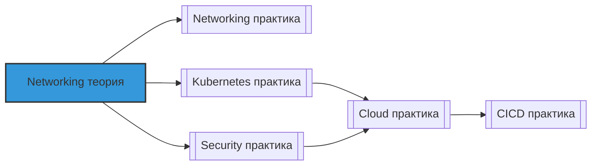

# 📄 Файл: `Networking теория.md`

tags: [networking, theory, devops, osi-model, tcp-ip, dns, http, security, vpc]
aliases: [networking-theory, network-internals, devops-networking-concepts]
created: 2026-05-07
---

# 🧠 Networking для DevOps: Теория и архитектура

> [!INFO] Структура
> Концепции разделены по уровням: 🟢 Junior → 🟡 Middle → 🔴 Senior.  
> Каждая тема содержит: суть, техническое объяснение, DevOps-контекст и связанные инструменты.

📋 [[#🗂️ Оглавление для навигации|Оглавление]] | [[#🧪 Чек-лист понимания|Чек-лист]] | [[#🔗 Связь с другими файлами|Связи]]

---

## 🗂️ Оглавление для навигации

### 🟢 Junior (базовые концепции)
- [[#1. Что такое модель OSI и зачем она нужна?|1. Модель OSI]]
- [[#2. В чём разница между TCP и UDP? Когда что использовать?|2. TCP vs UDP]]
- [[#3. Как работает IP-адресация: IPv4, IPv6, подсети, CIDR?|3. IP-адресация]]
- [[#4. Что такое порт и как он связан с процессом?|4. Порты и сокеты]]
- [[#5. Как работает DNS: рекурсивный запрос, кэширование, типы записей?|5. DNS основы]]
- [[#6. В чём разница между HTTP и HTTPS? Как работает TLS?|6. HTTP vs HTTPS]]
- [[#7. Что такое NAT и зачем он нужен?|7. NAT основы]]
- [[#8. Как работает маршрутизация: таблицы маршрутов, default gateway?|8. Маршрутизация]]
- [[#9. Что такое фаервол и как он фильтрует трафик?|9. Фаерволы основы]]
- [[#10. В чём разница между публичным и приватным IP-адресом?|10. Публичные и приватные IP]]

### 🟡 Middle (протоколы, архитектура, безопасность)
- [[#11. ⭐ Детально: трёхстороннее рукопожатие TCP и управление потоком|11. TCP handshake ⭐]]
- [[#12. Как работает DNS: иерархия, зоны, рекурсия, авторитетные серверы?|12. DNS архитектура]]
- [[#13. ⭐ В чём разница между SNAT, DNAT, Masquerade?|13. NAT типы ⭐]]
- [[#14. Как работает HTTP/2 и HTTP/3: multiplexing, QUIC, приоритизация?|14. HTTP эволюция]]
- [[#15. Алгоритмы балансировки нагрузки: round-robin, least-conn, consistent hash|15. Load balancing алгоритмы]]
- [[#16. Как работает TLS 1.3: handshake, cipher suites, session resumption?|16. TLS internals]]
- [[#17. Что такое VPC и как изолировать сетевые сегменты?|17. VPC основы]]
- [[#18. Как работают Security Groups и Network ACLs в облаках?|18. Cloud security groups]]
- [[#19. В чём разница между stateful и stateless фаерволами?|19. Stateful vs stateless]]
- [[#20. Как работает Path MTU Discovery и зачем он нужен?|20. PMTUD]]

### 🔴 Senior (продвинутая архитектура, облака, enterprise)
- [[#21. ⭐ Как работает BGP: атрибуты, path selection, multi-homing?|21. BGP internals ⭐]]
- [[#22. Архитектура Anycast: как один IP работает в множестве локаций?|22. Anycast]]
- [[#23. ⭐ Спроектировать zero-trust networking: принципы и паттерны|23. Zero-trust архитектура ⭐]]
- [[#24. Как работает service mesh networking: sidecar, mTLS, traffic splitting?|24. Service mesh networking]]
- [[#25. Архитектура гибридного облака: Direct Connect, VPN, Transit Gateway|25. Hybrid cloud networking]]
- [[#26. Как реализовать global server load balancing (GSLB)?|26. GSLB архитектура]]
- [[#27. Продвинутые техники DDoS mitigation: от сети до приложения|27. DDoS mitigation]]
- [[#28. Как работает eBPF для сетевой наблюдаемости и безопасности?|28. eBPF networking]]
- [[#29. Архитектурные паттерны для multi-region приложений|29. Multi-region patterns]]
- [[#30. ⭐ Принципы проектирования отказоустойчивой сетевой инфраструктуры|30. Resilient networking ⭐]]

---

## 🟢 Junior (базовые концепции)

### 1. Что такое модель OSI и зачем она нужна?
**Суть**: Абстрактная 7-уровневая модель для описания сетевых взаимодействий и стандартизации протоколов.

**Подробно**:
```
Уровень 7: Application  — HTTP, DNS, SMTP (данные для приложения)
Уровень 6: Presentation — шифрование, сжатие, кодировка (TLS, JSON)
Уровень 5: Session      — управление сессиями, синхронизация
Уровень 4: Transport    — TCP/UDP, порты, надёжность доставки
Уровень 3: Network      — IP-адресация, маршрутизация, логическая адресация
Уровень 2: Data Link    — MAC-адреса, Ethernet, коммутация, физическая адресация
Уровень 1: Physical     — кабели, сигналы, биты, физическая среда
```

**Ключевые принципы**:
- Каждый уровень предоставляет сервисы вышележащему и использует сервисы нижележащего
- Инкапсуляция: данные оборачиваются заголовками на каждом уровне
- Де-факто используется упрощённая модель TCP/IP (4 уровня)

**DevOps-контекст**: Понимание уровней помогает локализовать проблемы: "не пингуется" → уровень 3, "порт не открывается" → уровень 4, "сертификат не валиден" → уровень 6/7.

**Связанные инструменты**: `tcpdump` (уровни 2-4), `curl -v` (уровень 7), `wireshark` (все уровни).

[[#🗂️ Оглавление для навигации|↑ К оглавлению]]

### 2. В чём разница между TCP и UDP? Когда что использовать?
**Суть**: TCP — надёжный, с установкой соединения; UDP — быстрый, без гарантий доставки.

**Подробно**:
| Характеристика | TCP | UDP |
|---------------|-----|-----|
| **Соединение** | Трёхстороннее рукопожатие (SYN, SYN-ACK, ACK) | Без соединения, "fire and forget" |
| **Надёжность** | Гарантированная доставка, ретрансмиты, ACK | Нет гарантий, пакеты могут теряться |
| **Порядок** | Гарантирует порядок доставки | Порядок не гарантируется |
| **Контроль потока** | Window-based flow control | Нет |
| **Заголовок** | 20-60 байт (сложнее) | 8 байт (минимальный) |
| **Использование** | HTTP, SSH, SMTP, базы данных | DNS, VoIP, видео, игры, мониторинг |

**DevOps-контекст**: 
- TCP для критичных данных: конфигурации, БД, веб-трафик
- UDP для real-time: метрики (StatsD), DNS-запросы, стриминг, где потеря нескольких пакетов допустима

**Связанные инструменты**: `ss -tunap` (просмотр соединений), `tcpdump -i any tcp/udp`.

[[#🗂️ Оглавление для навигации|↑ К оглавлению]]

### 3. Как работает IP-адресация: IPv4, IPv6, подсети, CIDR?
**Суть**: Логическая адресация устройств в сети с иерархической структурой для маршрутизации.

**Подробно**:
```
IPv4:
• Формат: 32 бита, 4 октета (192.168.1.1)
• Диапазон: ~4.3 млрд адресов (исчерпан)
• Приватные диапазоны (RFC 1918):
  - 10.0.0.0/8 (16M адресов)
  - 172.16.0.0/12 (1M адресов)
  - 192.168.0.0/16 (65K адресов)

CIDR (Classless Inter-Domain Routing):
• Запись: 192.168.1.0/24
• /24 = 24 бита сеть, 8 бит хосты = 256 адресов (254 полезных)
• Формула: количество хостов = 2^(32-префикс) - 2 (сеть + броадкаст)

IPv6:
• Формат: 128 бит, 8 групп по 4 шестнадцатеричных цифры
• Пример: 2001:0db8:85a3::8a2e:0370:7334
• Преимущества: огромное адресное пространство, упрощённый заголовок, встроенный IPsec

Подсети (subnetting):
• Деление крупной сети на меньшие для изоляции и эффективности
• Пример: 10.0.0.0/16 → 10.0.1.0/24, 10.0.2.0/24, ...
```

**DevOps-контекст**: Правильное планирование CIDR критично для VPC в облаках: оставить место для роста, избежать перекрытия с on-prem сетями.

**Связанные инструменты**: `ipcalc`, `sipcalc`, `ip addr show`, облачные калькуляторы CIDR.

[[#🗂️ Оглавление для навигации|↑ К оглавлению]]

### 4. Что такое порт и как он связан с процессом?
**Суть**: 16-битное число (0-65535), идентифицирующее конкретный сервис на хосте.

**Подробно**:
```
Диапазоны портов:
• 0-1023: Well-known ports (требуют root): 80/HTTP, 443/HTTPS, 22/SSH
• 1024-49151: Registered ports (приложения): 8080, 3306/MySQL, 5432/PostgreSQL
• 49152-65535: Dynamic/ephemeral ports (клиентские соединения)

Сокет = (IP-адрес, порт, протокол)
• Уникально идентифицирует соединение: (192.168.1.10:443, TCP)
• Один процесс может слушать несколько портов
• Несколько процессов не могут слушать один порт на одном IP (кроме SO_REUSEPORT)

Эфемерные порты:
• Клиент при подключении получает случайный порт из диапазона
• Сервер видит соединение как (клиент-IP:эфемерный-порт → сервер-IP:сервис-порт)
```

**DevOps-контекст**: Понимание портов критично для настройки фаерволов, балансировщиков, service discovery. Конфликт портов — частая причина падения деплоя.

**Связанные инструменты**: `ss -tlnp`, `lsof -i :8080`, `/etc/services`.

[[#🗂️ Оглавление для навигации|↑ К оглавлению]]

### 5. Как работает DNS: рекурсивный запрос, кэширование, типы записей?
**Суть**: Распределённая иерархическая система преобразования имён доменов в IP-адреса.

**Подробно**:
```
Иерархия DNS:
. (root) → com./org./net. → example.com. → www.example.com

Типы запросов:
• Рекурсивный: клиент → резолвер → резолвер делает всю работу, возвращает ответ
• Итеративный: резолвер → root → TLD → авторитетный, получает референсы

Типы записей:
• A: IPv4 адрес (example.com → 93.184.216.34)
• AAAA: IPv6 адрес
• CNAME: алиас (www.example.com → example.com)
• MX: почтовый сервер (priority + hostname)
• TXT: произвольный текст (SPF, DKIM, верификация)
• NS: авторитетные серверы для зоны
• SOA: start of authority (мета-информация о зоне)

Кэширование:
• TTL (Time To Live) в секундах определяет, как долго кэшировать запись
• Резолверы, ОС, приложения — все могут кэшировать
• После изменения записи ждать истечения старого TTL
```

**DevOps-контекст**: Понимание TTL и propagation критично для миграций: менять DNS заранее, мониторить, иметь план отката.

**Связанные инструменты**: `dig`, `nslookup`, `host`, `resolvectl`.

[[#🗂️ Оглавление для навигации|↑ К оглавлению]]

### 6. В чём разница между HTTP и HTTPS? Как работает TLS?
**Суть**: HTTPS = HTTP поверх TLS — шифрование, аутентификация, целостность данных.

**Подробно**:
```
HTTP (порт 80):
• Текст в открытом виде
• Нет аутентификации сервера
• Уязвим для MITM-атак, сниффинга

HTTPS (порт 443) = HTTP + TLS:
• Шифрование: симметричный ключ для данных (AES, ChaCha20)
• Аутентификация: сертификат сервера, проверка цепочки доверия
• Целостность: MAC/HMAC для детекции изменений

TLS 1.3 handshake (упрощённо):
1. ClientHello: поддерживаемые версии, cipher suites, random
2. ServerHello: выбранная версия, cipher suite, сертификат, random
3. Key exchange: ECDHE для forward secrecy
4. Finished: подтверждение, начало шифрованного обмена

Преимущества TLS 1.3:
• Меньше раундов (1-RTT, 0-RTT для ресумпшена)
• Убраны устаревшие алгоритмы (RSA key exchange, SHA-1, RC4)
• Обязательный forward secrecy
```

**DevOps-контекст**: HTTPS обязателен для любого продакшена. Автоматизируйте получение/обновление сертификатов (Let's Encrypt + certbot). Мониторьте expiry.

**Связанные инструменты**: `openssl s_client`, `curl -v`, `certbot`, `ssllabs.com` для тестов.

[[#🗂️ Оглавление для навигации|↑ К оглавлению]]

### 7. Что такое NAT и зачем он нужен?
**Суть**: Network Address Translation — трансляция адресов для экономии IPv4 и изоляции сетей.

**Подробно**:
```
Проблема, которую решает NAT:
• IPv4 адресов не хватает для всех устройств
• Приватные сети (10.0.0.0/8 и др.) не маршрутизируются в интернете
• Нужно скрыть внутреннюю топологию от внешнего мира

Как работает:
• Внутренний хост (192.168.1.10:5000) → шлюз с публичным IP (203.0.113.1)
• Шлюз заменяет source IP:порт на свой + новый порт (203.0.113.1:60000)
• Ведёт таблицу трансляций: (внутренний:порт ↔ внешний:порт)
• Ответ приходит на 203.0.113.1:60000 → шлюз находит запись → пересылает внутрь

Типы (подробнее в вопросе 13):
• SNAT: изменение source для исходящего трафика
• DNAT: изменение destination для входящего (порт-форвардинг)
• Masquerade: SNAT для динамических внешних IP
```

**DevOps-контекст**: NAT критичен для Kubernetes (pod'ы с приватными IP выходят в интернет), облачных VPC, домашней инфраструктуры.

**Связанные инструменты**: `iptables -t nat -L`, `conntrack -L`, `tcpdump`.

[[#🗂️ Оглавление для навигации|↑ К оглавлению]]

### 8. Как работает маршрутизация: таблицы маршрутов, default gateway?
**Суть**: Процесс определения следующего хопа для пакета на основе таблицы маршрутов.

**Подробно**:
```
Таблица маршрутов (пример):
```
Destination     Gateway         Genmask         Flags   Iface
0.0.0.0         192.168.1.1     0.0.0.0         UG      eth0
10.0.0.0        0.0.0.0         255.255.0.0     U       eth1
192.168.1.0     0.0.0.0         255.255.255.0   U       eth0
```

Принципы выбора маршрута:
1. Longest prefix match: более специфичный маршрут приоритетнее
   • Для 10.0.1.5: подойдёт 10.0.0.0/16, но не 0.0.0.0/0
2. Default gateway (0.0.0.0/0): маршрут по умолчанию для всего остального
3. Metric: если несколько маршрутов одинаковой специфичности — выбирается с меньшим metric

Процесс маршрутизации:
• Хост получает пакет → смотрит destination IP
• Ищет наиболее специфичный матч в таблице
• Отправляет пакет на интерфейс, указанный в маршруте
• Если нужен шлюз — отправляет шлюзу (через ARP для L2-адреса)

**DevOps-контекст**: В Kubernetes CNI-плагины управляют маршрутами для pod-сети. Понимание маршрутизации помогает отлаживать cross-node коммуникацию.

**Связанные инструменты**: `ip route show`, `ip route get <ip>`, `traceroute`.

[[#🗂️ Оглавление для навигации|↑ К оглавлению]]

### 9. Что такое фаервол и как он фильтрует трафик?
**Суть**: Система контроля сетевого трафика на основе правил (разрешить/запретить).

**Подробно**:
```
Типы фаерволов:
1. Пакетные фильтры (уровень 3-4):
   • Смотрят на заголовки: IP, порт, протокол, флаги
   • Быстрые, но не видят содержимое
   • Пример: iptables, nftables

2. Stateful фаерволы:
   • Отслеживают состояние соединений (NEW, ESTABLISHED, RELATED)
   • Автоматически разрешают ответы на исходящие запросы
   • Пример: iptables с модулем conntrack

3. Application-level (прокси):
   • Анализируют содержимое пакетов (HTTP-заголовки, payload)
   • Могут блокировать по сигнатурам, поведению
   • Пример: WAF (ModSecurity), NGINX с Lua

Порядок обработки правил:
• Правила обрабатываются последовательно сверху вниз
• Первое совпадение применяется, остальные игнорируются
• Default policy: что делать, если ни одно правило не сработало (ACCEPT/DROP)

Цепочки в iptables:
• INPUT: входящие пакеты для этого хоста
• OUTPUT: исходящие пакеты от этого хоста
• FORWARD: пакеты, проходящие через хост (роутинг)
• PREROUTING/POSTROUTING: для NAT (таблица nat)
```

**DevOps-контекст**: Принцип least privilege: по умолчанию запрещать всё, разрешать только необходимый трафик. Автоматизировать правила через IaC.

**Связанные инструменты**: `iptables`, `nft`, `ufw`, облачные Security Groups.

[[#🗂️ Оглавление для навигации|↑ К оглавлению]]

### 10. В чём разница между публичным и приватным IP-адресом?
**Суть**: Публичные адреса маршрутизируются в интернете, приватные — только внутри локальной сети.

**Подробно**:
```
Приватные диапазоны (RFC 1918):
• 10.0.0.0/8 (10.0.0.0 – 10.255.255.255) — 16,777,216 адресов
• 172.16.0.0/12 (172.16.0.0 – 172.31.255.255) — 1,048,576 адресов
• 192.168.0.0/16 (192.168.0.0 – 192.168.255.255) — 65,536 адресов

Дополнительные специальные диапазоны:
• 127.0.0.0/8 — loopback (localhost)
• 169.254.0.0/16 — link-local (APIPA, когда нет DHCP)
• 224.0.0.0/4 — multicast

Почему приватные адреса:
• Экономия дефицитных публичных IPv4
• Безопасность: внутренняя топология скрыта от интернета
• Гибкость: можно использовать одни и те же подсети в разных организациях

Как приватные хосты выходят в интернет:
• Через NAT на шлюзе: приватный источник → публичный адрес шлюза
• Шлюз ведёт таблицу трансляций для возврата трафика
```

**DevOps-контекст**: В облаках инстансы в private subnet не имеют публичных IP — доступ только через NAT Gateway, bastion host, или VPC endpoints.

**Связанные инструменты**: `ip addr show`, `curl ifconfig.me` (узнать свой публичный IP).

[[#🗂️ Оглавление для навигации|↑ К оглавлению]]

---

## 🟡 Middle (протоколы, архитектура, безопасность)

### 11. ⭐ Детально: трёхстороннее рукопожатие TCP и управление потоком
**Суть**: Механизм установки надёжного соединения и контроля скорости передачи данных.

**Подробно**:
```
TCP Three-Way Handshake:
```
Клиент (C)                          Сервер (S)
    |                                    |
    |--- SYN (seq=x) ------------------>|  1. Клиент инициирует
    |                                    |
    |<-- SYN-ACK (seq=y, ack=x+1) ------|  2. Сервер подтверждает, инициирует в ответ
    |                                    |
    |--- ACK (seq=x+1, ack=y+1) ------>|  3. Клиент подтверждает — соединение установлено
    |                                    |
    |<== Данные передаются в обе стороны ==>|
```

Ключевые поля заголовка:
• Sequence number (seq): номер первого байта в сегменте
• Acknowledgment number (ack): следующий ожидаемый байт (подтверждение получения)
• Flags: SYN, ACK, FIN, RST, PSH, URG

Управление потоком (Flow Control):
• Receiver advertises window size: "могу принять ещё N байт"
• Sender не отправляет больше, чем позволяет окно
• Предотвращает переполнение буфера получателя

Управление перегрузкой (Congestion Control):
• Slow Start: экспоненциальный рост окна до потери пакета
• Congestion Avoidance: линейный рост после достижения порога
• При потере: уменьшение окна (TCP Reno/CUBIC/BBR алгоритмы)

**DevOps-контекст**: Понимание handshake помогает отлаживать таймауты соединений. Рост ретрансмитов = признак проблем с сетью или перегрузки.

**Мониторинг**:
```bash
# Статистика по ретрансмитам
nstat -az | grep -i retrans
# Детали по соединениям
ss -tin | grep -E "retrans|cwnd|rtt"
```

[[#🗂️ Оглавление для навигации|↑ К оглавлению]]

### 12. Как работает DNS: иерархия, зоны, рекурсия, авторитетные серверы?
**Суть**: Распределённая база данных с делегированием ответственности за зоны.

**Подробно**:
```
Иерархия и делегирование:
```
. (root servers, 13 кластеров)
│
├─ com. (TLD servers)
│   │
│   ├─ example.com. (authoritative nameservers: ns1.example.com, ns2.example.com)
│   │   │
│   │   ├─ www.example.com. → A: 93.184.216.34
│   │   ├─ mail.example.com. → MX: 10 mail.example.com
│   │   └─ _dmarc.example.com. → TXT: "v=DMARC1; ..."
│   │
│   └─ another.com. → другие авторитетные серверы
│
└─ org., net., ru., etc.
```

Типы серверов:
• Root: знают адреса TLD-серверов (13 логических, сотни физических)
• TLD: знают авторитетные серверы для доменов второго уровня
• Authoritative: хранят записи для конкретной зоны, отвечают авторитетно
• Recursive resolver: выполняет всю работу за клиента, кэширует ответы

Процесс рекурсивного запроса:
```
1. Клиент → резолвер: "Какой IP у www.example.com?"
2. Резолвер (если нет в кэше):
   а) Запрашивает root: "Где com.?"
   б) Root отвечает: "com. на серверах 192.41.162.30, ..."
   в) Запрашивает TLD com.: "Где example.com.?"
   г) TLD отвечает: "example.com. на ns1.example.com (93.184.216.1)"
   д) Запрашивает авторитетный: "Какой A для www.example.com.?"
   е) Авторитетный отвечает: "93.184.216.34"
3. Резолвер кэширует с учётом TTL, возвращает клиенту
```

**DevOps-контекст**: При миграции меняйте записи на авторитетных серверах, учитывайте кэширование на всех уровнях. Используйте низкий TTL перед миграцией.

**Связанные инструменты**: `dig +trace`, `whois`, `dnsrecon`.

[[#🗂️ Оглавление для навигации|↑ К оглавлению]]

### 13. ⭐ В чём разница между SNAT, DNAT, Masquerade?
**Суть**: Разные типы трансляции адресов для разных сценариев маршрутизации.

**Подробно**:
```
SNAT (Source NAT):
• Меняет source IP/порт исходящих пакетов
• Use case: хосты в приватной сети выходят в интернет
• Пример: 192.168.1.10:5000 → 203.0.113.1:60000
• iptables: -j SNAT --to-source 203.0.113.1
• Требует статический внешний адрес

DNAT (Destination NAT):
• Меняет destination IP/порт входящих пакетов
• Use case: порт-форвардинг, доступ к внутренним сервисам извне
• Пример: 203.0.113.1:80 → 192.168.1.10:8080
• iptables: -j DNAT --to-destination 192.168.1.10:8080
• Используется в PREROUTING цепочке

Masquerade:
• Частный случай SNAT для динамических внешних адресов (DHCP, мобильные сети)
• Автоматически подставляет текущий внешний адрес интерфейса
• Немного медленнее SNAT (определяет адрес для каждого пакета)
• iptables: -j MASQUERADE
• Use case: домашние роутеры, cloud instances с ephemeral public IP

Таблица сравнения:
┌─────────────┬─────────────────┬─────────────────┬─────────────────┐
│ Тип         │ Направление     │ Когда использовать │ Пример сценария │
├─────────────┼─────────────────┼─────────────────┼─────────────────┤
│ SNAT        │ Исходящий       │ Статический внешний IP │ ВМ в private subnet → интернет │
│ DNAT        │ Входящий        │ Доступ к внутреннему сервису │ Интернет → сервис в Kubernetes │
│ Masquerade  │ Исходящий       │ Динамический внешний IP │ Ноутбук через Wi-Fi, EC2 с ephemeral IP │
└─────────────┴─────────────────┴─────────────────┴─────────────────┘
```

**DevOps-контекст**: В Kubernetes kube-proxy использует iptables/ipvs для реализации Service — это комбинация DNAT (входящий трафик на ClusterIP → pod IP) и иногда SNAT (для externalTrafficPolicy=Local).

**Проверка**:
```bash
# Посмотреть активные трансляции
conntrack -L | grep -i nat
# Или через iptables с подсчётом пакетов
iptables -t nat -L -n -v
```

[[#🗂️ Оглавление для навигации|↑ К оглавлению]]

### 14. Как работает HTTP/2 и HTTP/3: multiplexing, QUIC, приоритизация?
**Суть**: Эволюция протокола для снижения задержек и повышения эффективности.

**Подробно**:
```
HTTP/1.1 проблемы:
• Один запрос на соединение в момент времени (без pipelining)
• Head-of-line blocking: медленный запрос блокирует остальные
• Множественные соединения для параллелизма → overhead

HTTP/2 решения (поверх того же TCP):
• Multiplexing: множество запросов/ответов в одном соединении, независимые стримы
• Header compression (HPACK): сжатие повторяющихся заголовков
• Server push: сервер может отправить ресурсы до того, как клиент запросит
• Binary protocol: более эффективный парсинг, чем текстовый

HTTP/3 решения (поверх QUIC/UDP):
• QUIC = UDP + TLS 1.3 + reliability + congestion control
• Устраняет HOL blocking на транспортном уровне: потеря пакета влияет только на один стрим
• 0-RTT connection resumption: повторное соединение без handshake
• Connection migration: можно сменить IP без разрыва соединения (мобильные устройства)
• Встроенное шифрование: весь заголовок, включая метаданные, зашифрован

Приоритизация (HTTP/2):
• Клиент может указать приоритет стримов
• Сервер использует это для планирования отправки
• Не гарантирует порядок, но помогает оптимизировать загрузку страницы

**DevOps-контекст**: Включение HTTP/2/3 в балансировщиках (nginx, ALB) даёт заметный прирост производительности для веб-приложений. Но требует TLS.

**Проверка**:
```bash
# Проверить поддержку протоколов
curl -I --http2 https://example.com
curl -I --http3 https://example.com  # если клиент поддерживает

# Увидеть используемый протокол в заголовках ответа
curl -v https://example.com 2>&1 | grep -i "http\/"
```

[[#🗂️ Оглавление для навигации|↑ К оглавлению]]

### 15. Алгоритмы балансировки нагрузки: round-robin, least-conn, consistent hash
**Суть**: Стратегии распределения трафика между бэкендами для оптимизации производительности и доступности.

**Подробно**:
```
Основные алгоритмы:

1. Round Robin:
   • Запросы по очереди: сервер 1 → 2 → 3 → 1 → ...
   • Простой, справедливый, но не учитывает загрузку
   • Use case: однородные серверы, статические запросы

2. Weighted Round Robin:
   • Как round-robin, но с весами: сервер с весом 2 получает в 2× больше запросов
   • Use case: серверы разной мощности

3. Least Connections:
   • Запрос идёт на сервер с наименьшим числом активных соединений
   • Учитывает текущую загрузку, лучше для long-lived соединений
   • Use case: WebSocket, базы данных, API с переменной длительностью

4. Least Response Time:
   • Комбинация наименьшего времени ответа и наименьшего числа соединений
   • Динамически адаптируется к деградации бэкендов
   • Use case: критичные к latency приложения

5. IP Hash / Source Hash:
   • Хеш от источника → детерминированный выбор сервера
   • Обеспечивает sticky sessions без cookies
   • Use case: когда сессия должна оставаться на одном сервере

6. Consistent Hashing:
   • Хеш от ключа (например, user_id) → сервер в кольце
   • При добавлении/удалении сервера перераспределяется минимум ключей
   • Use case: распределённые кэши (Redis), шардированные БД

Health checks интеграция:
• Балансировщик периодически проверяет бэкенды
• Неисправные исключаются из ротации до восстановления
• Важно настраивать адекватные интервалы и пороги (не слишком чувствительные)

**DevOps-контекст**: Выбор алгоритма влияет на производительность и отказоустойчивость. Для stateful-сервисов (сессии, кэш) используйте sticky sessions или consistent hashing.

**Пример (HAProxy)**:
```haproxy
backend app
    balance leastconn  # или roundrobin, source, uri
    option httpchk GET /health
    server s1 10.0.0.1:8080 check weight 1
    server s2 10.0.0.2:8080 check weight 2  # получит в 2× больше трафика
```

[[#🗂️ Оглавление для навигации|↑ К оглавлению]]

### 16. Как работает TLS 1.3: handshake, cipher suites, session resumption?
**Суть**: Современный протокол шифрования с улучшенной безопасностью и производительностью.

**Подробно**:
```
TLS 1.3 Handshake (1-RTT):
```
Клиент                          Сервер
   |                               |
   |--- ClientHello ------------->|  • Поддерживаемые версии
   |   • supported_versions       |  • Cipher suites (только безопасные)
   |   • key_share (ECDHE public) |  • key_share (серверный public)
   |   • random                   |  • random
   |                               |
   |<-- ServerHello -------------|  • Выбранная версия, cipher
   |    • key_share (server)     |  • Сертификат
   |    • certificate            |  • CertificateVerify (подпись)
   |    • Finished (MAC)         |  • Finished (MAC)
   |                               |
   |--- Finished ---------------->|  • Подтверждение, начало шифрования
   |                               |
   |<== Зашифрованные данные ==>|
```

Ключевые улучшения в TLS 1.3:
• Убраны небезопасные алгоритмы: RSA key exchange, SHA-1, RC4, CBC-режимы
• Обязательный forward secrecy: ECDHE для каждого соединения
• 0-RTT resumption: повторное соединение без handshake (с риском replay-атак)
• Зашифрованный handshake: больше метаданных скрыто от наблюдателя

Cipher suite формат (TLS 1.3):
```
TLS_AES_256_GCM_SHA384
│    │     │    │
│    │     │    └─ HMAC/hash для ключей
│    │     └─ режим шифрования (GCM = authenticated encryption)
│    └─ ключ шифрования (256-бит)
└─ протокол
```

Session resumption:
• Session tickets: сервер шифрует состояние сессии, клиент хранит, предъявляет при повторном подключении
• PSK (Pre-Shared Key): ключ, согласованный в предыдущей сессии, используется для 0-RTT
• Важно: 0-RTT данные уязвимы к replay — не использовать для неидемпотентных операций

**DevOps-контекст**: Принудительно используйте TLS 1.3 в production. Отключайте устаревшие версии и cipher suites. Мониторьте expiry сертификатов и автоматизируйте ротацию.

**Проверка**:
```bash
# Проверить поддерживаемые версии и cipher suites
openssl s_client -connect example.com:443 -tls1_3 </dev/null 2>&1 | grep -i "protocol\|cipher"

# Увидеть детали рукопожатия
openssl s_client -connect example.com:443 -debug </dev/null 2>&1 | grep -A5 "SSL handshake"
```

[[#🗂️ Оглавление для навигации|↑ К оглавлению]]

### 17. Что такое VPC и как изолировать сетевые сегменты?
**Суть**: Virtual Private Cloud — логически изолированная сеть в облаке с контролем над топологией и безопасностью.

**Подробно**:
```
Компоненты VPC (на примере AWS):
```
VPC (10.0.0.0/16)
├── Subnets:
│   ├── Public (10.0.1.0/24): с route to Internet Gateway
│   ├── Private (10.0.10.0/24): без прямого доступа в интернет
│   └── Data (10.0.20.0/24): изолированная, только для БД
│
├── Gateways:
│   ├── Internet Gateway: выход в интернет для public subnet
│   ├── NAT Gateway: исходящий интернет для private subnet
│   └── VPC Endpoints: приватный доступ к AWS сервисам (S3, DynamoDB)
│
├── Route Tables:
│   ├── Public: 0.0.0.0/0 → igw-xxx
│   ├── Private: 0.0.0.0/0 → nat-xxx
│   └── Data: только локальные маршруты
│
└── Security:
    ├── Security Groups: stateful, на уровне инстанса
    └── NACLs: stateless, на уровне подсети
```

Принципы изоляции:
• Разделение по функциям: public (входная точка), private (бизнес-логика), data (хранение)
• Least privilege: разрешать только необходимый трафик между слоями
• Multi-AZ: подсети в разных зонах доступности для отказоустойчивости

**DevOps-контекст**: Правильная структура VPC — основа безопасности и масштабируемости. Автоматизируйте создание через Terraform/CloudFormation.

**Связанные инструменты**: `aws ec2 describe-vpcs`, Terraform модули `terraform-aws-modules/vpc`.

[[#🗂️ Оглавление для навигации|↑ К оглавлению]]

### 18. Как работают Security Groups и Network ACLs в облаках?
**Суть**: Два уровня фаервола в облаках: stateful на уровне инстанса, stateless на уровне подсети.

**Подробно**:
```
Security Groups (stateful):
• Применяются к инстансам (или интерфейсам)
• Правила только разрешающие (allow), неявный deny-all
• Stateful: если разрешён исходящий, ответный входящий разрешён автоматически
• Пример правила:
  ```
  Type: SSH, Protocol: TCP, Port: 22, Source: 10.0.0.0/16
  ```
• Можно ссылаться на другие SG: "разрешить от sg-app к sg-db"

Network ACLs (stateless):
• Применяются к подсетям
• Правила и разрешающие, и запрещающие (с приоритетом по номеру)
• Stateless: нужно явно разрешать и входящий, и ответный трафик
• Пример:
  ```
  #100: ALLOW TCP 80 FROM 0.0.0.0/0 (входящий)
  #101: ALLOW TCP 1024-65535 TO 0.0.0.0/0 (исходящий для ответов)
  ```
• Используются как дополнительный слой защиты или для грубой фильтрации

Сравнение:
┌─────────────────┬─────────────────────┬─────────────────────┐
│ Характеристика  │ Security Groups     │ Network ACLs        │
├─────────────────┼─────────────────────┼─────────────────────┤
│ Уровень         │ Инстанс/интерфейс   │ Подсеть             │
│ Состояние       │ Stateful            │ Stateless           │
│ Правила         │ Только allow        │ Allow + deny        │
│ Приоритет       │ Все правила оцениваются │ По номеру (меньше = выше) │
│ Использование   │ Основной фаервол    │ Дополнительный слой │
└─────────────────┴─────────────────────┴─────────────────────┘

**DevOps-контекст**: Используйте SG как основной механизм контроля доступа. NACLs — для экстренного блокирования подсети или как "последний рубеж".

**Проверка**:
```bash
# AWS CLI: посмотреть SG правила
aws ec2 describe-security-groups --group-ids sg-xxx

# Проверить, какие правила применяются к инстансу
aws ec2 describe-instances --instance-ids i-xxx \
  --query 'Reservations[0].Instances[0].SecurityGroups'
```

[[#🗂️ Оглавление для навигации|↑ К оглавлению]]

### 19. В чём разница между stateful и stateless фаерволами?
**Суть**: Stateful отслеживает состояние соединений, stateless фильтрует каждый пакет независимо.

**Подробно**:
```
Stateless фаервол:
• Анализирует каждый пакет отдельно: заголовки (IP, порт, протокол)
• Не "помнит" предыдущие пакеты соединения
• Требует явных правил для обоих направлений:
  ```
  # Разрешить исходящий веб-запрос
  ALLOW TCP 80 FROM 10.0.0.0/24 TO 0.0.0.0/0
  # И отдельно — разрешить ответы
  ALLOW TCP 1024-65535 FROM 0.0.0.0/0 TO 10.0.0.0/24 ESTABLISHED
  ```
• Быстрее, проще, но менее гибкий
• Пример: iptables без модуля conntrack, NACLs в облаках

Stateful фаервол:
• Ведёт таблицу состояний соединений (conntrack)
• Автоматически разрешает ответный трафик для установленных соединений
• Понимает контекст: NEW, ESTABLISHED, RELATED, INVALID
• Пример правила:
  ```
  # Разрешить исходящие, ответы разрешатся автоматически
  iptables -A OUTPUT -p tcp --dport 443 -m state --state NEW,ESTABLISHED -j ACCEPT
  iptables -A INPUT -m state --state ESTABLISHED,RELATED -j ACCEPT
  ```
• Умнее, безопаснее, но требует больше памяти для таблицы состояний
• Пример: iptables с conntrack, cloud Security Groups, enterprise фаерволы

**DevOps-контекст**: Stateful фаерволы — стандарт для большинства сценариев. Stateless могут быть полезны для high-throughput фильтрации или как дополнительный слой.

**Проверка**:
```bash
# Посмотреть таблицу состояний в Linux
conntrack -L | head -20
# Или через /proc
cat /proc/net/nf_conntrack | head -10
```

[[#🗂️ Оглавление для навигации|↑ К оглавлению]]

### 20. Как работает Path MTU Discovery и зачем он нужен?
**Суть**: Механизм определения максимального размера пакета, который может пройти по пути без фрагментации.

**Подробно**:
```
Проблема:
• Каждый сетевой интерфейс имеет MTU (Maximum Transmission Unit)
• Стандартный Ethernet: 1500 байт (включая заголовки)
• Если пакет > MTU на каком-то ходе: нужно фрагментировать или отбросить

PMTUD (Path MTU Discovery):
1. Отправитель ставит флаг "Don't Fragment" (DF) в IP-заголовке
2. Если пакет > MTU на каком-то маршрутизаторе:
   • Маршрутизатор отбрасывает пакет
   • Отправляет обратно ICMP "Fragmentation Needed" с указанием нового MTU
3. Отправитель уменьшает размер пакета и повторяет
4. Процесс продолжается, пока пакет не дойдёт

Проблемы с PMTUD:
• Если ICMP блокируется фаерволом: отправитель не получает "Fragmentation needed"
• Пакеты теряются молча → таймауты, ретрансмиты, деградация производительности
• Особенно критично для туннелей (VXLAN, IPsec, WireGuard): overhead уменьшает эффективный MTU

Решения:
• Не блокировать ICMP "Fragmentation needed" (тип 3, код 4)
• Уменьшить MTU на концах туннеля: 1500 - overhead (VXLAN: ~50 байт)
• Использовать TCP MSS clamping: ограничить размер сегмента на уровне handshake

**DevOps-контекст**: В overlay-сетях (Kubernetes CNI, VPN) PMTUD проблемы — частая причина "тихих" потерь пакетов. Всегда настраивайте MTU с учётом overhead.

**Проверка**:
```bash
# Протестировать максимальный размер без фрагментации
ping -M do -s 1472 10.0.0.5  # 1472 + 28 = 1500 MTU
# Если не проходит:
ping -M do -s 1400 10.0.0.5  # попробовать меньше

# Проверить текущий MTU интерфейса
ip link show eth0 | grep mtu
```

[[#🗂️ Оглавление для навигации|↑ К оглавлению]]

---

## 🔴 Senior (продвинутая архитектура, облака, enterprise)

### 21. ⭐ Как работает BGP: атрибуты, path selection, multi-homing?
**Суть**: Border Gateway Protocol — протокол маршрутизации между автономными системами (интернет-провайдерами, крупными сетями).

**Подробно**:
```
BGP основы:
• Path-vector протокол: объявляет не просто "достигнимо", а "через какие AS"
• Использует TCP/179 для надёжной доставки обновлений
• Медленная конвергенция (минуты) — стабильность важнее скорости

Ключевые атрибуты (в порядке влияния на выбор пути):
1. Weight (локальный, только на роутере): выше = лучше
2. Local Preference: внутри AS, выше = лучше (по умолчанию 100)
3. AS-Path: короче = лучше (избегание петель, предпочтение прямых путей)
4. Origin: IGP < EGP < Incomplete (предпочтение внутренним маршрутам)
5. MED (Multi-Exit Discriminator): подсказка соседней AS, ниже = лучше
6. eBGP > iBGP: предпочтение внешних путей внутренним
7. IGP metric до next-hop: ближе = лучше

Процесс выбора пути (упрощённо):
```
Получил несколько путей к 8.8.8.0/24:
1. Отбросить невалидные (не пройденные политики)
2. Выбрать с наивысшим Weight (локальная настройка)
3. → наивысшим Local Pref (внутри AS)
4. → локально сгенерированные (через network/aggregate)
5. → кратчайший AS-Path
6. → самый низкий Origin type
7. → самый низкий MED
8. → eBGP предпочесть iBGP
9. → ближайший next-hop по IGP metric
10. → oldest path (стабильность)
11. → наименьший router ID соседа
12. → наименьший адрес соседа
```

Multi-homing:
• Подключение к нескольким провайдерам для отказоустойчивости
• Требуется собственный AS номер и публичные префиксы
• Настройка BGP с каждым провайдером: объявление своих префиксов, приём full/partial/default таблиц
• Важно: фильтровать входящие маршруты (prevent hijacking), ограничивать исходящие (prevent leaks)

**DevOps-контекст**: BGP критичен для глобальных приложений, CDN, multi-cloud архитектур. Ошибки в BGP-конфигурации могут "уронить" доступность для миллионов пользователей.

**Мониторинг**:
```bash
# На Cisco/Juniper роутерах
show ip bgp 8.8.8.0/24
show bgp neighbors x.x.x.x advertised-routes

# Публичные looking glass для отладки
# https://lg.he.net/, https://bgp.tools/
```

[[#🗂️ Оглавление для навигации|↑ К оглавлению]]

### 22. Архитектура Anycast: как один IP работает в множестве локаций?
**Суть**: Сетевая техника, при которой один IP-адрес объявляется из множества географических точек, трафик идёт к ближайшей.

**Подробно**:
```
Как работает Anycast:
```
1. Один и тот же префикс (например, 1.1.1.1/32) объявляется через BGP из множества точек присутствия (PoP)
2. Маршрутизаторы в интернете видят несколько путей к 1.1.1.1
3. BGP path selection выбирает "лучший" путь (обычно кратчайший AS-path, ближайший по IGP)
4. Трафик пользователя автоматически направляется к ближайшему (по сетевой метрике) анонсирующему узлу
5. Если узел падает — BGP отзывает маршрут, трафик перетекает к следующему ближайшему

Преимущества:
• Низкая задержка: пользователь попадает на ближайший узел
• Отказоустойчивость: автоматический failover на уровне маршрутизации
• Распределение нагрузки: трафик естественно балансируется по географии
• DDoS-резистентность: атака распределяется по множеству узлов

Ограничения:
• Не подходит для stateful-приложений без дополнительной синхронизации
• Гео-маршрутизация не всегда совпадает с географической близостью
• Требует контроля над BGP-анонсами (собственный AS или договор с провайдерами)

Использование:
• DNS: Cloudflare (1.1.1.1), Google DNS (8.8.8.8), root servers
• CDN: edge-ноды с anycast для статического контента
• DDoS mitigation: распределение атаки по сети scrubbing-центров

**DevOps-контекст**: Anycast — мощный инструмент для глобальной доступности, но требует понимания BGP и координации с провайдерами. Для stateful-сервисов комбинируйте с geo-DNS и репликацией данных.

**Проверка**:
```bash
# Увидеть, к какому узлу anycast вы подключаетесь
traceroute 1.1.1.1
# Или посмотреть, откуда приходит ответ
curl -s https://1.1.1.1/cdn-cgi/trace | grep loc
```

[[#🗂️ Оглавление для навигации|↑ К оглавлению]]

### 23. ⭐ Спроектировать zero-trust networking: принципы и паттерны
**Суть**: Архитектурный подход "никому не доверяй, проверяй каждый запрос", независимо от расположения в сети.

**Подробно**:
```
Принципы zero-trust:
1. Явная верификация: аутентифицировать и авторизовывать каждый запрос
2. Least privilege access: минимальные права, JIT (just-in-time), JEA (just-enough-access)
3. Assume breach: проектировать с допущением, что периметр уже скомпрометирован

Архитектурные паттерны:

Паттерн 1: Identity-aware proxy
```
Пользователь → Identity Proxy (аутентификация) → Внутренний сервис
• Прокси проверяет токен/сертификат перед проксированием
• Сервис не знает о пользователе, только о прокси
• Пример: OAuth2 proxy, Cloudflare Access, BeyondCorp

Паттерн 2: mTLS service-to-service
```
Сервис A ←→ mTLS ←→ Сервис B
• Взаимная аутентификация через сертификаты
• Каждый сервис имеет identity (SPIFFE ID: spiffe://cluster/ns/prod/sa/api)
• Авторизация на уровне identity, а не IP
• Пример: Istio, Linkerd, Consul Connect

Паттерн 3: Micro-segmentation
```
Каждый сервис/под в изолированном сегменте
• Network Policies разрешают только явные коммуникации
• Даже внутри кластера: pod A не может говорить с pod B без правила
• Пример: Kubernetes Network Policies, Calico, Cilium

Паттерн 4: Continuous verification
```
Аутентификация не только при входе, но и в процессе сессии
• Переоценка контекста: устройство, местоположение, поведение
• Автоматическое понижение прав при аномалиях
• Пример: адаптивная MFA, behavioral analytics

Ключевые технологии:
• SPIFFE/SPIRE: стандарт для identity в распределённых системах
• OPA/Rego: policy as code для авторизации
• eBPF: наблюдаемость и контроль на уровне ядра без агентов

**DevOps-контекст**: Zero-trust — не продукт, а процесс. Начинайте с инвентаризации трафика, внедрения mTLS для критичных сервисов, постепенного ужесточения политик.

**Чек-лист внедрения**:
- [ ] Инвентаризация: кто с кем общается сейчас?
- [ ] Identity: каждый сервис имеет уникальный идентификатор
- [ ] Шифрование: весь трафик в транзите (mTLS)
- [ ] Авторизация: политики на уровне identity, а не сети
- [ ] Аудит: логирование всех решений доступа
- [ ] Автоматизация: policy as code, CI/CD для сетевых правил

[[#🗂️ Оглавление для навигации|↑ К оглавлению]]

### 24. Как работает service mesh networking: sidecar, mTLS, traffic splitting?
**Суть**: Инфраструктурный слой для управления service-to-service коммуникацией без изменения кода приложения.

**Подробно**:
```
Архитектура service mesh (на примере Istio):
```
┌─────────────────┐
│   Приложение    │
│  (бизнес-логика)│
└────────┬────────┘
         │
┌────────▼────────┐
│   Sidecar      │  ← Envoy proxy
│  • mTLS termination │
│  • Routing rules   │
│  • Metrics export  │
│  • Retries/timeouts│
└────────┬────────┘
         │
┌────────▼────────┐
│   Control Plane │  ← Istiod
│  • Config distribution│
│  • Certificate authority│
│  • Policy enforcement │
└─────────────────┘

Ключевые механизмы:

1. Sidecar injection:
• Прозрачное внедрение proxy-контейнера в pod
• iptables REDIRECT перенаправляет трафик через sidecar
• Приложение не знает о mesh — говорит на localhost

2. mTLS автоматизация:
• Control plane выдаёт сертификаты для каждого workload
• Sidecar автоматически устанавливает TLS с другим sidecar
• Identity на основе service account + namespace

3. Traffic management:
```yaml
# VirtualService: правила маршрутизации
apiVersion: networking.istio.io/v1beta1
kind: VirtualService
spec:
  hosts: [api.example.com]
  http:
  - match: [{headers: {version: {exact: v2}}}]
    route: [{destination: {host: api, subset: v2}}]  # canary
  - route:  # default
    - destination: {host: api, subset: v1}
      weight: 90
    - destination: {host: api, subset: v2}
      weight: 10  # 10% трафика на новую версию

# DestinationRule: политики для подмножеств
apiVersion: networking.istio.io/v1beta1
kind: DestinationRule
spec:
  host: api
  subsets:
  - name: v1
    labels: {version: v1}
  - name: v2
    labels: {version: v2}
  trafficPolicy:
    connectionPool: {tcp: {maxConnections: 100}}
    outlierDetection: {consecutiveErrors: 5, interval: 10s}
```

4. Observability:
• Sidecar экспортирует метрики (Prometheus), трейсы (Jaeger), логи
• Единый формат для всех сервисов без изменения кода

**DevOps-контекст**: Service mesh берёт на себя сложность распределённых коммуникаций, но добавляет операционные затраты. Начинайте с observability, затем добавляйте mTLS, потом advanced routing.

**Проверка**:
```bash
# Проверить статус sidecar'ов
istioctl proxy-status

# Увидеть маршрутизацию в действии
istioctl proxy-config route deploy/api -n prod

# Проверить mTLS статус
istioctl authn tls-check deploy/api
```

[[#🗂️ Оглавление для навигации|↑ К оглавлению]]

### 25. Архитектура гибридного облака: Direct Connect, VPN, Transit Gateway
**Суть**: Безопасное и производительное соединение on-prem инфраструктуры с публичным облаком.

**Подробно**:
```
Компоненты гибридной сети:
```
┌─────────────────┐     ┌─────────────────┐
│ On-Premises DC  │     │ AWS Cloud       │
│                 │     │                 │
│ 10.100.0.0/16   │     │ VPC: 10.0.0.0/16│
└───────┬─────────┘     └───────┬─────────┘
        │                       │
        │  ┌─────────────────┐  │
        ├──│ Direct Connect  │──┤  ← Выделенный канал 1/10/100 Gbps
        │  │ (низкая задержка│  │     фиксированная стоимость
        │  │  высокая надёжность)│
        │  └────────┬────────┘  │
        │           │           │
        │  ┌────────▼────────┐  │
        ├──│ Transit Gateway │──┤  ← Центральный хаб для множественных подключений
        │  │ • Route tables │  │
        │  │ • Attachments  │  │
        │  └────────┬────────┘  │
        │           │           │
        │  ┌────────▼────────┐  │
        ├──│ Virtual Private │──┤
        │  │ Gateway (VGW)   │  │
        │  └─────────────────┘  │
        │                       │
        │  ┌─────────────────┐  │
        ├──│ IPsec VPN       │──┤  ← Бэкап-канал через интернет
        │  │ • Шифрование    │  │     динамическая маршрутизация (BGP)
        │  │ • Быстрое развёртывание│
        │  └─────────────────┘  │
        │                       │
        │  BGP peering:        │
        │  • On-prem AS 65001  │
        │  • AWS AS 7224       │
        │  • Префиксы:         │
        │    - 10.100.0.0/16 → AWS │
        │    - 10.0.0.0/16 → on-prem│
        └───────────────────────┘

Ключевые решения:

1. Direct Connect:
• Физическое подключение к edge-локации облачного провайдера
• Преимущества: предсказуемая задержка, высокая пропускная способность, не зависит от публичного интернета
• Недостатки: время развертывания (недели), фиксированная стоимость, привязка к локации

2. Transit Gateway:
• Централизованный хаб для подключения множественных VPC, on-prem, других облаков
• Route tables для сегментации: разные таблицы для prod/dev, разных команд
• Attachment types: VPC, VPN, Direct Connect, peering с другими TGW

3. Динамическая маршрутизация (BGP):
• Автоматическая адаптация к изменениям: добавление префиксов, failover
• Фильтрация маршрутов: не принимать всё подряд от партнёра, не анонсировать лишнее
• Предпочтение путей: local preference, AS-path prepending для traffic engineering

4. Безопасность:
• Шифрование в транзите: даже по Direct Connect (IPsec или MACsec)
• Сегментация: разные route tables, security groups, NACLs
• Аудит: flow logs, CloudTrail для сетевых событий

**DevOps-контекст**: Гибридная архитектура добавляет сложность: нужно управлять маршрутами в двух мирах, мониторить оба канала, тестировать failover. Документируйте и автоматизируйте всё.

**Проверка**:
```bash
# AWS CLI: проверить статус подключений
aws dx describe-connections --connection-id dxcon-xxx
aws ec2 describe-transit-gateway-attachments

# Проверить BGP сессии
aws dx describe-virtual-interfaces --virtual-interface-id dxvif-xxx

# Тестировать связность
mtr -rw -c 50 10.0.0.10  # из on-prem в VPC
```

[[#🗂️ Оглавление для навигации|↑ К оглавлению]]

### 26. Как реализовать global server load balancing (GSLB)?
**Суть**: Распределение трафика между географически распределёнными дата-центрами на уровне DNS.

**Подробно**:
```
Архитектура GSLB:
```
Пользователь в Европе
        │
        ▼
┌─────────────────┐
│  Авторитетный   │
│  DNS (GSLB)     │  ← Определяет местоположение по IP резолвера
└────────┬────────┘
         │
    ┌────┴─────┐
    ▼          ▼
┌────────┐ ┌────────┐
│ EU-ALB │ │ US-ALB │  ← Направляет к ближайшему региональному балансировщику
└────┬───┘ └────┬───┘
     │          │
     ▼          ▼
┌────────┐ ┌────────┐
│ EU App │ │ US App │  ← Региональные кластеры приложений
└────────┘ └────────┘

Методы определения местоположения:
• GeoIP: база данных "какой IP из какой страны/региона"
• EDNS Client Subnet: резолвер передаёт подсеть клиента (не всегда поддерживается)
• Latency-based: измерение задержки до разных эндпоинтов
• Health-based: исключение нездоровых регионов из ротации

Стратегии маршрутизации:
1. Geographic: пользователь из Германии → Франкфурт, из США → Вирджиния
2. Latency-based: пользователь → регион с наименьшей задержкой (не всегда географически ближайший)
3. Weighted: распределение по процентам (для canary, A/B тестов)
4. Failover: если регион down → перенаправить в следующий по приоритету

Конфигурация (пример на AWS Route53):
```hcl
# Health check для региона
resource "aws_route53_health_check" "eu_west_1" {
  fqdn = "api-eu.example.com"
  port = 443
  type = "HTTPS"
  resource_path = "/health"
  failure_threshold = 3
  regions = ["eu-west-1", "us-east-1", "ap-northeast-1"]  # проверять из нескольких локаций
}

# Latency-based запись
resource "aws_route53_record" "api_eu" {
  zone_id = aws_route53_zone.main.zone_id
  name = "api.example.com"
  type = "A"
  set_identifier = "eu-west-1"
  
  alias {
    name = aws_lb.eu_west_1.dns_name
    zone_id = aws_lb.eu_west_1.zone_id
    evaluate_target_health = true
  }
  
  latency_routing_policy {
    region = "eu-west-1"
  }
  
  health_check_id = aws_route53_health_check.eu_west_1.id
}
```

**DevOps-контекст**: GSLB критичен для глобальных приложений. Учитывайте TTL: низкий для быстрого failover, но не слишком (чтобы не грузить DNS). Тестируйте failover регулярно.

**Проверка**:
```bash
# Увидеть, куда резолвится домен из разных локаций
# Используя публичные DNS с разным местоположением:
dig @8.8.8.8 api.example.com +short  # Google (США)
dig @1.1.1.1 api.example.com +short  # Cloudflare (глобальный)

# Проверить health checks
aws route53 get-health-check-status --health-check-id xxx
```

[[#🗂️ Оглавление для навигации|↑ К оглавлению]]

### 27. Продвинутые техники DDoS mitigation: от сети до приложения
**Суть**: Многоуровневая защита от атак типа volumetric, protocol, application layer.

**Подробно**:
```
Классификация атак:
```
1. Volumetric (уровень 3-4):
• Цель: исчерпать пропускную способность
• Примеры: UDP/ICMP flood, DNS/NTP amplification
• Защита: anycast, scrubbing centers, rate limiting на edge

2. Protocol (уровень 4):
• Цель: исчерпать ресурсы сервера (таблицы соединений, CPU)
• Примеры: SYN flood, Ping of Death, Slowloris
• Защита: SYN cookies, connection rate limiting, timeout tuning

3. Application layer (уровень 7):
• Цель: исчерпать ресурсы приложения (БД, кэш, CPU)
• Примеры: HTTP flood, slow POST, брутфорс логинов
• Защита: WAF, rate limiting по пользователю, CAPTCHA, behavioral analysis

Многоуровневая стратегия защиты:

Уровень 1: Периметр / Провайдер
• BGP Blackhole / RTBH: отбрасывание трафика на периметре сети
• Anycast: распределение атаки по множеству точек присутствия
• Upstream filtering: договор с провайдером на фильтрацию атак

Уровень 2: CDN / WAF
• Rate limiting по IP/ASN/стране
• JS-challenge / CAPTCHA для подозрительных клиентов
• Signature-based правила для известных атак (OWASP CRS)
• Bot management: fingerprinting, behavioral analysis

Уровень 3: Приложение
• API rate limiting (токен-бакет, leaky bucket)
• Circuit breakers: отключение тяжёлых эндпоинтов при перегрузке
• Queueing: отложенная обработка для тяжёлых операций
• Auto-scaling: горизонтальное масштабирование под нагрузку

Уровень 4: Мониторинг и реакция
• Baseline: знать нормальный трафик для детекции аномалий
• Алерты: 3σ отклонение от baseline → автоматическая эскалация
• Playbook: заранее подготовленные сценарии реагирования
• Post-mortem: анализ после инцидента, улучшение защит

Пример: AWS Shield + WAF + Application auto-scaling
```yaml
# WAF rule для rate limiting
resource "aws_wafv2_web_acl_rule" "rate_limit_api" {
  name = "rate-limit-api"
  priority = 1
  action { block {} }
  
  statement {
    rate_based_statement {
      limit = 2000  # запросов за 5 минут на один IP
      aggregate_key_type = "IP"
    }
  }
}

# Auto-scaling policy для защиты от exhaustion
resource "aws_appautoscaling_policy" "api_scale_out" {
  name = "api-scale-on-high-load"
  service_namespace = "ecs"
  scalable_dimension = "ecs:service:DesiredCount"
  
  step_scaling_policy_configuration {
    adjustment_type = "ChangeInCapacity"
    step_adjustment {
      metric_interval_lower_bound = 0
      scaling_adjustment = 2  # +2 задачи при превышении порога
    }
  }
}
```

**DevOps-контекст**: DDoS-защита — это не "настроил и забыл". Регулярно тестируйте (chaos engineering), обновляйте правила, анализируйте логи после инцидентов. Имейте план на случай, если защита не сработает.

**Проверка**:
```bash
# Протестировать rate limiting (осторожно, может триггерить защиту!)
for i in {1..3000}; do curl -s -o /dev/null -w "%{http_code}\n" https://api.example.com/test; done | sort | uniq -c

# Проверить, что правила применяются
aws wafv2 get-sampled-requests \
  --web-acl-arn <arn> \
  --rule-name rate-limit-api \
  --time-window StartTime=2024-01-01T00:00:00Z,EndTime=2024-01-01T01:00:00Z
```

[[#🗂️ Оглавление для навигации|↑ К оглавлению]]

### 28. Как работает eBPF для сетевой наблюдаемости и безопасности?
**Суть**: Extended Berkeley Packet Filter — технология для безопасного выполнения пользовательского кода в ядре Linux для наблюдаемости и контроля.

**Подробно**:
```
eBPF основы:
• Верифицируемый байт-код: код проверяется перед загрузкой в ядро (безопасность)
• Hook points: можно прикрепляться к сетевым событиям, системным вызовам, tracepoints
• Maps: ключ-значение хранилища для обмена данными между ядром и userspace
• JIT compilation: байт-код компилируется в нативный код для производительности

Сетевые use cases:

1. Наблюдаемость (Observability):
```c
// Пример: подсчёт пакетов по парам адресов
SEC("socket")
int count_packets(struct __sk_buff *skb) {
    struct flow_key key = {
        .src_ip = skb->remote_ip4,
        .dst_ip = skb->local_ip4,
    };
    uint64_t *count = bpf_map_lookup_elem(&flow_map, &key);
    if (count) {
        __sync_fetch_and_add(count, 1);
    }
    return 0;
}
```
• Преимущества: нулевой overhead, видимость на уровне ядра, не требует изменения приложения
• Инструменты: Cilium, Pixie, bpftrace, ply

2. Безопасность (Security):
• Network policies на уровне ядра: быстрее и эффективнее, чем iptables
• Detection: детекция аномального поведения (сканирование портов, brute force)
• Enforcement: блокировка подозрительного трафика до достижения приложения

3. Производительность (Performance):
• Load balancing в ядре: XDP (eXpress Data Path) для ultra-low latency
• Traffic shaping: QoS, rate limiting на уровне ядра
• Acceleration: offload обработки на SmartNIC через eBPF

Архитектура Cilium (пример):
```
┌─────────────────┐
│   Приложение    │
└────────┬────────┘
         │
┌────────▼────────┐
│   eBPF programs │  ← Прикреплены к TC/XDP hooks
│  • Policy enforcement│
│  • Load balancing    │
│  • Observability     │
└────────┬────────┘
         │
┌────────▼────────┐
│   Kernel        │  ← Прямая обработка, без копирования
└────────┬────────┘
         │
┌────────▼────────┐
│   NIC / Network │
└─────────────────┘
```

**DevOps-контекст**: eBPF — будущее сетевой наблюдаемости и безопасности в Linux. Позволяет видеть и контролировать трафик без sidecar'ов, с минимальным overhead. Но требует понимания ядра и осторожности при написании программ.

**Проверка**:
```bash
# Установить инструменты
sudo apt install bpfcc-tools linux-headers-$(uname -r)

# Посмотреть сетевые события в реальном времени
sudo tcptop -C  # топ по соединениям
sudo execsnoop -a  # отслеживать запуск процессов

# Для Cilium: проверить статус eBPF программ
cilium status --verbose
cilium bpf ipcache list
```

[[#🗂️ Оглавление для навигации|↑ К оглавлению]]

### 29. Архитектурные паттерны для multi-region приложений
**Суть**: Стратегии проектирования приложений, работающих в нескольких географических регионах.

**Подробно**:
```
Паттерн 1: Active-Passive (hot standby)
```
• Один регион активный, другие — standby с репликацией данных
• Failover: ручной или автоматический при детекции проблемы
• Преимущества: проще консистентность, меньше сложность
• Недостатки: ресурсы standby простаивают, задержка при failover
• Use case: приложения с сильными требованиями к консистентности (финансы)

Паттерн 2: Active-Active (multi-master)
```
• Все регионы принимают трафик, данные реплицируются асинхронно
• Преимущества: максимальная доступность, низкая задержка для пользователей
• Недостатки: eventual consistency, конфликты записи, сложность разрешения
• Use case: социальные сети, контент-платформы, где небольшая рассинхронизация допустима

Паттерн 3: Regional sharding
```
• Пользователи "привязаны" к региону по гео/политике
• Данные не реплицируются между регионами (или только агрегаты)
• Преимущества: изоляция сбоев, соответствие регуляторным требованиям (данные в регионе)
• Недостатки: пользователь не может получить доступ к своим данным из другого региона
• Use case: GDPR-приложения, игры с региональными серверами

Паттерн 4: Edge compute + central backend
```
• Лёгкая логика на edge (аутентификация, кэш, валидация)
• Тяжёлая логика и данные в центральном регионе
• Преимущества: низкая задержка для пользователя, централизованное управление данными
• Недостатки: зависимость от центрального региона, сложность кэширования
• Use case: CDN с динамическим контентом, IoT агрегация

Ключевые решения для любого паттерна:

1. Data replication:
• Sync vs async trade-off: консистентность против доступности (CAP теорема)
• Conflict resolution: last-write-wins, vector clocks, CRDTs, operational transforms
• Monitoring: replication lag, error rates, consistency checks

2. Traffic management:
• GSLB для распределения пользователей по регионам
• Health checks с коротким TTL для быстрого failover
• Circuit breakers для изоляции сбоев региона

3. Observability:
• Единая панель для всех регионов с фильтрацией по региону
• Алерты на деградацию в конкретном регионе, а не только на полный down
• Synthetic checks из множества локаций для реальной картины

4. Testing:
• Chaos engineering: отключать регионы, симулировать задержки, потери пакетов
• Game days: регулярные учения по failover и восстановлению
• Canary deployments: развёртывание сначала в одном регионе

**DevOps-контекст**: Multi-region архитектура — не только инфраструктура, но и процессы: как детектировать деградацию, как принимать решение о failover, как тестировать без влияния на пользователей.

**Чек-лист**:
- [ ] Определён паттерн (active-passive/active-active/sharded) и обоснован
- [ ] Data replication настроена, мониторится, есть план разрешения конфликтов
- [ ] GSLB настроен с адекватными health checks и TTL
- [ ] Runbook для failover: кто принимает решение, какие шаги, как откатить
- [ ] Регулярные тесты: хотя бы раз в квартал симулировать failover региона

[[#🗂️ Оглавление для навигации|↑ К оглавлению]]

### 30. ⭐ Принципы проектирования отказоустойчивой сетевой инфраструктуры
**Суть**: Фундаментальные правила для построения сетей, которые выдерживают сбои без потери доступности.

**Подробно**:
```
Принцип 1: Избыточность на всех уровнях
```
• Физический: дублированные кабели, разные пути, разные провайдеры
• Логический: multi-homing BGP, anycast, multiple DNS providers
• Компонентный: HA пары для критичных устройств (роутеры, фаерволы)
• Географический: распределение по разным дата-центрам/регионам

Принцип 2: Изоляция сбоев (blast radius reduction)
```
• Сегментация: VPC, подсети, network policies для ограничения распространения
• Rate limiting: предотвращение каскадных сбоев при перегрузке
• Circuit breakers: автоматическое отключение деградировавших зависимостей
• Bulkheads: изоляция ресурсов для разных сервисов/тенантов

Принцип 3: Детекция и реакция
```
• Мониторинг: метрики, логи, трейсы для всех сетевых компонентов
• Алертинг: пороги, основанные на SLO, а не на произвольных значениях
• Автоматизация: self-healing (автоматический restart, reroute)
• Runbooks: заранее подготовленные сценарии для ручного вмешательства

Принцип 4: Тестируемость и наблюдаемость
```
• Synthetic checks: регулярные проверки извне, как видит пользователь
• Chaos engineering: плановое внесение сбоев для проверки устойчивости
• Post-mortem culture: анализ инцидентов без поиска виноватых, фокус на улучшения
• Documentation: актуальные диаграммы, runbooks, контакты

Принцип 5: Безопасность по умолчанию
```
• Least privilege: по умолчанию запрещать, разрешать только необходимое
• Encryption in transit: TLS/mTLS для всего трафика, даже внутри доверенной сети
• Zero-trust: аутентификация и авторизация каждого запроса
• Audit: логирование всех изменений конфигурации и решений доступа

Практические рекомендации:

1. Планирование:
• Используйте Infrastructure as Code (Terraform, Pulumi) для воспроизводимости
• Документируйте зависимости: что от чего зависит, что сломается при отказе
• Проводите architecture reviews с фокусом на failure scenarios

2. Развёртывание:
• Blue-green / canary для сетевых изменений (фаерволы, маршруты)
• Автоматический rollback при детекции проблем
• Чек-листы перед применением изменений в production

3. Операции:
• Регулярные учения: симуляция отказа основного канала, проверка failover
• Мониторинг самого мониторинга: алерты на здоровье системы алертинга
• Capacity planning: прогнозирование роста, планирование масштабирования

**DevOps-контекст**: Отказоустойчивость — не свойство, которое можно "добавить" потом. Это результат последовательного применения принципов на всех этапах: дизайн, реализация, тестирование, операции.

**Чек-лист перед production**:
- [ ] Все критичные компоненты имеют избыточность (минимум 2 экземпляра)
- [ ] Сбои изолированы: отказ одного компонента не роняет всю систему
- [ ] Детекция настроена: алерты на деградацию, а не только на полный отказ
- [ ] Реакция автоматизирована: self-healing для известных сценариев
- [ ] Тестирование регулярное: chaos engineering, game days, failover drills
- [ ] Документация актуальна: runbooks, контакты, зависимости

[[#🗂️ Оглавление для навигации|↑ К оглавлению]]

---

## 🧪 Чек-лист понимания

- [ ] Понимаю модель OSI и могу локализовать проблему по уровню
- [ ] Знаю разницу между TCP и UDP и когда что использовать
- [ ] Могу рассчитать подсеть по CIDR и спланировать адресное пространство
- [ ] Понимаю, как работает DNS: от рекурсивного запроса до авторитетного ответа
- [ ] Знаю этапы TLS handshake и преимущества TLS 1.3
- [ ] Понимаю разницу между SNAT, DNAT, Masquerade и когда что применять
- [ ] Могу объяснить, как работает BGP path selection и multi-homing
- [ ] Понимаю принципы zero-trust и как их применить на практике
- [ ] Знаю, как service mesh управляет service-to-service коммуникацией
- [ ] Могу спроектировать отказоустойчивую сетевую архитектуру для global приложения

> [!TIP] Практика
> Лучшее понимание теории — через практику:
> 1. Развернуть лабораторию с 2-3 VM и настроить iptables фаервол
> 2. Использовать tcpdump для анализа трёхстороннего handshake TCP
> 3. Настроить локальный DNS-сервер (dnsmasq) и проследить рекурсивный запрос
> 4. Сэмулировать потерю пакетов (tc netem) и наблюдать за TCP retransmits
> 5. Развернуть минимальный Istio mesh и увидеть mTLS в действии
> 6. Использовать bpftrace для наблюдения за сетевыми событиями в ядре

---

## 🔗 Связь с другими файлами

> [!TIP] Следующие шаги
> После проработки теории:
> - [[Networking практика]]: отработка команд и сценариев
> - [[Kubernetes практика]]: CNI, Network Policies, Service Mesh
> - [[Security практика]]: сетевая безопасность, compliance
> - [[Cloud практика]]: VPC, Transit Gateway в AWS/Azure/GCP
> - [[CICD практика]]: тестирование сетевых конфигураций в пайплайнах



[[#🗂️ Оглавление для навигации|↑ К оглавлению
DevOps_start-main
├── 00_Fundamentals
│   ├── Linux
│   ├── Networking
│   │   ├── [[Networking теория]] ← этот файл
│   │   └── [[Networking практика]]
│   └── Scripting (Bash/Python)
├── 01_Version_Control
│   └── Git
├── 02_Containers
│   ├── Docker
│   └── Kubernetes
├── 03_Infrastructure
│   ├── Terraform
│   ├── Ansible
│   └── AWS_Cloud
├── 04_CI_CD
│   ├── CI_CD
│   └── GitOps
├── 05_Observability
│   ├── Prometheus
│   ├── Grafana
│   ├── Loki
│   └── Tempo
├── 06_Databases
├── 07_Security
├── 08_Advanced
└── Roadmap